import AgileImage from '/img/undraw_agile.svg';

<div className="text--center margin-bottom--lg">
  <AgileImage width="80%" height="300px" />
</div>

Agile methodologies have revolutionized software development, enabling teams to deliver high-quality software more
rapidly and effectively. Agile emphasizes flexibility, collaboration, and iterative progress, allowing for rapid
adaptation to changing requirements and continuous improvement. In this in-depth exploration of Agile methodologies, we
will discuss the principles of Agile, various Agile frameworks, and best practices for implementing Agile in your
organization.

## The Agile Manifesto

[The Agile Manifesto](https://agilemanifesto.org/), published in 2001 by a group of software developers, laid the
foundation for Agile methodologies. It outlined four key values and twelve principles that guide Agile development:

### Values

> We are uncovering better ways of developing software by doing it and helping others do it. Through this work we have
> come to value:
>
> 1. **Individuals and interactions** over processes and tools
> 2. **Working software** over comprehensive documentation
> 3. **Customer collaboration** over contract negotiation
> 4. **Responding to change** over following a plan
>
> That is, while there is value in the items on the right, we value the items on the left more.

### Principles

> 1. Our highest priority is to satisfy the customer through early and continuous delivery of valuable software.
> 2. Welcome changing requirements, even late in development. Agile processes harness change for the customer's
>    competitive advantage.
> 3. Deliver working software frequently, from a couple of weeks to a couple of months, with a preference to the shorter
>    timescale.
> 4. Business people and developers must work together daily throughout the project.
> 5. Build projects around motivated individuals. Give them the environment and support they need, and trust them to get
>    the job done.
> 6. The most efficient and effective method of conveying information to and within a development team is face-to-face
>    conversation.
> 7. Working software is the primary measure of progress.
> 8. Agile processes promote sustainable development. The sponsors, developers, and users should be able to maintain a
>    constant pace indefinitely.
> 9. Continuous attention to technical excellence and good design enhances agility.
> 10. Simplicity--the art of maximizing the amount of work not done--is essential.
> 11. The best architectures, requirements, and designs emerge from self-organizing teams.
> 12. At regular intervals, the team reflects on how to become more effective, then tunes and adjusts its behavior
>     accordingly.

The above extracted in its entire form from: https://agilemanifesto.org/

## Agile Frameworks

Several Agile frameworks have been developed based on the principles of the Agile Manifesto. Some of the most popular
frameworks include:

### Scrum

Scrum is an iterative and incremental Agile framework that focuses on delivering small, valuable increments of working
software. Scrum teams have a product owner, a Scrum master, and developers. They work in time-boxed iterations called
sprints, usually lasting two to four weeks. At the end of each sprint, the team reviews the completed work, reflects on
the process, and plans the next sprint.

### Kanban

Kanban is an Agile framework that emphasizes continuous improvement and visualization of the workflow. Teams use a
Kanban board to visualize work items, track progress, and identify bottlenecks. Work items are represented by cards and
move through columns representing stages in the workflow. Kanban teams focus on limiting work in progress (WIP) to
improve flow and reduce cycle times.

### Extreme Programming (XP)

Extreme Programming (XP) is an Agile methodology that focuses on producing high-quality software through engineering
practices like pair programming, test-driven development, continuous integration, and refactoring. XP teams collaborate
closely with customers, using short iterations and frequent releases to deliver valuable software quickly and respond to
changing requirements.

### Lean Software Development

Lean Software Development is an Agile framework derived from Lean manufacturing principles. It emphasizes eliminating
waste, creating knowledge, delivering fast, respecting people, optimizing the whole, and building quality in. Lean teams
use techniques like value stream mapping, set-based design, and pull systems to improve efficiency and deliver value
rapidly.

## Implementing Agile

Successfully implementing Agile methodologies in your organization requires understanding the principles, selecting an
appropriate framework, and adopting best practices.

### Choose the Right Framework

Each Agile framework has its strengths and weaknesses. Evaluate your team's needs, project requirements, and
organizational culture to select the best framework. Scrum is well-suited for projects with rapidly changing
requirements, while Kanban is ideal for teams with a continuous flow of work. XP is a great choice for projects with a
strong emphasis on engineering practices and code quality, and Lean is an excellent fit for organizations focused on
efficiency and waste reduction.

### Build a Collaborative Culture

collaboration and open communication are valued. Encourage team members to share ideas, give and receive feedback, and
work together to solve problems. Build trust and foster a culture of continuous learning and improvement.

### Emphasize Customer Collaboration

Close collaboration with customers is essential for Agile success. Engage customers in the development process, gather
their feedback frequently, and incorporate their input into your work. This helps ensure that you are building software
that truly meets their needs and expectations.

### Focus on Deliverables

Agile methodologies prioritize delivering working software over documentation and other artifacts. Keep the focus on
producing high-quality, valuable software that meets customer needs. Use the Agile principles and practices to guide
your team in delivering the best possible software within the constraints of your project.

### Encourage Continuous Improvement

Agile teams should continually reflect on their performance and look for ways to improve. Regularly review your team's
processes, practices, and tools, and make adjustments as needed. Encourage experimentation and learning, and be open to
change.

### Provide Training and Support

Introducing Agile methodologies often requires a significant shift in mindset and practices. Provide training and
support to help team members adapt to the new approach. Consider bringing in Agile coaches or experienced practitioners
to guide your team through the transition.

## Agile Best Practices

Beyond selecting a framework, successful Agile teams adopt specific practices that ensure quality, transparency, and
continuous delivery. These practices help teams maintain high standards while moving quickly and adapting to change.

### Definition of Done (DoD)

The Definition of Done is a crucial Agile practice that establishes a clear, shared understanding of what "complete"
means for a work item. It ensures consistency, quality, and prevents incomplete work from being considered finished.

:::tip Why Definition of Done Matters

A well-defined DoD reduces technical debt, improves code quality, and creates alignment between team members, product
owners, and stakeholders. It answers the question: "When can we confidently say this work is truly complete?"

:::

#### Product Criteria

From a product perspective, work is done when:

- Product Owner has reviewed and accepted the user story
- All acceptance criteria are met and demonstrable
- Non-functional requirements are satisfied (compliance, security, data privacy, performance)
- Feature has been promoted to a staging or pre-production environment
- User documentation or help content has been created or updated (if applicable)
- Feature flags are properly configured (if using feature toggles)

#### Testing Criteria

Quality assurance is non-negotiable in the Definition of Done:

- Test coverage has not dropped; appropriate tests have been added
- Unit tests pass and cover new functionality
- Integration tests verify component interactions
- End-to-end tests validate user workflows (where applicable)
- QA team has tested and signed off on the feature
- Exploratory testing has been conducted for edge cases
- Performance testing completed for features with performance requirements
- Security testing performed for sensitive functionality

:::warning Avoid Coverage Obsession

While maintaining test coverage is important, avoid dictating arbitrary coverage percentages (e.g., "80% coverage
required"). Focus instead on meaningful tests that validate behavior and catch regressions. A well-tested critical path
with 60% coverage is better than superficial tests achieving 90% coverage.

:::

#### Code Criteria

From a development perspective, code is done when:

- Code has been reviewed and approved by at least two team members
- All review comments have been addressed or resolved
- Code follows team-agreed best practices and style guidelines
- Code is well-documented with clear comments for complex logic
- Code has been merged to the main development branch (e.g., `develop` or `main`)
- No critical or high-severity linter errors remain
- Technical debt items are documented if shortcuts were taken
- Dependencies have been updated and security vulnerabilities addressed
- Infrastructure changes (database migrations, config updates) are completed
- Monitoring and logging are in place for the new functionality

```mermaid
flowchart TD
    Start[Work Item Started] --> Dev[Development Complete]
    Dev --> Tests{All Tests Pass?}
    Tests -->|No| Fix[Fix Issues]
    Fix --> Dev
    Tests -->|Yes| Review[Code Review]
    Review --> Changes{Changes Requested?}
    Changes -->|Yes| Dev
    Changes -->|No| QA[QA Testing]
    QA --> QAPass{QA Approved?}
    QAPass -->|No| Fix
    QAPass -->|Yes| PO[Product Owner Review]
    PO --> POApprove{PO Accepts?}
    POApprove -->|No| Dev
    POApprove -->|Yes| Deploy[Deploy to Staging]
    Deploy --> Done[✓ Definition of Done Met]

    style Done fill:#4CAF50,color:#fff
    style Start fill:#2196F3,color:#fff
```



#### Customizing Your Definition of Done

Every team and organization is different. Adapt your DoD to your context:

**For a startup**: Focus on core quality metrics while moving fast. Your DoD might be lighter on documentation and
heavier on functional testing.

**For regulated industries**: Include compliance checks, audit trails, and extensive documentation requirements in your
DoD.

**For open-source projects**: Add criteria like contributor agreement verification, documentation updates, and changelog
entries.

:::info Team Agreement

The Definition of Done should be created collaboratively by the entire team and reviewed regularly. As your team matures
and processes evolve, update your DoD to reflect new standards and learnings.

:::

### Definition of Ready (DoR)

While the Definition of Done focuses on completion, the Definition of Ready ensures work items are properly prepared
before development begins. A clear DoR prevents teams from starting work on poorly defined stories, reducing waste and
rework.

A user story is ready for development when:

- User story follows a clear format (e.g., "As a [user], I want [goal], so that [benefit]")
- Acceptance criteria are clearly defined and testable
- Story is sized appropriately (can be completed within one sprint)
- Dependencies on other teams or stories are identified and resolved
- UI/UX designs are available (if applicable)
- Technical approach has been discussed and agreed upon
- Performance and security requirements are understood
- Team has estimated the effort (story points or time)
- Product Owner is available to answer questions
- Test data requirements are identified

:::tip Ready vs. Perfect

"Ready" doesn't mean every detail is known. It means the team has enough information to start work confidently and knows
where to get answers for remaining questions. Agile embraces emergence, so expect some details to be clarified during
development.

:::

### Sprint Ceremonies and Practices

Effective Agile teams maintain discipline around key ceremonies that keep the team aligned and continuously improving:

#### Sprint Planning

- **Purpose**: Define the sprint goal and select work items
- **Best Practice**: Ensure all items meet the Definition of Ready; don't overcommit
- **Outcome**: Clear sprint backlog and shared understanding of priorities

#### Daily Standup

- **Purpose**: Synchronize the team and identify blockers
- **Best Practice**: Keep it short (15 minutes), focus on progress and obstacles
- **Avoid**: Status reports to managers; make it a team synchronization

#### Sprint Review

- **Purpose**: Demonstrate completed work to stakeholders
- **Best Practice**: Show working software, gather feedback, adapt based on input
- **Outcome**: Stakeholder alignment and product backlog refinement

#### Sprint Retrospective

- **Purpose**: Reflect on the sprint and identify improvements
- **Best Practice**: Create a safe environment for honest feedback; commit to actionable improvements
- **Outcome**: Concrete action items to improve team performance


### User Story Best Practices

Well-written user stories are the foundation of effective Agile development:

**Good User Story Example**:

```
As a returning customer,
I want to save my payment information securely,
So that I can check out faster on future purchases.

Acceptance Criteria:
- User can opt-in to save payment method during checkout
- Saved cards display last 4 digits only
- User can delete saved payment methods
- Payment data is encrypted and PCI-DSS compliant
- User receives confirmation email when payment method is added/removed
```

**INVEST Criteria** - Good user stories are:

- **Independent**: Can be developed in any order
- **Negotiable**: Details can be discussed and refined
- **Valuable**: Delivers clear value to users or business
- **Estimable**: Team can estimate the effort required
- **Small**: Can be completed within one sprint
- **Testable**: Has clear acceptance criteria

### Backlog Refinement

Regular backlog refinement (also called backlog grooming) keeps your product backlog healthy:

- **Schedule regular sessions**: Weekly refinement sessions prevent planning bottlenecks
- **Involve the whole team**: Developers, testers, and product owners collaborate on understanding
- **Break down large items**: Epics and large stories are decomposed into sprint-sized pieces
- **Clarify requirements**: Team asks questions, and product owner provides answers
- **Update estimates**: As understanding grows, update story point estimates
- **Prioritize ruthlessly**: Focus on the top items most likely to be worked on soon

:::note The 10% Rule

A common guideline is to spend about 10% of sprint time on backlog refinement. For a two-week sprint, that's roughly
half a day to a day of refinement activities.

:::

## Conclusion

Agile methodologies have transformed the world of software development, enabling teams to deliver high-quality software
more rapidly and effectively. By understanding the principles of Agile, selecting the right framework, and adopting best
practices, your organization can reap the benefits of Agile and achieve software engineering excellence.

## References

To further explore Agile methodologies and enhance your knowledge, consider the following books and resources:

- [Agile Estimating and Planning](https://amzn.to/3UeqIG3) by Mike Cohn
- [The Art of Agile Development](https://amzn.to/3mdXmeb) by James Shore and Shane Warden
- [User Stories Applied: For Agile Software Development](https://amzn.to/3UdRkH4) by Mike Cohn
- [Implementing Lean Software Development: From Concept to Cash](https://amzn.to/3nFtqYG) by Mary Poppendieck and Tom
  Poppendieck
- [Kanban: Successful Evolutionary Change for Your Technology Business](https://amzn.to/3GjVS95) by David J. Anderson
