import APIImage from '/img/undraw_select.svg';

<div className="text--center margin-bottom--lg">
  <APIImage width="80%" height="300px" />
</div>

> Choosing an API pattern isn't about trends—it's about matching communication patterns, team skills, and ecosystem
> constraints to the problem at hand.

Modern applications communicate through APIs, but the **how** varies dramatically. REST, SOAP, GraphQL, WebSocket, SSE,
Webhooks, gRPC, and tRPC each solve different problems with different tradeoffs. This chapter helps you understand when
to use what—and why.

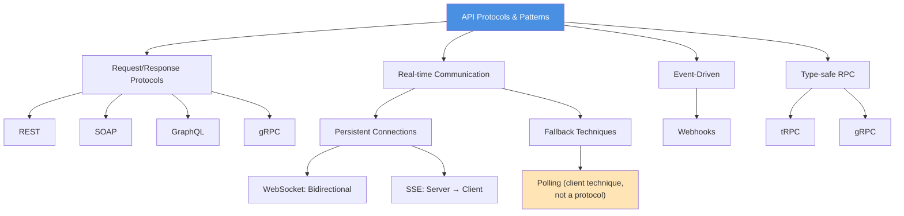

---

## Quick comparison matrix

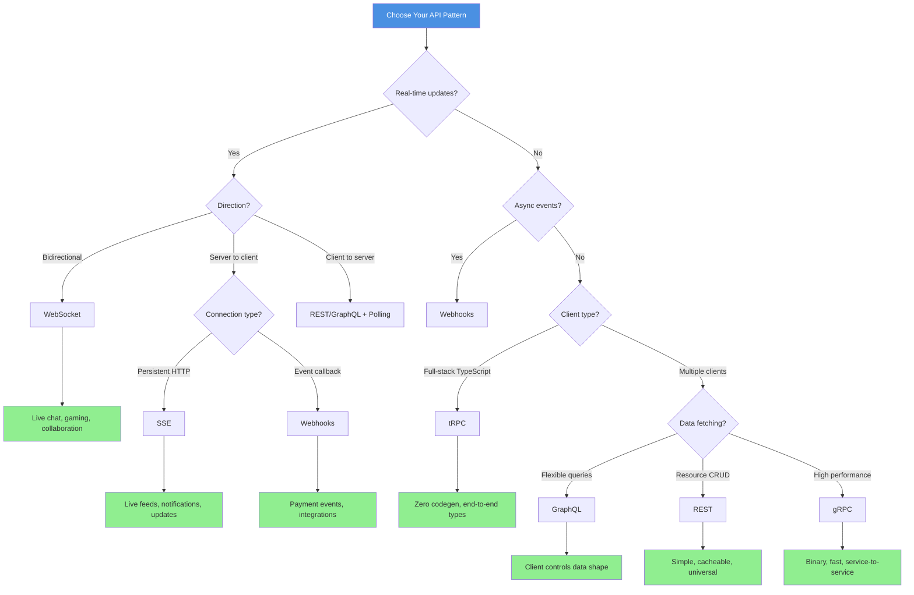

| Approach      | Best For                                     | Communication Pattern       | Type Safety         | Ecosystem       | Caching     |
| ------------- | -------------------------------------------- | --------------------------- | ------------------- | --------------- | ----------- |
| **REST**      | Public APIs, CRUD operations, simplicity     | Request/response            | Via codegen         | Universal       | HTTP-native |
| **SOAP**      | Enterprise integration, strict contracts     | Request/response            | Native (WSDL/XSD)   | Enterprise      | HTTP-native |
| **GraphQL**   | Flexible data fetching, mobile clients       | Request/response            | Via codegen         | Wide adoption   | Complex     |
| **WebSocket** | Real-time bidirectional, chat, collaboration | Persistent bidirectional    | Manual              | Broad support   | Manual      |
| **SSE**       | Server-to-client streaming, live feeds       | Persistent server push      | Manual              | Broad support   | HTTP-native |
| **Webhooks**  | Event notifications, async processing        | Event-driven callbacks      | Manual              | Universal       | N/A         |
| **gRPC**      | Service-to-service, high performance         | Request/response, streaming | Native (Protobuf)   | Cloud-native    | Manual      |
| **tRPC**      | Full-stack TypeScript, internal APIs         | Request/response            | Native (TypeScript) | TypeScript-only | HTTP-native |

:::note Polling: A Client-Side Technique, Not a Protocol

**Polling is not an API pattern** - it's a client-side strategy for checking updates by repeatedly calling an existing
API (REST, GraphQL, etc.). It's listed separately because it's a **fallback technique** when WebSocket/SSE aren't
available, not a peer to the protocols above.

:::

---

## REST: The universal standard

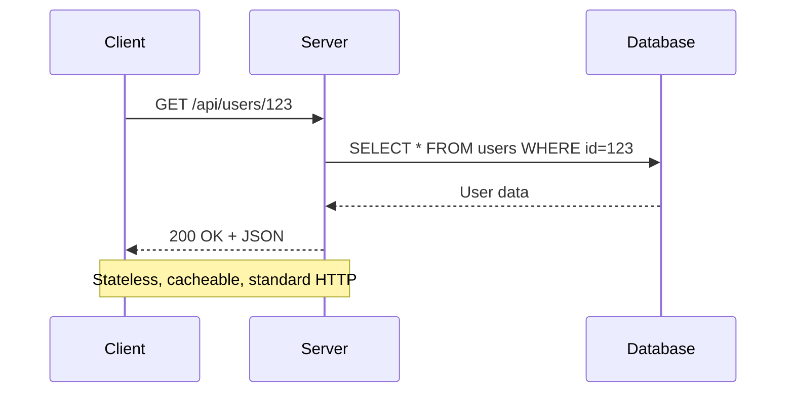

**What it is**: Architectural style using HTTP methods, status codes, and resource-oriented URLs.

**Core principles**

- **Resources** as nouns: `/users`, `/orders`, `/products/123`
- **HTTP verbs** for operations: `GET`, `POST`, `PUT`, `PATCH`, `DELETE`
- **Stateless**: Each request contains all needed information
- **Cacheable**: Leverage HTTP caching headers
- **Uniform interface**: Predictable conventions

### When to use REST

✅ **Best for:**

- Public APIs consumed by diverse clients
- Simple CRUD operations
- Strong HTTP caching requirements
- Teams familiar with web standards
- APIs that must work with any HTTP client

❌ **Not ideal for:**

- Complex, nested data requirements (over-fetching/under-fetching)
- Real-time bidirectional communication
- High-frequency, low-latency service-to-service calls

### REST example

```http
# List users with pagination
GET /api/users?limit=20&offset=0
Accept: application/json

HTTP/1.1 200 OK
Content-Type: application/json
Cache-Control: max-age=300

{
  "data": [
    { "id": "1", "name": "Alice", "email": "alice@example.com" },
    { "id": "2", "name": "Bob", "email": "bob@example.com" }
  ],
  "pagination": {
    "total": 150,
    "limit": 20,
    "offset": 0
  }
}
```

```http
# Create a new order
POST /api/orders
Content-Type: application/json

{
  "userId": "1",
  "items": [
    { "productId": "p-1", "quantity": 2 }
  ]
}

HTTP/1.1 201 Created
Location: /api/orders/o-123
Content-Type: application/json

{
  "id": "o-123",
  "userId": "1",
  "status": "pending",
  "createdAt": "2025-01-15T10:30:00Z"
}
```

### REST strengths & weaknesses

**Strengths:**

- ✅ Universal: works everywhere HTTP does
- ✅ Cacheable: HTTP caching is well-understood
- ✅ Simple: easy to learn, debug, and document
- ✅ Tooling: OpenAPI, Postman, curl
- ✅ Stateless: easy to scale horizontally

**Weaknesses:**

- ❌ Over-fetching: `/users/123` returns everything
- ❌ Under-fetching: need multiple requests for nested data
- ❌ No standard for real-time
- ❌ Versioning complexity (`/v1/users` vs media-type negotiation)

**See also:** [REST Best Practices](/rest-best-practices) for detailed guidance.

---

## SOAP: Enterprise protocol with strict contracts

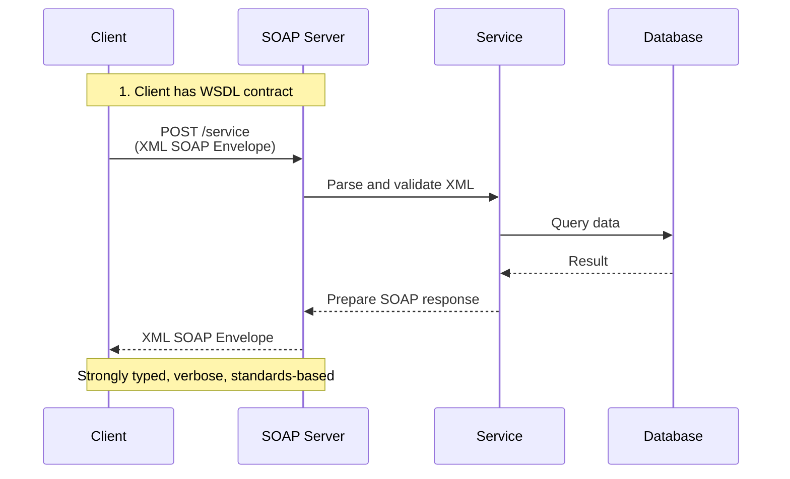

**What it is**: XML-based protocol for exchanging structured information with strict contracts defined in WSDL (Web
Services Description Language).

**Core principles**

- **XML-based**: All messages use XML format (verbose but self-describing)
- **WSDL contract**: Machine-readable interface definition
- **Envelope structure**: Header (metadata) + Body (payload) + optional Fault (errors)
- **WS-\* standards**: Built-in support for security (WS-Security), transactions (WS-Transaction), reliability
  (WS-ReliableMessaging)
- **Transport-agnostic**: Works over HTTP, SMTP, JMS, or other protocols
- **Strict typing**: XML Schema Definition (XSD) for strong type validation

### When to use SOAP

✅ **Best for:**

- **Enterprise integration** where strict contracts are required
- Banking and financial systems (security, transactions, compliance)
- Healthcare systems (HIPAA compliance, HL7 standards)
- Government and defense systems
- Legacy system integration
- When WS-\* standards are required (WS-Security, WS-Transaction)
- Distributed transactions across multiple services
- Systems requiring ACID guarantees

❌ **Not ideal for:**

- Public APIs for web/mobile apps (REST or GraphQL are simpler)
- High-performance scenarios (verbose XML overhead)
- Modern microservices (gRPC is more efficient)
- JavaScript-heavy frontends (JSON is easier)
- Simple CRUD operations (REST is overkill)
- Resource-constrained environments (XML parsing overhead)

### SOAP example

**WSDL definition:**

```xml
<?xml version="1.0" encoding="UTF-8"?>
<definitions name="UserService"
             targetNamespace="http://example.com/user"
             xmlns="http://schemas.xmlsoap.org/wsdl/"
             xmlns:soap="http://schemas.xmlsoap.org/wsdl/soap/"
             xmlns:tns="http://example.com/user"
             xmlns:xsd="http://www.w3.org/2001/XMLSchema">

  <!-- Types -->
  <types>
    <xsd:schema targetNamespace="http://example.com/user">
      <xsd:element name="GetUserRequest">
        <xsd:complexType>
          <xsd:sequence>
            <xsd:element name="userId" type="xsd:string"/>
          </xsd:sequence>
        </xsd:complexType>
      </xsd:element>

      <xsd:element name="GetUserResponse">
        <xsd:complexType>
          <xsd:sequence>
            <xsd:element name="user" type="tns:User"/>
          </xsd:sequence>
        </xsd:complexType>
      </xsd:element>

      <xsd:complexType name="User">
        <xsd:sequence>
          <xsd:element name="id" type="xsd:string"/>
          <xsd:element name="name" type="xsd:string"/>
          <xsd:element name="email" type="xsd:string"/>
        </xsd:sequence>
      </xsd:complexType>
    </xsd:schema>
  </types>

  <!-- Messages -->
  <message name="GetUserRequestMessage">
    <part name="parameters" element="tns:GetUserRequest"/>
  </message>

  <message name="GetUserResponseMessage">
    <part name="parameters" element="tns:GetUserResponse"/>
  </message>

  <!-- Port Type -->
  <portType name="UserServicePortType">
    <operation name="GetUser">
      <input message="tns:GetUserRequestMessage"/>
      <output message="tns:GetUserResponseMessage"/>
    </operation>
  </portType>

  <!-- Binding -->
  <binding name="UserServiceBinding" type="tns:UserServicePortType">
    <soap:binding transport="http://schemas.xmlsoap.org/soap/http"/>
    <operation name="GetUser">
      <soap:operation soapAction="http://example.com/user/GetUser"/>
      <input>
        <soap:body use="literal"/>
      </input>
      <output>
        <soap:body use="literal"/>
      </output>
    </operation>
  </binding>

  <!-- Service -->
  <service name="UserService">
    <port name="UserServicePort" binding="tns:UserServiceBinding">
      <soap:address location="http://localhost:8080/soap/user"/>
    </port>
  </service>
</definitions>
```

**SOAP request:**

```xml
POST /soap/user HTTP/1.1
Host: localhost:8080
Content-Type: text/xml; charset=utf-8
SOAPAction: "http://example.com/user/GetUser"

<?xml version="1.0" encoding="UTF-8"?>
<soap:Envelope xmlns:soap="http://schemas.xmlsoap.org/soap/envelope/"
               xmlns:user="http://example.com/user">
  <soap:Header>
    <!-- Optional: WS-Security, authentication, etc. -->
    <wsse:Security xmlns:wsse="http://docs.oasis-open.org/wss/2004/01/oasis-200401-wss-wssecurity-secext-1.0.xsd">
      <wsse:UsernameToken>
        <wsse:Username>admin</wsse:Username>
        <wsse:Password Type="PasswordText">secret</wsse:Password>
      </wsse:UsernameToken>
    </wsse:Security>
  </soap:Header>

  <soap:Body>
    <user:GetUserRequest>
      <user:userId>12345</user:userId>
    </user:GetUserRequest>
  </soap:Body>
</soap:Envelope>
```

**SOAP response:**

```xml
HTTP/1.1 200 OK
Content-Type: text/xml; charset=utf-8

<?xml version="1.0" encoding="UTF-8"?>
<soap:Envelope xmlns:soap="http://schemas.xmlsoap.org/soap/envelope/"
               xmlns:user="http://example.com/user">
  <soap:Body>
    <user:GetUserResponse>
      <user:user>
        <user:id>12345</user:id>
        <user:name>John Doe</user:name>
        <user:email>john@example.com</user:email>
      </user:user>
    </user:GetUserResponse>
  </soap:Body>
</soap:Envelope>
```

**SOAP fault (error):**

```xml
<?xml version="1.0" encoding="UTF-8"?>
<soap:Envelope xmlns:soap="http://schemas.xmlsoap.org/soap/envelope/">
  <soap:Body>
    <soap:Fault>
      <faultcode>soap:Client</faultcode>
      <faultstring>User not found</faultstring>
      <detail>
        <error xmlns="http://example.com/user">
          <code>USER_NOT_FOUND</code>
          <message>No user with ID 12345</message>
        </error>
      </detail>
    </soap:Fault>
  </soap:Body>
</soap:Envelope>
```

**Server (Python with Spyne):**

```python
from spyne import Application, rpc, ServiceBase, Unicode
from spyne.protocol.soap import Soap11
from spyne.server.wsgi import WsgiApplication

class User:
    def __init__(self, id, name, email):
        self.id = id
        self.name = name
        self.email = email

class UserService(ServiceBase):
    @rpc(Unicode, _returns=Unicode)
    def GetUser(ctx, userId):
        """Get user by ID"""
        # In production: query database
        if userId == "12345":
            return User(
                id=userId,
                name="John Doe",
                email="john@example.com"
            )
        else:
            raise Exception("User not found")

application = Application(
    [UserService],
    tns='http://example.com/user',
    in_protocol=Soap11(validator='lxml'),
    out_protocol=Soap11()
)

wsgi_application = WsgiApplication(application)
```

**Server (Java with JAX-WS):**

```java
import javax.jws.WebMethod;
import javax.jws.WebService;
import javax.xml.ws.Endpoint;

@WebService
public class UserService {

    @WebMethod
    public User getUser(String userId) {
        // In production: query database
        if ("12345".equals(userId)) {
            User user = new User();
            user.setId(userId);
            user.setName("John Doe");
            user.setEmail("john@example.com");
            return user;
        } else {
            throw new RuntimeException("User not found");
        }
    }

    public static void main(String[] args) {
        // Publish SOAP service
        Endpoint.publish("http://localhost:8080/soap/user", new UserService());
        System.out.println("SOAP service running at http://localhost:8080/soap/user");
    }
}

// User POJO
public class User {
    private String id;
    private String name;
    private String email;

    // Getters and setters
}
```

**Client (Python with zeep):**

```python
from zeep import Client

# Create client from WSDL
client = Client('http://localhost:8080/soap/user?wsdl')

# Call service
try:
    response = client.service.GetUser(userId='12345')
    print(f"User: {response.name} ({response.email})")
except Exception as e:
    print(f"Error: {e}")
```

**Client (Java):**

```java
import javax.xml.namespace.QName;
import javax.xml.ws.Service;
import java.net.URL;

public class UserClient {
    public static void main(String[] args) throws Exception {
        // WSDL location
        URL wsdlUrl = new URL("http://localhost:8080/soap/user?wsdl");

        // Service QName
        QName qname = new QName("http://example.com/user", "UserService");

        // Create service
        Service service = Service.create(wsdlUrl, qname);

        // Get port
        UserService userService = service.getPort(UserService.class);

        // Call method
        User user = userService.getUser("12345");
        System.out.println("User: " + user.getName() + " (" + user.getEmail() + ")");
    }
}
```

### SOAP strengths & weaknesses

**Strengths:**

- ✅ **Strict contracts**: WSDL provides machine-readable, enforceable contracts
- ✅ **Strong typing**: XML Schema ensures type safety and validation
- ✅ **WS-\* standards**: Built-in security, transactions, reliability, addressing
- ✅ **Enterprise ecosystem**: Mature tooling, widespread enterprise support
- ✅ **Protocol-agnostic**: Works over HTTP, SMTP, JMS, TCP
- ✅ **Error handling**: Structured SOAP Faults with detailed error information
- ✅ **Discoverability**: WSDL enables automatic client generation
- ✅ **Versioning**: WSDL versioning supports backward compatibility

**Weaknesses:**

- ❌ **Verbose**: XML is much larger than JSON (bandwidth overhead)
- ❌ **Complex**: Steep learning curve, complex tooling required
- ❌ **Performance**: XML parsing is slower than JSON or binary formats
- ❌ **Heavyweight**: Overkill for simple APIs
- ❌ **Poor browser support**: Not designed for JavaScript/browser clients
- ❌ **Tight coupling**: WSDL creates strong coupling between client and server
- ❌ **Limited HTTP features**: Doesn't leverage HTTP methods, status codes, caching
- ❌ **Declining ecosystem**: Less popular in modern development

### SOAP vs REST

| Feature             | SOAP                                 | REST                             |
| ------------------- | ------------------------------------ | -------------------------------- |
| **Protocol**        | Protocol (strict specification)      | Architectural style (guidelines) |
| **Format**          | XML only                             | JSON, XML, others                |
| **Contract**        | WSDL (formal contract)               | OpenAPI (optional documentation) |
| **Standards**       | WS-\* (Security, Transactions, etc.) | HTTP standards                   |
| **Complexity**      | High                                 | Low to medium                    |
| **Performance**     | Slower (XML overhead)                | Faster (JSON is lightweight)     |
| **Caching**         | Complex                              | HTTP caching works natively      |
| **State**           | Can be stateful or stateless         | Stateless                        |
| **Error handling**  | SOAP Faults (structured)             | HTTP status codes                |
| **Browser support** | Poor                                 | Excellent                        |
| **Tooling**         | Enterprise (Java, .NET)              | Universal                        |
| **Use case**        | Enterprise integration, banking      | Public APIs, web/mobile apps     |

**Use SOAP when:**

- You need strict contracts and formal validation
- Working in enterprise environments with existing SOAP infrastructure
- Require WS-\* standards (security, transactions, reliable messaging)
- Building banking, healthcare, or government systems with strict compliance
- Need protocol flexibility (HTTP, SMTP, JMS)

**Use REST when:**

- Building public APIs for web/mobile
- Simplicity and performance matter more than strict contracts
- Working with JavaScript/browser clients
- HTTP caching is important
- Team prefers modern, lightweight approaches

---

## GraphQL: Client-driven data fetching

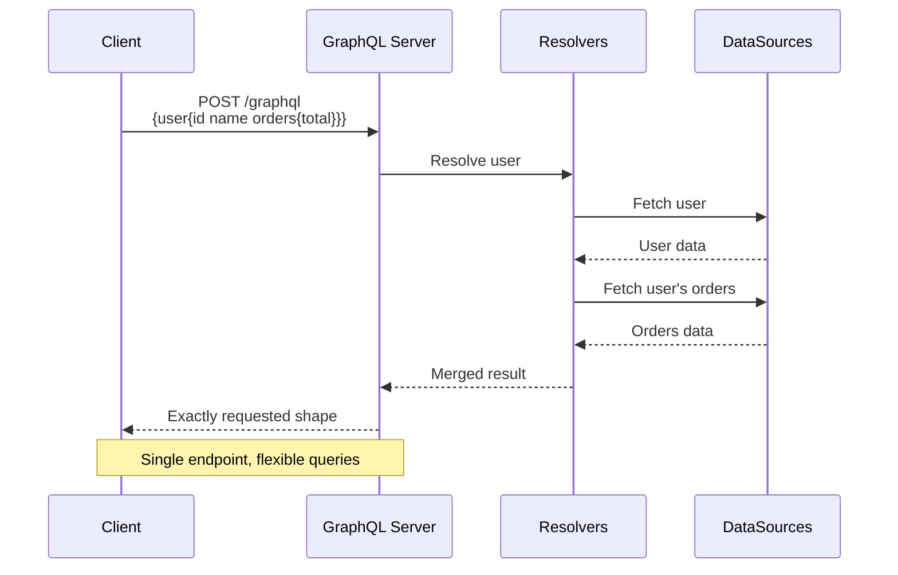

**What it is**: Query language where clients specify exactly what data they need in a single request.

**Core principles**

- **Single endpoint**: typically `/graphql`
- **Strongly typed schema**: defines all available data
- **Client specifies fields**: no over/under-fetching
- **Introspectable**: clients can discover the API
- **Hierarchical**: queries mirror UI component trees

### When to use GraphQL

✅ **Best for:**

- Mobile apps (reduces round-trips, bandwidth)
- Complex UIs with varied data needs
- Teams with diverse client applications
- Rapid frontend iteration without backend changes
- Aggregating multiple backend services

❌ **Not ideal for:**

- Simple CRUD APIs (REST is simpler)
- File uploads (multipart is awkward)
- HTTP caching (complexity increases)
- Real-time primary use case (subscriptions are complex)
- Teams unfamiliar with GraphQL patterns (learning curve)

### GraphQL example

**Schema:**

```graphql
type Query {
  user(id: ID!): User
}

type User {
  id: ID!
  name: String!
  email: String!
  orders(status: OrderStatus): [Order!]!
}

type Order {
  id: ID!
  total: Float!
  status: OrderStatus!
  items: [OrderItem!]!
}

enum OrderStatus {
  PENDING
  SHIPPED
  DELIVERED
}
```

**Query:**

```graphql
query GetUserDashboard($userId: ID!) {
  user(id: $userId) {
    id
    name
    orders(status: PENDING) {
      id
      total
      items {
        productName
        quantity
      }
    }
  }
}
```

**Response:**

```json
{
  "data": {
    "user": {
      "id": "1",
      "name": "Alice",
      "orders": [
        {
          "id": "o-123",
          "total": 49.99,
          "items": [{ "productName": "Keyboard", "quantity": 1 }]
        }
      ]
    }
  }
}
```

### GraphQL strengths & weaknesses

**Strengths:**

- ✅ No over-fetching: clients get exactly what they ask for
- ✅ No under-fetching: fetch nested data in one request
- ✅ Strongly typed: schema is contract
- ✅ Introspection: auto-generated docs
- ✅ Rapid frontend iteration: add fields without backend deploy

**Weaknesses:**

- ❌ Caching complexity: can't leverage HTTP cache as easily
- ❌ N+1 problem: requires DataLoader or similar
- ❌ Query complexity attacks: malicious queries can be expensive
- ❌ Learning curve: resolvers, schema design, authorization
- ❌ Overkill for simple APIs

**See also:** [GraphQL Best Practices](/graphql-best-practices) for detailed guidance.

---

## WebSocket: Real-time bidirectional

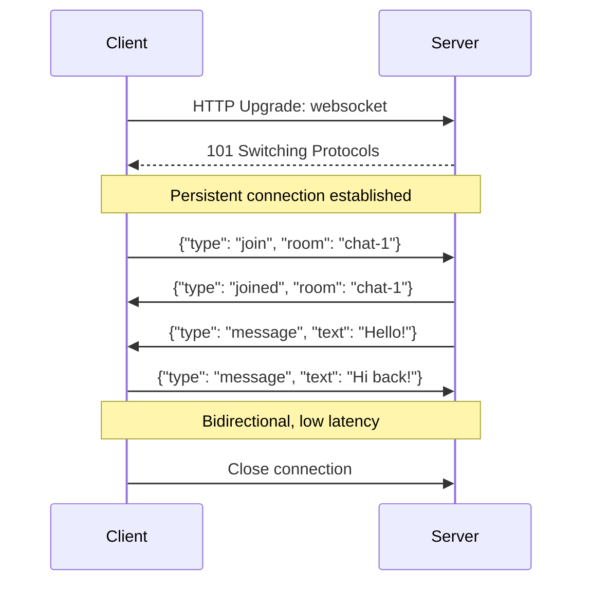

**What it is**: Full-duplex communication protocol over a single TCP connection.

**Core principles**

- **Persistent connection**: stays open for duration of session
- **Bidirectional**: server and client can both initiate messages
- **Low latency**: no HTTP overhead per message
- **Event-driven**: push updates without polling

### When to use WebSocket

✅ **Best for:**

- Chat applications
- Live collaboration (Google Docs, Figma)
- Real-time dashboards and monitoring
- Multiplayer games
- Live notifications

❌ **Not ideal for:**

- Simple request/response APIs (REST is simpler)
- Infrequent updates (polling or SSE may suffice)
- Scenarios requiring HTTP caching
- When clients are behind restrictive proxies

### WebSocket example

**Server (Node.js with ws):**

```javascript
const WebSocket = require('ws');
const wss = new WebSocket.Server({ port: 8080 });

wss.on('connection', (ws) => {
  console.log('Client connected');

  ws.on('message', (message) => {
    console.log('Received:', message);

    // Echo back
    ws.send(
      JSON.stringify({
        type: 'echo',
        data: message.toString(),
      })
    );

    // Broadcast to all clients
    wss.clients.forEach((client) => {
      if (client.readyState === WebSocket.OPEN) {
        client.send(
          JSON.stringify({
            type: 'broadcast',
            message: message.toString(),
          })
        );
      }
    });
  });

  ws.on('close', () => {
    console.log('Client disconnected');
  });
});
```

**Client (Browser):**

```javascript
const ws = new WebSocket('ws://localhost:8080');

ws.onopen = () => {
  console.log('Connected');
  ws.send(JSON.stringify({ type: 'join', room: 'chat-1' }));
};

ws.onmessage = (event) => {
  const data = JSON.parse(event.data);
  console.log('Received:', data);

  if (data.type === 'message') {
    displayMessage(data.text);
  }
};

ws.onerror = (error) => {
  console.error('WebSocket error:', error);
};

ws.onclose = () => {
  console.log('Disconnected');
};

// Send a message
function sendMessage(text) {
  ws.send(JSON.stringify({ type: 'message', text }));
}
```

### WebSocket strengths & weaknesses

**Strengths:**

- ✅ Low latency: no HTTP handshake per message
- ✅ Bidirectional: server can push without polling
- ✅ Efficient: single connection for many messages
- ✅ Real-time: perfect for live updates

**Weaknesses:**

- ❌ Statefulness: harder to scale (need sticky sessions or Redis)
- ❌ No HTTP benefits: no caching, no standard status codes
- ❌ Firewall/proxy issues: not all networks allow WebSocket
- ❌ Manual protocol: you define message format
- ❌ Connection management: reconnection, heartbeat, backpressure

---

## Server-Sent Events (SSE): Efficient server push

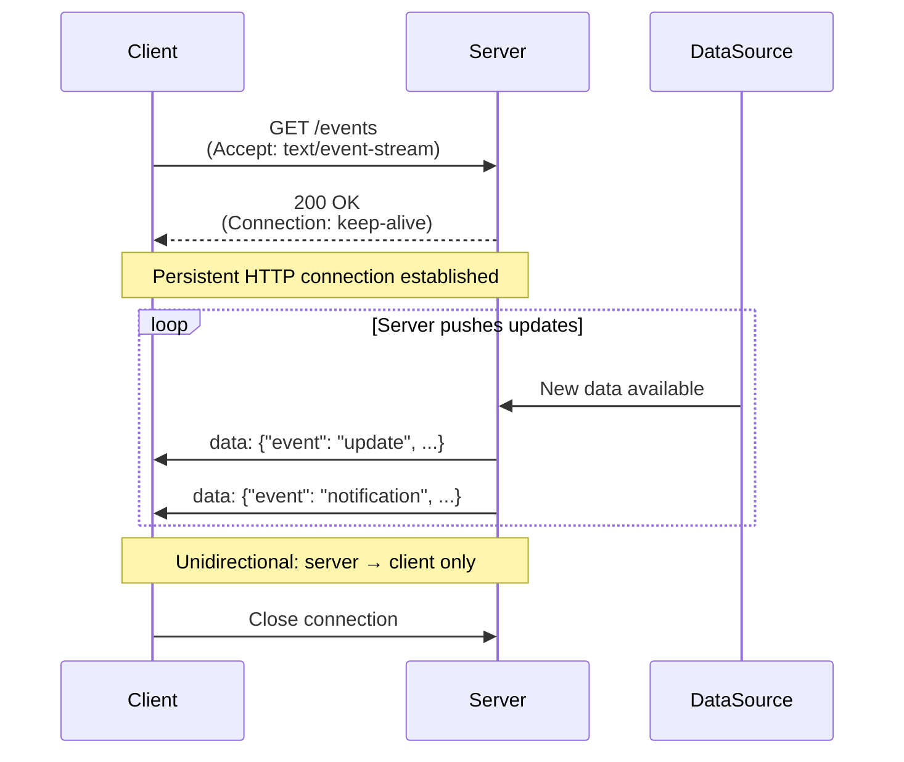

**What it is**: HTTP-based protocol for streaming real-time updates from server to client over a persistent connection.

**Core principles**

- **Unidirectional**: Server pushes to client; client must use separate requests for server communication
- **HTTP-based**: Uses standard HTTP; better firewall/proxy compatibility than WebSocket
- **Automatic reconnection**: Browser handles reconnection automatically
- **Event-driven**: Named events with structured data
- **Text-based**: Uses plain text protocol (easier debugging than binary)

### When to use SSE

✅ **Best for:**

- Live feeds (news, social media, sports scores)
- Real-time notifications (alerts, status updates)
- Progress tracking (uploads, long-running tasks)
- Live dashboards (metrics, monitoring)
- Server-initiated updates where client doesn't need to send frequent data
- Situations where WebSocket is blocked by firewalls/proxies

❌ **Not ideal for:**

- Bidirectional communication (use WebSocket)
- Binary data streaming (use WebSocket or gRPC)
- High-frequency updates (>1Hz; WebSocket is more efficient)
- IE11 support (not supported; use polyfill or WebSocket)

### SSE example

**Server (Express):**

```javascript
const express = require('express');
const app = express();

app.get('/events', (req, res) => {
  // Set SSE headers
  res.setHeader('Content-Type', 'text/event-stream');
  res.setHeader('Cache-Control', 'no-cache');
  res.setHeader('Connection', 'keep-alive');
  res.setHeader('X-Accel-Buffering', 'no'); // Disable nginx buffering

  // Send initial connection confirmation
  res.write('event: connected\n');
  res.write(`data: ${JSON.stringify({ clientId: Date.now() })}\n\n`);

  // Send periodic updates
  const intervalId = setInterval(() => {
    const data = {
      time: new Date().toISOString(),
      value: Math.random() * 100,
    };

    res.write('event: update\n');
    res.write(`data: ${JSON.stringify(data)}\n\n`);
  }, 2000);

  // Send custom events
  const notifyUser = (message) => {
    res.write('event: notification\n');
    res.write(`data: ${JSON.stringify({ message, timestamp: Date.now() })}\n\n`);
  };

  // Cleanup on client disconnect
  req.on('close', () => {
    clearInterval(intervalId);
    console.log('Client disconnected');
  });
});

app.listen(3000);
```

**Server (Python/FastAPI):**

```python
from fastapi import FastAPI
from fastapi.responses import StreamingResponse
import asyncio
import json

app = FastAPI()

async def event_generator():
    """Generate SSE events"""
    client_id = id(asyncio.current_task())

    # Send connection event
    yield f"event: connected\ndata: {json.dumps({'clientId': client_id})}\n\n"

    # Send periodic updates
    counter = 0
    while True:
        counter += 1
        data = {
            "time": datetime.now().isoformat(),
            "counter": counter
        }
        yield f"event: update\ndata: {json.dumps(data)}\n\n"
        await asyncio.sleep(2)

@app.get("/events")
async def events():
    return StreamingResponse(
        event_generator(),
        media_type="text/event-stream",
        headers={
            "Cache-Control": "no-cache",
            "X-Accel-Buffering": "no",
        }
    )
```

**Client (Browser):**

```javascript
const eventSource = new EventSource('/events');

// Handle specific event types
eventSource.addEventListener('connected', (event) => {
  const data = JSON.parse(event.data);
  console.log('Connected with ID:', data.clientId);
});

eventSource.addEventListener('update', (event) => {
  const data = JSON.parse(event.data);
  console.log('Received update:', data);
  updateDashboard(data);
});

eventSource.addEventListener('notification', (event) => {
  const data = JSON.parse(event.data);
  showNotification(data.message);
});

// Handle generic messages (no event type)
eventSource.onmessage = (event) => {
  console.log('Generic message:', event.data);
};

// Error handling
eventSource.onerror = (error) => {
  console.error('SSE error:', error);
  // Browser automatically tries to reconnect
};

// Manual close
function disconnect() {
  eventSource.close();
}
```

**Client (React Hook):**

```typescript
import { useEffect, useState } from 'react';

function useSSE<T>(url: string) {
  const [data, setData] = useState<T | null>(null);
  const [error, setError] = useState<Error | null>(null);

  useEffect(() => {
    const eventSource = new EventSource(url);

    eventSource.onmessage = (event) => {
      try {
        const parsed = JSON.parse(event.data) as T;
        setData(parsed);
        setError(null);
      } catch (err) {
        setError(err as Error);
      }
    };

    eventSource.onerror = () => {
      setError(new Error('SSE connection error'));
    };

    return () => {
      eventSource.close();
    };
  }, [url]);

  return { data, error };
}

// Usage
function LiveDashboard() {
  const { data, error } = useSSE<{ time: string; value: number }>('/events');

  if (error) return <div>Error: {error.message}</div>;
  if (!data) return <div>Connecting...</div>;

  return (
    <div>
      <p>Time: {data.time}</p>
      <p>Value: {data.value}</p>
    </div>
  );
}
```

### SSE strengths & weaknesses

**Strengths:**

- ✅ **Simple**: Uses standard HTTP; easier to implement than WebSocket
- ✅ **Automatic reconnection**: Browser handles reconnection with `Last-Event-ID`
- ✅ **HTTP-compatible**: Works with HTTP/2, HTTP caching, standard proxies
- ✅ **Better firewall compatibility**: No special protocol upgrade needed
- ✅ **Named events**: Built-in event types for organized message handling
- ✅ **Text-based**: Easy to debug with browser DevTools

**Weaknesses:**

- ❌ **Unidirectional**: Only server → client (client must use REST for requests)
- ❌ **Text only**: Binary data requires Base64 encoding
- ❌ **Browser connection limits**: Limited concurrent connections per domain (6 in most browsers)
- ❌ **No IE11 support**: Requires polyfill for older browsers
- ❌ **Less efficient than WebSocket**: HTTP overhead per message

### SSE vs WebSocket

| Feature                 | SSE                              | WebSocket                   |
| ----------------------- | -------------------------------- | --------------------------- |
| **Direction**           | Unidirectional (server → client) | Bidirectional               |
| **Protocol**            | HTTP                             | ws:// protocol              |
| **Reconnection**        | Automatic                        | Manual                      |
| **Proxy compatibility** | Excellent                        | Can be problematic          |
| **Data format**         | Text                             | Text or binary              |
| **Overhead**            | Medium                           | Low                         |
| **Browser support**     | Modern browsers                  | All modern browsers         |
| **Use case**            | Live feeds, notifications        | Chat, gaming, collaboration |

**Use SSE when:** You only need server-to-client updates and want simplicity and better HTTP compatibility.

**Use WebSocket when:** You need bidirectional communication or high-frequency updates.

---

## Polling: Client-side fallback technique

:::caution Not an API Protocol

**Polling is not an API pattern or protocol** - it's a **client-side technique** for checking updates by repeatedly
calling an existing API. You don't "build a Polling API"; you build a REST/GraphQL/SOAP API that clients happen to poll.

Polling should be viewed as a **last resort** when better real-time methods (WebSocket, SSE, Webhooks) aren't available.

:::

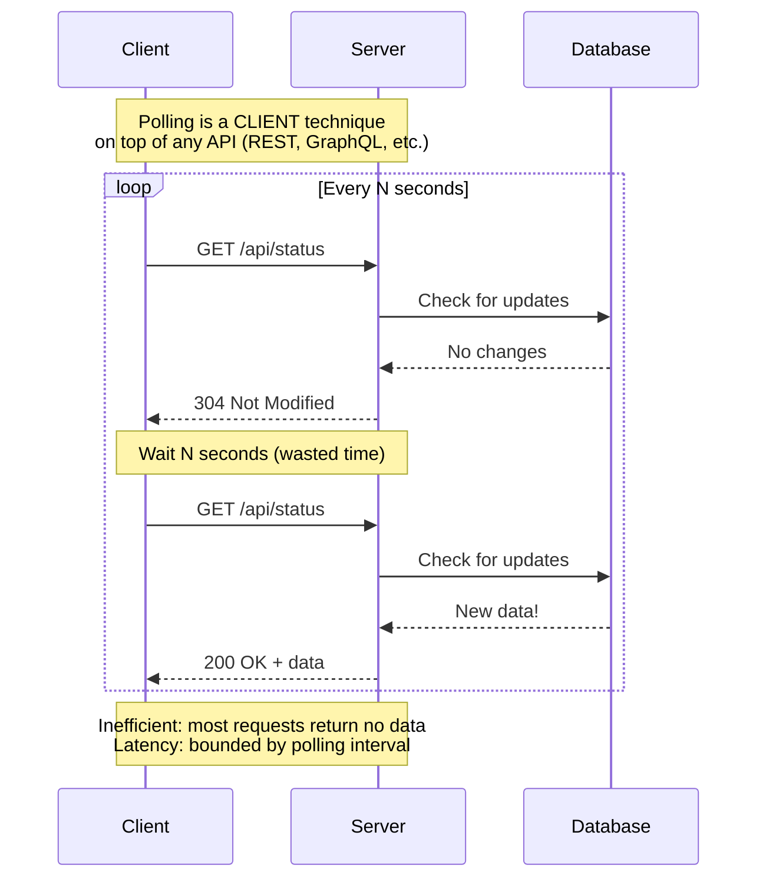

**What it is**: A client-side strategy where the client repeatedly requests updates from a server at regular intervals,
regardless of whether new data is available.

**Key characteristics:**

- **Not a protocol**: Polling is a technique applied to existing APIs (REST, GraphQL, SOAP)
- **Client-driven**: Client decides when to check; server has no control
- **Stateless**: Each request is independent (inherits from underlying API)
- **Inefficient**: Most requests return "no changes"
- **Latency**: Update delay equals polling interval (e.g., 5-second polling = 5-second max delay)

### Types of polling

**1. Short polling (simple/naive):**

```javascript
// Client repeatedly calls REST API
function startPolling() {
  setInterval(async () => {
    const response = await fetch('/api/orders/status');
    const data = await response.json();

    if (data.status === 'completed') {
      handleComplete(data);
    }
  }, 5000); // Check every 5 seconds
}
```

**2. Long polling (more efficient):**

```javascript
// Server holds request until data available or timeout
async function longPoll() {
  try {
    const response = await fetch('/api/updates', {
      signal: AbortSignal.timeout(30000), // 30 second timeout
    });
    const data = await response.json();
    handleUpdate(data);
  } catch (error) {
    if (error.name !== 'TimeoutError') {
      console.error('Error:', error);
    }
  }

  // Immediately reconnect
  longPoll();
}

// Server side (Express)
app.get('/api/updates', async (req, res) => {
  const waitForUpdate = () => {
    return new Promise((resolve) => {
      const interval = setInterval(() => {
        const update = checkForUpdates();
        if (update) {
          clearInterval(interval);
          resolve(update);
        }
      }, 1000);

      setTimeout(() => {
        clearInterval(interval);
        resolve(null); // Timeout
      }, 30000);
    });
  };

  const update = await waitForUpdate();
  res.json(update || { hasUpdate: false });
});
```

### When polling makes sense

✅ **Use polling ONLY when:**

- WebSocket/SSE are **blocked by firewalls/proxies** and you have no control
- Infrastructure **doesn't support persistent connections**
- Updates are **infrequent** (>30 seconds between checks)
- Building a **quick prototype** before implementing real-time properly
- **Legacy clients** that can't use modern protocols
- **Simplicity is critical** and real-time isn't (rare)

❌ **Don't use polling for:**

- Frequent updates (&lt;10 seconds) - use WebSocket/SSE instead
- Real-time user experiences - users will notice the lag
- High user count - server load becomes unmanageable
- Mobile apps - battery drain is significant
- Any scenario where WebSocket/SSE work - they're always better

### Why polling is problematic

| Problem               | Impact                                            | Better Alternative           |
| --------------------- | ------------------------------------------------- | ---------------------------- |
| **Wasted requests**   | 90%+ of polls return "no changes"                 | WebSocket/SSE (server push)  |
| **Server load**       | N clients × 1 req/5sec = massive unnecessary load | WebSocket/SSE (1 connection) |
| **Latency**           | 5-second polling = up to 5-second delay           | WebSocket/SSE (instant)      |
| **Battery drain**     | Constant network requests on mobile               | WebSocket/SSE (persistent)   |
| **Scalability**       | Doesn't scale; overwhelms servers                 | Webhooks (server-controlled) |
| **Network bandwidth** | Repeated HTTP overhead                            | WebSocket (low overhead)     |

### Polling best practices (if you must)

If you're forced to use polling despite its drawbacks:

1. **Use exponential backoff**: Increase interval if no changes detected

   ```javascript
   let interval = 1000; // Start at 1 second
   const maxInterval = 60000; // Cap at 60 seconds

   async function smartPoll() {
     const response = await fetch('/api/status');
     const data = await response.json();

     if (data.hasChanges) {
       handleChanges(data);
       interval = 1000; // Reset to fast polling
     } else {
       interval = Math.min(interval * 1.5, maxInterval); // Slow down
     }

     setTimeout(smartPoll, interval);
   }
   ```

2. **Use HTTP caching**: Leverage `ETag` and `If-None-Match`

   ```javascript
   let etag = null;

   async function pollWithETag() {
     const headers = {};
     if (etag) {
       headers['If-None-Match'] = etag;
     }

     const response = await fetch('/api/data', { headers });

     if (response.status === 304) {
       // No changes, save bandwidth
       return;
     }

     etag = response.headers.get('ETag');
     const data = await response.json();
     handleData(data);
   }
   ```

3. **Poll only when visible**: Stop polling on inactive tabs

   ```javascript
   function startVisibilityAwarePolling() {
     let intervalId;

     function poll() {
       if (document.hidden) return; // Skip if tab hidden
       fetchUpdates();
     }

     document.addEventListener('visibilitychange', () => {
       if (document.hidden) {
         clearInterval(intervalId); // Stop polling
       } else {
         intervalId = setInterval(poll, 5000); // Resume
       }
     });

     intervalId = setInterval(poll, 5000);
   }
   ```

4. **Add jitter**: Prevent thundering herd

   ```javascript
   function pollWithJitter(baseInterval = 5000) {
     const jitter = Math.random() * 1000; // 0-1 second random delay
     setTimeout(async () => {
       await fetchUpdates();
       pollWithJitter(baseInterval);
     }, baseInterval + jitter);
   }
   ```

### Polling migration path

**Phase 1: Start with polling** (if you must)

```javascript
// Simple polling for MVP
setInterval(() => fetch('/api/status'), 5000);
```

**Phase 2: Optimize polling**

```javascript
// Add caching, exponential backoff, visibility detection
smartPollingWithCaching();
```

**Phase 3: Introduce real-time (recommended)**

```javascript
// Use WebSocket/SSE, fall back to polling
if ('WebSocket' in window) {
  const ws = new WebSocket('ws://api.example.com');
  ws.onmessage = handleUpdate;
} else {
  startPolling(); // Fallback
}
```

**Phase 4: Remove polling entirely**

```javascript
// Pure WebSocket/SSE
const eventSource = new EventSource('/events');
eventSource.onmessage = handleUpdate;
```

:::tip Migration Strategy

Treat polling as **technical debt**. Start with it if needed for speed, but plan to replace it with WebSocket/SSE as
soon as feasible. Real-time protocols are not just "nice to have" - they're fundamentally more efficient, scalable, and
provide better UX.

:::

---

## Webhooks: Event-driven callbacks

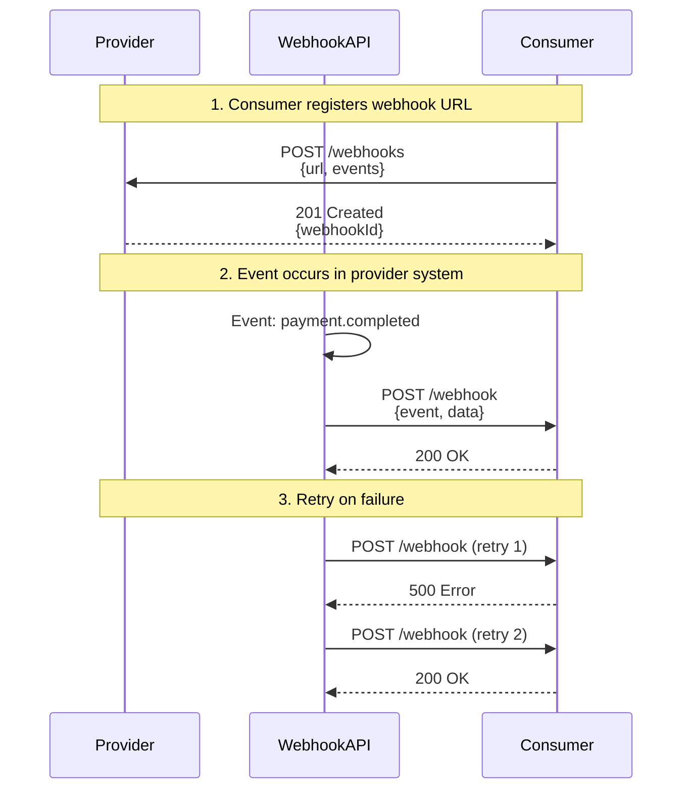

**What it is**: HTTP callbacks where your system receives real-time event notifications by providing a URL for external
systems to POST data to.

**Core principles**

- **Event-driven**: Consumer registers interest; provider notifies when events occur
- **Asynchronous**: No persistent connection; provider makes HTTP requests when events happen
- **Decoupled**: Consumer and provider don't need to be online simultaneously
- **Reliable delivery**: Typically includes retry logic and delivery guarantees
- **Security**: Uses signatures/tokens to verify authenticity

### When to use Webhooks

✅ **Best for:**

- Payment processing events (Stripe, PayPal)
- CI/CD triggers (GitHub, GitLab)
- Third-party integrations (Slack, Discord)
- Asynchronous workflows (order fulfilled, file processed)
- Event notifications where consumer can't maintain persistent connection
- System-to-system event propagation

❌ **Not ideal for:**

- High-frequency events (>100/sec; use message queue instead)
- Real-time user-facing features (use WebSocket or SSE)
- When consumer can't expose public endpoint
- Bidirectional communication (use WebSocket)
- Synchronous request/response (use REST)

### Webhook example

**Provider (Event emitter):**

```javascript
const express = require('express');
const crypto = require('crypto');
const axios = require('axios');

class WebhookManager {
  constructor() {
    this.webhooks = new Map(); // In production: use database
    this.secret = process.env.WEBHOOK_SECRET;
  }

  // Register webhook
  async register(url, events) {
    const id = `wh_${Date.now()}`;
    this.webhooks.set(id, { url, events, createdAt: new Date() });
    return { id, url, events };
  }

  // Generate signature for security
  generateSignature(payload) {
    return crypto.createHmac('sha256', this.secret).update(JSON.stringify(payload)).digest('hex');
  }

  // Send webhook with retry logic
  async send(event, data, retries = 3) {
    const subscribers = Array.from(this.webhooks.values()).filter((wh) => wh.events.includes(event));

    for (const webhook of subscribers) {
      const payload = {
        event,
        data,
        timestamp: new Date().toISOString(),
        webhookId: webhook.id,
      };

      const signature = this.generateSignature(payload);

      for (let attempt = 1; attempt <= retries; attempt++) {
        try {
          await axios.post(webhook.url, payload, {
            headers: {
              'Content-Type': 'application/json',
              'X-Webhook-Signature': signature,
              'X-Webhook-Event': event,
            },
            timeout: 5000,
          });

          console.log(`Webhook delivered to ${webhook.url}`);
          break; // Success
        } catch (error) {
          console.error(`Webhook delivery failed (attempt ${attempt}):`, error.message);

          if (attempt === retries) {
            // Store for later retry or notify admin
            await this.handleFailedWebhook(webhook, payload, error);
          } else {
            // Exponential backoff
            await new Promise((resolve) => setTimeout(resolve, Math.pow(2, attempt) * 1000));
          }
        }
      }
    }
  }

  async handleFailedWebhook(webhook, payload, error) {
    // Store in dead letter queue, send alert, etc.
    console.error('Webhook permanently failed:', { webhook, payload, error });
  }
}

// Usage
const app = express();
const webhookManager = new WebhookManager();

// Register webhook endpoint
app.post('/webhooks', async (req, res) => {
  const { url, events } = req.body;

  if (!url || !events) {
    return res.status(400).json({ error: 'url and events required' });
  }

  const webhook = await webhookManager.register(url, events);
  res.status(201).json(webhook);
});

// Trigger event
app.post('/payments/:id/complete', async (req, res) => {
  const payment = { id: req.params.id, status: 'completed', amount: 100 };

  // Emit webhook event
  await webhookManager.send('payment.completed', payment);

  res.json({ success: true, payment });
});
```

**Consumer (Event receiver):**

```javascript
const express = require('express');
const crypto = require('crypto');

const app = express();
app.use(express.json());

const WEBHOOK_SECRET = process.env.WEBHOOK_SECRET;

// Verify webhook signature
function verifySignature(payload, signature) {
  const expectedSignature = crypto.createHmac('sha256', WEBHOOK_SECRET).update(JSON.stringify(payload)).digest('hex');

  return crypto.timingSafeEqual(Buffer.from(signature), Buffer.from(expectedSignature));
}

// Receive webhook
app.post('/webhook', (req, res) => {
  const signature = req.headers['x-webhook-signature'];
  const event = req.headers['x-webhook-event'];

  // Verify signature
  if (!signature || !verifySignature(req.body, signature)) {
    console.error('Invalid webhook signature');
    return res.status(401).json({ error: 'Invalid signature' });
  }

  // Process event
  try {
    handleWebhookEvent(event, req.body);

    // Acknowledge receipt immediately
    res.status(200).json({ received: true });
  } catch (error) {
    console.error('Webhook processing error:', error);
    // Return 500 to trigger retry
    res.status(500).json({ error: 'Processing failed' });
  }
});

function handleWebhookEvent(event, payload) {
  console.log(`Processing event: ${event}`, payload);

  switch (event) {
    case 'payment.completed':
      // Process payment completion
      processPayment(payload.data);
      break;

    case 'order.shipped':
      // Send shipping notification
      notifyCustomer(payload.data);
      break;

    default:
      console.log('Unknown event type:', event);
  }
}
```

**Consumer (TypeScript with queue):**

```typescript
import { Router } from 'express';
import { Queue } from 'bull';

const webhookQueue = new Queue('webhooks', process.env.REDIS_URL);

// Webhook receiver - responds quickly, processes async
router.post('/webhook', async (req, res) => {
  // Verify signature (same as above)
  if (!verifySignature(req.body, req.headers['x-webhook-signature'])) {
    return res.status(401).json({ error: 'Invalid signature' });
  }

  // Queue for processing (don't block webhook response)
  await webhookQueue.add({
    event: req.headers['x-webhook-event'],
    payload: req.body,
    receivedAt: new Date(),
  });

  // Respond immediately
  res.status(200).json({ received: true });
});

// Process webhooks from queue
webhookQueue.process(async (job) => {
  const { event, payload } = job.data;

  try {
    await handleWebhookEvent(event, payload);
  } catch (error) {
    console.error('Webhook processing failed:', error);
    throw error; // Retry via Bull
  }
});
```

### Webhook strengths & weaknesses

**Strengths:**

- ✅ **Decoupled**: No persistent connection required
- ✅ **Scalable**: Provider controls delivery rate
- ✅ **Universal**: Works with any HTTP-capable system
- ✅ **Reliable**: Retry logic ensures delivery
- ✅ **Simple**: Standard HTTP POST requests
- ✅ **Asynchronous**: Consumer can process at their own pace

**Weaknesses:**

- ❌ **Requires public endpoint**: Consumer must be reachable from internet
- ❌ **Security complexity**: Must verify signatures, handle replay attacks
- ❌ **Delivery not guaranteed**: Even with retries, can fail
- ❌ **Order not guaranteed**: Events may arrive out of order
- ❌ **Debugging difficulty**: Hard to trace failed deliveries
- ❌ **No real-time feedback**: Provider doesn't know if processing succeeded

### Webhook best practices

**For providers:**

1. **Implement retry logic** with exponential backoff (e.g., 1min, 5min, 30min)
2. **Sign payloads** using HMAC-SHA256 to ensure authenticity
3. **Include event type** in header for routing
4. **Provide webhook logs** for debugging
5. **Support webhook testing** endpoint
6. **Document payload schema** thoroughly
7. **Use idempotency keys** to handle duplicates

**For consumers:**

1. **Verify signatures** on every webhook
2. **Respond quickly** (< 5 seconds); process async if needed
3. **Handle duplicate events** idempotently
4. **Use queue** for processing (don't block HTTP response)
5. **Log everything** for debugging
6. **Validate payload** before processing
7. **Monitor webhook health** and alert on failures

### Webhooks vs alternatives

| Feature               | Webhooks              | Polling                  | WebSocket               | SSE                   |
| --------------------- | --------------------- | ------------------------ | ----------------------- | --------------------- |
| **Direction**         | Provider → Consumer   | Consumer → Provider      | Bidirectional           | Provider → Consumer   |
| **Connection**        | None (HTTP callbacks) | None (periodic requests) | Persistent              | Persistent            |
| **Latency**           | Low (event-driven)    | High (polling interval)  | Very low                | Low                   |
| **Public endpoint**   | Required              | Not required             | Not required            | Not required          |
| **Scalability**       | High                  | Low (polling overhead)   | Medium (connections)    | Medium (connections)  |
| **Reliability**       | Good (with retries)   | Excellent                | Good                    | Good                  |
| **Delivery ordering** | Not guaranteed        | Guaranteed               | Guaranteed              | Guaranteed            |
| **Use case**          | Event notifications   | Check for updates        | Real-time bidirectional | Real-time server push |

**Use Webhooks when:** You need event-driven notifications between systems that don't maintain persistent connections.

**Use Polling when:** Consumer can't expose public endpoint or events are infrequent.

**Use WebSocket/SSE when:** You need real-time user-facing updates with persistent connections.

---

## gRPC: High-performance RPC

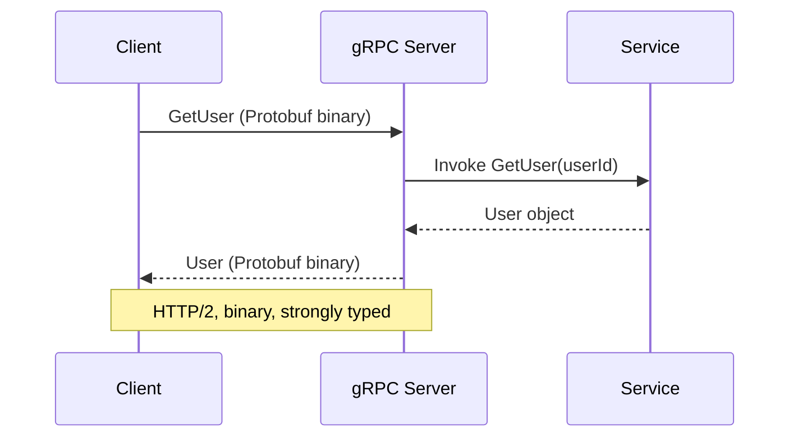

**What it is**: High-performance RPC framework using Protocol Buffers and HTTP/2.

**Core principles**

- **Protocol Buffers**: binary serialization (smaller, faster than JSON)
- **HTTP/2**: multiplexing, streaming, efficient
- **Code generation**: client/server stubs from `.proto` files
- **Streaming**: unary, server-streaming, client-streaming, bidirectional

### When to use gRPC

✅ **Best for:**

- **Service-to-service** communication (microservices)
- High-throughput, low-latency requirements
- Polyglot environments (multi-language)
- Streaming data (logs, metrics, video)
- Internal APIs with strong contracts

❌ **Not ideal for:**

- Browser clients (limited support, needs grpc-web proxy)
- Public APIs (REST/GraphQL are more accessible)
- Teams unfamiliar with Protobuf
- When human-readable payloads are critical

### gRPC example

**Proto definition:**

```protobuf
syntax = "proto3";

package user;

service UserService {
  rpc GetUser (GetUserRequest) returns (User);
  rpc ListUsers (ListUsersRequest) returns (stream User);
}

message GetUserRequest {
  string user_id = 1;
}

message User {
  string id = 1;
  string name = 2;
  string email = 3;
}

message ListUsersRequest {
  int32 page_size = 1;
  string page_token = 2;
}
```

**Server (Node.js):**

```javascript
const grpc = require('@grpc/grpc-js');
const protoLoader = require('@grpc/proto-loader');

const packageDefinition = protoLoader.loadSync('user.proto');
const proto = grpc.loadPackageDefinition(packageDefinition).user;

const users = [
  { id: '1', name: 'Alice', email: 'alice@example.com' },
  { id: '2', name: 'Bob', email: 'bob@example.com' },
];

function getUser(call, callback) {
  const user = users.find((u) => u.id === call.request.user_id);
  if (user) {
    callback(null, user);
  } else {
    callback({
      code: grpc.status.NOT_FOUND,
      message: 'User not found',
    });
  }
}

function listUsers(call) {
  users.forEach((user) => {
    call.write(user);
  });
  call.end();
}

const server = new grpc.Server();
server.addService(proto.UserService.service, {
  getUser,
  listUsers,
});

server.bindAsync('0.0.0.0:50051', grpc.ServerCredentials.createInsecure(), () => server.start());
```

**Client (Node.js):**

```javascript
const client = new proto.UserService('localhost:50051', grpc.credentials.createInsecure());

// Unary call
client.getUser({ user_id: '1' }, (error, user) => {
  if (error) {
    console.error('Error:', error.message);
  } else {
    console.log('User:', user);
  }
});

// Streaming call
const call = client.listUsers({ page_size: 10 });
call.on('data', (user) => {
  console.log('Received user:', user);
});
call.on('end', () => {
  console.log('Stream ended');
});
```

### gRPC strengths & weaknesses

**Strengths:**

- ✅ Fast: binary Protobuf is compact and efficient
- ✅ Streaming: first-class support for all streaming patterns
- ✅ Type-safe: strong contracts via Protobuf
- ✅ HTTP/2: multiplexing, header compression
- ✅ Multi-language: official support for 10+ languages

**Weaknesses:**

- ❌ Browser support: requires grpc-web and proxy
- ❌ Not human-readable: binary payloads
- ❌ Tooling: curl doesn't work (need grpcurl)
- ❌ Learning curve: Protobuf syntax, code generation
- ❌ Overkill for simple APIs

---

## tRPC: End-to-end TypeScript RPC

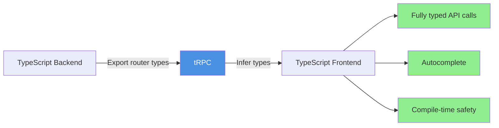

**What it is**: TypeScript-first RPC framework that infers types from backend to frontend without code generation.

**Core principles**

- **End-to-end type safety**: backend types flow to frontend automatically
- **No code generation**: uses TypeScript inference
- **RPC-style**: call backend functions like local functions
- **HTTP-based**: uses standard HTTP requests (works with REST caching)

### When to use tRPC

✅ **Best for:**

- **Full-stack TypeScript** projects (Next.js, etc.)
- Internal APIs where client and server are in same repo
- Teams that want type safety without codegen
- Rapid development with strong contracts
- Monorepo projects

❌ **Not ideal for:**

- Public APIs consumed by non-TypeScript clients
- Polyglot environments (Python, Go, etc.)
- When you need REST/GraphQL conventions
- Browser-only frontends with separate backend team

### tRPC example

**Backend (server):**

```typescript
// server/routers/user.ts
import { z } from 'zod';
import { router, publicProcedure } from '../trpc';

export const userRouter = router({
  // Query: read operation
  getUser: publicProcedure.input(z.object({ id: z.string() })).query(async ({ input }) => {
    const user = await db.user.findUnique({
      where: { id: input.id },
    });

    if (!user) {
      throw new TRPCError({
        code: 'NOT_FOUND',
        message: 'User not found',
      });
    }

    return user;
  }),

  // Mutation: write operation
  createUser: publicProcedure
    .input(
      z.object({
        email: z.string().email(),
        name: z.string().min(1),
      })
    )
    .mutation(async ({ input }) => {
      return await db.user.create({
        data: input,
      });
    }),

  // Subscription: real-time updates
  onUserUpdated: publicProcedure.input(z.object({ userId: z.string() })).subscription(async function* ({ input }) {
    // Yield updates as they happen
    for await (const update of userUpdateStream(input.userId)) {
      yield update;
    }
  }),
});
```

**Frontend (client):**

```typescript
import { trpc } from './trpc';

function UserProfile({ userId }: { userId: string }) {
  // Fully typed! TypeScript knows return type
  const { data, isLoading, error } = trpc.user.getUser.useQuery({
    id: userId,
  });

  const createUserMutation = trpc.user.createUser.useMutation();

  const handleCreate = async () => {
    // TypeScript validates this at compile time!
    const newUser = await createUserMutation.mutateAsync({
      email: 'new@example.com',
      name: 'New User',
    });

    console.log('Created:', newUser.id); // ✅ Fully typed
  };

  if (isLoading) return <div>Loading...</div>;
  if (error) return <div>Error: {error.message}</div>;

  return (
    <div>
      <h1>{data.name}</h1> {/* ✅ TypeScript knows `data` has `name` */}
      <p>{data.email}</p>
    </div>
  );
}
```

### tRPC strengths & weaknesses

**Strengths:**

- ✅ Zero codegen: types flow automatically
- ✅ End-to-end type safety: backend changes break frontend at compile time
- ✅ Developer experience: autocomplete, inline errors
- ✅ Simple: just TypeScript functions
- ✅ HTTP-based: can leverage caching, CDN

**Weaknesses:**

- ❌ TypeScript only: no other language support
- ❌ Not suitable for public APIs
- ❌ Less ecosystem than REST/GraphQL
- ❌ Requires shared types (monorepo or published types)
- ❌ Learning curve for RPC patterns

---

## Comparison deep-dive

### Performance

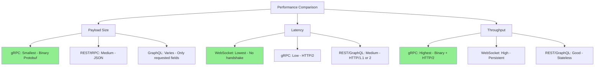

| Approach      | Payload Size   | Latency     | Throughput | Best For                |
| ------------- | -------------- | ----------- | ---------- | ----------------------- |
| **REST**      | Medium (JSON)  | Medium      | Good       | General-purpose         |
| **SOAP**      | Large (XML)    | High        | Poor       | Enterprise integration  |
| **GraphQL**   | Optimized      | Medium      | Good       | Flexible data fetching  |
| **WebSocket** | Small          | Very Low    | Very High  | Real-time bidirectional |
| **SSE**       | Medium (text)  | Low         | High       | Server → client updates |
| **Webhooks**  | Medium (JSON)  | Low (async) | High       | Event notifications     |
| **gRPC**      | Small (binary) | Low         | Very High  | Service-to-service      |
| **tRPC**      | Medium (JSON)  | Medium      | Good       | TypeScript apps         |

:::note About Polling

**Polling is not listed** because it's a client technique, not a protocol. Its performance characteristics depend on the
underlying API (REST, GraphQL, etc.) and polling interval. Polling is always less efficient than WebSocket/SSE for
real-time needs.

:::

### Caching

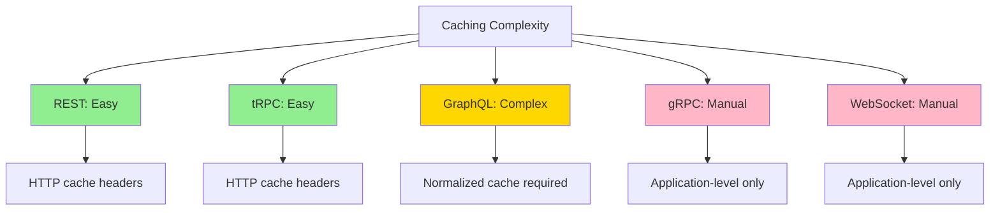

- **REST**: HTTP caching works out of the box (`Cache-Control`, `ETag`)
- **SOAP**: HTTP caching possible but complex (XML parsing, SOAP headers)
- **tRPC**: HTTP caching works (uses GET for queries)
- **SSE**: HTTP-based but typically uncached (streaming)
- **GraphQL**: Complex; requires normalized cache (Apollo Client)
- **gRPC**: No HTTP cache; need application-level caching
- **WebSocket**: No HTTP cache; manual state management
- **Webhooks**: N/A (push notifications, not cached)

**Note:** Polling inherits caching from the underlying API (REST with caching = pollable with caching).

### Type safety

| Approach      | Type Safety | Method                    | Compile-time? |
| ------------- | ----------- | ------------------------- | ------------- |
| **REST**      | Optional    | OpenAPI → codegen         | ❌ (runtime)  |
| **SOAP**      | Strong      | WSDL/XSD → codegen        | ✅            |
| **GraphQL**   | Strong      | Schema → codegen          | ❌ (runtime)  |
| **gRPC**      | Strong      | Protobuf → codegen        | ✅            |
| **tRPC**      | Strong      | TypeScript inference      | ✅            |
| **WebSocket** | Manual      | Custom message validation | ❌            |
| **SSE**       | Manual      | Custom event validation   | ❌            |
| **Webhooks**  | Optional    | Schema validation         | ❌            |

**Note:** Polling inherits type safety from the underlying API being polled.

### Learning curve

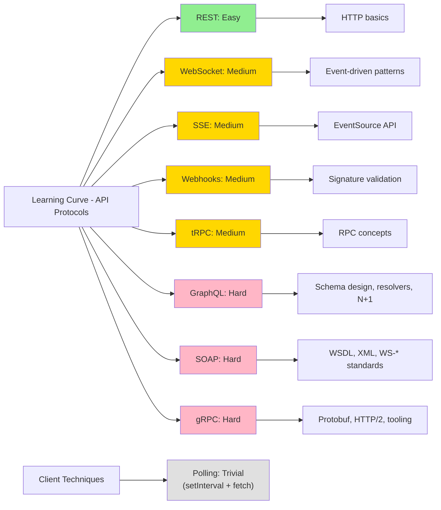

---

## Decision framework

### By use case

**Public API (external developers):**

- **REST**: Best default; universal, simple, well-documented
- GraphQL: If clients have diverse data needs
- SOAP: If targeting enterprise clients with existing SOAP infrastructure

**Enterprise integration (banking, healthcare, government):**

- **SOAP**: When strict contracts, WS-\* standards, compliance required
- gRPC: For modern service-to-service with strong contracts
- REST: If simplicity matters more than strict contracts

**Mobile app backend:**

- **GraphQL**: Reduces round-trips, bandwidth
- REST: If data patterns are simple

**Real-time features (chat, collaboration):**

- **WebSocket**: For bidirectional, low-latency
- **SSE**: For server → client only (simpler than WebSocket)
- Polling: Only as last-resort fallback when WebSocket/SSE blocked

**Service-to-service (microservices):**

- **gRPC**: High performance, streaming, strong contracts
- REST: If simplicity matters more than performance

**Event-driven integration (payments, CI/CD):**

- **Webhooks**: For async event notifications
- REST: For synchronous request/response

**Full-stack TypeScript app:**

- **tRPC**: Best developer experience, zero codegen
- GraphQL: If you need public API or multi-client

**High-frequency trading / gaming:**

- **WebSocket** or **gRPC**: Lowest latency
- Custom binary protocol: If microseconds matter

### By team

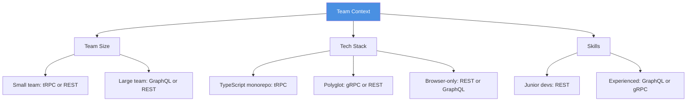

| Team Profile                     | Recommended Approach    |
| -------------------------------- | ----------------------- |
| Small, full-stack TypeScript     | **tRPC**                |
| Large, diverse clients           | **REST** or **GraphQL** |
| Backend specialists              | **gRPC**                |
| Junior developers                | **REST**                |
| Real-time product (chat, gaming) | **WebSocket**           |
| Microservices architecture       | **gRPC** or **REST**    |

---

## Hybrid approaches

Real-world systems often combine multiple patterns.

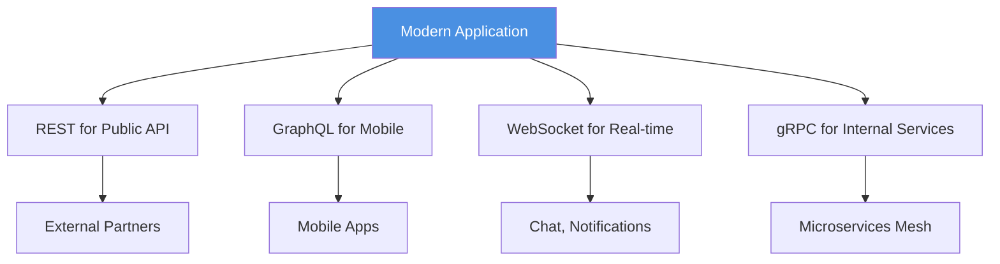

**Common patterns:**

1. **REST + WebSocket**: REST for CRUD, WebSocket for live updates

   - Example: Slack (REST for messages history, WS for new messages)

2. **REST + SSE + Webhooks**: REST for queries, SSE for notifications, Webhooks for integrations

   - Example: GitHub (REST API, SSE for live updates, Webhooks for CI/CD)

3. **GraphQL + WebSocket**: GraphQL for queries/mutations, WS for subscriptions

   - Example: Hasura (GraphQL subscriptions over WebSocket)

4. **REST for public + gRPC for internal**: REST outward-facing, gRPC between services

   - Example: Google Cloud (REST APIs, gRPC internally)

5. **tRPC + REST + Webhooks**: tRPC for web app, REST for mobile apps, Webhooks for events
   - Example: Monorepo with Next.js (tRPC) + React Native (REST) + Stripe integration (Webhooks)

### Example architecture

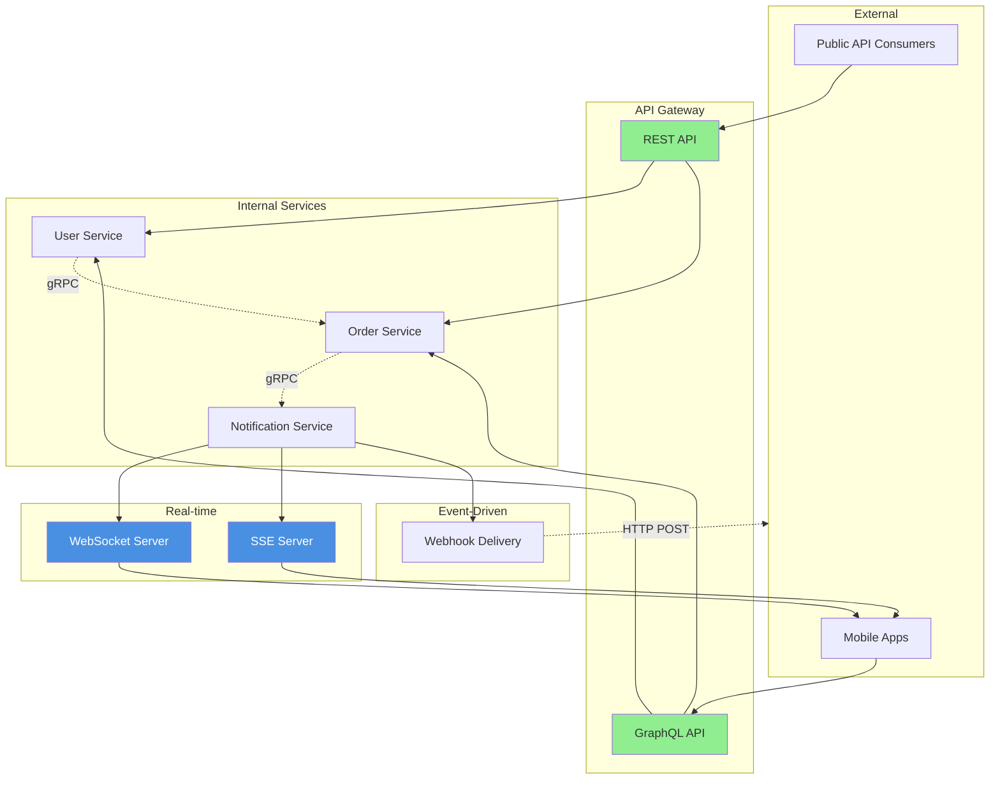

---

## Migration strategies

Switching API patterns is expensive; plan carefully.

### REST → GraphQL

**Approach: Incremental adoption**

1. Wrap existing REST endpoints as GraphQL resolvers
2. Add new features in GraphQL
3. Migrate high-value clients (mobile)
4. Deprecate REST endpoints with low usage

```javascript
// GraphQL resolver wrapping REST
const resolvers = {
  Query: {
    user: async (parent, { id }) => {
      // Call existing REST endpoint
      const response = await fetch(`https://api.example.com/users/${id}`);
      return response.json();
    },
  },
};
```

### REST → tRPC (TypeScript projects)

**Approach: New features first**

1. Add tRPC alongside existing REST
2. Build new features with tRPC
3. Migrate high-traffic endpoints
4. Leave low-traffic REST as-is

### Monolith → Microservices (REST → gRPC)

**Approach: Service-by-service**

1. Extract one service; keep REST externally
2. Add gRPC between services
3. Migrate service-to-service calls to gRPC
4. Keep REST for external clients

---

## Team checklist

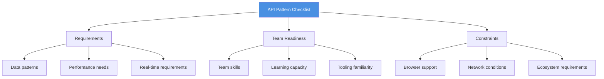

**Before choosing:**

1. ✅ Define client types (public, mobile, internal)
2. ✅ Identify data access patterns (CRUD, complex queries, real-time)
3. ✅ Measure performance requirements (latency, throughput)
4. ✅ Assess team skills (junior vs senior, language constraints)
5. ✅ Check ecosystem compatibility (browser, mobile, desktop)
6. ✅ Plan for evolution (how easy to add features, migrate)
7. ✅ Consider operational complexity (caching, monitoring, debugging)

**Decision checklist:**

| Question                   | REST | SOAP | GraphQL | WebSocket | SSE | Webhooks | gRPC | tRPC |
| -------------------------- | ---- | ---- | ------- | --------- | --- | -------- | ---- | ---- |
| Public API?                | ✅   | ⚠️   | ⚠️      | ❌        | ⚠️  | ✅       | ❌   | ❌   |
| Enterprise integration?    | ⚠️   | ✅   | ❌      | ❌        | ❌  | ⚠️       | ✅   | ❌   |
| Strict contracts required? | ⚠️   | ✅   | ✅      | ❌        | ❌  | ❌       | ✅   | ✅   |
| Complex data fetching?     | ❌   | ❌   | ✅      | ❌        | ❌  | ❌       | ❌   | ⚠️   |
| Real-time bidirectional?   | ❌   | ❌   | ⚠️      | ✅        | ❌  | ❌       | ✅   | ❌   |
| Real-time server→client?   | ❌   | ❌   | ⚠️      | ✅        | ✅  | ❌       | ✅   | ❌   |
| Event notifications?       | ⚠️   | ⚠️   | ❌      | ⚠️        | ✅  | ✅       | ❌   | ❌   |
| Service-to-service?        | ⚠️   | ✅   | ❌      | ❌        | ❌  | ✅       | ✅   | ⚠️   |
| Full-stack TypeScript?     | ⚠️   | ❌   | ⚠️      | ❌        | ❌  | ❌       | ❌   | ✅   |
| HTTP caching important?    | ✅   | ⚠️   | ❌      | ❌        | ⚠️  | ❌       | ❌   | ✅   |
| Team is junior?            | ✅   | ❌   | ❌      | ⚠️        | ⚠️  | ⚠️       | ❌   | ⚠️   |
| Multi-language clients?    | ✅   | ✅   | ✅      | ✅        | ✅  | ✅       | ✅   | ❌   |
| Legacy system integration? | ⚠️   | ✅   | ❌      | ❌        | ❌  | ⚠️       | ⚠️   | ❌   |

:::note About Polling

Polling is excluded from this matrix because it's not a protocol - it's a client technique that can be applied to any
API above (REST polling, GraphQL polling, etc.). Use polling only when WebSocket/SSE are unavailable.

:::

✅ = Excellent fit | ⚠️ = Can work | ❌ = Poor fit

---

## Further reading

### REST

- [REST Best Practices](/rest-best-practices) — Detailed REST guidance
- [RFC 9110 — HTTP Semantics](https://datatracker.ietf.org/doc/html/rfc9110)
- [OpenAPI Specification](https://spec.openapis.org/oas/latest.html)

### SOAP

- [W3C SOAP Specification](https://www.w3.org/TR/soap/)
- [WSDL 1.1 Specification](https://www.w3.org/TR/wsdl/)
- [Web Services Security (WS-Security)](http://docs.oasis-open.org/wss/2004/01/oasis-200401-wss-soap-message-security-1.0.pdf)
- [Apache Axis2 (Java SOAP framework)](https://axis.apache.org/axis2/java/core/)
- [Spyne (Python SOAP framework)](http://spyne.io/)
- [Zeep (Python SOAP client)](https://docs.python-zeep.org/)

### GraphQL

- [GraphQL Best Practices](/graphql-best-practices) — Detailed GraphQL guidance
- [GraphQL Specification](https://spec.graphql.org/)
- [Production Ready GraphQL](https://book.productionreadygraphql.com/)

### WebSocket

- [RFC 6455 — The WebSocket Protocol](https://datatracker.ietf.org/doc/html/rfc6455)
- [WebSocket API (MDN)](https://developer.mozilla.org/en-US/docs/Web/API/WebSocket)

### Server-Sent Events (SSE)

- [Server-Sent Events Specification](https://html.spec.whatwg.org/multipage/server-sent-events.html)
- [Using Server-Sent Events (MDN)](https://developer.mozilla.org/en-US/docs/Web/API/Server-sent_events/Using_server-sent_events)
- [EventSource API (MDN)](https://developer.mozilla.org/en-US/docs/Web/API/EventSource)

### Webhooks

- [Webhooks (GitHub Docs)](https://docs.github.com/en/developers/webhooks-and-events/webhooks/about-webhooks)
- [Standard Webhooks](https://github.com/standard-webhooks/standard-webhooks)
- [Webhook Security Best Practices](https://webhooks.fyi/)

### gRPC

- [gRPC Documentation](https://grpc.io/docs/)
- [Protocol Buffers](https://protobuf.dev/)
- [gRPC Best Practices](https://grpc.io/docs/guides/performance/)

### tRPC

- [tRPC Documentation](https://trpc.io/docs)
- [tRPC with Next.js](https://trpc.io/docs/nextjs)

---

## Key takeaways

1. **No silver bullet** — Every pattern solves specific problems; choose based on your constraints and team.

2. **REST for simplicity** — Best default for public APIs, simple CRUD, and teams that value universal compatibility.

3. **SOAP for enterprise** — Use when strict contracts, WS-\* standards, and compliance are required (banking,
   healthcare, government).

4. **GraphQL for flexibility** — Ideal when clients have diverse data needs and you want to avoid over/under-fetching.

5. **WebSocket for bidirectional real-time** — Use when you need two-way, low-latency communication (chat, gaming,
   collaboration).

6. **SSE for server push** — Simpler than WebSocket when you only need server-to-client updates (notifications, feeds).

7. **Webhooks for event-driven integration** — Perfect for async event notifications between systems (payments, CI/CD
   triggers).

8. **gRPC for performance** — Best for service-to-service with high-throughput requirements and strong contracts.

9. **tRPC for TypeScript** — Optimal developer experience for full-stack TypeScript projects with shared types.

10. **Polling is not a protocol** — It's a client technique applied to REST/GraphQL/SOAP. Treat it as technical debt and
    replace with WebSocket/SSE when feasible.

11. **Hybrid is normal** — Real-world systems often mix patterns (REST for CRUD, SSE for notifications, Webhooks for
    integrations, gRPC internally, SOAP for legacy).

12. **Consider your team** — Junior teams → REST. Experienced teams → GraphQL/gRPC. TypeScript experts → tRPC. Real-time
    needs → WebSocket/SSE. Enterprise → SOAP.

13. **Direction matters** — Bidirectional → WebSocket. Server push → SSE. Client pull → REST. Event-driven → Webhooks.
    Enterprise contracts → SOAP/gRPC.

14. **Caching matters** — REST and tRPC leverage HTTP caching easily; SOAP and GraphQL are complex; gRPC, WebSocket, SSE
    require manual strategies.

15. **Real-time fallbacks** — When WebSocket/SSE are blocked, use polling as last resort with optimizations (exponential
    backoff, caching, visibility detection).

16. **Legacy integration** — SOAP remains relevant for enterprise/legacy systems; use adapters to bridge with modern
    patterns.

17. **Plan for evolution** — Choose patterns that allow incremental adoption and easy feature additions without
    rewriting everything.

Remember: The right API pattern is the one that matches your team's skills, your clients' needs, and your system's
constraints. Start simple, evolve as needed.
