import ArchitectureDesignImage from '/img/undraw_building_blocks.svg';

<div className="text--center margin-bottom--lg">
  <ArchitectureDesignImage width="80%" height="300px" />
</div>

Software architecture is the fundamental organization of a system, encompassing its components, relationships, and
principles guiding its design and evolution. Good architecture design enables systems to be scalable, maintainable,
testable, and resilient while meeting business requirements and technical constraints.

Architecture decisions have far-reaching implications—they affect development velocity, system reliability, operational
costs, and the ability to adapt to changing requirements. This chapter explores key principles, patterns, and practices
for designing effective software architectures.

## Architectural Principles

### Separation of Concerns

Divide your system into distinct sections, each addressing a specific concern or responsibility. This principle reduces
complexity and improves maintainability.

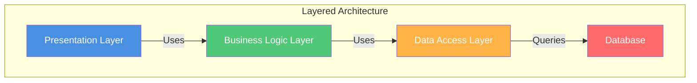
```mermaid
graph TB
    subgraph "Layered Architecture"
        A[Presentation Layer]
        B[Business Logic Layer]
        C[Data Access Layer]
        D[Database]
    end

    A -->|Uses| B
    B -->|Uses| C
    C -->|Queries| D

    style A fill:#4A90E2,color:#fff
    style B fill:#50C878,color:#fff
    style C fill:#FFB347,color:#fff
    style D fill:#FF6B6B,color:#fff
```

**Benefits:**

- Easier to understand and modify individual components
- Reduces coupling between different parts of the system
- Enables parallel development by different teams
- Facilitates testing and debugging

### Single Responsibility Principle (SRP)

Each component, module, or class should have one reason to change—it should have a single, well-defined responsibility.

**Bad Example:**

```javascript
class UserManager {
  createUser(userData) {
    // Validates user data
    if (!userData.email || !userData.password) {
      throw new Error('Invalid user data');
    }

    // Saves to database
    db.users.insert(userData);

    // Sends welcome email
    emailService.send(userData.email, 'Welcome!');

    // Logs the action
    logger.info(`User created: ${userData.email}`);
  }
}
```

**Good Example:**

```javascript
class UserValidator {
  validate(userData) {
    if (!userData.email || !userData.password) {
      throw new Error('Invalid user data');
    }
  }
}

class UserRepository {
  create(userData) {
    return db.users.insert(userData);
  }
}

class UserNotificationService {
  sendWelcomeEmail(email) {
    emailService.send(email, 'Welcome!');
  }
}

class UserService {
  constructor(validator, repository, notificationService, logger) {
    this.validator = validator;
    this.repository = repository;
    this.notificationService = notificationService;
    this.logger = logger;
  }

  async createUser(userData) {
    this.validator.validate(userData);
    const user = await this.repository.create(userData);
    await this.notificationService.sendWelcomeEmail(user.email);
    this.logger.info(`User created: ${user.email}`);
    return user;
  }
}
```

### Loose Coupling and High Cohesion

**Loose Coupling:** Minimize dependencies between components. Components should interact through well-defined interfaces
rather than direct implementation dependencies.

**High Cohesion:** Elements within a component should be closely related and work together toward a common purpose.

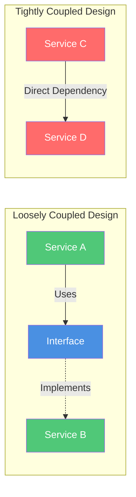
```mermaid
graph LR
    subgraph "Loosely Coupled Design"
        A[Service A]
        B[Service B]
        I[Interface]

        A -->|Uses| I
        I -.->|Implements| B
    end

    subgraph "Tightly Coupled Design"
        C[Service C]
        D[Service D]

        C -->|Direct Dependency| D
    end

    style A fill:#50C878,color:#fff
    style B fill:#50C878,color:#fff
    style I fill:#4A90E2,color:#fff
    style C fill:#FF6B6B,color:#fff
    style D fill:#FF6B6B,color:#fff
```

### Don't Repeat Yourself (DRY)

Avoid duplicating code or logic. Extract common functionality into reusable components or utilities.

**Warning:** Don't over-apply DRY. Sometimes similar-looking code serves different purposes or will evolve differently.
Premature abstraction can create unnecessary coupling.

### YAGNI (You Aren't Gonna Need It)

Don't build features or abstractions until they're actually needed. Over-engineering leads to unnecessary complexity and
maintenance burden.

### Open/Closed Principle

Software entities should be open for extension but closed for modification. Design systems that can be extended without
changing existing code.

```javascript
// Bad: Adding new payment methods requires modifying existing code
class PaymentProcessor {
  processPayment(paymentType, amount) {
    if (paymentType === 'credit_card') {
      // Process credit card
    } else if (paymentType === 'paypal') {
      // Process PayPal
    } else if (paymentType === 'crypto') {
      // Process crypto - requires modifying this function
    }
  }
}

// Good: New payment methods can be added without modifying existing code
class PaymentProcessor {
  constructor() {
    this.paymentMethods = new Map();
  }

  registerPaymentMethod(type, handler) {
    this.paymentMethods.set(type, handler);
  }

  processPayment(paymentType, amount) {
    const handler = this.paymentMethods.get(paymentType);
    if (!handler) {
      throw new Error(`Unknown payment type: ${paymentType}`);
    }
    return handler.process(amount);
  }
}

// Usage
const processor = new PaymentProcessor();
processor.registerPaymentMethod('credit_card', new CreditCardHandler());
processor.registerPaymentMethod('paypal', new PayPalHandler());
processor.registerPaymentMethod('crypto', new CryptoHandler()); // No modification needed
```

## Architectural Patterns

### Layered Architecture

Organizes the system into horizontal layers, each providing services to the layer above and consuming services from the
layer below.

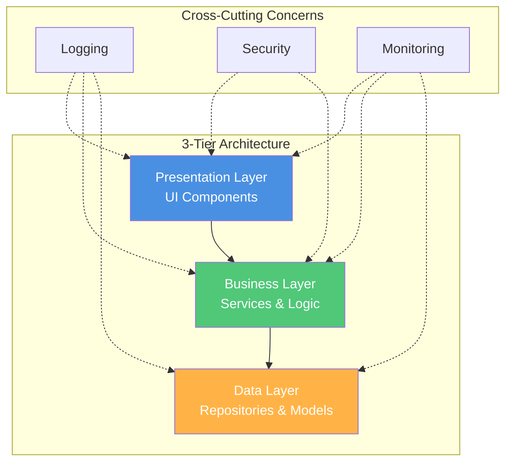
```mermaid
graph TB
    subgraph "3-Tier Architecture"
        P[Presentation Layer<br/>UI Components]
        B[Business Layer<br/>Services & Logic]
        D[Data Layer<br/>Repositories & Models]
    end

    subgraph "Cross-Cutting Concerns"
        L[Logging]
        S[Security]
        M[Monitoring]
    end

    P --> B
    B --> D

    L -.-> P
    L -.-> B
    L -.-> D

    S -.-> P
    S -.-> B

    M -.-> P
    M -.-> B
    M -.-> D

    style P fill:#4A90E2,color:#fff
    style B fill:#50C878,color:#fff
    style D fill:#FFB347,color:#fff
```

**When to Use:**

- Traditional web applications
- Enterprise applications with clear separation of concerns
- Teams organized by technical expertise (frontend, backend, database)

**Pros:**

- Simple and well-understood
- Clear separation of concerns
- Easy to test individual layers

**Cons:**

- Can lead to "architecture sinkhole" (requests passing through layers without processing)
- May become monolithic and difficult to scale
- Changes often require modifications across multiple layers

### Microservices Architecture

Structures the application as a collection of loosely coupled, independently deployable services.

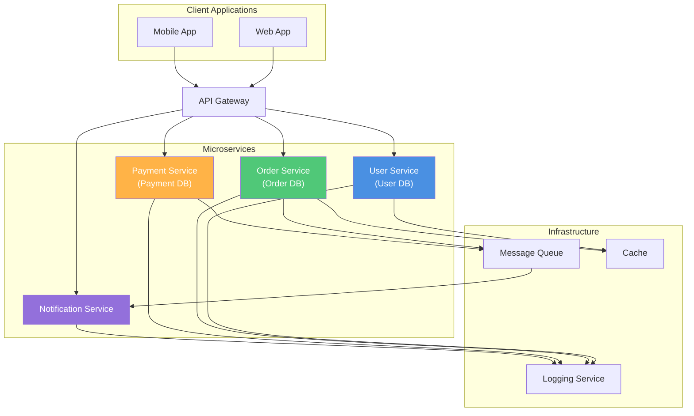
```mermaid
graph TB
    subgraph "Client Applications"
        WEB[Web App]
        MOBILE[Mobile App]
    end

    API[API Gateway]

    subgraph "Microservices"
        USER["User Service<br/>(User DB)"]
        ORDER["Order Service<br/>(Order DB)"]
        PAYMENT["Payment Service<br/>(Payment DB)"]
        NOTIF["Notification Service"]
    end

    subgraph "Infrastructure"
        MSG[Message Queue]
        CACHE[Cache]
        LOG[Logging Service]
    end

    WEB --> API
    MOBILE --> API

    API --> USER
    API --> ORDER
    API --> PAYMENT
    API --> NOTIF

    ORDER --> MSG
    PAYMENT --> MSG
    MSG --> NOTIF

    USER --> CACHE
    ORDER --> CACHE

    USER --> LOG
    ORDER --> LOG
    PAYMENT --> LOG
    NOTIF --> LOG

    style USER fill:#4A90E2,color:#fff
    style ORDER fill:#50C878,color:#fff
    style PAYMENT fill:#FFB347,color:#fff
    style NOTIF fill:#9370DB,color:#fff
```

**When to Use:**

- Large, complex applications requiring independent scaling
- Organizations with multiple autonomous teams
- Need for technology diversity across services
- Frequent deployments and updates

**Pros:**

- Independent deployment and scaling
- Technology flexibility per service
- Fault isolation
- Easier to understand individual services

**Cons:**

- Increased operational complexity
- Distributed system challenges (network latency, partial failures)
- Data consistency across services
- Testing complexity

**Key Considerations:**

- Define clear service boundaries based on business capabilities
- Implement proper inter-service communication (REST, gRPC, message queues)
- Plan for distributed tracing and monitoring
- Address data management and eventual consistency

### Event-Driven Architecture

Components communicate through events rather than direct calls. Services publish events when state changes occur, and
other services subscribe to relevant events.

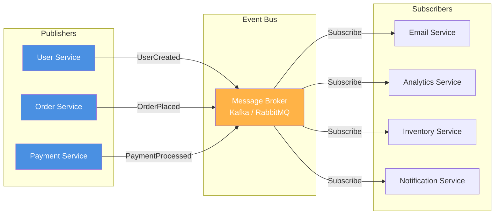
```mermaid
graph LR
    subgraph "Publishers"
        USER[User Service]
        ORDER[Order Service]
        PAYMENT[Payment Service]
    end

    subgraph "Event Bus"
        EB[Message Broker<br/>Kafka / RabbitMQ]
    end

    subgraph "Subscribers"
        EMAIL[Email Service]
        ANALYTICS[Analytics Service]
        INVENTORY[Inventory Service]
        NOTIF[Notification Service]
    end

    USER -->|UserCreated| EB
    ORDER -->|OrderPlaced| EB
    PAYMENT -->|PaymentProcessed| EB

    EB -->|Subscribe| EMAIL
    EB -->|Subscribe| ANALYTICS
    EB -->|Subscribe| INVENTORY
    EB -->|Subscribe| NOTIF

    style EB fill:#FFB347,color:#fff
    style USER fill:#4A90E2,color:#fff
    style ORDER fill:#4A90E2,color:#fff
    style PAYMENT fill:#4A90E2,color:#fff
```

**When to Use:**

- Systems requiring high scalability
- Complex workflows with multiple steps
- Real-time data processing
- Decoupling between services is critical

**Pros:**

- Loose coupling between components
- Easy to add new subscribers without modifying publishers
- Natural support for asynchronous processing
- Excellent scalability

**Cons:**

- Harder to understand overall system flow
- Debugging distributed events is challenging
- Eventual consistency requires careful handling
- Potential for message ordering issues

**Event Types:**

- **Domain Events:** Business-significant occurrences (OrderPlaced, UserRegistered)
- **Integration Events:** Cross-service communication events
- **Command Events:** Trigger specific actions

### Hexagonal Architecture (Ports and Adapters)

Isolates the core business logic from external concerns by defining clear boundaries through ports (interfaces) and
adapters (implementations).

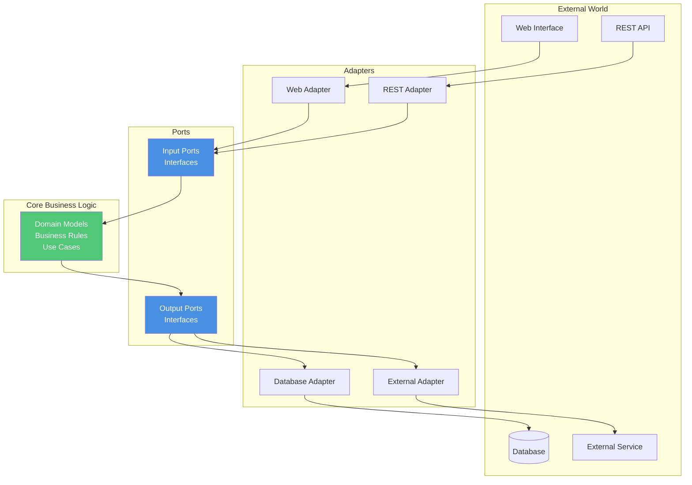
```mermaid
graph TB
    subgraph "External World"
        WEB[Web Interface]
        API[REST API]
        DB[(Database)]
        EXT[External Service]
    end

    subgraph "Adapters"
        WA[Web Adapter]
        RA[REST Adapter]
        DBA[Database Adapter]
        EA[External Adapter]
    end

    subgraph "Ports"
        IP[Input Ports<br/>Interfaces]
        OP[Output Ports<br/>Interfaces]
    end

    subgraph "Core Business Logic"
        DOMAIN[Domain Models<br/>Business Rules<br/>Use Cases]
    end

    WEB --> WA
    API --> RA

    WA --> IP
    RA --> IP

    IP --> DOMAIN

    DOMAIN --> OP

    OP --> DBA
    OP --> EA

    DBA --> DB
    EA --> EXT

    style DOMAIN fill:#50C878,color:#fff
    style IP fill:#4A90E2,color:#fff
    style OP fill:#4A90E2,color:#fff
```

**When to Use:**

- Applications requiring high testability
- Systems that may need to swap infrastructure components
- Domain-driven design implementations
- Long-lived applications requiring flexibility

**Pros:**

- Business logic independent of frameworks and infrastructure
- Highly testable (can mock all external dependencies)
- Flexible to technology changes
- Clear separation of concerns

**Cons:**

- More upfront design effort
- Can feel over-engineered for simple applications
- Requires discipline to maintain boundaries

### Clean Architecture

Similar to Hexagonal Architecture, Clean Architecture emphasizes independence of frameworks, UI, database, and external
agencies.

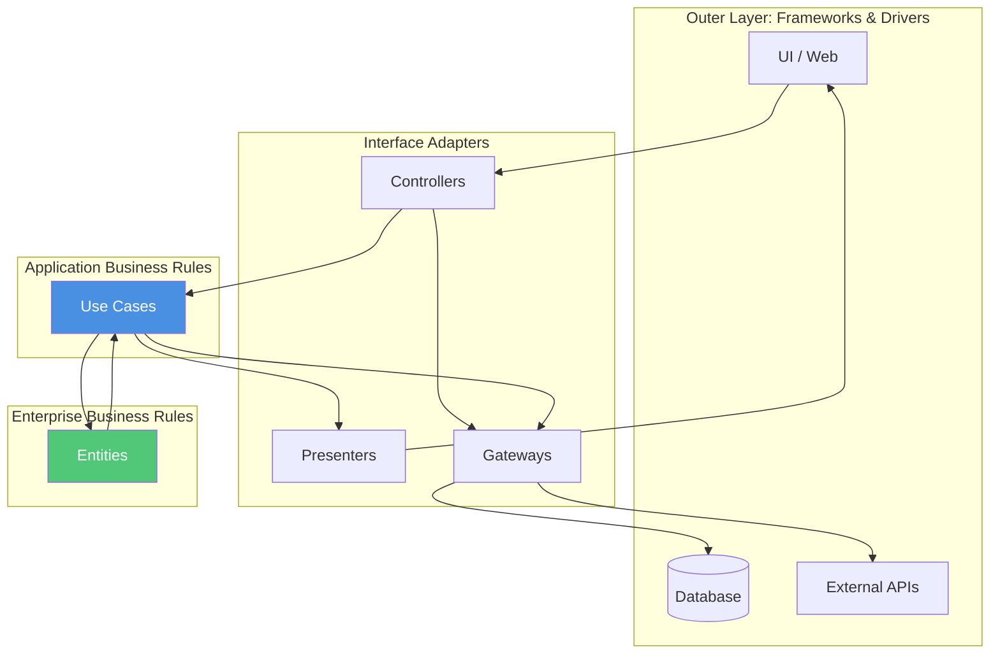
```mermaid
graph TB
    subgraph "Outer Layer: Frameworks & Drivers"
        UI[UI / Web]
        DB[(Database)]
        EXT[External APIs]
    end

    subgraph "Interface Adapters"
        CTRL[Controllers]
        PRES[Presenters]
        GATE[Gateways]
    end

    subgraph "Application Business Rules"
        UC[Use Cases]
    end

    subgraph "Enterprise Business Rules"
        ENT[Entities]
    end

    UI --> CTRL
    CTRL --> UC
    UC --> ENT
    ENT --> UC
    UC --> PRES
    PRES --> UI

    CTRL --> GATE
    GATE --> DB

    UC --> GATE
    GATE --> EXT

    style ENT fill:#50C878,color:#fff
    style UC fill:#4A90E2,color:#fff
```

**Dependency Rule:** Dependencies can only point inward. Inner circles know nothing about outer circles.

### CQRS (Command Query Responsibility Segregation)

Separates read and write operations into different models, optimizing each for its specific purpose.

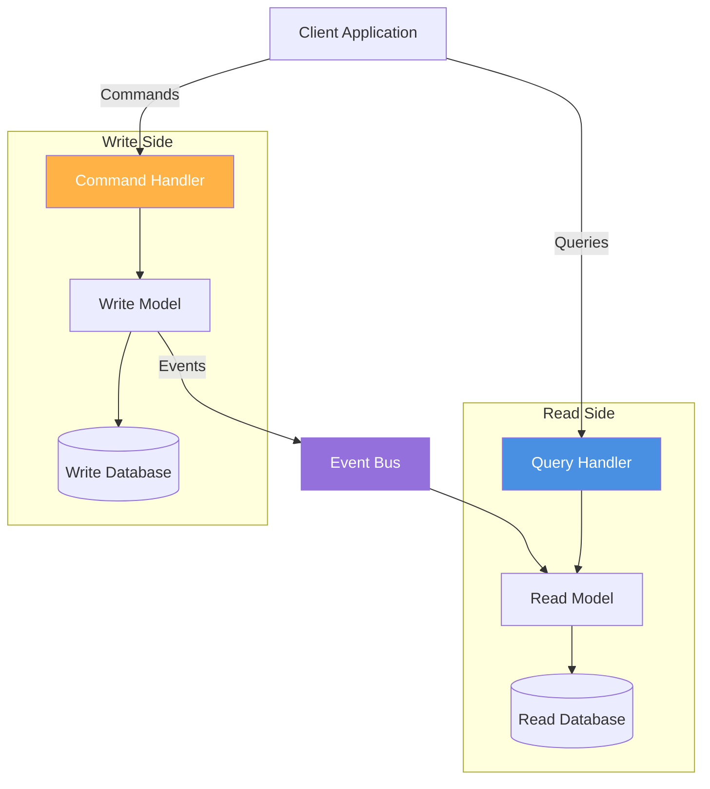
```mermaid
graph TB
    CLIENT[Client Application]

    subgraph "Write Side"
        CMD[Command Handler]
        WMODEL[Write Model]
        WDB[(Write Database)]
    end

    subgraph "Read Side"
        QUERY[Query Handler]
        RMODEL[Read Model]
        RDB[(Read Database)]
    end

    EVENT[Event Bus]

    CLIENT -->|Commands| CMD
    CLIENT -->|Queries| QUERY

    CMD --> WMODEL
    WMODEL --> WDB
    WMODEL -->|Events| EVENT

    EVENT --> RMODEL
    RMODEL --> RDB
    QUERY --> RMODEL

    style CMD fill:#FFB347,color:#fff
    style QUERY fill:#4A90E2,color:#fff
    style EVENT fill:#9370DB,color:#fff
```

**When to Use:**

- Complex domains with different read and write requirements
- High-performance read requirements
- Event sourcing implementations
- Different scalability needs for reads and writes

**Pros:**

- Optimized read and write models
- Independent scaling of reads and writes
- Simplified queries
- Natural fit with event-driven architectures

**Cons:**

- Increased complexity
- Eventual consistency between read and write models
- More infrastructure components to manage

## Making Architectural Decisions

### Decision-Making Framework

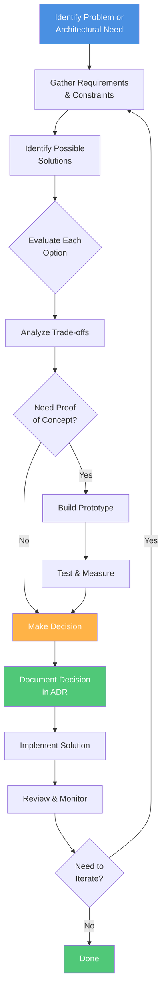
```mermaid
flowchart TD
    START[Identify Problem or<br/>Architectural Need]

    START --> REQS[Gather Requirements<br/>& Constraints]

    REQS --> OPTIONS[Identify Possible<br/>Solutions]

    OPTIONS --> EVAL{Evaluate Each<br/>Option}

    EVAL --> TRADE[Analyze Trade-offs]

    TRADE --> PROTO{Need Proof<br/>of Concept?}

    PROTO -->|Yes| BUILD[Build Prototype]
    PROTO -->|No| DECIDE

    BUILD --> TEST[Test & Measure]
    TEST --> DECIDE[Make Decision]

    DECIDE --> DOC[Document Decision<br/>in ADR]

    DOC --> IMPL[Implement Solution]

    IMPL --> REVIEW[Review & Monitor]

    REVIEW --> ITERATE{Need to<br/>Iterate?}

    ITERATE -->|Yes| REQS
    ITERATE -->|No| END[Done]

    style START fill:#4A90E2,color:#fff
    style DECIDE fill:#FFB347,color:#fff
    style DOC fill:#50C878,color:#fff
    style END fill:#50C878,color:#fff
```

### Key Considerations

When making architectural decisions, evaluate:

1. **Functional Requirements**

   - What features must the system support?
   - What are the business capabilities needed?

2. **Non-Functional Requirements**

   - **Performance:** Response time, throughput, latency requirements
   - **Scalability:** Expected growth, concurrent users, data volume
   - **Availability:** Uptime requirements, disaster recovery
   - **Security:** Authentication, authorization, data protection
   - **Maintainability:** Code quality, documentation, testability
   - **Reliability:** Fault tolerance, error handling
   - **Observability:** Logging, monitoring, tracing

3. **Technical Constraints**

   - Existing systems and integrations
   - Technology stack and team expertise
   - Infrastructure and budget limitations
   - Compliance and regulatory requirements

4. **Organizational Factors**
   - Team size and structure
   - Development velocity requirements
   - Deployment frequency
   - Support and operations capabilities

### Architecture Decision Records (ADRs)

Document significant architectural decisions using ADRs. See the
[Architecture Decision Records](/architecture-decision-record) chapter for detailed guidance.

**Quick Template:**

```markdown
# ADR-001: Use Microservices Architecture

## Status

Accepted

## Context

Our monolithic application is becoming difficult to scale and deploy. Multiple teams are blocked by deployment
conflicts.

## Decision

We will adopt a microservices architecture, splitting the application into independently deployable services organized
by business capability.

## Consequences

Positive:

- Independent deployment and scaling
- Team autonomy
- Technology flexibility

Negative:

- Increased operational complexity
- Need for distributed tracing
- Data consistency challenges

## Alternatives Considered

- Modular monolith
- Service-oriented architecture (SOA)
```

## Designing for Scalability

### Horizontal vs. Vertical Scaling

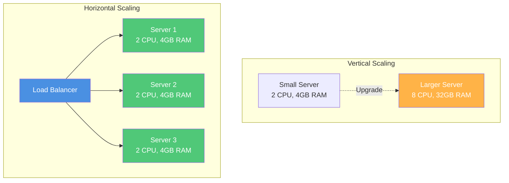
```mermaid
graph TB
    subgraph "Vertical Scaling"
        V1[Small Server<br/>2 CPU, 4GB RAM]
        V2[Larger Server<br/>8 CPU, 32GB RAM]
        V1 -.->|Upgrade| V2
    end

    subgraph "Horizontal Scaling"
        H1[Server 1<br/>2 CPU, 4GB RAM]
        H2[Server 2<br/>2 CPU, 4GB RAM]
        H3[Server 3<br/>2 CPU, 4GB RAM]
        LB[Load Balancer]

        LB --> H1
        LB --> H2
        LB --> H3
    end

    style V2 fill:#FFB347,color:#fff
    style LB fill:#4A90E2,color:#fff
    style H1 fill:#50C878,color:#fff
    style H2 fill:#50C878,color:#fff
    style H3 fill:#50C878,color:#fff
```

**Vertical Scaling (Scale Up):**

- Add more resources (CPU, RAM) to existing servers
- Simpler to implement
- Limited by hardware constraints
- Single point of failure

**Horizontal Scaling (Scale Out):**

- Add more servers to distribute load
- Better fault tolerance
- Requires stateless design
- More complex infrastructure

### Caching Strategies

Implement caching at multiple levels to improve performance:

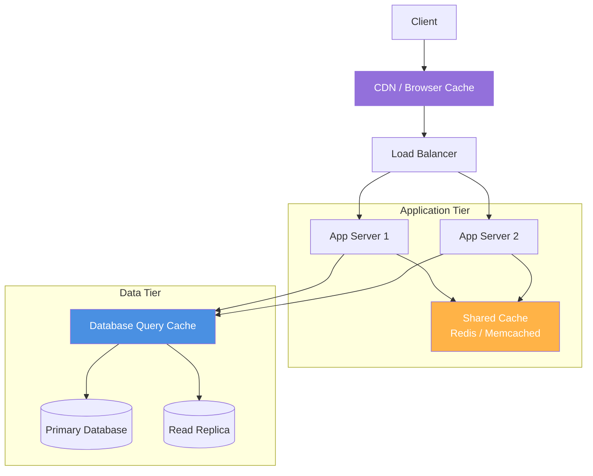
```mermaid
graph TB
    CLIENT[Client]
    CDN[CDN / Browser Cache]
    LB[Load Balancer]

    subgraph "Application Tier"
        APP1[App Server 1]
        APP2[App Server 2]
        CACHE[Shared Cache<br/>Redis / Memcached]
    end

    subgraph "Data Tier"
        DBCACHE[Database Query Cache]
        DB[(Primary Database)]
        REPLICA[(Read Replica)]
    end

    CLIENT --> CDN
    CDN --> LB
    LB --> APP1
    LB --> APP2

    APP1 --> CACHE
    APP2 --> CACHE

    APP1 --> DBCACHE
    APP2 --> DBCACHE

    DBCACHE --> DB
    DBCACHE --> REPLICA

    style CDN fill:#9370DB,color:#fff
    style CACHE fill:#FFB347,color:#fff
    style DBCACHE fill:#4A90E2,color:#fff
```

**Caching Patterns:**

- **Cache-Aside:** Application checks cache, loads from database on miss
- **Read-Through:** Cache automatically loads from database on miss
- **Write-Through:** Writes go through cache to database
- **Write-Behind:** Writes batched and asynchronously written to database

### Database Scaling

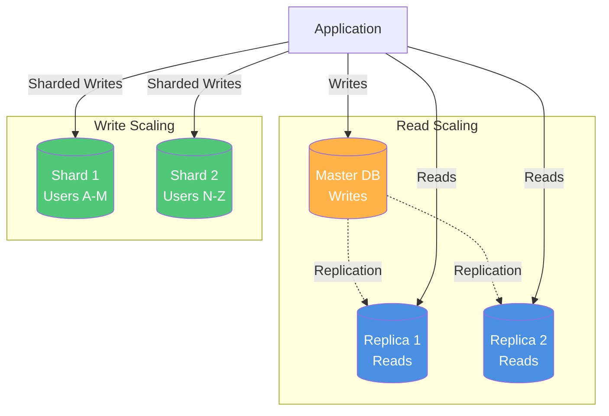
```mermaid
graph TB
    APP[Application]

    subgraph "Read Scaling"
        MASTER[(Master DB<br/>Writes)]
        REPLICA1[(Replica 1<br/>Reads)]
        REPLICA2[(Replica 2<br/>Reads)]
        MASTER -.->|Replication| REPLICA1
        MASTER -.->|Replication| REPLICA2
    end

    subgraph "Write Scaling"
        SHARD1[(Shard 1<br/>Users A-M)]
        SHARD2[(Shard 2<br/>Users N-Z)]
    end

    APP -->|Writes| MASTER
    APP -->|Reads| REPLICA1
    APP -->|Reads| REPLICA2

    APP -->|Sharded Writes| SHARD1
    APP -->|Sharded Writes| SHARD2

    style MASTER fill:#FFB347,color:#fff
    style REPLICA1 fill:#4A90E2,color:#fff
    style REPLICA2 fill:#4A90E2,color:#fff
    style SHARD1 fill:#50C878,color:#fff
    style SHARD2 fill:#50C878,color:#fff
```

## Designing for Resilience

### Failure Handling Patterns

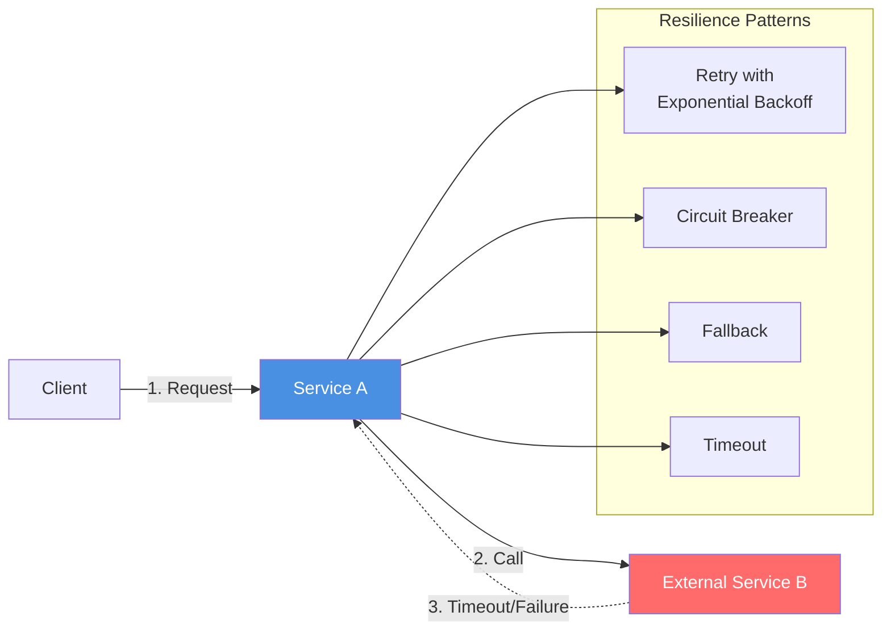
```mermaid
graph LR
    CLIENT[Client]
    SERVICE[Service A]
    EXTERNAL[External Service B]

    CLIENT -->|1. Request| SERVICE
    SERVICE -->|2. Call| EXTERNAL
    EXTERNAL -.->|3. Timeout/Failure| SERVICE

    subgraph "Resilience Patterns"
        RT[Retry with<br/>Exponential Backoff]
        CB[Circuit Breaker]
        FB[Fallback]
        TO[Timeout]
    end

    SERVICE --> RT
    SERVICE --> CB
    SERVICE --> FB
    SERVICE --> TO

    style SERVICE fill:#4A90E2,color:#fff
    style EXTERNAL fill:#FF6B6B,color:#fff
```

### Circuit Breaker Pattern

Prevents cascading failures by detecting failures and stopping requests to failing services.

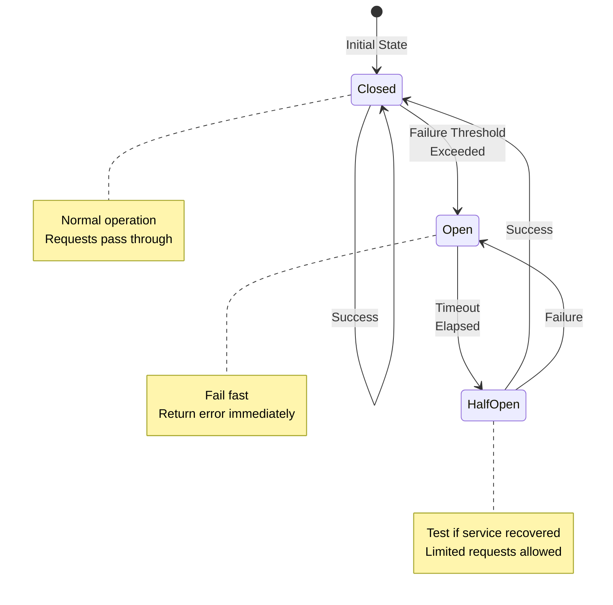
```mermaid
stateDiagram-v2
    [*] --> Closed: Initial State

    Closed --> Open: Failure Threshold<br/>Exceeded
    Closed --> Closed: Success

    Open --> HalfOpen: Timeout<br/>Elapsed

    HalfOpen --> Closed: Success
    HalfOpen --> Open: Failure

    note right of Closed
        Normal operation
        Requests pass through
    end note

    note right of Open
        Fail fast
        Return error immediately
    end note

    note right of HalfOpen
        Test if service recovered
        Limited requests allowed
    end note
```

**Implementation Example:**

```javascript
class CircuitBreaker {
  constructor(failureThreshold = 5, timeout = 60000) {
    this.failureThreshold = failureThreshold;
    this.timeout = timeout;
    this.failureCount = 0;
    this.state = 'CLOSED';
    this.nextAttempt = Date.now();
  }

  async execute(operation) {
    if (this.state === 'OPEN') {
      if (Date.now() < this.nextAttempt) {
        throw new Error('Circuit breaker is OPEN');
      }
      this.state = 'HALF_OPEN';
    }

    try {
      const result = await operation();
      this.onSuccess();
      return result;
    } catch (error) {
      this.onFailure();
      throw error;
    }
  }

  onSuccess() {
    this.failureCount = 0;
    this.state = 'CLOSED';
  }

  onFailure() {
    this.failureCount++;
    if (this.failureCount >= this.failureThreshold) {
      this.state = 'OPEN';
      this.nextAttempt = Date.now() + this.timeout;
    }
  }
}

// Usage
const breaker = new CircuitBreaker();

try {
  const result = await breaker.execute(() => externalService.call());
} catch (error) {
  // Handle failure or use fallback
  return fallbackResponse;
}
```

### Bulkhead Pattern

Isolate resources to prevent failures in one part from affecting others.

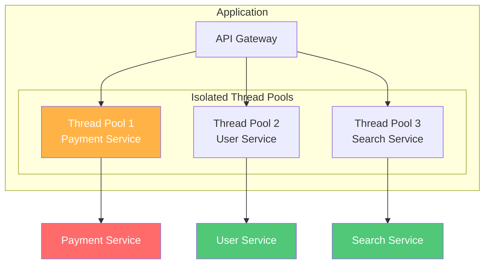
```mermaid
graph TB
    subgraph "Application"
        API[API Gateway]

        subgraph "Isolated Thread Pools"
            TP1[Thread Pool 1<br/>Payment Service]
            TP2[Thread Pool 2<br/>User Service]
            TP3[Thread Pool 3<br/>Search Service]
        end
    end

    API --> TP1
    API --> TP2
    API --> TP3

    TP1 --> PAY[Payment Service]
    TP2 --> USER[User Service]
    TP3 --> SEARCH[Search Service]

    style PAY fill:#FF6B6B,color:#fff
    style USER fill:#50C878,color:#fff
    style SEARCH fill:#50C878,color:#fff
    style TP1 fill:#FFB347,color:#fff
```

If the Payment Service becomes slow or unresponsive, it only affects Thread Pool 1, leaving other services operational.

## Security Considerations

### Defense in Depth

Implement security at multiple layers:

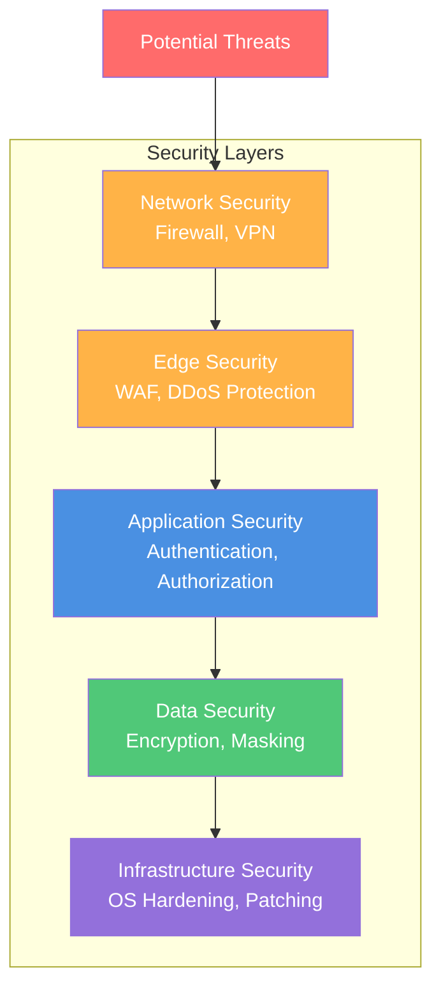
```mermaid
graph TB
    subgraph "Security Layers"
        L1[Network Security<br/>Firewall, VPN]
        L2[Edge Security<br/>WAF, DDoS Protection]
        L3[Application Security<br/>Authentication, Authorization]
        L4[Data Security<br/>Encryption, Masking]
        L5[Infrastructure Security<br/>OS Hardening, Patching]
    end

    THREAT[Potential Threats]

    THREAT --> L1
    L1 --> L2
    L2 --> L3
    L3 --> L4
    L4 --> L5

    style THREAT fill:#FF6B6B,color:#fff
    style L1 fill:#FFB347,color:#fff
    style L2 fill:#FFB347,color:#fff
    style L3 fill:#4A90E2,color:#fff
    style L4 fill:#50C878,color:#fff
    style L5 fill:#9370DB,color:#fff
```

### Security Principles

1. **Principle of Least Privilege:** Grant minimum necessary permissions
2. **Zero Trust:** Never trust, always verify
3. **Fail Securely:** Default to secure state on failure
4. **Secure by Default:** Security should be the default configuration
5. **Defense in Depth:** Multiple layers of security controls
6. **Input Validation:** Validate and sanitize all inputs
7. **Encryption:** Encrypt data at rest and in transit

### Authentication and Authorization Flow

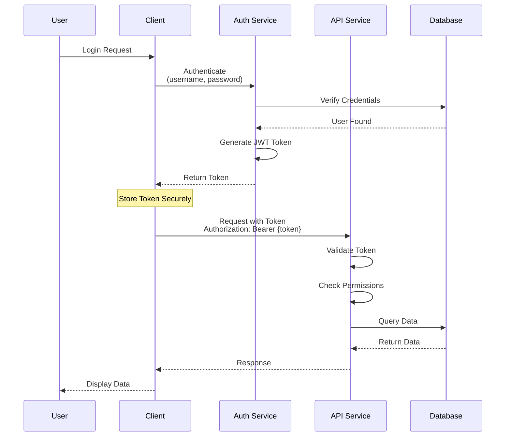
```mermaid
sequenceDiagram
    participant User
    participant Client
    participant Auth as Auth Service
    participant API as API Service
    participant DB as Database

    User->>Client: Login Request
    Client->>Auth: Authenticate<br/>(username, password)
    Auth->>DB: Verify Credentials
    DB-->>Auth: User Found
    Auth->>Auth: Generate JWT Token
    Auth-->>Client: Return Token

    Note over Client: Store Token Securely

    Client->>API: Request with Token<br/>Authorization: Bearer {token}
    API->>API: Validate Token
    API->>API: Check Permissions
    API->>DB: Query Data
    DB-->>API: Return Data
    API-->>Client: Response
    Client-->>User: Display Data
```

## Performance Optimization

### Asynchronous Processing

Offload long-running tasks to background workers to improve response times.

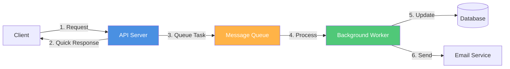
```mermaid
graph LR
    CLIENT[Client]
    API[API Server]
    QUEUE[Message Queue]
    WORKER[Background Worker]
    DB[(Database)]
    EMAIL[Email Service]

    CLIENT -->|1. Request| API
    API -->|2. Quick Response| CLIENT
    API -->|3. Queue Task| QUEUE
    QUEUE -->|4. Process| WORKER
    WORKER -->|5. Update| DB
    WORKER -->|6. Send| EMAIL

    style API fill:#4A90E2,color:#fff
    style QUEUE fill:#FFB347,color:#fff
    style WORKER fill:#50C878,color:#fff
```

**Benefits:**

- Faster API response times
- Better resource utilization
- Fault tolerance (retry failed jobs)
- Scalable processing

### Content Delivery Network (CDN)

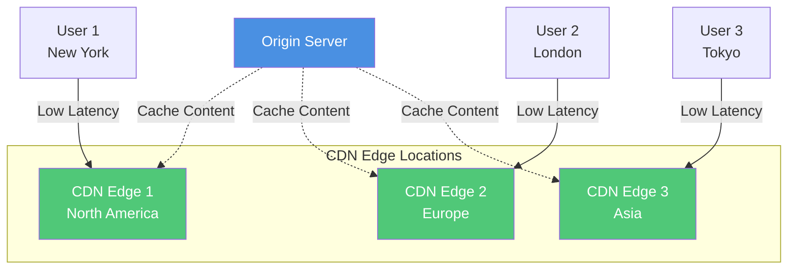
```mermaid
graph TB
    ORIGIN[Origin Server]

    subgraph "CDN Edge Locations"
        CDN1[CDN Edge 1<br/>North America]
        CDN2[CDN Edge 2<br/>Europe]
        CDN3[CDN Edge 3<br/>Asia]
    end

    USER1[User 1<br/>New York]
    USER2[User 2<br/>London]
    USER3[User 3<br/>Tokyo]

    ORIGIN -.->|Cache Content| CDN1
    ORIGIN -.->|Cache Content| CDN2
    ORIGIN -.->|Cache Content| CDN3

    USER1 -->|Low Latency| CDN1
    USER2 -->|Low Latency| CDN2
    USER3 -->|Low Latency| CDN3

    style ORIGIN fill:#4A90E2,color:#fff
    style CDN1 fill:#50C878,color:#fff
    style CDN2 fill:#50C878,color:#fff
    style CDN3 fill:#50C878,color:#fff
```

## Monitoring and Observability

Build systems that are easy to understand and debug in production.

### Three Pillars of Observability

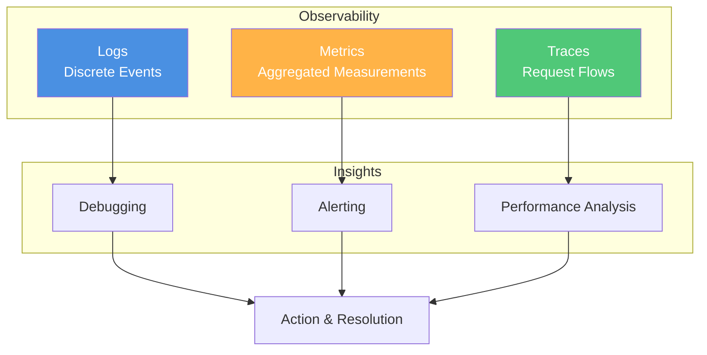
```mermaid
graph TB
    subgraph "Observability"
        LOGS[Logs<br/>Discrete Events]
        METRICS[Metrics<br/>Aggregated Measurements]
        TRACES[Traces<br/>Request Flows]
    end

    subgraph "Insights"
        DEBUG[Debugging]
        PERF[Performance Analysis]
        ALERTS[Alerting]
    end

    LOGS --> DEBUG
    METRICS --> ALERTS
    TRACES --> PERF

    DEBUG --> ACTION[Action & Resolution]
    ALERTS --> ACTION
    PERF --> ACTION

    style LOGS fill:#4A90E2,color:#fff
    style METRICS fill:#FFB347,color:#fff
    style TRACES fill:#50C878,color:#fff
```

See the [Logging](/logging) chapter for detailed guidance on logging best practices.

### Distributed Tracing

Track requests across multiple services to understand system behavior and identify bottlenecks.

```mermaid
graph LR
    CLIENT[Client Request]
    API[API Gateway]
    AUTH[Auth Service]
    ORDER[Order Service]
    PAYMENT[Payment Service]
    INVENTORY[Inventory Service]

    CLIENT -->|Trace ID: 123| API
    API -->|Trace ID: 123<br/>Span: auth| AUTH
    API -->|Trace ID: 123<br/>Span: order| ORDER
    ORDER -->|Trace ID: 123<br/>Span: payment| PAYMENT
    ORDER -->|Trace ID: 123<br/>Span: inventory| INVENTORY

    style CLIENT fill:#4A90E2,color:#fff
    style API fill:#FFB347,color:#fff
```

## Testing Architecture

```mermaid
graph TB
    subgraph "Testing Pyramid"
        E2E[End-to-End Tests<br/>Few, Critical Paths]
        INT[Integration Tests<br/>Component Interactions]
        UNIT[Unit Tests<br/>Individual Components]
    end

    UNIT -.->|More Tests| INT
    INT -.->|Fewer Tests| E2E

    subgraph "Architecture Testing"
        ARCH[Architecture Tests<br/>Validate Structure]
        DEP[Dependency Rules]
        LAYER[Layer Boundaries]
    end

    style UNIT fill:#50C878,color:#fff
    style INT fill:#4A90E2,color:#fff
    style E2E fill:#FFB347,color:#fff
```

**Architecture Testing Tools:**

- **ArchUnit (Java):** Enforce architectural rules as unit tests
- **dependency-cruiser (JavaScript):** Validate dependency rules
- **pytest-archon (Python):** Architecture testing for Python

**Example Architecture Test:**

```javascript
// Test that services don't depend on infrastructure directly
describe('Architecture Rules', () => {
  it('should ensure services do not import from infrastructure layer', () => {
    const services = getFilesInDirectory('src/services');
    const imports = getAllImports(services);

    imports.forEach((importPath) => {
      expect(importPath).not.toMatch(/infrastructure/);
    });
  });

  it('should ensure core domain has no external dependencies', () => {
    const domainFiles = getFilesInDirectory('src/domain');
    const imports = getAllImports(domainFiles);

    imports.forEach((importPath) => {
      expect(importPath).toMatch(/^\.\.?\/domain/);
    });
  });
});
```

## Common Anti-Patterns

### Big Ball of Mud

A system lacking clear architecture or structure, with tangled dependencies and unclear boundaries.

**Signs:**

- No clear separation of concerns
- High coupling between components
- Difficult to understand or modify
- "Change one thing, break everything else"

**Prevention:**

- Define clear architectural boundaries
- Enforce dependency rules
- Regular refactoring
- Code reviews focusing on architecture

### Premature Optimization

Optimizing code before understanding actual performance bottlenecks.

**Better Approach:**

1. Make it work
2. Make it right (refactor)
3. Make it fast (if needed, based on measurements)

### God Object

A single class or module that knows too much or does too much.

**Solution:** Apply Single Responsibility Principle, extract cohesive components.

### Lava Flow

Dead code that remains in the codebase because no one dares to remove it.

**Prevention:**

- Version control gives you safety to delete code
- Remove unused code immediately
- Document temporary workarounds with TODOs and expiration dates

### Golden Hammer

Using the same solution for every problem ("If all you have is a hammer, everything looks like a nail").

**Solution:** Evaluate each problem on its merits, choose appropriate tools and patterns.

## Migration Strategies

### Strangler Fig Pattern

Gradually replace a legacy system by building new functionality around it and slowly deprecating old components.

```mermaid
graph TB
    subgraph "Phase 1: Initial State"
        P1CLIENT[Client]
        P1LEGACY[Legacy System]
        P1CLIENT --> P1LEGACY
    end

    subgraph "Phase 2: Parallel Systems"
        P2CLIENT[Client]
        P2PROXY[Routing Layer]
        P2LEGACY[Legacy System]
        P2NEW[New System]

        P2CLIENT --> P2PROXY
        P2PROXY -->|Old Routes| P2LEGACY
        P2PROXY -->|New Routes| P2NEW
    end

    subgraph "Phase 3: Complete Migration"
        P3CLIENT[Client]
        P3NEW[New System]
        P3CLIENT --> P3NEW
    end

    P1LEGACY -.->|Migrate| P2PROXY
    P2PROXY -.->|Complete| P3NEW

    style P2PROXY fill:#FFB347,color:#fff
    style P3NEW fill:#50C878,color:#fff
```

**Benefits:**

- Low risk (gradual migration)
- Continuous delivery of value
- Can pause or rollback if issues arise

### Branch by Abstraction

Introduce an abstraction layer, create new implementation behind it, then switch over.

1. Create abstraction layer
2. Migrate existing code to use abstraction
3. Create new implementation
4. Switch abstraction to point to new implementation
5. Remove old implementation

## Documentation

Good architecture documentation helps teams understand and maintain systems.

### C4 Model

Document architecture at multiple levels of abstraction:

1. **Context:** System and its external dependencies
2. **Container:** High-level technology choices
3. **Component:** Components within containers
4. **Code:** Class diagrams (optional)

### Essential Documentation

- **System Overview:** Purpose, key features, high-level architecture
- **Architecture Diagrams:** Visual representations of system structure
- **Component Documentation:** Responsibilities, interfaces, dependencies
- **ADRs:** Record of significant decisions
- **Deployment Architecture:** Infrastructure, environments, deployment process
- **Data Models:** Database schemas, data flows
- **API Documentation:** Endpoints, contracts, examples
- **Operational Runbooks:** Monitoring, troubleshooting, disaster recovery

See the [Documentation](/documentation) chapter for comprehensive guidance.

## Key Takeaways

1. **Start Simple:** Don't over-engineer. Begin with the simplest architecture that could work, then evolve based on
   actual needs.

2. **Document Decisions:** Use Architecture Decision Records to capture the context and rationale behind significant
   choices.

3. **Design for Change:** Requirements evolve. Build flexibility into your architecture where it matters most.

4. **Embrace Trade-offs:** Every architectural decision involves trade-offs. Make them explicit and choose based on your
   specific context.

5. **Measure and Monitor:** Build observability into your architecture from the start. You can't improve what you can't
   measure.

6. **Automate Quality:** Use architecture tests, linting, and CI/CD to enforce architectural rules automatically.

7. **Think About Failure:** Design for resilience. Consider what happens when components fail and build in appropriate
   safeguards.

8. **Optimize for Team:** Consider your team's size, skills, and organization when choosing architectural patterns.

9. **Prioritize Security:** Build security into every layer rather than adding it as an afterthought.

10. **Keep Learning:** Software architecture is constantly evolving. Stay current with patterns, practices, and
    technologies.

## Related Topics

- [Architecture Decision Records](/architecture-decision-record) - Document your architectural decisions
- [Design Patterns](/design-patterns) - Common solutions to recurring problems
- [Technical Debt](/technical-debt) - Managing architectural compromises
- [Documentation](/documentation) - Communicating architecture effectively
- [Logging](/logging) - Building observable systems
- [Testing](/testing) - Validating architectural decisions
