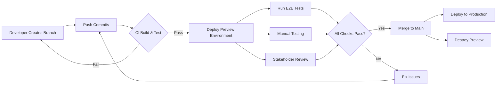
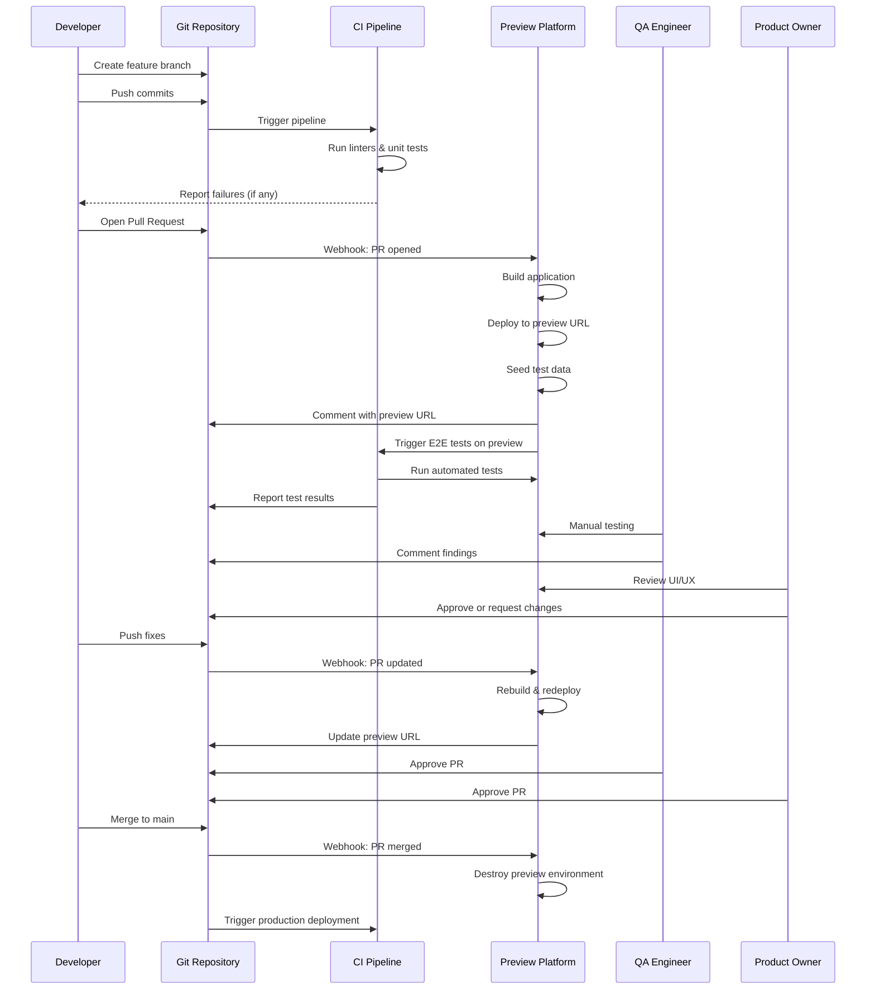
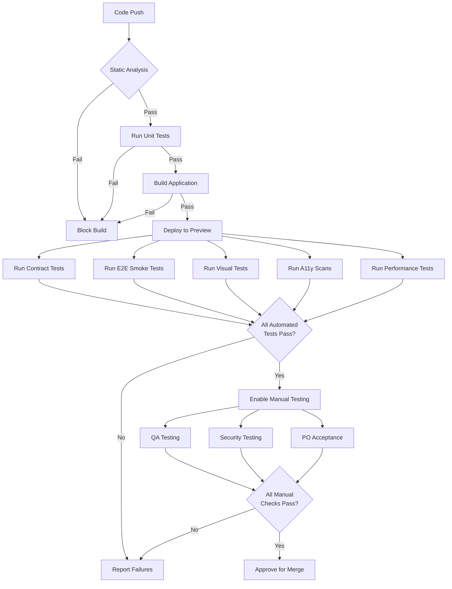
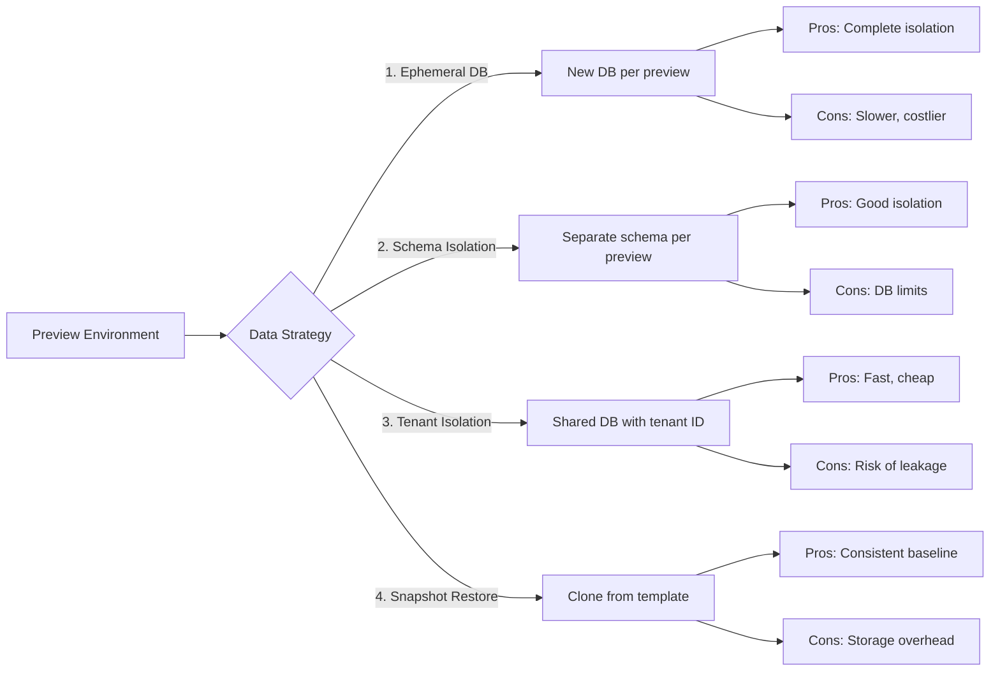
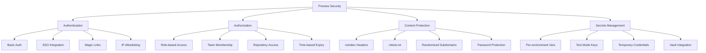
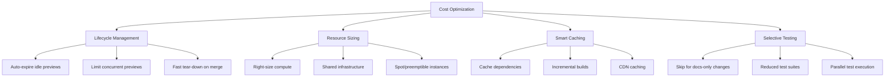

import BranchBasedTestingImage from '/img/undraw_pull_request.svg';

<div className="text--center margin-bottom--lg">
  <BranchBasedTestingImage width="80%" height="300px" />
</div>

## Introduction

**Branch-Based Testing (BBT)** creates an ephemeral, production-like environment for every pull request or merge
request, enabling teams to run end-to-end tests, manual testing, and exploratory testing—and gather product owner
feedback—_before_ code is merged into the main branch.

Traditional DTAP flows (Development → Test → Acceptance → Production) delay real feedback until code reaches shared test
environments. Branch-Based Testing short-circuits that delay by producing a **preview deployment per branch/PR**,
allowing reviewers, QA engineers, designers, and product owners to interact with, test, and provide feedback on the
exact change set.

:::tip Key Insight

Branch-Based Testing transforms code review from a static activity into an interactive experience where stakeholders can
click, test, and validate changes in a production-like environment.

:::

:::info Related Content

Branch-based testing is one of several testing strategies. For a comprehensive overview of software testing, including
unit tests, integration tests, E2E testing, TDD, and BDD, see the [Software Testing](/testing) chapter.

:::

## Why Branch-Based Testing?

Branch-Based Testing addresses several critical challenges in modern software development:

### Faster, Higher-Quality Feedback

When changes are deployed to a preview environment, stakeholders can:

- Test UI/UX changes interactively
- Verify copy and content in context
- Run accessibility checks on live pages
- Measure actual performance metrics
- Conduct security testing in isolation

### Reduced Environment Contention

Shared staging environments often become bottlenecks:

- Multiple teams waiting for "a slot" to test
- Conflicting changes from different features
- Difficulty isolating issues to specific changes
- Complex coordination overhead

Branch-Based Testing eliminates these problems by giving each change its own isolated environment.

### Clearer Ownership

When issues are discovered:

- They're caught in the branch that introduced them
- The context is fresh in the developer's mind
- Fixes don't require tracking down old changes
- The feedback loop is tight and efficient

### Release-Ready Main Branch

With thorough testing on every branch:

- Merges become routine, low-risk events
- The main branch stays in a deployable state
- Releases are less stressful and more frequent
- Confidence in production deployments increases



:::warning Important Distinction

Continuous Integration (CI) traditionally means integrating to the **main branch at least daily**. Running CI pipelines
on feature branches is helpful but isn't CI in the strict sense. Branch-Based Testing works best with trunk-based
development or short-lived feature branches. Keep merges to main frequent.

:::

## Core Concepts and Vocabulary

Understanding the terminology helps teams communicate effectively about Branch-Based Testing:

### Preview Deployment

A **preview deployment** (also called deploy preview, PR preview, or MR preview) is an automatically built, unique URL
for a branch or pull request that updates with each push. It's the foundation of Branch-Based Testing.

**Characteristics:**

- Generated automatically when a PR is opened
- Updates automatically on each commit
- Accessible via a unique, shareable URL
- Identical to production in configuration

### Ephemeral Environment

An **ephemeral environment** includes all the supporting infrastructure for a preview:

- Front-end assets (HTML, CSS, JavaScript)
- Serverless functions or API endpoints
- Database instances or data seeds
- Third-party service configurations
- Environment variables and secrets

These environments are:

- **Temporary**: Created on PR open, destroyed on close/merge
- **Isolated**: Changes don't affect other branches or environments
- **Reproducible**: Consistent setup across all previews
- **Cost-effective**: Only exist when needed

### Isolated Context

Each preview runs with its own **isolated context**:

- Environment variables specific to the preview
- Dedicated secrets and API keys (test mode)
- Seeded data for testing scenarios
- Feature flags configured for testing
- Logging and monitoring endpoints

**Isolation prevents:**

- Cross-contamination between branches
- Data corruption from parallel tests
- Authentication conflicts
- Resource competition

### Automated Tear-Down

When a PR closes or merges, **tear-down** handles:

- Deleting compute resources (containers, functions)
- Removing storage (databases, files, caches)
- Cleaning up DNS records and subdomains
- Revoking temporary credentials
- Archiving logs and metrics

## Branch-Based Testing Workflow

Here's a comprehensive workflow showing how Branch-Based Testing fits into the development process:



### Step-by-Step Process

#### 1. Developer Opens a Branch

Create a branch for a small, well-scoped change:

```bash
git checkout -b feature/user-profile-update
```

**Best practices:**

- Keep branches focused on single features or fixes
- Use descriptive branch names
- Plan for branches to live 1-3 days maximum

#### 2. Push Commits

As you develop, push regularly:

```bash
git add .
git commit -m "feat: add user avatar upload"
git push origin feature/user-profile-update
```

**What happens:**

- CI pipeline runs: static analysis, unit tests, build
- Fast feedback on basic quality checks
- Fails fast if fundamental issues exist

#### 3. Open Pull Request

Create a PR when ready for review:

```bash
gh pr create --title "Add user avatar upload" \
  --body "Implements profile picture uploads with image optimization"
```

**Triggers:**

- Preview platform receives webhook
- Automated build starts
- Preview environment is provisioned
- Unique URL is generated

#### 4. Stakeholder Review

Multiple parties review the preview:

**QA Engineer:**

- Runs regression test suites
- Conducts exploratory testing
- Checks edge cases and error states
- Validates cross-browser compatibility

**Product Owner:**

- Validates user experience
- Checks copy and content
- Verifies acceptance criteria
- Tests user workflows

**Designer:**

- Reviews visual implementation
- Checks responsive behavior
- Validates accessibility
- Tests animations and interactions

**Security Team:**

- Runs security scans
- Tests authentication flows
- Checks for vulnerabilities
- Validates data handling

#### 5. Iterate and Fix

Push updates to the same branch:

```bash
git add .
git commit -m "fix: handle large image uploads gracefully"
git push
```

**Result:**

- Preview automatically rebuilds
- Same URL updates with new changes
- Reviewers are notified
- Tests run again

#### 6. Quality Gates Pass

Before merging, ensure:

- ✅ All automated tests pass
- ✅ Performance budgets met
- ✅ Accessibility checks pass
- ✅ Visual regression approved
- ✅ Manual testing complete
- ✅ Required approvals obtained

#### 7. Merge and Deploy

```bash
gh pr merge --squash
```

**Automated actions:**

- Preview environment destroyed
- Main branch CI/CD triggered
- Production deployment (if configured)
- Team notifications sent

## Implementation Patterns by Platform

Different platforms offer varying levels of Branch-Based Testing support. Here's how to implement BBT across popular
platforms:

### Netlify

**Best for:** Static sites, Jamstack applications, serverless functions

**What you get:**

- Automatic Deploy Previews for every PR
- Unique URL per PR across GitHub, GitLab, Bitbucket, Azure DevOps
- Per-context environment variables
- Password protection for previews
- Built-in collaboration tools (comments, screenshots)
- Automatic deploy subdomain support

**Configuration example:**

```toml
# netlify.toml
[build]
  command = "npm run build"
  publish = "dist"

[context.deploy-preview]
  environment = { NODE_ENV = "preview", API_URL = "https://api-preview.example.com" }

[context.deploy-preview.processing]
  skip_processing = false
```

**Key features:**

- Use `DEPLOY_PRIME_URL` to dynamically reference preview URL
- Set access controls per preview
- Configure specific entry points for testing
- Integrate with collaboration tools

### Vercel

**Best for:** Next.js, React, Vue, Nuxt applications

**What you get:**

- Deployment for every push
- Preview URL for every merge request
- Rich `VERCEL_GIT_*` environment variables
- Automatic comments on MRs
- Instant rollback capability
- Built-in performance monitoring

**Configuration example:**

```json
{
  "buildCommand": "npm run build",
  "outputDirectory": "out",
  "devCommand": "npm run dev",
  "framework": "nextjs",
  "installCommand": "npm install",
  "env": {
    "NEXT_PUBLIC_API_URL": "https://api.example.com"
  },
  "preview": {
    "env": {
      "NEXT_PUBLIC_API_URL": "https://api-preview.example.com"
    }
  }
}
```

**Environment variables available:**

- `VERCEL_URL`: Deployment URL
- `VERCEL_GIT_COMMIT_SHA`: Commit SHA
- `VERCEL_GIT_COMMIT_REF`: Branch name
- `VERCEL_GIT_COMMIT_AUTHOR_LOGIN`: Author username

### AWS Amplify

**Best for:** Full-stack applications with AWS backend

**What you get:**

- Web previews per PR
- Temporary backend environments per PR
- Automatic cleanup on PR close
- Route 53 subdomain creation
- IAM-based access control

**Limitations:**

- Branch quotas apply
- Public repository security restrictions
- IAM role requirements

**Configuration example:**

```yaml
# amplify.yml
version: 1
frontend:
  phases:
    preBuild:
      commands:
        - npm ci
    build:
      commands:
        - npm run build
  artifacts:
    baseDirectory: build
    files:
      - '**/*'
  cache:
    paths:
      - node_modules/**/*
backend:
  phases:
    preBuild:
      commands:
        - amplifyPush --simple
```

**Best practices:**

- Decide whether PRs spin new backends or reuse existing
- Monitor quotas and costs
- Close stale PRs promptly
- Add expiration policies

### DIY with GitHub Actions and AWS

**Best for:** Custom workflows, maximum control, AWS-centric teams

**Workflow example:**

```yaml
name: Deploy Preview
on:
  pull_request:
    types: [opened, synchronize, reopened]

jobs:
  deploy-preview:
    runs-on: ubuntu-latest
    permissions:
      pull-requests: write
      contents: read

    steps:
      - uses: actions/checkout@v4

      - name: Setup Node.js
        uses: actions/setup-node@v4
        with:
          node-version: '20'
          cache: 'npm'

      - name: Install dependencies
        run: npm ci

      - name: Build with path prefix
        run: |
          export PATH_PREFIX=preview/${{ github.event.number }}
          npm run build -- --prefix-paths
        env:
          NODE_ENV: preview
          REACT_APP_API_URL: https://api-preview.example.com

      - name: Deploy to S3
        uses: jakejarvis/s3-sync-action@master
        with:
          args: --delete --cache-control max-age=3600
        env:
          AWS_S3_BUCKET: ${{ secrets.AWS_PREVIEW_BUCKET }}
          AWS_ACCESS_KEY_ID: ${{ secrets.AWS_ACCESS_KEY_ID }}
          AWS_SECRET_ACCESS_KEY: ${{ secrets.AWS_SECRET_ACCESS_KEY }}
          AWS_REGION: us-east-1
          SOURCE_DIR: build
          DEST_DIR: preview/${{ github.event.number }}

      - name: Invalidate CloudFront cache
        run: |
          aws cloudfront create-invalidation \
            --distribution-id ${{ secrets.CLOUDFRONT_DIST_ID }} \
            --paths "/preview/${{ github.event.number }}/*"
        env:
          AWS_ACCESS_KEY_ID: ${{ secrets.AWS_ACCESS_KEY_ID }}
          AWS_SECRET_ACCESS_KEY: ${{ secrets.AWS_SECRET_ACCESS_KEY }}
          AWS_DEFAULT_REGION: us-east-1

      - name: Comment PR with preview URL
        uses: actions/github-script@v7
        with:
          script: |
            const prNumber = context.issue.number;
            const previewUrl = `https://preview.example.com/preview/${prNumber}`;

            github.rest.issues.createComment({
              issue_number: prNumber,
              owner: context.repo.owner,
              repo: context.repo.repo,
              body: `🚀 **Preview deployed!**\n\n${previewUrl}\n\nUpdates automatically on new commits.`
            });

  cleanup-preview:
    runs-on: ubuntu-latest
    if: github.event.action == 'closed'

    steps:
      - name: Delete S3 preview
        run: |
          aws s3 rm s3://${{ secrets.AWS_PREVIEW_BUCKET }}/preview/${{ github.event.number }} \
            --recursive
        env:
          AWS_ACCESS_KEY_ID: ${{ secrets.AWS_ACCESS_KEY_ID }}
          AWS_SECRET_ACCESS_KEY: ${{ secrets.AWS_SECRET_ACCESS_KEY }}
          AWS_DEFAULT_REGION: us-east-1

      - name: Comment cleanup
        uses: actions/github-script@v7
        with:
          script: |
            github.rest.issues.createComment({
              issue_number: context.issue.number,
              owner: context.repo.owner,
              repo: context.repo.repo,
              body: '🧹 Preview environment cleaned up.'
            });
```

**Additional considerations:**

- Set up S3 lifecycle policies to auto-expire old previews
- Use least-privilege IAM policies
- Implement preview password protection via Lambda@Edge
- Monitor costs with AWS Cost Explorer tags

## Test Strategy for Preview Environments

A comprehensive testing strategy for previews balances automation speed with manual quality checks:

| Layer                  | Goal                          | Typical Checks                                            | Tools                                       | When to Run        |
| ---------------------- | ----------------------------- | --------------------------------------------------------- | ------------------------------------------- | ------------------ |
| **Static & Unit**      | Fast correctness              | Linting, formatting, type checking, unit tests            | ESLint, Prettier, TypeScript, Jest, Vitest  | Before build       |
| **Component/Contract** | Integration surfaces          | Contract tests, component tests, API schema validation    | Pact, Playwright Component, MSW             | After build        |
| **E2E Smoke**          | Critical paths work           | Login, key user flows, happy paths                        | Playwright, Cypress, Puppeteer              | On preview URL     |
| **Visual Regression**  | No unintended UI changes      | Screenshot comparison, visual diffs                       | Chromatic, Percy, Applitools                | On preview URL     |
| **Accessibility**      | WCAG compliance               | Automated a11y scans, keyboard navigation, screen readers | axe-core, Pa11y, Lighthouse                 | On preview URL     |
| **Performance**        | Meet budgets                  | LCP, FID, CLS, TTI, bundle size                           | Lighthouse CI, WebPageTest, Bundle Analyzer | On preview URL     |
| **Security**           | No vulnerabilities introduced | Dependency scans, SAST, basic penetration tests           | Snyk, npm audit, OWASP ZAP                  | Before/after build |
| **Exploratory**        | Fit, finish, edge cases       | Persona walkthroughs, boundary testing, error states      | Session-based test charters                 | Manual on preview  |
| **Acceptance**         | Meets requirements            | User story verification, acceptance criteria validation   | Product owner review                        | Manual on preview  |

### Test Execution Strategy



### Example: Playwright E2E Tests on Preview

```javascript
// tests/e2e/critical-paths.spec.js
import { test, expect } from '@playwright/test';

// Get preview URL from environment variable
const baseURL = process.env.PREVIEW_URL || 'http://localhost:3000';

test.describe('Critical User Flows', () => {
  test.beforeEach(async ({ page }) => {
    // Each test gets a fresh preview instance
    await page.goto(baseURL);
  });

  test('user can sign up and complete onboarding', async ({ page }) => {
    // Click sign up
    await page.click('[data-testid="signup-button"]');

    // Fill registration form
    await page.fill('[name="email"]', 'test@example.com');
    await page.fill('[name="password"]', 'SecureP@ssw0rd');
    await page.fill('[name="passwordConfirm"]', 'SecureP@ssw0rd');

    // Submit and wait for redirect
    await page.click('[type="submit"]');
    await page.waitForURL('**/onboarding');

    // Complete onboarding steps
    await page.fill('[name="firstName"]', 'Test');
    await page.fill('[name="lastName"]', 'User');
    await page.click('[data-testid="next-button"]');

    await page.selectOption('[name="role"]', 'developer');
    await page.click('[data-testid="complete-button"]');

    // Verify successful onboarding
    await expect(page).toHaveURL('**/dashboard');
    await expect(page.locator('[data-testid="welcome-message"]')).toContainText('Welcome, Test');
  });

  test('user can create and save a new project', async ({ page }) => {
    // Login first
    await page.goto(`${baseURL}/login`);
    await page.fill('[name="email"]', 'existing@example.com');
    await page.fill('[name="password"]', 'password123');
    await page.click('[type="submit"]');

    // Create new project
    await page.click('[data-testid="new-project-button"]');
    await page.fill('[name="projectName"]', 'Test Project');
    await page.fill('[name="description"]', 'A project created in preview testing');
    await page.click('[data-testid="save-project"]');

    // Verify project appears in list
    await expect(page.locator('[data-testid="project-list"]')).toContainText('Test Project');
  });
});

test.describe('Performance Checks', () => {
  test('homepage loads within performance budget', async ({ page }) => {
    const startTime = Date.now();
    await page.goto(baseURL);
    await page.waitForLoadState('networkidle');
    const loadTime = Date.now() - startTime;

    // Assert load time is under 3 seconds
    expect(loadTime).toBeLessThan(3000);
  });
});
```

### GitHub Actions Integration for Tests

```yaml
name: E2E Tests on Preview

on:
  pull_request:
    types: [opened, synchronize, reopened]

jobs:
  e2e-tests:
    runs-on: ubuntu-latest
    needs: deploy-preview # Wait for preview deployment

    steps:
      - uses: actions/checkout@v4

      - name: Setup Node.js
        uses: actions/setup-node@v4
        with:
          node-version: '20'

      - name: Install dependencies
        run: npm ci

      - name: Install Playwright browsers
        run: npx playwright install --with-deps chromium

      - name: Wait for preview to be ready
        run: |
          npx wait-on https://preview.example.com/preview/${{ github.event.number }} \
            --timeout 300000 \
            --interval 5000

      - name: Run E2E tests
        run: npx playwright test
        env:
          PREVIEW_URL: https://preview.example.com/preview/${{ github.event.number }}

      - name: Upload test results
        if: always()
        uses: actions/upload-artifact@v4
        with:
          name: playwright-report
          path: playwright-report/
          retention-days: 7

      - name: Comment test results
        if: always()
        uses: actions/github-script@v7
        with:
          script: |
            const fs = require('fs');
            let status = '${{ job.status }}';
            let emoji = status === 'success' ? '✅' : '❌';

            github.rest.issues.createComment({
              issue_number: context.issue.number,
              owner: context.repo.owner,
              repo: context.repo.repo,
              body: `${emoji} **E2E Tests ${status}**\n\nView detailed report in Actions artifacts.`
            });
```

## Data Management and Seeding

Preview environments need realistic but safe data for effective testing:

### Synthetic Data Generation

Create realistic test data programmatically:

```javascript
// scripts/seed-preview-data.js
const { faker } = require('@faker-js/faker');
const { PrismaClient } = require('@prisma/client');

const prisma = new PrismaClient();

async function seedPreviewData() {
  console.log('Seeding preview environment...');

  // Create test users with known credentials
  const testUsers = await Promise.all([
    prisma.user.create({
      data: {
        email: 'admin@preview.test',
        password: await hashPassword('Preview123!'),
        role: 'ADMIN',
        firstName: 'Admin',
        lastName: 'User',
      },
    }),
    prisma.user.create({
      data: {
        email: 'user@preview.test',
        password: await hashPassword('Preview123!'),
        role: 'USER',
        firstName: 'Regular',
        lastName: 'User',
      },
    }),
  ]);

  // Generate realistic but fake projects
  for (let i = 0; i < 10; i++) {
    await prisma.project.create({
      data: {
        name: faker.company.name(),
        description: faker.company.catchPhrase(),
        status: faker.helpers.arrayElement(['ACTIVE', 'ARCHIVED', 'DRAFT']),
        ownerId: faker.helpers.arrayElement(testUsers).id,
        createdAt: faker.date.past(),
      },
    });
  }

  console.log('✅ Preview data seeded successfully');
}

seedPreviewData()
  .catch((e) => {
    console.error('❌ Seeding failed:', e);
    process.exit(1);
  })
  .finally(async () => {
    await prisma.$disconnect();
  });
```

### Data Isolation Strategies



### Environment-Specific Configuration

```javascript
// config/database.js
function getDatabaseConfig() {
  const env = process.env.NODE_ENV;
  const prNumber = process.env.PR_NUMBER || process.env.VERCEL_GIT_PULL_REQUEST_ID;

  // Production
  if (env === 'production') {
    return {
      url: process.env.DATABASE_URL,
      ssl: { rejectUnauthorized: true },
    };
  }

  // Preview environments
  if (env === 'preview' && prNumber) {
    return {
      url: process.env.PREVIEW_DATABASE_URL || `postgresql://localhost/preview_${prNumber}`,
      ssl: false,
    };
  }

  // Development
  return {
    url: 'postgresql://localhost/dev',
    ssl: false,
  };
}

module.exports = { getDatabaseConfig };
```

## Security and Access Control

Preview environments require careful security considerations:

### Access Control Options



### Example: Netlify Password Protection

```toml
# netlify.toml
[context.deploy-preview]
  [context.deploy-preview.processing]
    skip_processing = false

  # Protect all deploy previews with password
  [[context.deploy-preview.plugins]]
    package = "@netlify/plugin-password-protection"
    [context.deploy-preview.plugins.inputs]
      password = "${PREVIEW_PASSWORD}"
```

### Example: CloudFront Lambda@Edge Protection

```javascript
// lambda-edge/auth.js
'use strict';

exports.handler = async (event, context) => {
  const request = event.Records[0].cf.request;
  const headers = request.headers;

  // Only protect preview paths
  if (!request.uri.startsWith('/preview/')) {
    return request;
  }

  // Check for valid auth header
  const authHeader = headers.authorization ? headers.authorization[0].value : '';
  const expectedAuth = 'Basic ' + Buffer.from('preview:' + process.env.PREVIEW_PASSWORD).toString('base64');

  if (authHeader !== expectedAuth) {
    return {
      status: '401',
      statusDescription: 'Unauthorized',
      headers: {
        'www-authenticate': [{ key: 'WWW-Authenticate', value: 'Basic realm="Preview Environment"' }],
      },
    };
  }

  return request;
};
```

### Secrets Management Best Practices

**DO:**

- ✅ Use separate secrets for preview environments
- ✅ Enable "test mode" on third-party services (Stripe, SendGrid, etc.)
- ✅ Rotate preview secrets regularly
- ✅ Use short-lived credentials when possible
- ✅ Store secrets in platform-specific secret management (GitHub Secrets, AWS Secrets Manager)
- ✅ Scope IAM permissions minimally

**DON'T:**

- ❌ Reuse production credentials in previews
- ❌ Commit secrets to version control (even for test environments)
- ❌ Use actual payment processing in previews
- ❌ Grant excessive permissions to preview deployments
- ❌ Allow public internet access without authentication
- ❌ Skip SSL/TLS for preview environments

### Search Engine Protection

Prevent preview environments from being indexed:

```html
<!-- Added automatically by platform or via middleware -->
<meta name="robots" content="noindex, nofollow" />
```

```javascript
// middleware/preview-headers.js
export function previewSecurityHeaders(req, res, next) {
  if (process.env.NODE_ENV === 'preview') {
    res.setHeader('X-Robots-Tag', 'noindex, nofollow');
    res.setHeader('X-Frame-Options', 'SAMEORIGIN');
    res.setHeader('X-Content-Type-Options', 'nosniff');
  }
  next();
}
```

## Economics and Cost Management

Branch-Based Testing has costs, but also significant savings:

### Direct Costs

**Compute:**

- Build minutes on CI/CD platform
- Runtime for preview deployments
- Database instances or connections
- Serverless function invocations

**Storage:**

- Static assets in object storage
- Database storage per preview
- Build artifacts and caches
- Log retention

**Network:**

- CDN bandwidth for preview access
- Data transfer between services
- API calls to third-party services

**Platform fees:**

- Per-seat or per-preview costs
- Overage charges on usage limits

### Cost Optimization Strategies



### Automated Cost Controls

**GitHub Actions example:**

```yaml
name: Deploy Preview with Cost Controls

on:
  pull_request:
    types: [opened, synchronize, reopened]

jobs:
  check-preview-eligibility:
    runs-on: ubuntu-latest
    outputs:
      should_deploy: ${{ steps.check.outputs.should_deploy }}

    steps:
      - uses: actions/checkout@v4
        with:
          fetch-depth: 0

      - name: Check if preview needed
        id: check
        run: |
          # Skip preview for docs-only changes
          CHANGED_FILES=$(git diff --name-only HEAD~1)
          if echo "$CHANGED_FILES" | grep -qvE '^docs/|^README\.md|\.md$'; then
            echo "should_deploy=true" >> $GITHUB_OUTPUT
          else
            echo "should_deploy=false" >> $GITHUB_OUTPUT
          fi

      - name: Check concurrent preview limit
        if: steps.check.outputs.should_deploy == 'true'
        run: |
          ACTIVE_PREVIEWS=$(aws s3 ls s3://${{ secrets.AWS_PREVIEW_BUCKET }}/preview/ | wc -l)
          MAX_PREVIEWS=10

          if [ "$ACTIVE_PREVIEWS" -ge "$MAX_PREVIEWS" ]; then
            echo "❌ Maximum concurrent previews ($MAX_PREVIEWS) reached"
            exit 1
          fi

  deploy-preview:
    needs: check-preview-eligibility
    if: needs.check-preview-eligibility.outputs.should_deploy == 'true'
    runs-on: ubuntu-latest
    # ... deployment steps ...
```

**Automatic cleanup of stale previews:**

```yaml
name: Cleanup Stale Previews

on:
  schedule:
    - cron: '0 2 * * *' # Daily at 2 AM UTC

jobs:
  cleanup:
    runs-on: ubuntu-latest

    steps:
      - name: Find and remove stale previews
        run: |
          # Find previews older than 7 days
          CUTOFF_DATE=$(date -d '7 days ago' +%s)

          aws s3api list-objects-v2 \
            --bucket ${{ secrets.AWS_PREVIEW_BUCKET }} \
            --prefix preview/ \
            --query 'Contents[?LastModified<`'"$(date -d "@$CUTOFF_DATE" --iso-8601)"'`].[Key]' \
            --output text | while read key; do
              echo "Deleting stale preview: $key"
              aws s3 rm "s3://${{ secrets.AWS_PREVIEW_BUCKET }}/$key" --recursive
            done
        env:
          AWS_ACCESS_KEY_ID: ${{ secrets.AWS_ACCESS_KEY_ID }}
          AWS_SECRET_ACCESS_KEY: ${{ secrets.AWS_SECRET_ACCESS_KEY }}
          AWS_DEFAULT_REGION: us-east-1
```

### Indirect Savings

**Faster defect detection:**

- Bugs found in branch: **1x cost** to fix
- Bugs found in staging: **10x cost** (context switching, coordination)
- Bugs found in production: **100x cost** (customer impact, hotfixes, reputation)

**Reduced environment contention:**

- No waiting for staging slots: **hours/days saved per feature**
- No debugging "who broke staging": **reduced incident response**
- No coordination overhead: **fewer meetings and messages**

**Improved cycle time:**

- Faster feedback loops: **smaller batches, more iterations**
- Higher confidence merging: **less time in code review paralysis**
- Product owner availability: **review on their schedule, not during release windows**

### Metrics to Track

Monitor these to understand BBT's value:

```javascript
// Example metrics collection
const previewMetrics = {
  // Cost metrics
  buildTimeSeconds: 145,
  previewLifetimeHours: 18,
  computeCostDollars: 0.23,
  storageCostDollars: 0.05,

  // Quality metrics
  automatedTestsPassed: 47,
  automatedTestsFailed: 2,
  manualTestsExecuted: 5,
  defectsFound: 3,
  defectsFixedInBranch: 3,

  // Cycle time metrics
  prOpenToFirstReviewMinutes: 15,
  prOpenToMergeHours: 6,
  numberOfIterations: 2,
  totalCommits: 4,

  // Engagement metrics
  stakeholderReviews: 3, // QA, designer, PO
  commentsOnPR: 12,
  previewPageViews: 47,
};
```

## Best Practices

### 1. Production-Like Fidelity

Your preview environment should mirror production as closely as practical:

✅ **Same runtime and dependencies**

```json
{
  "engines": {
    "node": "20.x"
  }
}
```

✅ **Same build process**

```bash
# Production build
npm run build

# Preview build (same command)
npm run build
```

✅ **Same environment configuration (with test variants)**

```javascript
// Production
{
  "STRIPE_KEY": "pk_live_..."
}

// Preview (test mode)
{
  "STRIPE_KEY": "pk_test_..."
}
```

✅ **Representative data**

- Realistic volume and complexity
- Edge cases and boundary conditions
- Various user roles and permissions

❌ **Don't:**

- Use different Node versions or dependencies
- Skip production optimizations (minification, compression)
- Use completely empty or minimal datasets
- Disable security features "for testing"

### 2. Fast Feedback

Speed is essential for effective Branch-Based Testing:

**Build optimization:**

```yaml
# Cache dependencies
- uses: actions/cache@v3
  with:
    path: ~/.npm
    key: ${{ runner.os }}-node-${{ hashFiles('**/package-lock.json') }}

# Incremental builds where possible
- run: npm run build -- --incremental
```

**Parallel testing:**

```javascript
// playwright.config.js
export default {
  workers: process.env.CI ? 4 : 2,
  fullyParallel: true,
  // ... other config
};
```

**Smart test selection:**

```javascript
// Only run tests related to changed files
const changedFiles = getChangedFiles();
const relevantTests = getTestsForFiles(changedFiles);
await runTests(relevantTests);
```

### 3. Clear Lifecycle

Set and communicate clear expectations:

**Preview lifecycle policy:**

- ⏱️ Previews created: On PR open
- 🔄 Previews updated: On every commit
- 🗑️ Previews deleted: On PR close/merge
- ⚠️ Stale preview warning: After 7 days
- 🧹 Forced cleanup: After 14 days

**Communicate via PR comments:**

```javascript
// Post comprehensive preview info
const previewComment = `
🚀 **Preview Environment Ready**

**URL:** ${previewUrl}
**Branch:** ${branchName}
**Commit:** ${commitSha.substring(0, 7)}

**Test Credentials:**
- Email: test@preview.com
- Password: Preview123!

**Automated Checks:**
- ✅ Build: Passed
- ✅ Unit Tests: 142 passed
- ✅ E2E Tests: 23 passed
- ✅ Performance: LCP 1.2s (budget: 2.5s)
- ✅ Accessibility: 0 violations

**Lifecycle:**
- Updates automatically on new commits
- Will be deleted when PR is closed/merged
- Expires after 7 days of inactivity

**Need help?** See [Preview Testing Guide](https://wiki.example.com/preview-testing)
`;
```

### 4. Comprehensive Quality Gates

Define what "ready to merge" means:

```yaml
# .github/branch-protection-rules.yml
required_status_checks:
  strict: true
  checks:
    - 'Build'
    - 'Unit Tests'
    - 'E2E Tests'
    - 'Visual Regression'
    - 'Accessibility Scan'
    - 'Performance Budget'
    - 'Security Scan'

required_reviews:
  required_approving_review_count: 2
  dismiss_stale_reviews: true
  require_code_owner_reviews: true
```

### 5. Observability

Make previews debuggable:

**Link to logs:**

```javascript
// Include tracing info in preview
window.__PREVIEW_INFO__ = {
  prNumber: process.env.PR_NUMBER,
  commitSha: process.env.COMMIT_SHA,
  buildId: process.env.BUILD_ID,
  logsUrl: `https://logs.example.com/builds/${process.env.BUILD_ID}`,
};
```

**Capture metrics:**

```javascript
// Send preview metrics
import { capturePreviewMetrics } from './monitoring';

capturePreviewMetrics({
  prNumber: process.env.PR_NUMBER,
  event: 'page_view',
  page: window.location.pathname,
  timestamp: Date.now(),
});
```

## Common Challenges and Solutions

### Challenge 1: Flaky Tests

**Problem:** Tests pass locally but fail inconsistently in preview environments.

**Causes:**

- Timing issues (async operations, animations)
- Network variability
- Non-deterministic data
- Shared state between tests

**Solutions:**

```javascript
// Use explicit waits instead of implicit timeouts
await page.waitForSelector('[data-testid="result"]', { state: 'visible' });

// Wait for network to be idle
await page.waitForLoadState('networkidle');

// Use deterministic data
await seedTestData({ userId: 'fixed-test-user-1' });

// Isolate test state
test.beforeEach(async ({ page, context }) => {
  // Clear cookies and storage
  await context.clearCookies();
  await page.evaluate(() => localStorage.clear());
});

// Add retries for genuinely flaky operations
test('user uploads avatar', async ({ page }) => {
  await test.step('upload with retry', async () => {
    for (let i = 0; i < 3; i++) {
      try {
        await page.setInputFiles('[type="file"]', 'test-avatar.jpg');
        await expect(page.locator('[data-testid="avatar-preview"]')).toBeVisible({ timeout: 5000 });
        break;
      } catch (e) {
        if (i === 2) throw e;
        await page.waitForTimeout(1000);
      }
    }
  });
});
```

### Challenge 2: Long Build Times

**Problem:** Previews take 10+ minutes to deploy, slowing feedback.

**Solutions:**

```yaml
# Incremental builds
- name: Cache Next.js build
  uses: actions/cache@v3
  with:
    path: |
      ~/.npm
      ${{ github.workspace }}/.next/cache
    key: ${{ runner.os }}-nextjs-${{ hashFiles('**/package-lock.json') }}-${{ hashFiles('**/*.js', '**/*.jsx', '**/*.ts', '**/*.tsx') }}

# Parallel jobs
jobs:
  build:
    # ... build job
  test-unit:
    # ... runs in parallel with build
  test-integration:
    needs: build
    # ... runs after build completes
```

**Build optimization:**

```javascript
// next.config.js
module.exports = {
  // Only run TypeScript checking in production builds
  typescript: {
    ignoreBuildErrors: process.env.NODE_ENV === 'preview',
  },
  // Skip ESLint during preview builds (run in separate job)
  eslint: {
    ignoreDuringBuilds: process.env.NODE_ENV === 'preview',
  },
};
```

### Challenge 3: Database Migration Conflicts

**Problem:** Multiple PRs with different migrations cause conflicts.

**Solutions:**

**Strategy 1: Ephemeral databases per preview**

```bash
# Create isolated database for preview
createdb preview_pr_${PR_NUMBER}

# Run migrations
DATABASE_URL="postgresql://localhost/preview_pr_${PR_NUMBER}" npm run migrate

# Seed data
DATABASE_URL="postgresql://localhost/preview_pr_${PR_NUMBER}" npm run seed
```

**Strategy 2: Forward-only migrations**

```javascript
// Always add migrations, never modify existing ones
// migrations/20240115_add_user_avatar.js
exports.up = async (knex) => {
  await knex.schema.table('users', (table) => {
    table.string('avatar_url');
  });
};

// migrations/20240116_make_avatar_not_null.js
exports.up = async (knex) => {
  // Set default for existing rows
  await knex('users').whereNull('avatar_url').update({ avatar_url: '/default-avatar.png' });

  // Add constraint
  await knex.schema.alterTable('users', (table) => {
    table.string('avatar_url').notNullable().alter();
  });
};
```

**Strategy 3: Reset on conflict**

```bash
# Detect migration conflict
if ! npm run migrate; then
  echo "Migration conflict detected. Resetting preview database..."
  dropdb preview_pr_${PR_NUMBER}
  createdb preview_pr_${PR_NUMBER}
  npm run migrate
  npm run seed
fi
```

### Challenge 4: Third-Party Service Costs

**Problem:** Every preview calls real APIs, increasing costs.

**Solutions:**

**Use test/sandbox modes:**

```javascript
// config/services.js
const config = {
  stripe: {
    key: process.env.NODE_ENV === 'production' ? process.env.STRIPE_LIVE_KEY : process.env.STRIPE_TEST_KEY,
    mode: process.env.NODE_ENV === 'production' ? 'live' : 'test',
  },
  sendgrid: {
    key: process.env.SENDGRID_API_KEY,
    // Don't actually send emails in preview
    enabled: process.env.NODE_ENV === 'production',
  },
  analytics: {
    // Separate analytics project for preview
    projectId: process.env.NODE_ENV === 'production' ? 'prod-analytics' : 'preview-analytics',
  },
};
```

**Mock external services:**

```javascript
// middleware/mock-services.js
export function mockExternalServices(req, res, next) {
  if (process.env.NODE_ENV !== 'preview') {
    return next();
  }

  // Intercept and mock payment processing
  if (req.path.startsWith('/api/payments')) {
    return res.json({
      id: 'mock_payment_' + Date.now(),
      status: 'succeeded',
      amount: req.body.amount,
    });
  }

  // Mock email sending
  if (req.path === '/api/send-email') {
    console.log('📧 [MOCK] Email would be sent:', req.body);
    return res.json({ success: true, messageId: 'mock_' + Date.now() });
  }

  next();
}
```

### Challenge 5: Stale Previews

**Problem:** Old PRs leave preview environments running, wasting resources.

**Solutions:**

```yaml
name: Cleanup Stale Previews

on:
  schedule:
    - cron: '0 */6 * * *' # Every 6 hours

jobs:
  cleanup:
    runs-on: ubuntu-latest

    steps:
      - name: Get open PRs
        id: open_prs
        uses: actions/github-script@v7
        with:
          script: |
            const { data: prs } = await github.rest.pulls.list({
              owner: context.repo.owner,
              repo: context.repo.repo,
              state: 'open'
            });
            return prs.map(pr => pr.number);

      - name: Find deployed previews
        id: deployed_previews
        run: |
          # List all preview directories
          DEPLOYED=$(aws s3 ls s3://${{ secrets.AWS_PREVIEW_BUCKET }}/preview/ | awk '{print $2}' | sed 's/\///')
          echo "deployed=$DEPLOYED" >> $GITHUB_OUTPUT

      - name: Delete stale previews
        uses: actions/github-script@v7
        with:
          script: |
            const openPRs = ${{ steps.open_prs.outputs.result }};
            const deployed = '${{ steps.deployed_previews.outputs.deployed }}'.split('\n');

            for (const prNumber of deployed) {
              if (!openPRs.includes(parseInt(prNumber))) {
                console.log(`Cleaning up stale preview for PR #${prNumber}`);
                // Delete from S3
                await exec.exec('aws', ['s3', 'rm', `s3://${process.env.AWS_BUCKET}/preview/${prNumber}`, '--recursive']);
              }
            }
```

## Anti-Patterns to Avoid

### ❌ Long-Lived Feature Branches

**Problem:** Branches that live for weeks accumulate drift from main, making previews less representative.

**Why it's bad:**

- Preview doesn't reflect how changes will behave when merged
- Merge conflicts accumulate
- Feedback becomes stale
- Integration issues discovered too late

**Solution:**

- Keep branches short-lived (1-3 days maximum)
- Merge to main frequently
- Use feature flags for incomplete work
- Break large features into smaller, mergeable increments

```bash
# Good: Small, focused changes
git checkout -b feature/add-avatar-upload    # 2 days
git checkout -b feature/resize-avatars       # 1 day
git checkout -b feature/avatar-validation    # 1 day

# Bad: Large, long-lived branch
git checkout -b feature/complete-profile-overhaul  # 3 weeks
```

### ❌ Manual Preview Creation

**Problem:** Developers must manually trigger or create preview deployments.

**Why it's bad:**

- Inconsistent—sometimes forgotten
- Time-consuming
- Error-prone
- Reduces preview adoption

**Solution:** Fully automate preview creation on PR open:

```yaml
# Good: Automatic
on:
  pull_request:
    types: [opened, synchronize, reopened]

# Bad: Manual workflow_dispatch
on:
  workflow_dispatch:
```

### ❌ Shared Mutable State

**Problem:** Multiple previews share the same test database or other stateful resources.

**Why it's bad:**

- Tests interfere with each other
- Race conditions and data corruption
- Impossible to debug issues
- False positives and negatives

**Solution:** Complete isolation per preview:

```javascript
// Good: Isolated database per preview
const dbName = `preview_${prNumber}`;
const dbUrl = `postgresql://localhost/${dbName}`;

// Bad: Shared test database
const dbUrl = 'postgresql://localhost/shared_test';
```

### ❌ Treating Previews as the Only Gate

**Problem:** Relying solely on preview testing without maintaining a strong test suite on main.

**Why it's bad:**

- Main branch quality degrades
- Can't trust any commit to be deployable
- Integration issues between features
- Breaks CD to production

**Solution:** Layer your testing:

1. **On every commit:** Fast unit and integration tests
2. **On PR (preview):** E2E, visual, accessibility, manual
3. **On main after merge:** Full regression suite
4. **Before production deploy:** Smoke tests on staging

### ❌ Security Theater

**Problem:** Publicly accessible previews with production credentials or sensitive data.

**Why it's bad:**

- Exposes production systems to testing
- Risk of data breaches
- Credentials in PR comments or logs
- Search engines indexing preview content

**Solution:**

```javascript
// Good: Separate credentials for previews
const config = {
  database: {
    url: process.env.NODE_ENV === 'production' ? process.env.DATABASE_URL : process.env.PREVIEW_DATABASE_URL,
  },
  apiKeys: {
    stripe: process.env.NODE_ENV === 'production' ? process.env.STRIPE_LIVE_KEY : process.env.STRIPE_TEST_KEY,
  },
};

// Add access controls
<meta name="robots" content="noindex, nofollow" />;
```

### ❌ No Cost Controls

**Problem:** Unlimited concurrent previews without lifecycle management.

**Why it's bad:**

- Runaway cloud costs
- Wasted compute and storage
- Forgotten environments
- Budget surprises

**Solution:** Implement guardrails:

```javascript
// Maximum concurrent previews
if (activePreviewCount >= MAX_PREVIEWS) {
  throw new Error(`Maximum ${MAX_PREVIEWS} concurrent previews exceeded`);
}

// Automatic expiration
if (previewAge > 14 * 24 * 60 * 60 * 1000) {
  await destroyPreview(previewId);
}

// Cost alerts
if (monthlyPreviewCost > BUDGET_THRESHOLD) {
  await notifyTeam('Preview costs exceeding budget');
}
```

## Implementation Checklist

Use this checklist when rolling out Branch-Based Testing:

### Phase 1: Foundation

- [ ] **Choose platform** (Netlify, Vercel, Amplify, or DIY)
- [ ] **Set up CI pipeline** (build, lint, unit tests)
- [ ] **Configure branch protection** rules
- [ ] **Document branching strategy** (trunk-based or short-lived feature branches)
- [ ] **Define preview lifecycle policy** (creation, updates, deletion)

### Phase 2: Preview Infrastructure

- [ ] **Configure automatic preview creation** on PR open
- [ ] **Set up unique URLs** per preview (subdomain or path-based)
- [ ] **Implement environment isolation** (separate configs, secrets)
- [ ] **Add access controls** (password protection, SSO)
- [ ] **Configure search engine protection** (noindex headers)
- [ ] **Set up automatic tear-down** on PR close

### Phase 3: Data and Secrets

- [ ] **Create data seeding scripts** (synthetic or anonymized)
- [ ] **Configure per-preview databases** or isolation strategy
- [ ] **Set up test mode credentials** for third-party services
- [ ] **Implement secrets management** (platform secrets or vault)
- [ ] **Document test credentials** for reviewers

### Phase 4: Quality Gates

- [ ] **Add E2E smoke tests** on preview URL
- [ ] **Configure visual regression testing**
- [ ] **Set up accessibility scans**
- [ ] **Implement performance budgets**
- [ ] **Add security scanning**
- [ ] **Define merge criteria** (which checks must pass)

### Phase 5: Developer Experience

- [ ] **Add PR comments** with preview URL and status
- [ ] **Create runbooks** for common issues
- [ ] **Set up observability** (logs, metrics, traces)
- [ ] **Document preview testing workflow**
- [ ] **Train team** on preview usage

### Phase 6: Cost Management

- [ ] **Set concurrent preview limits**
- [ ] **Implement stale preview cleanup**
- [ ] **Add cost monitoring and alerts**
- [ ] **Optimize build times** (caching, incremental builds)
- [ ] **Configure selective preview creation** (skip for docs-only changes)

### Phase 7: Measure and Improve

- [ ] **Track key metrics** (cycle time, defect escape rate, costs)
- [ ] **Gather team feedback**
- [ ] **Identify and fix flaky tests**
- [ ] **Optimize slow builds**
- [ ] **Iterate on process improvements**

## Key Takeaways

Branch-Based Testing transforms the development workflow by:

1. **Shortening feedback loops** — Stakeholders review working software, not just code
2. **Reducing environment contention** — Every change gets its own isolated environment
3. **Catching issues earlier** — Defects found in branch are 10-100x cheaper to fix than in production
4. **Improving collaboration** — QA, design, and product can engage throughout development
5. **Increasing deployment confidence** — Main branch stays release-ready at all times

**Remember:**

- Keep branches **short-lived** (days, not weeks)
- Make preview creation **fully automatic**
- Ensure preview environments are **production-like**
- Implement **comprehensive quality gates**
- Monitor **costs and metrics**
- Maintain **clear lifecycle policies**

**Branch-Based Testing is not a replacement for:**

- Continuous Integration to main
- Strong automated test suites
- Code review practices
- Production monitoring

It's a **complement** that adds an interactive, production-like verification step before merging, significantly reducing
the risk of defects reaching production while accelerating development velocity.

## Further Reading

- **Martin Fowler on Continuous Integration** — Understanding true CI vs. branch testing:
  [martinfowler.com/articles/continuousIntegration.html](https://martinfowler.com/articles/continuousIntegration.html)
- **Netlify Deploy Previews** — Original implementation and concepts:
  [docs.netlify.com/site-deploys/deploy-previews/](https://docs.netlify.com/site-deploys/deploy-previews/)
- **Vercel Preview Deployments** — Framework-optimized previews:
  [vercel.com/docs/deployments/preview-deployments](https://vercel.com/docs/deployments/preview-deployments)
- **AWS Amplify Hosting** — Full-stack preview environments:
  [docs.amplify.aws/guides/hosting/preview/](https://docs.amplify.aws/guides/hosting/preview/)
- **Trunk-Based Development** — Branching strategy that works well with BBT:
  [trunkbaseddevelopment.com](https://trunkbaseddevelopment.com)
- **Feature Flags** — Alternative to long-lived branches: See the [Feature Flags](/feature-flags) chapter
