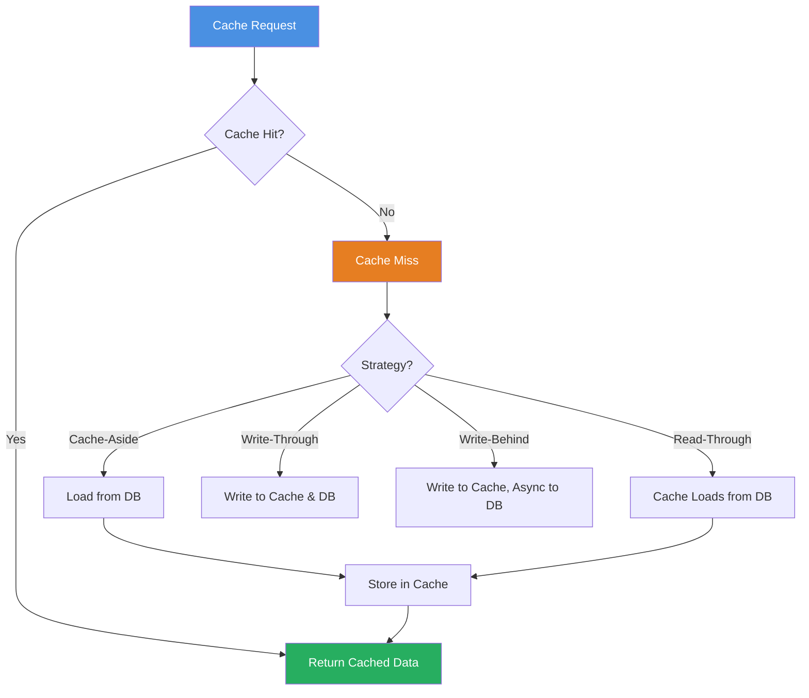
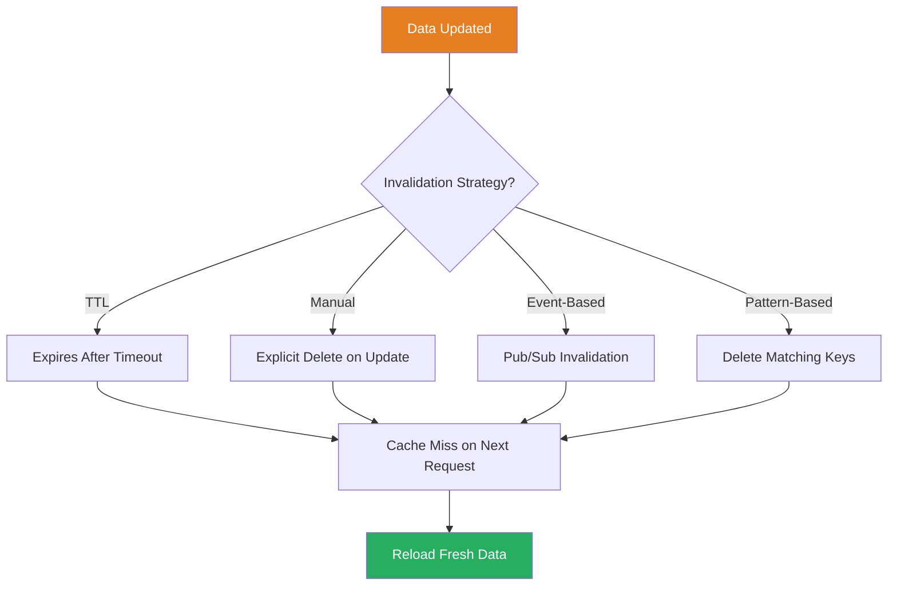
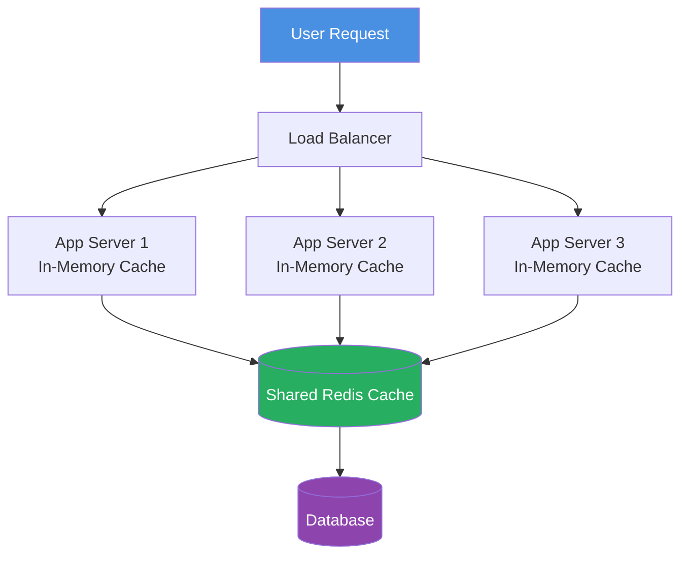

import undrawCaching from '/img/undraw_fast_loading.svg';

<div style={{ textAlign: 'center', margin: '2rem 0' }}>
  
</div>

# Caching Strategies

Caching is one of the most effective techniques for improving application performance and scalability. By storing
frequently accessed data in fast-access storage layers, you can dramatically reduce latency, decrease database load, and
improve user experience. However, caching introduces complexity around data consistency, invalidation, and storage
management.

## Why Caching Matters

Caching addresses several critical challenges in modern software systems:

- **Performance**: Reduces response times from seconds to milliseconds
- **Scalability**: Decreases load on databases and backend services
- **Cost Efficiency**: Reduces infrastructure costs by minimizing expensive operations
- **Reliability**: Provides fallback data when primary systems are unavailable
- **User Experience**: Delivers faster, more responsive applications

:::tip Real-World Impact

A well-implemented caching strategy can reduce database queries by 80-95% and improve response times by 10-100x. For
example, serving data from Redis (sub-millisecond) vs. a database query (10-100ms) can transform user experience.

:::

## Types of Caching

Understanding different caching layers helps you choose the right approach for your use case.

### Client-Side Caching

Caching data in the user's browser or application:

```javascript
// Browser localStorage caching
class LocalStorageCache {
  constructor(ttl = 3600000) {
    // Default TTL: 1 hour
    this.ttl = ttl;
  }

  set(key, value, customTtl = null) {
    const item = {
      value: value,
      timestamp: Date.now(),
      ttl: customTtl || this.ttl,
    };
    localStorage.setItem(key, JSON.stringify(item));
  }

  get(key) {
    const item = localStorage.getItem(key);
    if (!item) return null;

    const parsed = JSON.parse(item);
    const age = Date.now() - parsed.timestamp;

    // Check if item has expired
    if (age > parsed.ttl) {
      localStorage.removeItem(key);
      return null;
    }

    return parsed.value;
  }

  invalidate(key) {
    localStorage.removeItem(key);
  }

  clear() {
    localStorage.clear();
  }
}

// Usage
const cache = new LocalStorageCache();

// Cache user preferences
cache.set('userPreferences', { theme: 'dark', language: 'en' });

// Retrieve with automatic expiry check
const preferences = cache.get('userPreferences');
```

**Best for**: User preferences, static content, offline-first applications

### HTTP Caching

Leveraging browser and proxy caching through HTTP headers:

```javascript
// Express.js HTTP caching middleware
const express = require('express');
const app = express();

// Static assets with long-term caching
app.use(
  '/static',
  express.static('public', {
    maxAge: '1y', // Cache for 1 year
    immutable: true,
  })
);

// API responses with short-term caching
app.get('/api/products', (req, res) => {
  // Cache for 5 minutes, revalidate after
  res.set({
    'Cache-Control': 'public, max-age=300, must-revalidate',
    ETag: generateETag(products),
    'Last-Modified': lastModifiedDate.toUTCString(),
  });

  res.json(products);
});

// Private, non-cacheable data
app.get('/api/user/profile', authenticate, (req, res) => {
  res.set({
    'Cache-Control': 'private, no-cache, no-store, must-revalidate',
    Pragma: 'no-cache',
    Expires: '0',
  });

  res.json(userProfile);
});
```

**Key HTTP Cache Headers**:

- `Cache-Control`: Primary cache directive (max-age, public/private, no-cache)
- `ETag`: Entity tag for conditional requests
- `Last-Modified`: Last modification timestamp
- `Expires`: Legacy expiration date (prefer Cache-Control)

### Application-Level Caching

In-memory caching within your application:

```python
from functools import lru_cache
from datetime import datetime, timedelta
import hashlib

# Simple LRU cache decorator
@lru_cache(maxsize=128)
def get_user_permissions(user_id):
    """Cache user permissions in memory"""
    return database.query(f"SELECT * FROM permissions WHERE user_id = {user_id}")

# Custom cache implementation with TTL
class InMemoryCache:
    def __init__(self):
        self._cache = {}
        self._timestamps = {}

    def get(self, key):
        if key not in self._cache:
            return None

        # Check expiration
        if key in self._timestamps:
            if datetime.now() > self._timestamps[key]:
                self.delete(key)
                return None

        return self._cache[key]

    def set(self, key, value, ttl_seconds=3600):
        self._cache[key] = value
        self._timestamps[key] = datetime.now() + timedelta(seconds=ttl_seconds)

    def delete(self, key):
        self._cache.pop(key, None)
        self._timestamps.pop(key, None)

    def clear(self):
        self._cache.clear()
        self._timestamps.clear()

# Usage in API endpoint
cache = InMemoryCache()

def get_product_catalog():
    cached = cache.get('product_catalog')
    if cached:
        return cached

    # Expensive database query
    catalog = database.fetch_all_products()
    cache.set('product_catalog', catalog, ttl_seconds=300)  # 5 minutes
    return catalog
```

**Best for**: Session data, computed results, frequently accessed objects

### Distributed Caching

Shared cache across multiple application instances:

```javascript
// Redis caching example
const redis = require('redis');
const { promisify } = require('util');

class RedisCache {
  constructor(config) {
    this.client = redis.createClient(config);
    this.getAsync = promisify(this.client.get).bind(this.client);
    this.setAsync = promisify(this.client.setex).bind(this.client);
    this.delAsync = promisify(this.client.del).bind(this.client);
  }

  async get(key) {
    try {
      const data = await this.getAsync(key);
      return data ? JSON.parse(data) : null;
    } catch (error) {
      console.error('Cache get error:', error);
      return null;
    }
  }

  async set(key, value, ttlSeconds = 3600) {
    try {
      await this.setAsync(key, ttlSeconds, JSON.stringify(value));
      return true;
    } catch (error) {
      console.error('Cache set error:', error);
      return false;
    }
  }

  async delete(key) {
    try {
      await this.delAsync(key);
      return true;
    } catch (error) {
      console.error('Cache delete error:', error);
      return false;
    }
  }

  async getOrSet(key, fetchFn, ttlSeconds = 3600) {
    // Try to get from cache
    let data = await this.get(key);
    if (data !== null) {
      return data;
    }

    // Fetch from source
    data = await fetchFn();

    // Store in cache
    await this.set(key, data, ttlSeconds);

    return data;
  }
}

// Usage
const cache = new RedisCache({ host: 'localhost', port: 6379 });

async function getUserProfile(userId) {
  return cache.getOrSet(
    `user:${userId}`,
    async () => {
      return await database.users.findById(userId);
    },
    600
  ); // Cache for 10 minutes
}
```

**Best for**: Multi-server applications, session sharing, high-traffic systems

### CDN Caching

Content Delivery Network caching for global distribution:

```javascript
// Cloudflare Workers cache API
export default {
  async fetch(request, env, ctx) {
    const cache = caches.default;
    const cacheKey = new Request(request.url, request);

    // Check cache first
    let response = await cache.match(cacheKey);

    if (!response) {
      // Fetch from origin
      response = await fetch(request);

      // Clone response before caching
      response = new Response(response.body, response);

      // Set cache headers
      response.headers.set('Cache-Control', 'public, max-age=3600');
      response.headers.set('CDN-Cache-Control', 'max-age=86400');

      // Store in cache
      ctx.waitUntil(cache.put(cacheKey, response.clone()));
    }

    return response;
  },
};
```

**Best for**: Static assets, images, videos, globally distributed content

### Database Query Caching

Caching expensive database queries:

```python
# SQLAlchemy with dogpile.cache
from dogpile.cache import make_region
from sqlalchemy import select

# Configure cache region
region = make_region().configure(
    'dogpile.cache.redis',
    arguments={
        'host': 'localhost',
        'port': 6379,
        'db': 0,
        'distributed_lock': True
    }
)

# Cache decorator for queries
@region.cache_on_arguments(expiration_time=300)
def get_top_products(category_id, limit=10):
    """Cache expensive query results"""
    query = select(Product).where(
        Product.category_id == category_id
    ).order_by(
        Product.sales_count.desc()
    ).limit(limit)

    return session.execute(query).scalars().all()

# Invalidate cache when data changes
def update_product(product_id, data):
    product = session.get(Product, product_id)
    product.update(data)
    session.commit()

    # Invalidate related cache
    region.delete(f"get_top_products|{product.category_id}|10")
```

**Best for**: Complex queries, aggregations, read-heavy workloads

## Caching Strategies

Different patterns for managing cached data and its lifecycle.



### Cache-Aside (Lazy Loading)

Application manages both cache and database:

```javascript
class CacheAsideRepository {
  constructor(cache, database) {
    this.cache = cache;
    this.database = database;
  }

  async get(id) {
    const cacheKey = `user:${id}`;

    // Try cache first
    let user = await this.cache.get(cacheKey);

    if (user) {
      console.log('Cache hit');
      return user;
    }

    // Cache miss - load from database
    console.log('Cache miss');
    user = await this.database.users.findById(id);

    if (user) {
      // Store in cache for future requests
      await this.cache.set(cacheKey, user, 3600);
    }

    return user;
  }

  async update(id, data) {
    // Update database
    const user = await this.database.users.update(id, data);

    // Invalidate cache
    await this.cache.delete(`user:${id}`);

    return user;
  }
}
```

**Pros**: Simple, cache failures don't break app, only cache requested data

**Cons**: Cache miss penalty, potential cache inconsistency, extra code complexity

### Read-Through

Cache automatically loads data from database on miss:

```python
class ReadThroughCache:
    def __init__(self, cache_backend, data_loader):
        self.cache = cache_backend
        self.loader = data_loader

    def get(self, key):
        # Check cache
        value = self.cache.get(key)

        if value is None:
            # Cache miss - loader handles database access
            value = self.loader(key)

            if value is not None:
                self.cache.set(key, value)

        return value

# Usage
def load_user_from_db(user_id):
    return database.users.find_by_id(user_id)

cache = ReadThroughCache(redis_cache, load_user_from_db)
user = cache.get(user_id)  # Automatically loads on miss
```

**Pros**: Cleaner application code, cache handles loading logic

**Cons**: Cache failure affects data access, cold start slow, may cache unnecessary data

### Write-Through

All writes go through cache to database:

```javascript
class WriteThroughCache {
  constructor(cache, database) {
    this.cache = cache;
    this.database = database;
  }

  async get(id) {
    const cacheKey = `user:${id}`;
    let user = await this.cache.get(cacheKey);

    if (!user) {
      user = await this.database.users.findById(id);
      if (user) {
        await this.cache.set(cacheKey, user);
      }
    }

    return user;
  }

  async create(data) {
    // Write to database first
    const user = await this.database.users.create(data);

    // Then update cache
    await this.cache.set(`user:${user.id}`, user);

    return user;
  }

  async update(id, data) {
    // Write to database
    const user = await this.database.users.update(id, data);

    // Update cache synchronously
    await this.cache.set(`user:${id}`, user);

    return user;
  }
}
```

**Pros**: Cache always consistent with database, no stale data

**Cons**: Write latency (two operations), cache may store unread data, cache failure blocks writes

### Write-Behind (Write-Back)

Writes go to cache first, database updated asynchronously:

```python
import asyncio
from queue import Queue
from threading import Thread

class WriteBehindCache:
    def __init__(self, cache, database, batch_size=100, flush_interval=5):
        self.cache = cache
        self.database = database
        self.write_queue = Queue()
        self.batch_size = batch_size
        self.flush_interval = flush_interval

        # Start background worker
        self.worker = Thread(target=self._flush_worker, daemon=True)
        self.worker.start()

    def write(self, key, value):
        # Write to cache immediately
        self.cache.set(key, value)

        # Queue database write
        self.write_queue.put((key, value))

    def _flush_worker(self):
        """Background worker to flush writes to database"""
        batch = []

        while True:
            try:
                # Collect batch
                while len(batch) < self.batch_size:
                    item = self.write_queue.get(timeout=self.flush_interval)
                    batch.append(item)

            except:
                pass  # Timeout - flush what we have

            if batch:
                # Batch write to database
                self.database.bulk_update(batch)
                batch = []

    def read(self, key):
        # Always read from cache
        return self.cache.get(key)

# Usage
cache = WriteBehindCache(redis_cache, postgres_db)
cache.write('user:123', user_data)  # Fast - only writes to cache
```

**Pros**: Very fast writes, reduced database load, batch operations

**Cons**: Risk of data loss, complex implementation, eventual consistency

### Refresh-Ahead

Proactively refresh cache before expiration:

```javascript
class RefreshAheadCache {
  constructor(cache, loader, ttl = 3600, refreshThreshold = 0.8) {
    this.cache = cache;
    this.loader = loader;
    this.ttl = ttl;
    this.refreshThreshold = refreshThreshold;
  }

  async get(key) {
    const cached = await this.cache.get(key);

    if (cached) {
      const age = Date.now() - cached.timestamp;
      const ageRatio = age / (this.ttl * 1000);

      // If cache entry is old enough, refresh in background
      if (ageRatio > this.refreshThreshold) {
        this.refreshAsync(key); // Don't await
      }

      return cached.value;
    }

    // Cache miss - load synchronously
    return await this.refresh(key);
  }

  async refresh(key) {
    const value = await this.loader(key);
    await this.cache.set(
      key,
      {
        value: value,
        timestamp: Date.now(),
      },
      this.ttl
    );
    return value;
  }

  async refreshAsync(key) {
    try {
      await this.refresh(key);
    } catch (error) {
      console.error(`Background refresh failed for ${key}:`, error);
    }
  }
}

// Usage
const cache = new RefreshAheadCache(
  redisCache,
  async (key) => await database.loadData(key),
  3600, // 1 hour TTL
  0.75 // Refresh when 75% of TTL has elapsed
);
```

**Pros**: Reduced latency for frequently accessed data, cache rarely expires

**Cons**: Unnecessary refreshes for rarely accessed data, complex implementation

## Cache Invalidation

"There are only two hard things in Computer Science: cache invalidation and naming things." - Phil Karlton



### Time-To-Live (TTL)

Simplest approach - cache expires after a set time:

```javascript
// Simple TTL
await cache.set('products', productList, 300); // 5 minutes

// Tiered TTL based on data type
const TTL_CONFIG = {
  staticContent: 86400, // 24 hours
  productCatalog: 3600, // 1 hour
  userSession: 1800, // 30 minutes
  realtimeData: 60, // 1 minute
};

async function cacheWithTTL(key, data, type) {
  const ttl = TTL_CONFIG[type] || 3600;
  await cache.set(key, data, ttl);
}
```

**Pros**: Simple, automatic, prevents unlimited growth

**Cons**: May serve stale data, arbitrary expiration times, cache misses at expiration

### Event-Based Invalidation

Invalidate cache when source data changes:

```javascript
// Event emitter pattern
const EventEmitter = require('events');

class CacheManager extends EventEmitter {
  constructor(cache) {
    super();
    this.cache = cache;

    // Listen for data change events
    this.on('userUpdated', this.invalidateUser.bind(this));
    this.on('productUpdated', this.invalidateProduct.bind(this));
  }

  async invalidateUser(userId) {
    await this.cache.delete(`user:${userId}`);
    await this.cache.delete(`user:${userId}:profile`);
    await this.cache.delete(`user:${userId}:preferences`);
    console.log(`Invalidated cache for user ${userId}`);
  }

  async invalidateProduct(productId) {
    await this.cache.delete(`product:${productId}`);

    // Invalidate related caches
    const product = await database.products.findById(productId);
    await this.cache.delete(`category:${product.categoryId}:products`);
  }
}

// Usage
const cacheManager = new CacheManager(redisCache);

async function updateUser(userId, data) {
  await database.users.update(userId, data);

  // Trigger cache invalidation
  cacheManager.emit('userUpdated', userId);
}
```

**Pros**: Precise invalidation, cache stays fresh, explicit control

**Cons**: Requires event infrastructure, complex dependencies, tight coupling

### Pattern-Based Invalidation

Invalidate multiple related keys using patterns:

```python
import re

class PatternInvalidator:
    def __init__(self, cache):
        self.cache = cache

    def invalidate_pattern(self, pattern):
        """Delete all keys matching pattern"""
        # Redis example using SCAN
        cursor = 0
        deleted_count = 0

        while True:
            cursor, keys = self.cache.scan(cursor, match=pattern, count=100)

            if keys:
                self.cache.delete(*keys)
                deleted_count += len(keys)

            if cursor == 0:
                break

        return deleted_count

    def invalidate_user_data(self, user_id):
        """Invalidate all cache entries for a user"""
        patterns = [
            f"user:{user_id}:*",      # All user-specific data
            f"*:user:{user_id}:*",    # Any composite keys with user
        ]

        for pattern in patterns:
            count = self.invalidate_pattern(pattern)
            print(f"Invalidated {count} keys for pattern {pattern}")

    def invalidate_namespace(self, namespace):
        """Invalidate entire namespace"""
        return self.invalidate_pattern(f"{namespace}:*")

# Usage
invalidator = PatternInvalidator(redis_client)

# Invalidate all product-related caches
invalidator.invalidate_namespace("products")

# Invalidate specific user
invalidator.invalidate_user_data(12345)
```

**Pros**: Bulk invalidation, handles related data, flexible

**Cons**: Potentially slow, may over-invalidate, requires careful key naming

### Cache Tagging

Tag cache entries for group invalidation:

```javascript
class TaggedCache {
  constructor(cache) {
    this.cache = cache;
  }

  async set(key, value, tags = [], ttl = 3600) {
    // Store the value
    await this.cache.set(key, value, ttl);

    // Store tag associations
    for (const tag of tags) {
      await this.cache.sadd(`tag:${tag}`, key);
      await this.cache.expire(`tag:${tag}`, ttl);
    }
  }

  async get(key) {
    return await this.cache.get(key);
  }

  async invalidateTag(tag) {
    // Get all keys with this tag
    const keys = await this.cache.smembers(`tag:${tag}`);

    if (keys.length === 0) return 0;

    // Delete all tagged keys
    await this.cache.del(...keys);

    // Delete tag set
    await this.cache.del(`tag:${tag}`);

    return keys.length;
  }

  async invalidateTags(tags) {
    let totalInvalidated = 0;

    for (const tag of tags) {
      totalInvalidated += await this.invalidateTag(tag);
    }

    return totalInvalidated;
  }
}

// Usage
const cache = new TaggedCache(redisCache);

// Cache with tags
await cache.set('product:123', productData, ['product', 'category:electronics', 'brand:apple'], 3600);

// Invalidate all electronics products
await cache.invalidateTag('category:electronics');

// Invalidate multiple tags
await cache.invalidateTags(['brand:apple', 'product']);
```

**Pros**: Flexible grouping, precise invalidation, maintains relationships

**Cons**: Additional storage overhead, complex tag management, tag consistency

## Best Practices

### 1. Cache Key Design

Use hierarchical, descriptive keys:

```javascript
// ❌ Bad - Unclear, no namespace
await cache.set('user123', userData);
await cache.set('data', someData);

// ✅ Good - Clear namespace and hierarchy
await cache.set('user:123:profile', userData);
await cache.set('user:123:permissions', permissions);
await cache.set('product:category:electronics:page:1', products);
await cache.set('api:v2:users:list:offset:0:limit:100', userList);

// Key construction helper
class CacheKeyBuilder {
  static user(userId, suffix = '') {
    return suffix ? `user:${userId}:${suffix}` : `user:${userId}`;
  }

  static product(productId) {
    return `product:${productId}`;
  }

  static categoryProducts(categoryId, page = 1) {
    return `category:${categoryId}:products:page:${page}`;
  }

  static apiResponse(endpoint, params = {}) {
    const paramString = Object.entries(params)
      .sort(([a], [b]) => a.localeCompare(b))
      .map(([k, v]) => `${k}:${v}`)
      .join(':');

    return `api:${endpoint}${paramString ? ':' + paramString : ''}`;
  }
}

// Usage
const key = CacheKeyBuilder.categoryProducts('electronics', 2);
await cache.set(key, products);
```

### 2. Handle Cache Failures Gracefully

Cache should enhance, not break your application:

```javascript
class ResilientCache {
  constructor(cache, logger) {
    this.cache = cache;
    this.logger = logger;
  }

  async get(key) {
    try {
      return await this.cache.get(key);
    } catch (error) {
      this.logger.error('Cache get failed:', error);
      return null; // Fail gracefully
    }
  }

  async set(key, value, ttl) {
    try {
      await this.cache.set(key, value, ttl);
    } catch (error) {
      this.logger.error('Cache set failed:', error);
      // Don't throw - caching is optional
    }
  }

  async getOrFetch(key, fetchFn, ttl = 3600) {
    // Try cache first
    const cached = await this.get(key);
    if (cached !== null) {
      return cached;
    }

    // Fetch from source
    const data = await fetchFn();

    // Try to cache (fire and forget)
    this.set(key, data, ttl).catch((err) => {
      this.logger.warn('Background cache set failed:', err);
    });

    return data;
  }
}
```

### 3. Monitor Cache Performance

Track metrics to optimize cache effectiveness:

```python
import time
from dataclasses import dataclass
from typing import Optional

@dataclass
class CacheMetrics:
    hits: int = 0
    misses: int = 0
    errors: int = 0
    total_get_time: float = 0.0
    total_set_time: float = 0.0

    @property
    def hit_rate(self) -> float:
        total = self.hits + self.misses
        return (self.hits / total * 100) if total > 0 else 0

    @property
    def avg_get_time(self) -> float:
        total = self.hits + self.misses
        return (self.total_get_time / total) if total > 0 else 0

class MonitoredCache:
    def __init__(self, cache):
        self.cache = cache
        self.metrics = CacheMetrics()

    def get(self, key) -> Optional[any]:
        start = time.time()

        try:
            value = self.cache.get(key)
            elapsed = time.time() - start
            self.metrics.total_get_time += elapsed

            if value is not None:
                self.metrics.hits += 1
            else:
                self.metrics.misses += 1

            return value

        except Exception as e:
            self.metrics.errors += 1
            self.metrics.misses += 1
            raise

    def set(self, key, value, ttl=3600):
        start = time.time()

        try:
            self.cache.set(key, value, ttl)
            elapsed = time.time() - start
            self.metrics.total_set_time += elapsed

        except Exception as e:
            self.metrics.errors += 1
            raise

    def get_stats(self) -> dict:
        return {
            "hits": self.metrics.hits,
            "misses": self.metrics.misses,
            "errors": self.metrics.errors,
            "hit_rate": f"{self.metrics.hit_rate:.2f}%",
            "avg_get_time_ms": f"{self.metrics.avg_get_time * 1000:.2f}",
        }

# Usage
cache = MonitoredCache(redis_cache)

# After some operations
print(cache.get_stats())
# {'hits': 850, 'misses': 150, 'errors': 0, 'hit_rate': '85.00%', 'avg_get_time_ms': '2.34'}
```

### 4. Implement Cache Stampede Protection

Prevent multiple processes from regenerating the same cache entry:

```javascript
class StampedeProtectedCache {
  constructor(cache, lockTimeout = 10000) {
    this.cache = cache;
    this.lockTimeout = lockTimeout;
    this.pendingRequests = new Map();
  }

  async getOrCompute(key, computeFn, ttl = 3600) {
    // Check cache first
    const cached = await this.cache.get(key);
    if (cached !== null) {
      return cached;
    }

    const lockKey = `lock:${key}`;

    // Check if this key is already being computed
    if (this.pendingRequests.has(key)) {
      // Wait for the ongoing request
      return await this.pendingRequests.get(key);
    }

    // Try to acquire lock
    const acquired = await this.acquireLock(lockKey);

    if (acquired) {
      try {
        // Double-check cache after acquiring lock
        const cached = await this.cache.get(key);
        if (cached !== null) {
          return cached;
        }

        // Create promise for this computation
        const computePromise = (async () => {
          const value = await computeFn();
          await this.cache.set(key, value, ttl);
          return value;
        })();

        // Store promise for other waiting requests
        this.pendingRequests.set(key, computePromise);

        const result = await computePromise;

        // Clean up
        this.pendingRequests.delete(key);

        return result;
      } finally {
        await this.releaseLock(lockKey);
      }
    } else {
      // Lock held by another process - wait and retry
      await this.sleep(100);
      return await this.getOrCompute(key, computeFn, ttl);
    }
  }

  async acquireLock(lockKey) {
    const result = await this.cache.set(lockKey, '1', this.lockTimeout / 1000, 'NX');
    return result === 'OK';
  }

  async releaseLock(lockKey) {
    await this.cache.del(lockKey);
  }

  sleep(ms) {
    return new Promise((resolve) => setTimeout(resolve, ms));
  }
}

// Usage
const cache = new StampedeProtectedCache(redisCache);

// Multiple concurrent requests will only compute once
const expensiveData = await cache.getOrCompute('heavy:computation', async () => {
  // Expensive operation
  return await runComplexQuery();
});
```

### 5. Version Your Cache Keys

Handle cache schema changes gracefully:

```python
class VersionedCache:
    VERSION = "v2"  # Increment when cache structure changes

    def __init__(self, cache):
        self.cache = cache

    def _versioned_key(self, key: str) -> str:
        """Prefix key with version"""
        return f"{self.VERSION}:{key}"

    def get(self, key: str):
        return self.cache.get(self._versioned_key(key))

    def set(self, key: str, value, ttl: int = 3600):
        self.cache.set(self._versioned_key(key), value, ttl)

    def delete(self, key: str):
        self.cache.delete(self._versioned_key(key))

    @classmethod
    def clear_old_versions(cls, cache):
        """Clean up cache entries from old versions"""
        for old_version in ["v1"]:
            pattern = f"{old_version}:*"
            # Delete all keys from old version
            cache.delete_pattern(pattern)

# When you change cache structure, just increment VERSION
# Old cache entries will naturally expire or can be cleaned up
```

### 6. Use Appropriate Data Structures

Leverage cache-specific features:

```javascript
// Redis data structure examples

// Hash for object storage (more memory efficient)
await redis.hset('user:123', 'name', 'John Doe');
await redis.hset('user:123', 'email', 'john@example.com');
await redis.expire('user:123', 3600);

// Get specific field
const name = await redis.hget('user:123', 'name');

// Get all fields
const user = await redis.hgetall('user:123');

// Sorted set for leaderboards/rankings
await redis.zadd('leaderboard', 1500, 'player:123');
await redis.zadd('leaderboard', 2000, 'player:456');

// Get top 10
const top10 = await redis.zrevrange('leaderboard', 0, 9, 'WITHSCORES');

// List for queue/timeline
await redis.lpush('notifications:user:123', notification);
await redis.ltrim('notifications:user:123', 0, 99); // Keep last 100

// Get recent notifications
const notifications = await redis.lrange('notifications:user:123', 0, 9);

// Set for unique collections
await redis.sadd('user:123:followers', 'user:456', 'user:789');

// Check membership
const isFollower = await redis.sismember('user:123:followers', 'user:456');

// Get count
const followerCount = await redis.scard('user:123:followers');
```

## Common Pitfalls

### 1. Over-Caching

:::warning Avoid Caching Everything

Not all data benefits from caching. Frequently changing data, rarely accessed data, or data that's already fast to
retrieve may not be worth caching.

:::

```javascript
// ❌ Bad - Caching data that changes constantly
await cache.set('current-stock-price', price, 60); // Changes every second

// ❌ Bad - Caching data accessed once
await cache.set(`invoice:${invoiceId}`, invoice, 3600); // User views once

// ✅ Good - Cache frequently accessed, relatively stable data
await cache.set('product-catalog', products, 300); // Many users, changes occasionally
await cache.set('user-profile', profile, 1800); // Accessed multiple times per session
```

### 2. Ignoring Memory Limits

:::danger Memory Exhaustion

Unbounded cache growth can crash your application or cache server. Always set TTLs and implement eviction policies.

:::

```javascript
// ❌ Bad - No TTL, infinite growth
await cache.set('user:123', userData); // Never expires

// ❌ Bad - TTL too long for large data
await cache.set('large-report', hugeDataset, 86400); // 24 hours

// ✅ Good - Appropriate TTLs and size limits
await cache.set('user:123', userData, 3600); // 1 hour

// ✅ Good - Configure maxmemory policy in Redis
redis - cli;
config.set('maxmemory', '2gb');
config.set('maxmemory-policy', 'allkeys-lru'); // Evict least recently used
```

### 3. Serialization Issues

:::caution Data Serialization

Be careful with serialization - objects, dates, and special types may not survive cache round-trips.

:::

```javascript
// ❌ Bad - Lost type information
const user = {
  id: 123,
  createdAt: new Date(),
  profile: {
    settings: new Map([['theme', 'dark']]),
  },
};
await cache.set('user', JSON.stringify(user));
const cached = JSON.parse(await cache.get('user'));
// createdAt is now string, settings is object not Map

// ✅ Good - Proper serialization/deserialization
class CacheSerializer {
  static serialize(obj) {
    return JSON.stringify(obj, (key, value) => {
      if (value instanceof Map) {
        return { __type: 'Map', value: Array.from(value.entries()) };
      }
      if (value instanceof Date) {
        return { __type: 'Date', value: value.toISOString() };
      }
      return value;
    });
  }

  static deserialize(str) {
    return JSON.parse(str, (key, value) => {
      if (value && value.__type === 'Map') {
        return new Map(value.value);
      }
      if (value && value.__type === 'Date') {
        return new Date(value.value);
      }
      return value;
    });
  }
}

await cache.set('user', CacheSerializer.serialize(user));
const cached = CacheSerializer.deserialize(await cache.get('user'));
```

### 4. Cache Consistency in Distributed Systems

:::warning Distributed Caching Challenges

Multiple cache instances can lead to inconsistent data across your application cluster.

:::



Solution: Use distributed cache like Redis instead of in-memory cache for multi-server deployments.

## Tools and Technologies

### Popular Caching Solutions

| Tool           | Type        | Best For                         | Key Features                          |
| -------------- | ----------- | -------------------------------- | ------------------------------------- |
| **Redis**      | In-Memory   | Distributed caching, sessions    | Data structures, pub/sub, persistence |
| **Memcached**  | In-Memory   | Simple key-value caching         | Fast, simple, multi-threaded          |
| **Varnish**    | HTTP Proxy  | HTTP caching, CDN                | Reverse proxy, ESI, edge caching      |
| **Nginx**      | HTTP Proxy  | Static content, API caching      | Reverse proxy, load balancing         |
| **Hazelcast**  | Distributed | Java apps, distributed computing | In-memory grid, clustering            |
| **Cloudflare** | CDN         | Global static content            | Edge caching, DDoS protection         |

### Redis Configuration Example

```bash
# redis.conf - Production configuration

# Memory Management
maxmemory 2gb
maxmemory-policy allkeys-lru  # Evict least recently used keys

# Persistence (optional - caches can be ephemeral)
save 900 1      # Save after 900s if 1 key changed
save 300 10     # Save after 300s if 10 keys changed
save 60 10000   # Save after 60s if 10000 keys changed

# Network
bind 127.0.0.1 ::1
port 6379
tcp-backlog 511
timeout 300

# Security
requirepass yourStrongPasswordHere

# Append Only File (for durability)
appendonly no  # Typically no for pure cache

# Slowlog
slowlog-log-slower-than 10000  # Log queries slower than 10ms
slowlog-max-len 128
```

### Monitoring Queries

```bash
# Redis monitoring commands

# Real-time commands
redis-cli monitor

# Stats
redis-cli info stats

# Check memory usage
redis-cli info memory

# Slowlog
redis-cli slowlog get 10

# Cache hit rate
redis-cli info stats | grep keyspace
```

## Performance Testing

Measure cache effectiveness:

```javascript
class CacheBenchmark {
  constructor(cache, dataSource) {
    this.cache = cache;
    this.dataSource = dataSource;
  }

  async benchmarkCacheHit(key, iterations = 1000) {
    // Pre-populate cache
    const data = await this.dataSource.get(key);
    await this.cache.set(key, data);

    const start = Date.now();

    for (let i = 0; i < iterations; i++) {
      await this.cache.get(key);
    }

    const elapsed = Date.now() - start;
    return {
      operation: 'cache-hit',
      iterations,
      totalTime: elapsed,
      avgTime: elapsed / iterations,
      opsPerSecond: (iterations / elapsed) * 1000,
    };
  }

  async benchmarkCacheMiss(iterations = 1000) {
    const start = Date.now();

    for (let i = 0; i < iterations; i++) {
      await this.dataSource.get(`key:${i}`);
    }

    const elapsed = Date.now() - start;
    return {
      operation: 'cache-miss',
      iterations,
      totalTime: elapsed,
      avgTime: elapsed / iterations,
      opsPerSecond: (iterations / elapsed) * 1000,
    };
  }

  async comparePerformance() {
    const cacheHit = await this.benchmarkCacheHit('test-key');
    const cacheMiss = await this.benchmarkCacheMiss();

    const speedup = cacheMiss.avgTime / cacheHit.avgTime;

    console.table([cacheHit, cacheMiss]);
    console.log(`Cache is ${speedup.toFixed(2)}x faster than database`);

    return { cacheHit, cacheMiss, speedup };
  }
}

// Usage
const benchmark = new CacheBenchmark(redisCache, database);
await benchmark.comparePerformance();

// Output:
// ┌─────────────┬───────────────┬────────────┬───────────┬──────────┬───────────────┐
// │   (index)   │   operation   │ iterations │ totalTime │  avgTime │ opsPerSecond  │
// ├─────────────┼───────────────┼────────────┼───────────┼──────────┼───────────────┤
// │      0      │  'cache-hit'  │    1000    │    234    │   0.234  │   4273.50     │
// │      1      │ 'cache-miss'  │    1000    │   12567   │  12.567  │    79.57      │
// └─────────────┴───────────────┴────────────┴───────────┴──────────┴───────────────┘
// Cache is 53.70x faster than database
```

## Conclusion

Effective caching is essential for building performant, scalable applications. Key takeaways:

1. **Choose the Right Strategy**: Match caching strategy to your use case (cache-aside for flexibility, write-through
   for consistency)
2. **Plan for Invalidation**: Design your cache invalidation strategy from the start - it's the hardest part
3. **Monitor and Measure**: Track hit rates, latency, and memory usage to optimize cache effectiveness
4. **Fail Gracefully**: Cache failures should degrade performance, not break functionality
5. **Start Simple**: Begin with basic TTL-based caching before adding complexity

Remember: caching is an optimization. Profile first, cache second. Not everything needs to be cached, and sometimes a
faster database query is better than introducing cache complexity.

### Further Reading

- [Redis Documentation](https://redis.io/documentation)
- [Caching Best Practices](https://aws.amazon.com/caching/best-practices/)
- [HTTP Caching (MDN)](https://developer.mozilla.org/en-US/docs/Web/HTTP/Caching)
- [Cache Invalidation Strategies](https://docs.aws.amazon.com/whitepapers/latest/database-caching-strategies-using-redis/cache-invalidation.html)

### Related Topics

- [Performance Optimization](./performance-optimization.mdx) - Broader performance techniques
- [Scalability and Reliability](./scalability-and-reliability.mdx) - Scaling systems effectively
- [Microservices](./microservices.mdx) - Caching in distributed systems
- [Monitoring and Observability](./monitoring-and-observability.mdx) - Tracking cache performance
