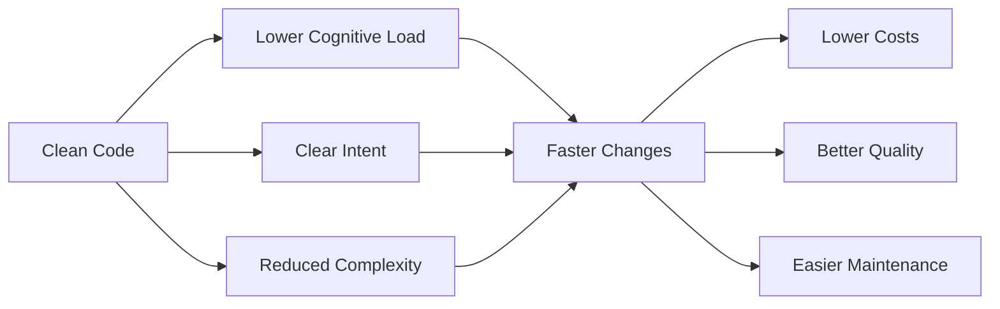
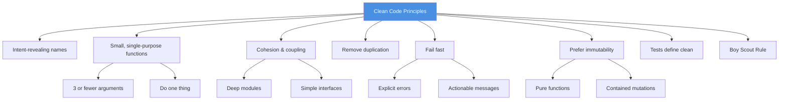
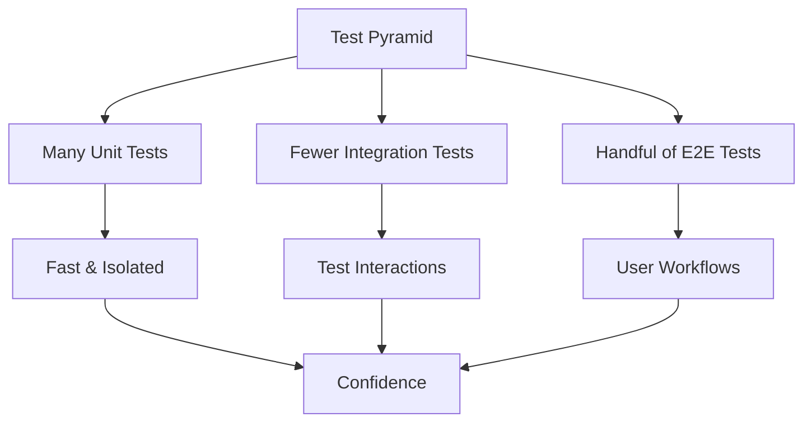
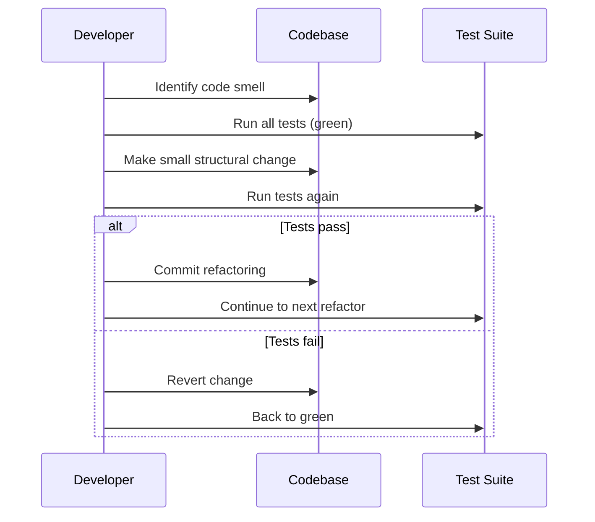
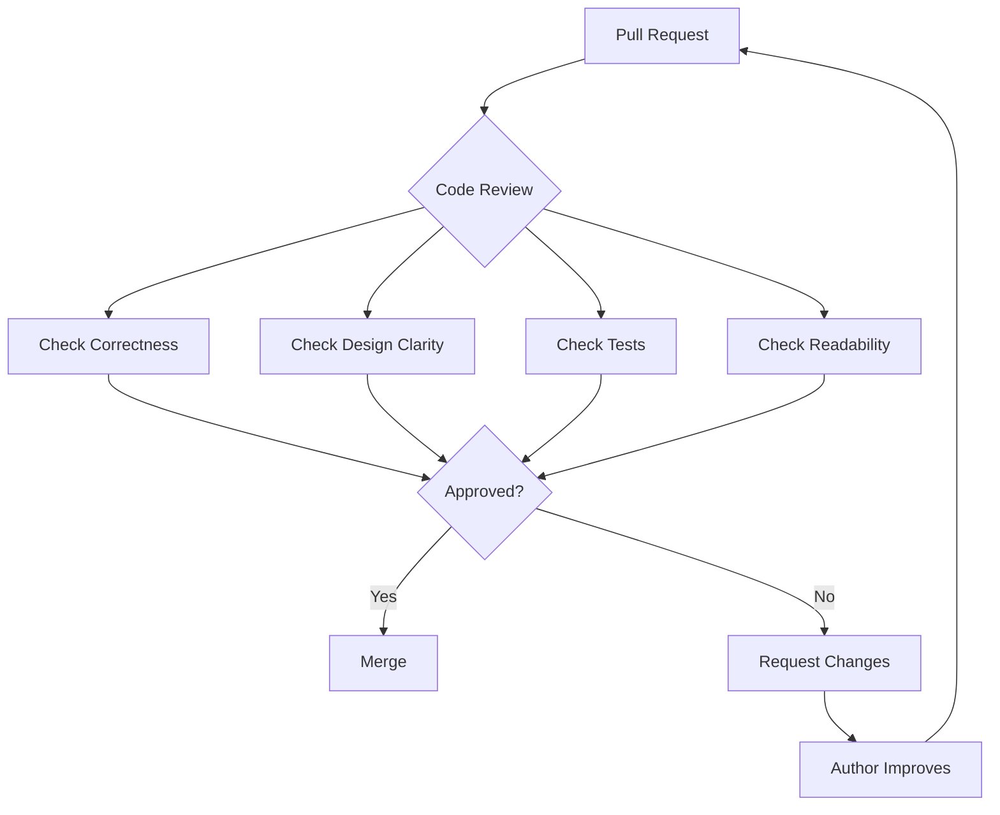
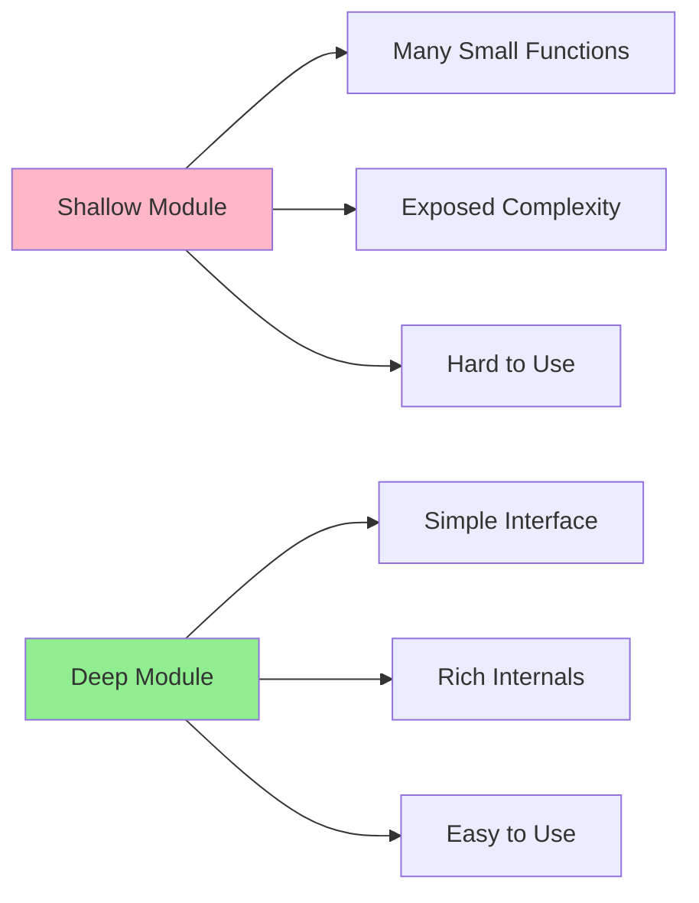
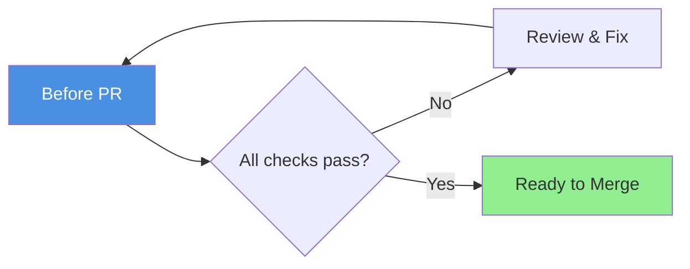
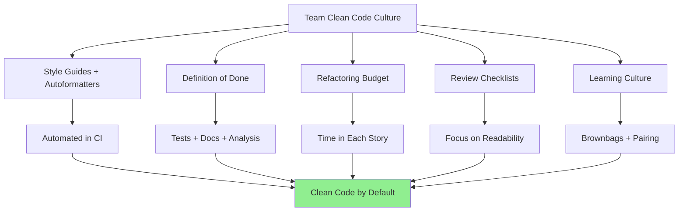

import CleanCodeImage from '/img/undraw_code_thinking.svg';

<div className="text--center margin-bottom--lg">
  <CleanCodeImage width="80%" height="300px" />
</div>

> "Clean code is simple and direct. Clean code reads like well-written prose." — _paraphrasing common themes across the
> literature_

Clean code is the craft of shaping programs so they are easy for **humans** to read, reason about, and change—without
sacrificing correctness or performance. It's less about following a single style guide and more about a set of enduring
principles and habits that make software **safer to modify** and **cheaper to evolve**.

---

## Why clean code still matters



- **Change is the constant.** Most of the cost of software arrives **after** version 1. Clean code reduces the time and
  risk of changes by lowering cognitive load and clarifying intent.
- **Readability predicts quality.** Multiple studies show that code readability correlates with defect density and
  churn; making code easier to read is not cosmetics—it's a reliability strategy.
- **Design is about managing complexity.** "Complexity is the enemy" is a unifying thread in modern design literature;
  clean code is how you chip away at it at the function/module level.

---

## Core principles



1. **Intent-revealing names** Names should answer "what is this" and "why does it exist." Prefer
   `invoice.total_after_tax()` over `calc()`.

2. **Small, single-purpose functions** Each function does one thing, has a clear name, and has minimal arguments (≤ 3 is
   a good rule of thumb). Push branching detail down; keep top-level flows linear.

3. **Cohesion inside; coupling outside** Keep related behavior together; make modules **deep** (rich functionality
   behind simple interfaces) rather than shallow (many tiny functions leaking details).

4. **Remove duplication** Repetition multiplies future change cost. Abstract, parameterize, or refactor common code.

5. **Fail fast; handle errors explicitly** Prefer exceptions over special return codes; don't silently swallow errors.
   Include context in error messages.

6. **Prefer immutability and pure functions** Side-effect-free code is easier to test and parallelize. Where mutation is
   required, contain and document it.

7. **Tests define clean** Code isn't "clean" if it's hard to test. Tests are executable specs; they guide design (and
   protect it during refactors).

8. **Leave the campsite better (Boy Scout Rule)** Each edit is a chance to tidy names, extract a function, or clarify a
   test.

---

## Practices that scale

### Naming

- Use domain terms; avoid internal slang.
- Encode **intent**, not type (`customers` not `customerList` if the type is obvious).
- Booleans read as predicates: `is_enabled`, `has_credit`.
- Avoid negative booleans (`not_disabled`), double-negatives, and temporary names (`tmp`, `foo`).

### Functions & APIs

- Strive for **command–query separation** (CQS): functions either do something or answer something—not both.
- Pass objects that represent concepts (e.g., `Money`, `DateRange`) instead of parallel primitive parameters.
- Make invalid states unrepresentable via types and constructors.

### Comments

- Comment **why**, not **what** the code already shows.
- Prefer self-explanatory code to explanatory comments.
- Keep TODOs actionable (`// TODO(you): remove legacy path after Q4 migration`).

### Formatting

- Choose one style (per language) and automate it (formatters/linters). Consistency beats personal taste.
- Optimize vertical formatting for storytelling: high-level ideas first, details below; group related lines; keep line
  length reasonable.

### Errors

- Throw exceptions with **actionable** messages (`"Payment declined: card expired"` not `"Error 12"`).
- Don't return `null` where a type (e.g., `Optional`) communicates absence.
- Normalize error boundaries at module edges; convert 3rd-party failure modes into your domain's language.

### Tests



- **Fast, deterministic, isolated.** A slow or flaky suite will be skipped and then it's no longer your design safety
  net.
- Follow the testing pyramid: many unit tests, fewer integration tests, a handful of end-to-end tests.
- Treat tests as first-class citizens: refactor them, name them well, remove duplication.
- Aim for meaningful coverage; 100% coverage isn't the point—**confidence** is.

:::tip Learn more about testing

For a comprehensive guide to testing strategies, see our [Software Testing](/testing) chapter.

:::

---

## Refactoring: keeping code clean over time



Refactoring is the disciplined technique of changing code structure without changing behavior. Do it in **small,
reversible steps** with tests running at each step.

### Before and after example

Typical moves (shown in Python-like pseudocode):

```python
# ❌ BEFORE: mixed responsibilities, duplication, weak names
def process(a, b, t):
    if t == "pdf":
        r = render_pdf(a, b)
        log("done")
        return r
    elif t == "html":
        r = render_html(a, b)
        log("done")
        return r
    else:
        raise ValueError("bad type")
```

```python
# ✅ AFTER: intention-revealing names, eliminated duplication, fail fast at boundary
def render_document(order, template, format):
    renderer = _renderer_for(format)  # raises on unsupported format
    result = renderer(order, template)
    _log_render_success(format, order.id)
    return result

def _renderer_for(format):
    renderers = {"pdf": render_pdf, "html": render_html}
    try:
        return renderers[format]
    except KeyError:
        raise UnsupportedFormat(format)
```

### High-leverage refactorings

A few high-leverage refactorings you'll use daily:

- **Extract Function / Extract Class** – isolate responsibilities.
- **Rename** – clarify intent as understanding improves.
- **Inline / Introduce Parameter Object** – simplify or clarify call sites.
- **Replace Conditional with Polymorphism / Strategy** – decouple branching on type.

Keep refactors **behavior-preserving**; batch behavior changes behind a feature flag, not inside a refactor.

:::tip Related content

Learn more systematic refactoring approaches in our [Refactoring Techniques](/refactoring-techniques) chapter.

:::

---

## Code review as a cleanliness multiplier



Clean code is a **team sport**. Reviews are where shared standards solidify:

- Review for **correctness, design clarity, tests, and readability**—not author identity.
- Authors keep changes small, focused, and well-explained; reviewers respond promptly and respectfully.
- Prefer **nits-as-tools**: rely on autoformatters/linters for stylistic nits; spend human time on design and intent.

:::tip Learn more about code reviews

For detailed guidance on giving and receiving code reviews effectively, see our [Code Reviews](/code-reviews) chapter.

:::

---

## When "clean" conflicts with reality

### Performance hot spots

In a 0.1% inner loop, clarity may yield to locality and allocation control. Isolate such code and **document** why it
bends the rules; keep the rest of the codebase idiomatic.

### APIs with legacy or external constraints

Wrap awkward interfaces with a clean façade at your boundary.

### Over-factoring

Many micro-functions or classes can make a module **shallow**—lots of surface, little substance. Prefer **deep modules**
with simple public APIs and rich internals.



---

## A practical checklist

Run this list before you open a PR:



### Readability & Intent

1. ✅ Would a new teammate understand the intent quickly from names and structure?
2. ✅ Does each function/class follow single responsibility?
3. ✅ Are boundaries clear (what's public vs. private)?

### Code Quality

4. ✅ Are there hidden side effects? If yes, can they be isolated or eliminated?
5. ✅ Is error handling explicit and actionable?
6. ✅ Is duplication removed (without over-abstracting)?
7. ✅ Could this be simpler (fewer concepts/branches/parameters)?

### Testing & Standards

8. ✅ Are tests fast, focused, and expressive of behavior?
9. ✅ Is formatting consistent and automated?
10. ✅ Did I leave the campsite cleaner?

---

## Team policies that make clean code the default



- **Style guides + autoformatters** per language. Check them in; fail CI on drift.
- **Definition of Done** includes tests, docs (if needed), and passing static analysis.
- **Refactoring budget** in each story—don't defer all cleanup to "later."
- **Review checklists** focused on readability, correctness, and risk.
- **Learning culture:** share before/after refactors in brownbags; pair on tricky areas.

:::tip Related practices

Learn about technical debt management strategies in our [Technical Debt](/technical-debt) chapter.

:::

---

## Further reading

### Books

- **Clean Code** (2nd ed.) by Robert C. Martin — Language-agnostic principles and code smells
- **Refactoring** (2nd ed.) by Martin Fowler — Step-by-step change techniques and a catalog of safe moves
- **A Philosophy of Software Design** (2nd ed.) by John Ousterhout — The "deep module" lens on complexity
- **The Clean Coder** by Robert C. Martin — Professionalism and software craftsmanship

### Online Resources

- [Google Engineering Practices: Code Review](https://google.github.io/eng-practices/review/) — Pragmatic code-review
  norms and readability guidance
- Language-specific style guides (e.g., [PEP 8 for Python](https://www.python.org/dev/peps/pep-0008/)) — Settle syntax
  debates automatically

### Research

- Buse & Weimer, "A Metric for Software Readability" — Evidence that readability metrics correlate with defects and
  changes, reminding us this isn't just aesthetics

---

## Key takeaways

1. **Clean code is about humans first** — It reduces cognitive load, clarifies intent, and makes change safer and
   cheaper.

2. **Small, focused units** — Functions and classes should do one thing well, with intent-revealing names and minimal
   dependencies.

3. **Refactor relentlessly** — Make small, behavior-preserving changes with tests running at each step. Leave the code
   better than you found it.

4. **Tests are non-negotiable** — They define what "clean" means and protect your design during evolution.

5. **Code review is a team sport** — Reviews solidify shared standards and multiply the impact of clean code practices.

6. **Automate style, debate substance** — Use formatters and linters to enforce consistency; save human review time for
   design and correctness.

7. **Balance pragmatism with ideals** — Performance hot spots and legacy constraints are real; isolate exceptions and
   document them.

Remember: Clean code is not a destination but a continuous practice. Every commit is an opportunity to improve.
