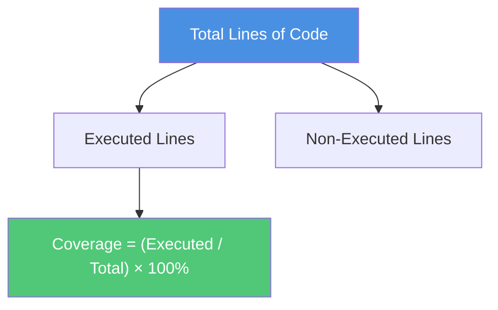
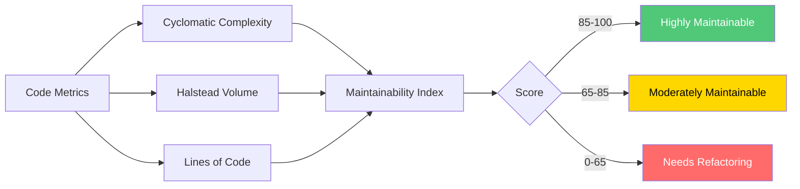
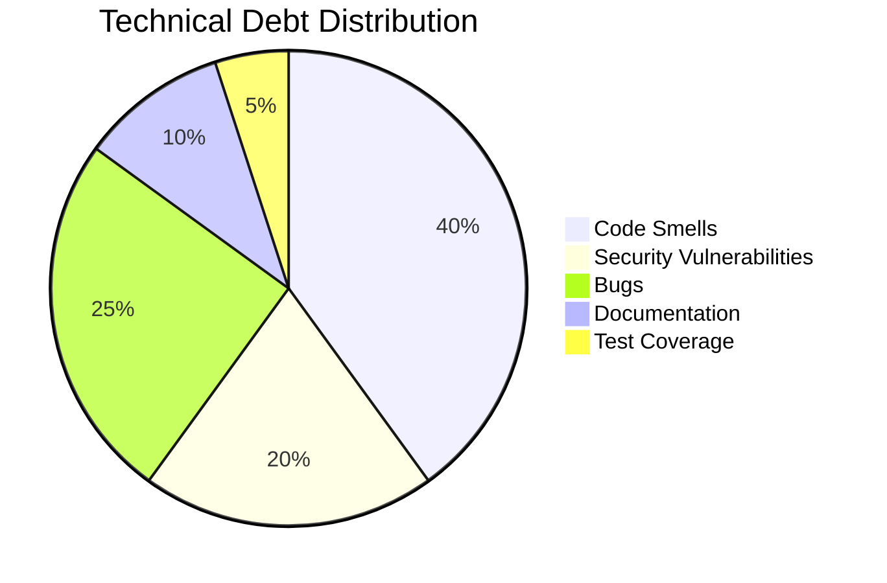
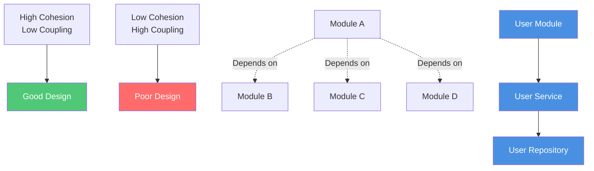
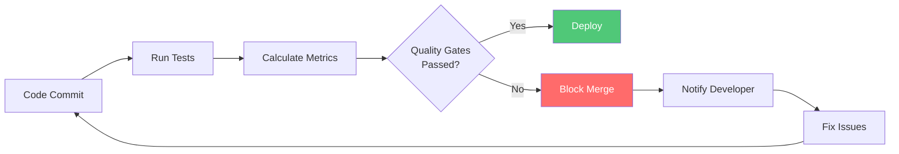
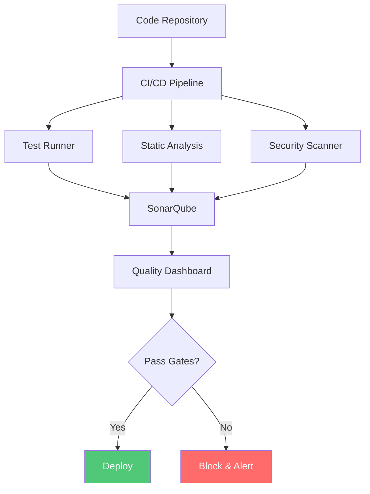
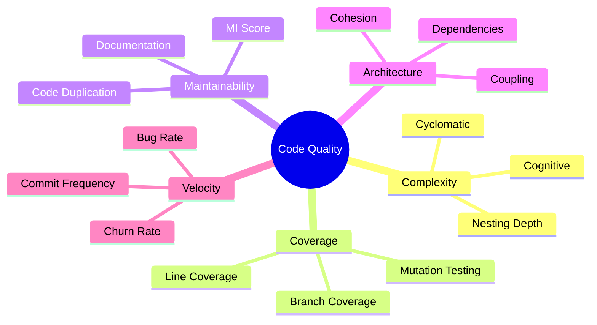
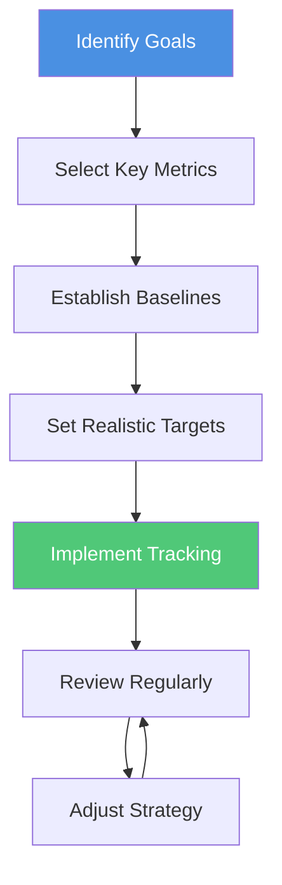
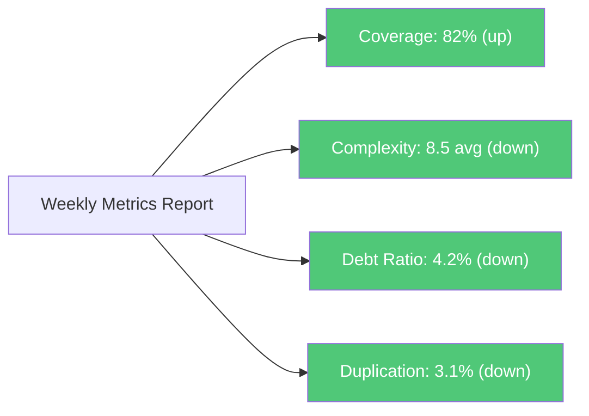

Code quality metrics are quantifiable measures used to assess the health, maintainability, and reliability of software
codebases. While metrics alone don't guarantee quality, they provide valuable insights into potential issues and guide
improvement efforts. This chapter explores essential metrics, when to use them, and how to interpret them effectively.

## Why Code Quality Metrics Matter

Code quality metrics serve several critical purposes in software development:

- **Early Problem Detection**: Identify potential issues before they become costly problems
- **Objective Assessment**: Provide data-driven insights beyond subjective code reviews
- **Trend Analysis**: Track quality improvements or degradation over time
- **Team Communication**: Create a shared vocabulary for discussing code quality
- **Refactoring Prioritization**: Help identify which areas need attention first
- **Quality Gates**: Establish thresholds for continuous integration pipelines

However, metrics should complement, not replace, human judgment and code reviews.

## Core Code Quality Metrics

### Cyclomatic Complexity

Cyclomatic complexity measures the number of independent paths through a program's source code. Higher complexity
indicates more difficult-to-test and maintain code.

**How it works**: Count the number of decision points (if, while, for, case, etc.) and add 1.

```javascript
// Low complexity (CC = 1)
function greet(name) {
  return `Hello, ${name}!`;
}

// Higher complexity (CC = 4)
function processUserAccess(user, resource) {
  if (!user.isAuthenticated) {
    return 'Unauthorized';
  }

  if (user.role === 'admin') {
    return 'Full access granted';
  } else if (user.role === 'editor' && resource.type === 'document') {
    return 'Edit access granted';
  } else if (user.role === 'viewer') {
    return 'Read-only access granted';
  }

  return 'Access denied';
}
```

**Recommended thresholds**:

- 1-10: Simple, low risk
- 11-20: Moderate complexity, consider refactoring
- 21-50: High complexity, should refactor
- 50+: Critical, must refactor

**Refactored example with lower complexity**:

```javascript
// Refactored to CC = 2 per function
function processUserAccess(user, resource) {
  if (!user.isAuthenticated) {
    return 'Unauthorized';
  }

  return determineAccessLevel(user, resource);
}

function determineAccessLevel(user, resource) {
  const accessRules = {
    admin: () => 'Full access granted',
    editor: () => (resource.type === 'document' ? 'Edit access granted' : 'Access denied'),
    viewer: () => 'Read-only access granted',
  };

  const rule = accessRules[user.role];
  return rule ? rule() : 'Access denied';
}
```

### Code Coverage

Code coverage measures the percentage of code executed during automated testing. While high coverage doesn't guarantee
quality tests, low coverage indicates untested code.



**Types of coverage**:

1. **Line Coverage**: Percentage of code lines executed
2. **Branch Coverage**: Percentage of decision branches taken
3. **Function Coverage**: Percentage of functions called
4. **Statement Coverage**: Percentage of statements executed

**Example with coverage analysis**:

```javascript
// Function with conditional branches
function calculateDiscount(price, customerType, isPremium) {
  let discount = 0;

  if (customerType === 'member') {
    discount = 0.1; // Branch 1
  }

  if (isPremium) {
    discount += 0.05; // Branch 2
  }

  return price * (1 - discount);
}

// Test with 50% branch coverage (only tests one path)
test('calculates member discount', () => {
  expect(calculateDiscount(100, 'member', false)).toBe(90);
});

// Full test suite with 100% branch coverage
describe('calculateDiscount', () => {
  test('no discount for regular customers', () => {
    expect(calculateDiscount(100, 'regular', false)).toBe(100);
  });

  test('member discount', () => {
    expect(calculateDiscount(100, 'member', false)).toBe(90);
  });

  test('premium discount', () => {
    expect(calculateDiscount(100, 'regular', true)).toBe(95);
  });

  test('combined member and premium discount', () => {
    expect(calculateDiscount(100, 'member', true)).toBe(85);
  });
});
```

**Recommended thresholds**:

- Critical paths: 80-100%
- Business logic: 70-80%
- Overall codebase: 60-80%
- UI/integration layers: 40-60%

:::warning

Don't chase 100% coverage blindly. Focus on testing critical paths and business logic. Some code (like simple
getters/setters) may not need explicit tests.

:::

### Maintainability Index

The Maintainability Index (MI) is a composite metric that combines cyclomatic complexity, lines of code, and Halstead
volume to produce a single score indicating how maintainable code is.

**Formula**: MI = MAX(0, (171 - 5.2 × ln(HV) - 0.23 × CC - 16.2 × ln(LOC)) × 100 / 171)

Where:

- HV = Halstead Volume
- CC = Cyclomatic Complexity
- LOC = Lines of Code

**Interpretation**:

- 85-100: Highly maintainable (green)
- 65-85: Moderately maintainable (yellow)
- 0-65: Difficult to maintain (red)



### Code Duplication

Code duplication (or code clones) refers to similar or identical code blocks appearing in multiple locations. Duplicated
code increases maintenance burden and bug risk.

**Types of duplication**:

1. **Type 1**: Exact duplicates (except whitespace/comments)
2. **Type 2**: Syntactically identical (different variables/literals)
3. **Type 3**: Copied with modifications
4. **Type 4**: Functionally similar but different syntax

```javascript
// Bad: Duplicated validation logic
function validateEmail(email) {
  const emailRegex = /^[^\s@]+@[^\s@]+\.[^\s@]+$/;
  if (!email || !emailRegex.test(email)) {
    throw new Error('Invalid email');
  }
  return email.toLowerCase();
}

function validateUserEmail(user) {
  const emailRegex = /^[^\s@]+@[^\s@]+\.[^\s@]+$/;
  if (!user.email || !emailRegex.test(user.email)) {
    throw new Error('Invalid email');
  }
  return user.email.toLowerCase();
}

// Good: Extracted and reusable
class EmailValidator {
  static EMAIL_REGEX = /^[^\s@]+@[^\s@]+\.[^\s@]+$/;

  static validate(email) {
    if (!email || !this.EMAIL_REGEX.test(email)) {
      throw new Error('Invalid email');
    }
    return email.toLowerCase();
  }
}

function validateEmail(email) {
  return EmailValidator.validate(email);
}

function validateUserEmail(user) {
  return EmailValidator.validate(user.email);
}
```

**Recommended threshold**: Keep duplication below 5% of total codebase.

### Technical Debt Ratio

Technical debt represents the implied cost of additional rework caused by choosing quick solutions over better
approaches. The Technical Debt Ratio quantifies this as a percentage of development time.

**Formula**:

```
Debt Ratio = (Remediation Cost / Development Cost) × 100%
```

Where:

- Remediation Cost = Estimated time to fix all issues
- Development Cost = Total time spent developing the code



**Interpreting the ratio**:

- ≤ 5%: Excellent
- 6-10%: Good
- 11-20%: Needs attention
- > 20%: Critical

**Common contributors to technical debt**:

- Outdated dependencies
- Missing or inadequate tests
- Complex or duplicated code
- Security vulnerabilities
- Incomplete documentation
- Code smells and anti-patterns

## Advanced Metrics

### Churn Rate

Churn rate measures how frequently files change. High churn combined with high complexity indicates hotspots that need
attention.

```javascript
// Analyzing churn with git
// git log --format=format: --name-only | grep -v '^$' | sort | uniq -c | sort -rn | head -20
```

**High churn indicators**:

- Files changed frequently are more likely to contain bugs
- Combined with complexity, indicates refactoring targets
- Team may lack understanding of the code
- Possible architectural issues

### Coupling and Cohesion

**Coupling** measures dependencies between modules. Lower coupling is better.

**Cohesion** measures how related the responsibilities of a module are. Higher cohesion is better.



**Example of loose coupling**:

```javascript
// Bad: Tight coupling
class OrderProcessor {
  processOrder(order) {
    // Directly coupled to concrete implementations
    const payment = new StripePaymentGateway();
    const email = new SendGridEmailService();
    const inventory = new MySQLInventoryDatabase();

    payment.charge(order.total);
    email.send(order.customer.email, 'Order confirmed');
    inventory.decrementStock(order.items);
  }
}

// Good: Loose coupling via dependency injection
class OrderProcessor {
  constructor(paymentGateway, emailService, inventoryService) {
    this.paymentGateway = paymentGateway;
    this.emailService = emailService;
    this.inventoryService = inventoryService;
  }

  processOrder(order) {
    this.paymentGateway.charge(order.total);
    this.emailService.send(order.customer.email, 'Order confirmed');
    this.inventoryService.decrementStock(order.items);
  }
}
```

### Cognitive Complexity

Cognitive complexity measures how difficult code is for humans to understand. Unlike cyclomatic complexity, it accounts
for nesting and modern programming constructs.

```javascript
// Cyclomatic Complexity = 4, Cognitive Complexity = 7
function processItems(items) {
  for (const item of items) {
    // +1 (loop)
    if (item.isActive) {
      // +2 (nested condition)
      if (item.hasDiscount) {
        // +3 (doubly nested)
        item.price = item.price * 0.9;
      }

      if (item.needsShipping) {
        // +3 (doubly nested)
        item.shippingCost = calculateShipping(item);
      }
    }
  }
}

// Refactored: Cognitive Complexity = 2
function processItems(items) {
  const activeItems = items.filter((item) => item.isActive); // +1

  activeItems.forEach((item) => {
    // +1
    applyDiscount(item);
    calculateShippingIfNeeded(item);
  });
}

function applyDiscount(item) {
  if (item.hasDiscount) {
    item.price = item.price * 0.9;
  }
}

function calculateShippingIfNeeded(item) {
  if (item.needsShipping) {
    item.shippingCost = calculateShipping(item);
  }
}
```

## Implementing Quality Metrics in Your Workflow

### Continuous Monitoring

Integrate metrics into your CI/CD pipeline to catch regressions early.



**Example CI configuration** (GitHub Actions):

```yaml
name: Code Quality Check

on: [pull_request]

jobs:
  quality:
    runs-on: ubuntu-latest
    steps:
      - uses: actions/checkout@v3

      - name: Run Tests with Coverage
        run: npm test -- --coverage

      - name: Check Coverage Threshold
        run: |
          coverage=$(cat coverage/coverage-summary.json | jq '.total.lines.pct')
          if (( $(echo "$coverage < 80" | bc -l) )); then
            echo "Coverage is below 80%"
            exit 1
          fi

      - name: Run Complexity Analysis
        run: npx complexity-report --threshold 10 src/

      - name: Check for Code Duplication
        run: npx jscpd src/ --threshold 5

      - name: Run Static Analysis
        run: npx eslint src/ --max-warnings 0
```

### Quality Gates

Establish thresholds that code must meet before merging:

| Metric                   | Threshold         | Action if Failed         |
| ------------------------ | ----------------- | ------------------------ |
| Code Coverage            | ≥ 80%             | Block merge              |
| Cyclomatic Complexity    | ≤ 10 per function | Warning, review required |
| Duplication              | ≤ 5%              | Block merge              |
| Technical Debt Ratio     | ≤ 5%              | Warning                  |
| Critical Security Issues | 0                 | Block merge              |
| Maintainability Index    | ≥ 65              | Warning, review required |

### Tools and Platforms

**Language-Specific Tools**:

- **JavaScript/TypeScript**: ESLint, JSHint, Plato, Complexity Report
- **Python**: Radon, Pylint, Bandit, Coverage.py
- **Java**: SonarQube, PMD, Checkstyle, JaCoCo
- **C#**: NDepend, StyleCop, dotCover
- **Go**: golangci-lint, gocyclo, gocover
- **Ruby**: RuboCop, SimpleCov, Reek

**Platform Solutions**:

- **SonarQube/SonarCloud**: Comprehensive code quality platform
- **CodeClimate**: Automated code review
- **Codacy**: Automated code analysis
- **DeepSource**: Static analysis platform
- **Coveralls**: Code coverage tracking



## Interpreting Metrics Effectively

### The Balanced Scorecard Approach

Don't rely on a single metric. Use a balanced set to get a complete picture:



### Common Pitfalls

**1. Gaming the Metrics**

```javascript
// Bad: Writing tests just for coverage, not value
test('getter returns value', () => {
  const obj = { getValue: () => 42 };
  expect(obj.getValue()).toBe(42); // Meaningless test
});

// Good: Testing actual behavior
test('calculates total price with tax and discount', () => {
  const cart = new ShoppingCart();
  cart.addItem({ price: 100, taxRate: 0.1 });
  cart.applyDiscount(0.2);
  expect(cart.getTotalPrice()).toBe(88); // 100 * 1.1 * 0.8
});
```

**2. Ignoring Context**

- Prototype code may have higher technical debt
- Legacy code requires different thresholds
- Critical systems need stricter standards

**3. Metric Obsession Over Value**

Remember: metrics are means to an end, not the end itself. The goal is maintainable, reliable software, not perfect
metric scores.

## Metrics for Different Code Types

### API Code

Focus on:

- Contract testing coverage
- API response time metrics
- Error rate and status code distribution
- Backward compatibility checks

### Database Code

Focus on:

- Query performance metrics
- Index usage statistics
- Connection pool efficiency
- Migration safety checks

### Frontend Code

Focus on:

- Bundle size metrics
- Rendering performance
- Accessibility scores
- Cross-browser compatibility

### Infrastructure Code

Focus on:

- Configuration coverage
- Idempotency verification
- Security compliance checks
- Resource utilization metrics

## Establishing a Metrics Culture

### Getting Started



1. **Start Small**: Begin with 2-3 key metrics
2. **Measure Baseline**: Understand current state before setting targets
3. **Set Achievable Goals**: Incremental improvement over time
4. **Educate Team**: Ensure everyone understands what metrics mean
5. **Review and Adapt**: Regularly assess if metrics serve their purpose

### Team Communication

**Dashboard Example**:

Create visual dashboards that show:

- Current metric values vs. targets
- Trends over time (weekly/monthly)
- Hotspots requiring attention
- Improvements achieved



### Continuous Improvement

- **Sprint Retrospectives**: Discuss metric trends
- **Refactoring Sprints**: Dedicate time to improve metrics
- **Knowledge Sharing**: Share learnings from metric-driven improvements
- **Celebrate Wins**: Recognize improvements in code quality

## Best Practices

### Do's

✅ **Use metrics as guides, not absolutes**: Context matters more than hitting arbitrary numbers

✅ **Combine quantitative and qualitative assessment**: Metrics + code reviews provide complete picture

✅ **Track trends over time**: Direction of change is often more important than absolute values

✅ **Make metrics visible**: Transparency drives improvement

✅ **Align metrics with business goals**: Measure what matters to your product and users

✅ **Automate metric collection**: Manual tracking is error-prone and unsustainable

✅ **Review and adjust thresholds**: What works for one codebase may not work for another

### Don'ts

❌ **Don't use metrics to judge individuals**: Focus on code and processes, not people

❌ **Don't optimize for metrics alone**: Maintain focus on delivering value

❌ **Don't ignore low-metric code that works**: Sometimes "good enough" is appropriate

❌ **Don't implement too many metrics**: Information overload leads to analysis paralysis

❌ **Don't set unrealistic thresholds**: Causing constant failures demotivates teams

❌ **Don't measure without acting**: Metrics without improvement initiatives waste time

## Conclusion

Code quality metrics are powerful tools for understanding and improving software health. When used thoughtfully, they
provide early warning signals, guide refactoring efforts, and help teams maintain high standards over time.

Remember these key principles:

1. **Metrics inform decisions, they don't make them**: Use human judgment alongside data
2. **Focus on trends**: Direction matters more than absolute values
3. **Balance multiple metrics**: No single metric tells the complete story
4. **Align with goals**: Measure what actually matters to your project
5. **Iterate and improve**: Regularly assess if your metrics serve their purpose

Start with a few key metrics, establish baselines, set realistic targets, and continuously improve. Over time, a
metrics-driven culture will lead to more maintainable, reliable, and high-quality software.

## Related Chapters

- [Clean Code](/clean-code) - Principles for writing maintainable code
- [Refactoring Techniques](/refactoring-techniques) - How to improve code metrics through refactoring
- [Technical Debt](/technical-debt) - Understanding and managing technical debt
- [Testing](/testing) - Strategies for improving code coverage
- [CI/CD](/ci-cd) - Integrating quality gates into deployment pipelines
- [Code Reviews](/code-reviews) - Combining metrics with peer review

## References

- **Cyclomatic Complexity**: McCabe, T.J. (1976). "A Complexity Measure"
- **SonarQube Documentation**: [https://docs.sonarqube.org/](https://docs.sonarqube.org/)
- **Martin Fowler on Metrics**:
  [https://martinfowler.com/articles/useOfMetrics.html](https://martinfowler.com/articles/useOfMetrics.html)
- **Google Testing Blog**: [https://testing.googleblog.com/](https://testing.googleblog.com/)
- **"Software Metrics: A Rigorous and Practical Approach"** by Norman Fenton and James Bieman
