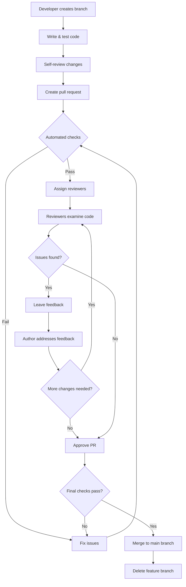
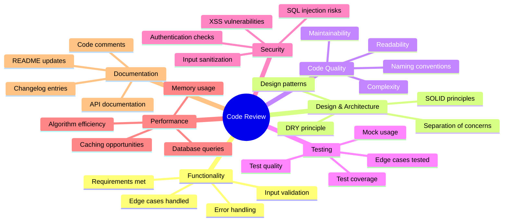
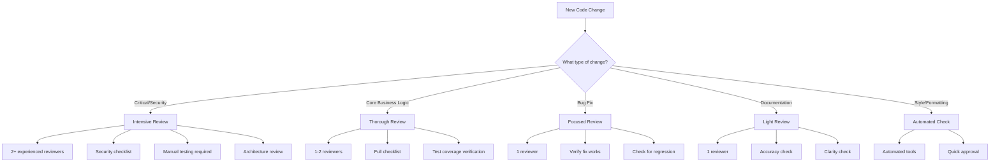

import CodeReviewsImage from '/img/undraw_code_reviews.svg';

<div className="text--center margin-bottom--lg">
  <CodeReviewsImage width="80%" height="300px" />
</div>

> **Code reviews not only need to be given effectively, it is also important to know how to receive them well.**

## What Are Code Reviews?

Code review is a systematic examination of source code by one or more developers to identify bugs, improve code quality,
ensure consistency with coding standards, and share knowledge across the team. It's one of the most effective quality
assurance practices in software development, catching defects early when they're cheapest to fix.

Modern code reviews typically happen asynchronously through pull requests (PRs) or merge requests (MRs), where
developers submit their changes for review before merging them into the main codebase. This collaborative approach not
only improves code quality but also facilitates knowledge transfer and team learning.

## Benefits of Code Reviews

### Quality Improvements

- **Early bug detection**: Catch defects before they reach production, reducing debugging costs by up to 85%
- **Code consistency**: Ensure adherence to team coding standards and architectural patterns
- **Better design**: Identify design flaws and suggest improvements before implementation is complete
- **Reduced technical debt**: Prevent accumulation of problematic code that becomes harder to maintain

### Team Benefits

- **Knowledge sharing**: Spread understanding of different parts of the codebase across the team
- **Skill development**: Junior developers learn from experienced reviewers, and seniors stay sharp
- **Collective code ownership**: Build shared responsibility for code quality across the team
- **Better collaboration**: Foster open communication and constructive feedback culture

### Security and Compliance

- **Security vulnerability detection**: Identify potential security issues like SQL injection, XSS, or authentication
  flaws
- **Compliance verification**: Ensure code meets regulatory requirements and industry standards
- **Data protection**: Verify proper handling of sensitive information

## Code Review Workflow

Here's a typical code review process from start to finish:



## Preparing for Effective Code Reviews

### For the Team

#### 1. Establish Clear Coding Standards

Define and document your team's coding standards covering:

```javascript
// Example: Coding standard for error handling
// ✅ Good: Specific error messages with context
function getUserById(id) {
  if (!id) {
    throw new Error(`getUserById: Invalid user ID provided: ${id}`);
  }

  try {
    const user = database.findUser(id);
    if (!user) {
      throw new Error(`User not found with ID: ${id}`);
    }
    return user;
  } catch (error) {
    logger.error(`Failed to fetch user ${id}:`, error);
    throw new Error(`Database error while fetching user ${id}`);
  }
}

// ❌ Bad: Generic error messages without context
function getUserById(id) {
  const user = database.findUser(id);
  if (!user) {
    throw new Error('User not found');
  }
  return user;
}
```

#### 2. Define the Review Process

Document key aspects of your review process:

- **PR size guidelines**: Aim for 200-400 lines of code per review (sweet spot for catching defects)
- **Response time expectations**: First response within 24 hours, complete review within 48 hours
- **Approval requirements**: Number of approvers needed (e.g., 1 for minor changes, 2 for critical code)
- **Review scope**: What to focus on (functionality, design, tests, documentation, security)

#### 3. Choose the Right Tools

Select tools that fit your workflow:

- **GitHub/GitLab/Bitbucket**: Built-in code review features with inline comments
- **Gerrit**: Powerful for complex workflows and larger teams
- **Crucible**: Comprehensive review management with reporting
- **Review Board**: Open-source option with good integration capabilities

#### 4. Set Up Automated Checks

Automate what can be automated to let reviewers focus on logic and design:

```yaml
# Example: GitHub Actions workflow for automated checks
name: Code Review Checks

on: [pull_request]

jobs:
  automated-checks:
    runs-on: ubuntu-latest
    steps:
      - uses: actions/checkout@v3

      - name: Run linter
        run: npm run lint

      - name: Check code formatting
        run: npm run format:check

      - name: Run unit tests
        run: npm test

      - name: Check test coverage
        run: npm run test:coverage

      - name: Security scan
        run: npm audit

      - name: Check for secrets
        uses: trufflesecurity/trufflehog@main
```

### For the Author (Submitting Code for Review)

#### 1. Self-Review First

Before requesting a review, be your own first reviewer:

- **Review your own diff**: Read through all changes as if you were reviewing someone else's code
- **Test thoroughly**: Run all tests, try edge cases, verify the fix/feature works
- **Clean up**: Remove debug code, commented-out code, and console.logs
- **Check formatting**: Ensure consistent formatting and style

#### 2. Write a Clear PR Description

A good PR description saves reviewers time and provides context:

```markdown
## Description

Implements user authentication using JWT tokens to replace the legacy session-based auth.

## Changes

- Added JWT token generation and validation middleware
- Updated login endpoint to return JWT tokens
- Migrated existing session logic to token-based approach
- Added token refresh mechanism

## Testing

- Added unit tests for JWT middleware (auth.test.js)
- Integration tests for login flow
- Manual testing with Postman collection (see /docs/api-testing.postman.json)

## Security Considerations

- Tokens expire after 1 hour
- Refresh tokens stored in httpOnly cookies
- Secret keys loaded from environment variables

## Related Issues

Closes #234 Related to #189

## Screenshots (if UI changes)

[Include relevant screenshots]
```

#### 3. Keep PRs Small and Focused

Break large changes into smaller, reviewable chunks:

```bash
# ✅ Good: Separate PRs for logical chunks
PR #1: Add JWT library and basic token generation
PR #2: Implement token validation middleware
PR #3: Update authentication endpoints
PR #4: Add token refresh mechanism
PR #5: Update documentation

# ❌ Bad: One massive PR with everything
PR #1: Complete authentication system rewrite (2,000+ lines changed)
```

## Performing Effective Code Reviews

### The Review Mindset

Approach reviews with the right attitude:

- **Be thorough but pragmatic**: Don't nitpick, focus on issues that matter
- **Assume good intent**: The author wrote the best code they could with their current knowledge
- **Educate, don't criticize**: Frame feedback as learning opportunities
- **Praise good work**: Acknowledge clever solutions and improvements

### What to Review

Use this systematic approach to cover all important aspects:



### Providing Effective Feedback

#### Use Constructive Language

```javascript
// ❌ Ineffective feedback:
// "This code is terrible and won't scale."

// ✅ Effective feedback:
// "This nested loop has O(n²) complexity. For large datasets, consider using
// a Map for O(n) lookup instead. Here's an example: [code suggestion]"

// Before (inefficient):
function findDuplicates(arr1, arr2) {
  const duplicates = [];
  for (let i = 0; i < arr1.length; i++) {
    for (let j = 0; j < arr2.length; j++) {
      if (arr1[i] === arr2[j]) {
        duplicates.push(arr1[i]);
      }
    }
  }
  return duplicates;
}

// Suggested improvement (efficient):
function findDuplicates(arr1, arr2) {
  const set2 = new Set(arr2);
  return arr1.filter((item) => set2.has(item));
}
```

#### Categorize Your Comments

Help authors prioritize by categorizing feedback:

- **🔴 Critical**: Must be fixed before merge (security issues, bugs, breaking changes)
- **🟡 Important**: Should be addressed (design issues, performance problems)
- **🔵 Suggestion**: Nice to have (code style, minor improvements)
- **💡 Thought**: Ideas for future consideration (architectural improvements)
- **❓ Question**: Seeking clarification (understanding intent)
- **✅ Praise**: Acknowledging good work (clever solutions, excellent tests)

```javascript
// 🔴 Critical: SQL injection vulnerability
// This query is vulnerable to SQL injection. Use parameterized queries instead.
const query = `SELECT * FROM users WHERE id = ${userId}`;
// Should be:
const query = 'SELECT * FROM users WHERE id = ?';
database.query(query, [userId]);

// 🟡 Important: Missing error handling
// What happens if the API call fails? Add try-catch and proper error handling.
const data = await fetch('/api/users');

// 🔵 Suggestion: Could be more concise
// This could use array destructuring for cleaner code:
const firstName = user.firstName;
const lastName = user.lastName;
// Suggestion: const { firstName, lastName } = user;

// 💡 Thought: Future optimization opportunity
// This works fine now, but if the user list grows significantly,
// consider implementing pagination or virtual scrolling.

// ❓ Question: Clarification needed
// Why are we using setTimeout here? Is there a specific timing requirement?

// ✅ Praise: Excellent test coverage
// Great job covering all edge cases including null values and empty arrays!
```

### Review Checklist

Use this checklist to ensure comprehensive reviews:

#### Functionality ✅

- [ ] Code does what it's supposed to do
- [ ] Requirements are fully met
- [ ] Edge cases are handled
- [ ] Error scenarios are managed
- [ ] Input validation is present

#### Code Quality ✅

- [ ] Code is readable and self-documenting
- [ ] Variables and functions have meaningful names
- [ ] Functions are small and focused (single responsibility)
- [ ] No code duplication (DRY principle)
- [ ] Appropriate use of comments (explain why, not what)
- [ ] No commented-out code left behind

#### Design & Architecture ✅

- [ ] Follows established patterns and conventions
- [ ] Appropriate abstraction level
- [ ] Good separation of concerns
- [ ] SOLID principles applied where relevant
- [ ] No circular dependencies

#### Testing ✅

- [ ] Adequate test coverage (aim for 80%+)
- [ ] Tests are clear and meaningful
- [ ] Edge cases are tested
- [ ] Mock/stub usage is appropriate
- [ ] Tests are fast and reliable

#### Security ✅

- [ ] Input is validated and sanitized
- [ ] No hardcoded secrets or credentials
- [ ] Proper authentication and authorization
- [ ] SQL injection prevention (parameterized queries)
- [ ] XSS prevention (output encoding)
- [ ] Sensitive data is encrypted

#### Performance ✅

- [ ] No obvious performance issues
- [ ] Efficient algorithms and data structures
- [ ] Database queries are optimized
- [ ] Appropriate use of caching
- [ ] No memory leaks

#### Documentation ✅

- [ ] Public APIs are documented
- [ ] Complex logic has explanatory comments
- [ ] README is updated if needed
- [ ] CHANGELOG is updated
- [ ] Breaking changes are documented

### Common Review Scenarios

#### Example 1: Security Vulnerability

```javascript
// Original code:
app.get('/user/:id', (req, res) => {
  const userId = req.params.id;
  const query = `SELECT * FROM users WHERE id = ${userId}`;
  db.query(query, (err, result) => {
    res.json(result);
  });
});

// 🔴 Critical: SQL Injection Vulnerability
// This code is vulnerable to SQL injection attacks. An attacker could pass
// "1 OR 1=1" as the ID to access all users. Use parameterized queries instead.

// Suggested fix:
app.get('/user/:id', async (req, res) => {
  const userId = req.params.id;

  // Validate input
  if (!Number.isInteger(Number(userId))) {
    return res.status(400).json({ error: 'Invalid user ID' });
  }

  try {
    // Use parameterized query
    const query = 'SELECT * FROM users WHERE id = ?';
    const [result] = await db.query(query, [userId]);

    if (!result) {
      return res.status(404).json({ error: 'User not found' });
    }

    res.json(result);
  } catch (error) {
    console.error('Database error:', error);
    res.status(500).json({ error: 'Internal server error' });
  }
});
```

#### Example 2: Design Improvement

```javascript
// Original code:
function processOrder(order) {
  // Validate order
  if (!order.items || order.items.length === 0) {
    throw new Error('Order must have items');
  }
  if (!order.customerId) {
    throw new Error('Order must have customer ID');
  }

  // Calculate total
  let total = 0;
  for (let item of order.items) {
    total += item.price * item.quantity;
  }

  // Apply discount
  if (order.discountCode === 'SAVE10') {
    total = total * 0.9;
  } else if (order.discountCode === 'SAVE20') {
    total = total * 0.8;
  }

  // Process payment
  const payment = processPayment(total, order.paymentMethod);

  // Send confirmation email
  sendEmail(order.customerEmail, 'Order confirmed', `Total: $${total}`);

  // Update inventory
  for (let item of order.items) {
    updateInventory(item.productId, -item.quantity);
  }

  return { orderId: generateId(), total, paymentStatus: payment.status };
}

// 🟡 Important: This function is doing too much (violates Single Responsibility Principle)
// Consider breaking this down into smaller, focused functions. This will make the code
// more testable, maintainable, and easier to understand.

// Suggested refactoring:
class OrderProcessor {
  constructor(paymentService, emailService, inventoryService) {
    this.paymentService = paymentService;
    this.emailService = emailService;
    this.inventoryService = inventoryService;
  }

  validateOrder(order) {
    if (!order.items?.length) {
      throw new Error('Order must have items');
    }
    if (!order.customerId) {
      throw new Error('Order must have customer ID');
    }
  }

  calculateTotal(items) {
    return items.reduce((sum, item) => sum + item.price * item.quantity, 0);
  }

  applyDiscount(total, discountCode) {
    const discounts = {
      SAVE10: 0.9,
      SAVE20: 0.8,
    };
    const multiplier = discounts[discountCode] || 1;
    return total * multiplier;
  }

  async processOrder(order) {
    // Each step is now clear and testable
    this.validateOrder(order);

    const subtotal = this.calculateTotal(order.items);
    const total = this.applyDiscount(subtotal, order.discountCode);

    const payment = await this.paymentService.process(total, order.paymentMethod);

    await this.emailService.sendConfirmation(order.customerEmail, total);

    await this.inventoryService.updateQuantities(order.items);

    return {
      orderId: generateId(),
      total,
      paymentStatus: payment.status,
    };
  }
}
```

## Receiving Code Reviews Gracefully

Receiving feedback well is just as important as giving it effectively. Here's how to make the most of code reviews:

### The Right Mindset

- **Separate yourself from your code**: Criticism of code is not criticism of you
- **View reviews as learning opportunities**: Each review teaches you something new
- **Assume positive intent**: Reviewers are trying to help, not attack
- **Be grateful**: Someone is taking time to improve your code and help you grow

### Responding to Feedback

#### 1. Acknowledge and Thank

```markdown
Thank you for the thorough review! You're right about the SQL injection risk. I'll implement parameterized queries.
```

#### 2. Ask for Clarification

```markdown
I'm not sure I understand the concern about the caching strategy. Could you elaborate on what specific issue you see? Or
could you provide an example of what you have in mind?
```

#### 3. Explain Your Reasoning (When Appropriate)

```markdown
I chose to use a Map here instead of an object because we need to support non-string keys. The input data includes
numeric IDs that need to be preserved as numbers. However, I'm open to alternative approaches if you see a better way.
```

#### 4. Agree and Commit to Changes

```markdown
Good catch! I'll refactor this to extract the validation logic into a separate function and add test coverage for the
edge cases you mentioned.
```

#### 5. Respectfully Disagree (With Evidence)

```markdown
I understand the concern about performance, but in this case, the array size is always < 10 items based on our API
contract (documented in api-spec.md line 45). The simpler O(n²) approach is more readable here. However, if we expect
this to change in the future, I'm happy to optimize it proactively.
```

### Common Pitfalls to Avoid

#### 1. Taking Feedback Personally

```markdown
// ❌ Defensive response: "Why are you always criticizing my code? This works fine!"

// ✅ Professional response: "Thanks for pointing this out. Could you help me understand what issues this approach might
cause? I'd like to learn the best practice here."
```

#### 2. Ignoring Feedback Without Discussion

```markdown
// ❌ Bad practice: [Marks conversation as resolved without addressing the issue]

// ✅ Good practice: "I've addressed this by implementing [specific change]. Please take another look and let me know if
this resolves your concern."
```

#### 3. Making Changes Without Understanding

```markdown
// ❌ Bad practice: "I changed it as you suggested." [But you don't understand why the change was needed]

// ✅ Good practice: "I've made the change. If I understand correctly, the previous approach was problematic because
[reason]. Is that accurate? I want to make sure I learn from this for future code."
```

## Code Review Anti-Patterns

Avoid these common mistakes that make reviews less effective:

### For Reviewers

#### 1. Nitpicking Style Issues

```javascript
// ❌ Waste of time:
'Please add a space after this comma.';

// ✅ Better approach:
// Use automated formatters (Prettier, ESLint) to handle style.
// Focus reviews on logic, design, and architecture.
```

#### 2. Requesting Perfection

```javascript
// ❌ Unreasonable:
"This code works but it could be more elegant. Rewrite using functional
programming paradigms."

// ✅ Pragmatic:
"This works well for our current needs. 🔵 Suggestion: If we decide to add
more transformation steps in the future, we might want to consider a more
functional approach, but not necessary now."
```

#### 3. Providing Vague Feedback

```javascript
// ❌ Not helpful:
"This function is too complex."

// ✅ Actionable:
"This function has a cyclomatic complexity of 15 (we aim for <10). Consider
extracting the validation logic (lines 45-60) and the error handling
(lines 78-95) into separate functions."
```

#### 4. Being Too Lenient

```javascript
// ❌ Not doing your job:
"Looks good!" [without actually reviewing the code carefully]

// ✅ Thorough:
[Provide meaningful feedback on actual issues found, or if truly good:]
"Looks great! I particularly like how you handled error cases and the test
coverage is excellent."
```

### For Authors

#### 1. Submitting Too Much Code at Once

```bash
# ❌ Difficult to review:
1,847 lines changed across 23 files

# ✅ Easier to review:
247 lines changed across 4 files
```

#### 2. Poor PR Description

```markdown
# ❌ Unhelpful:

"Fixed stuff"

# ✅ Helpful:

## Description

Fixed the authentication bug where users were logged out unexpectedly.

## Root Cause

Sessions were expiring after 5 minutes due to incorrect timeout calculation in SessionManager.js

## Changes

- Fixed timeout calculation (changed ms to seconds)
- Added session renewal on activity
- Added tests for session timeout logic

## Testing

- Manual testing: user stays logged in during active use
- Added unit tests in session.test.js
```

#### 3. Not Responding to Feedback

```markdown
# ❌ Abandoned PR:

[Reviewer leaves comments, author never responds] [PR sits for weeks without updates]

# ✅ Active engagement:

[Author responds within 24 hours] [Makes requested changes or discusses alternatives] [PR moves forward efficiently]
```

## Review Prioritization

Not all code changes require the same level of scrutiny. Use this decision tree to determine review depth:



## Measuring Code Review Effectiveness

Track these metrics to improve your review process:

### Process Metrics

- **Review turnaround time**: Time from PR creation to merge (aim for < 24 hours)
- **Time to first review**: How quickly reviewers respond (aim for < 4 hours during work hours)
- **Number of review rounds**: How many back-and-forth cycles (aim for 1-2)
- **PR size**: Lines of code changed (aim for 200-400 lines)

### Quality Metrics

- **Defect escape rate**: Bugs found in code review vs. bugs found in production
- **Review coverage**: Percentage of code changes that go through review (aim for 100%)
- **Comments per PR**: Average number of review comments (track trends)

### Team Health Metrics

- **Review participation**: Number of active reviewers (aim for broad participation)
- **Review load distribution**: Ensure reviews are evenly distributed
- **Time spent in reviews**: Track to prevent burnout (aim for 20-25% of dev time)

## Code Review Best Practices Summary

### For Reviewers

1. **Review promptly**: Respond within 4 hours, complete within 24 hours
2. **Be thorough but pragmatic**: Focus on issues that matter
3. **Provide actionable feedback**: Be specific with examples
4. **Categorize feedback**: Help authors prioritize (critical, important, suggestion)
5. **Explain the why**: Help authors learn, don't just point out problems
6. **Praise good work**: Acknowledge excellent code and clever solutions
7. **Use automation**: Let tools handle style and formatting

### For Authors

1. **Self-review first**: Be your own first reviewer
2. **Keep PRs small**: Aim for 200-400 lines of code
3. **Write clear descriptions**: Provide context and testing information
4. **Respond promptly**: Address feedback within 24 hours
5. **Be open to feedback**: View reviews as learning opportunities
6. **Ask for clarification**: Don't guess what reviewers mean
7. **Thank reviewers**: Show appreciation for their time and effort

### For Teams

1. **Document your process**: Make expectations clear
2. **Automate what you can**: Use CI/CD for checks, linting, testing
3. **Establish standards**: Define what good code looks like
4. **Train new members**: Help everyone give and receive reviews effectively
5. **Track metrics**: Measure to improve over time
6. **Foster a positive culture**: Make reviews collaborative, not adversarial
7. **Regular retrospectives**: Continuously improve your review process

## Key Takeaways

- Code reviews are one of the most effective ways to improve code quality and prevent bugs
- Effective reviews balance thoroughness with pragmatism, focusing on issues that matter
- Both giving and receiving feedback require skill, practice, and the right mindset
- Small, frequent reviews are more effective than large, infrequent ones
- Automation handles style; humans focus on logic, design, and architecture
- A positive review culture leads to better code, stronger teams, and happier developers
