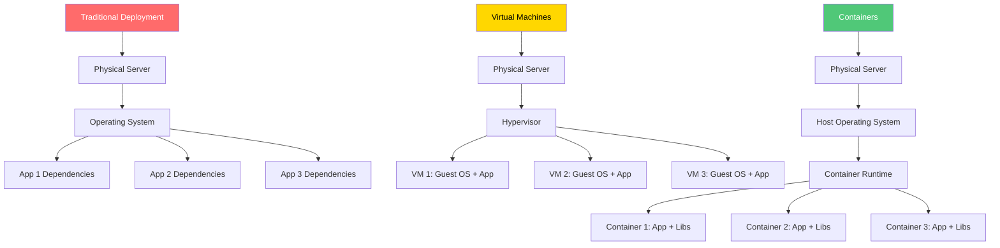
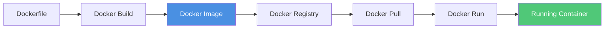
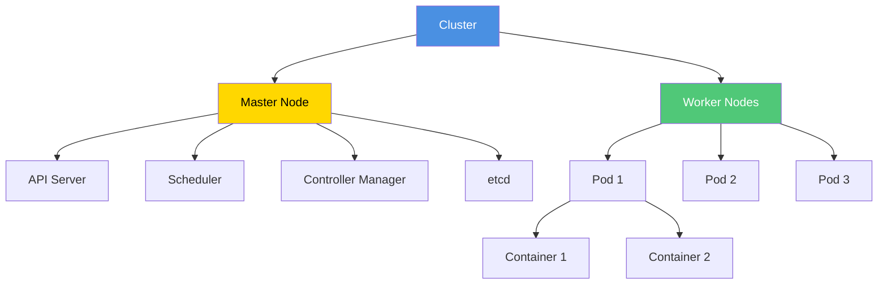
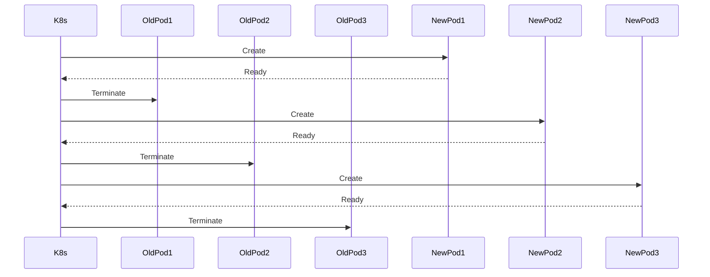

import ContainerizationImage from '/img/undraw_container_ship.svg';

<div className="text--center margin-bottom--lg">
  <ContainerizationImage width="80%" height="300px" />
</div>

Containerization is a lightweight virtualization technology that packages applications and their dependencies into
isolated, portable units called containers. Containers ensure consistency across development, testing, and production
environments, making deployment predictable and scalable. This chapter explores containerization fundamentals, Docker,
Kubernetes, and best practices for containerized applications.

## What is Containerization?

Containerization encapsulates an application with its runtime environment, libraries, and configuration files into a
single, executable package. Unlike traditional virtual machines (VMs), containers share the host operating system's
kernel, making them lightweight and fast to start.



### Key Benefits

**Portability**: Run anywhere—development laptop, test server, cloud platform **Consistency**: Eliminate "works on my
machine" problems **Efficiency**: Lightweight compared to VMs, faster startup times **Scalability**: Quickly scale up or
down based on demand **Isolation**: Applications run independently without conflicts **DevOps Integration**: Seamless
CI/CD pipeline integration

## Docker Fundamentals

Docker is the most popular containerization platform. It provides tools to build, ship, and run containers.

### Core Concepts

**Image**: Read-only template with application code and dependencies **Container**: Running instance of an image
**Dockerfile**: Script defining how to build an image **Registry**: Repository for storing and distributing images
(Docker Hub, ECR, GCR) **Volume**: Persistent storage for containers **Network**: Communication between containers



### Creating a Dockerfile

A Dockerfile defines the steps to build a container image.

```dockerfile
# Use official base image
FROM node:18-alpine

# Set working directory
WORKDIR /app

# Copy dependency files
COPY package*.json ./

# Install dependencies
RUN npm ci --only=production

# Copy application code
COPY . .

# Expose application port
EXPOSE 3000

# Define health check
HEALTHCHECK --interval=30s --timeout=3s --start-period=40s --retries=3 \
  CMD node healthcheck.js

# Create non-root user
RUN addgroup -g 1001 -S nodejs && \
    adduser -S nodejs -u 1001

# Change ownership of app files
RUN chown -R nodejs:nodejs /app

# Switch to non-root user
USER nodejs

# Start application
CMD ["node", "server.js"]
```

### Multi-Stage Builds

Reduce image size by using multiple build stages.

```dockerfile
# Build stage
FROM node:18-alpine AS builder

WORKDIR /app

# Install dependencies
COPY package*.json ./
RUN npm ci

# Copy source and build
COPY . .
RUN npm run build

# Production stage
FROM node:18-alpine

WORKDIR /app

# Copy only production dependencies
COPY package*.json ./
RUN npm ci --only=production

# Copy built application from builder stage
COPY --from=builder /app/dist ./dist

# Create non-root user
RUN addgroup -g 1001 -S nodejs && \
    adduser -S nodejs -u 1001 && \
    chown -R nodejs:nodejs /app

USER nodejs

EXPOSE 3000

CMD ["node", "dist/server.js"]
```

**Benefits of multi-stage builds**:

- Smaller final image size (no build tools)
- Faster deployment and startup
- Improved security (fewer attack surfaces)
- Cleaner separation of concerns

### Building and Running Containers

```bash
# Build image
docker build -t myapp:1.0.0 .

# Tag for registry
docker tag myapp:1.0.0 myregistry/myapp:1.0.0

# Push to registry
docker push myregistry/myapp:1.0.0

# Run container
docker run -d \
  --name myapp \
  -p 3000:3000 \
  -e NODE_ENV=production \
  -v /host/data:/app/data \
  --restart unless-stopped \
  myapp:1.0.0

# View logs
docker logs -f myapp

# Execute command in container
docker exec -it myapp /bin/sh

# Stop and remove container
docker stop myapp
docker rm myapp
```

### Docker Compose

Define and run multi-container applications.

```yaml
version: '3.8'

services:
  web:
    build:
      context: .
      dockerfile: Dockerfile
    ports:
      - '3000:3000'
    environment:
      - NODE_ENV=production
      - DB_HOST=database
      - REDIS_HOST=cache
    depends_on:
      - database
      - cache
    networks:
      - app-network
    volumes:
      - ./logs:/app/logs
    restart: unless-stopped
    healthcheck:
      test: ['CMD', 'wget', '--quiet', '--tries=1', '--spider', 'http://localhost:3000/health']
      interval: 30s
      timeout: 10s
      retries: 3
      start_period: 40s

  database:
    image: postgres:15-alpine
    environment:
      - POSTGRES_DB=myapp
      - POSTGRES_USER=myuser
      - POSTGRES_PASSWORD_FILE=/run/secrets/db_password
    secrets:
      - db_password
    volumes:
      - db-data:/var/lib/postgresql/data
      - ./init.sql:/docker-entrypoint-initdb.d/init.sql
    networks:
      - app-network
    restart: unless-stopped
    healthcheck:
      test: ['CMD-SHELL', 'pg_isready -U myuser']
      interval: 10s
      timeout: 5s
      retries: 5

  cache:
    image: redis:7-alpine
    command: redis-server --appendonly yes
    volumes:
      - redis-data:/data
    networks:
      - app-network
    restart: unless-stopped
    healthcheck:
      test: ['CMD', 'redis-cli', 'ping']
      interval: 10s
      timeout: 3s
      retries: 3

  nginx:
    image: nginx:alpine
    ports:
      - '80:80'
      - '443:443'
    volumes:
      - ./nginx.conf:/etc/nginx/nginx.conf:ro
      - ./ssl:/etc/nginx/ssl:ro
    depends_on:
      - web
    networks:
      - app-network
    restart: unless-stopped

networks:
  app-network:
    driver: bridge

volumes:
  db-data:
  redis-data:

secrets:
  db_password:
    file: ./secrets/db_password.txt
```

**Running with Docker Compose**:

```bash
# Start all services
docker-compose up -d

# View logs
docker-compose logs -f

# Scale a service
docker-compose up -d --scale web=3

# Stop all services
docker-compose down

# Stop and remove volumes
docker-compose down -v
```

## Container Best Practices

### 1. Use Official Base Images

Start with trusted, maintained base images.

```dockerfile
# Good: Official images
FROM node:18-alpine
FROM python:3.11-slim
FROM golang:1.21-alpine

# Avoid: Unknown or unmaintained images
FROM random-user/custom-node
```

### 2. Minimize Image Layers

Combine commands to reduce layer count.

```dockerfile
# Bad: Multiple layers
RUN apt-get update
RUN apt-get install -y curl
RUN apt-get install -y git
RUN apt-get clean

# Good: Single layer
RUN apt-get update && \
    apt-get install -y curl git && \
    apt-get clean && \
    rm -rf /var/lib/apt/lists/*
```

### 3. Leverage Build Cache

Order Dockerfile instructions to maximize cache hits.

```dockerfile
# Copy dependency files first (changes less frequently)
COPY package*.json ./
RUN npm ci

# Copy source code last (changes frequently)
COPY . .
```

### 4. Use .dockerignore

Exclude unnecessary files from build context.

```plaintext
# .dockerignore
node_modules
npm-debug.log
.git
.gitignore
README.md
.env
.env.local
.DS_Store
*.md
dist
coverage
.vscode
.idea
```

### 5. Run as Non-Root User

Improve security by avoiding root privileges.

```dockerfile
# Create user
RUN addgroup -g 1001 -S nodejs && \
    adduser -S nodejs -u 1001

# Change file ownership
RUN chown -R nodejs:nodejs /app

# Switch to non-root user
USER nodejs
```

### 6. Implement Health Checks

Enable container orchestrators to monitor application health.

```dockerfile
HEALTHCHECK --interval=30s --timeout=3s --start-period=40s --retries=3 \
  CMD wget --quiet --tries=1 --spider http://localhost:3000/health || exit 1
```

```javascript
// healthcheck.js
const http = require('http');

const options = {
  host: 'localhost',
  port: 3000,
  path: '/health',
  timeout: 2000,
};

const request = http.request(options, (res) => {
  if (res.statusCode === 200) {
    process.exit(0);
  } else {
    process.exit(1);
  }
});

request.on('error', () => {
  process.exit(1);
});

request.end();
```

### 7. Handle Signals Properly

Gracefully shutdown on termination signals.

```javascript
// server.js
const express = require('express');
const app = express();

const server = app.listen(3000, () => {
  console.log('Server started on port 3000');
});

// Graceful shutdown
const shutdown = (signal) => {
  console.log(`Received ${signal}, shutting down gracefully`);

  server.close(() => {
    console.log('HTTP server closed');

    // Close database connections
    database.close(() => {
      console.log('Database connection closed');
      process.exit(0);
    });
  });

  // Force shutdown after 30 seconds
  setTimeout(() => {
    console.error('Forcefully shutting down');
    process.exit(1);
  }, 30000);
};

process.on('SIGTERM', () => shutdown('SIGTERM'));
process.on('SIGINT', () => shutdown('SIGINT'));
```

### 8. Use Secrets Securely

Never hardcode secrets in images.

```bash
# Bad: Secrets in environment variables (visible in image)
docker run -e DB_PASSWORD=supersecret myapp

# Good: Use secrets management
docker run --env-file .env myapp

# Better: Use orchestrator secrets (Kubernetes, Docker Swarm)
```

## Kubernetes Fundamentals

Kubernetes (K8s) is an open-source container orchestration platform for automating deployment, scaling, and management
of containerized applications.

### Core Concepts



**Cluster**: Set of machines running Kubernetes **Node**: Worker machine (VM or physical) **Pod**: Smallest deployable
unit, contains one or more containers **Deployment**: Declarative updates for Pods **Service**: Exposes Pods to network
traffic **ConfigMap**: Configuration data **Secret**: Sensitive configuration data **Namespace**: Virtual cluster for
resource isolation

### Kubernetes Deployment

```yaml
# deployment.yaml
apiVersion: apps/v1
kind: Deployment
metadata:
  name: myapp
  namespace: production
  labels:
    app: myapp
    version: v1
spec:
  replicas: 3
  selector:
    matchLabels:
      app: myapp
  strategy:
    type: RollingUpdate
    rollingUpdate:
      maxSurge: 1
      maxUnavailable: 0
  template:
    metadata:
      labels:
        app: myapp
        version: v1
    spec:
      containers:
        - name: myapp
          image: myregistry/myapp:1.0.0
          imagePullPolicy: Always
          ports:
            - containerPort: 3000
              name: http
              protocol: TCP
          env:
            - name: NODE_ENV
              value: 'production'
            - name: DB_HOST
              valueFrom:
                configMapKeyRef:
                  name: myapp-config
                  key: database.host
            - name: DB_PASSWORD
              valueFrom:
                secretKeyRef:
                  name: myapp-secrets
                  key: database.password
          resources:
            requests:
              memory: '256Mi'
              cpu: '250m'
            limits:
              memory: '512Mi'
              cpu: '500m'
          livenessProbe:
            httpGet:
              path: /health
              port: 3000
            initialDelaySeconds: 30
            periodSeconds: 10
            timeoutSeconds: 5
            failureThreshold: 3
          readinessProbe:
            httpGet:
              path: /ready
              port: 3000
            initialDelaySeconds: 10
            periodSeconds: 5
            timeoutSeconds: 3
            failureThreshold: 3
          volumeMounts:
            - name: config
              mountPath: /app/config
              readOnly: true
            - name: data
              mountPath: /app/data
      volumes:
        - name: config
          configMap:
            name: myapp-config
        - name: data
          persistentVolumeClaim:
            claimName: myapp-data-pvc
      imagePullSecrets:
        - name: registry-credentials
      securityContext:
        runAsNonRoot: true
        runAsUser: 1001
        fsGroup: 1001
```

### Kubernetes Service

```yaml
# service.yaml
apiVersion: v1
kind: Service
metadata:
  name: myapp-service
  namespace: production
  labels:
    app: myapp
spec:
  type: ClusterIP
  selector:
    app: myapp
  ports:
    - name: http
      port: 80
      targetPort: 3000
      protocol: TCP
  sessionAffinity: ClientIP
```

### ConfigMap and Secrets

```yaml
# configmap.yaml
apiVersion: v1
kind: ConfigMap
metadata:
  name: myapp-config
  namespace: production
data:
  database.host: 'postgres.production.svc.cluster.local'
  database.port: '5432'
  database.name: 'myapp'
  log.level: 'info'
  feature.flags: |
    {
      "enableNewUI": true,
      "enableBetaFeatures": false
    }

---
# secret.yaml
apiVersion: v1
kind: Secret
metadata:
  name: myapp-secrets
  namespace: production
type: Opaque
stringData:
  database.password: 'supersecretpassword'
  api.key: 'abc123xyz789'
```

### Ingress for External Access

```yaml
# ingress.yaml
apiVersion: networking.k8s.io/v1
kind: Ingress
metadata:
  name: myapp-ingress
  namespace: production
  annotations:
    kubernetes.io/ingress.class: 'nginx'
    cert-manager.io/cluster-issuer: 'letsencrypt-prod'
    nginx.ingress.kubernetes.io/rate-limit: '100'
    nginx.ingress.kubernetes.io/ssl-redirect: 'true'
spec:
  tls:
    - hosts:
        - myapp.example.com
      secretName: myapp-tls
  rules:
    - host: myapp.example.com
      http:
        paths:
          - path: /
            pathType: Prefix
            backend:
              service:
                name: myapp-service
                port:
                  number: 80
```

### Horizontal Pod Autoscaling

```yaml
# hpa.yaml
apiVersion: autoscaling/v2
kind: HorizontalPodAutoscaler
metadata:
  name: myapp-hpa
  namespace: production
spec:
  scaleTargetRef:
    apiVersion: apps/v1
    kind: Deployment
    name: myapp
  minReplicas: 3
  maxReplicas: 10
  metrics:
    - type: Resource
      resource:
        name: cpu
        target:
          type: Utilization
          averageUtilization: 70
    - type: Resource
      resource:
        name: memory
        target:
          type: Utilization
          averageUtilization: 80
  behavior:
    scaleDown:
      stabilizationWindowSeconds: 300
      policies:
        - type: Percent
          value: 50
          periodSeconds: 60
    scaleUp:
      stabilizationWindowSeconds: 0
      policies:
        - type: Percent
          value: 100
          periodSeconds: 30
        - type: Pods
          value: 2
          periodSeconds: 30
      selectPolicy: Max
```

### Persistent Volumes

```yaml
# pvc.yaml
apiVersion: v1
kind: PersistentVolumeClaim
metadata:
  name: myapp-data-pvc
  namespace: production
spec:
  accessModes:
    - ReadWriteOnce
  resources:
    requests:
      storage: 10Gi
  storageClassName: ssd
```

## Kubernetes Deployment Strategies

### Rolling Update

Gradually replace old pods with new ones.



```yaml
spec:
  strategy:
    type: RollingUpdate
    rollingUpdate:
      maxSurge: 1 # Maximum number of pods above desired count
      maxUnavailable: 0 # Maximum number of pods that can be unavailable
```

### Blue-Green Deployment

Switch traffic between two identical environments.

```yaml
# blue-deployment.yaml (current)
apiVersion: apps/v1
kind: Deployment
metadata:
  name: myapp-blue
spec:
  replicas: 3
  selector:
    matchLabels:
      app: myapp
      version: blue
  template:
    metadata:
      labels:
        app: myapp
        version: blue
    spec:
      containers:
        - name: myapp
          image: myapp:1.0.0

---
# green-deployment.yaml (new)
apiVersion: apps/v1
kind: Deployment
metadata:
  name: myapp-green
spec:
  replicas: 3
  selector:
    matchLabels:
      app: myapp
      version: green
  template:
    metadata:
      labels:
        app: myapp
        version: green
    spec:
      containers:
        - name: myapp
          image: myapp:2.0.0

---
# service.yaml (switch by changing selector)
apiVersion: v1
kind: Service
metadata:
  name: myapp
spec:
  selector:
    app: myapp
    version: blue # Change to 'green' to switch traffic
  ports:
    - port: 80
      targetPort: 3000
```

### Canary Deployment

Route small percentage of traffic to new version.

```yaml
# stable-deployment.yaml
apiVersion: apps/v1
kind: Deployment
metadata:
  name: myapp-stable
spec:
  replicas: 9
  selector:
    matchLabels:
      app: myapp
      track: stable
  template:
    metadata:
      labels:
        app: myapp
        track: stable
    spec:
      containers:
        - name: myapp
          image: myapp:1.0.0

---
# canary-deployment.yaml
apiVersion: apps/v1
kind: Deployment
metadata:
  name: myapp-canary
spec:
  replicas: 1 # 10% of traffic (1 out of 10 total pods)
  selector:
    matchLabels:
      app: myapp
      track: canary
  template:
    metadata:
      labels:
        app: myapp
        track: canary
    spec:
      containers:
        - name: myapp
          image: myapp:2.0.0

---
# service.yaml (matches both)
apiVersion: v1
kind: Service
metadata:
  name: myapp
spec:
  selector:
    app: myapp # Selects both stable and canary pods
  ports:
    - port: 80
      targetPort: 3000
```

## Container Security

### Image Security

**1. Scan for vulnerabilities**

```bash
# Using Trivy
trivy image myapp:1.0.0

# Using Docker Scout
docker scout cves myapp:1.0.0

# Using Snyk
snyk container test myapp:1.0.0
```

**2. Use minimal base images**

```dockerfile
# Prefer Alpine or distroless images
FROM node:18-alpine
# or
FROM gcr.io/distroless/nodejs:18
```

**3. Keep images updated**

```bash
# Regularly rebuild images with latest base
docker build --pull -t myapp:1.0.0 .
```

### Runtime Security

**1. Run as non-root user**

```yaml
spec:
  securityContext:
    runAsNonRoot: true
    runAsUser: 1001
    fsGroup: 1001
```

**2. Limit container capabilities**

```yaml
spec:
  securityContext:
    capabilities:
      drop:
        - ALL
      add:
        - NET_BIND_SERVICE
```

**3. Use read-only root filesystem**

```yaml
spec:
  securityContext:
    readOnlyRootFilesystem: true
  volumeMounts:
    - name: tmp
      mountPath: /tmp
  volumes:
    - name: tmp
      emptyDir: {}
```

**4. Implement Pod Security Policies**

```yaml
apiVersion: policy/v1beta1
kind: PodSecurityPolicy
metadata:
  name: restricted
spec:
  privileged: false
  allowPrivilegeEscalation: false
  requiredDropCapabilities:
    - ALL
  volumes:
    - 'configMap'
    - 'emptyDir'
    - 'projected'
    - 'secret'
    - 'downwardAPI'
    - 'persistentVolumeClaim'
  runAsUser:
    rule: 'MustRunAsNonRoot'
  seLinux:
    rule: 'RunAsAny'
  fsGroup:
    rule: 'RunAsAny'
  readOnlyRootFilesystem: true
```

### Network Security

**1. Network Policies**

```yaml
# networkpolicy.yaml
apiVersion: networking.k8s.io/v1
kind: NetworkPolicy
metadata:
  name: myapp-network-policy
  namespace: production
spec:
  podSelector:
    matchLabels:
      app: myapp
  policyTypes:
    - Ingress
    - Egress
  ingress:
    - from:
        - namespaceSelector:
            matchLabels:
              name: production
        - podSelector:
            matchLabels:
              app: nginx
      ports:
        - protocol: TCP
          port: 3000
  egress:
    - to:
        - podSelector:
            matchLabels:
              app: database
      ports:
        - protocol: TCP
          port: 5432
    - to:
        - podSelector:
            matchLabels:
              app: cache
      ports:
        - protocol: TCP
          port: 6379
```

## Monitoring and Logging

### Container Metrics

```yaml
# ServiceMonitor for Prometheus
apiVersion: monitoring.coreos.com/v1
kind: ServiceMonitor
metadata:
  name: myapp-metrics
  namespace: production
spec:
  selector:
    matchLabels:
      app: myapp
  endpoints:
    - port: metrics
      interval: 30s
      path: /metrics
```

```javascript
// Express app with Prometheus metrics
const express = require('express');
const promClient = require('prom-client');

const app = express();

// Create metrics
const register = new promClient.Registry();
promClient.collectDefaultMetrics({ register });

const httpRequestDuration = new promClient.Histogram({
  name: 'http_request_duration_seconds',
  help: 'Duration of HTTP requests in seconds',
  labelNames: ['method', 'route', 'status_code'],
  registers: [register],
});

// Middleware to track metrics
app.use((req, res, next) => {
  const start = Date.now();

  res.on('finish', () => {
    const duration = (Date.now() - start) / 1000;
    httpRequestDuration.labels(req.method, req.route?.path || req.path, res.statusCode).observe(duration);
  });

  next();
});

// Expose metrics endpoint
app.get('/metrics', async (req, res) => {
  res.set('Content-Type', register.contentType);
  res.end(await register.metrics());
});

app.listen(3000);
```

### Centralized Logging

```yaml
# Fluentd DaemonSet for log aggregation
apiVersion: apps/v1
kind: DaemonSet
metadata:
  name: fluentd
  namespace: kube-system
spec:
  selector:
    matchLabels:
      app: fluentd
  template:
    metadata:
      labels:
        app: fluentd
    spec:
      serviceAccountName: fluentd
      containers:
        - name: fluentd
          image: fluent/fluentd-kubernetes-daemonset:v1
          env:
            - name: FLUENT_ELASTICSEARCH_HOST
              value: 'elasticsearch.logging.svc.cluster.local'
            - name: FLUENT_ELASTICSEARCH_PORT
              value: '9200'
          volumeMounts:
            - name: varlog
              mountPath: /var/log
            - name: varlibdockercontainers
              mountPath: /var/lib/docker/containers
              readOnly: true
      volumes:
        - name: varlog
          hostPath:
            path: /var/log
        - name: varlibdockercontainers
          hostPath:
            path: /var/lib/docker/containers
```

## Resource Management

### Resource Requests and Limits

```yaml
spec:
  containers:
    - name: myapp
      resources:
        requests:
          memory: '256Mi' # Minimum guaranteed memory
          cpu: '250m' # Minimum guaranteed CPU (0.25 cores)
        limits:
          memory: '512Mi' # Maximum allowed memory
          cpu: '500m' # Maximum allowed CPU (0.5 cores)
```

**Guidelines**:

- **Requests**: Set based on typical usage
- **Limits**: Set to prevent resource exhaustion
- **CPU throttling**: Limits enforce throttling, not termination
- **Memory limits**: Exceeding causes OOMKilled (pod termination)

### Quality of Service (QoS)

Kubernetes assigns QoS classes based on resource configuration:

**Guaranteed**: Requests == Limits for all resources

```yaml
resources:
  requests:
    memory: '256Mi'
    cpu: '250m'
  limits:
    memory: '256Mi'
    cpu: '250m'
```

**Burstable**: Requests < Limits

```yaml
resources:
  requests:
    memory: '256Mi'
    cpu: '250m'
  limits:
    memory: '512Mi'
    cpu: '500m'
```

**BestEffort**: No requests or limits defined

```yaml
# No resources specified
```

### Resource Quotas

Limit resource consumption per namespace.

```yaml
# resourcequota.yaml
apiVersion: v1
kind: ResourceQuota
metadata:
  name: production-quota
  namespace: production
spec:
  hard:
    requests.cpu: '10'
    requests.memory: 20Gi
    limits.cpu: '20'
    limits.memory: 40Gi
    persistentvolumeclaims: '10'
    pods: '50'
```

## CI/CD Integration

### Building Images in CI Pipeline

```yaml
# .github/workflows/build-and-deploy.yml
name: Build and Deploy

on:
  push:
    branches: [main]

env:
  REGISTRY: ghcr.io
  IMAGE_NAME: ${{ github.repository }}

jobs:
  build:
    runs-on: ubuntu-latest
    permissions:
      contents: read
      packages: write

    steps:
      - name: Checkout code
        uses: actions/checkout@v3

      - name: Set up Docker Buildx
        uses: docker/setup-buildx-action@v2

      - name: Log in to Container Registry
        uses: docker/login-action@v2
        with:
          registry: ${{ env.REGISTRY }}
          username: ${{ github.actor }}
          password: ${{ secrets.GITHUB_TOKEN }}

      - name: Extract metadata
        id: meta
        uses: docker/metadata-action@v4
        with:
          images: ${{ env.REGISTRY }}/${{ env.IMAGE_NAME }}
          tags: |
            type=ref,event=branch
            type=semver,pattern={{version}}
            type=sha,prefix={{branch}}-

      - name: Build and push Docker image
        uses: docker/build-push-action@v4
        with:
          context: .
          push: true
          tags: ${{ steps.meta.outputs.tags }}
          labels: ${{ steps.meta.outputs.labels }}
          cache-from: type=gha
          cache-to: type=gha,mode=max

      - name: Scan image for vulnerabilities
        uses: aquasecurity/trivy-action@master
        with:
          image-ref: ${{ env.REGISTRY }}/${{ env.IMAGE_NAME }}:${{ github.sha }}
          format: 'sarif'
          output: 'trivy-results.sarif'

      - name: Upload scan results
        uses: github/codeql-action/upload-sarif@v2
        with:
          sarif_file: 'trivy-results.sarif'

  deploy:
    needs: build
    runs-on: ubuntu-latest
    steps:
      - name: Checkout code
        uses: actions/checkout@v3

      - name: Configure kubectl
        uses: azure/k8s-set-context@v3
        with:
          kubeconfig: ${{ secrets.KUBECONFIG }}

      - name: Deploy to Kubernetes
        run: |
          kubectl set image deployment/myapp \
            myapp=${{ env.REGISTRY }}/${{ env.IMAGE_NAME }}:${{ github.sha }} \
            -n production

          kubectl rollout status deployment/myapp -n production
```

## Best Practices Summary

### Image Building

✅ **Use multi-stage builds** to minimize image size ✅ **Leverage layer caching** by ordering Dockerfile instructions
properly ✅ **Run as non-root user** for security ✅ **Implement health checks** for orchestrator monitoring ✅ **Scan
for vulnerabilities** before deployment ✅ **Use .dockerignore** to exclude unnecessary files ✅ **Tag images
semantically** with version numbers

### Kubernetes Deployment

✅ **Define resource requests and limits** for all containers ✅ **Implement readiness and liveness probes** for
reliability ✅ **Use ConfigMaps and Secrets** for configuration ✅ **Apply network policies** to restrict traffic ✅
**Enable autoscaling** for dynamic workloads ✅ **Use namespaces** for logical separation ✅ **Implement Pod Security
Policies** for security

### Operations

✅ **Monitor container metrics** with Prometheus ✅ **Aggregate logs** with centralized logging ✅ **Implement
distributed tracing** for microservices ✅ **Use rolling updates** for zero-downtime deployments ✅ **Test in staging**
before production deployment ✅ **Automate rollbacks** on deployment failures ✅ **Regularly update** base images and
dependencies

## Conclusion

Containerization with Docker and Kubernetes provides a robust foundation for modern application deployment. Key
takeaways:

1. **Containers ensure consistency** across environments
2. **Docker simplifies** application packaging
3. **Kubernetes orchestrates** container deployment at scale
4. **Security is critical** at every layer
5. **Monitoring and logging** are essential for observability
6. **Automation** through CI/CD reduces deployment risks

Start with Docker to containerize applications, then adopt Kubernetes as orchestration needs grow. Follow best practices
for security, resource management, and operational excellence to build reliable containerized systems.

## Related Chapters

- [Microservices](/microservices) - Building microservices architecture
- [CI/CD](/ci-cd) - Automating build and deployment pipelines
- [Monitoring and Observability](/monitoring-and-observability) - Tracking system health
- [Security Best Practices](/security-best-practices) - Securing containerized applications
- [Scalability and Reliability](/scalability-and-reliability) - Building resilient systems
- [Development Environment Setup](/development-environment-setup) - Setting up local development

## References

- **Docker Documentation**: [https://docs.docker.com/](https://docs.docker.com/)
- **Kubernetes Documentation**: [https://kubernetes.io/docs/](https://kubernetes.io/docs/)
- **"Kubernetes in Action"** by Marko Lukša
- **"Docker Deep Dive"** by Nigel Poulton
- **The Twelve-Factor App**: [https://12factor.net/](https://12factor.net/)
- **CNCF Cloud Native Landscape**: [https://landscape.cncf.io/](https://landscape.cncf.io/)
- **Kubernetes Best Practices**:
  [https://kubernetes.io/docs/concepts/configuration/overview/](https://kubernetes.io/docs/concepts/configuration/overview/)
