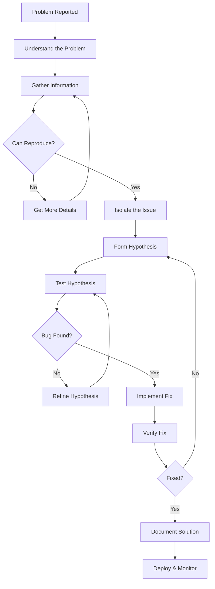
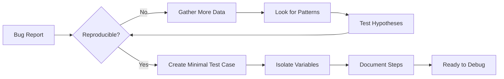
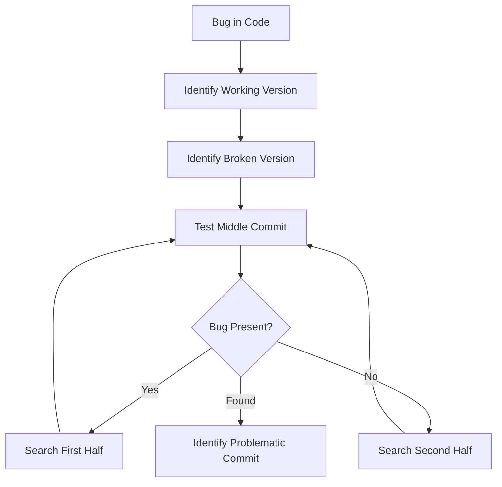
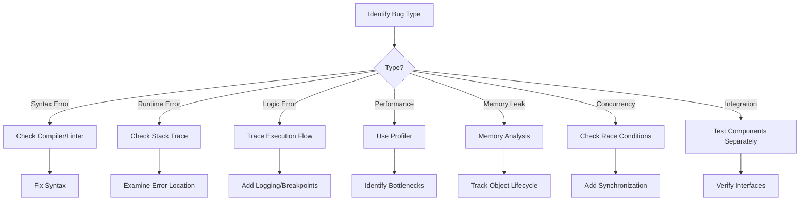

import DebuggingImage from '/img/undraw_inspection.svg';

<div className="text--center margin-bottom--lg">
  <DebuggingImage width="80%" height="300px" />
</div>

Debugging is an essential part of software development—the systematic process of identifying, analyzing, and fixing
errors, bugs, and other issues in software code. While debugging can be challenging, mastering the right techniques and
tools makes it significantly more efficient and effective. This chapter explores comprehensive debugging strategies that
will help you tackle issues methodically and confidently.

## The Debugging Workflow

Understanding the debugging process as a systematic workflow helps you approach problems methodically rather than
randomly trying different solutions.



## Understanding the Problem

Before diving into code, invest time in thoroughly understanding the problem. Hasty debugging often leads to treating
symptoms rather than causes. A well-understood problem is half-solved.

### Symptoms

Symptoms are the observable manifestations of bugs in your software. Accurately documenting these symptoms helps you and
your team identify patterns and potential causes.

**Common Symptom Categories:**

- **Incorrect Output:** Wrong calculations, unexpected data, or malformed responses
- **Crashes or Hangs:** Application termination, freezing, or infinite loops
- **Performance Issues:** Slow response times, memory leaks, or CPU spikes
- **Unexpected Behavior:** Features not working as designed or intermittent failures
- **Data Corruption:** Lost or inconsistent data across systems

**Information to Gather:**

- Exact error messages and stack traces
- Screenshots or screen recordings showing the issue
- Log files from the time of occurrence
- Steps that consistently trigger the problem
- Frequency and pattern of occurrence

### Context

Context helps narrow down potential causes by understanding the environment and conditions under which the bug
manifests.

**Environmental Context:**

- Operating system and version
- Browser type and version (for web applications)
- Hardware specifications (memory, CPU, disk space)
- Network conditions (latency, connectivity issues)
- Time-related factors (specific times, timezones)

**Application Context:**

- User permissions and authentication state
- Data volume and characteristics
- Concurrent users or load conditions
- Recent code changes or deployments
- Third-party service availability

### Error Messages and Logs

Error messages and logs are your first line of investigation. They often point directly to the problem's location.

**Reading Stack Traces:**

```python
# Example stack trace analysis
"""
Traceback (most recent call last):
  File "main.py", line 45, in process_order
    total = calculate_total(items)
  File "calculator.py", line 12, in calculate_total
    return sum(item['price'] * item['quantity'] for item in items)
  File "calculator.py", line 12, in <genexpr>
    return sum(item['price'] * item['quantity'] for item in items)
KeyError: 'price'
"""

# This stack trace tells us:
# 1. The error occurred in calculate_total function
# 2. An item in the list is missing the 'price' key
# 3. The error originated from process_order in main.py
# 4. We need to check why some items lack price information
```

**Log Analysis Tips:**

- Look for patterns across multiple occurrences
- Check timestamps to correlate events
- Pay attention to warnings that preceded errors
- Use log levels to filter noise (ERROR > WARN > INFO > DEBUG)

## Reproducing the Issue

A reproducible bug is much easier to fix than an intermittent one. Creating a reliable way to trigger the issue is
crucial for both diagnosis and verification.



### Test Cases

A good test case is minimal, self-contained, and consistently reproduces the issue.

**Creating Effective Test Cases:**

```python
# BAD: Too complex, hard to debug
def test_entire_checkout_flow():
    user = create_user_with_history()
    cart = add_multiple_items_to_cart(user)
    apply_discounts_and_coupons(cart)
    process_payment(cart)
    # Bug is somewhere in here... but where?

# GOOD: Minimal, focused test case
def test_discount_calculation_with_negative_price():
    """Isolates the specific scenario causing the bug"""
    item = {'name': 'Test', 'price': -10, 'quantity': 2}
    result = calculate_discount(item, discount_rate=0.1)
    # Now we can clearly see the issue with negative prices
    assert result >= 0, "Discount should not result in negative value"
```

**Test Case Components:**

1. **Preconditions:** Initial state before the test
2. **Input Data:** Specific data that triggers the bug
3. **Steps:** Exact actions to perform
4. **Expected Behavior:** What should happen
5. **Actual Behavior:** What actually happens

### Automated Tests

Automated tests serve double duty: they help reproduce bugs and prevent regressions.

```javascript
// Automated test for a bug fix
describe('User Authentication', () => {
  // This test reproduces a bug where special characters in passwords caused issues
  it('should handle passwords with special characters', async () => {
    const password = 'P@ssw0rd!#$%';
    const user = await createUser({ email: 'test@example.com', password });

    // Verify the user can log in with the special character password
    const loginResult = await authenticateUser('test@example.com', password);

    expect(loginResult.success).toBe(true);
    expect(loginResult.token).toBeDefined();
  });

  // Additional edge cases discovered during debugging
  it('should handle passwords with unicode characters', async () => {
    const password = 'пароль123'; // Russian characters
    const user = await createUser({ email: 'test2@example.com', password });
    const loginResult = await authenticateUser('test2@example.com', password);

    expect(loginResult.success).toBe(true);
  });
});
```

## Debugging Tools

Modern development environments provide powerful debugging tools. Mastering these tools dramatically improves your
debugging efficiency.

### Interactive Debuggers

Interactive debuggers allow you to pause execution and inspect program state in real-time.

**Key Features:**

- **Breakpoints:** Pause execution at specific lines
- **Step Execution:** Move through code line by line
- **Variable Inspection:** Examine values at runtime
- **Call Stack:** See the sequence of function calls
- **Watch Expressions:** Monitor specific variables or expressions

**Example: Python Debugger (pdb)**

```python
import pdb

def calculate_average(numbers):
    # Set a breakpoint here
    pdb.set_trace()

    total = sum(numbers)
    count = len(numbers)

    # You can inspect variables, step through code,
    # and examine the call stack here
    average = total / count
    return average

# When execution hits pdb.set_trace(), you get an interactive prompt:
# (Pdb) print(numbers)
# (Pdb) print(total)
# (Pdb) next  # Step to next line
# (Pdb) continue  # Resume execution
```

**Example: JavaScript Debugger (Chrome DevTools)**

```javascript
function processUserData(userData) {
  // Set breakpoint in DevTools or use debugger statement
  debugger;

  const validated = validateUser(userData);
  const normalized = normalizeData(validated);
  const saved = saveToDatabase(normalized);

  return saved;
}

// In Chrome DevTools:
// - Sources tab -> Find file -> Click line number for breakpoint
// - When paused: inspect variables in Scope panel
// - Use Step Over (F10), Step Into (F11), Step Out (Shift+F11)
```

### Logging and Tracing

Strategic logging provides visibility into application behavior without stopping execution.

**Logging Levels:**

```python
import logging

# Configure logging with appropriate level
logging.basicConfig(level=logging.DEBUG)
logger = logging.getLogger(__name__)

def process_payment(order_id, amount):
    logger.debug(f"Starting payment processing for order {order_id}")

    try:
        logger.info(f"Processing payment of ${amount} for order {order_id}")

        # Simulate payment processing
        if amount <= 0:
            logger.warning(f"Invalid amount {amount} for order {order_id}")
            return False

        # Process payment
        result = payment_gateway.charge(amount)

        if result.success:
            logger.info(f"Payment successful for order {order_id}")
        else:
            logger.error(f"Payment failed for order {order_id}: {result.error}")

        return result.success

    except Exception as e:
        logger.exception(f"Payment processing error for order {order_id}")
        raise
```

**Distributed Tracing:**

For microservices architectures, distributed tracing helps track requests across services.

```python
# Using OpenTelemetry for distributed tracing
from opentelemetry import trace

tracer = trace.get_tracer(__name__)

def api_endpoint(request):
    with tracer.start_as_current_span("process_request") as span:
        span.set_attribute("user_id", request.user_id)
        span.set_attribute("request_id", request.id)

        # This span will be part of a larger trace
        result = call_external_service(request.data)

        span.add_event("external_service_called", {
            "response_time": result.duration
        })

        return result
```

### Profilers

Profilers help identify performance bottlenecks and resource usage issues.

**CPU Profiling:**

```python
import cProfile
import pstats

def slow_function():
    # Your code here
    pass

# Profile the function
cProfile.run('slow_function()', 'profile_stats')

# Analyze the results
stats = pstats.Stats('profile_stats')
stats.sort_stats('cumulative')
stats.print_stats(10)  # Show top 10 time-consuming functions
```

**Memory Profiling:**

```python
from memory_profiler import profile

@profile
def memory_intensive_function():
    # Track memory usage line by line
    large_list = [i for i in range(1000000)]
    processed = [x * 2 for x in large_list]
    return sum(processed)

# Output shows memory usage for each line:
# Line    Mem usage  Increment   Line Contents
# 3       50.0 MiB   0.0 MiB     large_list = [i for i in range(1000000)]
# 4       88.2 MiB   38.2 MiB    processed = [x * 2 for x in large_list]
```

### Network Analysis Tools

For debugging API calls and network issues, tools like browser DevTools, Postman, or curl are essential.

```bash
# Using curl to debug API issues
curl -v https://api.example.com/users/123 \
  -H "Authorization: Bearer token123" \
  -H "Content-Type: application/json"

# The -v flag shows detailed request/response information:
# * Connected to api.example.com (93.184.216.34) port 443
# > GET /users/123 HTTP/2
# > Host: api.example.com
# > Authorization: Bearer token123
# < HTTP/2 404
# < content-type: application/json
```

## Debugging Techniques

Different situations call for different debugging approaches. Here are proven techniques with practical examples.

### Print Statement Debugging

Despite being simple, strategic print statements remain one of the most effective debugging techniques.

**Strategic Placement:**

```python
def calculate_total_price(items, tax_rate=0.1, discount=0):
    print(f"DEBUG: calculate_total_price called with {len(items)} items")
    print(f"DEBUG: tax_rate={tax_rate}, discount={discount}")

    subtotal = 0
    for item in items:
        print(f"DEBUG: Processing item: {item}")
        subtotal += item['price'] * item['quantity']

    print(f"DEBUG: Subtotal before tax: {subtotal}")

    tax = subtotal * tax_rate
    print(f"DEBUG: Tax amount: {tax}")

    total = subtotal + tax - discount
    print(f"DEBUG: Final total: {total}")

    return total

# Output helps identify exactly where calculations go wrong:
# DEBUG: calculate_total_price called with 3 items
# DEBUG: tax_rate=0.1, discount=10
# DEBUG: Processing item: {'name': 'Book', 'price': 20, 'quantity': 2}
# DEBUG: Processing item: {'name': 'Pen', 'price': 5, 'quantity': 10}
# DEBUG: Processing item: {'name': 'Notebook', 'price': 15, 'quantity': 1}
# DEBUG: Subtotal before tax: 105
# DEBUG: Tax amount: 10.5
# DEBUG: Final total: 105.5
```

**Advanced Debugging Output:**

```python
import json

def debug_print(variable_name, value):
    """Enhanced debug printing with type information"""
    print(f"\n{'='*50}")
    print(f"DEBUG: {variable_name}")
    print(f"Type: {type(value).__name__}")
    print(f"Value: {json.dumps(value, indent=2, default=str)}")
    print(f"{'='*50}\n")

# Usage
user_data = {'id': 123, 'name': 'John', 'roles': ['admin', 'user']}
debug_print("user_data", user_data)
```

### Binary Search Debugging

When dealing with large codebases or many commits, binary search helps quickly locate the source of bugs.

**Technique:**



**Using Git Bisect:**

```bash
# Start bisecting
git bisect start

# Mark current version as bad
git bisect bad

# Mark last known good commit
git bisect good abc123

# Git will check out a commit in the middle
# Test your code, then mark it:
git bisect good  # if it works
# or
git bisect bad   # if the bug is present

# Git will continue halving the range until it finds the problematic commit
# When done:
git bisect reset
```

**Code-Level Binary Search:**

```python
def process_large_dataset(data):
    # Comment out half of the operations to find which causes the bug

    # Phase 1: Data Loading (enable/disable this block)
    # loaded = load_data(data)
    # validated = validate_data(loaded)

    # Phase 2: Processing (enable/disable this block)
    # transformed = transform_data(validated)
    # filtered = filter_data(transformed)

    # Phase 3: Analysis (enable/disable this block)
    # analyzed = analyze_data(filtered)
    # results = generate_results(analyzed)

    # By systematically enabling/disabling blocks, you can isolate which phase contains the bug
    pass
```

### Rubber Duck Debugging

Explaining your code to someone (or something) often reveals logical flaws and assumptions you've made.

**How It Works:**

1. Find a rubber duck (or colleague, or even a houseplant)
2. Explain your code line by line
3. Describe what each part does and why
4. Articulate your assumptions
5. Often, you'll spot the problem while explaining

**Example Internal Dialogue:**

```python
def calculate_discount(price, discount_percent):
    # "This function calculates the discounted price..."
    # "It takes the original price and a discount percentage..."

    discount_amount = price * discount_percent
    # "I calculate the discount amount by multiplying price by discount_percent..."
    # "Wait... if discount_percent is 10%, I'm passing 10, not 0.10..."
    # "That means I'm calculating price * 10 instead of price * 0.10!"
    # "That's the bug!"

    return price - discount_amount
```

### Divide and Conquer

Break complex problems into smaller, testable pieces.

**Isolating Components:**

```python
# Instead of debugging this complex function all at once:
def complex_operation(data):
    cleaned = clean_data(data)
    validated = validate_schema(cleaned)
    transformed = apply_transformations(validated)
    aggregated = aggregate_results(transformed)
    formatted = format_output(aggregated)
    return formatted

# Test each step independently:
def test_each_step():
    sample_data = get_sample_data()

    # Test step 1
    cleaned = clean_data(sample_data)
    print(f"After cleaning: {cleaned}")
    assert cleaned is not None

    # Test step 2
    validated = validate_schema(cleaned)
    print(f"After validation: {validated}")
    assert validated is not None

    # Continue testing each step...
    # This helps identify exactly which step fails
```

### Comparing with Working Code

If similar code works elsewhere, compare the differences.

```python
# Working code (in ProductService):
def calculate_price(self, product):
    base_price = product.price
    tax = base_price * self.tax_rate
    return base_price + tax

# Broken code (in OrderService):
def calculate_price(self, product):
    base_price = product.cost  # BUG: should be product.price
    tax = base_price * self.tax_rate
    return base_price + tax

# By comparing side-by-side, the difference becomes obvious
```

### Hypothesis-Driven Debugging

Approach debugging scientifically: form hypotheses and test them.

**Process:**

```python
# Problem: Users can't log in with passwords containing special characters

# Hypothesis 1: Password validation rejects special characters
def test_hypothesis_1():
    password = "P@ssw0rd!"
    is_valid = validate_password(password)
    print(f"Hypothesis 1: Validation rejects special chars = {not is_valid}")
    # Result: False (validation accepts special chars)

# Hypothesis 2: Password hashing fails with special characters
def test_hypothesis_2():
    password = "P@ssw0rd!"
    try:
        hashed = hash_password(password)
        print(f"Hypothesis 2: Hashing fails = False")
        print(f"Hash: {hashed}")
    except Exception as e:
        print(f"Hypothesis 2: Hashing fails = True, Error: {e}")
    # Result: False (hashing works fine)

# Hypothesis 3: URL encoding issue when password sent to API
def test_hypothesis_3():
    password = "P@ssw0rd!"
    # Simulate sending password in URL parameter (wrong approach)
    url = f"/api/login?password={password}"
    print(f"URL: {url}")
    # @ symbol in URL might be interpreted differently!
    # Result: True - Found the bug!
```

### Time-Travel Debugging

Some advanced debuggers allow you to step backwards through execution.

**Concept:**

```javascript
// With time-travel debugging (e.g., rr, UndoDB, or certain IDE features)
function processTransaction(account, amount) {
  let balance = account.balance; // breakpoint here

  if (amount > balance) {
    throw new Error('Insufficient funds');
  }

  balance -= amount; // If we reach here and realize balance was wrong,
  // we can step BACKWARDS to see how balance got its value

  account.balance = balance;
}

// Time-travel debugging lets you:
// 1. Move backwards in execution history
// 2. Inspect previous state of variables
// 3. Find when a variable changed to an unexpected value
```

## Debugging Strategies by Bug Type

Different types of bugs require different approaches.



### Logic Errors

Bugs where the code runs but produces incorrect results.

**Debugging Approach:**

```python
def calculate_fibonacci(n):
    """Bug: This doesn't handle n=0 correctly"""
    if n <= 1:
        return 1  # BUG: Should return n, not 1

    return calculate_fibonacci(n-1) + calculate_fibonacci(n-2)

# Debugging:
print(f"fibonacci(0) = {calculate_fibonacci(0)}")  # Returns 1, should be 0
print(f"fibonacci(1) = {calculate_fibonacci(1)}")  # Returns 1, correct
print(f"fibonacci(2) = {calculate_fibonacci(2)}")  # Returns 2, should be 1

# Adding debug output to trace execution:
def calculate_fibonacci_debug(n, depth=0):
    indent = "  " * depth
    print(f"{indent}fibonacci({n})")

    if n <= 1:
        result = 1  # BUG here
        print(f"{indent}  -> base case: {result}")
        return result

    result = calculate_fibonacci_debug(n-1, depth+1) + calculate_fibonacci_debug(n-2, depth+1)
    print(f"{indent}  -> {result}")
    return result
```

### Race Conditions

Bugs that occur due to timing issues in concurrent code.

**Example and Solution:**

```python
import threading
import time

# Buggy code with race condition
class Counter:
    def __init__(self):
        self.count = 0

    def increment(self):
        # Race condition: read-modify-write is not atomic
        temp = self.count
        time.sleep(0.0001)  # Simulates context switch
        self.count = temp + 1

# Fixed code with proper synchronization
class SafeCounter:
    def __init__(self):
        self.count = 0
        self.lock = threading.Lock()

    def increment(self):
        with self.lock:
            temp = self.count
            time.sleep(0.0001)
            self.count = temp + 1

# Debug by running multiple threads and checking final count
def test_counter(counter_class, name):
    counter = counter_class()
    threads = []

    for _ in range(10):
        t = threading.Thread(target=lambda: [counter.increment() for _ in range(100)])
        threads.append(t)
        t.start()

    for t in threads:
        t.join()

    print(f"{name} final count: {counter.count} (expected: 1000)")

test_counter(Counter, "Buggy Counter")  # Will be less than 1000
test_counter(SafeCounter, "Safe Counter")  # Will be exactly 1000
```

### Memory Leaks

Gradual memory consumption that isn't released.

**Finding Memory Leaks:**

```python
import tracemalloc
import gc

# Start tracking memory
tracemalloc.start()

# Take initial snapshot
snapshot1 = tracemalloc.take_snapshot()

# Run code that might leak memory
def leaky_function():
    global leaked_data
    leaked_data = []  # Global reference prevents garbage collection

    for i in range(100000):
        leaked_data.append([i] * 100)  # Accumulates in memory

leaky_function()

# Take second snapshot
snapshot2 = tracemalloc.take_snapshot()

# Compare snapshots
top_stats = snapshot2.compare_to(snapshot1, 'lineno')

print("[ Top 10 memory allocation differences ]")
for stat in top_stats[:10]:
    print(stat)

# Output shows which lines allocated the most memory
```

## Best Practices

Adopt these practices to make debugging more efficient and prevent future bugs.

### Write Debuggable Code

**Use Descriptive Names:**

```python
# BAD: Hard to debug
def f(x, y):
    return x * y + 10

# GOOD: Self-documenting
def calculate_total_with_shipping(item_price, quantity):
    subtotal = item_price * quantity
    shipping_cost = 10
    return subtotal + shipping_cost
```

**Add Assertions:**

```python
def divide_numbers(dividend, divisor):
    # Assertions catch invalid assumptions early
    assert divisor != 0, f"Division by zero: dividend={dividend}, divisor={divisor}"
    assert isinstance(dividend, (int, float)), f"Invalid dividend type: {type(dividend)}"
    assert isinstance(divisor, (int, float)), f"Invalid divisor type: {type(divisor)}"

    return dividend / divisor
```

**Include Input Validation:**

```python
def process_user_age(age):
    # Validate inputs and provide clear error messages
    if not isinstance(age, int):
        raise TypeError(f"Age must be an integer, got {type(age).__name__}: {age}")

    if age < 0:
        raise ValueError(f"Age cannot be negative: {age}")

    if age > 150:
        raise ValueError(f"Age seems unrealistic: {age}")

    return age
```

### Keep a Debugging Log

Maintain a record of bugs, solutions, and lessons learned.

**Example Debugging Log:**

```markdown
## Bug #247: User Authentication Fails with Special Characters

**Date:** 2024-10-15 **Reporter:** User Support Team **Severity:** High

**Symptoms:**

- Users with @ symbol in password cannot log in
- Error: "Invalid credentials"
- Affects ~5% of users

**Investigation:**

1. Confirmed password validation allows special characters ✓
2. Verified password hashing works correctly ✓
3. Checked API request format
   - Found issue: password sent as URL parameter
   - @ symbol in URL interpreted as separator

**Root Cause:** Password transmitted in GET request URL parameter instead of POST request body

**Solution:** Changed login API from GET to POST, password in request body

**Testing:**

- Tested with passwords containing: @, #, $, %, &, \*
- All tests passed

**Prevention:**

- Added test cases for special characters
- Updated API guidelines to never send sensitive data in URL
- Code review checklist updated

**Time Spent:** 3 hours **Related Issues:** #156, #203
```

### Use Version Control Effectively

Version control helps identify when bugs were introduced.

**Git Blame for Context:**

```bash
# Find out when a specific line was changed
git blame -L 10,20 src/auth.py

# See the commit that introduced a bug
git log -p src/auth.py

# Find all changes to a specific function
git log -L :authenticate:src/auth.py
```

**Create Bug Fix Branches:**

```bash
# Create a branch for the bug fix
git checkout -b fix/login-special-characters

# Make your changes and commit with descriptive message
git commit -m "fix: handle special characters in login passwords

- Change login endpoint from GET to POST
- Move password from URL parameter to request body
- Add test cases for special characters
- Fixes #247"
```

### Leverage Automated Testing

Tests catch bugs early and verify fixes don't break existing functionality.

**Regression Test for Bug Fix:**

```javascript
describe('Authentication Bug Fixes', () => {
  // Test ensures bug #247 doesn't return
  it('should authenticate users with special characters in password', async () => {
    const specialPasswords = ['P@ssw0rd', 'test#123', 'my$ecure&pass', 'user%pass!'];

    for (const password of specialPasswords) {
      const user = await createTestUser({
        email: 'test@example.com',
        password: password,
      });

      const result = await authenticate('test@example.com', password);

      expect(result.success).toBe(true);
      expect(result.token).toBeDefined();

      await deleteTestUser(user.id);
    }
  });
});
```

### Use Defensive Programming

Anticipate potential issues and handle them gracefully.

```python
def get_user_email(user_data):
    """Defensive programming example"""

    # Check if user_data exists
    if user_data is None:
        raise ValueError("user_data cannot be None")

    # Check if user_data is a dictionary
    if not isinstance(user_data, dict):
        raise TypeError(f"user_data must be a dict, got {type(user_data).__name__}")

    # Check if email key exists
    if 'email' not in user_data:
        raise KeyError("user_data missing required 'email' field")

    email = user_data['email']

    # Validate email format
    if not isinstance(email, str):
        raise TypeError(f"Email must be string, got {type(email).__name__}")

    if '@' not in email:
        raise ValueError(f"Invalid email format: {email}")

    return email.lower().strip()
```

### Know When to Ask for Help

Don't spend hours on a problem that a colleague might solve in minutes.

**Before Asking:**

1. Clearly document the problem
2. List what you've already tried
3. Create a minimal reproduction case
4. Gather relevant logs and error messages

**How to Ask:**

````markdown
## Help Request: Unexpected Database Timeout

**Problem:** API endpoint /api/users/{id} times out after 30 seconds when fetching users with many orders.

**What I've Tried:**

1. Added database indexes on user_id and created_at columns
2. Increased connection pool size
3. Added query logging to identify slow queries
4. Tested with different users (problem only occurs with users having >1000 orders)

**Environment:**

- Database: PostgreSQL 14
- Connection pool: 20 connections
- API load: ~50 requests/minute

**Minimal Reproduction:**

```sql
-- This query times out:
SELECT u.*, o.*
FROM users u
LEFT JOIN orders o ON o.user_id = u.id
WHERE u.id = 12345;
-- Returns 50,000 rows, takes 35 seconds
```
````

**Question:** Should I paginate the orders, use a separate endpoint, or is there a better database optimization?

**Relevant Logs:** [Attached: database-slow-query.log]

````

## Common Debugging Pitfalls

Avoid these common mistakes that can waste time during debugging.

### Pitfall 1: Making Multiple Changes at Once

**Problem:**

```python
# Don't do this - too many changes at once
def broken_function(data):
    # Changed validation logic
    if not validate_new_way(data):
        return None

    # AND changed processing logic
    result = new_processing_method(data)

    # AND changed output format
    return format_differently(result)

# Now if it works (or doesn't), you don't know which change fixed (or broke) it!
````

**Solution:** Change one thing at a time and test after each change.

### Pitfall 2: Assuming You Know the Problem

**Problem:** Fixing what you think is wrong without verifying it's the actual cause.

```python
# Assumption: "The API must be returning bad data"
def process_api_response(response):
    # Add lots of data validation/cleaning
    cleaned = clean_api_data(response)
    # ... more changes based on assumption

# Actual problem: Client sending wrong request parameters
# All the validation code was unnecessary
```

**Solution:** Verify your hypothesis before implementing a fix.

### Pitfall 3: Debugging Without Understanding

**Problem:** Making changes without understanding why they work.

```python
# Found on StackOverflow: "Add this line to fix the error"
try:
    result = some_function()
except:
    pass  # Silent failure - doesn't fix the problem, just hides it

# This "fixes" the visible error but creates a hidden bug
```

**Solution:** Understand the root cause before applying a fix.

### Pitfall 4: Not Considering Edge Cases

**Problem:** Fixing only the specific reported case.

```python
# Bug report: "Crash when dividing by zero"
def calculate_ratio(a, b):
    if b == 0:
        return 0  # Fixed the crash

    return a / b

# But what about: b = None, b = "0", b = NaN, b = very small number?
```

**Solution:** Consider and test related edge cases.

## Advanced Debugging Scenarios

### Debugging Production Issues

Production debugging requires special care since you can't easily pause execution or add extensive logging.

**Strategies:**

```python
# Feature flag for enabling debug logging
import os
from datetime import datetime

DEBUG_MODE = os.environ.get('DEBUG_MODE', 'false').lower() == 'true'
DEBUG_USER_IDS = set(os.environ.get('DEBUG_USER_IDS', '').split(','))

def process_request(user_id, request_data):
    # Enable detailed logging only for specific users or when debug mode is on
    debug_enabled = DEBUG_MODE or str(user_id) in DEBUG_USER_IDS

    if debug_enabled:
        log_debug(f"Processing request for user {user_id}", request_data)

    try:
        result = perform_operation(request_data)

        if debug_enabled:
            log_debug(f"Operation completed for user {user_id}", result)

        return result

    except Exception as e:
        # Always log errors with context
        log_error(f"Error processing request for user {user_id}", {
            'error': str(e),
            'request_data': request_data,
            'timestamp': datetime.utcnow().isoformat()
        })
        raise
```

### Debugging Distributed Systems

Distributed systems present unique challenges with multiple services, network issues, and eventual consistency.

**Correlation IDs:**

```python
import uuid
from contextvars import ContextVar

# Use context variables to track request across service calls
correlation_id_var = ContextVar('correlation_id', default=None)

def api_handler(request):
    # Generate or extract correlation ID
    correlation_id = request.headers.get('X-Correlation-ID', str(uuid.uuid4()))
    correlation_id_var.set(correlation_id)

    logger.info(f"Processing request", extra={
        'correlation_id': correlation_id,
        'endpoint': request.path
    })

    # Pass correlation ID to other services
    response = call_other_service(
        data=request.data,
        headers={'X-Correlation-ID': correlation_id}
    )

    return response

# Now you can trace a single request through multiple services using the correlation ID
```

### Debugging Third-Party Integration Issues

When working with external APIs or libraries, debugging becomes trickier.

**Approach:**

```python
import requests
import json
from datetime import datetime

class DebugHTTPAdapter(requests.adapters.HTTPAdapter):
    """Custom adapter that logs all HTTP requests and responses"""

    def send(self, request, **kwargs):
        # Log the outgoing request
        print(f"\n{'='*50}")
        print(f"REQUEST: {request.method} {request.url}")
        print(f"Headers: {json.dumps(dict(request.headers), indent=2)}")
        if request.body:
            print(f"Body: {request.body}")
        print(f"Timestamp: {datetime.utcnow().isoformat()}")

        # Send the request
        response = super().send(request, **kwargs)

        # Log the response
        print(f"\nRESPONSE: {response.status_code}")
        print(f"Headers: {json.dumps(dict(response.headers), indent=2)}")
        print(f"Body: {response.text[:500]}")  # First 500 chars
        print(f"{'='*50}\n")

        return response

# Use the debug adapter
session = requests.Session()
session.mount('https://', DebugHTTPAdapter())

# Now all requests through this session will be logged
response = session.get('https://api.example.com/users')
```

## Key Takeaways

:::tip Essential Debugging Principles

1. **Understand before fixing:** Invest time in understanding the problem thoroughly
2. **Reproduce consistently:** A reproducible bug is half-fixed
3. **Change one thing at a time:** Isolate variables to identify the actual fix
4. **Use the right tools:** Master your debugger, profiler, and logging frameworks
5. **Document your process:** Keep records to avoid repeating work
6. **Test your fix:** Verify the solution and ensure no regressions
7. **Learn from bugs:** Each bug teaches you something about your system
8. **Know when to ask:** Don't waste hours when a colleague might help quickly

:::

## Conclusion

Debugging is a skill that improves with practice and experience. By following systematic approaches, using appropriate
tools, and applying proven techniques, you transform debugging from a frustrating experience into an opportunity to
deeply understand your code. Remember that every bug you fix makes you a better developer—you learn about edge cases,
system behavior, and potential pitfalls that you'll avoid in future code.

The most effective debuggers combine technical skills with patience, curiosity, and systematic thinking. They don't just
fix symptoms; they understand root causes. They don't just solve today's bug; they prevent tomorrow's. Embrace debugging
as an essential part of the development process, and you'll find that the skills you develop make you a more thoughtful,
careful, and capable software engineer.

**Further Resources:**

- [GDB Debugging Tutorial](https://www.gnu.org/software/gdb/)
- [Chrome DevTools Documentation](https://developer.chrome.com/docs/devtools/)
- [Python Debugging with pdb](https://docs.python.org/3/library/pdb.html)
- [The Art of Debugging](https://www.oreilly.com/library/view/the-art-of/9781593271749/)
