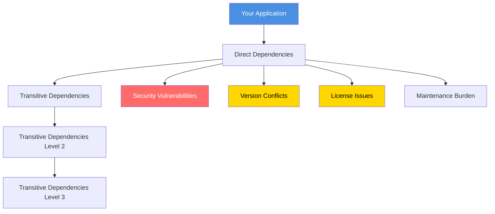
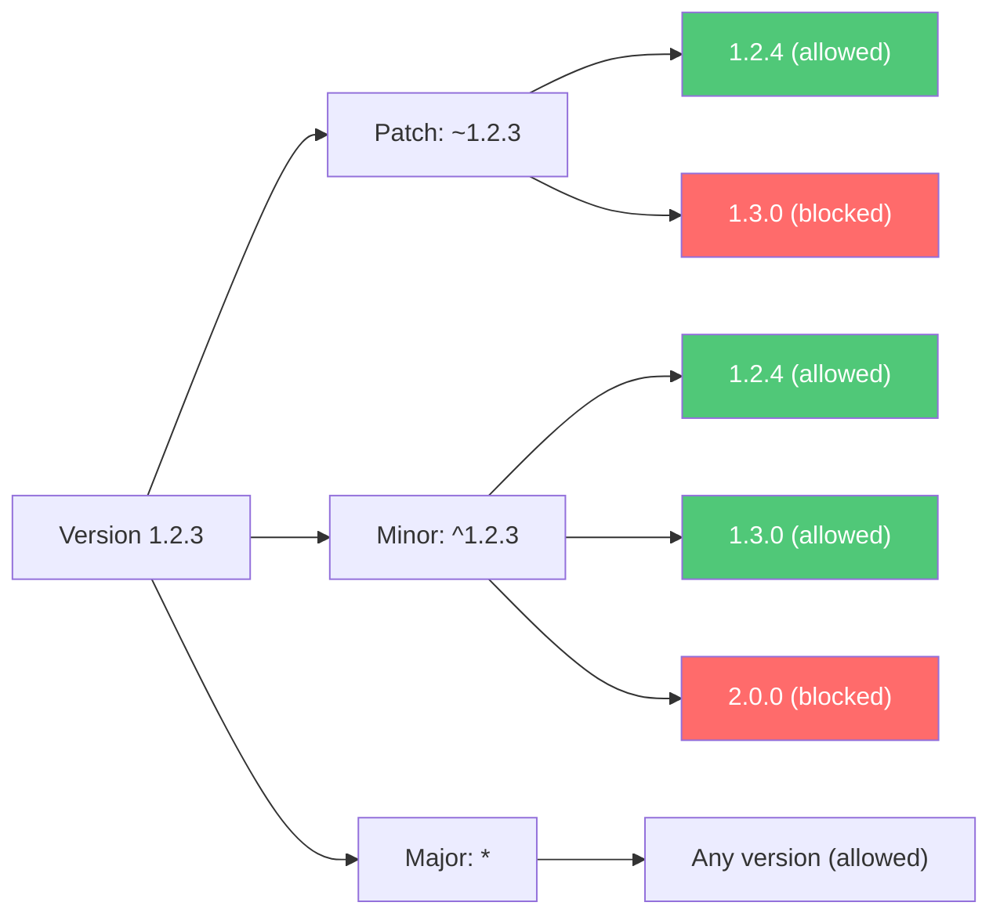
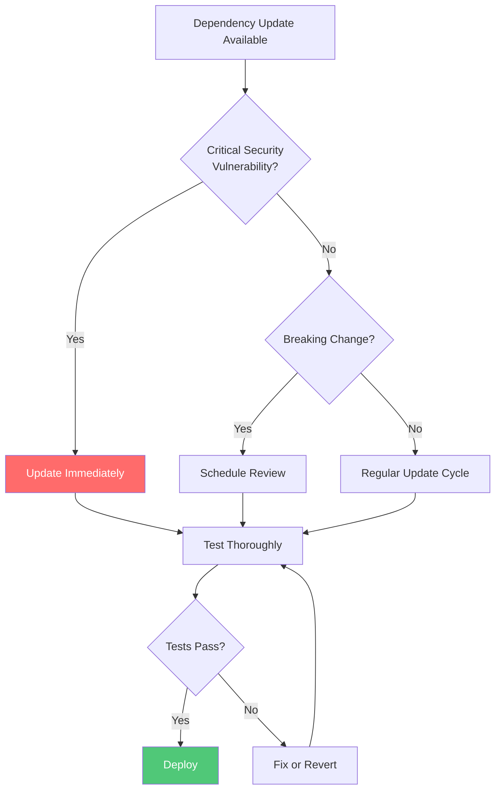
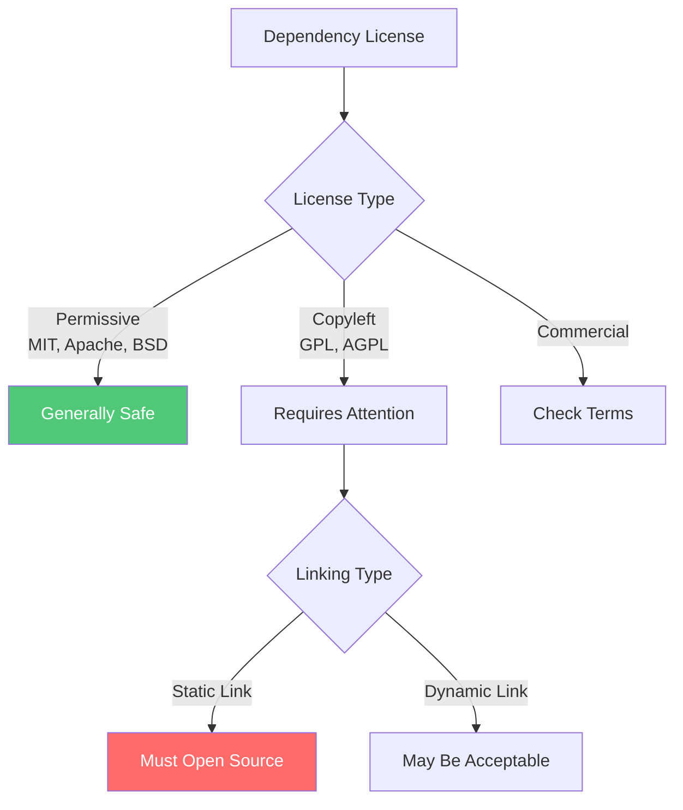
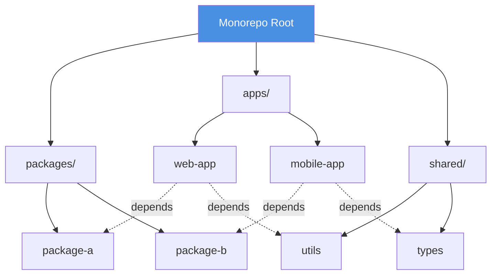
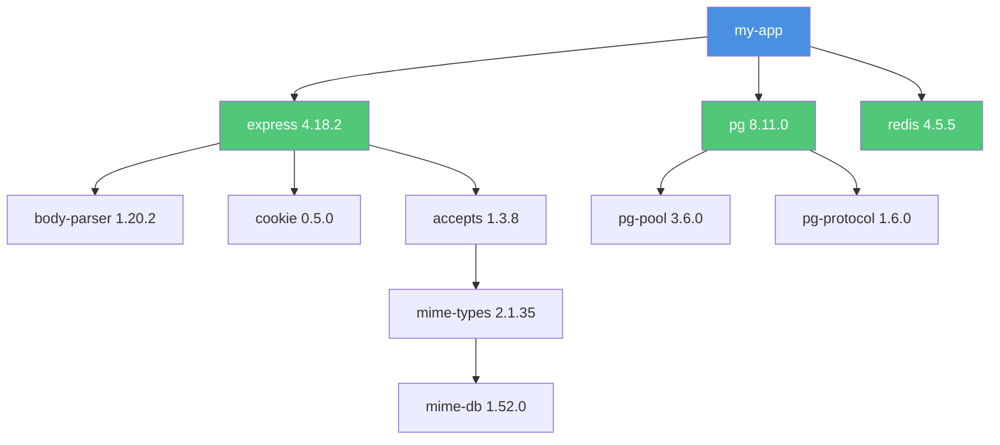

Dependency management is the process of handling external libraries, packages, and modules that your application relies
on. Effective dependency management ensures reproducible builds, minimizes security vulnerabilities, and reduces
maintenance burden. This chapter explores strategies, tools, and best practices for managing dependencies across
different ecosystems.

## Why Dependency Management Matters

Modern software rarely exists in isolation. Applications depend on external libraries for functionality ranging from
HTTP clients to database drivers to UI frameworks. Poor dependency management leads to:

- **Build failures**: "Works on my machine" problems
- **Security vulnerabilities**: Outdated dependencies with known exploits
- **Dependency hell**: Conflicting version requirements
- **Supply chain attacks**: Malicious packages
- **Technical debt**: Accumulation of outdated dependencies
- **Unpredictable behavior**: Non-deterministic builds



## Core Principles

### 1. Lock File Commitment

Always commit lock files to version control for reproducible builds.

**What are lock files?**

- Record exact versions of all dependencies (including transitives)
- Ensure everyone uses identical dependency versions
- Prevent unexpected updates from breaking builds

| Ecosystem       | Lock File                         |
| --------------- | --------------------------------- |
| Node.js (npm)   | `package-lock.json`               |
| Node.js (yarn)  | `yarn.lock`                       |
| Node.js (pnpm)  | `pnpm-lock.yaml`                  |
| Python (pip)    | `requirements.txt` + `pip freeze` |
| Python (poetry) | `poetry.lock`                     |
| Ruby (bundler)  | `Gemfile.lock`                    |
| PHP (composer)  | `composer.lock`                   |
| Rust (cargo)    | `Cargo.lock`                      |
| Go              | `go.sum`                          |
| Java (maven)    | `pom.xml` (with versions)         |
| .NET            | `packages.lock.json`              |

```bash
# Good: Install exact versions from lock file
npm ci

# Avoid in CI/CD: Updates lock file
npm install
```

### 2. Semantic Versioning

Understand and respect semantic versioning (SemVer) when declaring dependencies.

```
MAJOR.MINOR.PATCH
  │     │     │
  │     │     └─ Bug fixes (backward compatible)
  │     └─────── New features (backward compatible)
  └───────────── Breaking changes
```

**Version specifiers**:

```json
{
  "dependencies": {
    "exact": "1.2.3", // Exact version only
    "patch": "~1.2.3", // 1.2.x (patch updates only)
    "minor": "^1.2.3", // 1.x.x (minor and patch updates)
    "major": "*", // Any version (avoid!)
    "range": ">=1.2.0 <2.0.0", // Version range
    "latest": "latest" // Latest version (avoid!)
  }
}
```



**Best practices**:

```json
// Good: Predictable updates
{
  "dependencies": {
    "express": "^4.18.0",         // Allows 4.x updates
    "lodash": "~4.17.21",          // Allows 4.17.x updates
    "critical-lib": "2.5.1"        // Locked to specific version
  }
}

// Bad: Unpredictable updates
{
  "dependencies": {
    "express": "*",                // Any version - dangerous!
    "lodash": "latest",            // Non-deterministic
    "critical-lib": ">=2.0.0"      // Too permissive
  }
}
```

### 3. Minimize Dependencies

Each dependency adds complexity, security risk, and maintenance burden.

**Before adding a dependency, ask**:

- Can I implement this functionality simply myself?
- Is the dependency actively maintained?
- Does it have many transitive dependencies?
- What's the package size impact?
- Are there lighter alternatives?

```javascript
// Bad: Heavy dependency for simple task
const _ = require('lodash');
const names = _.map(users, 'name');

// Good: Native JavaScript
const names = users.map((user) => user.name);

// Bad: Entire library for one function
const moment = require('moment');
const formatted = moment().format('YYYY-MM-DD');

// Good: Native API or lighter alternative
const formatted = new Date().toISOString().split('T')[0];
// or use date-fns for specific functions
```

**Analyze bundle size**:

```bash
# Node.js - Check package size
npm install -g cost-of-modules
cost-of-modules

# Check what's in your bundle
npx webpack-bundle-analyzer dist/stats.json

# Check dependency tree
npm ls --depth=0
```

### 4. Regular Updates

Keep dependencies up-to-date to receive security patches and improvements.

**Update strategy**:



**Update commands**:

```bash
# Check outdated packages
npm outdated

# Update within SemVer range
npm update

# Interactive update tool
npx npm-check-updates -i

# Update to latest (careful!)
npx npm-check-updates -u
npm install

# Python
pip list --outdated
pip install --upgrade package-name

# Ruby
bundle outdated
bundle update

# Rust
cargo outdated
cargo update
```

## Security Best Practices

### 1. Vulnerability Scanning

Regularly scan for known vulnerabilities.

```bash
# npm audit
npm audit
npm audit fix              # Automatically fix vulnerabilities
npm audit fix --force      # Fix including breaking changes

# yarn audit
yarn audit
yarn audit --level moderate

# Snyk
npx snyk test
npx snyk monitor

# OWASP Dependency Check
dependency-check --project "MyApp" --scan .

# GitHub Dependabot (automated PRs for vulnerabilities)
# Enable in repository settings
```

**CI/CD integration**:

```yaml
# .github/workflows/security-scan.yml
name: Security Scan

on:
  push:
    branches: [main]
  pull_request:
    branches: [main]
  schedule:
    - cron: '0 0 * * 0' # Weekly scan

jobs:
  security:
    runs-on: ubuntu-latest
    steps:
      - uses: actions/checkout@v3

      - name: Run npm audit
        run: npm audit --audit-level=moderate

      - name: Run Snyk
        uses: snyk/actions/node@master
        env:
          SNYK_TOKEN: ${{ secrets.SNYK_TOKEN }}
        with:
          args: --severity-threshold=high

      - name: Run Trivy
        uses: aquasecurity/trivy-action@master
        with:
          scan-type: 'fs'
          scan-ref: '.'
          format: 'sarif'
          output: 'trivy-results.sarif'

      - name: Upload results
        uses: github/codeql-action/upload-sarif@v2
        with:
          sarif_file: 'trivy-results.sarif'
```

### 2. Supply Chain Security

Protect against malicious packages and compromised dependencies.

**Verification strategies**:

```bash
# Verify package integrity
npm install --ignore-scripts  # Prevent automatic script execution

# Check package signatures
npm audit signatures

# Use private registry for internal packages
npm config set registry https://registry.internal.company.com/
```

**Package vetting checklist**:

✅ **Check package age and downloads**: Established packages are generally safer ✅ **Review maintainer reputation**:
Known maintainers are more trustworthy ✅ **Inspect package contents**: Look for suspicious files or obfuscated code ✅
**Check for typosquatting**: Ensure correct package name spelling ✅ **Review recent activity**: Active maintenance
indicates ongoing security ✅ **Check license compatibility**: Ensure license matches your project requirements

```javascript
// Check package before installing
const package = 'suspicious-package';

// 1. View package info
// npm info suspicious-package

// 2. Check repository
// npm repo suspicious-package

// 3. Review package contents
// npm pack suspicious-package --dry-run
```

### 3. Dependency Pinning

Lock critical dependencies to specific versions.

```json
// package.json - Pin critical dependencies
{
  "dependencies": {
    "express": "4.18.2", // Exact version
    "critical-auth-lib": "2.5.1", // No automatic updates
    "utility-lib": "^1.2.0" // Allow minor updates
  },
  "overrides": {
    // Force specific version of transitive dependency
    "minimist": "1.2.6"
  }
}
```

```python
# requirements.txt - Pin Python dependencies
express==4.18.2        # Exact version
django>=4.0,<5.0       # Range
requests~=2.28.0       # Compatible release (2.28.x)
```

```ruby
# Gemfile - Pin Ruby dependencies
gem 'rails', '7.0.4'              # Exact version
gem 'pg', '~> 1.4.0'              # Pessimistic operator
gem 'sidekiq', '>= 7.0', '< 8.0' # Range
```

### 4. License Compliance

Ensure dependency licenses are compatible with your project.

```bash
# Check licenses
npx license-checker --summary

# Generate license report
npx license-checker --json --out licenses.json

# Check for incompatible licenses
npx license-checker --failOn 'GPL'
```

**Common license types**:

| License    | Commercial Use | Modification | Distribution | Copyleft |
| ---------- | -------------- | ------------ | ------------ | -------- |
| MIT        | ✅             | ✅           | ✅           | ❌       |
| Apache 2.0 | ✅             | ✅           | ✅           | ❌       |
| BSD        | ✅             | ✅           | ✅           | ❌       |
| GPL v3     | ✅             | ✅           | ✅           | ✅       |
| LGPL       | ✅             | ✅           | ✅           | Partial  |
| Commercial | Depends        | Depends      | Depends      | N/A      |



## Language-Specific Best Practices

### Node.js (npm/yarn/pnpm)

**Package.json configuration**:

```json
{
  "name": "my-app",
  "version": "1.0.0",
  "private": true,
  "engines": {
    "node": ">=18.0.0",
    "npm": ">=9.0.0"
  },
  "dependencies": {
    "express": "^4.18.2",
    "pg": "^8.11.0"
  },
  "devDependencies": {
    "eslint": "^8.43.0",
    "jest": "^29.5.0",
    "typescript": "^5.1.0"
  },
  "peerDependencies": {
    "react": "^18.0.0"
  },
  "optionalDependencies": {
    "fsevents": "^2.3.2"
  },
  "scripts": {
    "preinstall": "npx only-allow pnpm",
    "postinstall": "npm run build",
    "audit": "npm audit --audit-level=moderate",
    "update-check": "npx npm-check-updates"
  }
}
```

**.npmrc configuration**:

```ini
# .npmrc
save-exact=true           # Save exact versions
package-lock=true         # Ensure lock file is created
audit-level=moderate      # Set audit threshold
engine-strict=true        # Enforce engine requirements
legacy-peer-deps=false    # Strict peer dependency resolution
```

**Workspace monorepos**:

```json
// package.json (root)
{
  "name": "my-monorepo",
  "private": true,
  "workspaces": ["packages/*", "apps/*"],
  "scripts": {
    "install:all": "npm install",
    "build:all": "npm run build --workspaces",
    "test:all": "npm run test --workspaces"
  }
}
```

### Python (pip/poetry)

**Requirements files**:

```python
# requirements.txt - Production dependencies
Django==4.2.0
psycopg2-binary==2.9.6
celery==5.3.0
redis==4.5.5

# requirements-dev.txt - Development dependencies
-r requirements.txt      # Include production deps
pytest==7.3.1
black==23.3.0
flake8==6.0.0
mypy==1.3.0

# requirements-lock.txt - Frozen dependencies
# Generated with: pip freeze > requirements-lock.txt
```

**Poetry (recommended)**:

```toml
# pyproject.toml
[tool.poetry]
name = "my-app"
version = "1.0.0"
description = "My application"
python = "^3.11"

[tool.poetry.dependencies]
python = "^3.11"
django = "^4.2"
psycopg2-binary = "^2.9"
celery = "^5.3"

[tool.poetry.group.dev.dependencies]
pytest = "^7.3"
black = "^23.3"
flake8 = "^6.0"
mypy = "^1.3"

[tool.poetry.group.test.dependencies]
pytest-cov = "^4.1"
pytest-django = "^4.5"

[build-system]
requires = ["poetry-core>=1.0.0"]
build-backend = "poetry.core.masonry.api"
```

```bash
# Poetry commands
poetry install                 # Install from lock file
poetry add requests           # Add dependency
poetry add --group dev pytest # Add dev dependency
poetry update                 # Update dependencies
poetry show --outdated        # Check outdated packages
poetry export -f requirements.txt # Export to requirements.txt
```

**Virtual environments**:

```bash
# Create virtual environment
python -m venv venv

# Activate
source venv/bin/activate  # Linux/Mac
venv\Scripts\activate     # Windows

# Install dependencies
pip install -r requirements.txt

# Freeze current versions
pip freeze > requirements-lock.txt

# Deactivate
deactivate
```

### Java (Maven/Gradle)

**Maven pom.xml**:

```xml
<?xml version="1.0" encoding="UTF-8"?>
<project xmlns="http://maven.apache.org/POM/4.0.0">
    <modelVersion>4.0.0</modelVersion>

    <groupId>com.example</groupId>
    <artifactId>my-app</artifactId>
    <version>1.0.0</version>
    <packaging>jar</packaging>

    <properties>
        <java.version>17</java.version>
        <spring.version>3.1.0</spring.version>
        <maven.compiler.source>17</maven.compiler.source>
        <maven.compiler.target>17</maven.compiler.target>
    </properties>

    <dependencies>
        <!-- Production dependencies -->
        <dependency>
            <groupId>org.springframework.boot</groupId>
            <artifactId>spring-boot-starter-web</artifactId>
            <version>${spring.version}</version>
        </dependency>

        <!-- Test dependencies -->
        <dependency>
            <groupId>org.junit.jupiter</groupId>
            <artifactId>junit-jupiter</artifactId>
            <version>5.9.3</version>
            <scope>test</scope>
        </dependency>
    </dependencies>

    <dependencyManagement>
        <dependencies>
            <dependency>
                <groupId>org.springframework.boot</groupId>
                <artifactId>spring-boot-dependencies</artifactId>
                <version>${spring.version}</version>
                <type>pom</type>
                <scope>import</scope>
            </dependency>
        </dependencies>
    </dependencyManagement>

    <build>
        <plugins>
            <plugin>
                <groupId>org.owasp</groupId>
                <artifactId>dependency-check-maven</artifactId>
                <version>8.2.1</version>
                <executions>
                    <execution>
                        <goals>
                            <goal>check</goal>
                        </goals>
                    </execution>
                </executions>
            </plugin>
        </plugins>
    </build>
</project>
```

**Gradle build.gradle**:

```groovy
plugins {
    id 'java'
    id 'org.springframework.boot' version '3.1.0'
    id 'io.spring.dependency-management' version '1.1.0'
    id 'org.owasp.dependencycheck' version '8.2.1'
}

group = 'com.example'
version = '1.0.0'
sourceCompatibility = '17'

repositories {
    mavenCentral()
}

dependencies {
    // Production dependencies
    implementation 'org.springframework.boot:spring-boot-starter-web'
    implementation 'org.postgresql:postgresql:42.6.0'

    // Development dependencies
    developmentOnly 'org.springframework.boot:spring-boot-devtools'

    // Test dependencies
    testImplementation 'org.springframework.boot:spring-boot-starter-test'
    testImplementation 'org.junit.jupiter:junit-jupiter:5.9.3'
}

// Lock dependency versions
dependencyLocking {
    lockAllConfigurations()
}

tasks.named('test') {
    useJUnitPlatform()
}

dependencyCheck {
    failBuildOnCVSS = 7
    suppressionFile = 'dependency-check-suppressions.xml'
}
```

### Go

**go.mod**:

```go
module github.com/example/myapp

go 1.21

require (
    github.com/gin-gonic/gin v1.9.1
    github.com/lib/pq v1.10.9
    github.com/redis/go-redis/v9 v9.0.5
)

require (
    // Indirect dependencies
    github.com/bytedance/sonic v1.9.1 // indirect
    github.com/gabriel-vasile/mimetype v1.4.2 // indirect
    // ... more indirect dependencies
)
```

```bash
# Initialize module
go mod init github.com/example/myapp

# Add dependency
go get github.com/gin-gonic/gin@v1.9.1

# Update dependencies
go get -u ./...

# Tidy up dependencies
go mod tidy

# Verify dependencies
go mod verify

# Vendor dependencies
go mod vendor

# Check for updates
go list -u -m all
```

### Rust (Cargo)

**Cargo.toml**:

```toml
[package]
name = "my-app"
version = "1.0.0"
edition = "2021"
rust-version = "1.70"

[dependencies]
tokio = { version = "1.28", features = ["full"] }
serde = { version = "1.0", features = ["derive"] }
serde_json = "1.0"
reqwest = { version = "0.11", features = ["json"] }

[dev-dependencies]
mockito = "1.1"
criterion = "0.5"

[profile.release]
opt-level = 3
lto = true
codegen-units = 1
```

```bash
# Add dependency
cargo add tokio --features full

# Update dependencies
cargo update

# Check outdated packages
cargo outdated

# Security audit
cargo audit

# Build with lock file
cargo build --locked
```

## Monorepo Dependency Management

### Workspace Structure



### NPM Workspaces

```json
// Root package.json
{
  "name": "my-monorepo",
  "private": true,
  "workspaces": [
    "packages/*",
    "apps/*"
  ],
  "scripts": {
    "install:all": "npm install",
    "build:all": "npm run build -ws",
    "test:all": "npm run test -ws",
    "lint:all": "npm run lint -ws"
  },
  "devDependencies": {
    "eslint": "^8.43.0",
    "typescript": "^5.1.0"
  }
}

// packages/package-a/package.json
{
  "name": "@myorg/package-a",
  "version": "1.0.0",
  "dependencies": {
    "@myorg/utils": "workspace:*",  // Internal workspace dependency
    "lodash": "^4.17.21"
  }
}
```

### Lerna

```json
// lerna.json
{
  "version": "independent",
  "npmClient": "npm",
  "packages": ["packages/*", "apps/*"],
  "command": {
    "publish": {
      "conventionalCommits": true,
      "message": "chore(release): publish"
    },
    "version": {
      "allowBranch": "main",
      "message": "chore(release): version"
    }
  }
}
```

```bash
# Lerna commands
lerna bootstrap          # Install all dependencies
lerna run build         # Run build in all packages
lerna run test          # Run tests in all packages
lerna publish           # Publish changed packages
lerna version           # Version changed packages
lerna exec -- npm audit # Run command in all packages
```

### Nx

```json
// nx.json
{
  "extends": "@nx/workspace/presets/npm.json",
  "affected": {
    "defaultBase": "main"
  },
  "tasksRunnerOptions": {
    "default": {
      "runner": "nx/tasks-runners/default",
      "options": {
        "cacheableOperations": ["build", "test", "lint"],
        "parallel": 3
      }
    }
  },
  "targetDefaults": {
    "build": {
      "dependsOn": ["^build"]
    }
  }
}
```

```bash
# Nx commands
nx run-many -t build    # Build all projects
nx affected:build       # Build only affected projects
nx affected:test        # Test only affected projects
nx graph                # Visualize dependency graph
```

## Automated Dependency Management

### Dependabot

```yaml
# .github/dependabot.yml
version: 2
updates:
  - package-ecosystem: 'npm'
    directory: '/'
    schedule:
      interval: 'weekly'
      day: 'monday'
    open-pull-requests-limit: 10
    reviewers:
      - 'team-reviewers'
    assignees:
      - 'dependency-manager'
    labels:
      - 'dependencies'
      - 'automated'
    commit-message:
      prefix: 'chore'
      include: 'scope'
    ignore:
      - dependency-name: 'eslint'
        versions: ['8.x']
    groups:
      dev-dependencies:
        patterns:
          - '@types/*'
          - 'eslint*'
          - 'prettier'
        update-types:
          - 'minor'
          - 'patch'

  - package-ecosystem: 'docker'
    directory: '/'
    schedule:
      interval: 'weekly'

  - package-ecosystem: 'github-actions'
    directory: '/'
    schedule:
      interval: 'monthly'
```

### Renovate

```json
// renovate.json
{
  "extends": ["config:base"],
  "schedule": ["before 5am on monday"],
  "timezone": "America/New_York",
  "labels": ["dependencies"],
  "assignees": ["@dependency-team"],
  "prConcurrentLimit": 5,
  "prHourlyLimit": 2,
  "packageRules": [
    {
      "matchUpdateTypes": ["minor", "patch"],
      "groupName": "all non-major dependencies",
      "groupSlug": "all-minor-patch",
      "automerge": true
    },
    {
      "matchDepTypes": ["devDependencies"],
      "automerge": true
    },
    {
      "matchPackagePatterns": ["^@types/"],
      "automerge": true
    },
    {
      "matchPackageNames": ["react", "react-dom"],
      "groupName": "React",
      "reviewers": ["@frontend-team"]
    }
  ],
  "vulnerabilityAlerts": {
    "labels": ["security"],
    "assignees": ["@security-team"],
    "prPriority": 10
  }
}
```

## Dependency Analysis and Reporting

### Dependency Graphs

```bash
# Node.js - Generate dependency tree
npm ls
npm ls --depth=1
npm ls package-name

# Visualize dependencies
npx madge --image graph.png src/

# Python - Generate dependency tree
pip show package-name
pipdeptree

# Java Maven
mvn dependency:tree

# Go
go mod graph | graphviz
```



### Analyzing Package Size

```bash
# Bundle size analysis
npx webpack-bundle-analyzer dist/stats.json

# Check package size before install
npm view package-name dist.tarball
npm view package-name dist.unpackedSize

# Analyze installed packages
npx cost-of-modules
npx bundlephobia package-name

# Report
du -sh node_modules/*  | sort -h
```

### Dependency Reports

```javascript
// generate-dependency-report.js
const fs = require('fs');
const { execSync } = require('child_process');

function generateReport() {
  const report = {
    timestamp: new Date().toISOString(),
    dependencies: {},
    vulnerabilities: null,
    outdated: null,
  };

  // Get dependency list
  const depsOutput = execSync('npm ls --json --depth=0').toString();
  report.dependencies = JSON.parse(depsOutput);

  // Get vulnerability report
  try {
    const auditOutput = execSync('npm audit --json').toString();
    report.vulnerabilities = JSON.parse(auditOutput);
  } catch (error) {
    // npm audit returns non-zero exit code if vulnerabilities found
    report.vulnerabilities = JSON.parse(error.stdout.toString());
  }

  // Get outdated packages
  try {
    const outdatedOutput = execSync('npm outdated --json').toString();
    report.outdated = JSON.parse(outdatedOutput);
  } catch (error) {
    report.outdated = error.stdout ? JSON.parse(error.stdout.toString()) : {};
  }

  fs.writeFileSync('dependency-report.json', JSON.stringify(report, null, 2));
  console.log('Dependency report generated: dependency-report.json');
}

generateReport();
```

## Best Practices Summary

### Do's

✅ **Commit lock files** to ensure reproducible builds

✅ **Use semantic versioning** responsibly in version constraints

✅ **Regularly update dependencies** to receive security patches

✅ **Scan for vulnerabilities** in CI/CD pipeline

✅ **Pin critical dependencies** to specific versions

✅ **Minimize dependency count** to reduce maintenance burden

✅ **Review dependency licenses** for compliance

✅ **Use private registries** for internal packages

✅ **Automate dependency updates** with Dependabot or Renovate

✅ **Monitor dependency health** with tools like Snyk or Socket

### Don'ts

❌ **Don't use wildcard versions** (`*` or `latest`)

❌ **Don't commit node_modules** or other dependency directories

❌ **Don't ignore security warnings** from audit tools

❌ **Don't blindly update** without testing

❌ **Don't install unnecessary dependencies** for simple tasks

❌ **Don't use deprecated packages** without migration plan

❌ **Don't skip dependency review** before adding new packages

❌ **Don't allow automatic script execution** from untrusted sources

❌ **Don't store secrets** in package configuration

## Troubleshooting Common Issues

### Dependency Conflicts

```bash
# Problem: Peer dependency conflicts
npm ERR! ERESOLVE unable to resolve dependency tree

# Solution 1: Use --legacy-peer-deps
npm install --legacy-peer-deps

# Solution 2: Force resolution (npm 8.3+)
npm install --force

# Solution 3: Override in package.json
{
  "overrides": {
    "problematic-package": "specific-version"
  }
}
```

### Version Mismatches

```bash
# Problem: Different versions in different environments

# Solution: Always use lock files
npm ci  # Uses exact versions from lock file

# Verify lock file is committed
git status package-lock.json

# Rebuild lock file if needed
rm package-lock.json node_modules -rf
npm install
```

### Broken Builds

```bash
# Problem: "Works on my machine" issues

# Solution 1: Clean install
rm -rf node_modules package-lock.json
npm install

# Solution 2: Clear npm cache
npm cache clean --force

# Solution 3: Check Node version
node --version  # Should match engines in package.json

# Solution 4: Use exact Node version (nvm)
nvm use
```

## Conclusion

Effective dependency management is crucial for maintaining secure, reliable, and maintainable software. Key takeaways:

1. **Lock dependency versions** with lock files for reproducibility
2. **Understand semantic versioning** and use appropriate constraints
3. **Regularly update and audit** dependencies for security
4. **Minimize dependencies** to reduce complexity and risk
5. **Automate updates** with tools like Dependabot or Renovate
6. **Monitor supply chain security** to prevent malicious packages
7. **Document and enforce** dependency policies across teams

Start with basic practices like committing lock files and regular security scans, then gradually adopt more advanced
techniques like automated updates and monorepo management as your project grows.

## Related Chapters

- [Security Best Practices](/security-best-practices) - Securing your application and dependencies
- [CI/CD](/ci-cd) - Automating dependency checks in pipelines
- [Code Quality Metrics](/code-quality-metrics) - Measuring code health including dependencies
- [Technical Debt](/technical-debt) - Managing outdated dependencies as technical debt
- [Containerization](/containerization) - Packaging dependencies in containers
- [Development Environment Setup](/development-environment-setup) - Setting up local development environment

## References

- **npm Documentation**: [https://docs.npmjs.com/](https://docs.npmjs.com/)
- **Semantic Versioning**: [https://semver.org/](https://semver.org/)
- **OWASP Dependency Check**:
  [https://owasp.org/www-project-dependency-check/](https://owasp.org/www-project-dependency-check/)
- **Snyk**: [https://snyk.io/](https://snyk.io/)
- **Dependabot**:
  [https://docs.github.com/en/code-security/dependabot](https://docs.github.com/en/code-security/dependabot)
- **Renovate**: [https://docs.renovatebot.com/](https://docs.renovatebot.com/)
- **The Update Framework (TUF)**: [https://theupdateframework.io/](https://theupdateframework.io/)
