import DesignPatternImage from '/img/undraw_design_patterns.svg';

<div className="text--center margin-bottom--lg">
  <DesignPatternImage width="80%" height="300px" />
</div>

Software design patterns are reusable solutions to common software development problems. They provide proven solutions
to common problems encountered in software development and enable developers to create code that is more modular,
reusable, and maintainable.

In recent years, software design patterns have gained increased popularity due to their ability to make software
development more efficient and less error-prone. From simple design patterns that help with object creation to complex
patterns that enable communication between objects and classes, software design patterns have become essential tools for
software developers of all levels of experience.

:::tip Benefits of Design Patterns

Design patterns help you write better code by providing tested solutions that improve code organization,
maintainability, and communication among developers. They serve as a common vocabulary for discussing software design.

:::

There are three primary categories of design patterns: creational, structural, and behavioral.

## Pattern Categories Overview

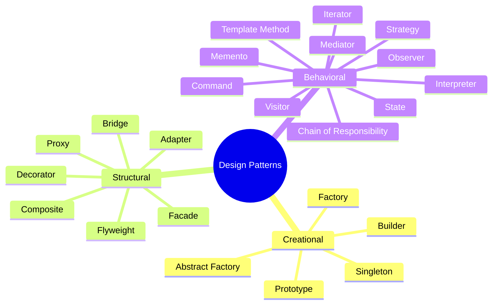

## When to Use Which Pattern

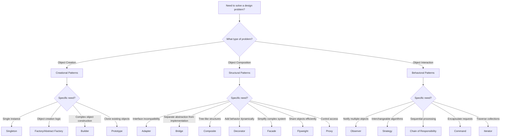

## Creational Patterns

Creational patterns deal with object creation mechanisms, attempting to create objects in a manner suitable to the
situation. Some examples of creational patterns are:

### Singleton

This pattern ensures that only one instance of a class is created and provides a global point of access to that
instance.

**Structure:**

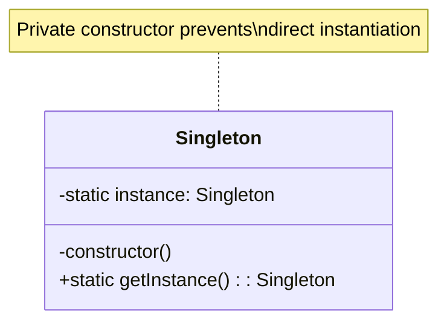

**Implementation:**

```javascript
class Singleton {
  constructor() {
    // Private constructor - prevent direct instantiation
    if (Singleton.instance) {
      throw new Error('Use Singleton.getInstance() instead');
    }
  }

  static getInstance() {
    if (!Singleton.instance) {
      Singleton.instance = new Singleton();
    }
    return Singleton.instance;
  }

  // Example business logic
  doSomething() {
    console.log('Singleton instance method called');
  }
}

// Usage
const instance1 = Singleton.getInstance();
const instance2 = Singleton.getInstance();
console.log(instance1 === instance2); // true - same instance
```

**Real-world Example: Database Connection Pool**

```javascript
class DatabaseConnection {
  constructor() {
    if (DatabaseConnection.instance) {
      return DatabaseConnection.instance;
    }
    this.connection = null;
    DatabaseConnection.instance = this;
  }

  connect(config) {
    if (!this.connection) {
      // Simulate database connection
      this.connection = {
        host: config.host,
        port: config.port,
        status: 'connected',
      };
      console.log(`Connected to ${config.host}:${config.port}`);
    }
    return this.connection;
  }

  query(sql) {
    if (!this.connection) {
      throw new Error('Not connected to database');
    }
    console.log(`Executing: ${sql}`);
    return { rows: [] };
  }

  static getInstance() {
    if (!DatabaseConnection.instance) {
      DatabaseConnection.instance = new DatabaseConnection();
    }
    return DatabaseConnection.instance;
  }
}

// Usage across application
const db1 = DatabaseConnection.getInstance();
db1.connect({ host: 'localhost', port: 5432 });

const db2 = DatabaseConnection.getInstance();
db2.query('SELECT * FROM users'); // Uses same connection
```

:::warning Use Singleton Sparingly

While Singleton can be useful, it's often overused and can make testing difficult. Consider dependency injection or
other patterns when possible. Singletons create hidden dependencies and global state.

:::

**When to Use:**

- Configuration managers
- Logging services
- Database connection pools
- Thread pools
- Cache managers

**When to Avoid:**

- When you need multiple instances in tests
- When the class has mutable state
- When it makes parallel testing difficult
- As a replacement for global variables

### Factory

This pattern provides an interface for creating objects in a superclass, but allows subclasses to alter the type of
objects that will be created.

**Structure:**

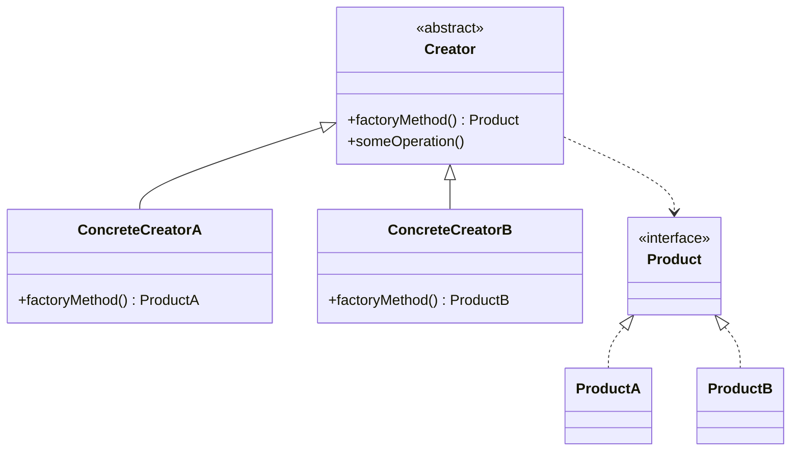

**Basic Implementation:**

```javascript
// Product classes
class Car {
  constructor() {
    this.type = 'car';
    this.wheels = 4;
  }

  drive() {
    console.log(`Driving a ${this.type} with ${this.wheels} wheels`);
  }
}

class Truck {
  constructor() {
    this.type = 'truck';
    this.wheels = 6;
    this.cargoCapacity = 1000;
  }

  drive() {
    console.log(`Driving a ${this.type} with ${this.wheels} wheels`);
  }
}

class Motorcycle {
  constructor() {
    this.type = 'motorcycle';
    this.wheels = 2;
  }

  drive() {
    console.log(`Riding a ${this.type} with ${this.wheels} wheels`);
  }
}

// Factory
class VehicleFactory {
  createVehicle(type) {
    switch (type) {
      case 'car':
        return new Car();
      case 'truck':
        return new Truck();
      case 'motorcycle':
        return new Motorcycle();
      default:
        throw new Error(`Unknown vehicle type: ${type}`);
    }
  }
}

// Usage
const factory = new VehicleFactory();
const car = factory.createVehicle('car');
const truck = factory.createVehicle('truck');

car.drive(); // "Driving a car with 4 wheels"
truck.drive(); // "Driving a truck with 6 wheels"
```

**Real-world Example: UI Component Factory**

```javascript
// Abstract product
class Button {
  render() {
    throw new Error('Method must be implemented');
  }
}

// Concrete products
class WindowsButton extends Button {
  render() {
    return '<button class="windows-btn">Click me</button>';
  }
}

class MacButton extends Button {
  render() {
    return '<button class="mac-btn">Click me</button>';
  }
}

class LinuxButton extends Button {
  render() {
    return '<button class="linux-btn">Click me</button>';
  }
}

// Factory
class UIFactory {
  constructor() {
    this.os = this.detectOS();
  }

  detectOS() {
    // Simplified OS detection
    const platform = navigator?.platform || 'Unknown';
    if (platform.includes('Win')) return 'windows';
    if (platform.includes('Mac')) return 'mac';
    return 'linux';
  }

  createButton() {
    switch (this.os) {
      case 'windows':
        return new WindowsButton();
      case 'mac':
        return new MacButton();
      case 'linux':
        return new LinuxButton();
      default:
        return new WindowsButton();
    }
  }
}

// Usage
const factory = new UIFactory();
const button = factory.createButton();
console.log(button.render()); // Renders OS-specific button
```

:::tip When to Use Factory Pattern

Use the Factory pattern when you don't know the exact types and dependencies of the objects your code should work with,
or when you want to provide a library of related objects without exposing their creation logic.

:::

**Benefits:**

- Decouples object creation from usage
- Makes code more maintainable and testable
- Follows Single Responsibility Principle
- Follows Open/Closed Principle

**When to Use:**

- When object creation logic is complex
- When you need to support different types of related objects
- When you want to centralize object creation
- When the exact type of object isn't known until runtime

### Abstract Factory

The Abstract Factory Pattern is used to create families of related objects without specifying their concrete classes. It
provides an interface for creating objects, but lets subclasses decide which classes to instantiate. This pattern is
useful when you need to create multiple objects that share a common interface or have related functionality.

**Structure:**

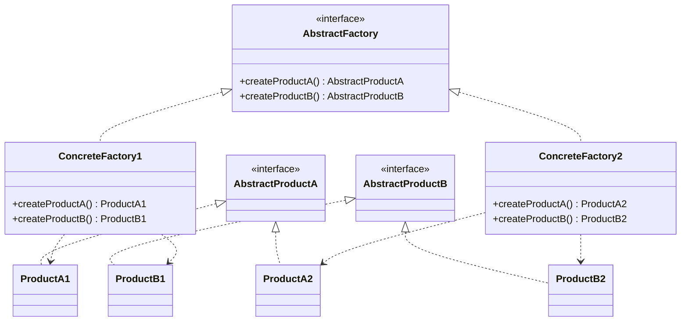

**Real-world Example: Cross-platform UI Kit**

```javascript
// Abstract products
class Button {
  render() {
    throw new Error('Must be implemented');
  }
}

class Checkbox {
  render() {
    throw new Error('Must be implemented');
  }
}

// Windows products
class WindowsButton extends Button {
  render() {
    return '<button class="win-button">Windows Button</button>';
  }
}

class WindowsCheckbox extends Checkbox {
  render() {
    return '<input type="checkbox" class="win-checkbox" />';
  }
}

// Mac products
class MacButton extends Button {
  render() {
    return '<button class="mac-button">Mac Button</button>';
  }
}

class MacCheckbox extends Checkbox {
  render() {
    return '<input type="checkbox" class="mac-checkbox" />';
  }
}

// Abstract factory
class UIFactory {
  createButton() {
    throw new Error('Must be implemented');
  }

  createCheckbox() {
    throw new Error('Must be implemented');
  }
}

// Concrete factories
class WindowsFactory extends UIFactory {
  createButton() {
    return new WindowsButton();
  }

  createCheckbox() {
    return new WindowsCheckbox();
  }
}

class MacFactory extends UIFactory {
  createButton() {
    return new MacButton();
  }

  createCheckbox() {
    return new MacCheckbox();
  }
}

// Client code
class Application {
  constructor(factory) {
    this.factory = factory;
  }

  createUI() {
    const button = this.factory.createButton();
    const checkbox = this.factory.createCheckbox();

    console.log(button.render());
    console.log(checkbox.render());
  }
}

// Usage
const os = 'windows'; // or 'mac'
const factory = os === 'windows' ? new WindowsFactory() : new MacFactory();
const app = new Application(factory);
app.createUI(); // Renders consistent UI components for the platform
```

:::info Abstract Factory vs Factory

Abstract Factory creates **families** of related objects, while Factory Method creates **one type** of object. Use
Abstract Factory when you need to ensure that created objects work well together.

:::

### Builder

The Builder Pattern is used to separate the construction of a complex object from its representation. It provides a way
to create different representations of the same object. This pattern is useful when you have an object with multiple
properties that need to be set in a specific order, or when you want to create an object from different sets of
parameters.

**Structure:**

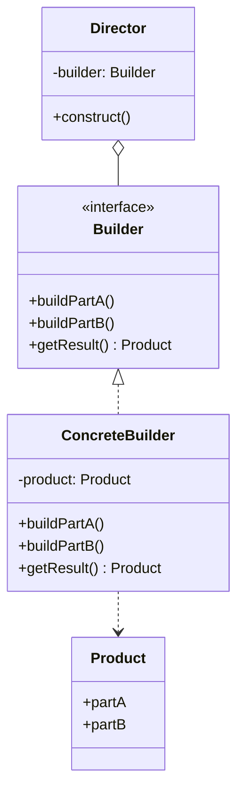

**Basic Example: HTML Page Builder**

Let's say we want to create an HTML page using the Builder Pattern. We have a Page class that has a title, a header, a
body, and a footer. We want to create different pages with different content, but we don't want to hardcode the content
into the Page class. Instead, we'll use a PageBuilder class to create the pages.

```javascript
class Page {
  constructor(title, header, body, footer) {
    this.title = title;
    this.header = header;
    this.body = body;
    this.footer = footer;
  }
}

class PageBuilder {
  setTitle(title) {
    this.title = title;
    return this;
  }

  setHeader(header) {
    this.header = header;
    return this;
  }

  setBody(body) {
    this.body = body;
    return this;
  }

  setFooter(footer) {
    this.footer = footer;
    return this;
  }

  build() {
    return new Page(this.title, this.header, this.body, this.footer);
  }
}

// Usage
const pageBuilder = new PageBuilder();
const page = pageBuilder
  .setTitle('My Page')
  .setHeader('Welcome to my page')
  .setBody('This is the body of my page')
  .setFooter('Copyright © 2023')
  .build();
```

In this example, we have a `Page` class that has a constructor that takes four arguments: `title`, `header`, `body`, and
`footer`. We then have a `PageBuilder` class that has four methods (`setTitle`, `setHeader`, `setBody`, and `setFooter`)
for setting the values of the `Page` class properties. We also have a build method that creates a new `Page` instance
with the values set by the builder methods. Finally, we can use the `PageBuilder` to create a new `Page` instance with
the desired content.

**Real-world Example: Query Builder**

```javascript
class Query {
  constructor(table, fields, conditions, orderBy, limit) {
    this.table = table;
    this.fields = fields;
    this.conditions = conditions;
    this.orderBy = orderBy;
    this.limit = limit;
  }

  toString() {
    let query = `SELECT ${this.fields.join(', ')} FROM ${this.table}`;

    if (this.conditions.length > 0) {
      query += ` WHERE ${this.conditions.join(' AND ')}`;
    }

    if (this.orderBy) {
      query += ` ORDER BY ${this.orderBy}`;
    }

    if (this.limit) {
      query += ` LIMIT ${this.limit}`;
    }

    return query;
  }
}

class QueryBuilder {
  constructor() {
    this.table = '';
    this.fields = ['*'];
    this.conditions = [];
    this.orderBy = null;
    this.limit = null;
  }

  from(table) {
    this.table = table;
    return this;
  }

  select(...fields) {
    this.fields = fields;
    return this;
  }

  where(condition) {
    this.conditions.push(condition);
    return this;
  }

  orderBy(field, direction = 'ASC') {
    this.orderBy = `${field} ${direction}`;
    return this;
  }

  limit(count) {
    this.limit = count;
    return this;
  }

  build() {
    if (!this.table) {
      throw new Error('Table name is required');
    }
    return new Query(this.table, this.fields, this.conditions, this.orderBy, this.limit);
  }
}

// Usage
const query = new QueryBuilder()
  .from('users')
  .select('id', 'name', 'email')
  .where('age > 18')
  .where('status = "active"')
  .orderBy('name', 'ASC')
  .limit(10)
  .build();

console.log(query.toString());
// Output: SELECT id, name, email FROM users WHERE age > 18 AND status = "active" ORDER BY name ASC LIMIT 10
```

:::tip Builder Pattern Benefits

The Builder pattern is especially useful when creating objects with many optional parameters. It makes the code more
readable than constructor telescoping and safer than using a configuration object.

:::

**When to Use:**

- Objects with many constructor parameters (especially optional ones)
- Step-by-step object construction
- Different representations of the same object
- Immutable objects that need complex initialization

### Prototype

The Prototype Pattern is used to create new objects based on an existing object. It provides a way to create new objects
without using the new operator. This pattern is useful when you have an object that is expensive to create, or when you
need to create multiple instances of the same object.

Let's say we have a game that has multiple enemies, each with its own set of properties (such as health, speed, and
attack power). Instead of creating a new enemy instance for each enemy, we can use the Prototype Pattern to clone an
existing enemy instance and modify its properties.

```javascript
class Enemy {
  constructor(health, speed, attackPower) {
    this.health = health;
    this.speed = speed;
    this.attackPower = attackPower;
  }

  clone() {
    return new Enemy(this.health, this.speed, this.attackPower);
  }
}

// Usage
const originalEnemy = new Enemy(100, 10, 20);
const clonedEnemy1 = originalEnemy.clone();
const clonedEnemy2 = originalEnemy.clone();

clonedEnemy1.health = 80;
clonedEnemy2.speed = 20;
```

In this example, we have an `Enemy` class that has a constructor that takes three arguments: `health`, `speed`, and
`attackPower`. We then have a `clone` method that creates a new `Enemy` instance with the same properties as the
original instance. Finally, we can use the `clone` method to create new enemy instances and modify their properties as
needed.

## Structural Patterns

Structural patterns deal with object composition, attempting to form large structures of objects. Examples of structural
patterns include:

### Adapter

This pattern converts the interface of a class into another interface that clients expect. It allows classes with
incompatible interfaces to work together. In JavaScript, the adapter pattern can be implemented like this:

```javascript
class OldSystem {
  oldMethod() {
    // Old implementation
  }
}

class Adapter {
  constructor(oldSystem) {
    this.oldSystem = oldSystem;
  }

  newMethod() {
    this.oldSystem.oldMethod();
  }
}

const oldSystem = new OldSystem();
const adapter = new Adapter(oldSystem);
adapter.newMethod(); // Calls the old method through the adapter
```

### Bridge

The Bridge Pattern is used to decouple an abstraction from its implementation so that both can vary independently. It
provides a way to create different implementations of an interface without changing the abstraction. This pattern is
useful when you need to separate an interface from its implementation, or when you want to have multiple implementations
of an interface.

Let's say we have a `Shape` class that has a `draw` method. We also have a `Renderer` interface that has a `render`
method. We want to create different shapes that can be rendered using different renderers. We can use the Bridge Pattern
to create a Shape abstraction and a `Renderer` implementation, and then combine them in different ways.

```javascript
class Shape {
  constructor(renderer) {
    this.renderer = renderer;
  }

  draw() {
    this.renderer.render();
  }
}

class Renderer {
  render() {}
}

class CircleRenderer extends Renderer {
  render() {
    console.log('Rendering a circle');
  }
}

class SquareRenderer extends Renderer {
  render() {
    console.log('Rendering a square');
  }
}

// Usage
const circle = new Shape(new CircleRenderer());
const square = new Shape(new SquareRenderer());

circle.draw(); // logs "Rendering a circle"
square.draw(); // logs "Rendering a square"
```

In this example, we have a `Shape` class that has a constructor that takes a `Renderer` instance. We also have a
`Renderer` interface that has a `render` method. We then have two `Renderer` implementations (`CircleRenderer` and
`SquareRenderer`) that each implement the `render` method in a different way. Finally, we can use the `Shape` class to
create different shapes (`circle` and `square`) that are rendered using different renderers.

### Composite

The Composite Pattern is used to treat a group of objects the same way as a single object. It provides a way to create a
tree-like structure of objects, where each object in the tree can be a composite or a leaf node. This pattern is useful
when you need to represent a hierarchy of objects, or when you want to treat a group of objects the same way as a single
object.

Let's say we have a `Menu` class that represents a menu item in a web application. Each menu item can have sub-items,
which can themselves have sub-items. We can use the Composite Pattern to create a tree-like structure of `Menu` objects,
where each `Menu` object can be a composite or a leaf node.

```javascript
class Menu {
  constructor(name, url) {
    this.name = name;
    this.url = url;
    this.children = [];
  }

  add(menuItem) {
    this.children.push(menuItem);
  }

  remove(menuItem) {
    this.children = this.children.filter((child) => child !== menuItem);
  }

  render() {
    console.log(`<a href="${this.url}">${this.name}</a>`);

    for (const child of this.children) {
      console.log('<ul>');
      child.render();
      console.log('</ul>');
    }
  }
}

// Usage
const mainMenu = new Menu('Main', '#');
const aboutMenu = new Menu('About', '#about');
const contactMenu = new Menu('Contact', '#contact');

mainMenu.add(aboutMenu);
mainMenu.add(contactMenu);

const teamMenu = new Menu('Team', '#team');
const historyMenu = new Menu('History', '#history');

aboutMenu.add(teamMenu);
aboutMenu.add(historyMenu);

mainMenu.render();
```

### Decorator

This pattern attaches additional responsibilities to an object dynamically. Decorators provide a flexible alternative to
subclassing for extending functionality. Here's an example in JavaScript:

```javascript
class BaseComponent {
  operation() {
    return 'BaseComponent';
  }
}

class Decorator extends BaseComponent {
  constructor(component) {
    super();
    this.component = component;
  }

  operation() {
    return `${this.component.operation()} + Decorator`;
  }
}

const baseComponent = new BaseComponent();
const decoratedComponent = new Decorator(baseComponent);
console.log(decoratedComponent.operation()); // Output: "BaseComponent + Decorator"
```

### Facade

The Facade Pattern provides a simplified interface to a complex system of classes, library, or framework. It hides the
complexity of the system and provides an easier interface to the client.

**Structure:**

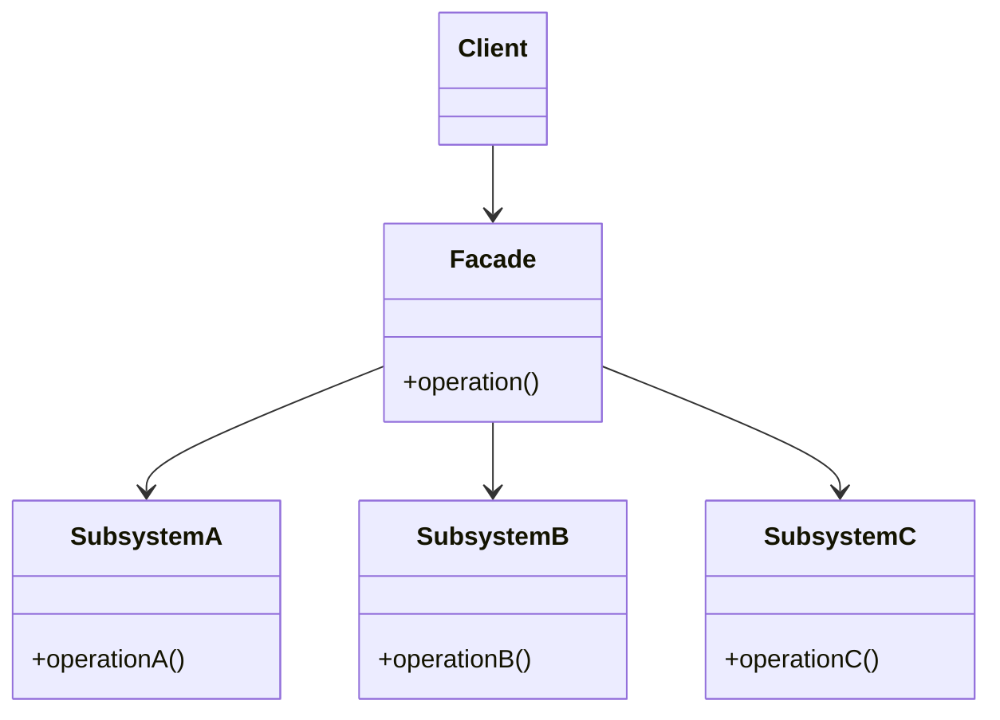

**Real-world Example: Home Theater System**

```javascript
// Complex subsystems
class DVDPlayer {
  on() {
    console.log('DVD Player is ON');
  }

  play(movie) {
    console.log(`Playing movie: ${movie}`);
  }

  off() {
    console.log('DVD Player is OFF');
  }
}

class Amplifier {
  on() {
    console.log('Amplifier is ON');
  }

  setVolume(level) {
    console.log(`Volume set to ${level}`);
  }

  off() {
    console.log('Amplifier is OFF');
  }
}

class Projector {
  on() {
    console.log('Projector is ON');
  }

  wideScreenMode() {
    console.log('Projector in widescreen mode');
  }

  off() {
    console.log('Projector is OFF');
  }
}

class Lights {
  dim(level) {
    console.log(`Lights dimmed to ${level}%`);
  }

  on() {
    console.log('Lights are ON');
  }
}

// Facade
class HomeTheaterFacade {
  constructor(dvd, amp, projector, lights) {
    this.dvd = dvd;
    this.amp = amp;
    this.projector = projector;
    this.lights = lights;
  }

  watchMovie(movie) {
    console.log('\nGet ready to watch a movie...');
    this.lights.dim(10);
    this.projector.on();
    this.projector.wideScreenMode();
    this.amp.on();
    this.amp.setVolume(50);
    this.dvd.on();
    this.dvd.play(movie);
  }

  endMovie() {
    console.log('\nShutting down movie theater...');
    this.dvd.off();
    this.amp.off();
    this.projector.off();
    this.lights.on();
  }
}

// Usage
const dvd = new DVDPlayer();
const amp = new Amplifier();
const projector = new Projector();
const lights = new Lights();

const homeTheater = new HomeTheaterFacade(dvd, amp, projector, lights);

homeTheater.watchMovie('Inception');
// ... movie ends ...
homeTheater.endMovie();
```

**API Facade Example:**

```javascript
// Complex API interactions
class UserAPI {
  getUser(id) {
    return fetch(`/api/users/${id}`).then((r) => r.json());
  }
}

class OrderAPI {
  getUserOrders(userId) {
    return fetch(`/api/orders?userId=${userId}`).then((r) => r.json());
  }
}

class AddressAPI {
  getUserAddress(userId) {
    return fetch(`/api/addresses?userId=${userId}`).then((r) => r.json());
  }
}

// Facade that simplifies the complex API calls
class UserProfileFacade {
  constructor() {
    this.userAPI = new UserAPI();
    this.orderAPI = new OrderAPI();
    this.addressAPI = new AddressAPI();
  }

  async getCompleteUserProfile(userId) {
    try {
      // Parallel fetch all data
      const [user, orders, address] = await Promise.all([
        this.userAPI.getUser(userId),
        this.orderAPI.getUserOrders(userId),
        this.addressAPI.getUserAddress(userId),
      ]);

      return {
        user,
        orders,
        address,
        totalOrders: orders.length,
        lastOrderDate: orders[0]?.date || null,
      };
    } catch (error) {
      console.error('Error fetching user profile:', error);
      throw error;
    }
  }
}

// Usage - Simple interface hiding complex operations
const profileFacade = new UserProfileFacade();
const profile = await profileFacade.getCompleteUserProfile(123);
console.log(profile);
```

:::tip When to Use Facade

Use the Facade pattern when you need to provide a simple interface to a complex subsystem, or when you want to layer
your system by creating facade entry points at each level.

:::

**Benefits:**

- Simplifies complex systems
- Reduces dependencies between client and subsystems
- Promotes loose coupling
- Makes the system easier to use and understand

**When to Use:**

- Working with complex libraries or APIs
- Need to provide a simplified interface
- Want to decouple client code from subsystem implementations
- Creating layers in your architecture

### Flyweight

The Flyweight Pattern is used to minimize memory usage by sharing data among multiple similar objects. It's particularly
useful when you need to create a large number of similar objects.

**Structure:**

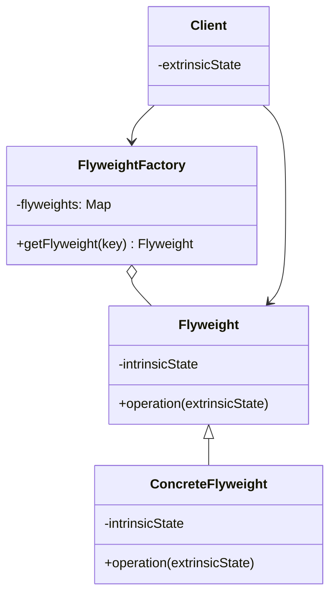

**Real-world Example: Text Editor Character Rendering**

```javascript
// Flyweight - shared character data
class Character {
  constructor(char, font, size) {
    this.char = char; // Intrinsic state - shared
    this.font = font; // Intrinsic state - shared
    this.size = size; // Intrinsic state - shared
  }

  display(position, color) {
    // Extrinsic state - unique per usage
    console.log(
      `Displaying '${this.char}' at (${position.x}, ${position.y}) ` + `in ${this.font} ${this.size}px, color: ${color}`
    );
  }
}

// Flyweight Factory
class CharacterFactory {
  constructor() {
    this.characters = new Map();
  }

  getCharacter(char, font, size) {
    const key = `${char}_${font}_${size}`;

    if (!this.characters.has(key)) {
      console.log(`Creating new character: ${key}`);
      this.characters.set(key, new Character(char, font, size));
    } else {
      console.log(`Reusing existing character: ${key}`);
    }

    return this.characters.get(key);
  }

  getTotalCharacters() {
    return this.characters.size;
  }
}

// Client code
class TextEditor {
  constructor() {
    this.factory = new CharacterFactory();
    this.characters = [];
  }

  insertCharacter(char, font, size, position, color) {
    const character = this.factory.getCharacter(char, font, size);
    this.characters.push({
      character,
      position,
      color,
    });
  }

  render() {
    this.characters.forEach(({ character, position, color }) => {
      character.display(position, color);
    });
  }
}

// Usage
const editor = new TextEditor();

// Type "Hello" - notice character reuse
editor.insertCharacter('H', 'Arial', 12, { x: 0, y: 0 }, 'black');
editor.insertCharacter('e', 'Arial', 12, { x: 10, y: 0 }, 'black');
editor.insertCharacter('l', 'Arial', 12, { x: 20, y: 0 }, 'black');
editor.insertCharacter('l', 'Arial', 12, { x: 30, y: 0 }, 'black'); // Reuses 'l'
editor.insertCharacter('o', 'Arial', 12, { x: 40, y: 0 }, 'black');

console.log(`Total unique characters: ${editor.factory.getTotalCharacters()}`);
// Output: 4 (H, e, l, o) instead of 5
```

**Game Example: Particle System**

```javascript
class ParticleType {
  constructor(texture, color) {
    this.texture = texture; // Heavy intrinsic data
    this.color = color;
  }

  render(x, y, velocity) {
    // Extrinsic state passed as parameters
    console.log(`Rendering ${this.color} particle with ${this.texture} at (${x}, ${y}) with velocity ${velocity}`);
  }
}

class ParticleFactory {
  constructor() {
    this.types = new Map();
  }

  getParticleType(texture, color) {
    const key = `${texture}_${color}`;

    if (!this.types.has(key)) {
      this.types.set(key, new ParticleType(texture, color));
    }

    return this.types.get(key);
  }
}

class Particle {
  constructor(x, y, velocity, type) {
    this.x = x;
    this.y = y;
    this.velocity = velocity;
    this.type = type; // Shared flyweight
  }

  render() {
    this.type.render(this.x, this.y, this.velocity);
  }
}

class ParticleSystem {
  constructor() {
    this.factory = new ParticleFactory();
    this.particles = [];
  }

  addParticle(x, y, velocity, texture, color) {
    const type = this.factory.getParticleType(texture, color);
    this.particles.push(new Particle(x, y, velocity, type));
  }

  render() {
    this.particles.forEach((particle) => particle.render());
  }
}

// Usage - create thousands of particles efficiently
const particleSystem = new ParticleSystem();

// Create 1000 fire particles - only creates ONE ParticleType object
for (let i = 0; i < 1000; i++) {
  particleSystem.addParticle(Math.random() * 100, Math.random() * 100, Math.random() * 10, 'spark.png', 'red');
}

console.log('Rendering particles...');
particleSystem.render();
```

:::info Memory Optimization

The Flyweight pattern can dramatically reduce memory usage. In the particle example, instead of storing texture and
color data 1000 times, we store it once and share it across all particles.

:::

**When to Use:**

- Application uses a large number of similar objects
- Storage costs are high because of object quantity
- Most object state can be made extrinsic
- Many groups of objects can be replaced by few shared objects

**Benefits:**

- Reduces memory footprint
- Improves performance when dealing with many objects
- Centralizes state management

### Proxy

The Proxy Pattern provides a surrogate or placeholder for another object to control access to it. It acts as an
intermediary that can add additional functionality before or after forwarding requests to the real object.

**Structure:**

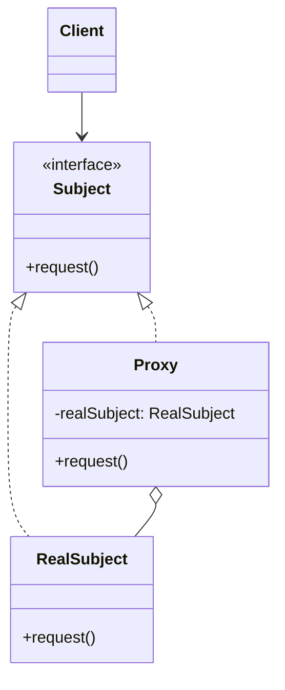

**Types of Proxies:**

1. **Virtual Proxy** - Delays expensive object creation until needed
2. **Protection Proxy** - Controls access based on permissions
3. **Remote Proxy** - Represents object in different address space
4. **Caching Proxy** - Caches results to avoid expensive operations

**Virtual Proxy Example: Lazy Loading Images**

```javascript
// Real subject - expensive to load
class RealImage {
  constructor(filename) {
    this.filename = filename;
    this.loadFromDisk();
  }

  loadFromDisk() {
    console.log(`Loading image: ${this.filename}`);
    // Simulate expensive operation
    this.data = `[Image data for ${this.filename}]`;
  }

  display() {
    console.log(`Displaying ${this.filename}`);
  }
}

// Proxy - delays loading until needed
class ImageProxy {
  constructor(filename) {
    this.filename = filename;
    this.realImage = null;
  }

  display() {
    // Lazy initialization
    if (!this.realImage) {
      this.realImage = new RealImage(this.filename);
    }
    this.realImage.display();
  }
}

// Usage
const images = [new ImageProxy('photo1.jpg'), new ImageProxy('photo2.jpg'), new ImageProxy('photo3.jpg')];

console.log('Images created (but not loaded yet)');

// Images are only loaded when displayed
images[0].display(); // Triggers loading
images[0].display(); // Uses already loaded image
```

**Protection Proxy Example: Access Control**

```javascript
// Real subject
class BankAccount {
  constructor(balance) {
    this.balance = balance;
  }

  deposit(amount) {
    this.balance += amount;
    console.log(`Deposited $${amount}. New balance: $${this.balance}`);
  }

  withdraw(amount) {
    if (amount <= this.balance) {
      this.balance -= amount;
      console.log(`Withdrew $${amount}. New balance: $${this.balance}`);
      return true;
    }
    console.log('Insufficient funds');
    return false;
  }

  getBalance() {
    return this.balance;
  }
}

// Protection proxy
class BankAccountProxy {
  constructor(balance, owner, currentUser) {
    this.account = new BankAccount(balance);
    this.owner = owner;
    this.currentUser = currentUser;
  }

  deposit(amount) {
    if (this.hasAccess()) {
      this.account.deposit(amount);
    } else {
      console.log('Access denied: You are not authorized to deposit');
    }
  }

  withdraw(amount) {
    if (this.hasAccess()) {
      this.account.withdraw(amount);
    } else {
      console.log('Access denied: You are not authorized to withdraw');
    }
  }

  getBalance() {
    if (this.hasAccess()) {
      return this.account.getBalance();
    } else {
      console.log('Access denied: You are not authorized to view balance');
      return null;
    }
  }

  hasAccess() {
    return this.currentUser === this.owner;
  }
}

// Usage
const myAccount = new BankAccountProxy(1000, 'Alice', 'Alice');
myAccount.deposit(500); // Works
myAccount.withdraw(200); // Works

const notMyAccount = new BankAccountProxy(1000, 'Bob', 'Alice');
notMyAccount.withdraw(100); // Access denied
```

**Caching Proxy Example: API Calls**

```javascript
// Real subject
class DataService {
  async fetchData(id) {
    console.log(`Fetching data from server for ID: ${id}`);
    // Simulate API call
    await new Promise((resolve) => setTimeout(resolve, 1000));
    return { id, data: `Data for ${id}`, timestamp: Date.now() };
  }
}

// Caching proxy
class CachedDataService {
  constructor() {
    this.service = new DataService();
    this.cache = new Map();
    this.cacheDuration = 5000; // 5 seconds
  }

  async fetchData(id) {
    const cached = this.cache.get(id);

    if (cached && Date.now() - cached.timestamp < this.cacheDuration) {
      console.log(`Returning cached data for ID: ${id}`);
      return cached.data;
    }

    console.log(`Cache miss or expired for ID: ${id}`);
    const data = await this.service.fetchData(id);
    this.cache.set(id, { data, timestamp: Date.now() });

    return data;
  }

  clearCache() {
    this.cache.clear();
    console.log('Cache cleared');
  }
}

// Usage
const dataService = new CachedDataService();

// First call - fetches from server
await dataService.fetchData(1);

// Second call - returns from cache
await dataService.fetchData(1);

// Wait for cache to expire, then fetch again
await new Promise((resolve) => setTimeout(resolve, 6000));
await dataService.fetchData(1); // Fetches from server again
```

**JavaScript Proxy Object Example:**

```javascript
// Modern JavaScript has built-in Proxy
const handler = {
  get(target, property) {
    console.log(`Getting property: ${property}`);
    return target[property];
  },

  set(target, property, value) {
    console.log(`Setting property: ${property} = ${value}`);

    // Validation
    if (property === 'age' && typeof value !== 'number') {
      throw new TypeError('Age must be a number');
    }

    target[property] = value;
    return true;
  },
};

const person = { name: 'Alice', age: 30 };
const proxyPerson = new Proxy(person, handler);

console.log(proxyPerson.name); // Logs: Getting property: name
proxyPerson.age = 31; // Logs: Setting property: age = 31

try {
  proxyPerson.age = 'thirty'; // Throws error
} catch (e) {
  console.error(e.message);
}
```

:::tip Proxy Use Cases

Proxies are excellent for adding cross-cutting concerns like logging, caching, lazy loading, access control, or
validation without modifying the original object.

:::

**When to Use:**

- Need to control access to an object
- Want to add functionality without changing the object
- Lazy initialization of expensive objects
- Implement access control or logging
- Cache expensive operations

**Benefits:**

- Controls access to the real object
- Can add functionality transparently
- Supports lazy initialization
- Provides a level of indirection

## Behavioral Patterns

Behavioral patterns deal with communication between objects, attempting to define how objects interact and distribute
responsibility. Some examples of behavioral patterns are:

### Observer

This pattern defines a one-to-many dependency between objects so that when one object changes state, all its dependents
are notified and updated automatically. In JavaScript, it can be implemented like this:

```javascript
class Subject {
  constructor() {
    this.observers = [];
  }

  addObserver(observer) {
    this.observers.push(observer);
  }

  removeObserver(observer) {
    const index = this.observers.indexOf(observer);
    if (index > -1) {
      this.observers.splice(index, 1);
    }
  }

  notify(data) {
    this.observers.forEach((observer) => observer.update(data));
  }
}

class Observer {
  update(data) {
    console.log(`Received data: ${data}`);
  }
}

const subject = new Subject();
const observer1 = new Observer();
const observer2 = new Observer();

subject.addObserver(observer1);
subject.addObserver(observer2);

subject.notify('Some data'); // Output: "Received data: Some data" for both observers
```

### Strategy

This pattern defines a family of algorithms, encapsulates each one, and makes them interchangeable. It allows the
algorithm to vary independently from the clients that use it. Here's an example in JavaScript:

```javascript
class Context {
  constructor(strategy) {
    this.strategy = strategy;
  }

  setStrategy(strategy) {
    this.strategy = strategy;
  }

  executeStrategy(data) {
    return this.strategy.execute(data);
  }
}

class ConcreteStrategyA {
  execute(data) {
    return `ConcreteStrategyA: ${data}`;
  }
}

class ConcreteStrategyB {
  execute(data) {
    return `ConcreteStrategyB: ${data}`;
  }
}

const context = new Context(new ConcreteStrategyA());
console.log(context.executeStrategy('test')); // Output: "ConcreteStrategyA: test"

context.setStrategy(new ConcreteStrategyB());
console.log(context.executeStrategy('test')); // Output: "ConcreteStrategyB: test"
```

### Chain of Responsibility

The Chain of Responsibility Pattern passes a request along a chain of handlers. Each handler decides either to process
the request or to pass it to the next handler in the chain.

**Structure:**

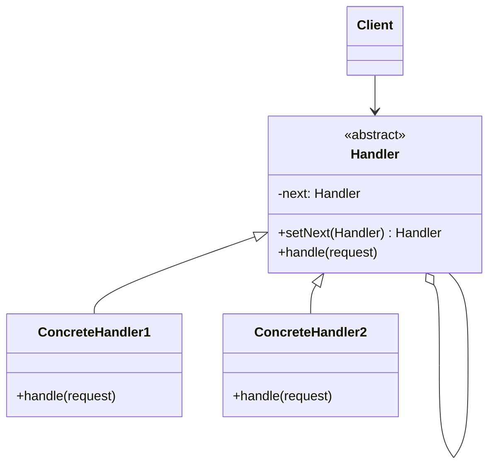

**Real-world Example: Support Ticket System**

```javascript
// Abstract handler
class SupportHandler {
  constructor() {
    this.nextHandler = null;
  }

  setNext(handler) {
    this.nextHandler = handler;
    return handler; // Allow chaining
  }

  handle(ticket) {
    if (this.nextHandler) {
      return this.nextHandler.handle(ticket);
    }
    return `No handler found for priority: ${ticket.priority}`;
  }
}

// Concrete handlers
class Level1Support extends SupportHandler {
  handle(ticket) {
    if (ticket.priority === 'low') {
      return `Level 1 Support: Resolved ticket "${ticket.issue}"`;
    }
    console.log('Level 1: Escalating to Level 2');
    return super.handle(ticket);
  }
}

class Level2Support extends SupportHandler {
  handle(ticket) {
    if (ticket.priority === 'medium') {
      return `Level 2 Support: Resolved ticket "${ticket.issue}"`;
    }
    console.log('Level 2: Escalating to Level 3');
    return super.handle(ticket);
  }
}

class Level3Support extends SupportHandler {
  handle(ticket) {
    if (ticket.priority === 'high' || ticket.priority === 'critical') {
      return `Level 3 Support: Resolved critical ticket "${ticket.issue}"`;
    }
    return super.handle(ticket);
  }
}

// Usage
const level1 = new Level1Support();
const level2 = new Level2Support();
const level3 = new Level3Support();

// Build the chain
level1.setNext(level2).setNext(level3);

// Test tickets
const tickets = [
  { issue: 'Password reset', priority: 'low' },
  { issue: 'Software bug', priority: 'medium' },
  { issue: 'Server down', priority: 'critical' },
];

tickets.forEach((ticket) => {
  console.log(level1.handle(ticket));
  console.log('---');
});
```

**Middleware Pipeline Example:**

```javascript
class Middleware {
  constructor() {
    this.nextMiddleware = null;
  }

  use(middleware) {
    this.nextMiddleware = middleware;
    return middleware;
  }

  async execute(request, response) {
    if (this.nextMiddleware) {
      return this.nextMiddleware.execute(request, response);
    }
  }
}

class AuthMiddleware extends Middleware {
  async execute(request, response) {
    console.log('AuthMiddleware: Checking authentication');

    if (!request.headers.authorization) {
      response.status = 401;
      response.body = 'Unauthorized';
      return response;
    }

    request.user = { id: 1, name: 'Alice' }; // Simulate auth
    return super.execute(request, response);
  }
}

class LoggingMiddleware extends Middleware {
  async execute(request, response) {
    console.log(`LoggingMiddleware: ${request.method} ${request.url}`);
    return super.execute(request, response);
  }
}

class ValidationMiddleware extends Middleware {
  async execute(request, response) {
    console.log('ValidationMiddleware: Validating request');

    if (!request.body || Object.keys(request.body).length === 0) {
      response.status = 400;
      response.body = 'Bad Request: Empty body';
      return response;
    }

    return super.execute(request, response);
  }
}

class ControllerMiddleware extends Middleware {
  async execute(request, response) {
    console.log('ControllerMiddleware: Processing request');
    response.status = 200;
    response.body = { message: 'Success', user: request.user };
    return response;
  }
}

// Usage
const auth = new AuthMiddleware();
const logging = new LoggingMiddleware();
const validation = new ValidationMiddleware();
const controller = new ControllerMiddleware();

// Build chain
auth.use(logging).use(validation).use(controller);

// Process request
const request = {
  method: 'POST',
  url: '/api/users',
  headers: { authorization: 'Bearer token123' },
  body: { name: 'Bob' },
};

const response = { status: null, body: null };
const result = await auth.execute(request, response);
console.log('Final Response:', result);
```

:::tip Chain of Responsibility Benefits

This pattern decouples senders and receivers, and allows multiple objects a chance to handle the request. It's commonly
used in middleware systems, event handling, and logging frameworks.

:::

**When to Use:**

- Multiple objects may handle a request
- Handler isn't known in advance
- Handlers should be assigned dynamically
- Want to issue requests to several objects without specifying receivers explicitly

### Command

The Command Pattern encapsulates a request as an object, thereby letting you parameterize clients with different
requests, queue or log requests, and support undoable operations.

**Structure:**

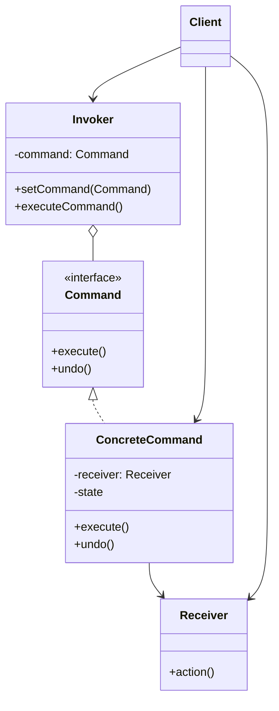

**Real-world Example: Text Editor with Undo/Redo**

```javascript
// Receiver
class TextEditor {
  constructor() {
    this.content = '';
  }

  write(text) {
    this.content += text;
  }

  delete(length) {
    this.content = this.content.slice(0, -length);
  }

  getContent() {
    return this.content;
  }
}

// Command interface
class Command {
  execute() {
    throw new Error('execute() must be implemented');
  }

  undo() {
    throw new Error('undo() must be implemented');
  }
}

// Concrete commands
class WriteCommand extends Command {
  constructor(editor, text) {
    super();
    this.editor = editor;
    this.text = text;
  }

  execute() {
    this.editor.write(this.text);
  }

  undo() {
    this.editor.delete(this.text.length);
  }
}

class DeleteCommand extends Command {
  constructor(editor, length) {
    super();
    this.editor = editor;
    this.length = length;
    this.deletedText = '';
  }

  execute() {
    const content = this.editor.getContent();
    this.deletedText = content.slice(-this.length);
    this.editor.delete(this.length);
  }

  undo() {
    this.editor.write(this.deletedText);
  }
}

// Invoker
class EditorInvoker {
  constructor() {
    this.history = [];
    this.currentPosition = -1;
  }

  execute(command) {
    // Remove any commands after current position (for redo)
    this.history = this.history.slice(0, this.currentPosition + 1);

    command.execute();
    this.history.push(command);
    this.currentPosition++;
  }

  undo() {
    if (this.currentPosition >= 0) {
      const command = this.history[this.currentPosition];
      command.undo();
      this.currentPosition--;
      return true;
    }
    return false;
  }

  redo() {
    if (this.currentPosition < this.history.length - 1) {
      this.currentPosition++;
      const command = this.history[this.currentPosition];
      command.execute();
      return true;
    }
    return false;
  }
}

// Usage
const editor = new TextEditor();
const invoker = new EditorInvoker();

// Type "Hello"
invoker.execute(new WriteCommand(editor, 'Hello'));
console.log(editor.getContent()); // "Hello"

// Type " World"
invoker.execute(new WriteCommand(editor, ' World'));
console.log(editor.getContent()); // "Hello World"

// Delete 6 characters
invoker.execute(new DeleteCommand(editor, 6));
console.log(editor.getContent()); // "Hello"

// Undo delete
invoker.undo();
console.log(editor.getContent()); // "Hello World"

// Undo write
invoker.undo();
console.log(editor.getContent()); // "Hello"

// Redo write
invoker.redo();
console.log(editor.getContent()); // "Hello World"
```

**Smart Home Remote Control Example:**

```javascript
// Receivers
class Light {
  turnOn() {
    console.log('Light is ON');
  }

  turnOff() {
    console.log('Light is OFF');
  }
}

class Thermostat {
  setTemperature(temp) {
    console.log(`Temperature set to ${temp}°C`);
  }
}

// Commands
class LightOnCommand extends Command {
  constructor(light) {
    super();
    this.light = light;
  }

  execute() {
    this.light.turnOn();
  }

  undo() {
    this.light.turnOff();
  }
}

class LightOffCommand extends Command {
  constructor(light) {
    super();
    this.light = light;
  }

  execute() {
    this.light.turnOff();
  }

  undo() {
    this.light.turnOn();
  }
}

class SetTemperatureCommand extends Command {
  constructor(thermostat, temperature) {
    super();
    this.thermostat = thermostat;
    this.temperature = temperature;
    this.previousTemperature = 20; // Default
  }

  execute() {
    this.thermostat.setTemperature(this.temperature);
  }

  undo() {
    this.thermostat.setTemperature(this.previousTemperature);
  }
}

// Macro command - execute multiple commands
class MacroCommand extends Command {
  constructor(commands) {
    super();
    this.commands = commands;
  }

  execute() {
    this.commands.forEach((cmd) => cmd.execute());
  }

  undo() {
    // Undo in reverse order
    for (let i = this.commands.length - 1; i >= 0; i--) {
      this.commands[i].undo();
    }
  }
}

// Usage
const light = new Light();
const thermostat = new Thermostat();

const lightOn = new LightOnCommand(light);
const setTemp = new SetTemperatureCommand(thermostat, 22);

// Create "Good Night" macro - turn off lights and lower temperature
const goodNightMacro = new MacroCommand([new LightOffCommand(light), new SetTemperatureCommand(thermostat, 18)]);

const invoker2 = new EditorInvoker();

// Execute individual commands
invoker2.execute(lightOn);
invoker2.execute(setTemp);

// Execute macro command
invoker2.execute(goodNightMacro);

// Undo all at once
invoker2.undo();
```

:::tip Command Pattern Use Cases

The Command pattern is perfect for implementing undo/redo functionality, macro recording, queuing operations, logging
changes, and implementing transactional behavior.

:::

**When to Use:**

- Need to parameterize objects with operations
- Need to queue operations, schedule execution, or execute remotely
- Need to support undo/redo operations
- Need to log changes for auditing or crash recovery
- Need to structure a system around high-level operations built on primitive operations

### Interpreter

- TODO

### Iterator

The Iterator Pattern provides a way to access elements of a collection sequentially without exposing its underlying
representation.

**Structure:**

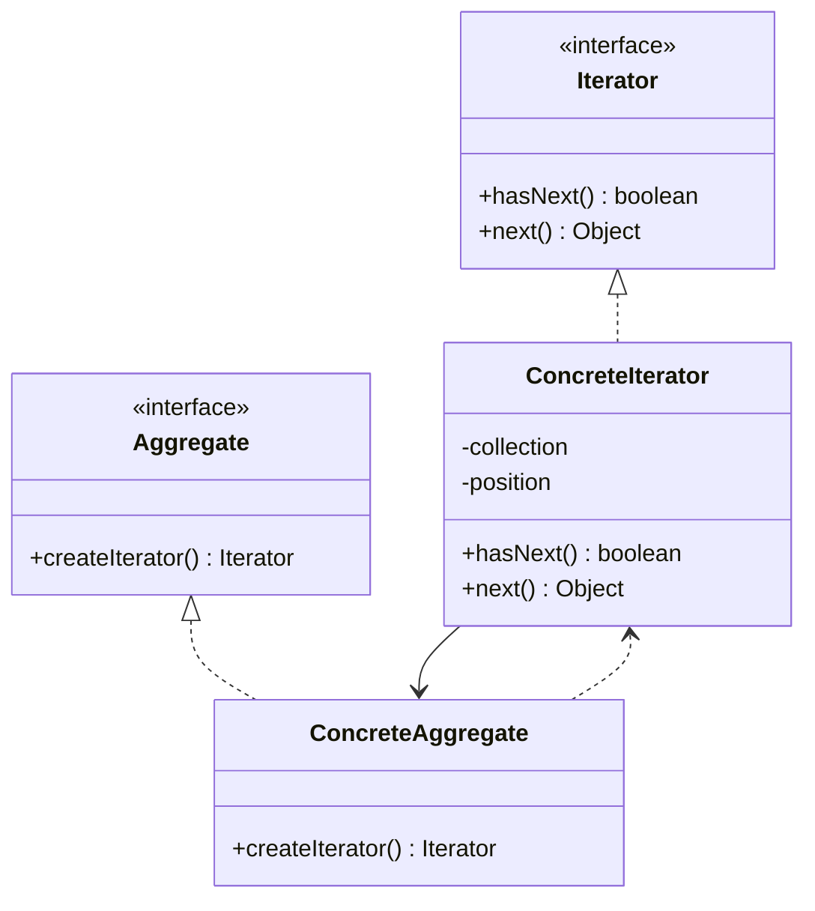

**Real-world Example: Custom Collection**

```javascript
// Iterator interface
class Iterator {
  hasNext() {
    throw new Error('hasNext() must be implemented');
  }

  next() {
    throw new Error('next() must be implemented');
  }
}

// Concrete iterator
class BookIterator extends Iterator {
  constructor(books) {
    super();
    this.books = books;
    this.position = 0;
  }

  hasNext() {
    return this.position < this.books.length;
  }

  next() {
    if (this.hasNext()) {
      return this.books[this.position++];
    }
    return null;
  }

  reset() {
    this.position = 0;
  }
}

// Reverse iterator
class ReverseBookIterator extends Iterator {
  constructor(books) {
    super();
    this.books = books;
    this.position = books.length - 1;
  }

  hasNext() {
    return this.position >= 0;
  }

  next() {
    if (this.hasNext()) {
      return this.books[this.position--];
    }
    return null;
  }
}

// Collection
class BookCollection {
  constructor() {
    this.books = [];
  }

  addBook(book) {
    this.books.push(book);
  }

  createIterator() {
    return new BookIterator(this.books);
  }

  createReverseIterator() {
    return new ReverseBookIterator(this.books);
  }
}

// Usage
const collection = new BookCollection();
collection.addBook({ title: '1984', author: 'George Orwell' });
collection.addBook({ title: 'Brave New World', author: 'Aldous Huxley' });
collection.addBook({ title: 'Fahrenheit 451', author: 'Ray Bradbury' });

// Forward iteration
const iterator = collection.createIterator();
console.log('Forward iteration:');
while (iterator.hasNext()) {
  const book = iterator.next();
  console.log(`${book.title} by ${book.author}`);
}

// Reverse iteration
const reverseIterator = collection.createReverseIterator();
console.log('\nReverse iteration:');
while (reverseIterator.hasNext()) {
  const book = reverseIterator.next();
  console.log(`${book.title} by ${book.author}`);
}
```

**JavaScript Built-in Iterator Example:**

```javascript
// JavaScript has built-in iterator protocol
class Range {
  constructor(start, end, step = 1) {
    this.start = start;
    this.end = end;
    this.step = step;
  }

  // Implement iterable protocol
  [Symbol.iterator]() {
    let current = this.start;
    const end = this.end;
    const step = this.step;

    return {
      next() {
        if (current <= end) {
          const value = current;
          current += step;
          return { value, done: false };
        }
        return { done: true };
      },
    };
  }
}

// Usage with for...of
const range = new Range(1, 10, 2);

for (const num of range) {
  console.log(num); // 1, 3, 5, 7, 9
}

// Can also spread
console.log([...range]); // [1, 3, 5, 7, 9]
```

**Tree Iterator Example:**

```javascript
class TreeNode {
  constructor(value) {
    this.value = value;
    this.children = [];
  }

  addChild(node) {
    this.children.push(node);
  }

  // Depth-first iterator
  *[Symbol.iterator]() {
    yield this.value;

    for (const child of this.children) {
      yield* child;
    }
  }

  // Breadth-first iterator
  *breadthFirst() {
    const queue = [this];

    while (queue.length > 0) {
      const node = queue.shift();
      yield node.value;
      queue.push(...node.children);
    }
  }
}

// Build tree
const root = new TreeNode(1);
const child1 = new TreeNode(2);
const child2 = new TreeNode(3);
const child3 = new TreeNode(4);

root.addChild(child1);
root.addChild(child2);
child1.addChild(child3);

// Depth-first traversal
console.log('Depth-first:', [...root]); // [1, 2, 4, 3]

// Breadth-first traversal
console.log('Breadth-first:', [...root.breadthFirst()]); // [1, 2, 3, 4]
```

**Paginated Data Iterator:**

```javascript
class PaginatedIterator {
  constructor(fetchPage, pageSize = 10) {
    this.fetchPage = fetchPage;
    this.pageSize = pageSize;
    this.currentPage = 0;
    this.currentIndex = 0;
    this.items = [];
    this.hasMore = true;
  }

  async next() {
    // If we've consumed all items in current page, fetch next
    if (this.currentIndex >= this.items.length && this.hasMore) {
      this.items = await this.fetchPage(this.currentPage, this.pageSize);
      this.currentPage++;
      this.currentIndex = 0;

      if (this.items.length === 0) {
        this.hasMore = false;
        return { done: true };
      }
    }

    if (this.currentIndex < this.items.length) {
      const value = this.items[this.currentIndex++];
      return { value, done: false };
    }

    return { done: true };
  }

  [Symbol.asyncIterator]() {
    return this;
  }
}

// Usage
async function fetchUsers(page, pageSize) {
  // Simulate API call
  console.log(`Fetching page ${page}`);
  const start = page * pageSize;
  const end = start + pageSize;

  // Simulate database with 25 users
  if (start >= 25) return [];

  return Array.from({ length: Math.min(pageSize, 25 - start) }, (_, i) => ({
    id: start + i,
    name: `User ${start + i}`,
  }));
}

const iterator = new PaginatedIterator(fetchUsers, 10);

// Use with for await...of
(async () => {
  for await (const user of iterator) {
    console.log(user);
  }
})();
```

:::info Modern JavaScript Iterators

JavaScript has built-in iterator support via the `Symbol.iterator` protocol. Use generators (`function*`) for easier
iterator implementation and `for...of` loops for consumption.

:::

**When to Use:**

- Need to traverse a collection without exposing its internal structure
- Support multiple simultaneous traversals
- Provide a uniform interface for traversing different collection types
- Need complex traversal algorithms (depth-first, breadth-first, filtered, etc.)

### Mediator

- TODO

### Memento

- TODO

### State

The State Pattern allows an object to alter its behavior when its internal state changes. The object will appear to
change its class.

**Structure:**

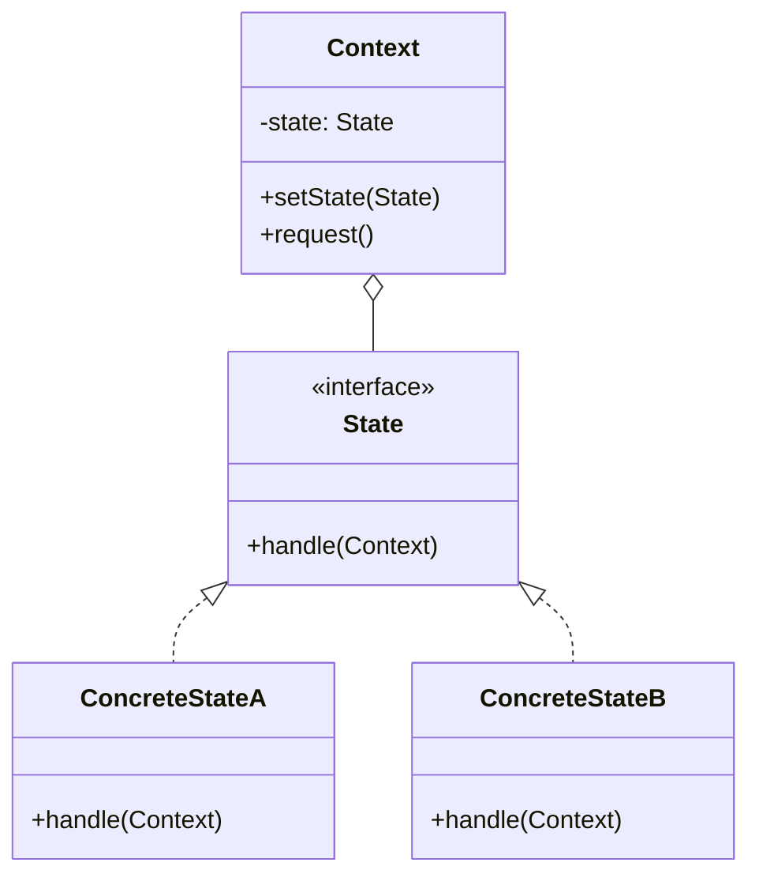

**Real-world Example: Order Processing**

```javascript
// State interface
class OrderState {
  constructor(order) {
    this.order = order;
  }

  cancel() {
    throw new Error('cancel() must be implemented');
  }

  ship() {
    throw new Error('ship() must be implemented');
  }

  deliver() {
    throw new Error('deliver() must be implemented');
  }
}

// Concrete states
class PendingState extends OrderState {
  constructor(order) {
    super(order);
    console.log('Order is pending');
  }

  cancel() {
    console.log('Cancelling pending order');
    this.order.setState(new CancelledState(this.order));
  }

  ship() {
    console.log('Shipping order');
    this.order.setState(new ShippedState(this.order));
  }

  deliver() {
    console.log('Cannot deliver - order not shipped yet');
  }
}

class ShippedState extends OrderState {
  constructor(order) {
    super(order);
    console.log('Order has been shipped');
  }

  cancel() {
    console.log('Cannot cancel - order already shipped');
  }

  ship() {
    console.log('Order already shipped');
  }

  deliver() {
    console.log('Delivering order');
    this.order.setState(new DeliveredState(this.order));
  }
}

class DeliveredState extends OrderState {
  constructor(order) {
    super(order);
    console.log('Order has been delivered');
  }

  cancel() {
    console.log('Cannot cancel - order already delivered');
  }

  ship() {
    console.log('Order already delivered');
  }

  deliver() {
    console.log('Order already delivered');
  }
}

class CancelledState extends OrderState {
  constructor(order) {
    super(order);
    console.log('Order has been cancelled');
  }

  cancel() {
    console.log('Order already cancelled');
  }

  ship() {
    console.log('Cannot ship - order cancelled');
  }

  deliver() {
    console.log('Cannot deliver - order cancelled');
  }
}

// Context
class Order {
  constructor() {
    this.state = new PendingState(this);
  }

  setState(state) {
    this.state = state;
  }

  cancel() {
    this.state.cancel();
  }

  ship() {
    this.state.ship();
  }

  deliver() {
    this.state.deliver();
  }
}

// Usage
const order = new Order();
// Output: "Order is pending"

order.ship();
// Output: "Shipping order"
// Output: "Order has been shipped"

order.deliver();
// Output: "Delivering order"
// Output: "Order has been delivered"

order.cancel();
// Output: "Cannot cancel - order already delivered"
```

**Traffic Light Example:**

```javascript
class TrafficLight {
  constructor() {
    this.state = new RedState(this);
  }

  setState(state) {
    this.state = state;
  }

  change() {
    this.state.change();
  }

  getState() {
    return this.state.constructor.name;
  }
}

class LightState {
  constructor(light) {
    this.light = light;
  }

  change() {
    throw new Error('change() must be implemented');
  }
}

class RedState extends LightState {
  change() {
    console.log('Red → Green');
    this.light.setState(new GreenState(this.light));
  }
}

class GreenState extends LightState {
  change() {
    console.log('Green → Yellow');
    this.light.setState(new YellowState(this.light));
  }
}

class YellowState extends LightState {
  change() {
    console.log('Yellow → Red');
    this.light.setState(new RedState(this.light));
  }
}

// Usage
const trafficLight = new TrafficLight();
console.log(trafficLight.getState()); // "RedState"

trafficLight.change(); // Red → Green
trafficLight.change(); // Green → Yellow
trafficLight.change(); // Yellow → Red
```

:::tip State vs Strategy

While State and Strategy patterns have similar structures, State manages state transitions internally, while Strategy
algorithms are usually interchangeable and don't know about each other.

:::

**When to Use:**

- Object behavior depends on its state
- Operations have large conditional statements that depend on state
- State transitions are complex or frequent
- Want to avoid large conditional statements

### Template Method

The Template Method Pattern defines the skeleton of an algorithm in a base class, allowing subclasses to override
specific steps without changing the algorithm's structure.

**Structure:**

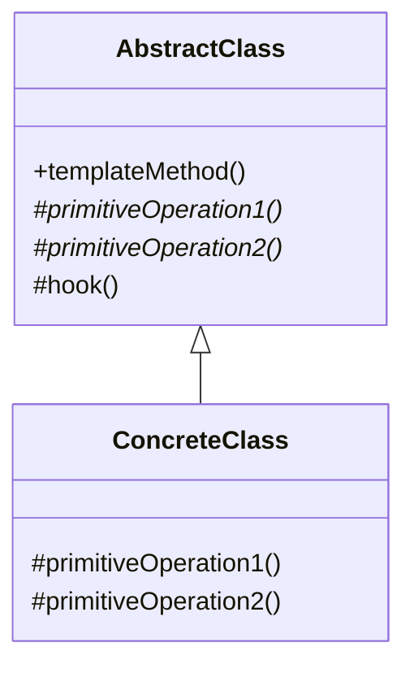

**Real-world Example: Data Processing Pipeline**

```javascript
// Abstract class with template method
class DataProcessor {
  // Template method - defines the algorithm structure
  process() {
    this.loadData();
    this.validateData();
    this.processData();
    this.saveData();

    if (this.shouldNotify()) {
      this.sendNotification();
    }
  }

  loadData() {
    throw new Error('loadData() must be implemented');
  }

  validateData() {
    console.log('Validating data...');
    // Default validation logic
  }

  processData() {
    throw new Error('processData() must be implemented');
  }

  saveData() {
    throw new Error('saveData() must be implemented');
  }

  // Hook method - optional override
  shouldNotify() {
    return true;
  }

  sendNotification() {
    console.log('Sending notification...');
  }
}

// Concrete implementation 1
class CSVDataProcessor extends DataProcessor {
  loadData() {
    console.log('Loading data from CSV file...');
    this.data = 'csv,data,here';
  }

  processData() {
    console.log('Processing CSV data...');
    this.processedData = this.data.split(',');
  }

  saveData() {
    console.log('Saving CSV data to database...');
  }
}

// Concrete implementation 2
class JSONDataProcessor extends DataProcessor {
  loadData() {
    console.log('Loading data from JSON file...');
    this.data = '{"key": "value"}';
  }

  processData() {
    console.log('Processing JSON data...');
    this.processedData = JSON.parse(this.data);
  }

  saveData() {
    console.log('Saving JSON data to database...');
  }

  // Override hook
  shouldNotify() {
    return false; // Don't send notification for JSON processing
  }
}

// Usage
console.log('=== CSV Processing ===');
const csvProcessor = new CSVDataProcessor();
csvProcessor.process();

console.log('\n=== JSON Processing ===');
const jsonProcessor = new JSONDataProcessor();
jsonProcessor.process();
```

**Game AI Example:**

```javascript
// Abstract AI class
class GameAI {
  // Template method
  takeTurn() {
    this.collectResources();
    this.buildStructures();
    this.buildUnits();
    this.attack();
  }

  collectResources() {
    console.log('Collecting resources');
  }

  buildStructures() {
    // Default implementation - can be overridden
    console.log('Building basic structures');
  }

  buildUnits() {
    throw new Error('buildUnits() must be implemented');
  }

  attack() {
    throw new Error('attack() must be implemented');
  }
}

// Easy AI
class EasyAI extends GameAI {
  buildUnits() {
    console.log('Building few basic units');
  }

  attack() {
    console.log('Attacking with weak strategy');
  }
}

// Hard AI
class HardAI extends GameAI {
  buildStructures() {
    console.log('Building advanced defensive structures');
  }

  buildUnits() {
    console.log('Building diverse army with advanced units');
  }

  attack() {
    console.log('Executing coordinated multi-front attack');
  }
}

// Usage
console.log('=== Easy AI Turn ===');
const easyAI = new EasyAI();
easyAI.takeTurn();

console.log('\n=== Hard AI Turn ===');
const hardAI = new HardAI();
hardAI.takeTurn();
```

**Testing Framework Example:**

```javascript
class TestCase {
  // Template method
  run() {
    this.setUp();

    try {
      this.runTest();
      this.recordSuccess();
    } catch (error) {
      this.recordFailure(error);
    } finally {
      this.tearDown();
    }
  }

  setUp() {
    console.log('Setting up test environment...');
  }

  runTest() {
    throw new Error('runTest() must be implemented');
  }

  tearDown() {
    console.log('Cleaning up test environment...');
  }

  recordSuccess() {
    console.log('✓ Test passed');
  }

  recordFailure(error) {
    console.log(`✗ Test failed: ${error.message}`);
  }
}

// Concrete test
class LoginTest extends TestCase {
  setUp() {
    super.setUp();
    this.browser = { url: null };
    console.log('Opening browser...');
  }

  runTest() {
    console.log('Navigating to login page...');
    console.log('Entering credentials...');
    console.log('Clicking submit...');

    // Simulate assertion
    const isLoggedIn = true;
    if (!isLoggedIn) {
      throw new Error('Login failed');
    }

    console.log('User successfully logged in');
  }

  tearDown() {
    console.log('Closing browser...');
    super.tearDown();
  }
}

// Usage
const test = new LoginTest();
test.run();
```

:::tip Template Method Benefits

This pattern promotes code reuse by extracting common behavior into a base class while allowing customization through
inheritance. It's the foundation of many framework designs.

:::

**When to Use:**

- Multiple classes have similar algorithms with slight variations
- Want to control which parts of an algorithm can be overridden
- Need to avoid code duplication across similar classes
- Want to implement the "Hollywood Principle" - "Don't call us, we'll call you"

### Visitor

- TODO

## Applying Design Patterns Effectively

When applying design patterns, it's essential to keep the following tips in mind:

- **Understand the Problem:** Before choosing a design pattern, make sure you fully understand the problem you're trying
  to solve.

- **Don't Force a Pattern:** Design patterns are useful tools, but they're not a one-size-fits-all solution. Don't try
  to force a pattern into your design if it doesn't fit naturally.

- **Familiarize Yourself with Multiple Patterns:** The more design patterns you know, the more likely you'll find the
  right one for your situation. Spend time learning about different patterns and their use cases.

- **Keep It Simple:** Always strive for simplicity in your designs. If a design pattern adds unnecessary complexity to
  your solution, consider alternative approaches.

- **Balance Flexibility and Maintainability:** Design patterns can provide flexibility, but they can also add complexity
  to your code. Strive for a balance between flexibility and maintainability when applying design patterns.

## Anti-Patterns

Anti-patterns are common responses to recurring problems that are ineffective and counterproductive. Unlike design
patterns, which represent best practices, anti-patterns represent common mistakes that should be avoided.

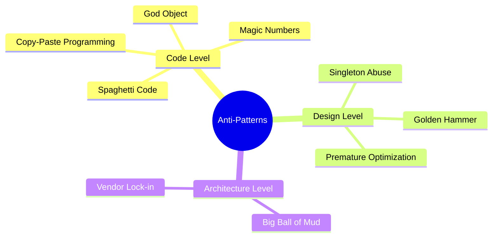

### God Object

**Problem:** A single class that knows too much or does too much, violating the Single Responsibility Principle.

**Example of Bad Code:**

```javascript
// BAD: God Object
class UserManager {
  // Database operations
  saveToDatabase(user) {
    /* ... */
  }
  queryDatabase(id) {
    /* ... */
  }

  // Validation
  validateEmail(email) {
    /* ... */
  }
  validatePassword(password) {
    /* ... */
  }

  // Email operations
  sendWelcomeEmail(user) {
    /* ... */
  }
  sendPasswordResetEmail(user) {
    /* ... */
  }

  // Business logic
  calculateUserScore(user) {
    /* ... */
  }
  generateReport(user) {
    /* ... */
  }

  // Authentication
  login(credentials) {
    /* ... */
  }
  logout(user) {
    /* ... */
  }
}
```

**Solution: Separate Responsibilities**

```javascript
// GOOD: Separated responsibilities
class UserRepository {
  save(user) {
    /* ... */
  }
  findById(id) {
    /* ... */
  }
}

class UserValidator {
  validateEmail(email) {
    /* ... */
  }
  validatePassword(password) {
    /* ... */
  }
}

class EmailService {
  sendWelcomeEmail(user) {
    /* ... */
  }
  sendPasswordResetEmail(user) {
    /* ... */
  }
}

class UserService {
  constructor(repository, validator, emailService) {
    this.repository = repository;
    this.validator = validator;
    this.emailService = emailService;
  }

  createUser(userData) {
    this.validator.validateEmail(userData.email);
    const user = this.repository.save(userData);
    this.emailService.sendWelcomeEmail(user);
    return user;
  }
}
```

### Spaghetti Code

**Problem:** Code with complex and tangled control structures that's difficult to follow and maintain.

**Example of Bad Code:**

```javascript
// BAD: Spaghetti code
function processOrder(order) {
  if (order.items.length > 0) {
    let total = 0;
    for (let i = 0; i < order.items.length; i++) {
      if (order.items[i].available) {
        if (order.items[i].discount > 0) {
          total += order.items[i].price * (1 - order.items[i].discount);
          if (order.customer.isPremium) {
            total -= 5;
          }
        } else {
          total += order.items[i].price;
        }
        if (total > 100) {
          order.shipping = 'free';
        } else {
          order.shipping = 'standard';
        }
      }
    }
    if (total > 0) {
      order.total = total;
      return true;
    } else {
      return false;
    }
  } else {
    return false;
  }
}
```

**Solution: Structured and Readable Code**

```javascript
// GOOD: Clean, structured code
class OrderProcessor {
  processOrder(order) {
    if (!this.hasItems(order)) {
      return false;
    }

    const subtotal = this.calculateSubtotal(order);
    const total = this.applyDiscounts(subtotal, order.customer);

    order.total = total;
    order.shipping = this.determineShipping(total);

    return total > 0;
  }

  hasItems(order) {
    return order.items.length > 0;
  }

  calculateSubtotal(order) {
    return order.items.filter((item) => item.available).reduce((sum, item) => sum + this.calculateItemPrice(item), 0);
  }

  calculateItemPrice(item) {
    return item.discount > 0 ? item.price * (1 - item.discount) : item.price;
  }

  applyDiscounts(subtotal, customer) {
    return customer.isPremium ? subtotal - 5 : subtotal;
  }

  determineShipping(total) {
    return total > 100 ? 'free' : 'standard';
  }
}
```

### Singleton Abuse

**Problem:** Overusing Singleton pattern, creating hidden dependencies and making testing difficult.

```javascript
// BAD: Singleton abuse creating tight coupling
class Database {
  static instance = null;

  static getInstance() {
    if (!Database.instance) {
      Database.instance = new Database();
    }
    return Database.instance;
  }

  query(sql) {
    /* ... */
  }
}

class UserService {
  getUser(id) {
    // Tight coupling to singleton
    const db = Database.getInstance();
    return db.query(`SELECT * FROM users WHERE id = ${id}`);
  }
}

// GOOD: Dependency injection
class UserService {
  constructor(database) {
    this.database = database; // Injected dependency
  }

  getUser(id) {
    return this.database.query(`SELECT * FROM users WHERE id = ${id}`);
  }
}

// Easy to test with mock
const mockDb = { query: jest.fn() };
const service = new UserService(mockDb);
```

### Magic Numbers

**Problem:** Using unexplained numerical constants in code.

```javascript
// BAD: Magic numbers
function calculateDiscount(price) {
  if (price > 100) {
    return price * 0.1;
  } else if (price > 50) {
    return price * 0.05;
  }
  return 0;
}

// GOOD: Named constants
const DISCOUNT_THRESHOLD_HIGH = 100;
const DISCOUNT_THRESHOLD_LOW = 50;
const DISCOUNT_RATE_HIGH = 0.1;
const DISCOUNT_RATE_LOW = 0.05;

function calculateDiscount(price) {
  if (price > DISCOUNT_THRESHOLD_HIGH) {
    return price * DISCOUNT_RATE_HIGH;
  } else if (price > DISCOUNT_THRESHOLD_LOW) {
    return price * DISCOUNT_RATE_LOW;
  }
  return 0;
}
```

### Copy-Paste Programming

**Problem:** Duplicating code instead of extracting reusable functions.

```javascript
// BAD: Copy-paste programming
function processUserData(user) {
  const name = user.name.trim().toLowerCase();
  const email = user.email.trim().toLowerCase();
  // ... more processing
}

function processAdminData(admin) {
  const name = admin.name.trim().toLowerCase();
  const email = admin.email.trim().toLowerCase();
  // ... more processing
}

// GOOD: Extracted common logic
function normalizeString(str) {
  return str.trim().toLowerCase();
}

function processUserData(user) {
  const name = normalizeString(user.name);
  const email = normalizeString(user.email);
  // ... more processing
}

function processAdminData(admin) {
  const name = normalizeString(admin.name);
  const email = normalizeString(admin.email);
  // ... more processing
}
```

### Golden Hammer

**Problem:** Using the same solution for every problem ("If all you have is a hammer, everything looks like a nail").

```javascript
// BAD: Using regex for everything
function isValidEmail(email) {
  return /^[^\s@]+@[^\s@]+\.[^\s@]+$/.test(email);
}

function parseHTML(html) {
  // DON'T parse HTML with regex!
  return html.match(/<[^>]+>/g); // Very problematic
}

// GOOD: Use appropriate tools
function isValidEmail(email) {
  return /^[^\s@]+@[^\s@]+\.[^\s@]+$/.test(email); // OK for email
}

function parseHTML(html) {
  // Use a proper HTML parser
  const parser = new DOMParser();
  return parser.parseFromString(html, 'text/html');
}
```

### Callback Hell

**Problem:** Deeply nested callbacks that are hard to read and maintain.

```javascript
// BAD: Callback hell
getData(function (a) {
  getMoreData(a, function (b) {
    getEvenMoreData(b, function (c) {
      getYetMoreData(c, function (d) {
        getFinalData(d, function (e) {
          console.log(e);
        });
      });
    });
  });
});

// GOOD: Promises or async/await
async function fetchAllData() {
  const a = await getData();
  const b = await getMoreData(a);
  const c = await getEvenMoreData(b);
  const d = await getYetMoreData(c);
  const e = await getFinalData(d);
  console.log(e);
}
```

:::danger Avoiding Anti-Patterns

Anti-patterns often emerge from time pressure, lack of experience, or insufficient refactoring. Regular code reviews,
automated linting, and continuous learning help prevent these issues.

:::

**How to Avoid Anti-Patterns:**

1. **Code Reviews** - Peer review catches anti-patterns early
2. **Refactoring** - Regularly improve code structure
3. **Design Principles** - Follow SOLID, DRY, KISS
4. **Static Analysis** - Use linters and code quality tools
5. **Testing** - Good tests make refactoring safer
6. **Education** - Stay updated on best practices
7. **Pattern Awareness** - Know when NOT to use patterns

## Conclusion

Design patterns are a valuable tool for software developers, providing reusable solutions to common problems and
improving code quality, maintainability, and scalability. By understanding and applying design patterns effectively,
developers can create more robust and efficient software systems.

To deepen your understanding of design patterns, consider reading the following resources:

- [Design Patterns: Elements of Reusable Object-Oriented Software](https://amzn.to/43os0lL) by Erich Gamma, Richard
  Helm, Ralph Johnson, and John
- [Head First Design Patterns: Building Extensible and Maintainable Object-Oriented Software ](https://amzn.to/3Kzlznz)
  by Eric Freeman and Elisabeth Robson
- [Refactoring to Patterns](https://amzn.to/403gHMQ) by Joshua Kerievsky
- [Learning JavaScript Design Patterns: A JavaScript and React Developer's Guide](https://amzn.to/3UtvX4w) by Addy
  Osmani
