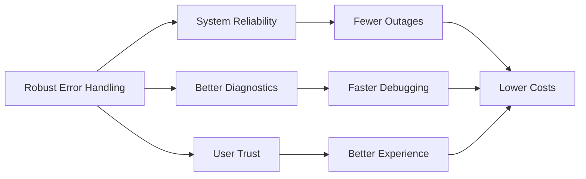
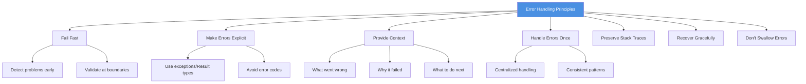
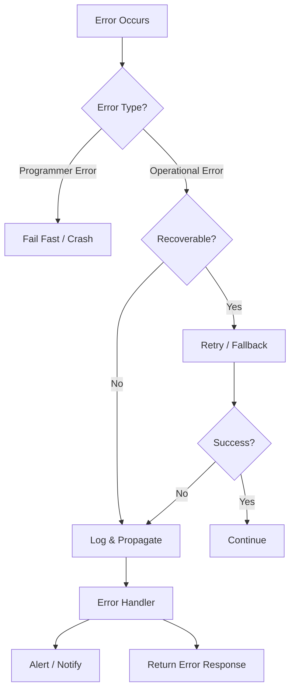
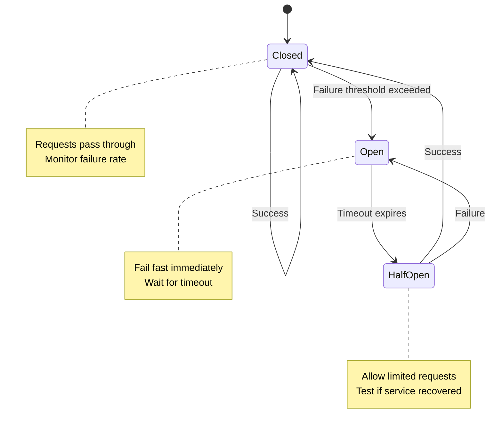
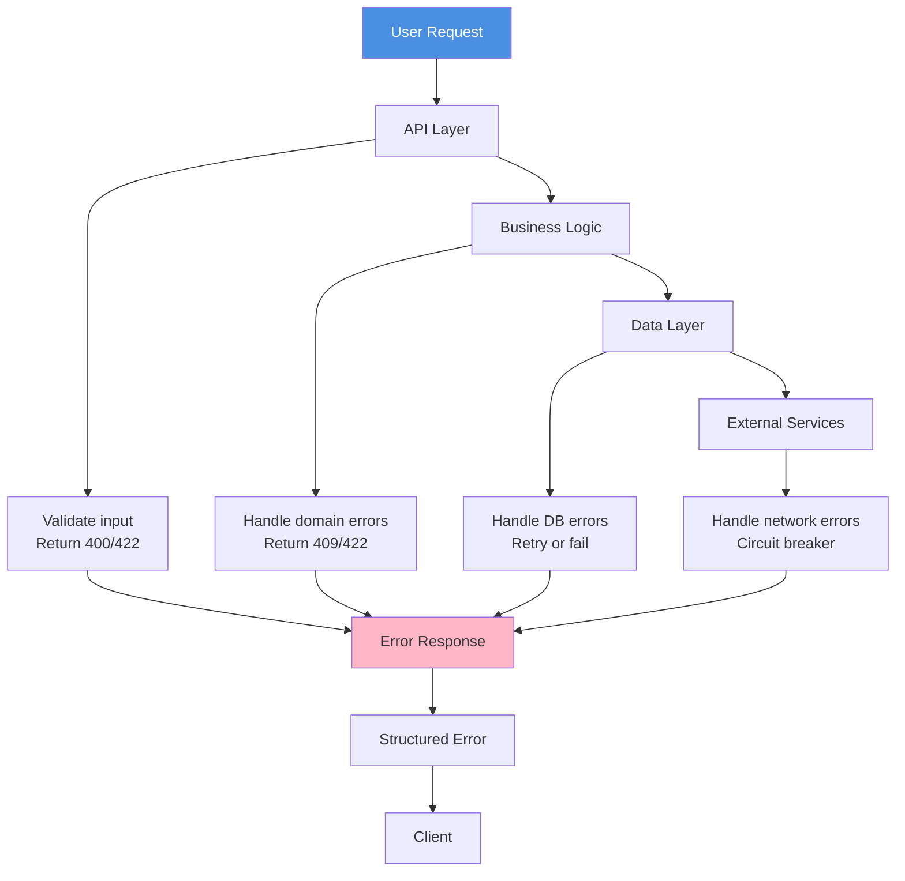
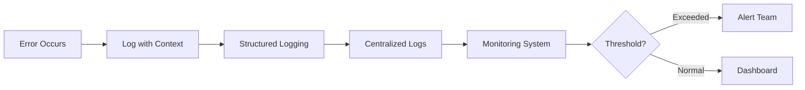
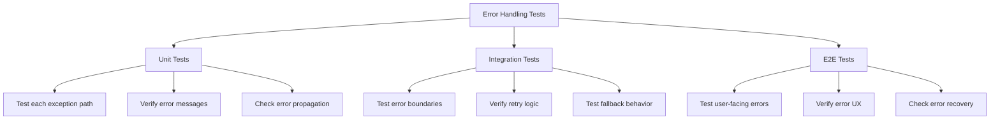

import ErrorHandlingImage from '@site/static/img/undraw_bug_fixing.svg';

<div className="text--center margin-bottom--lg">
  <ErrorHandlingImage width="80%" height="300px" />
</div>

> "A program that doesn't handle errors is a program that's broken by design."

Error handling is the craft of **anticipating, detecting, and responding to failures** in ways that keep systems
reliable, understandable, and recoverable. Good error handling turns catastrophic failures into manageable incidents,
transforms cryptic crashes into actionable diagnostics, and builds user trust through graceful degradation.

---

## Why error handling matters



- **Failures are inevitable.** Networks fail, disks fill, APIs timeout, users provide invalid input. Software that
  doesn't plan for failure **will** fail unpredictably.
- **Errors are data.** Well-structured error information accelerates debugging, reduces mean-time-to-resolution (MTTR),
  and enables better monitoring and alerting.
- **User experience depends on it.** Users forgive failures if the system fails gracefully with clear guidance. Cryptic
  error messages or silent failures erode trust.

---

## Core principles



1. **Fail fast** Detect errors as early as possible, ideally at input validation boundaries before corrupting state.

2. **Make errors explicit** Use exceptions, Result types, or error returns—don't hide failures in special values
   (`null`, `-1`, empty strings).

3. **Provide context** Include **what** failed, **why** it failed, and **what action** the user or operator should take.

4. **Handle errors at the right level** Don't catch-and-ignore everywhere; propagate errors to code that knows how to
   handle them meaningfully.

5. **Preserve stack traces** When wrapping or re-throwing errors, maintain the original stack trace for debugging.

6. **Recover gracefully where possible** Retry transient failures, provide fallback values, or degrade functionality
   rather than crashing.

7. **Never swallow errors silently** Empty catch blocks and ignored error returns are bugs waiting to happen.

---

## Error handling strategies



### Programmer errors vs. operational errors

Understanding the distinction shapes your handling strategy:

| Type            | Description                          | Examples                              | Strategy                          |
| --------------- | ------------------------------------ | ------------------------------------- | --------------------------------- |
| **Programmer**  | Bugs in the code; should never occur | `null` dereference, type errors       | Fail fast; fix the bug            |
| **Operational** | Expected failures in production      | Network timeout, disk full, bad input | Handle gracefully; retry/fallback |

- **Programmer errors** indicate bugs—crash immediately (in dev) to surface the issue quickly.
- **Operational errors** are part of normal operation—handle them with retries, fallbacks, or error responses.

### Fail fast for programmer errors

```python
# ❌ BAD: Defensive programming that hides bugs
def calculate_discount(order):
    if order is None:
        return 0  # Silently returns wrong result
    return order.total * 0.1

# ✅ GOOD: Fail fast exposes the bug immediately
def calculate_discount(order):
    if order is None:
        raise ValueError("order cannot be None")
    return order.total * 0.1
```

### Retry with exponential backoff for transient failures

```python
import time
from typing import Callable, TypeVar

T = TypeVar('T')

def retry_with_backoff(
    func: Callable[[], T],
    max_attempts: int = 3,
    initial_delay: float = 1.0,
    max_delay: float = 60.0
) -> T:
    """Retry a function with exponential backoff."""
    attempt = 0
    delay = initial_delay

    while True:
        try:
            return func()
        except Exception as e:
            attempt += 1
            if attempt >= max_attempts:
                raise  # Re-raise after exhausting retries

            # Log the retry attempt
            print(f"Attempt {attempt} failed: {e}. Retrying in {delay}s...")

            time.sleep(delay)
            delay = min(delay * 2, max_delay)  # Exponential backoff with cap

# Usage
data = retry_with_backoff(lambda: fetch_from_api(), max_attempts=5)
```

### Circuit breaker for cascading failures



A circuit breaker prevents cascading failures by stopping requests to a failing dependency:

```python
import time
from enum import Enum

class CircuitState(Enum):
    CLOSED = "closed"
    OPEN = "open"
    HALF_OPEN = "half_open"

class CircuitBreaker:
    def __init__(self, failure_threshold: int = 5, timeout: float = 60.0):
        self.failure_threshold = failure_threshold
        self.timeout = timeout
        self.failure_count = 0
        self.last_failure_time = None
        self.state = CircuitState.CLOSED

    def call(self, func):
        if self.state == CircuitState.OPEN:
            if time.time() - self.last_failure_time > self.timeout:
                self.state = CircuitState.HALF_OPEN
            else:
                raise Exception("Circuit breaker is OPEN")

        try:
            result = func()
            self._on_success()
            return result
        except Exception as e:
            self._on_failure()
            raise

    def _on_success(self):
        self.failure_count = 0
        self.state = CircuitState.CLOSED

    def _on_failure(self):
        self.failure_count += 1
        self.last_failure_time = time.time()
        if self.failure_count >= self.failure_threshold:
            self.state = CircuitState.OPEN

# Usage
api_breaker = CircuitBreaker(failure_threshold=3, timeout=30.0)
data = api_breaker.call(lambda: fetch_from_external_api())
```

---

## Exception design patterns

### Use specific exception types

```python
# ❌ BAD: Generic exceptions lose context
def withdraw(account, amount):
    if amount > account.balance:
        raise Exception("Can't withdraw")  # Too vague
    account.balance -= amount

# ✅ GOOD: Specific exceptions enable precise handling
class InsufficientFundsError(Exception):
    def __init__(self, account_id, requested, available):
        self.account_id = account_id
        self.requested = requested
        self.available = available
        super().__init__(
            f"Account {account_id}: insufficient funds. "
            f"Requested ${requested}, available ${available}"
        )

def withdraw(account, amount):
    if amount > account.balance:
        raise InsufficientFundsError(account.id, amount, account.balance)
    account.balance -= amount
```

### Chain exceptions to preserve context

```python
# ✅ GOOD: Chain exceptions to preserve full context
try:
    user = load_user_from_database(user_id)
except DatabaseConnectionError as e:
    raise UserLoadError(f"Failed to load user {user_id}") from e
    # The 'from e' preserves the original exception chain
```

### Result types as an alternative to exceptions

In languages that support them (Rust, Haskell, TypeScript with libraries), Result types make error handling explicit:

```typescript
// TypeScript example using a Result type
type Result<T, E> = { ok: true; value: T } | { ok: false; error: E };

function parseConfig(raw: string): Result<Config, string> {
  try {
    const config = JSON.parse(raw);
    if (!config.apiKey) {
      return { ok: false, error: 'Missing apiKey' };
    }
    return { ok: true, value: config };
  } catch (e) {
    return { ok: false, error: `Invalid JSON: ${e.message}` };
  }
}

// Caller must explicitly handle both cases
const result = parseConfig(rawData);
if (result.ok) {
  console.log('Config loaded:', result.value);
} else {
  console.error('Config error:', result.error);
}
```

---

## Error handling at different layers



### API/Controller layer

Validate input and translate domain exceptions to HTTP status codes:

```python
from flask import Flask, jsonify, request

app = Flask(__name__)

@app.route('/accounts/<account_id>/withdraw', methods=['POST'])
def withdraw_endpoint(account_id):
    try:
        amount = request.json.get('amount')
        if not amount or amount <= 0:
            return jsonify({
                'error': 'invalid_amount',
                'message': 'Amount must be positive'
            }), 400

        account = account_service.get_account(account_id)
        account_service.withdraw(account, amount)

        return jsonify({'balance': account.balance}), 200

    except AccountNotFoundError as e:
        return jsonify({
            'error': 'account_not_found',
            'message': str(e)
        }), 404

    except InsufficientFundsError as e:
        return jsonify({
            'error': 'insufficient_funds',
            'message': str(e),
            'available': e.available
        }), 409

    except Exception as e:
        # Log unexpected errors
        logger.error(f"Unexpected error in withdraw: {e}", exc_info=True)
        return jsonify({
            'error': 'internal_error',
            'message': 'An unexpected error occurred'
        }), 500
```

### Service/Business logic layer

Handle domain-specific errors and propagate with context:

```python
class AccountService:
    def withdraw(self, account, amount):
        if amount > account.balance:
            raise InsufficientFundsError(account.id, amount, account.balance)

        try:
            transaction = self._create_transaction(account.id, -amount)
            account.balance -= amount
            self.db.save(account)
            self.db.save(transaction)
        except DatabaseError as e:
            raise TransactionError(f"Failed to process withdrawal for {account.id}") from e
```

### Data layer

Wrap database/infrastructure errors:

```python
class AccountRepository:
    def save(self, account):
        try:
            self.connection.execute(
                "UPDATE accounts SET balance = ? WHERE id = ?",
                (account.balance, account.id)
            )
            self.connection.commit()
        except sqlite3.OperationalError as e:
            raise DatabaseError(f"Failed to save account {account.id}") from e
```

---

## Structured error responses

Provide consistent, machine-readable error formats:

```json
{
  "error": {
    "code": "insufficient_funds",
    "message": "Account 12345: insufficient funds. Requested $500.00, available $250.00",
    "details": {
      "account_id": "12345",
      "requested_amount": 500.0,
      "available_amount": 250.0
    },
    "timestamp": "2025-10-19T14:32:10Z",
    "request_id": "req_abc123"
  }
}
```

### Key fields in error responses

1. **code** — Machine-readable error identifier (e.g., `invalid_input`, `rate_limit_exceeded`)
2. **message** — Human-readable description
3. **details** — Context-specific data (field names, constraint values, etc.)
4. **timestamp** — When the error occurred
5. **request_id** — Correlation ID for tracing across logs

---

## Logging and monitoring



### What to log

- **Error type and message**
- **Stack trace** (for unexpected errors)
- **Request/correlation ID** (to trace across services)
- **User/session context** (sanitized, no PII in plain logs)
- **Input parameters** (sanitized)
- **Timestamps and latency**

### Example structured error log

```python
import logging
import structlog

logger = structlog.get_logger()

try:
    result = process_payment(order_id, amount)
except PaymentGatewayError as e:
    logger.error(
        "payment_failed",
        order_id=order_id,
        amount=amount,
        gateway="stripe",
        error_code=e.code,
        error_message=str(e),
        request_id=request.id,
        exc_info=True  # Include stack trace
    )
    raise
```

:::tip Learn more about logging

For comprehensive guidance on logging strategies and structured logging, see our [Logging](/logging) chapter.

:::

---

## Error handling anti-patterns

### 1. Swallowing exceptions

```python
# ❌ BAD: Silent failure makes debugging impossible
try:
    send_email(user.email, message)
except Exception:
    pass  # Error disappears without trace
```

```python
# ✅ GOOD: Log and handle appropriately
try:
    send_email(user.email, message)
except EmailServiceError as e:
    logger.warning(f"Failed to send email to {user.email}: {e}")
    # Maybe add to retry queue or alert admin
    error_queue.add_retry(user.email, message)
```

### 2. Overly broad exception handlers

```python
# ❌ BAD: Catches everything, including KeyboardInterrupt
try:
    data = fetch_data()
    process(data)
except Exception:
    return "Error occurred"  # Too vague
```

```python
# ✅ GOOD: Catch specific, expected exceptions
try:
    data = fetch_data()
    process(data)
except NetworkError as e:
    logger.error(f"Network error: {e}")
    return {"error": "network_error", "message": str(e)}
except ValidationError as e:
    return {"error": "validation_error", "message": str(e)}
# Let unexpected exceptions bubble up
```

### 3. Using exceptions for control flow

```python
# ❌ BAD: Exceptions are expensive for normal flow
def get_user_or_default(user_id):
    try:
        return database.get_user(user_id)
    except UserNotFound:
        return AnonymousUser()  # This is normal, not exceptional
```

```python
# ✅ GOOD: Use explicit checks for expected branches
def get_user_or_default(user_id):
    user = database.get_user_or_none(user_id)
    return user if user else AnonymousUser()
```

### 4. Leaking implementation details

```python
# ❌ BAD: Exposes internal database details to API clients
@app.route('/users/<user_id>')
def get_user(user_id):
    try:
        return get_user_from_db(user_id)
    except psycopg2.IntegrityError as e:
        return str(e), 500  # Raw database error exposed
```

```python
# ✅ GOOD: Translate to domain errors
@app.route('/users/<user_id>')
def get_user(user_id):
    try:
        return get_user_from_db(user_id)
    except DatabaseError as e:
        logger.error(f"Database error fetching user {user_id}", exc_info=True)
        return {"error": "database_error", "message": "Failed to retrieve user"}, 500
```

### 5. Missing error context

```python
# ❌ BAD: No information about what failed
raise ValueError("Invalid input")
```

```python
# ✅ GOOD: Include actionable context
raise ValueError(
    f"Invalid email format: '{email}'. Expected format: user@domain.com"
)
```

---

## Testing error handling



### Test each error path

```python
import pytest

def test_withdraw_insufficient_funds():
    account = Account(id="123", balance=100.0)

    with pytest.raises(InsufficientFundsError) as exc_info:
        account.withdraw(200.0)

    assert exc_info.value.account_id == "123"
    assert exc_info.value.requested == 200.0
    assert exc_info.value.available == 100.0
    assert "insufficient funds" in str(exc_info.value).lower()

def test_withdraw_invalid_amount():
    account = Account(id="123", balance=100.0)

    with pytest.raises(ValueError, match="Amount must be positive"):
        account.withdraw(-50.0)
```

### Test retry logic

```python
def test_retry_eventually_succeeds():
    call_count = 0

    def flaky_function():
        nonlocal call_count
        call_count += 1
        if call_count < 3:
            raise NetworkError("Temporary failure")
        return "success"

    result = retry_with_backoff(flaky_function, max_attempts=5)

    assert result == "success"
    assert call_count == 3

def test_retry_exhausts_attempts():
    def always_fails():
        raise NetworkError("Permanent failure")

    with pytest.raises(NetworkError):
        retry_with_backoff(always_fails, max_attempts=3)
```

:::tip Learn more about testing

For comprehensive testing strategies including error scenarios, see our [Software Testing](/testing) chapter.

:::

---

## Error handling checklist

Run through this before finalizing error handling in a new feature:

### Detection & Validation

1. ✅ Are inputs validated at system boundaries (API, file uploads, user forms)?
2. ✅ Does the code fail fast on invalid state or arguments?
3. ✅ Are errors detected early, before state corruption?

### Error Types & Context

4. ✅ Are custom exception types used for domain-specific errors?
5. ✅ Do error messages include **what**, **why**, and **what to do next**?
6. ✅ Are stack traces preserved when wrapping exceptions?
7. ✅ Is sensitive data (passwords, tokens) excluded from error messages and logs?

### Handling & Recovery

8. ✅ Are transient failures (network, timeout) retried with backoff?
9. ✅ Are circuit breakers used for external dependencies?
10. ✅ Is there graceful degradation or fallback behavior where appropriate?
11. ✅ Are errors handled at the correct layer (API vs. service vs. data)?

### Logging & Monitoring

12. ✅ Are errors logged with structured context (request ID, user ID, parameters)?
13. ✅ Are critical errors alerting the team via monitoring systems?
14. ✅ Are error rates tracked in dashboards?

### Testing & Documentation

15. ✅ Is every error path covered by tests?
16. ✅ Are retry and circuit breaker behaviors tested?
17. ✅ Are error response formats documented for API consumers?

---

## Further reading

### Books

- **Release It!** (2nd ed.) by Michael T. Nygard — Comprehensive patterns for production stability, including circuit
  breakers, timeouts, and bulkheads
- **The Pragmatic Programmer** by Andrew Hunt & David Thomas — Crash early principles and defensive programming
- **Site Reliability Engineering** by Google — Error budgets, monitoring, and incident response
- **Distributed Systems Observability** by Cindy Sridharan — Logging, metrics, and tracing for diagnosing failures

### Online Resources

- [Resilience4j Documentation](https://resilience4j.readme.io/) — Java library implementing circuit breaker, retry, and
  rate limiting patterns
- [Error Handling in Node.js](https://nodejs.org/en/docs/guides/error-handling/) — Official Node.js guide to error
  handling
- [Go Error Handling Best Practices](https://go.dev/blog/error-handling-and-go) — Idiomatic Go error handling

### Research & Standards

- [RFC 7807: Problem Details for HTTP APIs](https://tools.ietf.org/html/rfc7807) — Standard format for HTTP error
  responses
- Netflix Engineering Blog — Circuit breaker patterns and resilience engineering

---

## Key takeaways

1. **Fail fast for bugs, recover gracefully for operations** — Distinguish programmer errors (bugs to fix) from
   operational errors (expected failures to handle).

2. **Make errors explicit and contextual** — Use specific exception types or Result types; include what failed, why, and
   what to do next.

3. **Handle errors at the right layer** — Validate at boundaries, translate at API layers, and centralize logging and
   monitoring.

4. **Retry transient failures** — Use exponential backoff for network errors, timeouts, and rate limits.

5. **Prevent cascading failures** — Implement circuit breakers and timeouts to protect against failing dependencies.

6. **Log with structure and context** — Include request IDs, user context, and stack traces to enable fast debugging.

7. **Test every error path** — Errors are part of your API contract; test them as thoroughly as success cases.

8. **Never swallow errors silently** — Empty catch blocks are bugs. Log, handle, or propagate—never ignore.

Remember: Error handling is not defensive paranoia—it's a **design discipline** that makes systems safer, more
observable, and easier to debug. Every unhandled error is a missed opportunity to build trust with your users and your
future self.
