import GraphQLImage from '/img/undraw_real_time_sync.svg';

<div className="text--center margin-bottom--lg">
  <GraphQLImage width="80%" height="300px" />
</div>

> A strongly-typed query language that gives clients precisely the data they need—and the responsibility to ask for it
> wisely.

GraphQL shifts control from servers to clients, enabling flexible data fetching with a single endpoint. But with great
power comes great responsibility: schema design, query complexity, caching, and security all require careful
consideration. This chapter collects battle-tested patterns for building maintainable, performant GraphQL APIs.

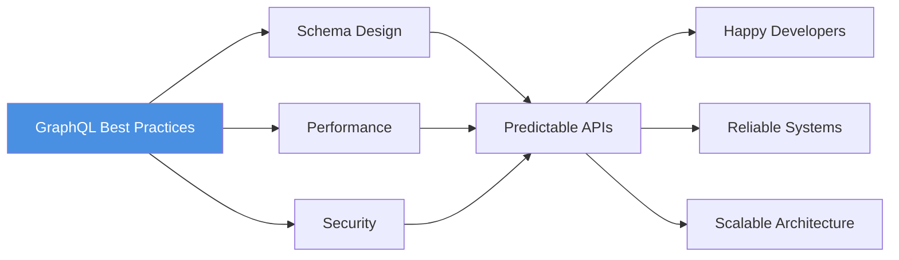

---

## Schema design principles

Your schema is your API contract. Design it for clarity, evolution, and client needs.

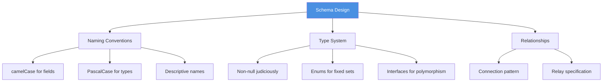

**Naming conventions**

- **Types**: PascalCase (`User`, `OrderItem`, `PaymentStatus`)
- **Fields**: camelCase (`firstName`, `createdAt`, `orderTotal`)
- **Enums**: SCREAMING_SNAKE_CASE values (`ORDER_STATUS { PENDING, SHIPPED, DELIVERED }`)
- **Arguments**: camelCase (`first`, `after`, `orderBy`)
- Avoid abbreviations; prefer `description` over `desc`, `identifier` over `id` in names (though `id` field is fine)

**Type design**

- Use **non-null** (`!`) deliberately; adding `!` later is backward-compatible, removing it is breaking
- Prefer **nullable by default** for fields that might not always be available
- Use **Enums** for fixed sets of values; they're self-documenting and type-safe
- Use **Interfaces** and **Unions** for polymorphic types
- Use **Input types** for mutations to group related arguments

### Schema example

```graphql
"""
A user in the system
"""
type User {
  """
  Unique identifier
  """
  id: ID!

  """
  User's email address
  """
  email: String!

  """
  Display name (may be null for new users)
  """
  displayName: String

  """
  User's current status
  """
  status: UserStatus!

  """
  Orders placed by this user
  """
  orders(first: Int = 20, after: String, status: OrderStatus): OrderConnection!

  """
  When the user was created
  """
  createdAt: DateTime!
}

"""
User account status
"""
enum UserStatus {
  ACTIVE
  SUSPENDED
  DELETED
}

"""
Relay-style connection for pagination
"""
type OrderConnection {
  edges: [OrderEdge!]!
  pageInfo: PageInfo!
  totalCount: Int!
}

type OrderEdge {
  node: Order!
  cursor: String!
}

type PageInfo {
  hasNextPage: Boolean!
  hasPreviousPage: Boolean!
  startCursor: String
  endCursor: String
}
```

---

## Queries: fetching data

**Query design guidelines**

- Provide clear, specific root queries: `user(id: ID!)`, `users(...)`, `searchUsers(...)`
- Use **connections** (edges/nodes pattern) for paginated lists
- Support filtering, sorting, and field-level arguments where useful
- Document every field and argument with descriptions

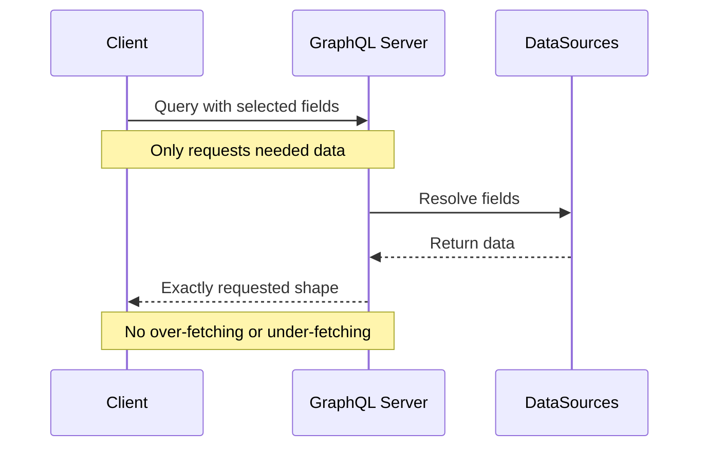

**Good query patterns**

```graphql
# ✅ Single user by ID
query GetUser($id: ID!) {
  user(id: $id) {
    id
    email
    displayName
    createdAt
  }
}

# ✅ Paginated list with filtering
query ListOrders($first: Int!, $after: String, $status: OrderStatus) {
  orders(first: $first, after: $after, status: $status) {
    edges {
      node {
        id
        number
        total
        status
        createdAt
      }
      cursor
    }
    pageInfo {
      hasNextPage
      endCursor
    }
    totalCount
  }
}

# ✅ Nested related data (mind N+1!)
query GetUserWithOrders($userId: ID!) {
  user(id: $userId) {
    id
    displayName
    orders(first: 10) {
      edges {
        node {
          id
          total
          items {
            id
            product {
              name
            }
          }
        }
      }
    }
  }
}
```

**Avoid anti-patterns**

```graphql
# ❌ Too generic; forces clients to request everything
query GetData {
  data {
    ... everything
  }
}

# ❌ Field names with verbs (queries already "get")
query {
  getUser(id: "123") {  # Just "user"
    fetchOrders {        # Just "orders"
      ...
    }
  }
}
```

---

## Mutations: changing data

Structure mutations for clarity and consistency.

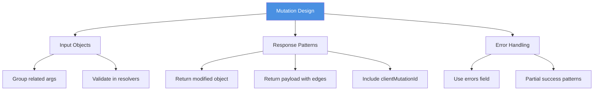

**Mutation conventions**

- Name mutations with **verbs**: `createUser`, `updateOrder`, `deleteComment`
- Use **input types** for complex arguments
- Return a **payload type** containing:
  - The mutated object(s)
  - Errors (if any)
  - `clientMutationId` for client-side tracking (optional but useful)
- Make mutations **idempotent** where possible

### Mutation example

```graphql
"""
Input for creating a new user
"""
input CreateUserInput {
  email: String!
  displayName: String!
  clientMutationId: String
}

"""
Payload returned from createUser mutation
"""
type CreateUserPayload {
  """
  The created user (null if errors occurred)
  """
  user: User

  """
  List of validation or business logic errors
  """
  errors: [UserError!]

  """
  Client-provided identifier for request tracking
  """
  clientMutationId: String
}

"""
An error related to user operations
"""
type UserError {
  """
  Machine-readable error code
  """
  code: String!

  """
  Human-readable error message
  """
  message: String!

  """
  Field that caused the error (if applicable)
  """
  field: String
}

type Mutation {
  createUser(input: CreateUserInput!): CreateUserPayload!

  updateUser(id: ID!, input: UpdateUserInput!): UpdateUserPayload!

  deleteUser(id: ID!): DeleteUserPayload!
}
```

**Mutation invocation**

```graphql
mutation CreateUser($input: CreateUserInput!) {
  createUser(input: $input) {
    user {
      id
      email
      displayName
    }
    errors {
      code
      message
      field
    }
    clientMutationId
  }
}
```

**Variables**

```json
{
  "input": {
    "email": "user@example.com",
    "displayName": "Jane Doe",
    "clientMutationId": "create-user-1"
  }
}
```

---

## Solving the N+1 problem

The N+1 query problem is GraphQL's most notorious performance trap.

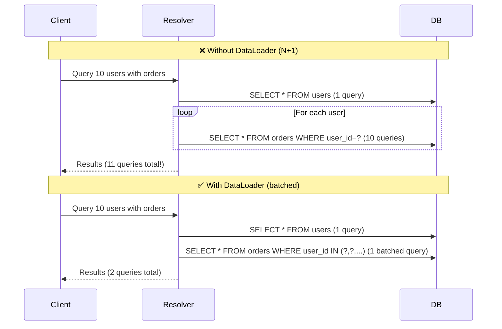

**Solution: DataLoader**

DataLoader batches and caches requests within a single request lifecycle.

```javascript
// JavaScript/TypeScript with DataLoader
const DataLoader = require('dataloader');

// Batch function: receives array of keys, returns array of values
async function batchLoadOrders(userIds) {
  const orders = await db.orders.findMany({
    where: { userId: { in: userIds } },
  });

  // Group orders by userId
  const ordersByUserId = userIds.map((id) => orders.filter((order) => order.userId === id));

  return ordersByUserId;
}

// Create loader (per-request instance)
const orderLoader = new DataLoader(batchLoadOrders);

// In resolver
const User = {
  orders: (user, args, context) => {
    // DataLoader automatically batches and deduplicates
    return context.loaders.orders.load(user.id);
  },
};
```

**Key principles**

- Create **one loader per request** (not singleton); attach to context
- Loaders batch requests made in the same tick
- Use loaders for all database/API lookups in nested resolvers
- Monitor query counts in development to catch N+1 early

---

## Pagination patterns

GraphQL supports multiple pagination styles; **Relay connections** are most robust.

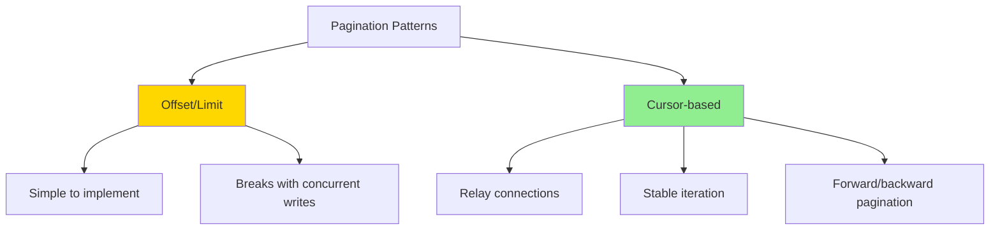

**Relay-style connections (recommended)**

```graphql
type Query {
  users(first: Int, after: String, last: Int, before: String): UserConnection!
}

type UserConnection {
  edges: [UserEdge!]!
  pageInfo: PageInfo!
  totalCount: Int
}

type UserEdge {
  node: User!
  cursor: String!
}

type PageInfo {
  hasNextPage: Boolean!
  hasPreviousPage: Boolean!
  startCursor: String
  endCursor: String
}
```

**Querying a connection**

```graphql
query ListUsers($first: Int!, $after: String) {
  users(first: $first, after: $after) {
    edges {
      node {
        id
        displayName
      }
      cursor
    }
    pageInfo {
      hasNextPage
      endCursor
    }
  }
}
```

**Offset/limit (simpler, less robust)**

```graphql
type Query {
  users(limit: Int, offset: Int): [User!]!
  usersCount: Int!
}
```

Use connections for public APIs and offset/limit for internal tools if simplicity is critical.

---

## Error handling

GraphQL has two error channels: **GraphQL errors** (top-level) and **user errors** (in payload).

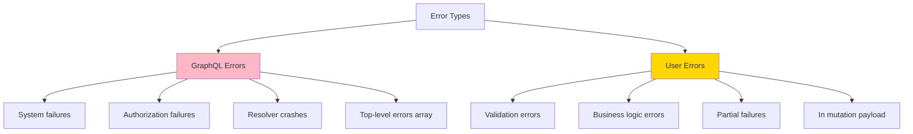

**Top-level GraphQL errors**

Used for technical/system failures.

```json
{
  "errors": [
    {
      "message": "Unauthorized",
      "locations": [{ "line": 2, "column": 3 }],
      "path": ["user"],
      "extensions": {
        "code": "UNAUTHENTICATED",
        "requestId": "req-123"
      }
    }
  ],
  "data": null
}
```

**User errors in payload**

Used for validation and business logic errors.

```json
{
  "data": {
    "createUser": {
      "user": null,
      "errors": [
        {
          "code": "INVALID_EMAIL",
          "message": "Email format is invalid",
          "field": "email"
        }
      ]
    }
  }
}
```

**Guidelines**

- Reserve **GraphQL errors** for unexpected failures (auth, permission, system errors)
- Use **payload errors** for expected validation/business errors
- Include **error codes** for programmatic handling
- Provide **field paths** to help clients highlight problematic inputs
- Log all errors with request IDs for tracing

---

## Security & authorization

GraphQL's flexibility creates security challenges; layer defenses carefully.

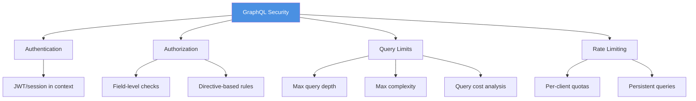

**Authentication**

- Authenticate at the **transport layer** (HTTP middleware)
- Attach user to **context**; resolvers access via `context.currentUser`

```javascript
// Express + Apollo Server
const server = new ApolloServer({
  typeDefs,
  resolvers,
  context: ({ req }) => {
    const user = authenticateUser(req.headers.authorization);
    return { user, loaders: createLoaders() };
  },
});
```

**Authorization**

- Check permissions **in resolvers** or via **directives**
- Use field-level authorization for sensitive data

```javascript
// Resolver-level auth
const Query = {
  user: (parent, { id }, context) => {
    if (!context.user) {
      throw new AuthenticationError('Not authenticated');
    }

    const user = db.users.findById(id);

    if (user.id !== context.user.id && !context.user.isAdmin) {
      throw new ForbiddenError('Not authorized');
    }

    return user;
  }
};

// Directive-based auth (schema definition)
type User @auth(requires: ADMIN) {
  id: ID!
  email: String! @auth(requires: USER)
  internalNotes: String @auth(requires: ADMIN)
}
```

**Query complexity & depth limiting**

Prevent malicious queries that request massive data or deep nesting.

```graphql
# ❌ Malicious deeply nested query
query Attack {
  user(id: "1") {
    friends {
      friends {
        friends {
          friends {
            # ... 50 levels deep
          }
        }
      }
    }
  }
}
```

**Defense strategies**

- **Max depth**: Limit query nesting (e.g., 7 levels)
- **Query complexity**: Assign costs to fields; reject expensive queries
- **Timeout**: Kill resolvers that run too long
- **Rate limiting**: Per-client request quotas
- **Persistent queries**: Allow only pre-registered queries in production

```javascript
// Apollo Server with complexity plugin
const server = new ApolloServer({
  typeDefs,
  resolvers,
  plugins: [
    complexityPlugin({
      maximumComplexity: 1000,
      onComplete: (complexity) => {
        console.log('Query complexity:', complexity);
      },
    }),
  ],
  validationRules: [depthLimit(7), createComplexityRule({ maximumComplexity: 1000 })],
});
```

---

## Caching strategies

GraphQL's flexibility complicates caching; use multiple layers.

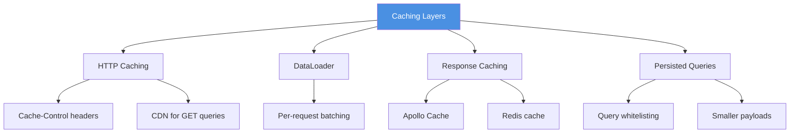

**HTTP caching (GET queries)**

- Use **GET requests** for cacheable queries (not POST)
- Set **Cache-Control** headers based on query
- Use **ETag** for conditional requests

```javascript
// Apollo Server with cache hints
const typeDefs = gql`
  type Query {
    user(id: ID!): User @cacheControl(maxAge: 60)
    publicPosts: [Post!]! @cacheControl(maxAge: 300)
  }
`;
```

**Application-level caching**

- Use **Redis** or in-memory cache for expensive computations
- Cache by query signature (hash of query + variables)
- Invalidate caches on mutations

**Client-side caching**

- Apollo Client/urql normalize responses by `id` and `__typename`
- Queries automatically use cached data when possible
- Mutations can update cache optimistically

**Persistent queries**

- Register queries ahead of time; clients send hash instead of full query
- Reduces payload size and enables query whitelisting

---

## Subscriptions: real-time updates

Subscriptions enable real-time data push over WebSocket.

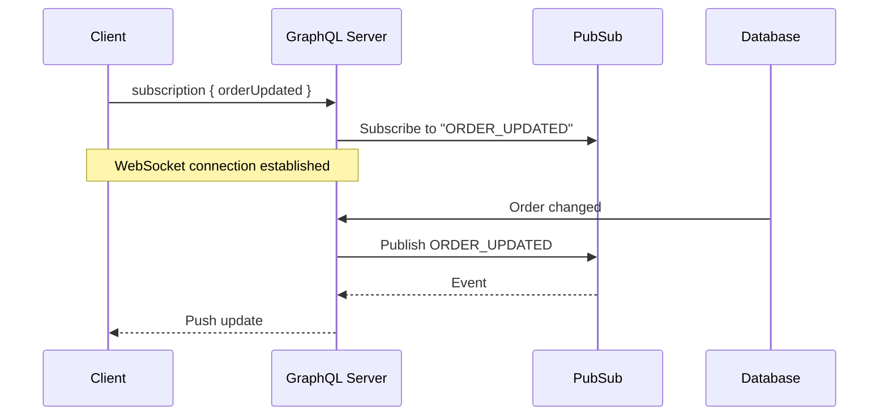

**Subscription schema**

```graphql
type Subscription {
  orderUpdated(userId: ID!): Order!

  messagePosted(channelId: ID!): Message!
}

type Mutation {
  updateOrder(id: ID!, input: UpdateOrderInput!): UpdateOrderPayload!
}
```

**Subscription resolver**

```javascript
// Server with PubSub
const { PubSub } = require('graphql-subscriptions');
const pubsub = new PubSub();

const ORDER_UPDATED = 'ORDER_UPDATED';

const Subscription = {
  orderUpdated: {
    subscribe: (parent, { userId }, context) => {
      // Authorize subscription
      if (!context.user || context.user.id !== userId) {
        throw new ForbiddenError('Not authorized');
      }

      return pubsub.asyncIterator([ORDER_UPDATED]);
    },
    resolve: (payload) => payload.order,
  },
};

const Mutation = {
  updateOrder: async (parent, { id, input }, context) => {
    const order = await db.orders.update({ id, ...input });

    // Publish event
    pubsub.publish(ORDER_UPDATED, { order });

    return { order };
  },
};
```

**Client subscription (Apollo)**

```javascript
import { gql, useSubscription } from '@apollo/client';

const ORDER_UPDATED_SUBSCRIPTION = gql`
  subscription OnOrderUpdated($userId: ID!) {
    orderUpdated(userId: $userId) {
      id
      status
      total
    }
  }
`;

function OrderStatusWidget({ userId }) {
  const { data, loading } = useSubscription(ORDER_UPDATED_SUBSCRIPTION, { variables: { userId } });

  if (loading) return <div>Connecting...</div>;

  return (
    <div>
      Order {data.orderUpdated.id}: {data.orderUpdated.status}
    </div>
  );
}
```

**Best practices**

- Authorize subscriptions in `subscribe` resolver
- Use **filtered subscriptions** (don't broadcast everything to everyone)
- Use **Redis PubSub** or similar for multi-server deployments
- Set connection limits and heartbeat/timeout mechanisms
- Consider alternatives (polling, webhooks) if WebSocket overhead is high

---

## Versioning & schema evolution

GraphQL schemas evolve; avoid breaking changes.

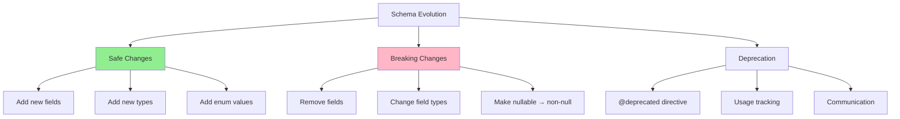

**Safe changes (backward-compatible)**

- ✅ Add new types
- ✅ Add new fields to existing types
- ✅ Add new optional arguments
- ✅ Add new enum values
- ✅ Add new queries/mutations/subscriptions

**Breaking changes (avoid!)**

- ❌ Remove fields or types
- ❌ Rename fields or types
- ❌ Change field type (e.g., `String` → `Int`)
- ❌ Make nullable field non-null (`String` → `String!`)
- ❌ Remove enum values
- ❌ Add required arguments to existing fields

**Deprecation workflow**

```graphql
type User {
  id: ID!

  """
  @deprecated Use displayName instead
  """
  name: String @deprecated(reason: "Use displayName instead")

  displayName: String!
}
```

**Process**

1. Add new field alongside old field
2. Mark old field `@deprecated` with reason
3. Track usage of deprecated fields (analytics/logging)
4. Communicate timeline to clients
5. Remove deprecated field only after usage drops to zero

**Avoid versioning in URL**

- Unlike REST (`/v1/users`), GraphQL schemas evolve in place
- If you must have breaking changes, consider separate schemas or use **schema stitching**

---

## Documentation & introspection

GraphQL is self-documenting via introspection; leverage it.

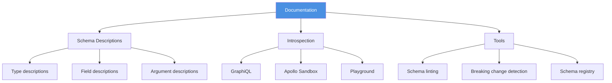

**Write rich descriptions**

```graphql
"""
A user account in the system.
Users can place orders, manage profiles, and interact with other users.
"""
type User {
  """
  Unique identifier for the user
  """
  id: ID!

  """
  User's email address.
  Must be unique and validated.
  """
  email: String!

  """
  User's display name.
  May be null for newly created users who haven't completed onboarding.
  """
  displayName: String

  """
  All orders placed by this user.
  Results are paginated using cursor-based pagination.
  """
  orders(
    """
    Maximum number of orders to return (default: 20, max: 100)
    """
    first: Int

    """
    Cursor for pagination
    """
    after: String

    """
    Filter by order status
    """
    status: OrderStatus
  ): OrderConnection!
}
```

**Enable introspection in development**

```javascript
const server = new ApolloServer({
  typeDefs,
  resolvers,
  introspection: process.env.NODE_ENV !== 'production',
  playground: process.env.NODE_ENV !== 'production',
});
```

**Schema tooling**

- **GraphQL Code Generator**: Generate TypeScript types from schema
- **GraphQL Inspector**: Detect breaking changes in CI
- **Apollo Studio**: Schema registry and usage analytics
- **Spectaql**: Generate static documentation

---

## Testing strategies

Test schemas, resolvers, and integration points.

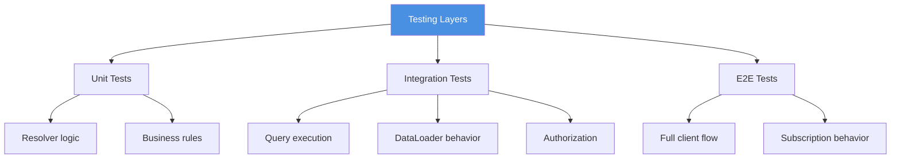

**Unit test resolvers**

```javascript
// Jest example
describe('User resolver', () => {
  it('returns user by id', async () => {
    const user = { id: '1', email: 'test@example.com' };
    const mockDb = { users: { findById: jest.fn().mockResolvedValue(user) } };

    const result = await resolvers.Query.user(null, { id: '1' }, { db: mockDb, user: { id: '1' } });

    expect(result).toEqual(user);
    expect(mockDb.users.findById).toHaveBeenCalledWith('1');
  });

  it('throws when unauthorized', async () => {
    await expect(resolvers.Query.user(null, { id: '2' }, { user: null })).rejects.toThrow('Not authenticated');
  });
});
```

**Integration test queries**

```javascript
import { createTestClient } from 'apollo-server-testing';
import { ApolloServer } from 'apollo-server';

describe('GraphQL API', () => {
  it('fetches user with orders', async () => {
    const server = new ApolloServer({
      typeDefs,
      resolvers,
      context: () => ({ user: { id: '1' }, loaders: createLoaders() }),
    });

    const { query } = createTestClient(server);

    const GET_USER = gql`
      query GetUser($id: ID!) {
        user(id: $id) {
          id
          displayName
          orders(first: 5) {
            edges {
              node {
                id
              }
            }
          }
        }
      }
    `;

    const res = await query({
      query: GET_USER,
      variables: { id: '1' },
    });

    expect(res.errors).toBeUndefined();
    expect(res.data.user.id).toBe('1');
  });
});
```

**Test coverage priorities**

1. Authorization checks on sensitive fields
2. N+1 query detection (monitor query counts in tests)
3. Error handling (validation, business logic)
4. Pagination edge cases (empty lists, boundaries)
5. Subscription lifecycle (connect, update, disconnect)

---

## Team checklist

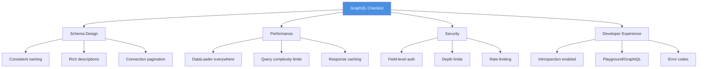

1. Follow **naming conventions**: PascalCase types, camelCase fields
2. Use **non-null** deliberately; prefer nullable by default
3. Use **Input types** for mutations
4. Return **payload types** with errors for mutations
5. Implement **DataLoader** to prevent N+1 queries
6. Use **connections** for pagination (Relay spec)
7. Check **authorization** at field level
8. Limit **query depth** and **complexity**
9. Document every type, field, and argument
10. Use **@deprecated** for evolution, not versioning in URL
11. Enable **introspection** in dev; disable in production
12. Test resolvers, authorization, and N+1 prevention
13. Monitor query performance and complexity in production
14. Use **schema registry** to track changes

---

## Further reading

### Official Resources

- [GraphQL Specification](https://spec.graphql.org/) — The official spec
- [GraphQL Best Practices](https://graphql.org/learn/best-practices/) — Official guidance from the GraphQL Foundation
- [Relay Cursor Connections Specification](https://relay.dev/graphql/connections.htm) — Pagination standard

### Tools & Libraries

- [Apollo Server](https://www.apollographql.com/docs/apollo-server/) — Production-ready GraphQL server
- [DataLoader](https://github.com/graphql/dataloader) — Batching and caching utility
- [GraphQL Code Generator](https://the-guild.dev/graphql/codegen) — Generate types and code from schema
- [GraphQL Inspector](https://graphql-inspector.com/) — Detect breaking changes
- [graphql-shield](https://github.com/dimatill/graphql-shield) — Permissions middleware

### Articles & Guides

- [Production Ready GraphQL](https://book.productionreadygraphql.com/) — Comprehensive book on GraphQL in production
- [Apollo Blog: GraphQL Best Practices](https://www.apollographql.com/blog/graphql-best-practices/) — Real-world
  patterns
- [Shopify GraphQL Design Tutorial](https://shopify.engineering/shopify-graphql-design-tutorial) — Design principles
  from Shopify

---

## Key takeaways

1. **Schema is contract** — Design for evolution with nullable defaults, deprecation, and rich documentation.

2. **Solve N+1 early** — DataLoader is non-negotiable for production; batch and cache all data access.

3. **Use connections for pagination** — Relay-style edges/nodes/PageInfo is verbose but robust.

4. **Layer authorization** — Check permissions in resolvers or directives; never trust client queries.

5. **Limit query complexity** — Malicious clients can craft expensive queries; defend with depth and complexity limits.

6. **Two error channels** — Use top-level GraphQL errors for system failures; use payload errors for validation/business
   logic.

7. **Cache thoughtfully** — HTTP caching for public queries, DataLoader for per-request, Redis for application-level.

8. **Document everything** — GraphQL is self-documenting; use descriptions generously.

9. **Test authorization** — Every sensitive field needs an authorization test.

10. **Evolve, don't version** — Add fields, deprecate old ones; avoid `/v1/graphql` and `/v2/graphql`.

Remember: GraphQL gives clients power; your job is to make that power safe, fast, and delightful.
