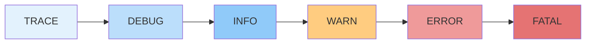
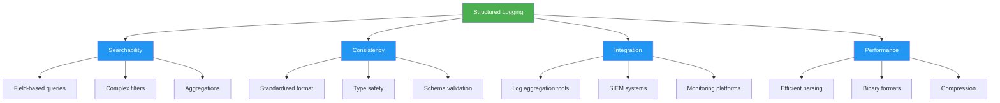
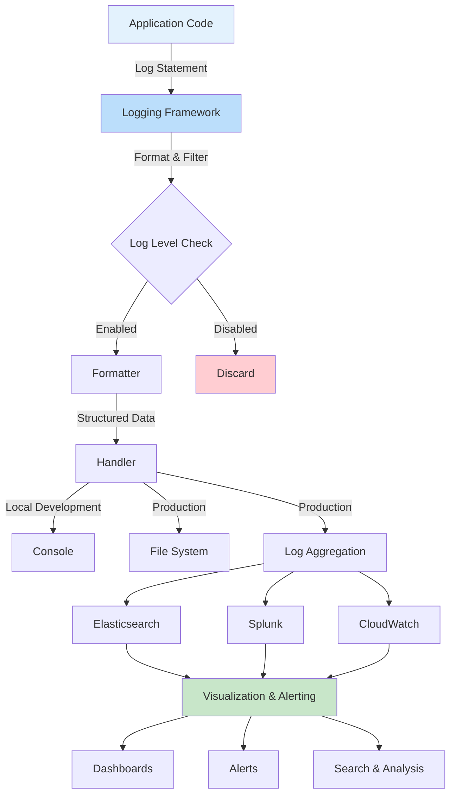
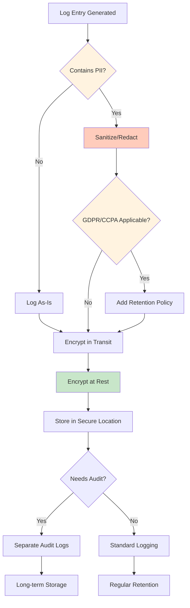

import LoggingImage from '/img/undraw_data_reports.svg';

<div className="text--center margin-bottom--lg">
  <LoggingImage width="80%" height="300px" />
</div>

Logging is a fundamental practice in software development that provides visibility into application behavior,
performance, and errors. Effective logging enables developers to monitor systems, diagnose issues, audit activities, and
understand user behavior. However, poor logging practices can lead to performance degradation, security vulnerabilities,
and overwhelming amounts of useless data. This chapter explores logging best practices, patterns, and techniques to help
you build observable and maintainable systems.

## Why Logging Matters

Logging serves multiple critical purposes in modern software development:

- **Debugging and Troubleshooting:** Logs provide a historical record of application behavior, making it easier to
  diagnose issues in production environments where debuggers cannot be attached.
- **Monitoring and Alerting:** Structured logs enable automated monitoring systems to detect anomalies, trigger alerts,
  and provide real-time visibility into system health.
- **Audit and Compliance:** Many industries require audit trails of user actions and system events for regulatory
  compliance and security purposes.
- **Performance Analysis:** Logs can reveal performance bottlenecks, slow queries, and resource utilization patterns.
- **User Behavior Insights:** Application logs help understand how users interact with your system, informing product
  decisions and improvements.

## Log Levels

Log levels categorize the severity and importance of log messages. Using appropriate log levels helps filter and
prioritize information during development and production operations.



### TRACE

The most granular level of logging, used for extremely detailed diagnostic information. TRACE logs are typically only
enabled during development or intensive debugging sessions.

**Use cases:**

- Following the exact flow of execution through complex logic
- Logging every iteration in a loop
- Tracking method entry and exit points

**Example:**

```javascript
logger.trace('Entering calculateDiscount() with params:', { userId, cartTotal });
```

:::caution Performance Impact

TRACE logging can significantly impact performance. Only use in non-production environments or enable temporarily for
specific debugging scenarios.

:::

### DEBUG

Detailed information useful for diagnosing problems during development and testing. DEBUG logs provide context about
application state and variable values.

**Use cases:**

- Logging configuration values at startup
- Recording intermediate calculation results
- Tracking API request/response details

**Example:**

```python
logger.debug(f"Processing order {order_id} with {len(items)} items")
logger.debug(f"Cache hit for user {user_id}: {cached_data}")
```

### INFO

General informational messages that highlight the progress of the application at a coarse-grained level. INFO logs
represent normal application behavior.

**Use cases:**

- Application startup and shutdown messages
- Significant state changes or milestones
- Successful completion of major operations

**Example:**

```java
logger.info("Database connection pool initialized with {} connections", poolSize);
logger.info("User {} successfully logged in", username);
logger.info("Payment processed successfully for order {}", orderId);
```

### WARN

Potentially harmful situations that don't prevent the application from functioning but indicate unexpected behavior or
deprecated usage.

**Use cases:**

- Deprecated API usage
- Configuration issues that have fallbacks
- Recoverable errors
- Performance degradation warnings

**Example:**

```javascript
logger.warn('API rate limit approaching threshold', { current: 950, limit: 1000 });
logger.warn('Using deprecated configuration format. Please update to new format.');
```

### ERROR

Error events that might still allow the application to continue running. ERROR logs indicate something went wrong but
the application can recover.

**Use cases:**

- Failed API calls with retry logic
- Validation failures
- Handled exceptions
- Failed operations that don't crash the application

**Example:**

```python
logger.error(f"Failed to send email notification to {email}", exc_info=True)
logger.error(f"Payment gateway timeout for order {order_id}, will retry")
```

### FATAL/CRITICAL

Severe error events that lead to application termination or critical system failures. These logs indicate the
application cannot continue functioning.

**Use cases:**

- Unrecoverable database connection failures
- Critical configuration errors
- Out of memory conditions
- Security breaches

**Example:**

```java
logger.fatal("Cannot start application: required environment variable DATABASE_URL not set");
logger.fatal("Critical security violation detected: unauthorized access attempt", exception);
```

## Structured Logging

Structured logging formats log messages as structured data (typically JSON) rather than plain text strings. This
approach makes logs machine-readable and enables powerful querying, filtering, and analysis.

### Benefits of Structured Logging



### Plain Text vs Structured Logging

**❌ Plain Text Logging (Avoid):**

```javascript
logger.info('User john.doe@example.com logged in from IP 192.168.1.100 at 2025-10-19T10:30:00');
```

This format is hard to parse, search, and analyze. Extracting specific fields requires complex regular expressions.

**✅ Structured Logging (Recommended):**

```javascript
logger.info('User logged in', {
  event: 'user_login',
  userId: '12345',
  email: 'john.doe@example.com',
  ipAddress: '192.168.1.100',
  timestamp: '2025-10-19T10:30:00Z',
  userAgent: 'Mozilla/5.0...',
});
```

This format allows easy filtering, searching, and aggregation: "Show me all failed logins from this IP address in the
last hour."

### Structured Logging Best Practices

**1. Use Consistent Field Names**

Establish naming conventions across your organization:

```javascript
// ✅ Good: Consistent naming
logger.info('Operation completed', {
  userId: '12345',
  orderId: 'ORD-789',
  duration_ms: 342,
  result: 'success',
});

// ❌ Bad: Inconsistent naming
logger.info('Operation completed', {
  user_id: '12345', // Inconsistent with userId
  order: 'ORD-789', // Should be orderId
  time: 342, // Unclear units
  status: 'success', // Inconsistent with result
});
```

**2. Include Context Fields**

Add contextual information to help correlate logs:

```python
logger.info(
    "Processing payment",
    extra={
        "request_id": "req-abc123",  # Trace across services
        "user_id": "12345",
        "order_id": "ORD-789",
        "amount": 99.99,
        "currency": "USD",
        "payment_method": "credit_card",
        "environment": "production",
        "service": "payment-service",
        "version": "1.2.3",
    }
)
```

**3. Use Appropriate Data Types**

```javascript
// ✅ Good: Proper types
logger.info('Order placed', {
  orderId: 'ORD-123',
  totalAmount: 99.99, // Number, not string
  itemCount: 3, // Number, not string
  timestamp: new Date().toISOString(), // ISO 8601 format
  isGift: true, // Boolean, not string
});

// ❌ Bad: Everything as strings
logger.info('Order placed', {
  orderId: 'ORD-123',
  totalAmount: '99.99', // Should be number
  itemCount: '3', // Should be number
  timestamp: 'Oct 19, 2025', // Non-standard format
  isGift: 'yes', // Should be boolean
});
```

## Logging Workflow and Integration

Understanding where and how logs flow through your system is crucial for effective observability.



## Best Practices

### 1. Log at Appropriate Levels

Choose the correct log level based on the information's importance and your intended audience.

```javascript
// ✅ Good: Appropriate levels
logger.info('User registration completed', { userId: newUser.id });
logger.warn('Password reset token expires in 5 minutes', { userId: user.id });
logger.error('Failed to process payment', { orderId, error: err.message });

// ❌ Bad: Wrong levels
logger.error('User logged in'); // Not an error
logger.info('Database connection failed'); // Should be ERROR
logger.debug('Application starting'); // Should be INFO
```

### 2. Include Relevant Context

Provide enough information to understand and act on the log without cluttering it with unnecessary details.

```python
# ✅ Good: Balanced context
logger.error(
    "Payment processing failed",
    extra={
        "order_id": order.id,
        "user_id": order.user_id,
        "amount": order.total,
        "payment_gateway": "stripe",
        "error_code": error.code,
        "error_message": error.message,
    }
)

# ❌ Bad: Too little context
logger.error("Payment failed")

# ❌ Bad: Too much context (sensitive data, huge objects)
logger.error("Payment failed", extra={"order": order.__dict__, "user": user.__dict__, "card": card_details})
```

### 3. Use Correlation IDs

Track requests across distributed systems using correlation or trace IDs.

```javascript
const express = require('express');
const { v4: uuidv4 } = require('uuid');

app.use((req, res, next) => {
  // Generate or extract correlation ID
  req.correlationId = req.headers['x-correlation-id'] || uuidv4();

  // Add to response headers for debugging
  res.setHeader('x-correlation-id', req.correlationId);

  // Add to logger context
  req.log = logger.child({ correlationId: req.correlationId });

  next();
});

app.post('/api/orders', (req, res) => {
  req.log.info('Creating order', { customerId: req.body.customerId });
  // All subsequent logs will include correlationId
});
```

### 4. Avoid Logging Sensitive Information

Never log passwords, credit card numbers, authentication tokens, or other sensitive data.

```python
# ❌ Bad: Logging sensitive data
logger.info(f"User login attempt", extra={
    "username": username,
    "password": password,  # Never log passwords!
    "credit_card": card_number,  # Never log full card numbers!
})

# ✅ Good: Sanitized logging
logger.info(f"User login attempt", extra={
    "username": username,
    "ip_address": request.remote_addr,
})

# ✅ Good: Partial/masked data when necessary
logger.info("Payment processed", extra={
    "last_4_digits": card_number[-4:],
    "card_type": card_type,
})
```

### 5. Don't Log in Loops (Usually)

Logging inside tight loops can generate enormous log volumes and hurt performance.

```javascript
// ❌ Bad: Logging inside loop
users.forEach((user) => {
  logger.debug('Processing user', { userId: user.id }); // Could generate millions of logs
  processUser(user);
});

// ✅ Good: Aggregate logging
logger.info('Processing user batch', { count: users.length });
const results = users.map(processUser);
logger.info('User batch completed', {
  total: users.length,
  successful: results.filter((r) => r.success).length,
  failed: results.filter((r) => !r.success).length,
});

// ✅ Acceptable: Log warnings/errors only
users.forEach((user) => {
  try {
    processUser(user);
  } catch (error) {
    logger.error('Failed to process user', { userId: user.id, error: error.message });
  }
});
```

### 6. Use Log Sampling for High-Volume Events

For extremely high-traffic scenarios, implement sampling to reduce log volume.

```javascript
// Sample 1% of requests
const SAMPLE_RATE = 0.01;

app.use((req, res, next) => {
  const shouldLog = Math.random() < SAMPLE_RATE;

  if (shouldLog) {
    req.log.info('Request sampled', {
      method: req.method,
      path: req.path,
      sampled: true,
    });
  }

  next();
});
```

### 7. Log Errors with Stack Traces

Include stack traces for errors to aid debugging.

```python
try:
    result = risky_operation()
except Exception as e:
    logger.error(
        "Operation failed",
        extra={
            "operation": "risky_operation",
            "error_type": type(e).__name__,
            "error_message": str(e),
        },
        exc_info=True  # Include stack trace
    )
```

### 8. Use Async Logging for Performance

In high-performance systems, use asynchronous logging to avoid blocking application threads.

```javascript
// Using async logging library
const pino = require('pino');

const logger = pino({
  transport: {
    target: 'pino/file',
    options: {
      destination: '/var/log/app.log',
      mkdir: true,
    },
  },
});

// Non-blocking logging
logger.info('High throughput event', { eventId: 12345 });
```

## Security Considerations

### Data Privacy and Compliance



### Log Injection Prevention

Protect against log injection attacks where malicious input is crafted to pollute or manipulate logs.

```javascript
// ❌ Vulnerable: User input directly in log message
logger.info(`User search: ${userInput}`);
// If userInput = "test\n[ERROR] System compromised"
// Logs show: User search: test
//            [ERROR] System compromised

// ✅ Safe: Structured logging with sanitization
logger.info('User search', {
  query: sanitize(userInput),
  userId: user.id,
});

function sanitize(input) {
  // Remove control characters and newlines
  return input.replace(/[\n\r\t]/g, ' ').substring(0, 500);
}
```

### Access Control

Implement proper access controls for log files:

```bash
# Set restrictive permissions on log files
chmod 640 /var/log/app/*.log
chown appuser:loggroup /var/log/app/*.log

# Use log rotation with proper permissions
# /etc/logrotate.d/app
/var/log/app/*.log {
    daily
    rotate 14
    compress
    delaycompress
    create 0640 appuser loggroup
    notifempty
}
```

## Common Anti-Patterns

### 1. Logging Without Purpose

```javascript
// ❌ Bad: Meaningless logs
logger.info('Here');
logger.debug('Test');
logger.info('Function called');
```

### 2. Excessive Logging

```javascript
// ❌ Bad: Too verbose
logger.debug('Entering function');
logger.debug('Checking condition');
logger.debug('Condition is true');
logger.debug('Executing logic');
logger.debug('Logic complete');
logger.debug('Exiting function');
```

### 3. Inconsistent Format

```javascript
// ❌ Bad: Inconsistent styles
logger.info('user logged in');
logger.info('USER_LOGOUT');
logger.info('Order Created Successfully!');
logger.info('payment_processed');
```

### 4. Missing Error Context

```javascript
// ❌ Bad: No context
try {
  await processPayment(orderId);
} catch (error) {
  logger.error(error.message); // Lost stack trace and context
}

// ✅ Good: Complete error context
try {
  await processPayment(orderId);
} catch (error) {
  logger.error('Payment processing failed', {
    orderId,
    userId,
    error: error.message,
    stack: error.stack,
  });
}
```

## Logging in Different Environments

### Development

```javascript
const logger = createLogger({
  level: 'debug',
  format: combine(
    colorize(),
    timestamp(),
    printf(({ timestamp, level, message, ...meta }) => {
      return `${timestamp} ${level}: ${message} ${JSON.stringify(meta)}`;
    })
  ),
  transports: [new transports.Console()],
});
```

### Production

```javascript
const logger = createLogger({
  level: process.env.LOG_LEVEL || 'info',
  format: combine(timestamp(), errors({ stack: true }), json()),
  transports: [
    new transports.File({ filename: 'error.log', level: 'error' }),
    new transports.File({ filename: 'combined.log' }),
  ],
});
```

## Monitoring and Alerting

Set up alerts based on log patterns:

```yaml
# Example: Alert when error rate exceeds threshold
- alert: HighErrorRate
  expr: |
    rate(log_messages{level="error"}[5m]) > 10
  for: 5m
  annotations:
    summary: 'High error rate detected'
    description: 'Error rate is {{ $value }} errors/sec'
```

## Conclusion

Effective logging is a critical skill that requires balancing information needs with performance, security, and
maintainability. Key takeaways:

- **Use appropriate log levels** to categorize information by severity
- **Implement structured logging** for machine-readable, queryable logs
- **Include contextual information** like correlation IDs and relevant business data
- **Protect sensitive data** through sanitization and redaction
- **Optimize performance** with async logging and sampling for high-volume scenarios
- **Monitor and alert** on log patterns to detect issues proactively

Remember that logs are a form of documentation for your running system. Write logs with the future debugger in mind—it
might be you at 3 AM troubleshooting a production incident. Invest time in building a solid logging strategy early, and
it will pay dividends throughout your application's lifetime.

## Further Reading

- [The Twelve-Factor App: Logs](https://12factor.net/logs)
- [Structured Logging Best Practices](https://engineering.linkedin.com/distributed-systems/log-what-every-software-engineer-should-know-about-real-time-datas-unifying)
- [OWASP Logging Cheat Sheet](https://cheatsheetseries.owasp.org/cheatsheets/Logging_Cheat_Sheet.html)
- [Google Cloud Logging Best Practices](https://cloud.google.com/logging/docs/best-practices)
