import MicroservicesImage from '/img/undraw_cloud_hosting.svg';

<div className="text--center margin-bottom--lg">
  <MicroservicesImage width="80%" height="300px" />
</div>

Microservices architecture is an approach to software development where applications are built as a collection of small,
independent services that communicate over well-defined APIs. Each service is focused on a specific business capability,
can be developed and deployed independently, and is owned by a small team. This chapter explores microservices patterns,
best practices, and considerations for building distributed systems.

## What Are Microservices?

Microservices architecture decomposes applications into loosely coupled services, each responsible for a specific
business function. Unlike monolithic architectures where all components are interconnected and deployed together,
microservices allow teams to develop, deploy, and scale services independently.

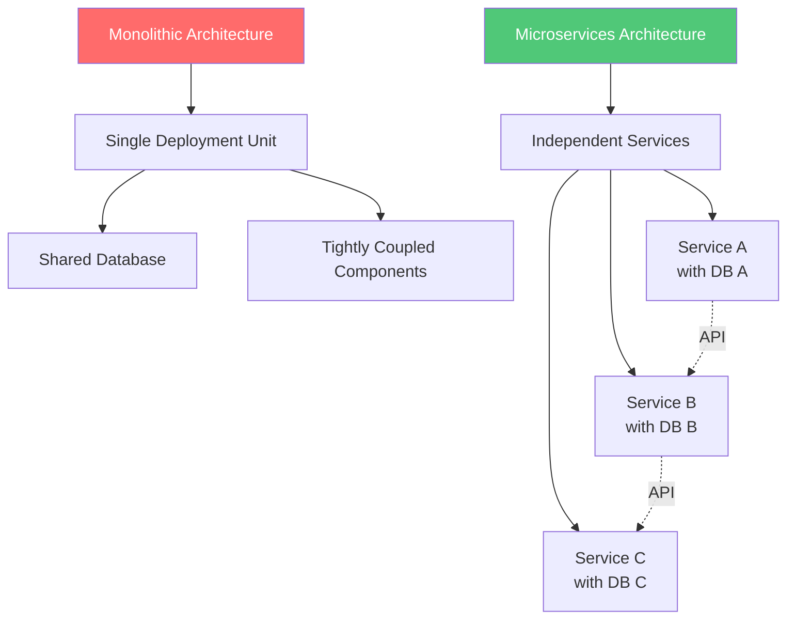

### Key Characteristics

1. **Business Capability Focus**: Each service encapsulates a specific business domain
2. **Independent Deployment**: Services can be deployed without affecting others
3. **Decentralized Data Management**: Each service owns its data
4. **Technology Diversity**: Different services can use different tech stacks
5. **Failure Isolation**: Failures in one service don't cascade to others
6. **Autonomous Teams**: Small teams can own services end-to-end

## When to Use Microservices

### Good Candidates

✅ **Large, complex applications** with multiple business domains

✅ **Growing teams** where coordination overhead becomes problematic

✅ **Different scaling requirements** for different features

✅ **Need for technology diversity** across teams

✅ **Frequent, independent deployments** are required

✅ **Clear domain boundaries** exist in your business logic

### Poor Candidates

❌ **Small applications** with limited complexity

❌ **Early-stage startups** still finding product-market fit

❌ **Limited team capacity** to manage distributed systems

❌ **Unclear domain boundaries** in your business

❌ **Tight coupling** between features makes separation difficult

❌ **Performance-critical applications** with low-latency requirements

:::warning

Starting with microservices adds significant operational complexity. Consider beginning with a well-structured monolith
and extracting services as needs become clear.

:::

## Microservices Design Principles

### 1. Single Responsibility Principle

Each microservice should focus on one business capability and do it well.

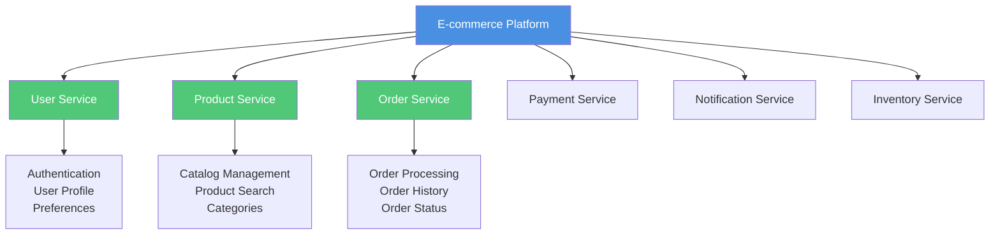

### 2. Decentralized Data Management

Each service manages its own database. No shared databases between services.

```javascript
// Bad: Shared database access
class OrderService {
  async createOrder(userId, items) {
    // Directly accessing users table from order service
    const user = await db.query('SELECT * FROM users WHERE id = ?', [userId]);
    const order = await db.query('INSERT INTO orders...', [userId, items]);
    return order;
  }
}

// Good: Service communication via API
class OrderService {
  constructor(userServiceClient) {
    this.userServiceClient = userServiceClient;
  }

  async createOrder(userId, items) {
    // Call User Service API
    const user = await this.userServiceClient.getUser(userId);

    // Manage only order data
    const order = await this.orderRepository.create({
      userId: user.id,
      items,
      createdAt: new Date(),
    });

    return order;
  }
}
```

### 3. API-First Design

Design clear, versioned APIs for service communication.

```javascript
// User Service API Contract
/**
 * @api {get} /v1/users/:id Get User
 * @apiVersion 1.0.0
 * @apiName GetUser
 * @apiGroup User
 *
 * @apiParam {String} id User's unique ID
 *
 * @apiSuccess {String} id User ID
 * @apiSuccess {String} email User email
 * @apiSuccess {String} name User name
 * @apiSuccess {Object} preferences User preferences
 *
 * @apiError {Object} 404 User not found
 * @apiError {Object} 500 Internal server error
 */

// Implementation
class UserServiceAPI {
  async getUser(req, res) {
    try {
      const { id } = req.params;
      const user = await this.userRepository.findById(id);

      if (!user) {
        return res.status(404).json({
          error: 'User not found',
          code: 'USER_NOT_FOUND',
        });
      }

      res.json({
        id: user.id,
        email: user.email,
        name: user.name,
        preferences: user.preferences,
      });
    } catch (error) {
      console.error('Error fetching user:', error);
      res.status(500).json({
        error: 'Internal server error',
        code: 'INTERNAL_ERROR',
      });
    }
  }
}
```

### 4. Resilience and Fault Tolerance

Design for failure. Services should handle failures gracefully.

```javascript
// Circuit Breaker Pattern Implementation
class CircuitBreaker {
  constructor(service, threshold = 5, timeout = 60000) {
    this.service = service;
    this.failureThreshold = threshold;
    this.timeout = timeout;
    this.failureCount = 0;
    this.lastFailureTime = null;
    this.state = 'CLOSED'; // CLOSED, OPEN, HALF_OPEN
  }

  async call(method, ...args) {
    if (this.state === 'OPEN') {
      if (Date.now() - this.lastFailureTime > this.timeout) {
        this.state = 'HALF_OPEN';
      } else {
        throw new Error('Circuit breaker is OPEN');
      }
    }

    try {
      const result = await this.service[method](...args);
      this.onSuccess();
      return result;
    } catch (error) {
      this.onFailure();
      throw error;
    }
  }

  onSuccess() {
    this.failureCount = 0;
    this.state = 'CLOSED';
  }

  onFailure() {
    this.failureCount++;
    this.lastFailureTime = Date.now();

    if (this.failureCount >= this.failureThreshold) {
      this.state = 'OPEN';
    }
  }
}

// Usage
const userServiceBreaker = new CircuitBreaker(userServiceClient);

async function getUser(userId) {
  try {
    return await userServiceBreaker.call('getUser', userId);
  } catch (error) {
    // Fallback to cached data or default response
    return getCachedUser(userId) || { id: userId, name: 'Unknown' };
  }
}
```

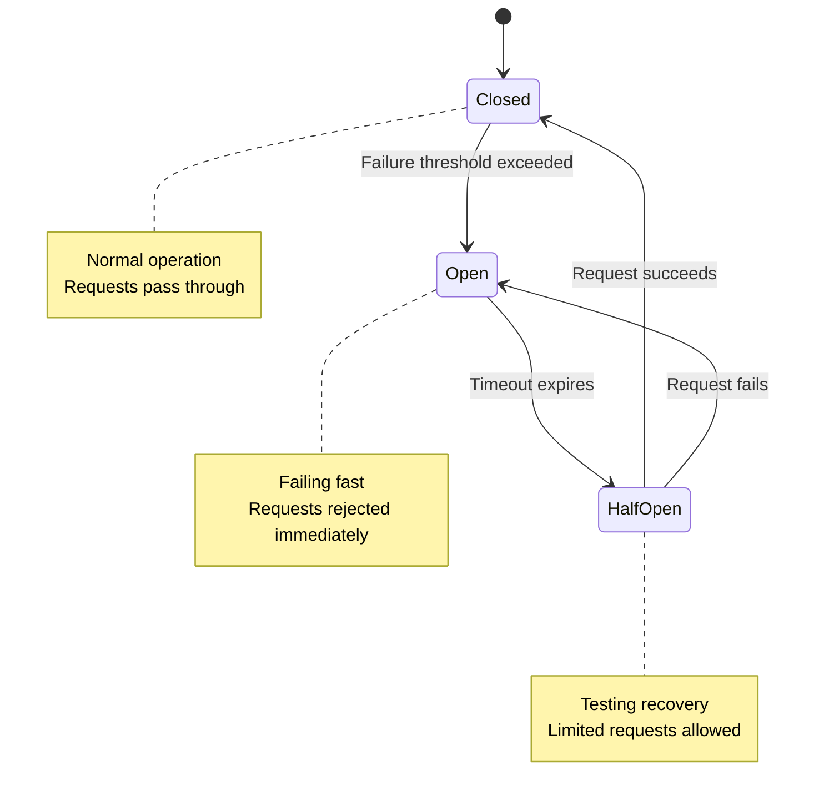

## Communication Patterns

### Synchronous Communication

Services communicate via direct HTTP/gRPC calls.

```javascript
// REST API Communication
class OrderService {
  async createOrder(userId, items) {
    // Synchronous call to User Service
    const user = await fetch(`${USER_SERVICE_URL}/users/${userId}`).then((res) => res.json());

    // Synchronous call to Inventory Service
    const availability = await fetch(`${INVENTORY_SERVICE_URL}/check`, {
      method: 'POST',
      body: JSON.stringify({ items }),
    }).then((res) => res.json());

    if (!availability.allAvailable) {
      throw new Error('Some items are out of stock');
    }

    // Create order
    const order = await this.orderRepository.create({
      userId,
      items,
      status: 'PENDING',
    });

    return order;
  }
}
```

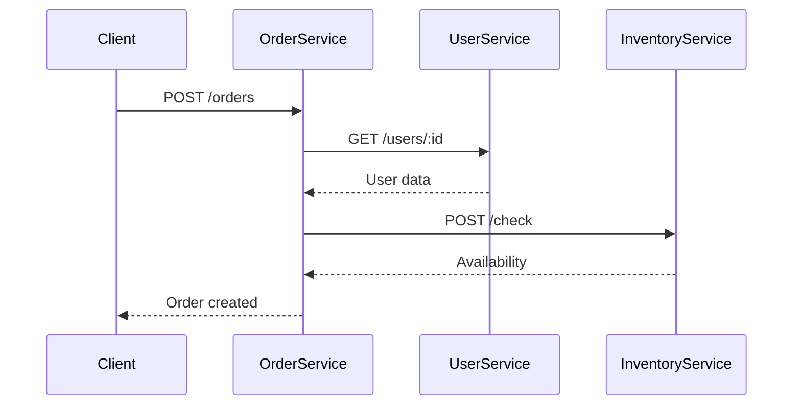

**Pros**: Simple, easy to debug, immediate response **Cons**: Tight coupling, cascading failures, latency accumulation

### Asynchronous Communication

Services communicate via message queues or event streams.

```javascript
// Event-Driven Architecture with Message Queue
class OrderService {
  constructor(messageQueue) {
    this.messageQueue = messageQueue;
  }

  async createOrder(userId, items) {
    // Create order optimistically
    const order = await this.orderRepository.create({
      userId,
      items,
      status: 'PENDING',
    });

    // Publish event for other services
    await this.messageQueue.publish('order.created', {
      orderId: order.id,
      userId,
      items,
      timestamp: new Date(),
    });

    return order;
  }
}

// Inventory Service subscribes to order events
class InventoryService {
  constructor(messageQueue) {
    this.messageQueue = messageQueue;
    this.subscribeToEvents();
  }

  subscribeToEvents() {
    this.messageQueue.subscribe('order.created', async (event) => {
      const { orderId, items } = event;

      try {
        await this.reserveInventory(items);

        // Publish success event
        await this.messageQueue.publish('inventory.reserved', {
          orderId,
          status: 'RESERVED',
        });
      } catch (error) {
        // Publish failure event
        await this.messageQueue.publish('inventory.reservation_failed', {
          orderId,
          error: error.message,
        });
      }
    });
  }
}
```

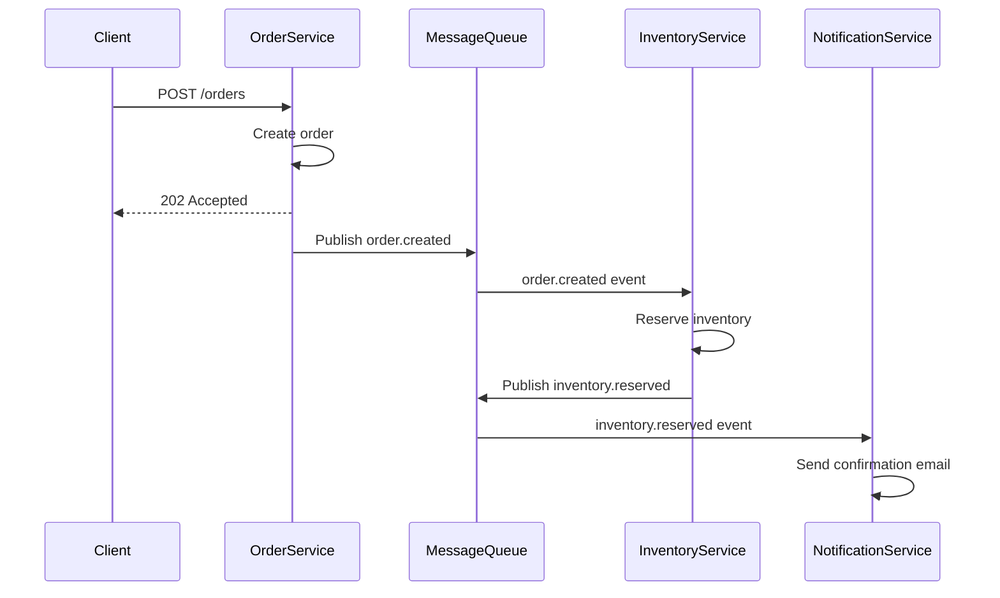

**Pros**: Loose coupling, better scalability, resilience **Cons**: Eventual consistency, complex debugging, message
ordering challenges

### API Gateway Pattern

Centralized entry point for client requests that routes to appropriate services.

```javascript
// API Gateway Implementation
class APIGateway {
  constructor() {
    this.routes = new Map();
    this.rateLimiter = new RateLimiter();
    this.authService = new AuthService();
  }

  registerRoute(path, service) {
    this.routes.set(path, service);
  }

  async handleRequest(req, res) {
    // Authentication
    const user = await this.authService.authenticate(req.headers.authorization);
    if (!user) {
      return res.status(401).json({ error: 'Unauthorized' });
    }

    // Rate limiting
    if (!this.rateLimiter.allow(user.id)) {
      return res.status(429).json({ error: 'Too many requests' });
    }

    // Route to appropriate service
    const service = this.findService(req.path);
    if (!service) {
      return res.status(404).json({ error: 'Service not found' });
    }

    try {
      const result = await service.handleRequest(req);
      res.json(result);
    } catch (error) {
      res.status(500).json({ error: 'Internal server error' });
    }
  }

  findService(path) {
    for (const [route, service] of this.routes) {
      if (path.startsWith(route)) {
        return service;
      }
    }
    return null;
  }
}
```

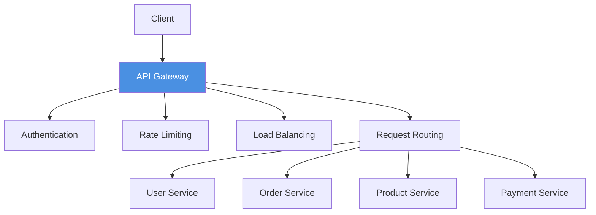

## Data Management Strategies

### Database per Service

Each microservice has its own database, ensuring loose coupling.

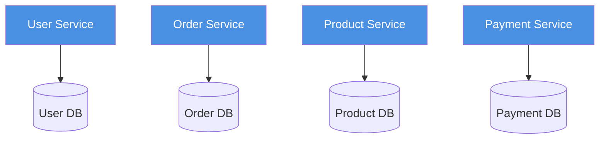

### Saga Pattern

Manage distributed transactions across multiple services.

```javascript
// Order Saga - Coordinating distributed transaction
class OrderSaga {
  constructor(orderService, inventoryService, paymentService) {
    this.orderService = orderService;
    this.inventoryService = inventoryService;
    this.paymentService = paymentService;
  }

  async execute(orderData) {
    const context = { orderData, steps: [] };

    try {
      // Step 1: Create order
      const order = await this.orderService.createOrder(orderData);
      context.steps.push({ name: 'createOrder', data: order });

      // Step 2: Reserve inventory
      const reservation = await this.inventoryService.reserve(order.items);
      context.steps.push({ name: 'reserveInventory', data: reservation });

      // Step 3: Process payment
      const payment = await this.paymentService.charge(order.total);
      context.steps.push({ name: 'processPayment', data: payment });

      // Step 4: Confirm order
      await this.orderService.confirmOrder(order.id);

      return { success: true, orderId: order.id };
    } catch (error) {
      // Compensating transactions (rollback)
      await this.compensate(context);
      throw error;
    }
  }

  async compensate(context) {
    // Execute compensating transactions in reverse order
    for (const step of context.steps.reverse()) {
      try {
        switch (step.name) {
          case 'processPayment':
            await this.paymentService.refund(step.data.transactionId);
            break;
          case 'reserveInventory':
            await this.inventoryService.release(step.data.reservationId);
            break;
          case 'createOrder':
            await this.orderService.cancelOrder(step.data.id);
            break;
        }
      } catch (compensationError) {
        console.error('Compensation failed:', compensationError);
        // Log for manual intervention
      }
    }
  }
}
```

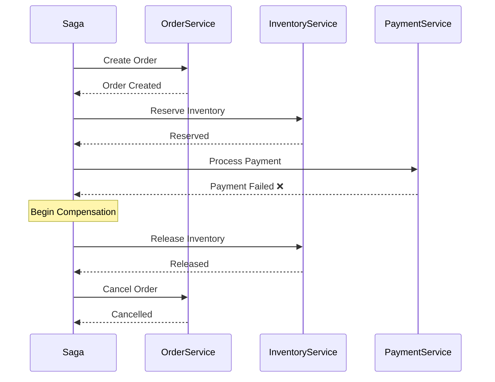

### Event Sourcing

Store state changes as a sequence of events rather than current state.

```javascript
// Event Sourcing Implementation
class OrderEventStore {
  constructor() {
    this.events = new Map(); // In production, use a real event store
  }

  async appendEvent(aggregateId, event) {
    if (!this.events.has(aggregateId)) {
      this.events.set(aggregateId, []);
    }

    const eventWithMetadata = {
      ...event,
      aggregateId,
      timestamp: new Date(),
      version: this.events.get(aggregateId).length + 1,
    };

    this.events.get(aggregateId).push(eventWithMetadata);

    // Publish event to event bus
    await this.publishEvent(eventWithMetadata);

    return eventWithMetadata;
  }

  async getEvents(aggregateId) {
    return this.events.get(aggregateId) || [];
  }

  async rebuildAggregate(aggregateId) {
    const events = await this.getEvents(aggregateId);
    const order = new Order(aggregateId);

    for (const event of events) {
      order.apply(event);
    }

    return order;
  }
}

class Order {
  constructor(id) {
    this.id = id;
    this.status = 'CREATED';
    this.items = [];
    this.total = 0;
  }

  apply(event) {
    switch (event.type) {
      case 'ORDER_CREATED':
        this.status = 'CREATED';
        this.items = event.data.items;
        break;
      case 'PAYMENT_PROCESSED':
        this.status = 'PAID';
        this.total = event.data.amount;
        break;
      case 'ORDER_SHIPPED':
        this.status = 'SHIPPED';
        break;
      case 'ORDER_CANCELLED':
        this.status = 'CANCELLED';
        break;
    }
  }
}

// Usage
const eventStore = new OrderEventStore();

// Create order
await eventStore.appendEvent('order-123', {
  type: 'ORDER_CREATED',
  data: { items: [{ id: 1, quantity: 2 }] },
});

// Process payment
await eventStore.appendEvent('order-123', {
  type: 'PAYMENT_PROCESSED',
  data: { amount: 100.0 },
});

// Rebuild current state from events
const order = await eventStore.rebuildAggregate('order-123');
console.log(order.status); // 'PAID'
```

### CQRS (Command Query Responsibility Segregation)

Separate read and write operations for better scalability.

```javascript
// Write Model (Commands)
class OrderCommandHandler {
  constructor(eventStore) {
    this.eventStore = eventStore;
  }

  async createOrder(command) {
    const { orderId, userId, items } = command;

    // Validate command
    if (!items || items.length === 0) {
      throw new Error('Order must contain items');
    }

    // Create event
    await this.eventStore.appendEvent(orderId, {
      type: 'ORDER_CREATED',
      data: { userId, items, createdAt: new Date() },
    });

    return { orderId };
  }
}

// Read Model (Queries)
class OrderQueryHandler {
  constructor(readDatabase) {
    this.db = readDatabase;
  }

  async getOrder(orderId) {
    return await this.db.orders.findOne({ id: orderId });
  }

  async getUserOrders(userId) {
    return await this.db.orders.find({ userId }).sort({ createdAt: -1 });
  }

  async getOrderStatistics(userId) {
    return await this.db.orderStats.findOne({ userId });
  }
}

// Event Handler - Updates Read Model
class OrderEventHandler {
  constructor(readDatabase) {
    this.db = readDatabase;
  }

  async handle(event) {
    switch (event.type) {
      case 'ORDER_CREATED':
        await this.db.orders.insertOne({
          id: event.aggregateId,
          userId: event.data.userId,
          items: event.data.items,
          status: 'CREATED',
          createdAt: event.data.createdAt,
        });

        // Update statistics
        await this.db.orderStats.updateOne(
          { userId: event.data.userId },
          { $inc: { totalOrders: 1 } },
          { upsert: true }
        );
        break;
    }
  }
}
```

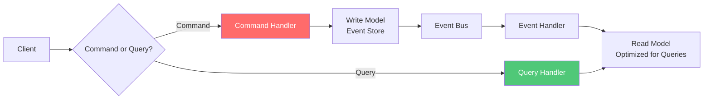

## Service Discovery

### Client-Side Discovery

Clients query a service registry to discover service instances.

```javascript
// Service Registry
class ServiceRegistry {
  constructor() {
    this.services = new Map();
  }

  register(serviceName, instance) {
    if (!this.services.has(serviceName)) {
      this.services.set(serviceName, []);
    }

    this.services.get(serviceName).push({
      ...instance,
      registeredAt: new Date(),
      lastHeartbeat: new Date(),
    });
  }

  deregister(serviceName, instanceId) {
    const instances = this.services.get(serviceName) || [];
    this.services.set(
      serviceName,
      instances.filter((i) => i.id !== instanceId)
    );
  }

  discover(serviceName) {
    const instances = this.services.get(serviceName) || [];
    // Filter out instances that haven't sent heartbeat recently
    const healthyInstances = instances.filter((i) => Date.now() - i.lastHeartbeat.getTime() < 30000);

    if (healthyInstances.length === 0) {
      throw new Error(`No healthy instances of ${serviceName} available`);
    }

    // Load balancing - return random instance
    return healthyInstances[Math.floor(Math.random() * healthyInstances.length)];
  }

  heartbeat(serviceName, instanceId) {
    const instances = this.services.get(serviceName) || [];
    const instance = instances.find((i) => i.id === instanceId);

    if (instance) {
      instance.lastHeartbeat = new Date();
    }
  }
}

// Service Client
class ServiceClient {
  constructor(serviceName, registry) {
    this.serviceName = serviceName;
    this.registry = registry;
  }

  async call(endpoint, options = {}) {
    const instance = this.registry.discover(this.serviceName);
    const url = `${instance.host}:${instance.port}${endpoint}`;

    try {
      const response = await fetch(url, options);
      return await response.json();
    } catch (error) {
      // On failure, try another instance
      console.error(`Failed to call ${url}:`, error);
      throw error;
    }
  }
}

// Usage
const registry = new ServiceRegistry();

// Services register themselves
registry.register('user-service', {
  id: 'user-service-1',
  host: 'http://localhost',
  port: 3001,
});

registry.register('user-service', {
  id: 'user-service-2',
  host: 'http://localhost',
  port: 3002,
});

// Client discovers and calls service
const userClient = new ServiceClient('user-service', registry);
const user = await userClient.call('/users/123');
```

### Server-Side Discovery

Load balancer queries service registry and routes requests.

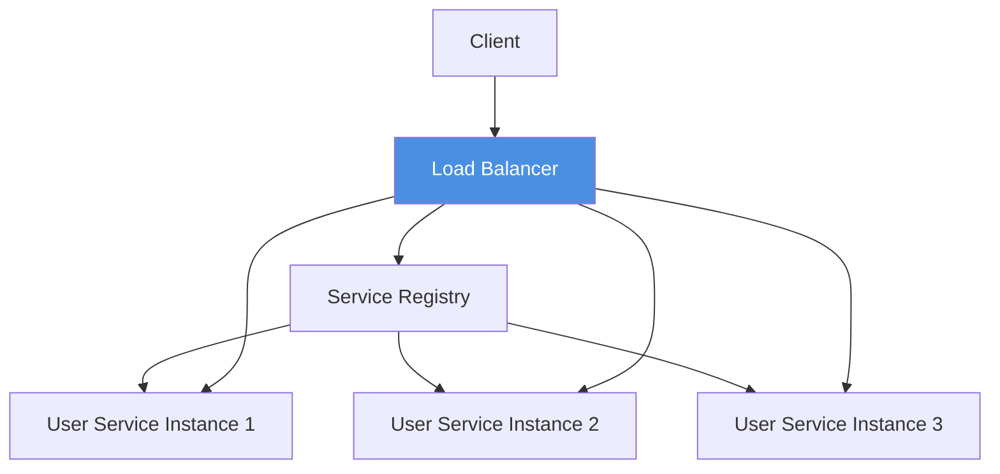

## Observability and Monitoring

### Distributed Tracing

Track requests across multiple services.

```javascript
// Distributed Tracing Implementation
class Tracer {
  constructor(serviceName) {
    this.serviceName = serviceName;
  }

  startSpan(operationName, parentContext = null) {
    const span = {
      traceId: parentContext?.traceId || this.generateTraceId(),
      spanId: this.generateSpanId(),
      parentSpanId: parentContext?.spanId || null,
      serviceName: this.serviceName,
      operationName,
      startTime: Date.now(),
      tags: {},
      logs: [],
    };

    return {
      ...span,
      setTag: (key, value) => {
        span.tags[key] = value;
      },
      log: (message) => {
        span.logs.push({ timestamp: Date.now(), message });
      },
      finish: () => {
        span.endTime = Date.now();
        span.duration = span.endTime - span.startTime;
        this.reportSpan(span);
      },
      context: () => ({
        traceId: span.traceId,
        spanId: span.spanId,
      }),
    };
  }

  generateTraceId() {
    return Math.random().toString(36).substr(2, 16);
  }

  generateSpanId() {
    return Math.random().toString(36).substr(2, 8);
  }

  reportSpan(span) {
    // Send to tracing backend (Jaeger, Zipkin, etc.)
    console.log('Span reported:', span);
  }
}

// Usage across services
const tracer = new Tracer('order-service');

async function createOrder(req, res) {
  // Extract parent context from headers
  const parentContext = {
    traceId: req.headers['x-trace-id'],
    spanId: req.headers['x-span-id'],
  };

  const span = tracer.startSpan('create-order', parentContext);
  span.setTag('user.id', req.body.userId);

  try {
    // Call user service with trace context
    const userSpan = tracer.startSpan('get-user', span.context());
    const user = await fetch(`${USER_SERVICE_URL}/users/${req.body.userId}`, {
      headers: {
        'x-trace-id': userSpan.context().traceId,
        'x-span-id': userSpan.context().spanId,
      },
    }).then((r) => r.json());
    userSpan.finish();

    // Create order
    const order = await orderRepository.create(req.body);
    span.log('Order created successfully');

    res.json(order);
  } catch (error) {
    span.setTag('error', true);
    span.log(`Error: ${error.message}`);
    res.status(500).json({ error: error.message });
  } finally {
    span.finish();
  }
}
```

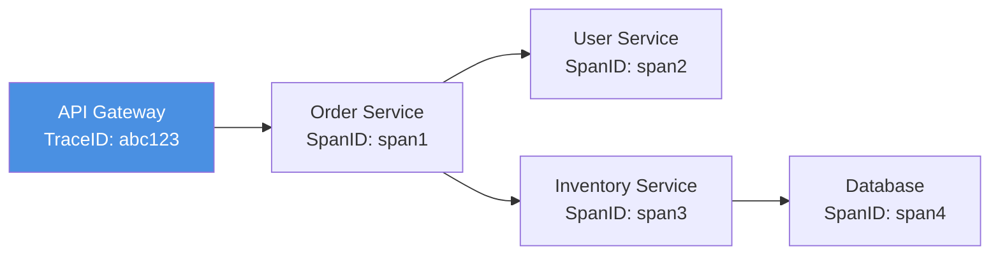

### Centralized Logging

Aggregate logs from all services into a central location.

```javascript
// Structured Logging
class Logger {
  constructor(serviceName) {
    this.serviceName = serviceName;
  }

  log(level, message, context = {}) {
    const logEntry = {
      timestamp: new Date().toISOString(),
      level,
      service: this.serviceName,
      message,
      ...context,
      // Include trace context if available
      traceId: context.traceId,
      spanId: context.spanId,
    };

    // Send to logging aggregator (ELK, Splunk, CloudWatch, etc.)
    console.log(JSON.stringify(logEntry));
  }

  info(message, context) {
    this.log('INFO', message, context);
  }

  error(message, context) {
    this.log('ERROR', message, context);
  }

  warn(message, context) {
    this.log('WARN', message, context);
  }
}

// Usage
const logger = new Logger('order-service');

logger.info('Order created', {
  orderId: 'order-123',
  userId: 'user-456',
  traceId: 'abc123',
  spanId: 'span1',
});
```

### Health Checks

Implement health endpoints for monitoring service status.

```javascript
// Health Check Implementation
class HealthCheck {
  constructor() {
    this.checks = [];
  }

  register(name, checkFn) {
    this.checks.push({ name, checkFn });
  }

  async execute() {
    const results = await Promise.allSettled(
      this.checks.map(async (check) => ({
        name: check.name,
        status: await check.checkFn(),
      }))
    );

    const health = {
      status: 'UP',
      timestamp: new Date().toISOString(),
      checks: {},
    };

    for (const result of results) {
      if (result.status === 'fulfilled') {
        health.checks[result.value.name] = result.value.status;
        if (result.value.status !== 'UP') {
          health.status = 'DOWN';
        }
      } else {
        health.checks[result.reason?.name || 'unknown'] = 'DOWN';
        health.status = 'DOWN';
      }
    }

    return health;
  }
}

// Setup health checks
const healthCheck = new HealthCheck();

healthCheck.register('database', async () => {
  try {
    await database.ping();
    return 'UP';
  } catch (error) {
    return 'DOWN';
  }
});

healthCheck.register('message-queue', async () => {
  try {
    await messageQueue.ping();
    return 'UP';
  } catch (error) {
    return 'DOWN';
  }
});

// Expose health endpoint
app.get('/health', async (req, res) => {
  const health = await healthCheck.execute();
  const statusCode = health.status === 'UP' ? 200 : 503;
  res.status(statusCode).json(health);
});
```

## Testing Microservices

### Contract Testing

Ensure services fulfill their API contracts.

```javascript
// Consumer-Driven Contract Testing (using Pact)
const { Pact } = require('@pact-foundation/pact');
const { like, eachLike } = require('@pact-foundation/pact').Matchers;

describe('Order Service - User Service Contract', () => {
  const provider = new Pact({
    consumer: 'order-service',
    provider: 'user-service',
    port: 8989,
  });

  before(() => provider.setup());
  after(() => provider.finalize());

  describe('GET /users/:id', () => {
    before(() => {
      return provider.addInteraction({
        state: 'user with ID 123 exists',
        uponReceiving: 'a request for user 123',
        withRequest: {
          method: 'GET',
          path: '/users/123',
          headers: {
            Accept: 'application/json',
          },
        },
        willRespondWith: {
          status: 200,
          headers: {
            'Content-Type': 'application/json',
          },
          body: like({
            id: '123',
            email: 'user@example.com',
            name: 'John Doe',
          }),
        },
      });
    });

    it('returns user data', async () => {
      const userService = new UserServiceClient('http://localhost:8989');
      const user = await userService.getUser('123');

      expect(user.id).to.equal('123');
      expect(user.email).to.be.a('string');
      expect(user.name).to.be.a('string');
    });
  });
});
```

### Integration Testing

Test service interactions in a controlled environment.

```javascript
// Integration Test with Test Containers
const { GenericContainer } = require('testcontainers');

describe('Order Service Integration Tests', () => {
  let postgresContainer;
  let redisContainer;
  let orderService;

  before(async function () {
    this.timeout(60000);

    // Start dependencies in containers
    postgresContainer = await new GenericContainer('postgres:14')
      .withExposedPorts(5432)
      .withEnvironment({
        POSTGRES_DB: 'test_db',
        POSTGRES_PASSWORD: 'test_password',
      })
      .start();

    redisContainer = await new GenericContainer('redis:7').withExposedPorts(6379).start();

    // Initialize service with test containers
    orderService = new OrderService({
      database: {
        host: postgresContainer.getHost(),
        port: postgresContainer.getMappedPort(5432),
      },
      cache: {
        host: redisContainer.getHost(),
        port: redisContainer.getMappedPort(6379),
      },
    });

    await orderService.initialize();
  });

  after(async () => {
    await postgresContainer.stop();
    await redisContainer.stop();
  });

  it('creates order successfully', async () => {
    const order = await orderService.createOrder({
      userId: 'user-123',
      items: [{ productId: 'prod-1', quantity: 2 }],
    });

    expect(order.id).to.exist;
    expect(order.status).to.equal('PENDING');
  });

  it('caches frequently accessed orders', async () => {
    const orderId = 'order-123';

    // First call - should hit database
    const order1 = await orderService.getOrder(orderId);

    // Second call - should hit cache
    const order2 = await orderService.getOrder(orderId);

    expect(order1).to.deep.equal(order2);
  });
});
```

## Deployment Strategies

### Blue-Green Deployment

Run two identical production environments, switching traffic between them.

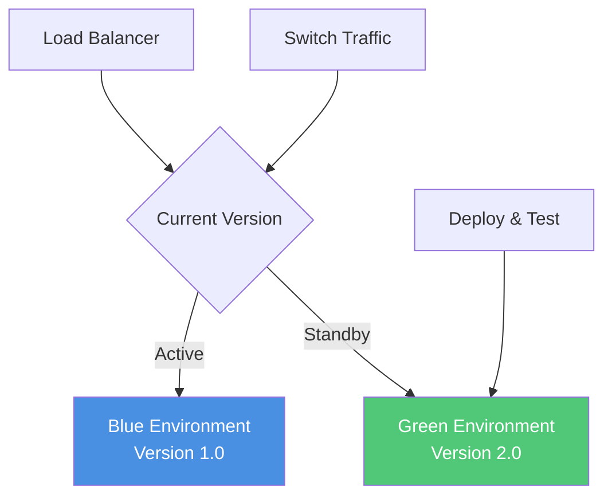

### Canary Deployment

Gradually roll out changes to a small subset of users.

```javascript
// Canary Deployment Configuration
class CanaryDeployer {
  constructor(loadBalancer) {
    this.loadBalancer = loadBalancer;
  }

  async deploy(newVersion, canaryPercentage = 10) {
    // Route small percentage to new version
    await this.loadBalancer.updateRouting({
      'v1.0': 100 - canaryPercentage,
      'v2.0': canaryPercentage,
    });

    // Monitor metrics
    const metrics = await this.monitorMetrics('v2.0', { duration: 300000 });

    if (metrics.errorRate > 1) {
      // Rollback
      await this.rollback('v1.0');
      throw new Error('Canary deployment failed - rolling back');
    }

    // Gradually increase traffic
    await this.increaseTraffic('v2.0', [25, 50, 75, 100]);
  }

  async increaseTraffic(version, percentages) {
    for (const percentage of percentages) {
      await this.loadBalancer.updateRouting({
        'v1.0': 100 - percentage,
        'v2.0': percentage,
      });

      await this.sleep(600000); // Wait 10 minutes

      const metrics = await this.monitorMetrics(version);
      if (metrics.errorRate > 1) {
        await this.rollback('v1.0');
        throw new Error('Canary deployment failed');
      }
    }
  }
}
```

## Security Considerations

### Authentication and Authorization

Implement secure authentication across services.

```javascript
// JWT-Based Authentication
const jwt = require('jsonwebtoken');

class AuthService {
  constructor(secretKey) {
    this.secretKey = secretKey;
  }

  generateToken(user) {
    return jwt.sign(
      {
        userId: user.id,
        email: user.email,
        roles: user.roles,
        iat: Date.now(),
      },
      this.secretKey,
      { expiresIn: '1h' }
    );
  }

  verifyToken(token) {
    try {
      return jwt.verify(token, this.secretKey);
    } catch (error) {
      throw new Error('Invalid token');
    }
  }
}

// Authentication Middleware
function authenticateRequest(req, res, next) {
  const token = req.headers.authorization?.replace('Bearer ', '');

  if (!token) {
    return res.status(401).json({ error: 'No token provided' });
  }

  try {
    const decoded = authService.verifyToken(token);
    req.user = decoded;
    next();
  } catch (error) {
    res.status(401).json({ error: 'Invalid token' });
  }
}

// Authorization Middleware
function authorizeRole(...allowedRoles) {
  return (req, res, next) => {
    if (!req.user) {
      return res.status(401).json({ error: 'Not authenticated' });
    }

    const hasRole = req.user.roles.some((role) => allowedRoles.includes(role));

    if (!hasRole) {
      return res.status(403).json({ error: 'Insufficient permissions' });
    }

    next();
  };
}

// Usage
app.get('/admin/users', authenticateRequest, authorizeRole('admin'), async (req, res) => {
  const users = await userService.getAllUsers();
  res.json(users);
});
```

### Service-to-Service Authentication

Secure communication between services.

```javascript
// Mutual TLS (mTLS) for Service-to-Service Communication
const https = require('https');
const fs = require('fs');

class SecureServiceClient {
  constructor(serviceName, certificatePath) {
    this.serviceName = serviceName;
    this.agent = new https.Agent({
      cert: fs.readFileSync(`${certificatePath}/client-cert.pem`),
      key: fs.readFileSync(`${certificatePath}/client-key.pem`),
      ca: fs.readFileSync(`${certificatePath}/ca-cert.pem`),
      rejectUnauthorized: true,
    });
  }

  async call(endpoint, options = {}) {
    const instance = await serviceRegistry.discover(this.serviceName);

    return new Promise((resolve, reject) => {
      const req = https.request(
        {
          hostname: instance.host,
          port: instance.port,
          path: endpoint,
          method: options.method || 'GET',
          agent: this.agent,
          headers: options.headers || {},
        },
        (res) => {
          let data = '';
          res.on('data', (chunk) => (data += chunk));
          res.on('end', () => resolve(JSON.parse(data)));
        }
      );

      req.on('error', reject);

      if (options.body) {
        req.write(JSON.stringify(options.body));
      }

      req.end();
    });
  }
}
```

## Common Challenges and Solutions

### Challenge 1: Distributed Data Consistency

**Problem**: Maintaining consistency across multiple databases

**Solution**: Use Saga pattern or event sourcing with eventual consistency

### Challenge 2: Service Discovery

**Problem**: Services need to find each other dynamically

**Solution**: Implement service registry with health checks (Consul, Eureka, etcd)

### Challenge 3: Network Latency

**Problem**: Multiple network calls increase response time

**Solution**:

- Implement caching strategies
- Use asynchronous communication where appropriate
- Optimize service boundaries

### Challenge 4: Debugging Distributed Systems

**Problem**: Tracing issues across multiple services is complex

**Solution**: Implement distributed tracing, centralized logging, and correlation IDs

### Challenge 5: Testing Complexity

**Problem**: Testing service interactions is complicated

**Solution**: Use contract testing, integration test environments, and service mocks

## Best Practices

### Do's

✅ **Design services around business capabilities**: Align with domain boundaries

✅ **Automate everything**: CI/CD, testing, deployment, monitoring

✅ **Implement comprehensive observability**: Logging, tracing, metrics

✅ **Design for failure**: Circuit breakers, retries, timeouts

✅ **Version your APIs**: Enable backward compatibility

✅ **Use asynchronous communication when possible**: Reduces coupling

✅ **Implement proper security**: Authentication, authorization, encryption

✅ **Document service contracts**: Make APIs discoverable and understandable

### Don'ts

❌ **Don't start with microservices**: Begin with a monolith unless you have specific needs

❌ **Don't create too many services**: Start with fewer, larger services

❌ **Don't share databases**: Each service should own its data

❌ **Don't neglect operational complexity**: Ensure team can handle distributed systems

❌ **Don't ignore network failures**: Always implement retry logic and timeouts

❌ **Don't couple services tightly**: Avoid synchronous chains of dependencies

❌ **Don't skip monitoring**: Observability is essential in distributed systems

## Conclusion

Microservices architecture offers significant benefits for large, complex applications with multiple teams, but comes
with substantial operational complexity. Success requires:

1. **Clear service boundaries** based on business domains
2. **Robust communication patterns** (both sync and async)
3. **Comprehensive observability** (logging, tracing, metrics)
4. **Resilience patterns** (circuit breakers, retries, timeouts)
5. **Automated operations** (CI/CD, infrastructure as code)
6. **Strong team capabilities** in distributed systems

Consider starting with a well-structured monolith and extracting services as needs become clear. When you do adopt
microservices, ensure your team has the skills and tools to manage the added complexity.

## Related Chapters

- [Architecture Design](/architecture-design) - System design principles and patterns
- [Scalability and Reliability](/scalability-and-reliability) - Building resilient distributed systems
- [CI/CD](/ci-cd) - Automating deployment pipelines
- [Monitoring and Observability](/monitoring-and-observability) - Tracking distributed system health
- [Security Best Practices](/security-best-practices) - Securing microservices
- [Containerization](/containerization) - Packaging and deploying microservices
- [REST Best Practices](/rest-best-practices) - Designing service APIs

## References

- **"Building Microservices"** by Sam Newman
- **"Microservices Patterns"** by Chris Richardson
- **Martin Fowler on Microservices**: [https://martinfowler.com/microservices/](https://martinfowler.com/microservices/)
- **The Twelve-Factor App**: [https://12factor.net/](https://12factor.net/)
- **Microservices.io**: [https://microservices.io/](https://microservices.io/)
- **AWS Microservices**: [https://aws.amazon.com/microservices/](https://aws.amazon.com/microservices/)
