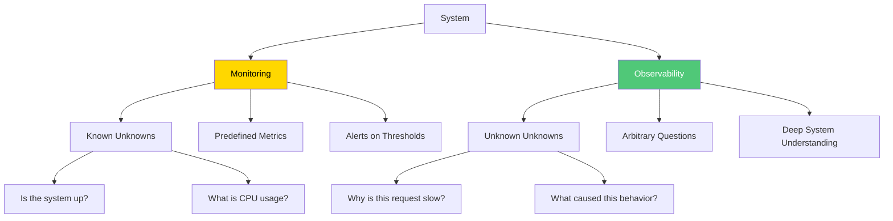
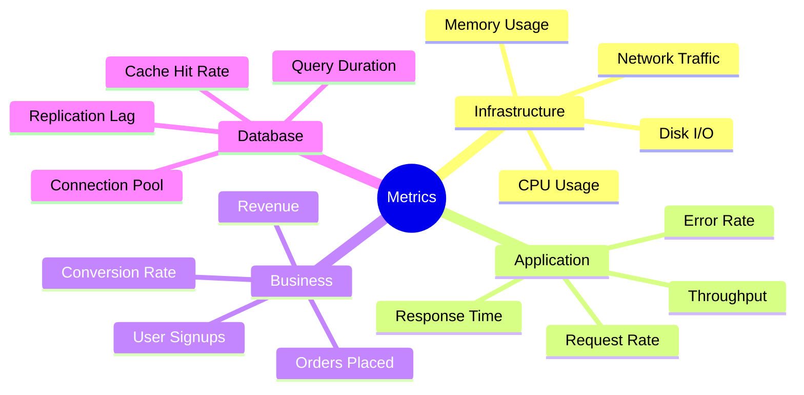
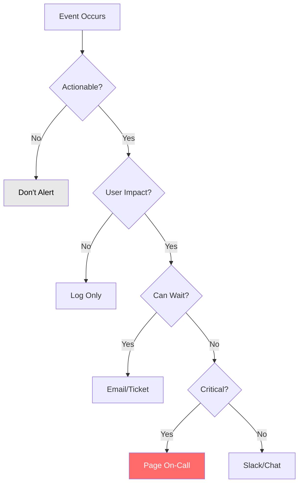

import MonitoringAndObservabilityImage from '/img/undraw_dashboard.svg';

<div className="text--center margin-bottom--lg">
  <MonitoringAndObservabilityImage width="80%" height="300px" />
</div>

Monitoring and observability are essential for understanding system behavior, detecting issues, and maintaining
reliability. While monitoring tells you when something is wrong, observability helps you understand why. This chapter
explores the principles, tools, and practices for building observable systems that provide deep insights into
application health and performance.

## Monitoring vs. Observability

Understanding the distinction between monitoring and observability is crucial for building reliable systems.



**Monitoring**: Tracking predefined metrics and alerting when they exceed thresholds

- CPU usage > 80%
- Request rate < 100 req/s
- Error rate > 1%

**Observability**: Ability to understand internal system state from external outputs

- Why is this specific user's request failing?
- What changed before performance degraded?
- Which component is causing the slowdown?

:::tip The Three Pillars of Observability

Observability relies on three fundamental data types: metrics (what's happening), logs (what happened), and traces
(where it happened). Together, they provide comprehensive system visibility.

:::

## The Three Pillars of Observability

### 1. Metrics

Numerical measurements collected over time that provide quantitative insights.

```javascript
// Metrics collection with Prometheus client
const promClient = require('prom-client');

// Create a Registry
const register = new promClient.Registry();

// Collect default metrics (CPU, memory, etc.)
promClient.collectDefaultMetrics({ register });

// Custom metrics
const httpRequestDuration = new promClient.Histogram({
  name: 'http_request_duration_seconds',
  help: 'Duration of HTTP requests in seconds',
  labelNames: ['method', 'route', 'status_code'],
  buckets: [0.1, 0.5, 1, 2, 5, 10],
});

const httpRequestTotal = new promClient.Counter({
  name: 'http_requests_total',
  help: 'Total number of HTTP requests',
  labelNames: ['method', 'route', 'status_code'],
});

const activeConnections = new promClient.Gauge({
  name: 'active_connections',
  help: 'Number of active connections',
  labelNames: ['type'],
});

const orderProcessingTime = new promClient.Summary({
  name: 'order_processing_seconds',
  help: 'Time taken to process orders',
  percentiles: [0.5, 0.9, 0.95, 0.99],
});

// Register metrics
register.registerMetric(httpRequestDuration);
register.registerMetric(httpRequestTotal);
register.registerMetric(activeConnections);
register.registerMetric(orderProcessingTime);

// Middleware to track metrics
app.use((req, res, next) => {
  const start = Date.now();

  res.on('finish', () => {
    const duration = (Date.now() - start) / 1000;
    const route = req.route?.path || req.path;

    httpRequestDuration.labels(req.method, route, res.statusCode).observe(duration);

    httpRequestTotal.labels(req.method, route, res.statusCode).inc();
  });

  next();
});

// Business metrics
async function processOrder(order) {
  const end = orderProcessingTime.startTimer();

  try {
    await orderService.process(order);
    end({ status: 'success' });
  } catch (error) {
    end({ status: 'failure' });
    throw error;
  }
}

// Expose metrics endpoint
app.get('/metrics', async (req, res) => {
  res.set('Content-Type', register.contentType);
  res.end(await register.metrics());
});
```

**Types of metrics**:

| Type      | Description                    | Example            | Use Case                |
| --------- | ------------------------------ | ------------------ | ----------------------- |
| Counter   | Monotonically increasing value | HTTP requests      | Count events            |
| Gauge     | Value that can go up or down   | Active connections | Current state           |
| Histogram | Distribution of values         | Request duration   | Percentiles             |
| Summary   | Similar to histogram           | Response times     | Client-side percentiles |

**Key metrics to track**:



### 2. Logs

Timestamped records of discrete events that occurred in the system.

```javascript
// Structured logging with Winston
const winston = require('winston');

const logger = winston.createLogger({
  level: process.env.LOG_LEVEL || 'info',
  format: winston.format.combine(
    winston.format.timestamp(),
    winston.format.errors({ stack: true }),
    winston.format.json()
  ),
  defaultMeta: {
    service: 'api-server',
    version: process.env.APP_VERSION,
    environment: process.env.NODE_ENV,
  },
  transports: [
    // Write all logs to console
    new winston.transports.Console({
      format: winston.format.combine(winston.format.colorize(), winston.format.simple()),
    }),
    // Write all logs to combined.log
    new winston.transports.File({ filename: 'logs/combined.log' }),
    // Write errors to error.log
    new winston.transports.File({
      filename: 'logs/error.log',
      level: 'error',
    }),
  ],
});

// Context-aware logging
class LogContext {
  constructor(baseContext = {}) {
    this.context = baseContext;
  }

  child(additionalContext) {
    return new LogContext({ ...this.context, ...additionalContext });
  }

  info(message, meta = {}) {
    logger.info(message, { ...this.context, ...meta });
  }

  error(message, error, meta = {}) {
    logger.error(message, {
      ...this.context,
      ...meta,
      error: {
        message: error.message,
        stack: error.stack,
        name: error.name,
      },
    });
  }

  warn(message, meta = {}) {
    logger.warn(message, { ...this.context, ...meta });
  }

  debug(message, meta = {}) {
    logger.debug(message, { ...this.context, ...meta });
  }
}

// Request logging middleware
app.use((req, res, next) => {
  const requestId = req.headers['x-request-id'] || crypto.randomUUID();
  const requestLogger = new LogContext({
    requestId,
    method: req.method,
    path: req.path,
    ip: req.ip,
    userAgent: req.headers['user-agent'],
  });

  req.log = requestLogger;

  const start = Date.now();

  res.on('finish', () => {
    const duration = Date.now() - start;

    requestLogger.info('Request completed', {
      statusCode: res.statusCode,
      duration,
      userId: req.user?.id,
    });
  });

  next();
});

// Application logging
app.post('/api/orders', async (req, res) => {
  const orderLogger = req.log.child({ orderId: req.body.id });

  orderLogger.info('Processing order', {
    userId: req.user.id,
    items: req.body.items.length,
  });

  try {
    const order = await orderService.create(req.body);

    orderLogger.info('Order created successfully', {
      orderId: order.id,
      total: order.total,
    });

    res.json(order);
  } catch (error) {
    orderLogger.error('Failed to create order', error, {
      userId: req.user.id,
    });

    res.status(500).json({ error: 'Failed to create order' });
  }
});
```

**Log levels**:


**Best practices for logging**:

✅ **Use structured logging**: JSON format for easy parsing ✅ **Include context**: Request ID, user ID, trace ID ✅
**Log at appropriate levels**: Don't overuse ERROR ✅ **Never log sensitive data**: Passwords, tokens, PII ✅ **Use
correlation IDs**: Track requests across services ✅ **Set retention policies**: Balance storage costs with needs ✅
**Make logs searchable**: Use consistent field names

### 3. Distributed Tracing

Tracks requests as they flow through distributed systems.

```javascript
// OpenTelemetry instrumentation
const { NodeTracerProvider } = require('@opentelemetry/sdk-trace-node');
const { registerInstrumentations } = require('@opentelemetry/instrumentation');
const { HttpInstrumentation } = require('@opentelemetry/instrumentation-http');
const { ExpressInstrumentation } = require('@opentelemetry/instrumentation-express');
const { JaegerExporter } = require('@opentelemetry/exporter-jaeger');
const { BatchSpanProcessor } = require('@opentelemetry/sdk-trace-base');
const { Resource } = require('@opentelemetry/resources');
const { SemanticResourceAttributes } = require('@opentelemetry/semantic-conventions');

// Initialize tracer provider
const provider = new NodeTracerProvider({
  resource: new Resource({
    [SemanticResourceAttributes.SERVICE_NAME]: 'api-server',
    [SemanticResourceAttributes.SERVICE_VERSION]: process.env.APP_VERSION,
  }),
});

// Configure exporter (Jaeger)
const exporter = new JaegerExporter({
  endpoint: 'http://localhost:14268/api/traces',
});

provider.addSpanProcessor(new BatchSpanProcessor(exporter));
provider.register();

// Auto-instrument HTTP and Express
registerInstrumentations({
  instrumentations: [new HttpInstrumentation(), new ExpressInstrumentation()],
});

// Manual instrumentation
const { trace, context, SpanStatusCode } = require('@opentelemetry/api');

const tracer = trace.getTracer('api-server');

async function processOrder(order) {
  // Create a span
  return await tracer.startActiveSpan('processOrder', async (span) => {
    try {
      span.setAttributes({
        'order.id': order.id,
        'order.total': order.total,
        'user.id': order.userId,
      });

      // Child spans for sub-operations
      const user = await tracer.startActiveSpan('fetchUser', async (childSpan) => {
        try {
          const userData = await userService.get(order.userId);
          childSpan.setAttributes({
            'user.tier': userData.tier,
          });
          return userData;
        } finally {
          childSpan.end();
        }
      });

      const payment = await tracer.startActiveSpan('processPayment', async (childSpan) => {
        try {
          const result = await paymentService.charge(order.total);
          childSpan.setAttributes({
            'payment.method': result.method,
            'payment.id': result.id,
          });
          return result;
        } catch (error) {
          childSpan.setStatus({
            code: SpanStatusCode.ERROR,
            message: error.message,
          });
          childSpan.recordException(error);
          throw error;
        } finally {
          childSpan.end();
        }
      });

      span.addEvent('order.processed', {
        'processing.duration': Date.now() - order.createdAt,
      });

      span.setStatus({ code: SpanStatusCode.OK });
      return { success: true, orderId: order.id };
    } catch (error) {
      span.setStatus({
        code: SpanStatusCode.ERROR,
        message: error.message,
      });
      span.recordException(error);
      throw error;
    } finally {
      span.end();
    }
  });
}
```

**Trace visualization**:

```mermaid
gantt
    title Distributed Trace Example
    dateFormat X
    axisFormat %Lms

    section API Gateway
    Receive Request    :0, 5
    Authenticate       :5, 15
    Route Request      :15, 20

    section Order Service
    Process Order      :20, 120
    Validate Items     :25, 45
    Check Inventory    :45, 85
    Calculate Total    :85, 95

    section Payment Service
    Process Payment    :95, 180
    Verify Card        :100, 140
    Charge Card        :140, 175

    section Inventory Service
    Reserve Items      :50, 80
    Update Database    :55, 75

    section Notification Service
    Send Confirmation  :180, 210
```



**Propagating trace context**:

```javascript
// Extract trace context from incoming request
const { propagation } = require('@opentelemetry/api');

app.use((req, res, next) => {
  // Extract trace context from headers
  const extractedContext = propagation.extract(context.active(), req.headers);

  context.with(extractedContext, () => {
    next();
  });
});

// Inject trace context into outgoing requests
async function callExternalService(url, data) {
  const headers = {};

  // Inject current trace context into headers
  propagation.inject(context.active(), headers);

  return await fetch(url, {
    method: 'POST',
    headers: {
      'Content-Type': 'application/json',
      ...headers,
    },
    body: JSON.stringify(data),
  });
}
```

## Alerting Best Practices

Effective alerting ensures teams are notified of issues without being overwhelmed.

### Alert Design Principles



**Alert criteria**:

✅ **Actionable**: Someone can and should take action ✅ **User-impacting**: Affects actual users or business ✅
**Timely**: Requires immediate attention ✅ **Specific**: Clear what's wrong and where ✅ **Contextual**: Includes
relevant information

```javascript
// Alert configuration with Prometheus Alertmanager
// alerting-rules.yml
const alertingRules = `
groups:
  - name: api_alerts
    interval: 30s
    rules:
      # High error rate
      - alert: HighErrorRate
        expr: |
          rate(http_requests_total{status_code=~"5.."}[5m])
          / rate(http_requests_total[5m]) > 0.05
        for: 5m
        labels:
          severity: critical
          component: api
        annotations:
          summary: "High error rate detected"
          description: "Error rate is {{ $value | humanizePercentage }} for {{ $labels.route }}"
          runbook: "https://wiki.company.com/runbooks/high-error-rate"

      # High latency
      - alert: HighLatency
        expr: |
          histogram_quantile(0.95,
            rate(http_request_duration_seconds_bucket[5m])
          ) > 2
        for: 10m
        labels:
          severity: warning
          component: api
        annotations:
          summary: "High latency on {{ $labels.route }}"
          description: "P95 latency is {{ $value }}s"

      # Database connection pool exhaustion
      - alert: DatabasePoolExhaustion
        expr: database_connection_pool_active / database_connection_pool_max > 0.9
        for: 5m
        labels:
          severity: warning
          component: database
        annotations:
          summary: "Database connection pool nearly exhausted"
          description: "{{ $value | humanizePercentage }} of connections in use"

      # Service down
      - alert: ServiceDown
        expr: up{job="api-server"} == 0
        for: 1m
        labels:
          severity: critical
          component: api
        annotations:
          summary: "Service {{ $labels.instance }} is down"
          description: "Service has been down for more than 1 minute"
`;

// Alertmanager configuration
// alertmanager.yml
const alertmanagerConfig = `
global:
  slack_api_url: 'https://hooks.slack.com/services/XXX'
  pagerduty_url: 'https://events.pagerduty.com/v2/enqueue'

route:
  receiver: 'default'
  group_by: ['alertname', 'component']
  group_wait: 30s
  group_interval: 5m
  repeat_interval: 4h

  routes:
    # Critical alerts go to PagerDuty
    - match:
        severity: critical
      receiver: pagerduty
      continue: true

    # Critical alerts also go to Slack
    - match:
        severity: critical
      receiver: slack-critical

    # Warning alerts go to Slack only
    - match:
        severity: warning
      receiver: slack-warnings

receivers:
  - name: 'default'
    email_configs:
      - to: 'alerts@company.com'

  - name: 'pagerduty'
    pagerduty_configs:
      - service_key: 'xxx'
        severity: '{{ .GroupLabels.severity }}'
        description: '{{ .CommonAnnotations.summary }}'
        details:
          firing: '{{ range .Alerts }}{{ .Labels.instance }}{{ end }}'

  - name: 'slack-critical'
    slack_configs:
      - channel: '#alerts-critical'
        title: '{{ .GroupLabels.alertname }}'
        text: '{{ .CommonAnnotations.description }}'
        color: 'danger'

  - name: 'slack-warnings'
    slack_configs:
      - channel: '#alerts-warnings'
        title: '{{ .GroupLabels.alertname }}'
        text: '{{ .CommonAnnotations.description }}'
        color: 'warning'

inhibit_rules:
  # Inhibit warning if critical alert is firing
  - source_match:
      severity: 'critical'
    target_match:
      severity: 'warning'
    equal: ['alertname', 'component']
`;
```

### On-Call Runbooks

Document procedures for responding to alerts.

````markdown
# Runbook: High Error Rate

## Alert Description

HTTP error rate (5xx responses) exceeds 5% for more than 5 minutes.

## Severity

**Critical** - Immediate action required

## Impact

- Users experiencing failures
- Potential data loss or corruption
- Service degradation

## Investigation Steps

### 1. Check Error Dashboard

```bash
# View recent errors
https://grafana.company.com/d/errors

# Query error logs
kubectl logs -l app=api-server --tail=100 | grep ERROR
```
````

### 2. Identify Error Pattern

- Check error messages in logs
- Look for common stack traces
- Identify affected endpoints
- Check if errors are from specific users/regions

### 3. Check Dependencies

```bash
# Database status
pg_isready -h postgres.company.com

# Redis status
redis-cli -h redis.company.com ping

# External API status
curl https://status.thirdparty.com/api
```

### 4. Check Recent Changes

```bash
# Recent deployments
kubectl rollout history deployment/api-server

# Recent configuration changes
git log --since="1 hour ago" config/
```

## Resolution Steps

### Immediate Mitigation

1. **Rollback recent deployment** (if recent)

   ```bash
   kubectl rollout undo deployment/api-server
   ```

2. **Scale up** (if load-related)

   ```bash
   kubectl scale deployment/api-server --replicas=10
   ```

3. **Enable circuit breaker** (if dependency-related)
   ```bash
   kubectl set env deployment/api-server CIRCUIT_BREAKER=true
   ```

### Root Cause Fix

1. Identify and fix underlying issue
2. Deploy fix through normal CI/CD
3. Monitor error rate recovery
4. Update runbook if needed

## Escalation

If unable to resolve within 15 minutes:

- Escalate to Senior Engineer: @senior-on-call
- Notify Incident Commander: @incident-commander
- Create incident: https://incident.company.com/new

## Post-Incident

1. Write post-mortem
2. Update monitoring/alerting
3. Improve documentation
4. Schedule follow-up review

````

## Health Checks and Service Level Indicators

### Health Check Endpoints

```javascript
// Comprehensive health check implementation
class HealthChecker {
  constructor(dependencies) {
    this.dependencies = dependencies;
    this.checks = new Map();
  }

  register(name, checkFn, options = {}) {
    this.checks.set(name, {
      check: checkFn,
      timeout: options.timeout || 5000,
      critical: options.critical !== false
    });
  }

  async execute() {
    const results = {};
    let overallStatus = 'healthy';

    for (const [name, config] of this.checks) {
      try {
        const timeoutPromise = new Promise((_, reject) =>
          setTimeout(() => reject(new Error('Health check timeout')), config.timeout)
        );

        const checkPromise = config.check();
        const result = await Promise.race([checkPromise, timeoutPromise]);

        results[name] = {
          status: result.status || 'healthy',
          ...result
        };

        if (config.critical && result.status !== 'healthy') {
          overallStatus = 'unhealthy';
        }
      } catch (error) {
        results[name] = {
          status: 'unhealthy',
          error: error.message
        };

        if (config.critical) {
          overallStatus = 'unhealthy';
        }
      }
    }

    return {
      status: overallStatus,
      timestamp: new Date().toISOString(),
      version: process.env.APP_VERSION,
      checks: results
    };
  }
}

// Setup health checks
const healthChecker = new HealthChecker();

// Database health check
healthChecker.register('database', async () => {
  const start = Date.now();
  await database.query('SELECT 1');
  const duration = Date.now() - start;

  return {
    status: duration < 1000 ? 'healthy' : 'degraded',
    responseTime: duration
  };
}, { critical: true });

// Redis health check
healthChecker.register('cache', async () => {
  const start = Date.now();
  await redis.ping();
  const duration = Date.now() - start;

  return {
    status: duration < 500 ? 'healthy' : 'degraded',
    responseTime: duration
  };
}, { critical: false });

// External API health check
healthChecker.register('payment-gateway', async () => {
  try {
    const response = await fetch('https://api.payment.com/health', {
      timeout: 3000
    });

    return {
      status: response.ok ? 'healthy' : 'unhealthy',
      statusCode: response.status
    };
  } catch (error) {
    return {
      status: 'unhealthy',
      error: error.message
    };
  }
}, { critical: true });

// Health endpoints
app.get('/health', async (req, res) => {
  const health = await healthChecker.execute();
  const statusCode = health.status === 'healthy' ? 200 : 503;
  res.status(statusCode).json(health);
});

// Liveness probe (K8s)
app.get('/health/live', (req, res) => {
  // Simple check that process is running
  res.status(200).json({ status: 'alive' });
});

// Readiness probe (K8s)
app.get('/health/ready', async (req, res) => {
  const health = await healthChecker.execute();

  // Only ready if critical dependencies are healthy
  if (health.status === 'healthy') {
    res.status(200).json({ status: 'ready' });
  } else {
    res.status(503).json({ status: 'not ready', details: health });
  }
});
````

### Service Level Indicators (SLIs)

Define and track key metrics for service reliability.

```javascript
// SLI tracking
class SLITracker {
  constructor() {
    this.successCount = new promClient.Counter({
      name: 'sli_requests_success_total',
      help: 'Total successful requests',
      labelNames: ['service', 'endpoint'],
    });

    this.totalCount = new promClient.Counter({
      name: 'sli_requests_total',
      help: 'Total requests',
      labelNames: ['service', 'endpoint'],
    });

    this.latency = new promClient.Histogram({
      name: 'sli_request_duration_seconds',
      help: 'Request duration',
      labelNames: ['service', 'endpoint'],
      buckets: [0.1, 0.5, 1, 2, 5],
    });
  }

  trackRequest(service, endpoint, duration, success) {
    this.totalCount.labels(service, endpoint).inc();

    if (success) {
      this.successCount.labels(service, endpoint).inc();
    }

    this.latency.labels(service, endpoint).observe(duration);
  }

  // Calculate availability SLI
  async getAvailability(service, timeWindow) {
    const query = `
      sum(rate(sli_requests_success_total{service="${service}"}[${timeWindow}]))
      /
      sum(rate(sli_requests_total{service="${service}"}[${timeWindow}]))
    `;

    const result = await prometheus.query(query);
    return result.value * 100; // Convert to percentage
  }

  // Calculate latency SLI
  async getLatency(service, percentile, timeWindow) {
    const query = `
      histogram_quantile(${percentile / 100},
        rate(sli_request_duration_seconds_bucket{service="${service}"}[${timeWindow}])
      )
    `;

    const result = await prometheus.query(query);
    return result.value;
  }
}

// SLO (Service Level Objective) definition
const SLOs = {
  availability: {
    target: 99.9, // 99.9% uptime
    window: '30d',
  },
  latency: {
    target: 500, // 500ms at p95
    percentile: 95,
    window: '30d',
  },
  errorRate: {
    target: 1, // < 1% error rate
    window: '30d',
  },
};

// Error budget calculation
async function calculateErrorBudget() {
  const sliTracker = new SLITracker();

  const availability = await sliTracker.getAvailability('api-server', '30d');
  const availabilityBudget = 100 - SLOs.availability.target;
  const availabilityUsed = 100 - availability;
  const availabilityRemaining = availabilityBudget - availabilityUsed;

  return {
    availability: {
      target: SLOs.availability.target,
      actual: availability,
      budget: availabilityBudget,
      used: availabilityUsed,
      remaining: availabilityRemaining,
      percentage: (availabilityRemaining / availabilityBudget) * 100,
    },
  };
}
```

## Dashboards and Visualization

### Creating Effective Dashboards

```javascript
// Grafana dashboard JSON configuration
const apiDashboard = {
  dashboard: {
    title: 'API Service Overview',
    tags: ['api', 'production'],
    timezone: 'browser',
    panels: [
      {
        title: 'Request Rate',
        type: 'graph',
        targets: [
          {
            expr: 'rate(http_requests_total[5m])',
            legendFormat: '{{method}} {{route}}',
          },
        ],
        yaxes: [
          {
            label: 'req/s',
          },
        ],
      },
      {
        title: 'Error Rate',
        type: 'graph',
        targets: [
          {
            expr: 'rate(http_requests_total{status_code=~"5.."}[5m]) / rate(http_requests_total[5m]) * 100',
            legendFormat: 'Error %',
          },
        ],
        yaxes: [
          {
            label: '%',
          },
        ],
        alert: {
          conditions: [
            {
              evaluator: {
                params: [5],
                type: 'gt',
              },
            },
          ],
        },
      },
      {
        title: 'Response Time (P95)',
        type: 'graph',
        targets: [
          {
            expr: 'histogram_quantile(0.95, rate(http_request_duration_seconds_bucket[5m]))',
            legendFormat: '{{route}}',
          },
        ],
        yaxes: [
          {
            label: 'seconds',
          },
        ],
      },
      {
        title: 'Active Connections',
        type: 'singlestat',
        targets: [
          {
            expr: 'active_connections',
          },
        ],
      },
    ],
  },
};
```

**Dashboard best practices**:

✅ **Focus on user experience**: Show metrics that matter to users ✅ **Use consistent layouts**: Similar metrics in
similar positions ✅ **Include context**: Annotations for deployments, incidents ✅ **Set appropriate time ranges**:
Default to relevant window ✅ **Use meaningful colors**: Red for errors, green for success ✅ **Avoid clutter**: Show
only actionable metrics ✅ **Link to runbooks**: Quick access to resolution steps

## Observability for Microservices

### Service Mesh Observability

```yaml
# Istio observability configuration
apiVersion: telemetry.istio.io/v1alpha1
kind: Telemetry
metadata:
  name: mesh-default
  namespace: istio-system
spec:
  metrics:
    - providers:
        - name: prometheus
      dimensions:
        source_cluster: source.cluster_id
        destination_cluster: destination.cluster_id

  accessLogging:
    - providers:
        - name: envoy
      match:
        mode: SERVER_AND_CLIENT

  tracing:
    - providers:
        - name: jaeger
      randomSamplingPercentage: 10.0
      customTags:
        user_id:
          header:
            name: x-user-id
```

### Correlation and Context

```javascript
// Correlating metrics, logs, and traces
class ObservabilityContext {
  constructor() {
    this.traceId = null;
    this.spanId = null;
    this.userId = null;
    this.requestId = null;
  }

  static fromRequest(req) {
    const ctx = new ObservabilityContext();
    ctx.requestId = req.headers['x-request-id'] || crypto.randomUUID();
    ctx.traceId = req.headers['x-trace-id'];
    ctx.spanId = req.headers['x-span-id'];
    ctx.userId = req.user?.id;
    return ctx;
  }

  toHeaders() {
    return {
      'x-request-id': this.requestId,
      'x-trace-id': this.traceId,
      'x-span-id': this.spanId,
      'x-user-id': this.userId,
    };
  }

  toLogContext() {
    return {
      requestId: this.requestId,
      traceId: this.traceId,
      spanId: this.spanId,
      userId: this.userId,
    };
  }

  injectIntoMetrics(labels) {
    return {
      ...labels,
      trace_id: this.traceId,
      request_id: this.requestId,
    };
  }
}

// Middleware to create observability context
app.use((req, res, next) => {
  req.obsContext = ObservabilityContext.fromRequest(req);

  // Add to logger
  req.log = logger.child(req.obsContext.toLogContext());

  // Propagate in response headers
  Object.entries(req.obsContext.toHeaders()).forEach(([key, value]) => {
    if (value) res.setHeader(key, value);
  });

  next();
});
```

## Best Practices Summary

### Do's

✅ **Instrument early**: Build observability from the start

✅ **Use structured logging**: JSON format with consistent fields

✅ **Track business metrics**: Not just technical metrics

✅ **Implement distributed tracing**: Essential for microservices

✅ **Create actionable alerts**: Only alert on user-impacting issues

✅ **Write runbooks**: Document resolution procedures

✅ **Use correlation IDs**: Track requests across services

✅ **Monitor SLIs/SLOs**: Track service reliability

✅ **Visualize effectively**: Create clear, focused dashboards

✅ **Review and iterate**: Continuously improve observability

### Don'ts

❌ **Don't alert on everything**: Avoid alert fatigue

❌ **Don't log sensitive data**: PII, passwords, tokens

❌ **Don't ignore costs**: Monitor and optimize observability costs

❌ **Don't have single metrics**: Use multiple signals

❌ **Don't skip context**: Always include relevant metadata

❌ **Don't over-dashboard**: Keep dashboards focused

❌ **Don't ignore trends**: Look at patterns over time

## Conclusion

Observability is essential for understanding and maintaining modern systems. Key takeaways:

1. **Three pillars** (metrics, logs, traces) provide comprehensive visibility
2. **Context is crucial** for correlating signals across pillars
3. **Actionable alerts** reduce noise and improve response times
4. **SLIs and SLOs** provide clear reliability targets
5. **Effective dashboards** surface the most important information
6. **Distributed tracing** is essential for microservices
7. **Continuous improvement** of observability practices

Start with basic metrics and logging, then progressively add tracing and advanced features. Build observability into
your systems from day one, and continuously refine based on what you learn from incidents and operational experience.

## Related Chapters

- [Performance Optimization](/performance-optimization) - Using observability to identify bottlenecks
- [Scalability and Reliability](/scalability-and-reliability) - Building reliable systems
- [Microservices](/microservices) - Observability for distributed systems
- [Containerization](/containerization) - Container metrics and logging
- [CI/CD](/ci-cd) - Integrating observability into deployments
- [Logging](/logging) - Deep dive into logging practices
- [Error Handling](/error-handling) - Tracking and responding to errors

## References

- **"Observability Engineering"** by Charity Majors, Liz Fong-Jones, and George Miranda
- **"Site Reliability Engineering"** by Google
- **OpenTelemetry**: [https://opentelemetry.io/](https://opentelemetry.io/)
- **Prometheus Documentation**: [https://prometheus.io/docs/](https://prometheus.io/docs/)
- **Grafana Documentation**: [https://grafana.com/docs/](https://grafana.com/docs/)
- **The Twelve-Factor App - Logs**: [https://12factor.net/logs](https://12factor.net/logs)
- **Google SRE Book**: [https://sre.google/sre-book/table-of-contents/](https://sre.google/sre-book/table-of-contents/)
