import PairProgrammingImage from '/img/undraw_pair_programming.svg';

<div className="text--center margin-bottom--lg">
  <PairProgrammingImage width="80%" height="300px" />
</div>

Pair programming is a software development technique where two programmers work together at a single workstation. One
programmer, the "driver," writes code while the other, the "navigator," reviews each line of code as it's written,
providing guidance, feedback, and suggestions. The two programmers switch roles frequently to ensure that both gain
experience in each role and stay engaged in the development process.

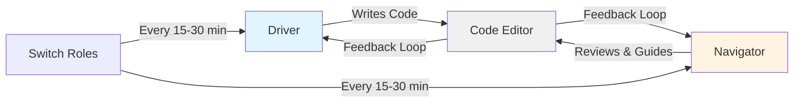

:::tip Key Insight

The magic of pair programming lies in the continuous dialogue between two programmers with different perspectives,
catching issues in real-time rather than days later in code review.

:::

## Benefits

Pair programming offers numerous benefits, including:

- **Improved Code Quality:** With two sets of eyes reviewing each line of code, pair programming can lead to fewer
  mistakes and higher-quality code. The constant feedback provided by the navigator helps the driver catch errors early,
  reducing the time spent on debugging and code review later in the development process.

- **Increased Knowledge Sharing:** Pair programming facilitates knowledge sharing and collaboration between team
  members. As programmers work together, they learn from each other's experiences and expertise, leading to improved
  skills and a more cohesive team.

- **Enhanced Problem Solving:** When faced with a challenging problem, having two minds working together can lead to
  faster and more effective problem-solving. Different perspectives and approaches can be combined to come up with
  innovative solutions that may not have been considered by a single programmer.

- **Reduced Onboarding Time:** Pair programming is an excellent way to onboard new team members. By working closely with
  experienced team members, new hires can quickly learn the team's processes, tools, and codebase, reducing the time
  required to become productive contributors.

- **Improved Communication:** Pair programming encourages communication and collaboration, both within the pair and
  across the team. This can lead to a better understanding of requirements, a shared vision of the project, and a more
  effective development process.

## Good Practices

To make the most of pair programming, consider these practices:

- **1. Rotate Pairs Regularly:** Regularly rotate pairs to ensure that all team members have a chance to work together
  and learn from one another. This helps to distribute knowledge across the team and fosters a culture of collaboration
  and continuous learning.

- **2. Establish Clear Roles:** Make sure that both members of the pair understand their roles as driver and navigator.
  The driver should focus on writing code, while the navigator should focus on reviewing the code, providing feedback,
  and helping to identify potential issues or improvements. Switch roles frequently to ensure that both programmers stay
  engaged and gain experience in each role.

- **3. Communicate Effectively:** Effective communication is crucial for successful pair programming. Encourage open,
  honest, and respectful communication between the driver and the navigator. Make sure both team members feel
  comfortable voicing their opinions, asking questions, and providing feedback.

- **4. Embrace a Growth Mindset:** Adopt a growth mindset when pair programming, recognizing that both programmers have
  unique strengths and weaknesses and that both can learn from each other. Be open to feedback, and use each pairing
  session as an opportunity to grow and improve your skills.

- **5. Set Clear Goals and Expectations:** Before beginning a pair programming session, discuss the goals and
  expectations for the session. Make sure both team members have a clear understanding of the task at hand and the
  desired outcome.

- **6. Maintain a Comfortable Work Environment:** Ensure that the workstation is comfortable and well-equipped for both
  team members. This includes providing ergonomic chairs, adjustable monitors, and any necessary peripherals, such as
  keyboards and mice.

## When to Use Pair Programming

Not every task requires pair programming. Use this decision guide to determine when pairing provides the most value:

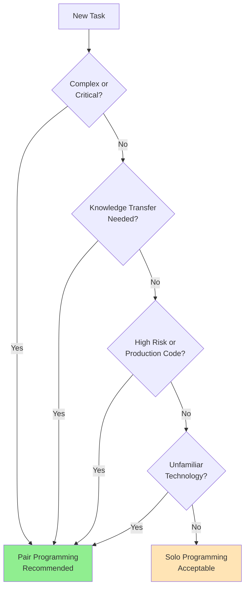

**Best Scenarios for Pairing:**

- Onboarding new team members
- Solving complex technical challenges
- Working with unfamiliar code or technologies
- Implementing critical business logic
- Refactoring legacy code
- Investigating and fixing production bugs

**Solo Work May Be Better For:**

- Routine maintenance tasks
- Well-understood implementations
- Research and experimentation
- Administrative or documentation tasks

## Techniques

There are several pair programming techniques that can be used to optimize the pairing experience:

| Technique            | Rotation Frequency | Best For                         | Skill Level Match |
| -------------------- | ------------------ | -------------------------------- | ----------------- |
| **Ping Pong**        | Per test           | TDD, balanced skill levels       | Similar           |
| **Strong-Style**     | 5-10 minutes       | Knowledge transfer, mentoring    | Different         |
| **Remote Pairing**   | Flexible           | Distributed teams                | Any               |
| **Driver-Navigator** | 15-30 minutes      | General development, mixed tasks | Any               |
| **Mob Programming**  | 5-15 minutes       | Complex problems, team alignment | Mixed             |

### Ping Pong Pairing

In this technique, the driver writes a test for a specific functionality, and then the navigator writes the code to pass
the test. They switch roles and repeat the process, with the new driver writing the next test and the new navigator
writing the code to pass it. This approach encourages test-driven development and ensures that both programmers stay
engaged in the process.

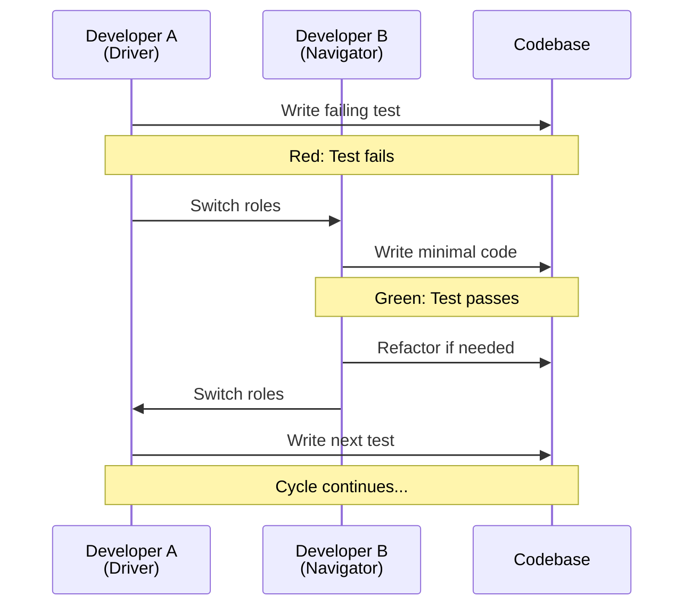

**Example: Building a User Validator**

```javascript
// Developer A writes the test (Driver)
describe('UserValidator', () => {
  it('should reject invalid email addresses', () => {
    const validator = new UserValidator();
    expect(validator.isValidEmail('invalid-email')).toBe(false);
  });
});

// Developer B implements the code (now Driver, A is Navigator)
class UserValidator {
  isValidEmail(email) {
    const emailRegex = /^[^\s@]+@[^\s@]+\.[^\s@]+$/;
    return emailRegex.test(email);
  }
}

// Developer A writes next test (Driver again)
describe('UserValidator', () => {
  it('should accept valid email addresses', () => {
    const validator = new UserValidator();
    expect(validator.isValidEmail('user@example.com')).toBe(true);
  });

  it('should reject emails with spaces', () => {
    const validator = new UserValidator();
    expect(validator.isValidEmail('user @example.com')).toBe(false);
  });
});
```

:::tip Benefits of Ping Pong

This technique naturally enforces TDD practices, maintains high test coverage, and keeps both developers actively
engaged with frequent role switching.

:::

### Strong-Style Pairing

This technique requires the navigator to take a more active role in guiding the driver. The driver is responsible for
writing the code but only acts on the instructions provided by the navigator. This approach promotes clear communication
and can help to minimize misunderstandings and errors.

**The Golden Rule:** _"For an idea to go from your head into the computer, it must go through someone else's hands."_

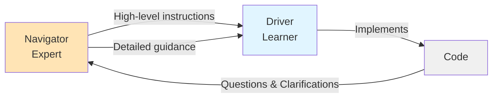

**Example Dialogue:**

```
Navigator: "Let's create a function that fetches user data.
            Call it getUserById and it should take an id parameter."

Driver:     "Okay, async function getUserById(id)... what should it return?"

Navigator: "It should return a promise. First, validate the id is a positive number."

Driver:     "Like this? if (id <= 0) throw new Error..."

Navigator: "Exactly! Now use fetch to call the API endpoint /api/users/ plus the id."
```

:::info When to Use Strong-Style

This technique excels when:

- Onboarding new developers
- Working with unfamiliar codebases
- The navigator has domain expertise the driver lacks
- Teaching specific patterns or practices

:::

### Remote Pair Programming

Remote pair programming involves two programmers working together from different locations, often using video
conferencing and screen sharing tools to collaborate in real-time. This technique can be just as effective as in-person
pairing when using the right tools and following best practices for communication and collaboration.

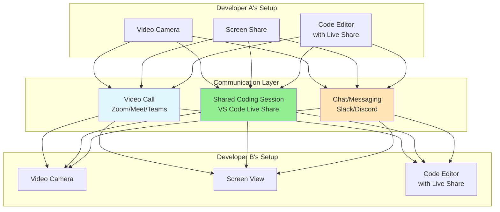

**Essential Tools:**

| Tool Category         | Popular Options                                   | Key Features                            |
| --------------------- | ------------------------------------------------- | --------------------------------------- |
| **Video Chat**        | Zoom, Google Meet, Microsoft Teams                | Screen sharing, low latency             |
| **Collaborative IDE** | VS Code Live Share, JetBrains Code With Me, Tuple | Real-time code editing, shared terminal |
| **Screen Sharing**    | Screen.so, Tuple, Pop                             | High FPS, low latency, cursor sharing   |
| **Voice Chat**        | Discord, Slack Huddles                            | Always-on audio, quick connection       |
| **Whiteboarding**     | Miro, Excalidraw, Figma                           | Visual collaboration, diagrams          |

**Remote Pairing Best Practices:**

1. **Setup a Dedicated Environment:**

   - Good microphone and webcam
   - Stable internet connection (wired preferred)
   - Second monitor for video while viewing code

2. **Communication Protocols:**

   - Keep video on to maintain connection
   - Use "verbal commits" before major changes
   - Take breaks every 90 minutes
   - Over-communicate intentions

3. **Technical Setup:**

```javascript
// VS Code Live Share example workflow
// Host (Developer A):
// 1. Install Live Share extension
// 2. Click "Live Share" in status bar
// 3. Share generated link with pair

// Guest (Developer B):
// 1. Click shared link
// 2. Access shared terminal, debug sessions
// 3. Follow host's cursor or navigate independently
```

:::warning Common Remote Pitfalls

- **Audio Issues:** Test audio before session; use push-to-talk if in noisy environment
- **Lag:** Optimize screen sharing quality vs. latency; consider IDE-native tools
- **Timezone Challenges:** Schedule sessions that respect both developers' peak productivity hours
- **Context Loss:** Document decisions in code comments or shared notes

:::

### Driver-Navigator (Classic Style)

The traditional pair programming approach where roles are clearly defined: the driver focuses on tactical coding while
the navigator maintains strategic oversight.

**Role Responsibilities:**

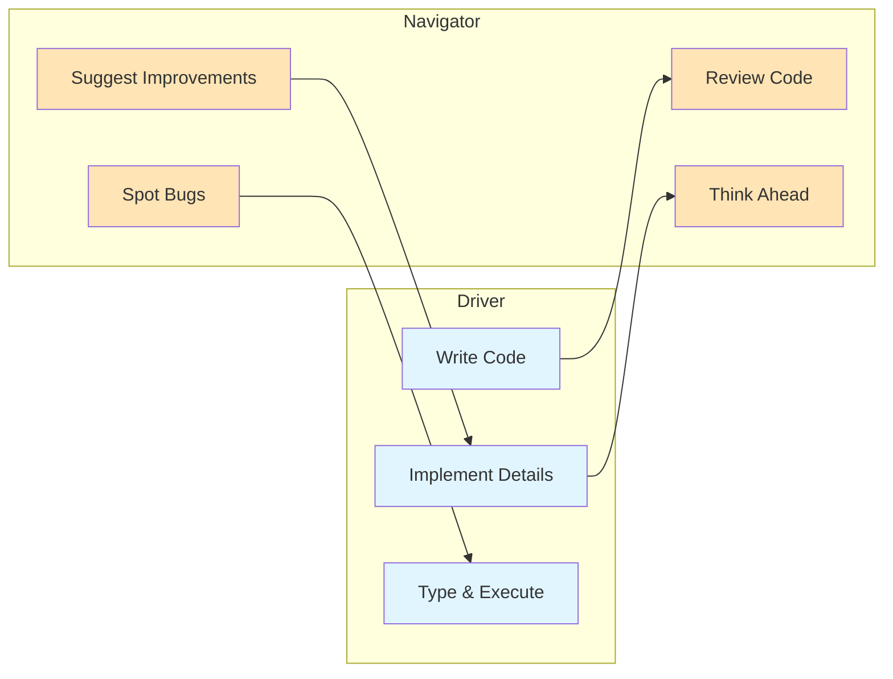

**Driver Responsibilities:**

- Focus on syntax and immediate implementation
- Write clean, readable code
- Think out loud about what you're coding
- Ask questions when unclear

**Navigator Responsibilities:**

- Keep the big picture in mind
- Watch for bugs, edge cases, and potential issues
- Think about the next steps
- Research documentation or solutions
- Suggest alternative approaches

**Rotation Schedule:**

```mermaid
gantt
    title Typical 2-Hour Pairing Session
    dateFormat HH:mm
    axisFormat %H:%M

    section Session
    Developer A drives     :done, 09:00, 30m
    Developer B drives     :done, 09:30, 30m
    Break                  :crit, 10:00, 10m
    Developer A drives     :done, 10:10, 30m
    Developer B drives     :done, 10:40, 30m
    Retrospective          :active, 11:10, 10m
```

### AI as a Pair Programming Partner

Modern AI coding assistants like Cursor, GitHub Copilot, and Claude can serve as virtual pair programming partners,
providing many benefits of pairing while allowing solo development. While AI can't fully replace human collaboration, it
offers unique advantages for certain scenarios.

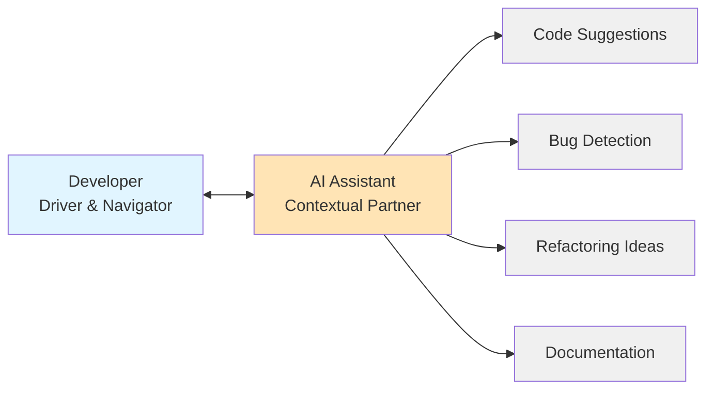

**Benefits of AI Pairing:**

- **Always available**: No scheduling needed, pair anytime
- **Patient teacher**: Never tired, always willing to explain
- **Consistent quality**: Applies best practices uniformly
- **Immediate feedback**: Catch issues as you type
- **Knowledge amplification**: Access to vast coding knowledge
- **No social pressure**: Ask "basic" questions without judgment

**Limitations Compared to Human Pairing:**

- **No domain expertise**: AI doesn't understand your business context
- **No creative insights**: Can't challenge architectural assumptions
- **No mentoring relationship**: Can't provide career guidance
- **No team building**: Doesn't strengthen team bonds
- **Limited context**: May not grasp full project complexity

#### AI Pairing Patterns

**Pattern 1: AI as Navigator**

You drive, AI provides strategic guidance:

```typescript
// You (Driver): I need to implement user authentication

// AI (Navigator): Let's approach this step-by-step:
// 1. First, let's create the authentication middleware
// 2. Then implement token generation
// 3. Add password hashing
// 4. Finally, create login/logout endpoints

// Start with middleware - what authentication strategy? JWT or sessions?

// You: JWT tokens

// AI: Good choice for stateless auth. Let's start:

import jwt from 'jsonwebtoken';
import { Request, Response, NextFunction } from 'express';

interface AuthRequest extends Request {
  user?: {
    id: string;
    email: string;
  };
}

export const authenticate = async (req: AuthRequest, res: Response, next: NextFunction) => {
  try {
    const token = req.headers.authorization?.split(' ')[1];

    if (!token) {
      return res.status(401).json({ error: 'No token provided' });
    }

    const decoded = jwt.verify(token, process.env.JWT_SECRET!) as {
      id: string;
      email: string;
    };

    req.user = decoded;
    next();
  } catch (error) {
    return res.status(401).json({ error: 'Invalid token' });
  }
};

// AI: This middleware looks good. Next, let's create the token generation function.
// Should we add token expiration?
```

**Pattern 2: AI as Driver**

You navigate, AI implements:

```typescript
// You (Navigator): Create a rate limiting function that:
// - Allows 100 requests per minute per user
// - Uses Redis for distributed tracking
// - Returns retry-after header when limited

// AI (Driver): Here's the implementation:

import Redis from 'ioredis';

const redis = new Redis(process.env.REDIS_URL);

interface RateLimitResult {
  allowed: boolean;
  remaining: number;
  retryAfter?: number;
}

export async function checkRateLimit(
  userId: string,
  limit: number = 100,
  windowSeconds: number = 60
): Promise<RateLimitResult> {
  const key = `ratelimit:${userId}`;
  const now = Date.now();
  const windowStart = now - windowSeconds * 1000;

  // Remove old entries
  await redis.zremrangebyscore(key, 0, windowStart);

  // Count requests in current window
  const currentCount = await redis.zcard(key);

  if (currentCount >= limit) {
    // Get oldest request timestamp
    const oldest = await redis.zrange(key, 0, 0, 'WITHSCORES');
    const retryAfter = Math.ceil((parseInt(oldest[1]) + windowSeconds * 1000 - now) / 1000);

    return {
      allowed: false,
      remaining: 0,
      retryAfter,
    };
  }

  // Add current request
  await redis.zadd(key, now, `${now}`);
  await redis.expire(key, windowSeconds);

  return {
    allowed: true,
    remaining: limit - currentCount - 1,
  };
}

// You (Navigator): Good! Now add middleware to apply this to routes.
```

**Pattern 3: Ping Pong with AI**

Alternate between writing tests and implementation:

```typescript
// You: Write test for user registration

describe('User Registration', () => {
  it('should create a new user with valid data', async () => {
    const userData = {
      email: 'test@example.com',
      password: 'SecurePass123!',
      name: 'Test User',
    };

    const user = await registerUser(userData);

    expect(user).toHaveProperty('id');
    expect(user.email).toBe(userData.email);
    expect(user.password).not.toBe(userData.password); // Should be hashed
  });
});

// AI: Here's the implementation to pass the test:

import bcrypt from 'bcrypt';
import { v4 as uuidv4 } from 'uuid';

interface UserData {
  email: string;
  password: string;
  name: string;
}

interface User {
  id: string;
  email: string;
  name: string;
  password: string;
}

export async function registerUser(userData: UserData): Promise<User> {
  // Hash password
  const saltRounds = 10;
  const hashedPassword = await bcrypt.hash(userData.password, saltRounds);

  // Create user
  const user: User = {
    id: uuidv4(),
    email: userData.email,
    name: userData.name,
    password: hashedPassword,
  };

  // Save to database (implementation depends on your ORM)
  await db.users.create(user);

  return user;
}

// You: Now write test for duplicate email validation
```

#### Best Practices for AI Pairing

**1. Be Explicit About Context**

```typescript
// Bad: Vague request
// "Create a function to process orders"

// Good: Specific context
/*
 * We use:
 * - TypeScript with strict mode
 * - Prisma for database
 * - Zod for validation
 *
 * Create an order processing function that:
 * - Validates order items exist in inventory
 * - Calculates total with tax
 * - Creates order record in database
 * - Returns order with ID and confirmation number
 */
```

**2. Review AI Code Critically**

Always verify AI-generated code:

```typescript
// AI might generate:
async function deleteUser(userId: string) {
  await db.user.delete({ where: { id: userId } });
  return { success: true };
}

// You should catch:
// ❌ No error handling
// ❌ No authorization check
// ❌ No cascade delete (orphaned data?)
// ❌ No soft delete consideration
// ❌ No audit log

// Corrected version:
async function deleteUser(userId: string, requestingUserId: string) {
  // Authorization check
  if (userId !== requestingUserId && !isAdmin(requestingUserId)) {
    throw new UnauthorizedError('Cannot delete other users');
  }

  try {
    // Soft delete instead of hard delete
    const user = await db.user.update({
      where: { id: userId },
      data: {
        deletedAt: new Date(),
        email: `deleted_${userId}@example.com`, // Free up email
      },
    });

    // Audit log
    await auditLog.create({
      action: 'USER_DELETED',
      userId,
      performedBy: requestingUserId,
      timestamp: new Date(),
    });

    return { success: true, user };
  } catch (error) {
    logger.error('Failed to delete user', { userId, error });
    throw new Error('Failed to delete user');
  }
}
```

**3. Use AI for Learning**

```typescript
// Ask AI to explain code you don't understand
// You: Explain this reduce function

const total = items.reduce((sum, item) => sum + item.price * item.quantity, 0);

// AI: This uses Array.reduce to calculate the total cost:
// - reduce iterates through 'items' array
// - 'sum' is the accumulator (starts at 0)
// - For each item, multiply price × quantity and add to sum
// - Returns final sum
//
// Example:
// items = [
//   { price: 10, quantity: 2 },  // 20
//   { price: 5, quantity: 3 }    // 15
// ]
// Result: 20 + 15 = 35
```

**4. Iterate Through Conversation**

```typescript
// First iteration: Basic implementation
// You: Create a caching function

// AI generates basic cache...

// You: Add TTL support

// AI adds expiration...

// You: Add cache invalidation by pattern

// AI adds wildcard invalidation...

// You: Add metrics tracking

// AI adds hit/miss counters...
```

#### Comparing AI vs. Human Pairing

| Aspect           | AI Pairing                   | Human Pairing                  |
| ---------------- | ---------------------------- | ------------------------------ |
| **Availability** | ✅ 24/7, instant             | ⏰ Requires scheduling         |
| **Context**      | ⚠️ Limited to code           | ✅ Understands business/team   |
| **Learning**     | ✅ Explains concepts well    | ✅ Mentors career growth       |
| **Creativity**   | ⚠️ Suggests patterns         | ✅ Challenges assumptions      |
| **Social**       | ❌ No relationship building  | ✅ Strengthens team bonds      |
| **Speed**        | ✅ Instant responses         | ⏰ Human thinking time         |
| **Code Quality** | ✅ Consistent best practices | ✅ Context-aware decisions     |
| **Debugging**    | ✅ Spots common bugs         | ✅ Understands system behavior |
| **Architecture** | ⚠️ Local decisions only      | ✅ System-wide perspective     |
| **Cost**         | 💰 Subscription/API costs    | 💰 Developer time              |

**Recommendation: Hybrid Approach**

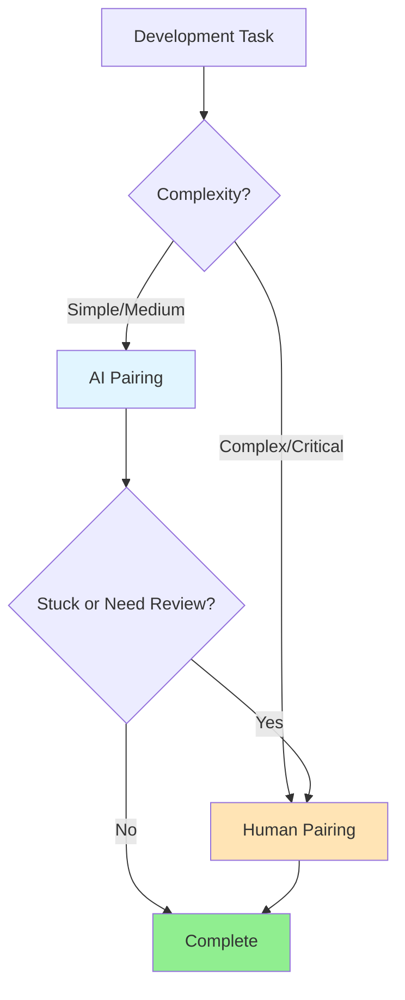

**Use AI Pairing For:**

- Boilerplate code generation
- Test writing
- Refactoring well-understood code
- Learning new syntax/libraries
- Solo debugging sessions

**Use Human Pairing For:**

- Critical business logic
- Architecture decisions
- Complex problem-solving
- Knowledge transfer
- Onboarding new team members

#### Tools for AI Pairing

**Cursor AI**

- Inline suggestions as you type
- Chat with codebase context
- Multi-file editing with Composer
- Terminal integration

**GitHub Copilot**

- IDE-integrated suggestions
- Chat interface for questions
- PR summaries and reviews

**Claude via API**

- Complex reasoning tasks
- Detailed explanations
- Multi-turn conversations

**ChatGPT Code Interpreter**

- Code execution and testing
- Data analysis
- Algorithm explanation

:::tip Learn More About Prompting

For techniques to get the most out of AI pair programming, see the [Prompt Engineering](/prompt-engineering) chapter for
detailed strategies and patterns.

:::

### Mob Programming

An extension of pair programming where the entire team works together on the same task, using one computer.

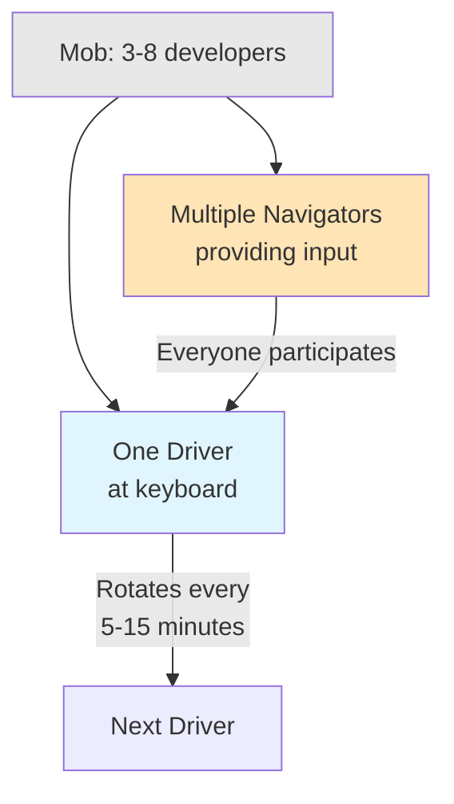

**When to Use Mob Programming:**

- Complex architectural decisions
- Critical production issues requiring multiple perspectives
- Knowledge transfer across the entire team
- Exploring new technologies or frameworks
- Resolving design conflicts

**Mob Programming Rules:**

1. **Rotate driver frequently** (every 5-15 minutes)
2. **One conversation at a time** - side discussions are distractions
3. **Driver is just a smart input device** - navigators provide direction
4. **Everyone has a voice** - quieter members are encouraged to contribute
5. **Take breaks** - more people = more fatigue

:::note Mob Programming ROI

While it may seem inefficient to have multiple developers on one task, mob programming often yields faster solutions for
complex problems and produces code with fewer defects, saving time in code review and debugging.

:::

## Getting Started with Pair Programming

If your team is new to pair programming, follow this gradual adoption approach:

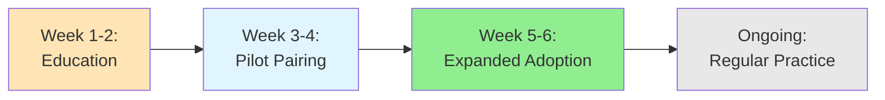

**Phase 1: Education (Weeks 1-2)**

- Share resources and success stories
- Watch pair programming videos together
- Discuss benefits and concerns openly
- Set expectations and goals

**Phase 2: Pilot Pairing (Weeks 3-4)**

- Start with volunteers who are enthusiastic
- Choose appropriate tasks (complex but not urgent)
- Pair for 2-4 hours per week initially
- Collect feedback after each session

**Phase 3: Expanded Adoption (Weeks 5-6)**

- Share pilot results with the team
- Gradually increase pairing hours
- Experiment with different techniques
- Address concerns and adjust practices

**Phase 4: Regular Practice (Ongoing)**

- Establish pairing guidelines for your team
- Track metrics (bug rates, knowledge distribution)
- Continue to iterate and improve
- Make pairing part of team culture

**Quick Start Checklist:**

- [ ] Set up comfortable workspace with two keyboards/mice
- [ ] Choose an appropriate task (medium complexity, 2-4 hours)
- [ ] Agree on technique (Driver-Navigator recommended for beginners)
- [ ] Set timer for role rotation (20-30 minutes)
- [ ] Keep communication open and respectful
- [ ] Take breaks every 90 minutes
- [ ] End with brief retrospective (5-10 minutes)

## Common Challenges

Pair programming can be challenging, particularly for teams that are new to the practice. Understanding these challenges
and their solutions helps teams adopt pairing more successfully.

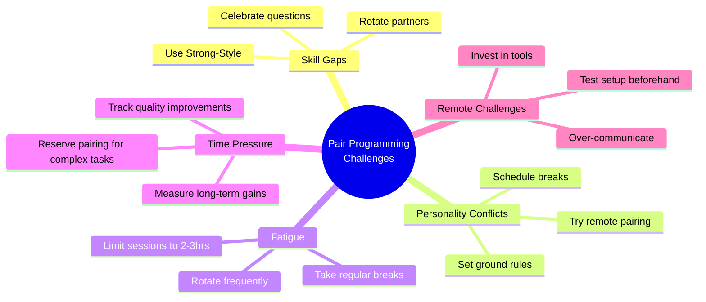

### Challenge: Unequal Skill Levels

**Problem:** Senior and junior developers may feel awkward pairing, with seniors feeling slowed down and juniors feeling
intimidated.

**Solutions:**

- Use **Strong-Style Pairing** where the senior navigates and mentors
- Frame pairing as knowledge transfer, not just coding
- Rotate junior developers across different seniors to spread knowledge
- Have seniors focus on the "why" behind decisions, not just the "how"
- Celebrate questions - they indicate learning is happening

**Metrics to Track:**

- Junior developer onboarding time (should decrease)
- Knowledge distribution across team (should increase)
- Bus factor for critical systems (should improve)

### Challenge: Introversion and Social Anxiety

**Problem:** Some developers find extended social interaction draining, making pair programming mentally exhausting.

**Solutions:**

- Start with shorter sessions (1-2 hours instead of all day)
- Use **Remote Pairing** which can feel less intense than in-person
- Pair asynchronously using PR reviews as "async pairing"
- Take frequent breaks - introverts need recharge time
- Create "quiet pairing" norms: less talking, more coding with review checkpoints

**Code Example - Async Pairing via PR:**

```javascript
// Original PR by Developer A
function calculateDiscount(price, customerType) {
  // TODO: Implement tiered discount logic
  return price * 0.9;
}

// Developer B's "async pairing" feedback
function calculateDiscount(price, customerType) {
  // Suggestion: Let's make this more maintainable
  const discountRates = {
    premium: 0.2,
    regular: 0.1,
    new: 0.05,
  };

  const rate = discountRates[customerType] || 0;
  return price * (1 - rate);
}
```

### Challenge: Time Management

**Problem:** Pair programming feels slower initially, and teams worry about productivity.

**Solutions:**

- Measure quality, not just velocity - fewer bugs mean less rework
- Track **cycle time** (idea to production) not just coding time
- Reserve pairing for high-value, complex tasks
- Don't pair on routine maintenance or research tasks

**Reality Check:**

```
Solo Programming: 10 hours coding + 5 hours debugging + 2 hours code review = 17 hours

Pair Programming: 12 hours coding + 1 hour debugging + 0 hours code review = 13 hours

Net savings: 4 hours + higher quality code
```

### Challenge: Resistance to Change

**Problem:** Developers accustomed to solo work resist pairing as micromanagement or a lack of trust.

**Solutions:**

- Start with volunteers, showcase their success stories
- Make pairing optional initially, let culture shift naturally
- Share research on pair programming benefits
- Address concerns head-on in team discussions
- Let skeptics observe a pairing session without participating
- Measure and share improvements (bug rates, review time)

**Common Objections and Responses:**

| Objection                          | Response                                                                     |
| ---------------------------------- | ---------------------------------------------------------------------------- |
| "I work better alone"              | Try pairing on one complex task, compare the result                          |
| "It will slow us down"             | Track defect rates and rework time - often faster overall                    |
| "I don't want someone watching me" | It's collaboration, not supervision - both are equals                        |
| "What if we disagree?"             | Disagreements surface problems early, better than finding them in production |

### Challenge: Remote Pairing Difficulties

**Problem:** Technical issues, timezone differences, and communication barriers make remote pairing harder.

**Solutions:**

- Invest in proper tools: good microphone, stable internet, IDE collaboration plugins
- Use **VS Code Live Share** or **JetBrains Code With Me** for real-time collaboration
- Establish clear communication protocols before starting
- Document decisions in code comments during the session
- Schedule pairing during overlapping hours for distributed teams
- Use async pairing for teams with large timezone differences

**Remote Pairing Checklist:**

```markdown
Before Session:

- [ ] Test audio and video
- [ ] Verify screen sharing works
- [ ] Install necessary IDE plugins
- [ ] Close unnecessary applications
- [ ] Prepare task/user story

During Session:

- [ ] Video on for engagement
- [ ] Share code via Live Share, not screen sharing
- [ ] Take breaks every 60-90 minutes
- [ ] Use chat for sharing links/resources
- [ ] Document key decisions

After Session:

- [ ] Commit and push code
- [ ] Document decisions in ticket/PR
- [ ] Brief retrospective (2-3 minutes)
- [ ] Schedule next session
```

## Measuring Success

To demonstrate the value of pair programming to your organization, track these metrics before and after adoption:

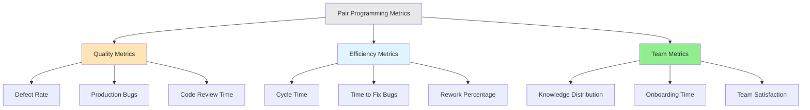

### Quality Metrics

| Metric                   | How to Measure                           | Expected Improvement |
| ------------------------ | ---------------------------------------- | -------------------- |
| **Defect Rate**          | Bugs per 1000 lines of code              | 15-30% reduction     |
| **Production Bugs**      | Critical issues in production per sprint | 20-40% reduction     |
| **Code Review Findings** | Issues found during code review          | 40-60% reduction     |
| **Test Coverage**        | Percentage of code covered by tests      | 10-20% increase      |

### Efficiency Metrics

| Metric                | How to Measure                       | Expected Improvement |
| --------------------- | ------------------------------------ | -------------------- |
| **Cycle Time**        | Story start to production deployment | 10-20% reduction     |
| **Time to Fix Bugs**  | Hours spent debugging                | 30-50% reduction     |
| **Code Review Time**  | Time spent in code review process    | 50-70% reduction     |
| **Rework Percentage** | Code that needs to be rewritten      | 25-35% reduction     |

### Team Health Metrics

| Metric                     | How to Measure                             | Expected Improvement |
| -------------------------- | ------------------------------------------ | -------------------- |
| **Knowledge Distribution** | Team members who can work on critical code | 50-100% increase     |
| **Onboarding Time**        | Days until new hire is productive          | 30-40% reduction     |
| **Team Satisfaction**      | Quarterly team surveys                     | 15-25% increase      |
| **Turnover Rate**          | Developers leaving the team                | 10-20% reduction     |

### Real-World Example

**Case Study: E-commerce Startup**

```
Before Pair Programming (6 months):
- 45 production bugs
- Average cycle time: 12 days
- Code review: 4 hours per PR
- 3 developers could work on checkout code

After Pair Programming (6 months):
- 22 production bugs (-51%)
- Average cycle time: 8 days (-33%)
- Code review: 1 hour per PR (-75%)
- 7 developers could work on checkout code (+133%)

ROI: Despite 20% reduction in individual velocity, overall team
productivity increased 25% due to reduced rework and faster reviews.
```

### How to Track These Metrics

```javascript
// Example: Simple pairing session tracker
const pairingSession = {
  date: '2025-10-19',
  participants: ['Alice', 'Bob'],
  duration: 120, // minutes
  technique: 'ping-pong',
  task: 'USER-123: Implement payment validation',

  outcomes: {
    linesOfCode: 250,
    testsWritten: 12,
    bugsFoundDuringSession: 3,
    knowledgeShared: ['Alice learned about payment gateway API', 'Bob learned about validation patterns'],
  },

  retrospective: {
    went_well: ['Great communication', 'Found edge cases early'],
    to_improve: ['Need better test data', 'Session too long'],
  },
};
```

:::tip Start Measuring Early

Begin collecting baseline metrics before introducing pair programming, then track the same metrics for at least 3-6
months after adoption to demonstrate impact.

:::

## Key Takeaways

Before wrapping up, here are the essential points to remember about pair programming:

1. **Choose the Right Technique:** Match the pairing style to your context

   - Ping Pong for TDD and balanced pairs
   - Strong-Style for mentoring and knowledge transfer
   - Remote Pairing for distributed teams
   - Mob Programming for complex problems

2. **Not Everything Requires Pairing:** Use it strategically for:

   - Complex or critical features
   - Onboarding and knowledge transfer
   - Unfamiliar technologies
   - Production bug investigation

3. **Success Factors:**

   - Rotate pairs and roles regularly
   - Communicate openly and respectfully
   - Take breaks to prevent fatigue
   - Track metrics to demonstrate value
   - Start small and scale gradually

4. **Overcome Resistance:**

   - Lead with volunteers and success stories
   - Address concerns with data and empathy
   - Make it optional initially
   - Invest in proper tools for remote pairing

5. **Measure Impact:** Track quality, efficiency, and team health metrics to prove ROI

## Conclusion

Pair programming is a valuable software development practice that can lead to higher-quality code, increased knowledge
sharing, and improved problem-solving. While it may seem counterintuitive to have two developers work on one task, the
research and real-world evidence consistently show benefits in code quality, team collaboration, and long-term
productivity.

**The path forward:**

1. **Start Small:** Begin with 2-4 hour sessions on complex tasks
2. **Be Patient:** Teams typically need 2-3 months to become comfortable with pairing
3. **Measure Results:** Track quality and efficiency metrics to demonstrate value
4. **Iterate:** Adjust your approach based on team feedback and what works for your context
5. **Make it Cultural:** When pairing becomes "how we work" rather than a special activity, you've succeeded

Remember, pair programming is a skill that improves with practice. The initial awkwardness is normal, and most teams
report increased satisfaction and effectiveness after the adjustment period. Whether you choose driver-navigator,
ping-pong, strong-style, or mob programming, the key is to start experimenting and find what works best for your team.

:::note Final Thought

"Two people working at a single computer will add as much functionality as two working separately, but with much higher
quality." – Kent Beck, Extreme Programming Explained

:::

## References

To learn more about pair programming and other software development practices, consider the following resources:

**Books:**

- [Pair Programming Illuminated](https://amzn.to/40K7gmW) by Laurie Williams and Robert Kessler - The definitive guide
  to pair programming
- [Extreme Programming Explained: Embrace Change](https://amzn.to/40HRNDW) by Kent Beck - XP practices including pairing
- [Agile Software Development with Scrum](https://amzn.to/43604mC) by Ken Schwaber and Mike Beedle - Agile methodologies
- [Remote Pairing: Collaborative Tools for Distributed Development](https://pragprog.com/titles/jkrp/remote-pairing/) by
  Joe Kutner - Remote pairing techniques

**Articles & Papers:**

- [The Costs and Benefits of Pair Programming](https://collaboration.csc.ncsu.edu/laurie/Papers/XPSardinia.PDF) -
  Research by Alistair Cockburn and Laurie Williams
- [Strengthening the Case for Pair Programming](https://www.cs.utah.edu/~lwilliam/Papers/ieeeSoftware.PDF) - IEEE
  Software article on pairing effectiveness
- [On the Effectiveness of the Test-First Approach to Programming](https://www.cs.toronto.edu/~sme/papers/2005/TestDrivenStudy.pdf) -
  Study on TDD and pairing

**Tools:**

- [VS Code Live Share](https://visualstudio.microsoft.com/services/live-share/) - Real-time collaborative development
- [JetBrains Code With Me](https://www.jetbrains.com/code-with-me/) - Collaborative coding for IntelliJ IDEs
- [Tuple](https://tuple.app/) - Purpose-built remote pairing tool
- [Pop](https://pop.com/) - Screen sharing for developers

**Related Topics:**

- [Code Reviews](/code-reviews) - Complement to pair programming
- [Testing](/testing) - TDD pairs well with ping-pong pairing
- [Agile Methodologies](/agile-methodologies) - Agile practices that support pairing
- [Clean Code](/clean-code) - Writing maintainable code while pairing
