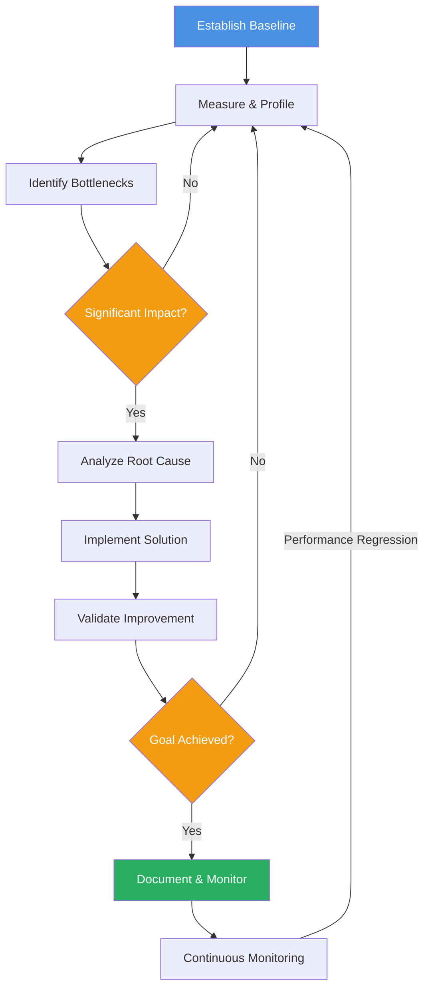
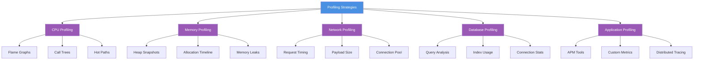
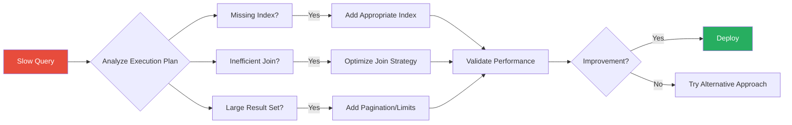
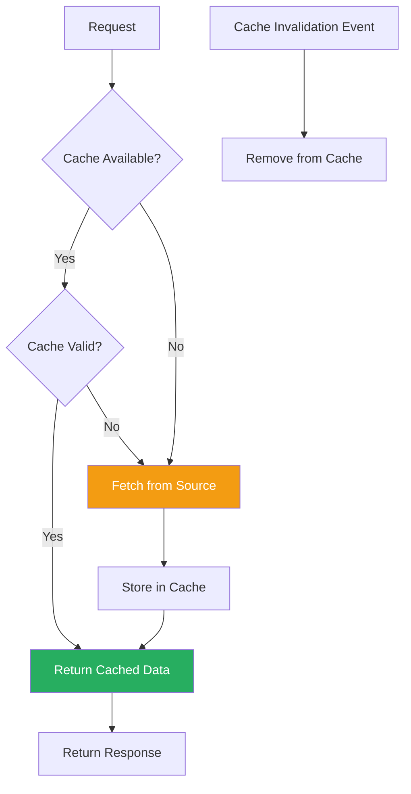

import PerformanceOptimizationImage from '/img/undraw_performance_overview.svg';

<div className="text--center margin-bottom--lg">
  <PerformanceOptimizationImage width="80%" height="300px" />
</div>

Performance optimization is a critical aspect of software engineering that directly impacts user experience, resource
utilization, and operational costs. This chapter explores systematic approaches to identifying, measuring, and resolving
performance bottlenecks through profiling, monitoring, and proven optimization techniques.

## Why Performance Matters

Performance is not just about speed—it's about delivering value to users efficiently:

- **User Experience**: Users expect responsive applications. Studies show that a 1-second delay in page load time can
  result in a 7% reduction in conversions.
- **Resource Efficiency**: Optimized applications consume fewer resources, reducing infrastructure costs and
  environmental impact.
- **Scalability**: Well-optimized systems can handle more load with the same resources, delaying the need for costly
  infrastructure upgrades.
- **Competitive Advantage**: Faster applications provide better user experiences, leading to higher engagement and
  customer satisfaction.

:::tip The Performance Paradox

Performance optimization should be data-driven, not assumption-driven. The bottleneck is rarely where you think it
is—measure first, optimize second.

:::

## The Performance Optimization Lifecycle



## Performance Profiling Techniques

### 1. Establish Performance Baselines

Before optimization, establish measurable baselines:

```javascript
// Example: Baseline metrics for a web API
const performanceBaseline = {
  endpoints: {
    'GET /api/users': {
      p50: 45, // 50th percentile response time (ms)
      p95: 120, // 95th percentile
      p99: 350, // 99th percentile
      throughput: 1500, // requests per second
      errorRate: 0.001, // 0.1% error rate
    },
  },
  database: {
    connectionPoolSize: 20,
    avgQueryTime: 15,
    slowQueryThreshold: 100,
  },
  memory: {
    heapUsed: 512, // MB
    heapTotal: 1024,
  },
};
```

### 2. Profiling Strategies



### 3. CPU Profiling

Identify CPU-intensive operations:

```javascript
// Node.js CPU profiling example
const { performance, PerformanceObserver } = require('perf_hooks');

// Mark critical sections
performance.mark('data-processing-start');

// Your CPU-intensive operation
function processLargeDataset(data) {
  return data
    .filter((item) => item.active)
    .map((item) => ({
      ...item,
      computed: expensiveCalculation(item),
    }))
    .sort((a, b) => b.score - a.score);
}

const result = processLargeDataset(largeDataset);

performance.mark('data-processing-end');
performance.measure('data-processing', 'data-processing-start', 'data-processing-end');

// Retrieve measurements
const measure = performance.getEntriesByName('data-processing')[0];
console.log(`Processing took ${measure.duration.toFixed(2)}ms`);
```

**Common CPU Profiling Tools:**

- **Chrome DevTools**: Built-in JavaScript profiler
- **Node.js Profiler**: `node --prof` and `node --prof-process`
- **Python cProfile**: Built-in profiling module
- **Java VisualVM**: Comprehensive Java profiling
- **Go pprof**: Built-in Go profiler

### 4. Memory Profiling

Detect memory leaks and inefficient memory usage:

```javascript
// Memory leak detection example
class UserCache {
  constructor() {
    this.cache = new Map();
    this.setupCleanup();
  }

  // ❌ BAD: Memory leak - listeners never removed
  addUserBad(userId, data) {
    this.cache.set(userId, data);
    // Event listener keeps reference, preventing garbage collection
    data.on('update', () => this.handleUpdate(userId));
  }

  // ✅ GOOD: Proper cleanup prevents memory leaks
  addUserGood(userId, data) {
    this.cache.set(userId, {
      data,
      listener: (event) => this.handleUpdate(userId, event),
    });

    const entry = this.cache.get(userId);
    data.on('update', entry.listener);
  }

  removeUser(userId) {
    const entry = this.cache.get(userId);
    if (entry) {
      entry.data.removeListener('update', entry.listener);
      this.cache.delete(userId);
    }
  }

  setupCleanup() {
    // Implement TTL-based cleanup
    setInterval(() => {
      const now = Date.now();
      for (const [userId, entry] of this.cache.entries()) {
        if (now - entry.timestamp > 3600000) {
          // 1 hour
          this.removeUser(userId);
        }
      }
    }, 300000); // Check every 5 minutes
  }
}
```

**Memory Profiling Tools:**

- **Chrome DevTools Memory Profiler**: Heap snapshots and allocation timelines
- **Node.js Heap Dump**: `heapdump` package
- **Valgrind**: Memory debugging for C/C++
- **Python memory_profiler**: Line-by-line memory usage
- **Java Mission Control**: Advanced JVM memory analysis

### 5. Database Profiling

Identify slow queries and optimize database performance:

```sql
-- Enable query logging (PostgreSQL)
ALTER DATABASE mydb SET log_min_duration_statement = 100; -- Log queries > 100ms

-- Analyze query performance
EXPLAIN ANALYZE
SELECT u.id, u.name, COUNT(o.id) as order_count
FROM users u
LEFT JOIN orders o ON u.id = o.user_id
WHERE u.created_at > '2024-01-01'
GROUP BY u.id, u.name
HAVING COUNT(o.id) > 5;

-- Check for missing indexes
SELECT
  schemaname,
  tablename,
  attname,
  n_distinct,
  correlation
FROM pg_stats
WHERE schemaname NOT IN ('pg_catalog', 'information_schema')
  AND n_distinct > 100
ORDER BY abs(correlation) ASC;
```

**Database Optimization Techniques:**



## Common Performance Bottlenecks

### 1. N+1 Query Problem

One of the most common database performance issues:

```javascript
// ❌ BAD: N+1 queries - 1 query for users + N queries for orders
async function getUsersWithOrdersBad() {
  const users = await db.query('SELECT * FROM users');

  // This creates N additional queries!
  for (const user of users) {
    user.orders = await db.query('SELECT * FROM orders WHERE user_id = ?', [user.id]);
  }

  return users;
}

// ✅ GOOD: Single query with JOIN or eager loading
async function getUsersWithOrdersGood() {
  return await db.query(`
    SELECT
      u.*,
      JSON_AGG(
        JSON_BUILD_OBJECT('id', o.id, 'total', o.total, 'created_at', o.created_at)
      ) as orders
    FROM users u
    LEFT JOIN orders o ON u.id = o.user_id
    GROUP BY u.id
  `);
}

// ✅ ALSO GOOD: Using ORM with eager loading
async function getUsersWithOrdersORM() {
  return await User.findAll({
    include: [
      {
        model: Order,
        as: 'orders',
      },
    ],
  });
}
```

### 2. Inefficient Algorithms

Algorithm complexity matters at scale:

```javascript
// ❌ BAD: O(n²) complexity
function findDuplicatesBad(array) {
  const duplicates = [];
  for (let i = 0; i < array.length; i++) {
    for (let j = i + 1; j < array.length; j++) {
      if (array[i] === array[j] && !duplicates.includes(array[i])) {
        duplicates.push(array[i]);
      }
    }
  }
  return duplicates;
}

// ✅ GOOD: O(n) complexity using Set
function findDuplicatesGood(array) {
  const seen = new Set();
  const duplicates = new Set();

  for (const item of array) {
    if (seen.has(item)) {
      duplicates.add(item);
    } else {
      seen.add(item);
    }
  }

  return Array.from(duplicates);
}

// Performance comparison
const largeArray = Array.from({ length: 10000 }, () => Math.floor(Math.random() * 5000));

console.time('Bad Algorithm');
findDuplicatesBad(largeArray); // ~500ms
console.timeEnd('Bad Algorithm');

console.time('Good Algorithm');
findDuplicatesGood(largeArray); // ~2ms
console.timeEnd('Good Algorithm');
```

### 3. Memory Leaks

Common causes of memory leaks:

```javascript
// ❌ BAD: Event listener memory leak
class DataFetcher {
  constructor(apiClient) {
    this.apiClient = apiClient;

    // Memory leak: never removed
    this.apiClient.on('response', (data) => {
      this.processData(data);
    });
  }

  processData(data) {
    // Process data
  }
}

// ✅ GOOD: Proper cleanup
class DataFetcherGood {
  constructor(apiClient) {
    this.apiClient = apiClient;
    this.responseHandler = this.processData.bind(this);
    this.apiClient.on('response', this.responseHandler);
  }

  processData(data) {
    // Process data
  }

  destroy() {
    this.apiClient.removeListener('response', this.responseHandler);
    this.apiClient = null;
  }
}

// ❌ BAD: Closure memory leak
function createHandlers() {
  const largeData = new Array(1000000).fill('data');

  return {
    process: () => {
      // This closure captures largeData even if not used
      console.log('Processing');
    },
  };
}

// ✅ GOOD: Avoid unnecessary closures
function createHandlersGood() {
  return {
    process: () => {
      console.log('Processing');
      // No large data captured
    },
  };
}
```

### 4. Synchronous I/O Blocking

Blocking operations hurt performance:

```javascript
// ❌ BAD: Synchronous file operations block the event loop
const fs = require('fs');

function processFilesBad(filePaths) {
  const results = [];
  for (const path of filePaths) {
    // Blocks event loop for each file!
    const content = fs.readFileSync(path, 'utf8');
    results.push(processContent(content));
  }
  return results;
}

// ✅ GOOD: Asynchronous operations with concurrency control
const fs = require('fs').promises;

async function processFilesGood(filePaths, concurrency = 5) {
  const results = [];

  // Process files in batches to control concurrency
  for (let i = 0; i < filePaths.length; i += concurrency) {
    const batch = filePaths.slice(i, i + concurrency);
    const batchResults = await Promise.all(
      batch.map(async (path) => {
        const content = await fs.readFile(path, 'utf8');
        return processContent(content);
      })
    );
    results.push(...batchResults);
  }

  return results;
}
```

## Optimization Strategies

### 1. Caching

Strategic caching can dramatically improve performance:



**Multi-Layer Caching Strategy:**

```javascript
class CacheManager {
  constructor() {
    // Layer 1: In-memory cache (fastest)
    this.memoryCache = new Map();

    // Layer 2: Redis cache (fast, shared)
    this.redisClient = createRedisClient();

    // Layer 3: CDN/Edge cache (for static content)
  }

  async get(key, fetchFunction, options = {}) {
    const { ttl = 300, layers = ['memory', 'redis'] } = options;

    // Check memory cache first
    if (layers.includes('memory')) {
      const memoryValue = this.memoryCache.get(key);
      if (memoryValue && Date.now() < memoryValue.expiry) {
        return memoryValue.data;
      }
    }

    // Check Redis cache
    if (layers.includes('redis')) {
      const redisValue = await this.redisClient.get(key);
      if (redisValue) {
        const data = JSON.parse(redisValue);
        // Populate memory cache
        this.setMemoryCache(key, data, ttl);
        return data;
      }
    }

    // Cache miss - fetch from source
    const data = await fetchFunction();

    // Store in all cache layers
    await this.set(key, data, { ttl, layers });

    return data;
  }

  async set(key, data, options = {}) {
    const { ttl = 300, layers = ['memory', 'redis'] } = options;

    if (layers.includes('memory')) {
      this.setMemoryCache(key, data, ttl);
    }

    if (layers.includes('redis')) {
      await this.redisClient.setex(key, ttl, JSON.stringify(data));
    }
  }

  setMemoryCache(key, data, ttl) {
    this.memoryCache.set(key, {
      data,
      expiry: Date.now() + ttl * 1000,
    });
  }

  async invalidate(key, layers = ['memory', 'redis']) {
    if (layers.includes('memory')) {
      this.memoryCache.delete(key);
    }

    if (layers.includes('redis')) {
      await this.redisClient.del(key);
    }
  }
}

// Usage example
const cache = new CacheManager();

async function getUser(userId) {
  return cache.get(
    `user:${userId}`,
    async () => {
      // This only runs on cache miss
      return await db.query('SELECT * FROM users WHERE id = ?', [userId]);
    },
    { ttl: 600, layers: ['memory', 'redis'] }
  );
}
```

### 2. Lazy Loading and Code Splitting

Load resources only when needed:

```javascript
// ❌ BAD: Loading everything upfront
import HeavyComponent from './HeavyComponent';
import RarelyUsedFeature from './RarelyUsedFeature';
import LargeLibrary from 'large-library';

function App() {
  return (
    <div>
      <HeavyComponent />
      <RarelyUsedFeature />
    </div>
  );
}

// ✅ GOOD: Lazy loading with React
import { lazy, Suspense } from 'react';

const HeavyComponent = lazy(() => import('./HeavyComponent'));
const RarelyUsedFeature = lazy(() => import('./RarelyUsedFeature'));

function App() {
  return (
    <div>
      <Suspense fallback={<LoadingSpinner />}>
        <HeavyComponent />
      </Suspense>

      {showRareFeature && (
        <Suspense fallback={<LoadingSpinner />}>
          <RarelyUsedFeature />
        </Suspense>
      )}
    </div>
  );
}

// ✅ GOOD: Dynamic imports for large libraries
async function processData(data) {
  // Only load the library when needed
  const { default: heavyLibrary } = await import('large-library');
  return heavyLibrary.process(data);
}
```

### 3. Database Query Optimization

```javascript
// ❌ BAD: Selecting all columns and filtering in application
async function getActiveUsersBad() {
  const users = await db.query('SELECT * FROM users');
  return users.filter((u) => u.status === 'active' && u.email_verified === true);
}

// ✅ GOOD: Filter in database with proper indexing
async function getActiveUsersGood() {
  return await db.query(`
    SELECT id, name, email, created_at
    FROM users
    WHERE status = 'active'
      AND email_verified = true
    -- Ensure index exists: CREATE INDEX idx_users_status_verified
    -- ON users(status, email_verified)
  `);
}

// ✅ GOOD: Use pagination for large result sets
async function getActiveUsersPaginated(page = 1, pageSize = 50) {
  const offset = (page - 1) * pageSize;

  const [users, totalCount] = await Promise.all([
    db.query(
      `
      SELECT id, name, email, created_at
      FROM users
      WHERE status = 'active' AND email_verified = true
      ORDER BY created_at DESC
      LIMIT ? OFFSET ?
    `,
      [pageSize, offset]
    ),
    db.query(`
      SELECT COUNT(*) as total
      FROM users
      WHERE status = 'active' AND email_verified = true
    `),
  ]);

  return {
    users,
    pagination: {
      page,
      pageSize,
      totalPages: Math.ceil(totalCount[0].total / pageSize),
      totalCount: totalCount[0].total,
    },
  };
}
```

### 4. Parallel Processing

Leverage concurrency for independent operations:

```javascript
// ❌ BAD: Sequential processing
async function getUserDashboardBad(userId) {
  const user = await fetchUser(userId);
  const orders = await fetchOrders(userId);
  const recommendations = await fetchRecommendations(userId);
  const notifications = await fetchNotifications(userId);

  return { user, orders, recommendations, notifications };
}

// ✅ GOOD: Parallel processing
async function getUserDashboardGood(userId) {
  const [user, orders, recommendations, notifications] = await Promise.all([
    fetchUser(userId),
    fetchOrders(userId),
    fetchRecommendations(userId),
    fetchNotifications(userId),
  ]);

  return { user, orders, recommendations, notifications };
}

// ✅ BETTER: With error handling and fallbacks
async function getUserDashboardBetter(userId) {
  const [userResult, ordersResult, recommendationsResult, notificationsResult] = await Promise.allSettled([
    fetchUser(userId),
    fetchOrders(userId),
    fetchRecommendations(userId),
    fetchNotifications(userId),
  ]);

  return {
    user: userResult.status === 'fulfilled' ? userResult.value : null,
    orders: ordersResult.status === 'fulfilled' ? ordersResult.value : [],
    recommendations: recommendationsResult.status === 'fulfilled' ? recommendationsResult.value : [],
    notifications: notificationsResult.status === 'fulfilled' ? notificationsResult.value : [],
    errors: [userResult, ordersResult, recommendationsResult, notificationsResult]
      .filter((r) => r.status === 'rejected')
      .map((r) => r.reason),
  };
}
```

### 5. Resource Pooling

Reuse expensive resources:

```javascript
// Connection pool for database
const { Pool } = require('pg');

const pool = new Pool({
  host: 'localhost',
  database: 'mydb',
  max: 20, // Maximum pool size
  idleTimeoutMillis: 30000, // Close idle connections after 30s
  connectionTimeoutMillis: 2000, // Timeout for acquiring connection
});

// ✅ GOOD: Reuse connections from pool
async function queryDatabase(sql, params) {
  const client = await pool.connect();
  try {
    return await client.query(sql, params);
  } finally {
    client.release(); // Return to pool
  }
}

// Worker pool for CPU-intensive tasks
const { Worker } = require('worker_threads');

class WorkerPool {
  constructor(workerScript, poolSize = 4) {
    this.workerScript = workerScript;
    this.poolSize = poolSize;
    this.workers = [];
    this.queue = [];
    this.initializePool();
  }

  initializePool() {
    for (let i = 0; i < this.poolSize; i++) {
      this.workers.push({
        worker: new Worker(this.workerScript),
        available: true,
      });
    }
  }

  async execute(data) {
    return new Promise((resolve, reject) => {
      const availableWorker = this.workers.find((w) => w.available);

      if (availableWorker) {
        this.runTask(availableWorker, data, resolve, reject);
      } else {
        this.queue.push({ data, resolve, reject });
      }
    });
  }

  runTask(workerObj, data, resolve, reject) {
    workerObj.available = false;

    const onMessage = (result) => {
      cleanup();
      workerObj.available = true;
      resolve(result);
      this.processQueue();
    };

    const onError = (error) => {
      cleanup();
      workerObj.available = true;
      reject(error);
      this.processQueue();
    };

    const cleanup = () => {
      workerObj.worker.off('message', onMessage);
      workerObj.worker.off('error', onError);
    };

    workerObj.worker.on('message', onMessage);
    workerObj.worker.on('error', onError);
    workerObj.worker.postMessage(data);
  }

  processQueue() {
    if (this.queue.length === 0) return;

    const availableWorker = this.workers.find((w) => w.available);
    if (availableWorker) {
      const { data, resolve, reject } = this.queue.shift();
      this.runTask(availableWorker, data, resolve, reject);
    }
  }
}
```

## Performance Monitoring

### Application Performance Monitoring (APM)

```javascript
// Example: Custom APM middleware
class PerformanceMonitor {
  constructor() {
    this.metrics = new Map();
  }

  middleware() {
    return (req, res, next) => {
      const startTime = Date.now();
      const startMemory = process.memoryUsage().heapUsed;

      // Track response
      res.on('finish', () => {
        const duration = Date.now() - startTime;
        const memoryDelta = process.memoryUsage().heapUsed - startMemory;

        this.recordMetric({
          endpoint: `${req.method} ${req.route?.path || req.path}`,
          duration,
          memoryDelta,
          statusCode: res.statusCode,
          timestamp: new Date(),
        });
      });

      next();
    };
  }

  recordMetric(metric) {
    const key = metric.endpoint;

    if (!this.metrics.has(key)) {
      this.metrics.set(key, {
        count: 0,
        totalDuration: 0,
        minDuration: Infinity,
        maxDuration: 0,
        durations: [],
        errors: 0,
      });
    }

    const stats = this.metrics.get(key);
    stats.count++;
    stats.totalDuration += metric.duration;
    stats.minDuration = Math.min(stats.minDuration, metric.duration);
    stats.maxDuration = Math.max(stats.maxDuration, metric.duration);
    stats.durations.push(metric.duration);

    if (metric.statusCode >= 400) {
      stats.errors++;
    }

    // Keep only last 1000 durations for percentile calculations
    if (stats.durations.length > 1000) {
      stats.durations.shift();
    }
  }

  getStats(endpoint) {
    const stats = this.metrics.get(endpoint);
    if (!stats) return null;

    const sortedDurations = [...stats.durations].sort((a, b) => a - b);
    const p50Index = Math.floor(sortedDurations.length * 0.5);
    const p95Index = Math.floor(sortedDurations.length * 0.95);
    const p99Index = Math.floor(sortedDurations.length * 0.99);

    return {
      endpoint,
      requestCount: stats.count,
      averageDuration: stats.totalDuration / stats.count,
      minDuration: stats.minDuration,
      maxDuration: stats.maxDuration,
      p50: sortedDurations[p50Index],
      p95: sortedDurations[p95Index],
      p99: sortedDurations[p99Index],
      errorRate: stats.errors / stats.count,
    };
  }

  getAllStats() {
    const allStats = [];
    for (const endpoint of this.metrics.keys()) {
      allStats.push(this.getStats(endpoint));
    }
    return allStats.sort((a, b) => b.p95 - a.p95); // Sort by p95 descending
  }
}
```

### Real User Monitoring (RUM)

```javascript
// Client-side performance tracking
class RealUserMonitoring {
  constructor(apiEndpoint) {
    this.apiEndpoint = apiEndpoint;
    this.initializeObservers();
  }

  initializeObservers() {
    // Core Web Vitals
    this.observeLCP(); // Largest Contentful Paint
    this.observeFID(); // First Input Delay
    this.observeCLS(); // Cumulative Layout Shift

    // Navigation timing
    window.addEventListener('load', () => {
      this.reportNavigationTiming();
    });

    // Resource timing
    this.observeResourceTiming();
  }

  observeLCP() {
    const observer = new PerformanceObserver((list) => {
      const entries = list.getEntries();
      const lastEntry = entries[entries.length - 1];

      this.reportMetric({
        name: 'LCP',
        value: lastEntry.renderTime || lastEntry.loadTime,
        rating: this.getRating('LCP', lastEntry.renderTime || lastEntry.loadTime),
      });
    });

    observer.observe({ entryTypes: ['largest-contentful-paint'] });
  }

  observeFID() {
    const observer = new PerformanceObserver((list) => {
      const entries = list.getEntries();
      entries.forEach((entry) => {
        this.reportMetric({
          name: 'FID',
          value: entry.processingStart - entry.startTime,
          rating: this.getRating('FID', entry.processingStart - entry.startTime),
        });
      });
    });

    observer.observe({ entryTypes: ['first-input'] });
  }

  observeCLS() {
    let clsValue = 0;
    const observer = new PerformanceObserver((list) => {
      for (const entry of list.getEntries()) {
        if (!entry.hadRecentInput) {
          clsValue += entry.value;
        }
      }

      this.reportMetric({
        name: 'CLS',
        value: clsValue,
        rating: this.getRating('CLS', clsValue),
      });
    });

    observer.observe({ entryTypes: ['layout-shift'] });
  }

  reportNavigationTiming() {
    const navigation = performance.getEntriesByType('navigation')[0];

    this.reportMetric({
      name: 'page-load',
      timings: {
        dns: navigation.domainLookupEnd - navigation.domainLookupStart,
        tcp: navigation.connectEnd - navigation.connectStart,
        ttfb: navigation.responseStart - navigation.requestStart,
        download: navigation.responseEnd - navigation.responseStart,
        domInteractive: navigation.domInteractive - navigation.fetchStart,
        domComplete: navigation.domComplete - navigation.fetchStart,
        loadComplete: navigation.loadEventEnd - navigation.fetchStart,
      },
    });
  }

  getRating(metric, value) {
    const thresholds = {
      LCP: { good: 2500, needsImprovement: 4000 },
      FID: { good: 100, needsImprovement: 300 },
      CLS: { good: 0.1, needsImprovement: 0.25 },
    };

    const threshold = thresholds[metric];
    if (value <= threshold.good) return 'good';
    if (value <= threshold.needsImprovement) return 'needs-improvement';
    return 'poor';
  }

  reportMetric(metric) {
    // Send to analytics endpoint
    navigator.sendBeacon(
      this.apiEndpoint,
      JSON.stringify({
        ...metric,
        url: window.location.href,
        userAgent: navigator.userAgent,
        timestamp: Date.now(),
      })
    );
  }

  observeResourceTiming() {
    const observer = new PerformanceObserver((list) => {
      const entries = list.getEntries();
      entries.forEach((entry) => {
        if (entry.duration > 1000) {
          // Report slow resources
          this.reportMetric({
            name: 'slow-resource',
            resource: entry.name,
            duration: entry.duration,
            type: entry.initiatorType,
          });
        }
      });
    });

    observer.observe({ entryTypes: ['resource'] });
  }
}

// Initialize RUM
if (typeof window !== 'undefined') {
  new RealUserMonitoring('/api/metrics');
}
```

## Performance Testing

### Load Testing

```javascript
// Example: Simple load test with autocannon
const autocannon = require('autocannon');

async function runLoadTest() {
  const result = await autocannon({
    url: 'http://localhost:3000/api/users',
    connections: 100, // Concurrent connections
    duration: 30, // Test duration in seconds
    pipelining: 1,
    headers: {
      'Content-Type': 'application/json',
    },
  });

  console.log('Load Test Results:');
  console.log(`Requests: ${result.requests.total}`);
  console.log(`Throughput: ${result.throughput.mean} bytes/sec`);
  console.log(`Latency: p50=${result.latency.p50}ms, p95=${result.latency.p95}ms, p99=${result.latency.p99}ms`);
  console.log(`Errors: ${result.errors}`);

  return result;
}

// Stress test - gradually increase load
async function runStressTest() {
  const stages = [
    { connections: 10, duration: 30 },
    { connections: 50, duration: 30 },
    { connections: 100, duration: 30 },
    { connections: 200, duration: 30 },
    { connections: 500, duration: 30 },
  ];

  const results = [];

  for (const stage of stages) {
    console.log(`\nRunning stage: ${stage.connections} connections for ${stage.duration}s`);
    const result = await autocannon({
      url: 'http://localhost:3000/api/users',
      connections: stage.connections,
      duration: stage.duration,
    });

    results.push({
      connections: stage.connections,
      throughput: result.throughput.mean,
      latencyP95: result.latency.p95,
      errors: result.errors,
    });

    // Break if error rate exceeds threshold
    if (result.errors / result.requests.total > 0.05) {
      console.log('Error rate exceeded 5%, stopping stress test');
      break;
    }
  }

  return results;
}
```

## Best Practices

### 1. Performance Budgets

Establish and enforce performance budgets:

```javascript
// performance-budget.config.js
module.exports = {
  budgets: {
    // Time budgets
    ttfb: 600, // Time to First Byte (ms)
    fcp: 1800, // First Contentful Paint (ms)
    lcp: 2500, // Largest Contentful Paint (ms)
    tti: 3800, // Time to Interactive (ms)
    tbt: 300, // Total Blocking Time (ms)
    cls: 0.1, // Cumulative Layout Shift

    // Size budgets (bytes)
    'bundle.js': 250000, // 250KB
    'style.css': 50000, // 50KB
    totalImages: 500000, // 500KB
    totalPage: 1000000, // 1MB
  },

  // Lighthouse CI configuration
  lighthouse: {
    performance: 90,
    accessibility: 90,
    'best-practices': 90,
    seo: 90,
  },
};
```

### 2. Progressive Enhancement

Build for performance from the ground up:

```javascript
// ✅ GOOD: Progressive enhancement approach
function initializeFeatures() {
  // Core functionality (always loaded)
  initializeEssentialFeatures();

  // Enhanced features (load conditionally)
  if ('IntersectionObserver' in window) {
    initializeLazyLoading();
  }

  if ('serviceWorker' in navigator) {
    registerServiceWorker();
  }

  // Premium features (load on interaction)
  document.addEventListener(
    'click',
    () => {
      import('./premium-features.js').then((module) => {
        module.initialize();
      });
    },
    { once: true, passive: true }
  );
}
```

### 3. Optimize Critical Rendering Path

```html
<!DOCTYPE html>
<html>
  <head>
    <meta charset="UTF-8" />
    <meta name="viewport" content="width=device-width, initial-scale=1.0" />

    <!-- Critical CSS inline -->
    <style>
      /* Above-the-fold styles */
      body {
        margin: 0;
        font-family: system-ui;
      }
      .hero {
        min-height: 100vh;
      }
    </style>

    <!-- Preconnect to required origins -->
    <link rel="preconnect" href="https://api.example.com" />
    <link rel="dns-prefetch" href="https://cdn.example.com" />

    <!-- Preload critical resources -->
    <link rel="preload" as="font" href="/fonts/main.woff2" type="font/woff2" crossorigin />
    <link rel="preload" as="image" href="/hero-image.jpg" />

    <!-- Defer non-critical CSS -->
    <link rel="preload" as="style" href="/styles/main.css" onload="this.rel='stylesheet'" />

    <!-- Async JavaScript -->
    <script src="/js/analytics.js" async></script>
  </head>
  <body>
    <!-- Content -->

    <!-- Defer main application bundle -->
    <script src="/js/app.js" defer></script>
  </body>
</html>
```

### 4. Monitor and Alert

Set up automated performance monitoring:

```javascript
// Example: Performance monitoring with alerts
class PerformanceAlertSystem {
  constructor(config) {
    this.config = config;
    this.violations = [];
  }

  checkMetrics(metrics) {
    const violations = [];

    // Check against thresholds
    if (metrics.latencyP95 > this.config.thresholds.latencyP95) {
      violations.push({
        type: 'high-latency',
        value: metrics.latencyP95,
        threshold: this.config.thresholds.latencyP95,
        severity: 'warning',
      });
    }

    if (metrics.errorRate > this.config.thresholds.errorRate) {
      violations.push({
        type: 'high-error-rate',
        value: metrics.errorRate,
        threshold: this.config.thresholds.errorRate,
        severity: 'critical',
      });
    }

    if (metrics.throughput < this.config.thresholds.minThroughput) {
      violations.push({
        type: 'low-throughput',
        value: metrics.throughput,
        threshold: this.config.thresholds.minThroughput,
        severity: 'warning',
      });
    }

    // Send alerts for violations
    if (violations.length > 0) {
      this.sendAlerts(violations);
    }

    return violations;
  }

  async sendAlerts(violations) {
    for (const violation of violations) {
      if (violation.severity === 'critical') {
        await this.sendPagerDutyAlert(violation);
      } else {
        await this.sendSlackNotification(violation);
      }
    }
  }

  async sendSlackNotification(violation) {
    // Implement Slack webhook
    console.log('Slack notification:', violation);
  }

  async sendPagerDutyAlert(violation) {
    // Implement PagerDuty integration
    console.log('PagerDuty alert:', violation);
  }
}
```

## Tools and Resources

### Profiling Tools

- **Chrome DevTools**: Comprehensive browser profiling
- **Node.js Profiler**: Built-in CPU and heap profiling
- **Clinic.js**: Node.js performance profiling suite
- **py-spy**: Sampling profiler for Python
- **perf**: Linux performance analysis tools
- **Java Flight Recorder**: Low-overhead JVM profiling

### Load Testing Tools

- **Apache JMeter**: Feature-rich load testing
- **k6**: Modern load testing for developers
- **Gatling**: High-performance load testing
- **Artillery**: Modern, powerful, easy-to-use
- **Autocannon**: Fast HTTP benchmarking

### APM Solutions

- **New Relic**: Full-stack application monitoring
- **Datadog**: Infrastructure and application monitoring
- **AppDynamics**: Business-centric application monitoring
- **Elastic APM**: Open-source APM solution
- **Prometheus + Grafana**: Metrics and visualization

### Performance Analysis

- **Lighthouse**: Automated web performance auditing
- **WebPageTest**: Advanced web performance testing
- **Speedcurve**: Continuous performance monitoring
- **Sitespeed.io**: Open-source web performance tool

## Key Takeaways

1. **Measure First**: Never optimize without data. Profile and measure to identify real bottlenecks.

2. **Set Baselines**: Establish performance baselines and budgets to track progress and prevent regressions.

3. **Focus on Impact**: Optimize high-impact areas first. Use the 80/20 rule—20% of optimizations often yield 80% of
   improvements.

4. **Think Holistically**: Performance optimization spans frontend, backend, database, and infrastructure. Consider the
   entire stack.

5. **Monitor Continuously**: Performance is not a one-time effort. Implement continuous monitoring and alerting.

6. **Cache Strategically**: Caching is powerful but complex. Implement appropriate cache invalidation strategies.

7. **Test Realistically**: Load test with realistic scenarios, data volumes, and user patterns.

8. **Document Everything**: Document performance characteristics, optimization decisions, and monitoring procedures.

9. **Balance Trade-offs**: Sometimes performance optimization conflicts with other goals (readability, maintainability).
   Make informed trade-offs.

10. **Automate Performance Testing**: Integrate performance testing into CI/CD pipelines to catch regressions early.

:::tip Remember

"Premature optimization is the root of all evil, but that doesn't mean you should ignore performance entirely. Build
with performance in mind from the start, then optimize based on real data."

:::

## Conclusion

Performance optimization is a continuous journey, not a destination. By establishing baselines, measuring
systematically, identifying bottlenecks through profiling, and applying targeted optimizations, you can build
applications that deliver exceptional user experiences while making efficient use of resources.

The key is to approach performance optimization methodically: measure, analyze, optimize, and validate. Combined with
continuous monitoring and automated testing, this approach ensures your applications remain performant as they evolve
and scale.

Remember that the best performance optimization is the one that provides the most value to your users with the least
complexity. Focus on what matters, measure everything, and always validate your assumptions with real data.
