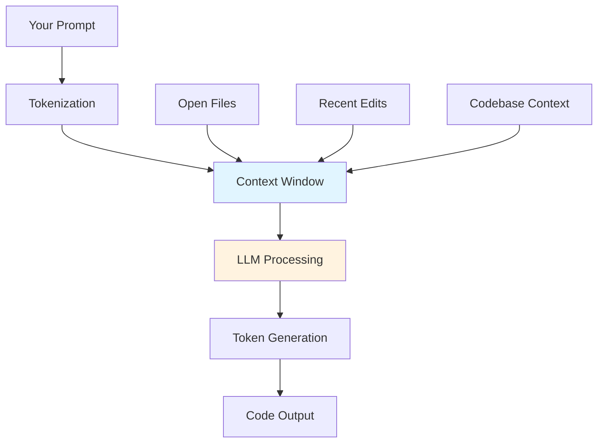
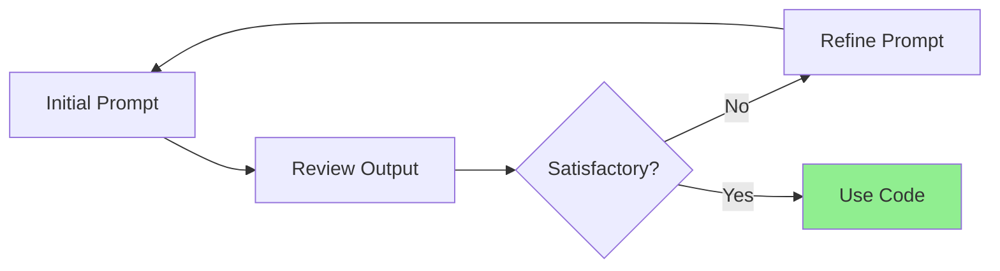
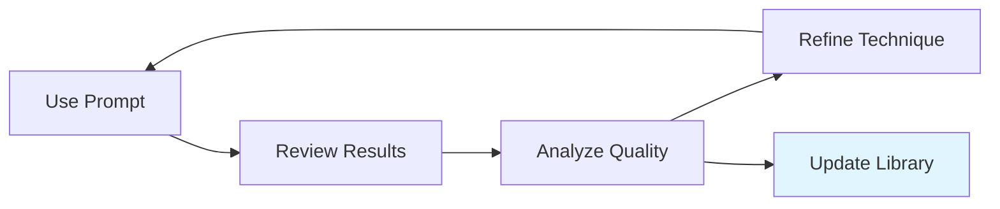

import PromptEngineeringImage from '/img/undraw_artificial_intelligence.svg';

<div className="text--center margin-bottom--lg">
  <PromptEngineeringImage width="80%" height="300px" />
</div>

Prompt engineering is the practice of crafting effective instructions for AI coding assistants to generate high-quality
code, solve problems, and accelerate development workflows. As AI tools become integral to software development,
mastering prompt engineering is essential for maximizing productivity while maintaining code quality.

## Understanding AI Coding Assistants

Modern AI coding assistants leverage Large Language Models (LLMs) trained on vast codebases. Understanding their
capabilities and limitations helps you work with them effectively.

### Common AI Tools

- **Cursor AI**: IDE with integrated AI chat and inline editing capabilities
- **GitHub Copilot**: Inline code suggestions and chat interface
- **Claude Code**: Conversational AI for complex reasoning and code analysis
- **Amazon CodeWhisperer**: AWS-focused code suggestions
- **Tabnine**: Privacy-focused AI completions

### How LLMs Process Code



:::info Understanding Context Windows

AI models have limited context windows (typically 4K-200K tokens). Every prompt, file content, and conversation history
consumes tokens. Efficient context management is crucial for quality results.

:::

## Core Principles of Effective Prompting

### 1. Be Specific and Explicit

Vague prompts lead to generic, often incorrect code. Provide clear requirements, constraints, and expected behavior.

**Bad Prompt:**

```
Create a function to process data
```

**Good Prompt:**

```
Create a TypeScript function that:
- Accepts an array of user objects with id, name, and email fields
- Filters out users without valid email addresses (must contain @ and .)
- Returns a sorted array by name (case-insensitive)
- Handles empty arrays gracefully
- Includes TypeScript types and JSDoc comments
```

### 2. Provide Context

Include relevant information about your architecture, coding standards, and existing patterns.

**Example with Context:**

```
We use React with TypeScript and follow these patterns:
- Functional components with hooks
- Custom hooks for data fetching (useQuery pattern)
- Error boundaries for error handling
- Zod for validation

Create a user profile component that fetches and displays user data with loading and error states.
```

### 3. Specify Quality Requirements

Explicitly request testing, error handling, documentation, or performance considerations.

```
Implement a retry mechanism for HTTP requests that:
- Uses exponential backoff (starting at 100ms, max 5 attempts)
- Only retries on network errors and 5xx status codes
- Includes comprehensive unit tests with mocked fetch
- Has proper TypeScript types
- Logs retry attempts for debugging
```

## Prompting Patterns for Common Tasks

### Code Generation Pattern

Use a structured template for generating new code:

```
Task: [What you want to build]

Requirements:
- [Functional requirement 1]
- [Functional requirement 2]
- [Non-functional requirement]

Constraints:
- [Technology/library constraint]
- [Performance constraint]
- [Compatibility constraint]

Context:
- [Existing architecture details]
- [Coding standards]
- [Related code patterns]

Please include:
- Error handling
- Input validation
- Unit tests
- Documentation
```

### Debugging Pattern

Structure debugging requests for faster resolution:

```
Problem: [Clear description of the issue]

Expected behavior: [What should happen]

Actual behavior: [What actually happens]

Code:
[Relevant code snippet]

Error message:
[Full error stack trace]

Environment:
- [Language/framework version]
- [Relevant dependencies]

What I've tried:
- [Attempted solution 1]
- [Attempted solution 2]
```

**Example:**

````
Problem: API endpoint returns 500 error when creating a user

Expected: Should return 201 with user object

Actual: Returns 500 with "Cannot read property 'id' of undefined"

Code:
```typescript
async function createUser(req: Request, res: Response) {
  const { name, email } = req.body;
  const user = await db.users.create({ name, email });
  return res.status(201).json({ id: user.id, name, email });
}
```

Error: TypeError: Cannot read property 'id' of undefined at createUser

Environment: Node.js 18, Express 4.18, PostgreSQL

What I've tried:
- Verified database connection works
- Checked that create method exists
````

### Refactoring Pattern

Guide AI through thoughtful refactoring:

```
Current code:
[Code to refactor]

Issues with current code:
- [Problem 1: e.g., poor readability]
- [Problem 2: e.g., code duplication]
- [Problem 3: e.g., performance concerns]

Refactoring goals:
- [Goal 1: e.g., extract reusable functions]
- [Goal 2: e.g., improve error handling]
- [Goal 3: e.g., add type safety]

Please:
- Explain the changes you make
- Maintain backward compatibility
- Keep existing tests passing
```

### Code Review Pattern

Get comprehensive code reviews:

```
Please review this code for:

1. Security vulnerabilities (SQL injection, XSS, etc.)
2. Performance issues (N+1 queries, memory leaks)
3. Error handling gaps
4. Code style and best practices
5. Missing edge cases in tests

Code:
[Code to review]

Context:
- This is a [description of component/feature]
- It handles [critical functionality]
- Performance requirements: [requirements]
```

## Advanced Prompting Techniques

### Chain-of-Thought Prompting

Break complex tasks into steps for better reasoning:

```
I need to implement a rate limiting middleware for our API.

Please approach this step-by-step:

1. First, analyze the requirements and suggest an appropriate algorithm
2. Then, design the data structure for tracking requests
3. Next, implement the core rate limiting logic
4. Finally, add comprehensive tests for edge cases

Requirements:
- Support per-user rate limits (100 requests/minute)
- Use Redis for distributed rate limiting
- Return appropriate HTTP 429 responses
- Include Retry-After header
```

### Few-Shot Learning

Provide examples of your desired code style:

````
Here's how we structure our API handlers:

Example 1:
```typescript
export const getUser = asyncHandler(async (req, res) => {
  const userId = parseInt(req.params.id);
  const user = await userService.findById(userId);

  if (!user) {
    throw new NotFoundError('User not found');
  }

  return res.json({ data: user });
});
```

Example 2:
```typescript
export const deletePost = asyncHandler(async (req, res) => {
  const postId = parseInt(req.params.id);
  await postService.delete(postId);

  return res.status(204).send();
});
```

Now create a handler for updating a user's profile following the same pattern.
````

### Iterative Refinement

Start broad, then narrow down:



**First iteration:**

```
Create a data validation function for user input
```

**After reviewing output:**

```
The validation looks good, but please add:
- Support for custom error messages
- Validation for nested objects
- TypeScript generic types for better type inference
- Example usage in comments
```

### Negative Prompting

Specify what you DON'T want:

```
Create a function to sort an array of products by price.

Requirements:
- Sort in ascending order by default
- Support descending order via parameter
- Handle null/undefined prices

Do NOT:
- Mutate the original array
- Use external libraries
- Include complex optimization (keep it simple)
- Add unnecessary abstractions
```

## Context Management Strategies

### Providing Minimal Sufficient Context

Only include relevant code to avoid token waste and confusion.

**Bad - Too much context:**

```
Here's my entire 500-line controller file:
[500 lines of code]

Can you help me fix the authentication check in the login method?
```

**Good - Targeted context:**

````
Here's the authentication check that's failing:

```typescript
if (user && user.password === hashedPassword) {
  return generateToken(user);
}
```

The password comparison isn't working correctly. We use bcrypt for hashing.
````

### Using File Context Effectively

Many AI tools automatically include open file context. Leverage this:

1. **Open relevant files** before prompting
2. **Close unrelated files** to reduce noise
3. **Navigate to specific functions** you're discussing
4. **Use workspace search** results as context

### Referencing Code Patterns

Point AI to existing patterns in your codebase:

```
We have a pattern for data fetching in components (see UserList.tsx).
Create a similar component for displaying products, following the same pattern:
- Custom useProducts hook
- Loading/error states with Suspense
- Virtualized scrolling for large lists
```

## Prompting for Different Scenarios

### Testing and Test Generation

````
Generate comprehensive unit tests for this function:

```typescript
function calculateShippingCost(weight: number, distance: number, express: boolean): number {
  const baseRate = 5.00;
  const weightRate = 0.50;
  const distanceRate = 0.10;
  const expressMultiplier = 2.0;

  let cost = baseRate + (weight * weightRate) + (distance * distanceRate);

  if (express) {
    cost *= expressMultiplier;
  }

  return Math.round(cost * 100) / 100;
}
```

Please test:
- Normal cases with various inputs
- Edge cases (zero weight, zero distance)
- Boundary values
- Express vs standard shipping
- Rounding behavior
- Invalid inputs (negative values)

Use Jest and follow AAA pattern (Arrange, Act, Assert).
````

### Documentation Generation

````
Generate comprehensive documentation for this API endpoint:

```typescript
router.post('/api/v1/orders', authenticate, async (req, res) => {
  const { items, shippingAddress, paymentMethod } = req.body;

  // Validation
  if (!items || items.length === 0) {
    return res.status(400).json({ error: 'Order must contain items' });
  }

  // Create order
  const order = await orderService.create({
    userId: req.user.id,
    items,
    shippingAddress,
    paymentMethod,
  });

  return res.status(201).json({ data: order });
});
```

Include:
- Endpoint description and purpose
- Authentication requirements
- Request body schema with types
- Response schema with examples
- Possible error responses
- Usage example with curl
````

### Performance Optimization

````
This function is causing performance issues with large datasets:

```typescript
function findDuplicates(arr: string[]): string[] {
  const duplicates: string[] = [];

  for (let i = 0; i < arr.length; i++) {
    for (let j = i + 1; j < arr.length; j++) {
      if (arr[i] === arr[j] && !duplicates.includes(arr[i])) {
        duplicates.push(arr[i]);
      }
    }
  }

  return duplicates;
}
```

Please:
1. Analyze the time complexity issue
2. Suggest an optimized approach
3. Implement the optimized version
4. Explain the performance improvement
5. Add benchmarks comparing both versions

Constraints: Must maintain same functionality, no external libraries.
````

### Security Review

````
Review this authentication middleware for security vulnerabilities:

```typescript
function authenticate(req: Request, res: Response, next: NextFunction) {
  const token = req.headers.authorization;

  if (!token) {
    return res.status(401).json({ error: 'No token provided' });
  }

  const decoded = jwt.verify(token, process.env.JWT_SECRET);
  req.user = decoded;
  next();
}
```

Check for:
- Token validation issues
- Timing attacks
- Error information leakage
- Missing validations
- Best practices violations

Provide:
- List of vulnerabilities found
- Severity ratings
- Secure implementation
- Explanation of each fix
````

## Tool-Specific Techniques

### Cursor AI

**Inline editing with Cmd+K:**

```
// Select code block, then use Cmd+K with focused prompts
// Example: "Add error handling for network failures"
// Example: "Extract this logic into a separate function"
```

**Chat with @-mentions:**

```
@workspace How do we handle authentication in this project?
@file What's the purpose of this validation function?
@code (selected code) Explain this algorithm
```

**Composer for multi-file changes:**

```
Update the user registration flow to include email verification:
1. Add email verification token to User model
2. Create email service for sending verification emails
3. Add verification endpoint to auth controller
4. Update registration endpoint to send verification email
5. Add tests for new functionality
```

### GitHub Copilot

**Inline suggestions:**

Use descriptive function names and comments:

```typescript
// Sort users by last login date, most recent first
function sortUsersByRecentActivity(users: User[]): User[] {
  // Copilot will suggest implementation
}
```

**Chat mode:**

```
/explain What does this regex do?
/fix This function has a memory leak
/tests Generate tests for this component
```

### Claude Code

**Complex reasoning tasks:**

```
I have a race condition in this concurrent code:

[Code snippet]

Please:
1. Identify all potential race conditions
2. Explain the scenario where each occurs
3. Suggest multiple solutions with trade-offs
4. Recommend the best approach for our use case
5. Implement the solution with detailed comments
```

## Measuring Prompt Effectiveness

### Quality Indicators

- **Correctness**: Does the code work as intended?
- **Completeness**: Are edge cases handled?
- **Efficiency**: Is it performant?
- **Maintainability**: Is it readable and well-structured?
- **Security**: Are vulnerabilities avoided?

### Iteration Metrics

Track how many refinements you need:


**Goal**: Minimize iterations through better initial prompts.

### Learning from Feedback

Keep a personal prompt library:

```markdown
## My Effective Prompts

### API Endpoint Creation

"Create a RESTful endpoint with full CRUD operations, validation, error handling, and tests..."

### Bug Fix Template

"Bug: [description] | Expected: [behavior] | Code: [snippet] | Tried: [attempts]"

### Code Review

"Review for security, performance, edge cases, and style. Focus on [specific area]..."
```

## Common Pitfalls and Solutions

### Pitfall: Over-Reliance on AI

:::warning Don't Blindly Trust AI Output

Always review, test, and understand generated code. AI can produce plausible-looking but incorrect code.

:::

**Solution**: Use AI as a pair programmer, not a replacement:

- Verify logic and edge cases
- Run tests and linters
- Check for security vulnerabilities
- Ensure code matches your architecture
- Understand the implementation before merging

### Pitfall: Insufficient Error Context

**Bad:**

```
This doesn't work, fix it.
[500 lines of code]
```

**Good:**

```
Error on line 42: "TypeError: Cannot read property 'map' of undefined"

The users array is sometimes undefined when:
- User hasn't logged in yet
- API request fails
- Cache is cleared

Here's the relevant code (lines 35-50):
[Focused code snippet]
```

### Pitfall: Ignoring Project Context

AI doesn't automatically know your:

- Project architecture and patterns
- Coding standards and linting rules
- Team conventions
- Technology stack specifics

**Solution**: Create a project context file:

```markdown
# Project Context for AI

## Tech Stack

- React 18 with TypeScript
- Next.js 14 (App Router)
- TanStack Query for data fetching
- Tailwind CSS for styling
- Zod for validation

## Patterns

- Functional components with hooks
- Server components by default
- Custom hooks in hooks/ directory
- API routes in app/api/

## Standards

- ESLint + Prettier (120 char width)
- Prefer named exports
- Co-locate tests with source files
- Use barrel exports for public APIs
```

Reference this in prompts: "Following our project standards (see PROJECT_CONTEXT.md)..."

### Pitfall: Vague Requirements

**Vague:**

```
Make this faster
```

**Specific:**

```
This function processes 10,000 items in 5 seconds. We need it under 1 second.

Profile shows the bottleneck is the nested loop on lines 15-20.

Please optimize while maintaining the same output and keeping the code readable.
```

## Best Practices Summary

### Do's ✅

- **Be specific** about requirements and constraints
- **Provide context** about architecture and patterns
- **Request quality attributes** (tests, docs, error handling)
- **Use iterative refinement** for complex tasks
- **Review and test** all generated code
- **Learn from successful** prompts
- **Break complex tasks** into smaller steps
- **Specify output format** when needed

### Don'ts ❌

- **Don't trust blindly** - always verify
- **Don't provide excessive** unrelated context
- **Don't use vague language** like "fix this"
- **Don't skip testing** generated code
- **Don't ignore warnings** about best practices
- **Don't forget security** considerations
- **Don't commit without review** and understanding
- **Don't share sensitive** data in prompts

## Prompt Templates Library

### Quick Reference

**Bug Fix Template:**

```
Bug: [Clear description]
Expected: [Correct behavior]
Actual: [Wrong behavior]
Code: [Minimal reproduction]
Error: [Stack trace]
Tried: [Your attempts]
```

**Feature Template:**

```
Feature: [What to build]
Requirements: [Bullet list]
Constraints: [Technology/performance]
Context: [Existing patterns]
Quality: [Tests/docs/error handling]
```

**Refactor Template:**

```
Current: [Code to refactor]
Issues: [What's wrong]
Goals: [Desired improvements]
Maintain: [Backward compatibility]
Tests: [Keep passing]
```

**Review Template:**

```
Review for: [Security/Performance/Style]
Focus: [Specific areas]
Code: [Code to review]
Context: [Critical requirements]
```

:::tip Create a Personal Prompt Library

Maintain a file with your most effective prompts for different scenarios. Refine them over time based on results.

:::

## Continuous Improvement

### Learning Loop



### Staying Current

AI tools evolve rapidly. Keep learning:

- Follow AI tool changelogs and new features
- Experiment with new prompting techniques
- Share effective prompts with your team
- Review others' successful prompts
- Adapt to new model capabilities

### Team Knowledge Sharing

Create a team prompt library:

```markdown
# Team Prompt Patterns

## API Development

Owner: @alice Last Updated: 2024-10-15

[Effective prompt template...]

Success Rate: 95% one-shot Best For: RESTful endpoints with validation
```

## Conclusion

Prompt engineering is a skill that improves with practice. Start with clear, specific prompts and refine based on
results. Remember that AI is a powerful tool, but your expertise, judgment, and understanding of context remain
irreplaceable.

As AI coding assistants evolve, effective prompting will increasingly differentiate productive developers from
struggling ones. Invest time in mastering this skill—it will compound your productivity for years to come.

:::tip Next Steps

1. Try the templates in this chapter with your AI tool of choice
2. Create a personal prompt library for common tasks
3. Practice iterative refinement on complex problems
4. Share effective prompts with your team
5. Review and understand all AI-generated code before committing

:::

## Additional Resources

- [OpenAI Prompt Engineering Guide](https://platform.openai.com/docs/guides/prompt-engineering)
- [Anthropic Prompt Engineering](https://docs.anthropic.com/claude/docs/prompt-engineering)
- [GitHub Copilot Documentation](https://docs.github.com/en/copilot)
- [Cursor AI Documentation](https://docs.cursor.com)
