import RestAPIImage from '@site/static/img/undraw_dev_focus.svg';

<div className="text--center margin-bottom--lg">
  <RestAPIImage width="80%" height="300px" />
</div>

> Opinionated—but standards-aligned—guidance that keeps your HTTP APIs boring, predictable, and delightful to use.

Clean REST APIs aren't about dogma. They're about **consistency**, **leverage of HTTP**, and **surprise-free behavior**.
This chapter collects the conventions that matter most: naming, pluralization, status codes, query patterns for search,
and pagination.

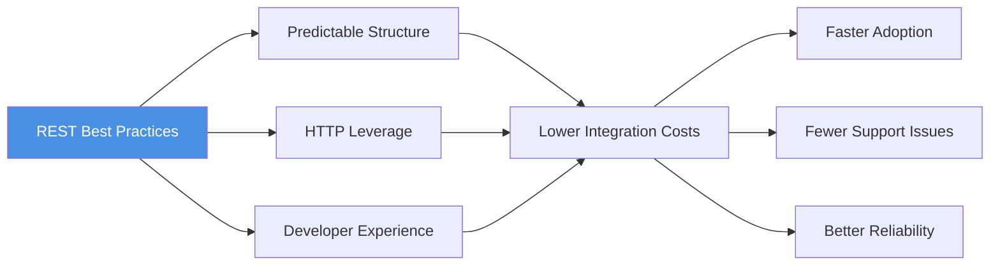

---

## Naming routes (spinal-case vs camelCase)

**TL;DR:** Use **lowercase spinal/kebab-case** in path segments; pick **one** style (camelCase or snake_case) for query
parameter names and stick to it.

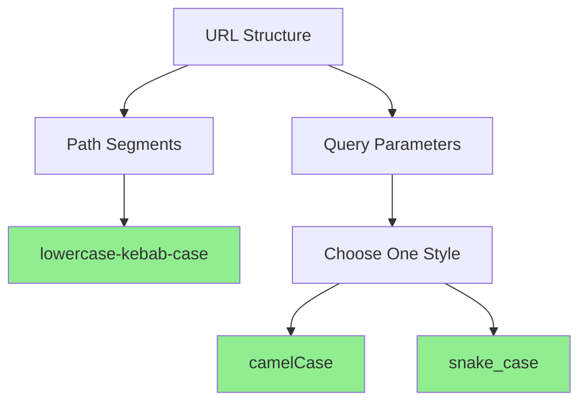

**Why:**

- Paths are frequently case-sensitive and show up in logs, docs, and terminals. Lowercase avoids subtle bugs.
- Hyphens improve readability in URLs and play nicely with copy/paste and terminals.
- Query params are not path; choose a house style per language ecosystem and be consistent.

**Guidelines**

- ✅ `/invoices/123/line-items` not `/Invoices/123/lineItems`
- ✅ Choose one for params and stick to it: `?createdAfter=...` **or** `?created_after=...`
- ❌ Don't mix: `?createdAfter=&created_before=`
- Keep resource names **nouns**, not verbs: `/users` not `/getUsers`
- Avoid file extensions in the path; use `Accept`/`Content-Type` for content negotiation, not `/users.json`

### Before and after example

```http
# ❌ BEFORE: inconsistent casing, verb in path
GET /Users/123/GetOrders?CreatedAfter=2025-01-01&created_before=2025-12-31
```

```http
# ✅ AFTER: consistent lowercase kebab-case in path, consistent camelCase in query
GET /users/123/orders?createdAfter=2025-01-01&createdBefore=2025-12-31
```

---

## Plural vs singular

**Rule of thumb:** Collections are **plural**, individual resources are singular by **ID**, not by name.

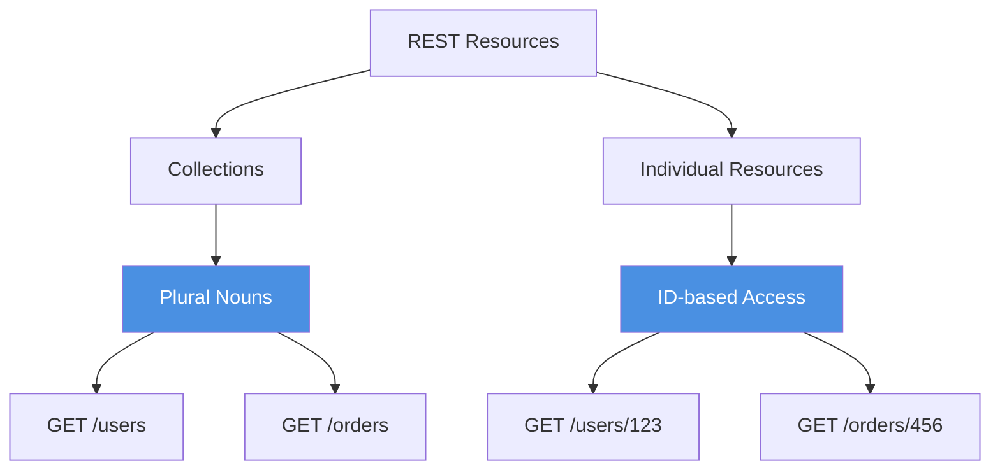

**Structure:**

- Collection: `GET /users`
- Single: `GET /users/{user_id}`
- Sub-collection: `GET /users/{user_id}/orders`
- Single sub-resource: `GET /users/{user_id}/profile`
- Avoid deep nesting beyond 2 levels; prefer filtering (e.g., `/orders?userId=...`) over
  `/orgs/{id}/teams/{id}/users/{id}`

### Deep nesting anti-pattern

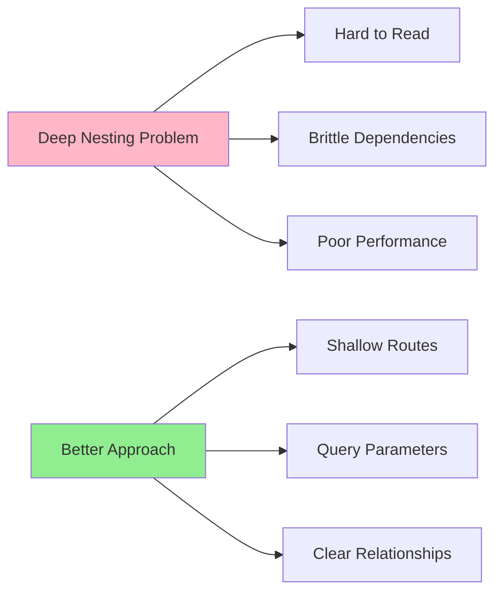

```http
# ❌ AVOID: deep nesting
GET /organizations/org-1/teams/team-2/users/user-3/settings

# ✅ PREFER: shallow with filtering
GET /user-settings/user-3
GET /users/user-3/settings?organizationId=org-1
```

---

## Status codes that pull their weight

Use HTTP semantics so clients don't need bespoke rules.

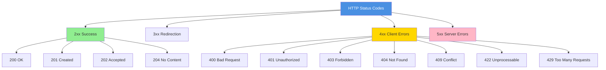

**Success**

- `200 OK` — generic success (include a body)
- `201 Created` — after `POST` creates a resource; include **`Location`** header pointing to the new resource, and
  optionally the representation in the body
- `202 Accepted` — async work accepted; return a status resource or job ID
- `204 No Content` — success with no body (e.g., idempotent `DELETE`, `PATCH` that doesn't return a body)

**Caching / conditional**

- `304 Not Modified` — with `ETag`/`If-None-Match`
- Use `ETag` and `If-Match` for optimistic concurrency on updates

**Client errors (4xx)**

- `400 Bad Request` — malformed input
- `401 Unauthorized` — missing/invalid auth
- `403 Forbidden` — authenticated but not allowed
- `404 Not Found` — unknown resource
- `405 Method Not Allowed` — wrong verb
- `409 Conflict` — version/conflict errors
- `410 Gone` — resource intentionally removed
- `412 Precondition Failed` — failed `If-Match`/`If-Unmodified-Since`
- `415 Unsupported Media Type` — wrong `Content-Type`
- `422 Unprocessable Content` — semantically invalid payload
- `429 Too Many Requests` — rate limiting; include `Retry-After` and (if you support them) rate-limit headers

**Server errors**

- `5xx` — only when it's on you. Include a stable request ID in responses/logs.

### Error bodies

Standardize error payloads using **Problem Details for HTTP APIs** (`application/problem+json`) with fields like `type`,
`title`, `status`, `detail`, `instance`.

```json
{
  "type": "https://api.example.com/problems/validation-error",
  "title": "Validation failed",
  "status": 422,
  "detail": "email is invalid",
  "instance": "/users",
  "errors": {
    "email": ["invalid format"]
  }
}
```

---

## Query strings for searching, filtering, sorting & shaping

Use **query parameters** for optional read-time behaviors. Keep patterns consistent across endpoints.

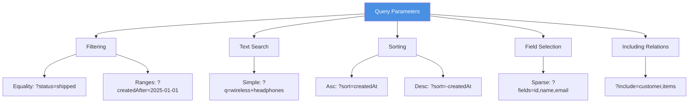

**Filtering**

- Equality: `GET /orders?status=shipped&customerId=123`
- Ranges/dates: `GET /orders?createdAfter=2025-01-01&createdBefore=2025-01-31`
- Multi-value: either repeat (`?status=paid&status=refunded`) or CSV (`?status=paid,refunded`) — pick one globally

**Text search**

- Simple: `GET /products?q=wireless+headphones`
- Fielded search (if supported): `GET /products?brand=sony&q=noise+cancel*`

**Sorting**

- `?sort=createdAt` ascending, `?sort=-createdAt` descending
- Allow multiple keys: `?sort=-createdAt,price`

**Sparse fieldsets**

- Let clients trim payloads for perf: `GET /users?fields=id,displayName,avatarUrl` (Or JSON:API style:
  `fields[users]=id,displayName`)

**Including related data**

- `?include=customer,items` (be explicit about what's supported)

Document every parameter and its type, defaults, and max limits in your OpenAPI.

---

## Limit, number of results & paging

Large collections must paginate. Offer one of these patterns consistently:

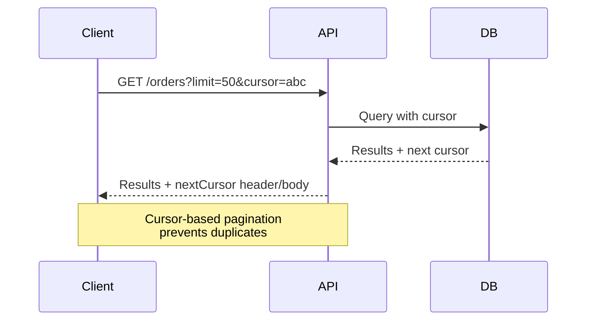

**Offset/limit (simple, but brittle at scale)**

- Request: `GET /orders?limit=50&offset=100`
- Response: include `limit`, `offset`, and total (if cheap to compute)

**Cursor-based (preferred at scale)**

- Request: `GET /orders?limit=50&cursor=eyJpZCI6IjEyMyJ9`
- Response: return `nextCursor` (and optionally `prevCursor`) in the body, and/or use **`Link`** headers with
  `rel="next"` / `rel="prev"` Example header: `Link: <https://api.example.com/orders?cursor=abc>; rel="next"`

**General paging guidelines**

- Default page size (e.g., 20–50); cap max (e.g., 100–1000)
- Stable ordering (e.g., `createdAt DESC, id DESC`) to avoid duplicates/misses
- For list endpoints, support conditional requests (`If-None-Match`) to save bandwidth
- Consider **Range** iteration or "delta" mechanisms for heavy feeds if needed

### Pagination comparison

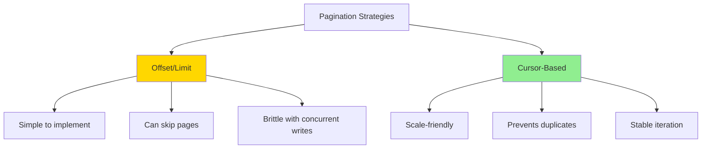

---

## PATCH, partial updates & idempotency

**PUT vs PATCH**

- `PUT` = full replacement (send the whole representation)
- `PATCH` = partial update (send just the change)

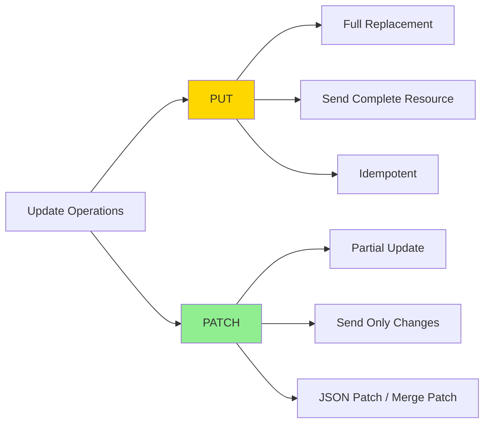

**Patch document types**

- **JSON Patch** (`application/json-patch+json`) — operations: `add`, `remove`, `replace`, `move`, `copy`, `test`
- **JSON Merge Patch** (`application/merge-patch+json`) — send a partial object to merge

### JSON Patch example

```http
PATCH /users/9f0b…
Content-Type: application/json-patch+json

[
  {"op": "replace", "path": "/displayName", "value": "T. B."},
  {"op": "add", "path": "/tags/-", "value": "premium"}
]
```

### JSON Merge Patch example

```http
PATCH /users/9f0b…
Content-Type: application/merge-patch+json

{
  "displayName": "T. B.",
  "email": "new@example.com"
}
```

**Idempotency**

- `GET`, `PUT`, `DELETE` should be idempotent by definition
- For **POST** that creates resources (and payments, retries, mobile flakes), accept an **`Idempotency-Key`** header and
  cache results on the server by key

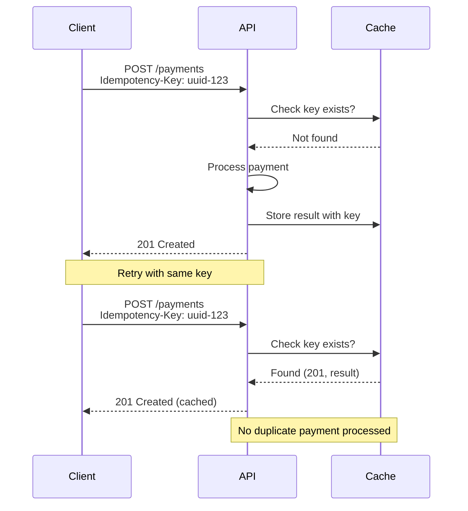

---

## Versioning, headers & docs

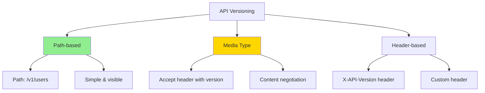

- Prefer **media-type versioning** (e.g., `Accept: application/vnd.yourapi+json; version=2`) or a stable top-level `/v1`
  path; pick one and document change policy
- Always return a **request ID** header for tracing
- Embrace **ETag**/**If-Match** for concurrency
- Provide an **OpenAPI 3.1** spec; keep examples and schema in CI

### Essential headers

| Header                | Purpose                        | Example                       |
| --------------------- | ------------------------------ | ----------------------------- |
| `Content-Type`        | Request body format            | `application/json`            |
| `Accept`              | Desired response format        | `application/json`            |
| `Authorization`       | Authentication credentials     | `Bearer eyJhbGc...`           |
| `Location`            | URI of newly created resource  | `/users/9f0b...`              |
| `ETag`                | Version identifier for caching | `"W/\"e7c-...\"`              |
| `If-Match`            | Conditional update             | `"W/\"e7c-...\"`              |
| `If-None-Match`       | Conditional get                | `"W/\"e7c-...\"`              |
| `X-Request-ID`        | Tracing identifier             | `req-123-abc`                 |
| `Retry-After`         | When to retry after rate limit | `120` (seconds) or date       |
| `Link`                | Pagination links               | `<url>; rel="next"`           |
| `RateLimit-Limit`     | Rate limit quota               | `1000`                        |
| `RateLimit-Remaining` | Remaining requests in window   | `999`                         |
| `RateLimit-Reset`     | When quota resets              | `1704067200` (Unix timestamp) |

---

## Rate limiting

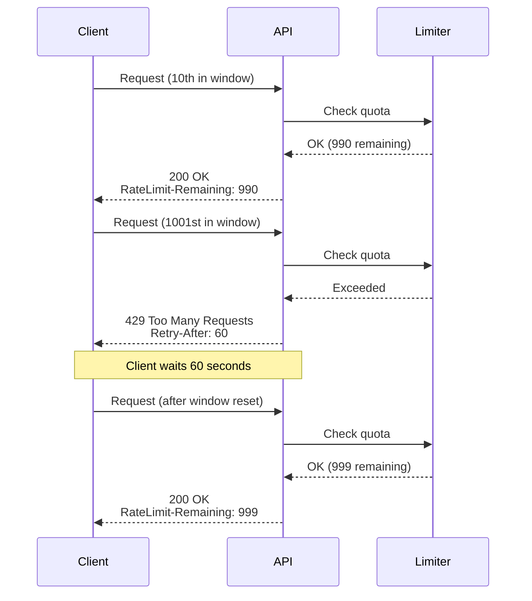

- Respond with `429 Too Many Requests` when throttled; include `Retry-After`
- Consider standard (or emerging-standard) **RateLimit** response fields/headers to advertise quotas and remaining
  capacity
- Document per-route and global quotas; be consistent across environments

**Rate limit response example:**

```http
HTTP/1.1 429 Too Many Requests
Content-Type: application/problem+json
Retry-After: 120
RateLimit-Limit: 1000
RateLimit-Remaining: 0
RateLimit-Reset: 1704067200
X-Request-ID: req-789

{
  "type": "https://api.example.com/problems/rate-limit",
  "title": "Rate limit exceeded",
  "status": 429,
  "detail": "You have exceeded the rate limit of 1000 requests per hour",
  "instance": "/users"
}
```

---

## Practical route cookbook

Here's a complete reference of common REST operations with proper HTTP semantics:

```http
# Create a new user
POST /users
Content-Type: application/json

{
  "email": "user@example.com",
  "displayName": "Jane Doe"
}

# Response
HTTP/1.1 201 Created
Location: /users/9f0b…
Content-Type: application/json

{
  "id": "9f0b…",
  "email": "user@example.com",
  "displayName": "Jane Doe",
  "createdAt": "2025-01-01T00:00:00Z"
}
```

```http
# Read list with filters, sort, sparse fields, pagination
GET /orders?status=shipped&sort=-createdAt&fields=id,number,total,createdAt&limit=50&cursor=abc

# Response
HTTP/1.1 200 OK
Link: <https://api.example.com/orders?cursor=next>; rel="next"
Content-Type: application/json

{
  "data": [...],
  "pagination": {
    "nextCursor": "next",
    "limit": 50
  }
}
```

```http
# Conditional read with caching
GET /users/9f0b…
If-None-Match: "W/\"e7c-…\""

# Response (if not modified)
HTTP/1.1 304 Not Modified
ETag: "W/\"e7c-…\""
```

```http
# Partial update via JSON Patch
PATCH /users/9f0b…
Content-Type: application/json-patch+json
If-Match: "W/\"e7c-…\""

[
  {"op": "replace", "path": "/displayName", "value": "T. B."}
]

# Response
HTTP/1.1 204 No Content
ETag: "W/\"new-etag\""
```

```http
# Delete (idempotent)
DELETE /users/9f0b…

# Response
HTTP/1.1 204 No Content
```

```http
# Standardized error (Problem Details)
HTTP/1.1 422 Unprocessable Content
Content-Type: application/problem+json
X-Request-ID: req-456

{
  "type": "https://api.example.com/problems/validation-error",
  "title": "Validation failed",
  "status": 422,
  "detail": "email is invalid",
  "instance": "/users",
  "errors": {
    "email": ["invalid format"]
  }
}
```

---

## Team checklist

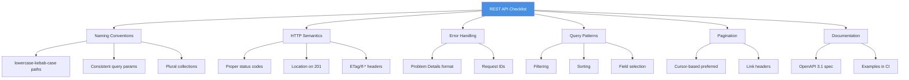

1. Paths lowercase, spinal-case; params one style only
2. Collections plural; sub-resources consistent; avoid deep nesting
3. Map operations to HTTP semantics; return proper status codes
4. Use `Location` on `201`; `ETag`/`If-*` where applicable
5. Error payloads follow **Problem Details**
6. Define filtering, sorting, field selection, includes — once — and reuse everywhere
7. Pick pagination style; provide `Link` headers and/or cursors
8. Enforce limits and rate-limit contract; include `Retry-After`
9. Support `PATCH` (JSON Patch or Merge Patch) where partial updates help
10. Publish and test OpenAPI 3.1; keep examples truthful and runnable

---

## Further reading

### RFCs & Standards

- **RFC 9110** — HTTP Semantics (methods, status codes, headers)
- **RFC 9457** — Problem Details for HTTP APIs (`application/problem+json`)
- **RFC 8288** — Web Linking (Link header for pagination)
- **RFC 6902** — JSON Patch
- **RFC 7386** — JSON Merge Patch
- **RFC 5789** — PATCH Method for HTTP
- **RFC 3986** — URI Generic Syntax

### Online Resources

- [OpenAPI Specification 3.1](https://spec.openapis.org/oas/v3.1.0) — Standard API documentation format
- [Google API Design Guide](https://cloud.google.com/apis/design) — Resource-oriented design patterns
- [Microsoft REST API Guidelines](https://github.com/microsoft/api-guidelines) — Enterprise API patterns
- [GitHub REST API](https://docs.github.com/en/rest) — Practical pagination and filtering examples
- [Stripe API Documentation](https://stripe.com/docs/api) — Idempotency and error handling patterns
- [MDN HTTP Documentation](https://developer.mozilla.org/en-US/docs/Web/HTTP) — Comprehensive HTTP reference

### Books

- **REST in Practice** by Jim Webber, Savas Parastatidis, Ian Robinson — Deep dive into hypermedia and HTTP
- **RESTful Web APIs** by Leonard Richardson, Mike Amundsen — Practical API design patterns

---

## Key takeaways

1. **Consistency is king** — Pick conventions for naming, pluralization, query params, and status codes; apply them
   everywhere.

2. **Leverage HTTP** — Use status codes, headers (`Location`, `ETag`, `Link`), and methods (`PATCH`) as designed; don't
   reinvent semantics.

3. **Standardize errors** — Adopt Problem Details (`application/problem+json`) for uniform, actionable error responses.

4. **Design for scale** — Use cursor-based pagination, field selection, and rate limiting with clear headers from day
   one.

5. **Document with OpenAPI** — Keep your spec in sync with code; use it for testing, client generation, and developer
   experience.

6. **Idempotency matters** — Accept `Idempotency-Key` for non-idempotent operations; it's critical for reliability in
   distributed systems.

7. **Version thoughtfully** — Choose path-based (`/v1`) or media-type versioning and document your deprecation policy.

Remember: The best REST API is the one that behaves exactly as developers expect. Boring is beautiful.
