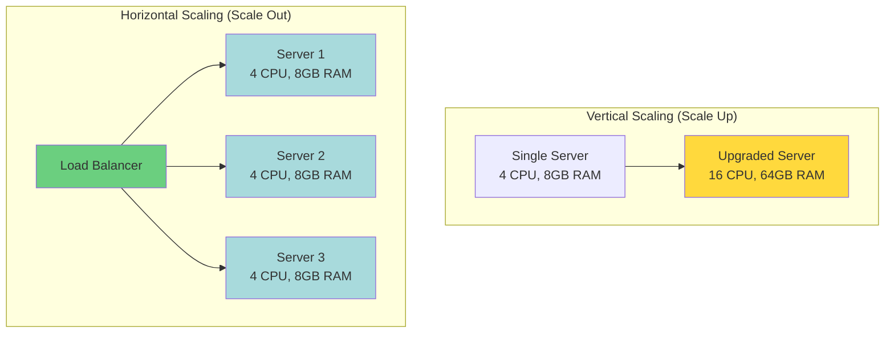
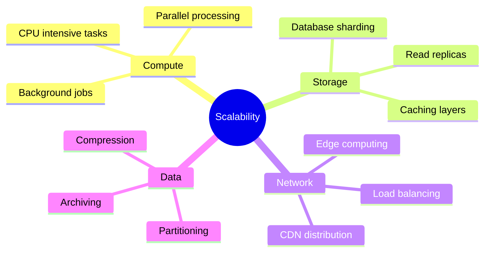
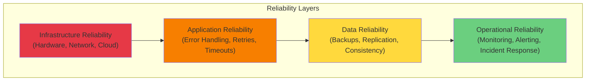
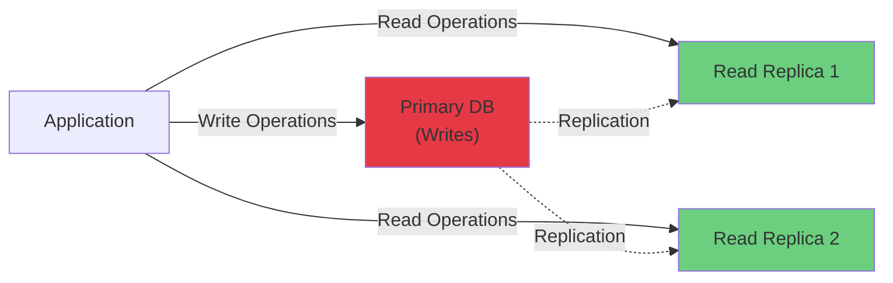
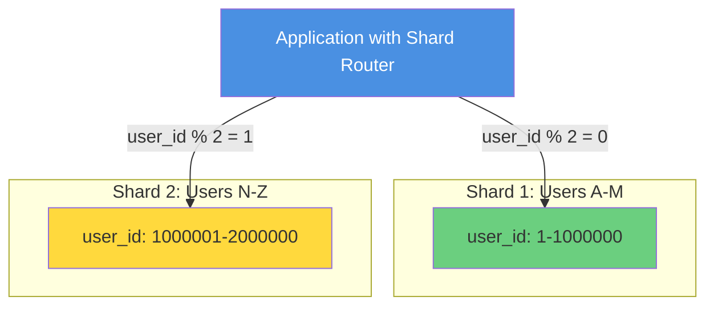
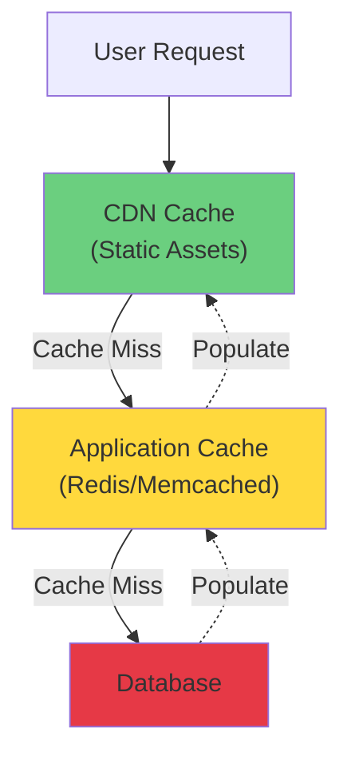
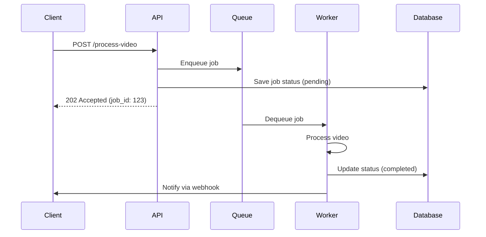
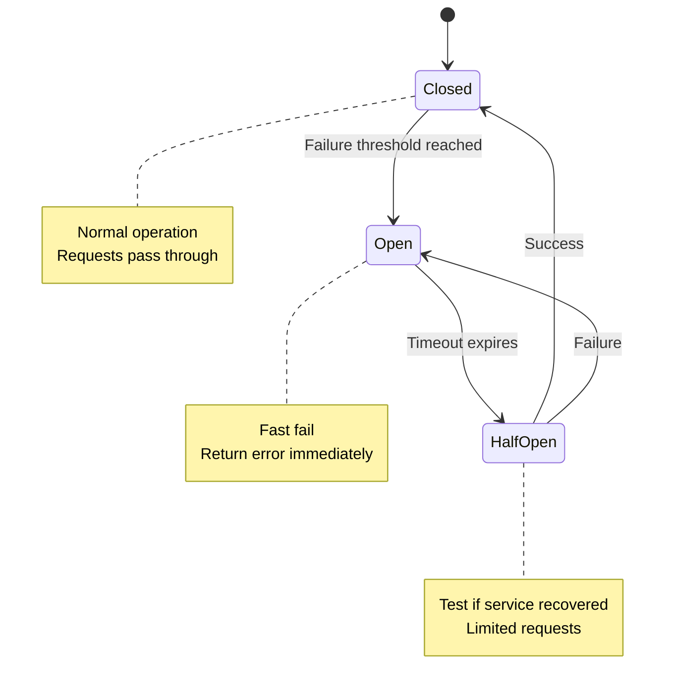
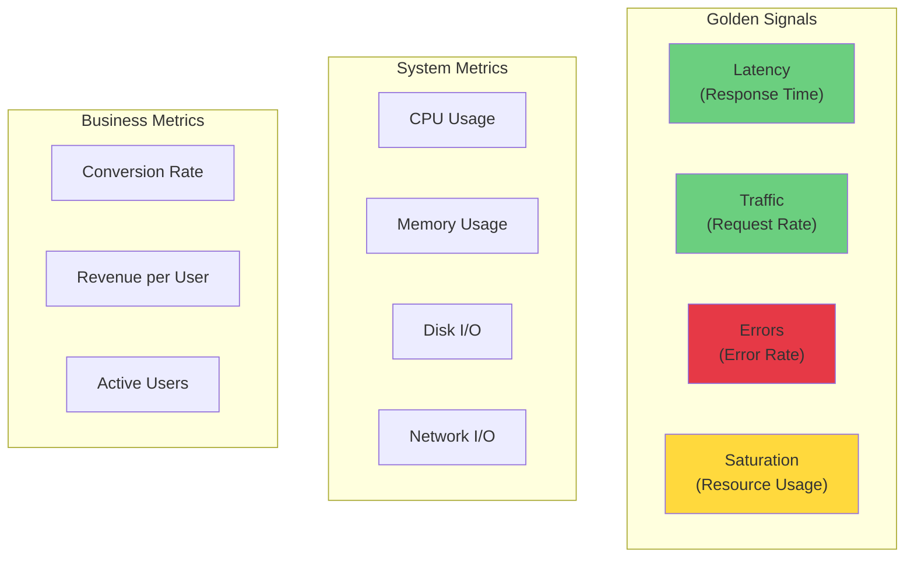
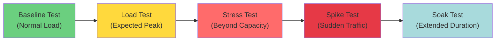

import ScalabilityImage from '/img/undraw_server_cluster.svg';

<div className="text--center margin-bottom--lg">
  <ScalabilityImage width="80%" height="300px" />
</div>

## Introduction

Scalability and reliability are two fundamental pillars of modern software systems. As your application grows, it must
handle increasing loads while maintaining consistent performance and availability. A system that scales effectively can
accommodate growth in users, data, and transactions without degradation. A reliable system remains operational and
performs correctly, even in the face of failures.

This chapter explores the principles, patterns, and practices for building systems that scale gracefully and operate
reliably in production environments. Whether you're building a startup MVP or an enterprise platform, understanding
these concepts will help you make informed architectural decisions.

## Understanding Scalability

Scalability is the capability of a system to handle a growing amount of work or its potential to accommodate growth.
There are two primary types of scalability:

### Vertical vs Horizontal Scaling



**Vertical Scaling (Scale Up)**:

- Add more resources (CPU, RAM, disk) to a single machine
- **Pros**: Simpler architecture, no distributed system complexity
- **Cons**: Physical limits, single point of failure, downtime during upgrades
- **Best for**: Databases, monolithic applications, legacy systems

**Horizontal Scaling (Scale Out)**:

- Add more machines to distribute the load
- **Pros**: Nearly unlimited scaling, fault tolerance, no single point of failure
- **Cons**: Requires stateless design, distributed system complexity
- **Best for**: Web servers, microservices, stateless applications

### Scalability Dimensions

A comprehensive scalability strategy addresses multiple dimensions:



## Reliability Fundamentals

Reliability is the probability that a system will perform its intended function correctly under specified conditions for
a specified period. It's measured through several key metrics:

### Key Reliability Metrics

**Mean Time Between Failures (MTBF)**:

- Average time a system operates between failures
- Formula: `MTBF = Total Operating Time / Number of Failures`
- Higher MTBF indicates better reliability

**Mean Time To Recovery (MTTR)**:

- Average time to restore service after a failure
- Formula: `MTTR = Total Downtime / Number of Incidents`
- Lower MTTR means faster recovery

**Service Level Objectives (SLOs)**:

- Specific, measurable targets for system behavior
- Examples: 99.9% uptime, response time < 200ms for 95% of requests

**Availability Calculation**:

```
Availability = (Total Time - Downtime) / Total Time × 100%
```

| Availability      | Downtime per Year | Downtime per Month | Downtime per Week |
| ----------------- | ----------------- | ------------------ | ----------------- |
| 90% (1 nine)      | 36.5 days         | 3 days             | 16.8 hours        |
| 99% (2 nines)     | 3.65 days         | 7.2 hours          | 1.68 hours        |
| 99.9% (3 nines)   | 8.76 hours        | 43.2 minutes       | 10.1 minutes      |
| 99.99% (4 nines)  | 52.56 minutes     | 4.32 minutes       | 1.01 minutes      |
| 99.999% (5 nines) | 5.26 minutes      | 25.9 seconds       | 6.05 seconds      |

### The Reliability Stack



## Design Patterns for Scalability

### 1. Stateless Architecture

Design services to not store session data locally. This enables horizontal scaling and fault tolerance.

**Bad: Stateful Session Management**

```javascript
// Bad: Session data stored in memory
const sessions = new Map();

app.post('/login', (req, res) => {
  const { username, password } = req.body;

  if (authenticate(username, password)) {
    const sessionId = generateSessionId();
    sessions.set(sessionId, { username, loginTime: Date.now() });
    res.cookie('sessionId', sessionId);
    res.json({ success: true });
  }
});

// Problem: Session data lost if server restarts or when load balanced to another server
```

**Good: Stateless with External Session Store**

```javascript
// Good: Session data in Redis (shared state)
const redis = require('redis');
const client = redis.createClient();

app.post('/login', async (req, res) => {
  const { username, password } = req.body;

  if (await authenticate(username, password)) {
    const sessionId = generateSessionId();

    // Store session in Redis with TTL
    await client.setex(
      `session:${sessionId}`,
      3600, // 1 hour TTL
      JSON.stringify({ username, loginTime: Date.now() })
    );

    res.cookie('sessionId', sessionId, {
      httpOnly: true,
      secure: true,
      maxAge: 3600000,
    });
    res.json({ success: true });
  }
});

// Benefits: Works across multiple servers, survives restarts, centralized session management
```

### 2. Database Scaling Strategies

#### Read Replicas

Distribute read operations across multiple database copies:



**Implementation Example:**

```javascript
// Database connection manager with read/write splitting
class DatabaseManager {
  constructor() {
    this.primaryDB = createConnection(process.env.PRIMARY_DB_URL);
    this.readReplicas = [createConnection(process.env.REPLICA_1_URL), createConnection(process.env.REPLICA_2_URL)];
    this.currentReplicaIndex = 0;
  }

  // Use primary for writes
  async write(query, params) {
    return this.primaryDB.query(query, params);
  }

  // Round-robin reads across replicas
  async read(query, params) {
    const replica = this.readReplicas[this.currentReplicaIndex];
    this.currentReplicaIndex = (this.currentReplicaIndex + 1) % this.readReplicas.length;
    return replica.query(query, params);
  }
}

// Usage
const db = new DatabaseManager();

// Writes go to primary
await db.write('INSERT INTO users (name, email) VALUES (?, ?)', ['Alice', 'alice@example.com']);

// Reads distributed across replicas
const users = await db.read('SELECT * FROM users WHERE active = ?', [true]);
```

#### Database Sharding

Partition data across multiple databases based on a shard key:



**Example Implementation:**

```javascript
// Shard manager using consistent hashing
class ShardManager {
  constructor(shards) {
    this.shards = shards; // Array of database connections
  }

  // Determine shard based on user ID
  getShardForUser(userId) {
    const shardIndex = userId % this.shards.length;
    return this.shards[shardIndex];
  }

  async getUserById(userId) {
    const shard = this.getShardForUser(userId);
    return shard.query('SELECT * FROM users WHERE id = ?', [userId]);
  }

  async createUser(userData) {
    // Generate ID first (e.g., from a distributed ID generator)
    const userId = await this.generateDistributedId();
    const shard = this.getShardForUser(userId);

    return shard.query('INSERT INTO users (id, name, email) VALUES (?, ?, ?)', [userId, userData.name, userData.email]);
  }

  async generateDistributedId() {
    // Use Snowflake, UUID, or database sequence
    return Date.now() * 1000 + Math.floor(Math.random() * 1000);
  }
}
```

### 3. Caching Strategies

Implement multi-layer caching to reduce load on backend services:



**Cache-Aside Pattern:**

```javascript
// Cache-aside pattern with Redis
class UserService {
  constructor(cache, database) {
    this.cache = cache;
    this.db = database;
    this.CACHE_TTL = 3600; // 1 hour
  }

  async getUser(userId) {
    const cacheKey = `user:${userId}`;

    // 1. Try cache first
    const cached = await this.cache.get(cacheKey);
    if (cached) {
      console.log('Cache hit');
      return JSON.parse(cached);
    }

    // 2. Cache miss - query database
    console.log('Cache miss');
    const user = await this.db.query('SELECT * FROM users WHERE id = ?', [userId]);

    if (user) {
      // 3. Populate cache for next request
      await this.cache.setex(cacheKey, this.CACHE_TTL, JSON.stringify(user));
    }

    return user;
  }

  async updateUser(userId, updates) {
    // 1. Update database
    await this.db.query('UPDATE users SET ? WHERE id = ?', [updates, userId]);

    // 2. Invalidate cache (write-through alternative: update cache)
    await this.cache.del(`user:${userId}`);

    // 3. Next read will populate fresh data
  }
}
```

### 4. Asynchronous Processing

Offload heavy tasks to background workers using message queues:



**Implementation with Bull Queue:**

```javascript
// Producer: API endpoint
const Queue = require('bull');
const videoQueue = new Queue('video-processing', process.env.REDIS_URL);

app.post('/api/videos/process', async (req, res) => {
  const { videoUrl, userId } = req.body;

  // Create job in database
  const job = await db.jobs.create({
    type: 'video-processing',
    status: 'pending',
    userId,
    videoUrl,
  });

  // Add to queue
  await videoQueue.add(
    {
      jobId: job.id,
      videoUrl,
      userId,
    },
    {
      attempts: 3,
      backoff: {
        type: 'exponential',
        delay: 2000,
      },
    }
  );

  // Return immediately
  res.status(202).json({
    jobId: job.id,
    status: 'pending',
    statusUrl: `/api/jobs/${job.id}`,
  });
});

// Consumer: Background worker
videoQueue.process(async (job) => {
  const { jobId, videoUrl, userId } = job.data;

  try {
    // Update status
    await db.jobs.update(jobId, { status: 'processing' });

    // Heavy processing
    await processVideo(videoUrl);

    // Mark complete
    await db.jobs.update(jobId, {
      status: 'completed',
      completedAt: new Date(),
    });

    // Notify user
    await notifyUser(userId, { jobId, status: 'completed' });
  } catch (error) {
    await db.jobs.update(jobId, {
      status: 'failed',
      error: error.message,
    });
    throw error; // Trigger retry
  }
});
```

## Reliability Patterns

### 1. Circuit Breaker

Prevent cascading failures by failing fast when a service is unhealthy:



**Implementation:**

```javascript
class CircuitBreaker {
  constructor(service, options = {}) {
    this.service = service;
    this.failureThreshold = options.failureThreshold || 5;
    this.timeout = options.timeout || 60000; // 1 minute
    this.resetTimeout = options.resetTimeout || 30000; // 30 seconds

    this.state = 'CLOSED';
    this.failureCount = 0;
    this.nextAttempt = Date.now();
  }

  async call(...args) {
    if (this.state === 'OPEN') {
      if (Date.now() < this.nextAttempt) {
        throw new Error('Circuit breaker is OPEN');
      }
      // Try to recover
      this.state = 'HALF_OPEN';
    }

    try {
      const result = await Promise.race([
        this.service(...args),
        new Promise((_, reject) => setTimeout(() => reject(new Error('Timeout')), this.timeout)),
      ]);

      // Success
      this.onSuccess();
      return result;
    } catch (error) {
      this.onFailure();
      throw error;
    }
  }

  onSuccess() {
    this.failureCount = 0;
    this.state = 'CLOSED';
  }

  onFailure() {
    this.failureCount++;
    if (this.failureCount >= this.failureThreshold) {
      this.state = 'OPEN';
      this.nextAttempt = Date.now() + this.resetTimeout;
      console.error(`Circuit breaker opened. Next attempt at ${new Date(this.nextAttempt)}`);
    }
  }

  getState() {
    return {
      state: this.state,
      failureCount: this.failureCount,
      nextAttempt: new Date(this.nextAttempt),
    };
  }
}

// Usage
const paymentServiceBreaker = new CircuitBreaker(callPaymentService, {
  failureThreshold: 5,
  timeout: 3000,
  resetTimeout: 60000,
});

app.post('/api/payments', async (req, res) => {
  try {
    const result = await paymentServiceBreaker.call(req.body);
    res.json(result);
  } catch (error) {
    if (error.message === 'Circuit breaker is OPEN') {
      res.status(503).json({
        error: 'Payment service temporarily unavailable',
        retryAfter: 60,
      });
    } else {
      res.status(500).json({ error: error.message });
    }
  }
});
```

### 2. Graceful Degradation

Design systems to maintain core functionality when non-critical services fail:

```javascript
// Service with fallback behavior
class RecommendationService {
  constructor() {
    this.mlService = new MachineLearningService();
    this.cache = new CacheService();
  }

  async getRecommendations(userId) {
    try {
      // Primary: ML-based personalized recommendations
      const recommendations = await this.mlService.getPersonalized(userId);
      return { recommendations, source: 'personalized' };
    } catch (mlError) {
      console.warn('ML service failed, falling back to cached popular items', mlError);

      try {
        // Fallback 1: Cached popular items
        const popular = await this.cache.get('popular-items');
        if (popular) {
          return { recommendations: popular, source: 'popular' };
        }

        // Fallback 2: Static default recommendations
        return {
          recommendations: this.getDefaultRecommendations(),
          source: 'default',
        };
      } catch (cacheError) {
        console.error('All recommendation services failed', cacheError);

        // Last resort: Empty but functional response
        return {
          recommendations: [],
          source: 'fallback',
          message: 'Recommendations temporarily unavailable',
        };
      }
    }
  }

  getDefaultRecommendations() {
    // Static list of safe default items
    return [
      { id: 1, name: 'Popular Item 1' },
      { id: 2, name: 'Popular Item 2' },
      { id: 3, name: 'Popular Item 3' },
    ];
  }
}
```

### 3. Health Checks and Monitoring

Implement comprehensive health checks for proactive failure detection:

```javascript
// Comprehensive health check endpoint
class HealthCheckService {
  constructor(dependencies) {
    this.database = dependencies.database;
    this.redis = dependencies.redis;
    this.externalAPI = dependencies.externalAPI;
  }

  async check() {
    const startTime = Date.now();
    const checks = {
      database: await this.checkDatabase(),
      cache: await this.checkCache(),
      externalServices: await this.checkExternalServices(),
    };

    const isHealthy = Object.values(checks).every((check) => check.status === 'healthy');
    const responseTime = Date.now() - startTime;

    return {
      status: isHealthy ? 'healthy' : 'degraded',
      timestamp: new Date().toISOString(),
      responseTime: `${responseTime}ms`,
      checks,
      version: process.env.APP_VERSION,
      uptime: process.uptime(),
    };
  }

  async checkDatabase() {
    try {
      await this.database.query('SELECT 1');
      return { status: 'healthy', responseTime: Date.now() };
    } catch (error) {
      return { status: 'unhealthy', error: error.message };
    }
  }

  async checkCache() {
    try {
      await this.redis.ping();
      return { status: 'healthy' };
    } catch (error) {
      return { status: 'unhealthy', error: error.message };
    }
  }

  async checkExternalServices() {
    try {
      await this.externalAPI.ping();
      return { status: 'healthy' };
    } catch (error) {
      // External service failure might not be critical
      return { status: 'degraded', error: error.message };
    }
  }
}

// Health check endpoints
app.get('/health', async (req, res) => {
  const health = await healthCheckService.check();
  const statusCode = health.status === 'healthy' ? 200 : 503;
  res.status(statusCode).json(health);
});

// Liveness probe (Kubernetes)
app.get('/health/live', (req, res) => {
  res.status(200).json({ status: 'alive' });
});

// Readiness probe (Kubernetes)
app.get('/health/ready', async (req, res) => {
  const isReady = await healthCheckService.checkDatabase();
  const statusCode = isReady.status === 'healthy' ? 200 : 503;
  res.status(statusCode).json(isReady);
});
```

### 4. Retry with Exponential Backoff

Handle transient failures with intelligent retry logic:

```javascript
// Retry utility with exponential backoff and jitter
async function retryWithBackoff(fn, options = {}) {
  const { maxRetries = 3, initialDelay = 1000, maxDelay = 30000, factor = 2, jitter = true } = options;

  let lastError;

  for (let attempt = 0; attempt <= maxRetries; attempt++) {
    try {
      return await fn();
    } catch (error) {
      lastError = error;

      // Don't retry if it's a client error (4xx)
      if (error.statusCode && error.statusCode >= 400 && error.statusCode < 500) {
        throw error;
      }

      if (attempt < maxRetries) {
        // Calculate delay with exponential backoff
        let delay = Math.min(initialDelay * Math.pow(factor, attempt), maxDelay);

        // Add jitter to prevent thundering herd
        if (jitter) {
          delay = delay * (0.5 + Math.random() * 0.5);
        }

        console.log(`Attempt ${attempt + 1} failed. Retrying in ${Math.round(delay)}ms...`);
        await new Promise((resolve) => setTimeout(resolve, delay));
      }
    }
  }

  throw lastError;
}

// Usage example
async function fetchUserData(userId) {
  return retryWithBackoff(
    async () => {
      const response = await fetch(`https://api.example.com/users/${userId}`);
      if (!response.ok) {
        const error = new Error('API request failed');
        error.statusCode = response.status;
        throw error;
      }
      return response.json();
    },
    {
      maxRetries: 3,
      initialDelay: 1000,
      factor: 2,
      jitter: true,
    }
  );
}
```

## Observability and Monitoring

Effective monitoring is essential for maintaining scalability and reliability:

### Key Metrics to Monitor



**Implementation Example with Prometheus:**

```javascript
const prometheus = require('prom-client');

// Create metrics
const httpRequestDuration = new prometheus.Histogram({
  name: 'http_request_duration_seconds',
  help: 'Duration of HTTP requests in seconds',
  labelNames: ['method', 'route', 'status_code'],
  buckets: [0.1, 0.3, 0.5, 0.7, 1, 3, 5, 7, 10],
});

const httpRequestTotal = new prometheus.Counter({
  name: 'http_requests_total',
  help: 'Total number of HTTP requests',
  labelNames: ['method', 'route', 'status_code'],
});

const activeConnections = new prometheus.Gauge({
  name: 'active_connections',
  help: 'Number of active connections',
});

// Middleware to track metrics
function metricsMiddleware(req, res, next) {
  const start = Date.now();

  activeConnections.inc();

  res.on('finish', () => {
    const duration = (Date.now() - start) / 1000;

    httpRequestDuration.labels(req.method, req.route?.path || req.path, res.statusCode).observe(duration);

    httpRequestTotal.labels(req.method, req.route?.path || req.path, res.statusCode).inc();

    activeConnections.dec();
  });

  next();
}

app.use(metricsMiddleware);

// Metrics endpoint for Prometheus
app.get('/metrics', async (req, res) => {
  res.set('Content-Type', prometheus.register.contentType);
  res.end(await prometheus.register.metrics());
});
```

## Load Testing and Capacity Planning

Before scaling, understand your system's limits through load testing:

### Load Testing Strategy



**Example with k6:**

```javascript
// load-test.js
import http from 'k6/http';
import { check, sleep } from 'k6';
import { Rate } from 'k6/metrics';

const errorRate = new Rate('errors');

export const options = {
  stages: [
    { duration: '2m', target: 100 }, // Ramp up to 100 users
    { duration: '5m', target: 100 }, // Stay at 100 users
    { duration: '2m', target: 200 }, // Ramp up to 200 users
    { duration: '5m', target: 200 }, // Stay at 200 users
    { duration: '2m', target: 0 }, // Ramp down to 0 users
  ],
  thresholds: {
    http_req_duration: ['p(95)<500'], // 95% of requests under 500ms
    errors: ['rate<0.1'], // Error rate under 10%
  },
};

export default function () {
  const response = http.get('https://api.example.com/users');

  const success = check(response, {
    'status is 200': (r) => r.status === 200,
    'response time < 500ms': (r) => r.timings.duration < 500,
  });

  errorRate.add(!success);
  sleep(1);
}
```

## Best Practices

### Design Principles

1. **Design for Failure**: Assume everything will fail eventually

   - Implement circuit breakers and fallbacks
   - Use timeouts on all external calls
   - Handle partial failures gracefully

2. **Idempotency**: Operations should be safely retryable

   - Use idempotency keys for critical operations
   - Design APIs to handle duplicate requests
   - Implement deduplication logic

3. **Stateless Services**: Enable horizontal scaling

   - Store session state externally (Redis, database)
   - Use JWT tokens for authentication
   - Design for any-server routing

4. **Database Optimization**:

   - Index frequently queried columns
   - Use connection pooling
   - Implement query caching
   - Regularly analyze slow queries

5. **Async Communication**: Decouple services
   - Use message queues for non-urgent operations
   - Implement event-driven architecture
   - Handle backpressure appropriately

### Infrastructure Best Practices

1. **Auto-scaling**: Configure automatic scaling rules

   ```yaml
   # Example Kubernetes HPA
   apiVersion: autoscaling/v2
   kind: HorizontalPodAutoscaler
   metadata:
     name: api-server
   spec:
     scaleTargetRef:
       apiVersion: apps/v1
       kind: Deployment
       name: api-server
     minReplicas: 3
     maxReplicas: 10
     metrics:
       - type: Resource
         resource:
           name: cpu
           target:
             type: Utilization
             averageUtilization: 70
   ```

2. **Load Balancing**: Distribute traffic effectively

   - Use health checks to route away from unhealthy instances
   - Implement connection draining for graceful shutdowns
   - Configure appropriate timeout values

3. **Data Backup**: Protect against data loss

   - Automated daily backups
   - Test restore procedures regularly
   - Store backups in multiple regions
   - Implement point-in-time recovery

4. **Disaster Recovery**: Plan for worst-case scenarios
   - Document recovery procedures
   - Maintain runbooks for common incidents
   - Practice recovery drills regularly
   - Define RPO (Recovery Point Objective) and RTO (Recovery Time Objective)

## Common Pitfalls to Avoid

1. **N+1 Query Problem**: Loading related data in loops

   ```javascript
   // Bad: N+1 queries
   const users = await User.findAll();
   for (const user of users) {
     user.posts = await Post.findAll({ where: { userId: user.id } });
   }

   // Good: Join or batch load
   const users = await User.findAll({ include: [Post] });
   ```

2. **Unbounded Queues**: Can lead to memory exhaustion

   ```javascript
   // Bad: No limits
   const queue = [];

   // Good: Bounded queue with rejection
   class BoundedQueue {
     constructor(maxSize = 1000) {
       this.queue = [];
       this.maxSize = maxSize;
     }

     enqueue(item) {
       if (this.queue.length >= this.maxSize) {
         throw new Error('Queue is full');
       }
       this.queue.push(item);
     }
   }
   ```

3. **Missing Timeouts**: Requests hang indefinitely

   ```javascript
   // Bad: No timeout
   const response = await fetch(url);

   // Good: With timeout
   const controller = new AbortController();
   const timeout = setTimeout(() => controller.abort(), 5000);

   try {
     const response = await fetch(url, { signal: controller.signal });
     return response;
   } finally {
     clearTimeout(timeout);
   }
   ```

4. **Lack of Rate Limiting**: Service overwhelmed by traffic

   ```javascript
   // Implement rate limiting
   const rateLimit = require('express-rate-limit');

   const limiter = rateLimit({
     windowMs: 15 * 60 * 1000, // 15 minutes
     max: 100, // Limit each IP to 100 requests per window
     message: 'Too many requests, please try again later.',
   });

   app.use('/api/', limiter);
   ```

## Conclusion

Building scalable and reliable systems requires careful planning, continuous monitoring, and iterative improvement.
Start with these key takeaways:

1. **Plan for Growth**: Design systems with scalability in mind from the start
2. **Embrace Failure**: Build resilience through redundancy and graceful degradation
3. **Monitor Everything**: Implement comprehensive observability to detect issues early
4. **Test Regularly**: Conduct load tests and chaos engineering experiments
5. **Iterate and Improve**: Use metrics to identify bottlenecks and optimize continuously

Remember that scalability and reliability are not one-time achievements but ongoing commitments. As your system evolves,
regularly reassess your architecture, update your monitoring, and refine your practices to meet new challenges.

For related topics, see:

- [CI/CD](/ci-cd) - Automate deployments for reliable releases
- [Testing](/testing) - Ensure reliability through comprehensive testing
- [Logging](/logging) - Build observability into your systems
- [Feature Flags](/feature-flags) - Deploy safely with gradual rollouts

## Further Reading

- **Books**:

  - "Designing Data-Intensive Applications" by Martin Kleppmann
  - "Site Reliability Engineering" by Google
  - "Release It!" by Michael Nygard

- **Resources**:
  - [AWS Well-Architected Framework](https://aws.amazon.com/architecture/well-architected/)
  - [The Twelve-Factor App](https://12factor.net/)
  - [Google SRE Books](https://sre.google/books/)
