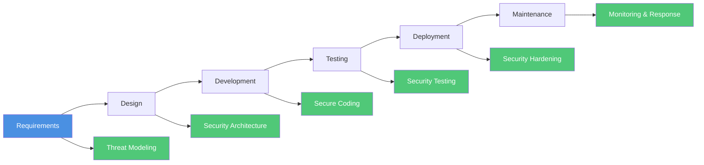
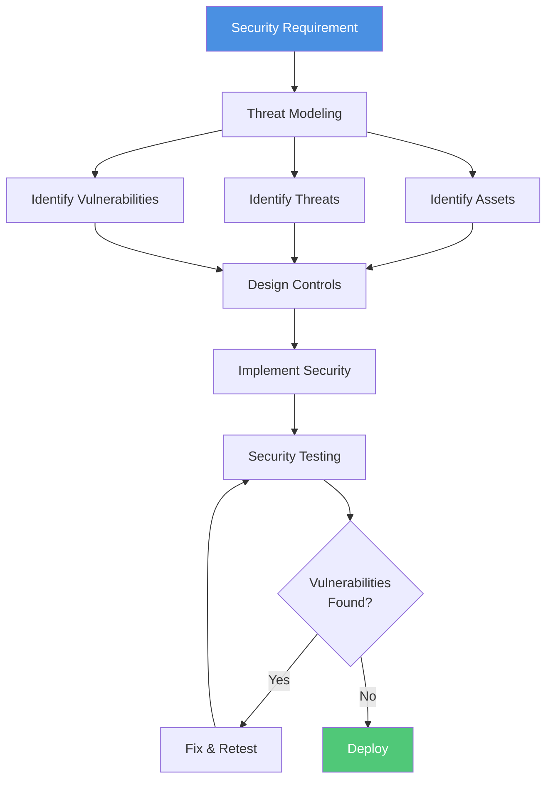

Security is not a feature—it's a fundamental requirement. Building secure software protects user data, maintains trust,
and prevents costly breaches. This chapter explores essential security practices, common vulnerabilities, and defensive
strategies for building robust, secure applications throughout the software development lifecycle.

## The Security Mindset

Security must be integrated into every stage of development, not treated as an afterthought. This "shift-left" approach
identifies and addresses vulnerabilities early, reducing risk and remediation costs.



:::tip Security is Everyone's Responsibility Security isn't just the security team's job. Every developer, designer, and
stakeholder must consider security implications in their work. :::

## Common Vulnerabilities (OWASP Top 10)

The Open Web Application Security Project (OWASP) maintains a list of the most critical web application security risks.
Understanding these vulnerabilities is the first step in preventing them.

### 1. Broken Access Control

Users can access resources or perform actions beyond their intended permissions.

```javascript
// Bad: No authorization check
app.get('/api/users/:id/profile', async (req, res) => {
  const user = await User.findById(req.params.id);
  res.json(user);
});

// Good: Verify user can access resource
app.get('/api/users/:id/profile', authenticateUser, async (req, res) => {
  const requestedUserId = req.params.id;
  const currentUserId = req.user.id;

  // Users can only access their own profile unless they're admin
  if (requestedUserId !== currentUserId && !req.user.isAdmin) {
    return res.status(403).json({ error: 'Forbidden' });
  }

  const user = await User.findById(requestedUserId);
  res.json(user);
});

// Better: Use authorization middleware
const authorize = (resource, action) => {
  return async (req, res, next) => {
    const hasPermission = await checkPermission(req.user, resource, action);

    if (!hasPermission) {
      return res.status(403).json({ error: 'Forbidden' });
    }

    next();
  };
};

app.get('/api/users/:id/profile', authenticateUser, authorize('user:profile', 'read'), async (req, res) => {
  const user = await User.findById(req.params.id);
  res.json(user);
});
```

**Prevention strategies**:

- Implement role-based access control (RBAC) or attribute-based access control (ABAC)
- Deny access by default, explicitly grant permissions
- Enforce authorization checks on every request
- Log access control failures for monitoring

### 2. Cryptographic Failures

Inadequate protection of sensitive data through weak or missing encryption.

```javascript
// Bad: Storing passwords in plain text
const user = {
  email: 'user@example.com',
  password: 'Password123', // Never store plain text passwords!
};

// Bad: Weak hashing
const crypto = require('crypto');
const hash = crypto.createHash('md5').update(password).digest('hex'); // MD5 is broken

// Good: Use bcrypt for password hashing
const bcrypt = require('bcrypt');

async function hashPassword(password) {
  const saltRounds = 12; // Adjust based on security requirements
  return await bcrypt.hash(password, saltRounds);
}

async function verifyPassword(password, hash) {
  return await bcrypt.compare(password, hash);
}

// Usage
const hashedPassword = await hashPassword('Password123');
const isValid = await verifyPassword('Password123', hashedPassword);

// Encrypting sensitive data at rest
const encryptData = (data, key) => {
  const algorithm = 'aes-256-gcm';
  const iv = crypto.randomBytes(16);
  const cipher = crypto.createCipheriv(algorithm, key, iv);

  let encrypted = cipher.update(data, 'utf8', 'hex');
  encrypted += cipher.final('hex');

  const authTag = cipher.getAuthTag();

  return {
    encrypted,
    iv: iv.toString('hex'),
    authTag: authTag.toString('hex'),
  };
};

const decryptData = (encryptedData, key) => {
  const algorithm = 'aes-256-gcm';
  const decipher = crypto.createDecipheriv(algorithm, key, Buffer.from(encryptedData.iv, 'hex'));

  decipher.setAuthTag(Buffer.from(encryptedData.authTag, 'hex'));

  let decrypted = decipher.update(encryptedData.encrypted, 'hex', 'utf8');
  decrypted += decipher.final('utf8');

  return decrypted;
};
```

**Prevention strategies**:

- Use strong, industry-standard algorithms (AES-256, RSA-2048+)
- Never implement custom cryptography
- Use bcrypt, scrypt, or Argon2 for password hashing
- Encrypt sensitive data at rest and in transit (TLS 1.3)
- Properly manage encryption keys (use key management services)

### 3. Injection

Untrusted data is sent to an interpreter as part of a command or query.

```javascript
// Bad: SQL Injection vulnerability
app.post('/api/login', async (req, res) => {
  const { username, password } = req.body;

  // NEVER DO THIS - vulnerable to SQL injection
  const query = `SELECT * FROM users WHERE username = '${username}' AND password = '${password}'`;
  const user = await db.query(query);

  // Attacker can input: ' OR '1'='1
  // Resulting query: SELECT * FROM users WHERE username = '' OR '1'='1' AND password = ''
});

// Good: Use parameterized queries
app.post('/api/login', async (req, res) => {
  const { username, password } = req.body;

  // Parameterized query prevents injection
  const query = 'SELECT * FROM users WHERE username = $1';
  const result = await db.query(query, [username]);

  if (result.rows.length === 0) {
    return res.status(401).json({ error: 'Invalid credentials' });
  }

  const user = result.rows[0];
  const isValidPassword = await bcrypt.compare(password, user.password_hash);

  if (!isValidPassword) {
    return res.status(401).json({ error: 'Invalid credentials' });
  }

  // Generate session token
  const token = generateAuthToken(user);
  res.json({ token });
});

// Bad: Command Injection
const { exec } = require('child_process');

app.post('/api/convert', (req, res) => {
  const { filename } = req.body;

  // NEVER DO THIS - vulnerable to command injection
  exec(`convert ${filename} output.png`, (error, stdout) => {
    res.json({ success: true });
  });

  // Attacker can input: file.jpg; rm -rf /
});

// Good: Use safer alternatives
const { spawn } = require('child_process');

app.post('/api/convert', (req, res) => {
  const { filename } = req.body;

  // Validate input
  if (!/^[a-zA-Z0-9_.-]+$/.test(filename)) {
    return res.status(400).json({ error: 'Invalid filename' });
  }

  // Use spawn with array arguments (no shell interpretation)
  const process = spawn('convert', [filename, 'output.png']);

  process.on('close', (code) => {
    if (code === 0) {
      res.json({ success: true });
    } else {
      res.status(500).json({ error: 'Conversion failed' });
    }
  });
});

// Bad: NoSQL Injection
app.post('/api/login', async (req, res) => {
  const { username, password } = req.body;

  // Vulnerable to NoSQL injection
  const user = await User.findOne({
    username: username,
    password: password,
  });

  // Attacker can send: { username: { $ne: null }, password: { $ne: null } }
});

// Good: Validate and sanitize input
app.post('/api/login', async (req, res) => {
  const { username, password } = req.body;

  // Validate types
  if (typeof username !== 'string' || typeof password !== 'string') {
    return res.status(400).json({ error: 'Invalid input' });
  }

  // Find user by username only
  const user = await User.findOne({ username: username });

  if (!user) {
    return res.status(401).json({ error: 'Invalid credentials' });
  }

  // Verify password separately
  const isValid = await bcrypt.compare(password, user.passwordHash);

  if (!isValid) {
    return res.status(401).json({ error: 'Invalid credentials' });
  }

  res.json({ token: generateToken(user) });
});
```

**Prevention strategies**:

- Use parameterized queries or ORMs
- Validate and sanitize all user input
- Use allowlists for input validation
- Avoid shell commands; use native APIs
- Apply principle of least privilege to database accounts

### 4. Insecure Design

Fundamental flaws in application architecture and design.



**Prevention strategies**:

- Conduct threat modeling during design phase
- Implement security patterns (defense in depth, fail securely)
- Establish secure development lifecycle
- Use security architecture reviews
- Build security requirements into user stories

### 5. Security Misconfiguration

Improperly configured security settings, often due to defaults or incomplete configuration.

```javascript
// Bad: Exposing sensitive information
app.use((err, req, res, next) => {
  // Never expose stack traces in production
  res.status(500).json({
    error: err.message,
    stack: err.stack, // Exposes internal details!
  });
});

// Good: Safe error handling
app.use((err, req, res, next) => {
  // Log full error server-side
  logger.error('Server error:', {
    error: err.message,
    stack: err.stack,
    url: req.url,
    method: req.method,
  });

  // Return generic error to client
  const isDevelopment = process.env.NODE_ENV === 'development';

  res.status(500).json({
    error: 'Internal server error',
    ...(isDevelopment && { details: err.message }),
  });
});

// Bad: Insecure CORS configuration
app.use(
  cors({
    origin: '*', // Allows any origin!
    credentials: true,
  })
);

// Good: Restrictive CORS
app.use(
  cors({
    origin: process.env.ALLOWED_ORIGINS?.split(',') || ['https://myapp.com'],
    credentials: true,
    methods: ['GET', 'POST', 'PUT', 'DELETE'],
    allowedHeaders: ['Content-Type', 'Authorization'],
    maxAge: 86400, // 24 hours
  })
);

// Security headers middleware
const helmet = require('helmet');

app.use(
  helmet({
    contentSecurityPolicy: {
      directives: {
        defaultSrc: ["'self'"],
        styleSrc: ["'self'", "'unsafe-inline'"],
        scriptSrc: ["'self'"],
        imgSrc: ["'self'", 'data:', 'https:'],
        connectSrc: ["'self'"],
        fontSrc: ["'self'"],
        objectSrc: ["'none'"],
        mediaSrc: ["'self'"],
        frameSrc: ["'none'"],
      },
    },
    hsts: {
      maxAge: 31536000,
      includeSubDomains: true,
      preload: true,
    },
    referrerPolicy: { policy: 'strict-origin-when-cross-origin' },
  })
);
```

**Security checklist**:

```yaml
# security-checklist.yml
environment:
  - [ ] Disable debug mode in production
  - [ ] Remove default credentials
  - [ ] Set secure cookie flags (httpOnly, secure, sameSite)
  - [ ] Configure HTTPS/TLS properly
  - [ ] Disable directory listing
  - [ ] Remove unnecessary services/features

headers:
  - [ ] Content-Security-Policy configured
  - [ ] X-Frame-Options set to DENY or SAMEORIGIN
  - [ ] X-Content-Type-Options set to nosniff
  - [ ] Strict-Transport-Security enabled
  - [ ] Referrer-Policy configured

dependencies:
  - [ ] All dependencies up to date
  - [ ] Vulnerability scan passed
  - [ ] No known CVEs in dependencies
  - [ ] Unused dependencies removed

access:
  - [ ] Principle of least privilege applied
  - [ ] Strong authentication required
  - [ ] MFA enabled for admin accounts
  - [ ] Rate limiting implemented
  - [ ] Account lockout on failed attempts
```

### 6. Vulnerable and Outdated Components

Using components with known vulnerabilities.

```bash
# Regular dependency scanning
npm audit
npm audit fix

# Automated scanning in CI/CD
# .github/workflows/security.yml
name: Security Scan

on:
  push:
    branches: [main]
  pull_request:
    branches: [main]
  schedule:
    - cron: '0 0 * * 0'  # Weekly

jobs:
  scan:
    runs-on: ubuntu-latest
    steps:
      - uses: actions/checkout@v3

      - name: Run npm audit
        run: npm audit --audit-level=moderate

      - name: Run Snyk security scan
        uses: snyk/actions/node@master
        env:
          SNYK_TOKEN: ${{ secrets.SNYK_TOKEN }}
        with:
          args: --severity-threshold=high

      - name: OWASP Dependency Check
        uses: dependency-check/Dependency-Check_Action@main
        with:
          project: 'myapp'
          path: '.'
          format: 'HTML'
```

### 7. Identification and Authentication Failures

Weak authentication or session management.

```javascript
// Authentication implementation
const jwt = require('jsonwebtoken');
const speakeasy = require('speakeasy');

class AuthService {
  // Password requirements
  static PASSWORD_MIN_LENGTH = 12;
  static PASSWORD_REGEX = /^(?=.*[a-z])(?=.*[A-Z])(?=.*\d)(?=.*[@$!%*?&])[A-Za-z\d@$!%*?&]/;

  static validatePassword(password) {
    if (password.length < this.PASSWORD_MIN_LENGTH) {
      throw new Error(`Password must be at least ${this.PASSWORD_MIN_LENGTH} characters`);
    }

    if (!this.PASSWORD_REGEX.test(password)) {
      throw new Error('Password must contain uppercase, lowercase, number, and special character');
    }

    // Check against common passwords
    if (this.isCommonPassword(password)) {
      throw new Error('Password is too common');
    }
  }

  // Multi-factor authentication
  static generateMFASecret(user) {
    const secret = speakeasy.generateSecret({
      name: `MyApp (${user.email})`,
      length: 32,
    });

    return {
      secret: secret.base32,
      qrCode: secret.otpauth_url,
    };
  }

  static verifyMFAToken(secret, token) {
    return speakeasy.totp.verify({
      secret: secret,
      encoding: 'base32',
      token: token,
      window: 1, // Allow 30s time drift
    });
  }

  // Secure session token generation
  static generateToken(user) {
    const payload = {
      userId: user.id,
      email: user.email,
      roles: user.roles,
      iat: Math.floor(Date.now() / 1000),
    };

    return jwt.sign(payload, process.env.JWT_SECRET, {
      expiresIn: '15m', // Short-lived access token
      algorithm: 'HS256',
      issuer: 'myapp.com',
      audience: 'myapp-api',
    });
  }

  static generateRefreshToken(user) {
    const payload = {
      userId: user.id,
      type: 'refresh',
      iat: Math.floor(Date.now() / 1000),
    };

    return jwt.sign(payload, process.env.REFRESH_TOKEN_SECRET, {
      expiresIn: '7d', // Longer-lived refresh token
      algorithm: 'HS256',
    });
  }

  static verifyToken(token) {
    try {
      return jwt.verify(token, process.env.JWT_SECRET, {
        algorithms: ['HS256'],
        issuer: 'myapp.com',
        audience: 'myapp-api',
      });
    } catch (error) {
      throw new Error('Invalid or expired token');
    }
  }
}

// Rate limiting for authentication endpoints
const rateLimit = require('express-rate-limit');

const authLimiter = rateLimit({
  windowMs: 15 * 60 * 1000, // 15 minutes
  max: 5, // 5 requests per window
  message: 'Too many login attempts, please try again later',
  standardHeaders: true,
  legacyHeaders: false,
  handler: (req, res) => {
    logger.warn('Rate limit exceeded', {
      ip: req.ip,
      endpoint: req.path,
    });

    res.status(429).json({
      error: 'Too many requests',
      retryAfter: Math.ceil(req.rateLimit.resetTime / 1000),
    });
  },
});

app.post('/api/auth/login', authLimiter, async (req, res) => {
  const { email, password, mfaToken } = req.body;

  try {
    // Find user
    const user = await User.findOne({ email });

    if (!user) {
      // Use generic error to prevent user enumeration
      return res.status(401).json({ error: 'Invalid credentials' });
    }

    // Verify password
    const isValidPassword = await bcrypt.compare(password, user.passwordHash);

    if (!isValidPassword) {
      // Log failed attempt
      await logFailedLogin(user.id, req.ip);

      // Check if account should be locked
      if (await shouldLockAccount(user.id)) {
        await lockAccount(user.id);
        return res.status(423).json({ error: 'Account locked due to multiple failed attempts' });
      }

      return res.status(401).json({ error: 'Invalid credentials' });
    }

    // Check if MFA is enabled
    if (user.mfaEnabled) {
      if (!mfaToken) {
        return res.status(401).json({ error: 'MFA token required' });
      }

      const isValidMFA = AuthService.verifyMFAToken(user.mfaSecret, mfaToken);

      if (!isValidMFA) {
        return res.status(401).json({ error: 'Invalid MFA token' });
      }
    }

    // Generate tokens
    const accessToken = AuthService.generateToken(user);
    const refreshToken = AuthService.generateRefreshToken(user);

    // Store refresh token in database
    await storeRefreshToken(user.id, refreshToken, req.ip, req.headers['user-agent']);

    // Log successful login
    await logSuccessfulLogin(user.id, req.ip);

    res.json({
      accessToken,
      refreshToken,
      expiresIn: 900, // 15 minutes
    });
  } catch (error) {
    logger.error('Login error:', error);
    res.status(500).json({ error: 'Internal server error' });
  }
});
```

### 8. Software and Data Integrity Failures

Insecure CI/CD pipelines, unsigned software, or unverified updates.

```yaml
# Secure CI/CD pipeline example
# .github/workflows/deploy.yml
name: Secure Deployment

on:
  push:
    branches: [main]

permissions:
  contents: read
  id-token: write # Required for OIDC

jobs:
  security-checks:
    runs-on: ubuntu-latest
    steps:
      - uses: actions/checkout@v3

      - name: Run security audit
        run: npm audit --audit-level=high

      - name: SAST scanning
        uses: github/codeql-action/analyze@v2

      - name: Dependency review
        uses: actions/dependency-review-action@v3

      - name: Secret scanning
        uses: trufflesecurity/trufflehog@main
        with:
          path: ./
          base: ${{ github.event.repository.default_branch }}

  build:
    needs: security-checks
    runs-on: ubuntu-latest
    steps:
      - uses: actions/checkout@v3

      - name: Build application
        run: npm run build

      - name: Generate SBOM
        uses: anchore/sbom-action@v0
        with:
          path: ./
          format: cyclonedx-json

      - name: Sign artifacts
        uses: sigstore/cosign-installer@main

      - name: Sign container image
        run: |
          cosign sign --key env://COSIGN_KEY ${{ env.IMAGE }}

  deploy:
    needs: build
    runs-on: ubuntu-latest
    environment: production
    steps:
      - name: Deploy to production
        run: |
          # Verify signed artifacts before deployment
          cosign verify --key env://COSIGN_PUBLIC_KEY ${{ env.IMAGE }}
          # Deploy...
```

### 9. Security Logging and Monitoring Failures

Insufficient logging and monitoring to detect and respond to security incidents.

```javascript
// Comprehensive security logging
const winston = require('winston');

const securityLogger = winston.createLogger({
  level: 'info',
  format: winston.format.combine(winston.format.timestamp(), winston.format.json()),
  defaultMeta: { service: 'security' },
  transports: [
    new winston.transports.File({ filename: 'security.log' }),
    new winston.transports.File({ filename: 'security-error.log', level: 'error' }),
  ],
});

// Security event types to log
const SecurityEvents = {
  AUTH_SUCCESS: 'auth.success',
  AUTH_FAILURE: 'auth.failure',
  AUTH_LOCKOUT: 'auth.lockout',
  ACCESS_DENIED: 'access.denied',
  PRIVILEGE_ESCALATION: 'privilege.escalation',
  DATA_ACCESS: 'data.access',
  DATA_MODIFICATION: 'data.modification',
  DATA_DELETION: 'data.deletion',
  CONFIG_CHANGE: 'config.change',
  SUSPICIOUS_ACTIVITY: 'suspicious.activity',
};

function logSecurityEvent(eventType, details) {
  securityLogger.info({
    eventType,
    timestamp: new Date().toISOString(),
    ...details,
  });
}

// Middleware to log security events
app.use((req, res, next) => {
  // Log all authentication attempts
  if (req.path.startsWith('/api/auth/')) {
    logSecurityEvent(SecurityEvents.AUTH_ATTEMPT, {
      ip: req.ip,
      path: req.path,
      userAgent: req.headers['user-agent'],
    });
  }

  // Track on response
  res.on('finish', () => {
    if (res.statusCode === 401 || res.statusCode === 403) {
      logSecurityEvent(SecurityEvents.ACCESS_DENIED, {
        ip: req.ip,
        path: req.path,
        method: req.method,
        statusCode: res.statusCode,
        userId: req.user?.id,
      });
    }
  });

  next();
});

// Anomaly detection
class AnomalyDetector {
  constructor() {
    this.requestCounts = new Map();
    this.suspiciousIPs = new Set();
  }

  trackRequest(ip, endpoint) {
    const key = `${ip}:${endpoint}`;
    const count = (this.requestCounts.get(key) || 0) + 1;
    this.requestCounts.set(key, count);

    // Alert on suspicious activity
    if (count > 100) {
      // 100 requests in window
      this.flagSuspiciousActivity(ip, endpoint, count);
    }
  }

  flagSuspiciousActivity(ip, endpoint, count) {
    if (this.suspiciousIPs.has(ip)) {
      return; // Already flagged
    }

    this.suspiciousIPs.add(ip);

    logSecurityEvent(SecurityEvents.SUSPICIOUS_ACTIVITY, {
      ip,
      endpoint,
      requestCount: count,
      severity: 'high',
    });

    // Notify security team
    this.notifySecurityTeam({
      type: 'Potential DDoS or brute force',
      ip,
      endpoint,
      count,
    });
  }

  notifySecurityTeam(alert) {
    // Send to monitoring system, Slack, PagerDuty, etc.
    console.log('SECURITY ALERT:', alert);
  }
}
```

### 10. Server-Side Request Forgery (SSRF)

Application fetches remote resources without validating user-supplied URLs.

```javascript
// Bad: SSRF vulnerability
app.post('/api/fetch', async (req, res) => {
  const { url } = req.body;

  // Attacker can access internal services
  // Example: http://localhost:6379/
  // Or: http://169.254.169.254/latest/meta-data/
  const response = await fetch(url);
  const data = await response.text();

  res.send(data);
});

// Good: Validate and restrict URLs
const allowedDomains = ['api.example.com', 'cdn.example.com'];
const blockedNetworks = [
  '127.0.0.0/8', // Loopback
  '10.0.0.0/8', // Private
  '172.16.0.0/12', // Private
  '192.168.0.0/16', // Private
  '169.254.0.0/16', // Link-local
  'fc00::/7', // IPv6 private
];

function isValidURL(url) {
  try {
    const parsed = new URL(url);

    // Only allow HTTPS
    if (parsed.protocol !== 'https:') {
      return false;
    }

    // Check against allowlist
    if (!allowedDomains.includes(parsed.hostname)) {
      return false;
    }

    return true;
  } catch {
    return false;
  }
}

async function isBlockedIP(hostname) {
  const dns = require('dns').promises;

  try {
    const addresses = await dns.resolve4(hostname);

    // Check if any resolved IP is in blocked networks
    for (const address of addresses) {
      if (isPrivateIP(address)) {
        return true;
      }
    }

    return false;
  } catch {
    return true; // Fail closed
  }
}

app.post('/api/fetch', async (req, res) => {
  const { url } = req.body;

  // Validate URL format and domain
  if (!isValidURL(url)) {
    return res.status(400).json({ error: 'Invalid URL' });
  }

  const parsed = new URL(url);

  // Check if hostname resolves to private IP
  if (await isBlockedIP(parsed.hostname)) {
    return res.status(403).json({ error: 'Access to private networks is forbidden' });
  }

  try {
    const response = await fetch(url, {
      timeout: 5000, // 5 second timeout
      redirect: 'manual', // Don't follow redirects
      headers: {
        'User-Agent': 'MyApp/1.0',
      },
    });

    // Limit response size
    const MAX_SIZE = 10 * 1024 * 1024; // 10MB
    let size = 0;
    const chunks = [];

    for await (const chunk of response.body) {
      size += chunk.length;

      if (size > MAX_SIZE) {
        throw new Error('Response too large');
      }

      chunks.push(chunk);
    }

    const data = Buffer.concat(chunks).toString();
    res.send(data);
  } catch (error) {
    logger.error('Fetch error:', error);
    res.status(500).json({ error: 'Failed to fetch resource' });
  }
});
```

## Authentication and Authorization

### JSON Web Tokens (JWT) Best Practices

```javascript
// Secure JWT implementation
const jwt = require('jsonwebtoken');
const crypto = require('crypto');

class JWTService {
  constructor() {
    // Use strong secrets (32+ bytes random)
    this.accessTokenSecret = process.env.JWT_ACCESS_SECRET;
    this.refreshTokenSecret = process.env.JWT_REFRESH_SECRET;

    if (!this.accessTokenSecret || !this.refreshTokenSecret) {
      throw new Error('JWT secrets must be configured');
    }
  }

  createAccessToken(user) {
    return jwt.sign(
      {
        sub: user.id,  // Subject
        email: user.email,
        roles: user.roles,
        type: 'access'
      },
      this.accessTokenSecret,
      {
        expiresIn: '15m',
        algorithm: 'HS256',
        issuer: 'myapp.com',
        audience: 'myapp-api',
        jwtid: crypto.randomBytes(16).toString('hex')  // Unique token ID
      }
    );
  }

  createRefreshToken(user) {
    return jwt.sign(
      {
        sub: user.id,
        type: 'refresh'
      },
      this.refreshTokenSecret,
      {
        expiresIn: '7d',
        algorithm: 'HS256',
        jwtid: crypto.randomBytes(16).toString('hex')
      }
    );
  }

  verifyAccessToken(token) {
    try {
      const payload = jwt.verify(token, this.accessTokenSecret, {
        algorithms: ['HS256'],
        issuer: 'myapp.com',
        audience: 'myapp-api'
      });

      if (payload.type !== 'access') {
        throw new Error('Invalid token type');
      }

      return payload;
    } catch (error) {
      throw new Error('Invalid or expired token');
    }
  }

  verifyRefreshToken(token) {
    try {
      const payload = jwt.verify(token, this.refreshTokenSecret, {
        algorithms: ['HS256']
      });

      if (payload.type !== 'refresh') {
        throw new Error('Invalid token type');
      }

      return payload;
    } catch (error) {
      throw new Error('Invalid or expired refresh token');
    }
  }
}

// Token blacklist for revocation
class TokenBlacklist {
  constructor(redis) {
    this.redis = redis;
  }

  async revoke(jti, expiresIn) {
    // Store token ID with expiration
    await this.redis.setex(`blacklist:${jti}`, expiresIn, '1');
  }

  async isRevoked(jti) {
    const result = await this.redis.get(`blacklist:${jti}`);
    return result !== null;
  }
}

// Authentication middleware
function authenticateToken(req, res, next) {
  const authHeader = req.headers['authorization'];
  const token = authHeader && authHeader.split(' ')[1];  // Bearer TOKEN

  if (!token) {
    return res.status(401).json({ error: 'No token provided' });
  }

  try {
    const payload = jwtService.verifyAccessToken(token);

    // Check if token is blacklisted
    if (await tokenBlacklist.isRevoked(payload.jti)) {
      return res.status(401).json({ error: 'Token has been revoked' });
    }

    req.user = payload;
    next();
  } catch (error) {
    return res.status(401).json({ error: 'Invalid token' });
  }
}
```

### OAuth 2.0 and OpenID Connect

```javascript
// OAuth 2.0 implementation (Authorization Code Flow with PKCE)
const crypto = require('crypto');

class OAuthService {
  constructor(config) {
    this.clientId = config.clientId;
    this.clientSecret = config.clientSecret;
    this.redirectUri = config.redirectUri;
    this.authorizationEndpoint = config.authorizationEndpoint;
    this.tokenEndpoint = config.tokenEndpoint;
  }

  // Generate PKCE challenge
  generatePKCEChallenge() {
    const verifier = crypto.randomBytes(32).toString('base64url');
    const challenge = crypto.createHash('sha256').update(verifier).digest('base64url');

    return { verifier, challenge };
  }

  // Generate authorization URL
  getAuthorizationUrl(state, pkceChallenge) {
    const params = new URLSearchParams({
      response_type: 'code',
      client_id: this.clientId,
      redirect_uri: this.redirectUri,
      scope: 'openid profile email',
      state: state,
      code_challenge: pkceChallenge,
      code_challenge_method: 'S256',
    });

    return `${this.authorizationEndpoint}?${params.toString()}`;
  }

  // Exchange authorization code for tokens
  async exchangeCodeForTokens(code, pkceVerifier) {
    const response = await fetch(this.tokenEndpoint, {
      method: 'POST',
      headers: {
        'Content-Type': 'application/x-www-form-urlencoded',
        Authorization: `Basic ${Buffer.from(`${this.clientId}:${this.clientSecret}`).toString('base64')}`,
      },
      body: new URLSearchParams({
        grant_type: 'authorization_code',
        code: code,
        redirect_uri: this.redirectUri,
        code_verifier: pkceVerifier,
      }),
    });

    if (!response.ok) {
      throw new Error('Failed to exchange code for tokens');
    }

    return await response.json();
  }
}

// OAuth login flow
app.get('/auth/login', (req, res) => {
  // Generate state for CSRF protection
  const state = crypto.randomBytes(16).toString('hex');

  // Generate PKCE challenge
  const { verifier, challenge } = oauthService.generatePKCEChallenge();

  // Store state and verifier in session
  req.session.oauthState = state;
  req.session.pkceVerifier = verifier;

  // Redirect to authorization server
  const authUrl = oauthService.getAuthorizationUrl(state, challenge);
  res.redirect(authUrl);
});

app.get('/auth/callback', async (req, res) => {
  const { code, state } = req.query;

  // Verify state to prevent CSRF
  if (state !== req.session.oauthState) {
    return res.status(400).json({ error: 'Invalid state' });
  }

  try {
    // Exchange code for tokens
    const tokens = await oauthService.exchangeCodeForTokens(code, req.session.pkceVerifier);

    // Verify ID token
    const idToken = jwt.decode(tokens.id_token);

    // Create or update user
    const user = await findOrCreateUser({
      id: idToken.sub,
      email: idToken.email,
      name: idToken.name,
    });

    // Create session
    req.session.userId = user.id;
    req.session.accessToken = tokens.access_token;

    res.redirect('/dashboard');
  } catch (error) {
    logger.error('OAuth callback error:', error);
    res.status(500).json({ error: 'Authentication failed' });
  }
});
```

## Input Validation and Sanitization

```javascript
// Input validation library
const validator = require('validator');
const sanitizeHtml = require('sanitize-html');

class InputValidator {
  // Email validation
  static isValidEmail(email) {
    return validator.isEmail(email, {
      allow_utf8_local_part: false,
      require_tld: true,
    });
  }

  // URL validation
  static isValidURL(url) {
    return validator.isURL(url, {
      protocols: ['https'],
      require_protocol: true,
      require_valid_protocol: true,
    });
  }

  // Phone number validation
  static isValidPhone(phone) {
    return validator.isMobilePhone(phone, 'any', {
      strictMode: true,
    });
  }

  // Alphanumeric validation
  static isAlphanumeric(str) {
    return validator.isAlphanumeric(str, 'en-US');
  }

  // UUID validation
  static isValidUUID(uuid) {
    return validator.isUUID(uuid, 4);
  }

  // HTML sanitization
  static sanitizeHTML(dirty) {
    return sanitizeHtml(dirty, {
      allowedTags: ['b', 'i', 'em', 'strong', 'a', 'p', 'br'],
      allowedAttributes: {
        a: ['href'],
      },
      allowedSchemes: ['https'],
    });
  }

  // SQL-safe string
  static sanitizeForSQL(str) {
    // Use parameterized queries instead, but this helps as defense in depth
    return str.replace(/['";\\]/g, '');
  }

  // Filename sanitization
  static sanitizeFilename(filename) {
    return filename.replace(/[^a-zA-Z0-9._-]/g, '').substring(0, 255);
  }
}

// Request validation middleware
function validateRequest(schema) {
  return (req, res, next) => {
    const { body, query, params } = req;

    try {
      // Validate against schema
      for (const [field, rules] of Object.entries(schema)) {
        const value = body[field] || query[field] || params[field];

        if (rules.required && !value) {
          return res.status(400).json({
            error: 'Validation failed',
            field: field,
            message: `${field} is required`,
          });
        }

        if (value && rules.type === 'email' && !InputValidator.isValidEmail(value)) {
          return res.status(400).json({
            error: 'Validation failed',
            field: field,
            message: 'Invalid email format',
          });
        }

        if (value && rules.type === 'url' && !InputValidator.isValidURL(value)) {
          return res.status(400).json({
            error: 'Validation failed',
            field: field,
            message: 'Invalid URL format',
          });
        }

        if (value && rules.maxLength && value.length > rules.maxLength) {
          return res.status(400).json({
            error: 'Validation failed',
            field: field,
            message: `${field} must be at most ${rules.maxLength} characters`,
          });
        }

        if (value && rules.pattern && !rules.pattern.test(value)) {
          return res.status(400).json({
            error: 'Validation failed',
            field: field,
            message: `${field} format is invalid`,
          });
        }
      }

      next();
    } catch (error) {
      res.status(400).json({ error: 'Validation failed' });
    }
  };
}

// Usage
app.post(
  '/api/users',
  validateRequest({
    email: { required: true, type: 'email' },
    username: { required: true, pattern: /^[a-zA-Z0-9_]{3,20}$/ },
    age: { required: true, type: 'number', min: 18, max: 120 },
    website: { type: 'url' },
  }),
  async (req, res) => {
    // Request is validated
    const user = await createUser(req.body);
    res.json(user);
  }
);
```

## Secure Configuration Management

```javascript
// Environment-based configuration
class SecureConfig {
  constructor() {
    this.env = process.env.NODE_ENV || 'development';
    this.loadConfig();
  }

  loadConfig() {
    // Load from environment variables
    this.config = {
      app: {
        port: parseInt(process.env.PORT || '3000'),
        host: process.env.HOST || 'localhost',
        env: this.env,
      },
      database: {
        host: this.requireEnv('DB_HOST'),
        port: parseInt(this.requireEnv('DB_PORT')),
        database: this.requireEnv('DB_NAME'),
        username: this.requireEnv('DB_USER'),
        password: this.requireEnv('DB_PASSWORD'),
        ssl: this.env === 'production',
      },
      security: {
        jwtSecret: this.requireEnv('JWT_SECRET'),
        refreshTokenSecret: this.requireEnv('REFRESH_TOKEN_SECRET'),
        encryptionKey: this.requireEnv('ENCRYPTION_KEY'),
        sessionSecret: this.requireEnv('SESSION_SECRET'),
      },
      features: {
        rateLimiting: {
          enabled: true,
          maxRequests: 100,
          windowMs: 15 * 60 * 1000,
        },
        mfa: {
          enabled: this.env === 'production',
          required: false,
        },
      },
    };

    // Validate configuration
    this.validateConfig();
  }

  requireEnv(key) {
    const value = process.env[key];

    if (!value) {
      throw new Error(`Missing required environment variable: ${key}`);
    }

    return value;
  }

  validateConfig() {
    // Ensure secrets are strong enough
    if (this.config.security.jwtSecret.length < 32) {
      throw new Error('JWT secret must be at least 32 characters');
    }

    // In production, enforce stricter requirements
    if (this.env === 'production') {
      if (!this.config.database.ssl) {
        throw new Error('Database SSL must be enabled in production');
      }
    }
  }

  get(path) {
    return path.split('.').reduce((obj, key) => obj?.[key], this.config);
  }
}

// Secrets management with AWS Secrets Manager
const { SecretsManagerClient, GetSecretValueCommand } = require('@aws-sdk/client-secrets-manager');

class SecretsManager {
  constructor() {
    this.client = new SecretsManagerClient({ region: process.env.AWS_REGION });
    this.cache = new Map();
  }

  async getSecret(secretName) {
    // Check cache first
    if (this.cache.has(secretName)) {
      return this.cache.get(secretName);
    }

    try {
      const command = new GetSecretValueCommand({ SecretId: secretName });
      const response = await this.client.send(command);

      const secret = JSON.parse(response.SecretString);

      // Cache for 5 minutes
      this.cache.set(secretName, secret);
      setTimeout(() => this.cache.delete(secretName), 5 * 60 * 1000);

      return secret;
    } catch (error) {
      logger.error('Failed to retrieve secret:', error);
      throw new Error('Failed to retrieve secret');
    }
  }
}
```

## Security Testing

### Static Application Security Testing (SAST)

```bash
# ESLint security plugin
npm install --save-dev eslint-plugin-security

# .eslintrc.js
module.exports = {
  plugins: ['security'],
  extends: ['plugin:security/recommended'],
  rules: {
    'security/detect-object-injection': 'warn',
    'security/detect-non-literal-regexp': 'warn',
    'security/detect-unsafe-regex': 'error',
    'security/detect-buffer-noassert': 'error',
    'security/detect-eval-with-expression': 'error',
    'security/detect-no-csrf-before-method-override': 'error',
    'security/detect-possible-timing-attacks': 'warn'
  }
};

# Run security linting
npm run lint

# SonarQube scanning
sonar-scanner \
  -Dsonar.projectKey=myapp \
  -Dsonar.sources=src \
  -Dsonar.host.url=http://localhost:9000 \
  -Dsonar.login=$SONAR_TOKEN

# Semgrep security scanning
semgrep --config=auto src/
```

### Dynamic Application Security Testing (DAST)

```bash
# OWASP ZAP scanning
docker run -t owasp/zap2docker-stable zap-baseline.py \
  -t https://myapp.example.com \
  -r zap-report.html

# Burp Suite scanning (via API)
curl -X POST https://burp-api.example.com/scan \
  -H "Authorization: Bearer $API_KEY" \
  -d '{
    "target": "https://myapp.example.com",
    "scope": {
      "include": ["https://myapp.example.com/*"],
      "exclude": ["https://myapp.example.com/logout"]
    }
  }'
```

### Penetration Testing Checklist

```markdown
## Authentication & Session Management

- [ ] Test for weak passwords
- [ ] Test for account enumeration
- [ ] Test for brute force protection
- [ ] Test session timeout
- [ ] Test concurrent login
- [ ] Test logout functionality
- [ ] Test remember me functionality
- [ ] Test password reset flow

## Authorization

- [ ] Test horizontal privilege escalation
- [ ] Test vertical privilege escalation
- [ ] Test direct object references
- [ ] Test forced browsing
- [ ] Test missing authorization checks

## Input Validation

- [ ] Test for SQL injection
- [ ] Test for XSS (reflected, stored, DOM)
- [ ] Test for command injection
- [ ] Test for path traversal
- [ ] Test for XXE
- [ ] Test for SSRF

## Configuration

- [ ] Test for default credentials
- [ ] Test for directory listing
- [ ] Test for verbose error messages
- [ ] Test for security headers
- [ ] Test for insecure HTTP methods
- [ ] Test SSL/TLS configuration

## Business Logic

- [ ] Test workflow bypass
- [ ] Test race conditions
- [ ] Test negative values
- [ ] Test overflow/underflow
- [ ] Test business rule validation
```

## Incident Response

### Security Incident Response Plan

```javascript
// Incident detection and response
class IncidentResponseSystem {
  constructor() {
    this.incidents = [];
    this.severityLevels = {
      CRITICAL: 1,
      HIGH: 2,
      MEDIUM: 3,
      LOW: 4,
    };
  }

  async detectIncident(event) {
    // Analyze security event
    const incident = this.analyzeEvent(event);

    if (incident) {
      await this.respondToIncident(incident);
    }
  }

  analyzeEvent(event) {
    // Check for known attack patterns
    const patterns = [
      { type: 'SQL_INJECTION', regex: /(\bUNION\b|\bSELECT\b.*\bFROM\b)/i },
      { type: 'XSS', regex: /<script|javascript:|onerror=/i },
      { type: 'PATH_TRAVERSAL', regex: /\.\.[\/\\]/ },
      { type: 'COMMAND_INJECTION', regex: /[;&|`$()]/ },
    ];

    for (const pattern of patterns) {
      if (pattern.regex.test(event.data)) {
        return {
          id: crypto.randomUUID(),
          type: pattern.type,
          severity: this.severityLevels.HIGH,
          timestamp: new Date(),
          source: event.ip,
          details: event,
        };
      }
    }

    return null;
  }

  async respondToIncident(incident) {
    // Log incident
    logger.error('Security incident detected', incident);

    // Store incident
    this.incidents.push(incident);
    await this.storeIncident(incident);

    // Take action based on severity
    if (incident.severity === this.severityLevels.CRITICAL) {
      await this.handleCriticalIncident(incident);
    } else if (incident.severity === this.severityLevels.HIGH) {
      await this.handleHighSeverityIncident(incident);
    }

    // Notify security team
    await this.notifySecurityTeam(incident);
  }

  async handleCriticalIncident(incident) {
    // Block source IP immediately
    await this.blockIP(incident.source);

    // Alert on-call engineer
    await this.alertPagerDuty(incident);

    // Initiate incident response procedure
    await this.initiateIncidentResponse(incident);
  }

  async handleHighSeverityIncident(incident) {
    // Rate limit source IP
    await this.rateLimitIP(incident.source);

    // Send alert to security channel
    await this.alertSlack(incident);
  }

  async blockIP(ip) {
    // Add to firewall blocklist
    await firewall.block(ip);

    // Add to application blocklist
    await redis.setex(`blocked:${ip}`, 86400, '1'); // 24 hours

    logger.info(`Blocked IP ${ip}`);
  }

  async notifySecurityTeam(incident) {
    await emailService.send({
      to: process.env.SECURITY_TEAM_EMAIL,
      subject: `Security Incident: ${incident.type}`,
      body: `
        Incident ID: ${incident.id}
        Type: ${incident.type}
        Severity: ${incident.severity}
        Source: ${incident.source}
        Timestamp: ${incident.timestamp}

        Details: ${JSON.stringify(incident.details, null, 2)}
      `,
    });
  }
}
```

### Post-Incident Review Template

```markdown
# Security Incident Post-Mortem

## Incident Summary

- **Incident ID**: INC-2024-001
- **Date**: 2024-01-15
- **Severity**: High
- **Status**: Resolved
- **Duration**: 2 hours

## Timeline

- 14:00 - Incident detected by monitoring system
- 14:05 - Security team notified
- 14:15 - Incident response initiated
- 14:30 - Root cause identified
- 15:00 - Vulnerability patched
- 16:00 - Incident resolved

## Impact

- Number of affected users: 1,234
- Data compromised: None
- Service downtime: 0 minutes
- Financial impact: $0

## Root Cause

The incident was caused by an outdated dependency with a known SQL injection vulnerability (CVE-2024-XXXXX).

## Response Actions

1. Blocked malicious IP addresses
2. Applied emergency patch
3. Forced password resets for affected accounts
4. Notified affected users

## Lessons Learned

- Dependency scanning needs to run more frequently
- Need automated alerts for critical vulnerabilities
- Incident response time was good but can be improved

## Action Items

- [ ] Implement daily dependency scans (Owner: Security Team, Due: 2024-01-20)
- [ ] Set up automated vulnerability alerts (Owner: DevOps, Due: 2024-01-18)
- [ ] Update incident response playbook (Owner: Security Lead, Due: 2024-01-25)
- [ ] Conduct security training for developers (Owner: Security Team, Due: 2024-02-01)
```

## Best Practices Summary

### Do's

✅ **Apply defense in depth**: Multiple layers of security controls

✅ **Follow principle of least privilege**: Grant minimum necessary permissions

✅ **Validate all input**: Never trust user input

✅ **Use parameterized queries**: Prevent injection attacks

✅ **Encrypt sensitive data**: Both at rest and in transit

✅ **Implement strong authentication**: MFA, strong passwords, session management

✅ **Log security events**: Comprehensive logging for incident response

✅ **Keep dependencies updated**: Regular security patches

✅ **Conduct security testing**: SAST, DAST, penetration testing

✅ **Have incident response plan**: Be prepared for security incidents

### Don'ts

❌ **Don't store secrets in code**: Use environment variables or secret managers

❌ **Don't trust client-side validation**: Always validate on server

❌ **Don't use weak cryptography**: Avoid MD5, SHA1, weak ciphers

❌ **Don't expose sensitive information**: Stack traces, debug info in production

❌ **Don't ignore security warnings**: From tools, audits, or advisories

❌ **Don't implement custom crypto**: Use battle-tested libraries

❌ **Don't skip security updates**: Especially critical patches

❌ **Don't use default credentials**: Change all defaults immediately

## Conclusion

Security is an ongoing process, not a one-time task. Building secure software requires:

1. **Security-first mindset** throughout the organization
2. **Defense in depth** with multiple security layers
3. **Secure coding practices** to prevent common vulnerabilities
4. **Regular security testing** to identify and fix issues
5. **Continuous monitoring** to detect and respond to threats
6. **Incident response preparedness** for when breaches occur
7. **Ongoing education** to stay current with evolving threats

Start with the fundamentals: authentication, authorization, input validation, and encryption. Build on these with
advanced techniques like threat modeling, security testing, and monitoring. Remember that security is everyone's
responsibility, and small improvements compound over time.

## Related Chapters

- [Dependency Management](/dependency-management) - Securing third-party dependencies
- [CI/CD](/ci-cd) - Integrating security into deployment pipelines
- [Monitoring and Observability](/monitoring-and-observability) - Detecting security incidents
- [Error Handling](/error-handling) - Handling errors securely
- [Logging](/logging) - Security logging best practices

## References

- **OWASP Top 10**: [https://owasp.org/www-project-top-ten/](https://owasp.org/www-project-top-ten/)
- **OWASP Application Security Verification Standard**:
  [https://owasp.org/www-project-application-security-verification-standard/](https://owasp.org/www-project-application-security-verification-standard/)
- **CWE Top 25**: [https://cwe.mitre.org/top25/](https://cwe.mitre.org/top25/)
- **NIST Cybersecurity Framework**: [https://www.nist.gov/cyberframework](https://www.nist.gov/cyberframework)
- **"The Web Application Hacker's Handbook"** by Dafydd Stuttard and Marcus Pinto
- **"Security Engineering"** by Ross Anderson
- **SANS Security Resources**: [https://www.sans.org/](https://www.sans.org/)
