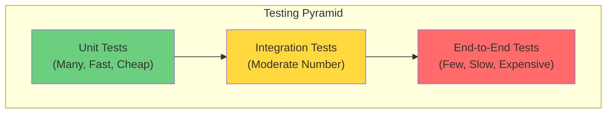
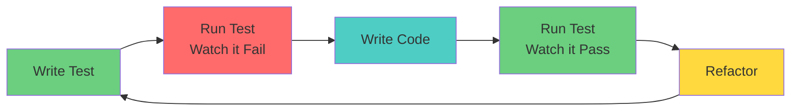
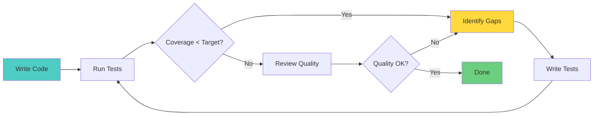
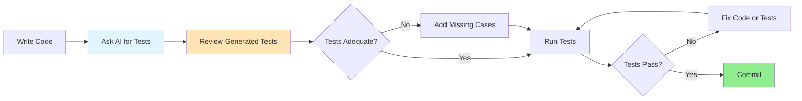
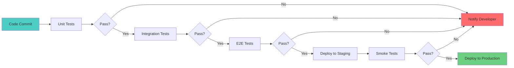

import TestingImage from '/img/undraw_testing.svg';

<div className="text--center margin-bottom--lg">
  <TestingImage width="80%" height="300px" />
</div>

## Introduction

Software testing is a critical process that validates and verifies that a software application or system meets its
requirements and functions as expected. Effective testing not only catches bugs before they reach production but also
ensures code quality, improves reliability, and builds confidence in your software. In modern software development,
testing is not an afterthought—it's an integral part of the development lifecycle.

This chapter explores the fundamental concepts of software testing, different testing strategies, best practices, and
how to build a robust testing culture in your team.

## The Testing Pyramid

The testing pyramid is a framework that helps teams optimize their testing strategy by balancing different types of
tests based on cost, speed, and value.



### Unit Tests

Unit tests verify individual components or functions in isolation. They are:

- **Fast**: Execute in milliseconds
- **Isolated**: Test one thing at a time
- **Reliable**: Deterministic and independent
- **Cheap**: Easy to write and maintain

**Example (JavaScript with Jest):**

```javascript
// Good: Testing a pure function
function calculateTotalPrice(items, taxRate) {
  if (!Array.isArray(items) || items.length === 0) {
    throw new Error('Items must be a non-empty array');
  }

  const subtotal = items.reduce((sum, item) => sum + item.price * item.quantity, 0);
  return subtotal * (1 + taxRate);
}

// Unit test
describe('calculateTotalPrice', () => {
  it('should calculate total price with tax', () => {
    const items = [
      { price: 10, quantity: 2 },
      { price: 5, quantity: 3 },
    ];

    const total = calculateTotalPrice(items, 0.1);
    expect(total).toBe(38.5); // (20 + 15) * 1.1
  });

  it('should throw error for empty items', () => {
    expect(() => calculateTotalPrice([], 0.1)).toThrow('Items must be a non-empty array');
  });
});
```

### Integration Tests

Integration tests verify that different modules or services work together correctly. They test:

- **Database interactions**: Queries, transactions, migrations
- **API endpoints**: Request/response handling
- **Third-party services**: External API integrations
- **Module interactions**: Communication between components

**Example (Node.js with Supertest):**

```javascript
// Good: Testing API endpoint with database
describe('POST /api/users', () => {
  it('should create a new user', async () => {
    const response = await request(app)
      .post('/api/users')
      .send({
        email: 'test@example.com',
        name: 'Test User',
      })
      .expect(201);

    expect(response.body).toHaveProperty('id');
    expect(response.body.email).toBe('test@example.com');

    // Verify user was created in database
    const user = await User.findById(response.body.id);
    expect(user).toBeTruthy();
    expect(user.name).toBe('Test User');
  });
});
```

### End-to-End Tests

End-to-end tests simulate real user scenarios and verify the entire application flow from start to finish. They are:

- **Comprehensive**: Test complete user journeys
- **Realistic**: Use real browsers and environments
- **Slower**: Take longer to execute
- **Fragile**: More prone to flakiness

**Example (Playwright):**

```javascript
// Good: Testing complete user flow
test('user can complete checkout process', async ({ page }) => {
  // Login
  await page.goto('/login');
  await page.fill('[name="email"]', 'user@example.com');
  await page.fill('[name="password"]', 'password123');
  await page.click('button[type="submit"]');

  // Add items to cart
  await page.goto('/products');
  await page.click('[data-testid="add-to-cart-1"]');
  await page.click('[data-testid="add-to-cart-2"]');

  // Checkout
  await page.click('[data-testid="cart-icon"]');
  await page.click('button:has-text("Checkout")');

  // Fill shipping information
  await page.fill('[name="address"]', '123 Main St');
  await page.fill('[name="city"]', 'New York');
  await page.click('button:has-text("Continue")');

  // Verify order confirmation
  await expect(page.locator('h1')).toContainText('Order Confirmed');
});
```

## Testing Strategies

### Test-Driven Development (TDD)

TDD is a development methodology where you write tests before writing the implementation code.



**Benefits:**

- Forces you to think about requirements first
- Results in better test coverage
- Leads to more modular, testable code
- Provides fast feedback loop

**Example TDD Workflow:**

```javascript
// Step 1: Write the test first (Red)
describe('UserValidator', () => {
  it('should validate email format', () => {
    const validator = new UserValidator();
    expect(validator.isValidEmail('test@example.com')).toBe(true);
    expect(validator.isValidEmail('invalid-email')).toBe(false);
  });
});

// Step 2: Run test - it fails (Red)
// Step 3: Write minimum code to pass (Green)
class UserValidator {
  isValidEmail(email) {
    return /^[^\s@]+@[^\s@]+\.[^\s@]+$/.test(email);
  }
}

// Step 4: Run test - it passes (Green)
// Step 5: Refactor if needed while keeping tests green
```

### Behavior-Driven Development (BDD)

BDD extends TDD by using natural language to describe test scenarios, making tests readable by non-technical
stakeholders.

**Example (Cucumber/Gherkin syntax):**

```gherkin
Feature: User Authentication
  As a user
  I want to log in to the application
  So that I can access my account

  Scenario: Successful login with valid credentials
    Given I am on the login page
    When I enter "user@example.com" in the email field
    And I enter "password123" in the password field
    And I click the "Login" button
    Then I should see the dashboard page
    And I should see a welcome message "Welcome back, User!"

  Scenario: Failed login with invalid credentials
    Given I am on the login page
    When I enter "user@example.com" in the email field
    And I enter "wrongpassword" in the password field
    And I click the "Login" button
    Then I should see an error message "Invalid credentials"
    And I should remain on the login page
```

### Branch-Based Testing

[Branch-Based Testing](/branch-based-testing) is a modern testing strategy where each feature branch is tested in an
isolated, ephemeral environment before merging. This approach allows teams to:

- Test new features in production-like environments
- Catch integration issues early
- Enable stakeholder review with real URLs
- Reduce conflicts and deployment risks

Branch-based testing is particularly valuable in continuous delivery pipelines and microservices architectures. Learn
more about this strategy in the dedicated [Branch-Based Testing chapter](/branch-based-testing).

## Testing Best Practices

### 1. Follow the AAA Pattern

Structure your tests using the Arrange-Act-Assert pattern for clarity:

```javascript
// Good: Clear AAA structure
test('should calculate discount correctly', () => {
  // Arrange
  const cart = new ShoppingCart();
  cart.addItem({ price: 100, quantity: 2 });
  const discountCode = 'SAVE20';

  // Act
  const total = cart.applyDiscount(discountCode);

  // Assert
  expect(total).toBe(160); // 200 - 20% = 160
});

// Bad: Mixed responsibilities
test('should work', () => {
  const cart = new ShoppingCart();
  expect(cart.addItem({ price: 100, quantity: 2 })).toBe(true);
  expect(cart.applyDiscount('SAVE20')).toBe(160);
  expect(cart.items.length).toBe(1);
});
```

### 2. Write Independent Tests

Each test should be able to run independently in any order:

```javascript
// Good: Independent tests
beforeEach(() => {
  database.clear();
  mockServer.reset();
});

test('should create user', async () => {
  const user = await createUser({ name: 'Alice' });
  expect(user.id).toBeDefined();
});

test('should find user by email', async () => {
  await createUser({ email: 'test@example.com' });
  const user = await findUserByEmail('test@example.com');
  expect(user).toBeTruthy();
});

// Bad: Tests depend on each other
let userId;

test('should create user', async () => {
  const user = await createUser({ name: 'Alice' });
  userId = user.id; // Shared state
});

test('should update user', async () => {
  await updateUser(userId, { name: 'Bob' }); // Depends on previous test
});
```

### 3. Test Behavior, Not Implementation

Focus on what the code does, not how it does it:

```javascript
// Good: Testing behavior
test('should notify users when order is shipped', async () => {
  const order = await createOrder({ userId: 1, items: [...] });

  await shipOrder(order.id);

  const notifications = await getNotifications(order.userId);
  expect(notifications).toContainEqual(
    expect.objectContaining({
      type: 'ORDER_SHIPPED',
      orderId: order.id
    })
  );
});

// Bad: Testing implementation details
test('should call sendEmail with correct parameters', async () => {
  const sendEmailSpy = jest.spyOn(emailService, 'sendEmail');

  await shipOrder(orderId);

  expect(sendEmailSpy).toHaveBeenCalledWith(
    'user@example.com',
    'Order Shipped',
    expect.any(String)
  );
});
```

### 4. Use Descriptive Test Names

Test names should clearly describe what is being tested:

```javascript
// Good: Descriptive names
describe('OrderService', () => {
  describe('cancelOrder', () => {
    it('should refund payment when order is cancelled within 24 hours', async () => {
      // ...
    });

    it('should not refund payment when order is cancelled after 24 hours', async () => {
      // ...
    });

    it('should throw error when order is already shipped', async () => {
      // ...
    });
  });
});

// Bad: Vague names
test('test1', () => {
  /* ... */
});
test('should work correctly', () => {
  /* ... */
});
test('cancellation', () => {
  /* ... */
});
```

### 5. Keep Tests Fast

Slow tests discourage running them frequently:

```javascript
// Good: Fast test with mocks
test('should process payment', async () => {
  const mockPaymentGateway = {
    charge: jest.fn().mockResolvedValue({ success: true, transactionId: '123' }),
  };

  const service = new PaymentService(mockPaymentGateway);
  const result = await service.processPayment({ amount: 100 });

  expect(result.success).toBe(true);
});

// Bad: Slow test with real API calls
test('should process payment', async () => {
  const service = new PaymentService(realPaymentGateway);
  const result = await service.processPayment({ amount: 100 }); // Real API call

  expect(result.success).toBe(true);
}); // Takes 2-3 seconds
```

## Test Coverage

Test coverage measures the percentage of your code that is executed during tests. While 100% coverage doesn't guarantee
bug-free code, it helps identify untested code paths.



### Coverage Metrics

- **Line Coverage**: Percentage of code lines executed
- **Branch Coverage**: Percentage of decision branches taken
- **Function Coverage**: Percentage of functions called
- **Statement Coverage**: Percentage of statements executed

**Example Coverage Report:**

```javascript
// jest.config.js
module.exports = {
  collectCoverage: true,
  coverageThreshold: {
    global: {
      branches: 80,
      functions: 80,
      lines: 80,
      statements: 80,
    },
  },
  coveragePathIgnorePatterns: ['/node_modules/', '/tests/', '/dist/'],
};
```

:::warning

High test coverage doesn't guarantee high code quality. Focus on meaningful tests that validate important behaviors, not
just coverage numbers.

:::

## Common Testing Anti-Patterns

### 1. Testing Implementation Details

```javascript
// Bad: Testing internal state
test('should set isLoading to true', () => {
  const component = new Component();
  component.fetchData();
  expect(component.isLoading).toBe(true); // Testing internal state
});

// Good: Testing observable behavior
test('should show loading spinner while fetching data', async () => {
  render(<Component />);
  const loadingSpinner = screen.getByTestId('loading');
  expect(loadingSpinner).toBeInTheDocument();
});
```

### 2. Excessive Mocking

```javascript
// Bad: Mocking everything
test('should process order', async () => {
  const mockDb = { save: jest.fn() };
  const mockPayment = { charge: jest.fn() };
  const mockEmail = { send: jest.fn() };
  const mockLogger = { log: jest.fn() };
  const mockCache = { set: jest.fn() };
  // ... testing nothing real
});

// Good: Mock only external dependencies
test('should process order', async () => {
  const mockPaymentGateway = { charge: jest.fn().mockResolvedValue({ success: true }) };
  // Use real database (test DB) and real business logic
});
```

### 3. Flaky Tests

```javascript
// Bad: Time-dependent test
test('should expire after 5 seconds', async () => {
  const cache = new Cache();
  cache.set('key', 'value', 5000);

  await sleep(5100);
  expect(cache.get('key')).toBeUndefined(); // Flaky: timing issues
});

// Good: Deterministic test
test('should expire after TTL', () => {
  const cache = new Cache();
  const mockDate = new Date('2024-01-01T00:00:00Z');
  jest.setSystemTime(mockDate);

  cache.set('key', 'value', 5000);

  jest.setSystemTime(new Date('2024-01-01T00:00:06Z'));
  expect(cache.get('key')).toBeUndefined();
});
```

## Testing Tools and Frameworks

### JavaScript/TypeScript

- **Jest**: Full-featured testing framework
- **Vitest**: Fast, Vite-native unit testing
- **Playwright/Cypress**: E2E testing
- **React Testing Library**: Component testing
- **Supertest**: API testing

### Python

- **pytest**: Popular testing framework
- **unittest**: Built-in testing framework
- **Selenium**: Browser automation

### Java

- **JUnit**: Standard unit testing
- **Mockito**: Mocking framework
- **TestNG**: Testing framework with advanced features

### Go

- **testing**: Built-in testing package
- **testify**: Testing toolkit with assertions

## AI-Powered Test Generation

AI coding assistants are revolutionizing test writing by automatically generating comprehensive test suites, identifying
edge cases, and helping developers write better tests faster. While AI-generated tests still require human review, they
can significantly accelerate test development and improve coverage.

### Benefits of AI Test Generation

- **Faster test creation**: Generate complete test suites in seconds
- **Better edge case coverage**: AI identifies scenarios you might miss
- **Consistent test patterns**: Maintains uniform test structure
- **Learning tool**: See how to test unfamiliar code patterns
- **Reduced testing burden**: Lower barrier to achieving high coverage
- **Boilerplate elimination**: Focus on test logic, not setup code

### Using AI to Generate Tests

#### Pattern 1: Generate Tests from Implementation

```javascript
// Your implementation
function calculateShippingCost(weight, distance, express) {
  if (weight <= 0 || distance <= 0) {
    throw new Error('Weight and distance must be positive');
  }

  const baseRate = 5.0;
  const weightRate = 0.5;
  const distanceRate = 0.1;
  const expressMultiplier = 2.0;

  let cost = baseRate + weight * weightRate + distance * distanceRate;

  if (express) {
    cost *= expressMultiplier;
  }

  return Math.round(cost * 100) / 100;
}

// Prompt to AI:
// "Generate comprehensive Jest tests for this function, including edge cases"

// AI-generated tests:
describe('calculateShippingCost', () => {
  describe('valid inputs', () => {
    it('should calculate standard shipping cost correctly', () => {
      const cost = calculateShippingCost(10, 50, false);
      expect(cost).toBe(15.0); // 5 + (10 * 0.5) + (50 * 0.1)
    });

    it('should calculate express shipping cost correctly', () => {
      const cost = calculateShippingCost(10, 50, true);
      expect(cost).toBe(30.0); // 15 * 2
    });

    it('should handle fractional weights and distances', () => {
      const cost = calculateShippingCost(2.5, 10.5, false);
      expect(cost).toBe(7.3); // 5 + (2.5 * 0.5) + (10.5 * 0.1)
    });

    it('should round to 2 decimal places', () => {
      const cost = calculateShippingCost(1.11, 1.11, false);
      expect(cost).toBe(5.67); // Ensures proper rounding
    });
  });

  describe('edge cases', () => {
    it('should handle zero weight', () => {
      expect(() => calculateShippingCost(0, 50, false)).toThrow('Weight and distance must be positive');
    });

    it('should handle negative weight', () => {
      expect(() => calculateShippingCost(-5, 50, false)).toThrow('Weight and distance must be positive');
    });

    it('should handle zero distance', () => {
      expect(() => calculateShippingCost(10, 0, false)).toThrow('Weight and distance must be positive');
    });

    it('should handle negative distance', () => {
      expect(() => calculateShippingCost(10, -10, false)).toThrow('Weight and distance must be positive');
    });

    it('should handle very large values', () => {
      const cost = calculateShippingCost(1000, 1000, false);
      expect(cost).toBe(605.0);
    });

    it('should handle express flag as false explicitly', () => {
      const cost = calculateShippingCost(10, 10, false);
      expect(cost).toBe(11.0);
    });
  });

  describe('type handling', () => {
    it('should handle string numbers', () => {
      // Note: JavaScript coercion - might want to add validation
      const cost = calculateShippingCost('10', '50', false);
      expect(cost).toBe(15.0);
    });
  });
});
```

#### Pattern 2: Test-Driven Development with AI

```typescript
// Prompt: "I need to implement a user authentication service.
//         Generate tests first for these requirements:
//         - Register new users
//         - Validate email format
//         - Hash passwords
//         - Prevent duplicate emails"

// AI generates tests:
describe('AuthService', () => {
  let authService: AuthService;
  let mockDb: jest.Mocked<Database>;

  beforeEach(() => {
    mockDb = {
      users: {
        create: jest.fn(),
        findByEmail: jest.fn(),
      },
    } as any;
    authService = new AuthService(mockDb);
  });

  describe('registerUser', () => {
    it('should create a new user with valid data', async () => {
      const userData = {
        email: 'test@example.com',
        password: 'SecurePass123!',
        name: 'Test User',
      };

      mockDb.users.findByEmail.mockResolvedValue(null);
      mockDb.users.create.mockResolvedValue({
        id: '123',
        ...userData,
        password: 'hashed_password',
      });

      const user = await authService.registerUser(userData);

      expect(user).toHaveProperty('id');
      expect(user.email).toBe(userData.email);
      expect(user.password).not.toBe(userData.password);
    });

    it('should reject invalid email format', async () => {
      const userData = {
        email: 'invalid-email',
        password: 'SecurePass123!',
        name: 'Test User',
      };

      await expect(authService.registerUser(userData)).rejects.toThrow('Invalid email format');
    });

    it('should reject duplicate email', async () => {
      const userData = {
        email: 'existing@example.com',
        password: 'SecurePass123!',
        name: 'Test User',
      };

      mockDb.users.findByEmail.mockResolvedValue({
        id: '456',
        email: userData.email,
      } as any);

      await expect(authService.registerUser(userData)).rejects.toThrow('Email already exists');
    });

    it('should hash password before storage', async () => {
      const userData = {
        email: 'test@example.com',
        password: 'PlainTextPassword',
        name: 'Test User',
      };

      mockDb.users.findByEmail.mockResolvedValue(null);
      mockDb.users.create.mockResolvedValue({
        id: '123',
        ...userData,
        password: 'hashed_password',
      });

      await authService.registerUser(userData);

      const createCall = mockDb.users.create.mock.calls[0][0];
      expect(createCall.password).not.toBe('PlainTextPassword');
    });
  });
});

// Now implement to make tests pass
// (See TDD section in Prompt Engineering chapter)
```

#### Pattern 3: Generate Tests for Legacy Code

```python
# Prompt: "Generate pytest tests for this legacy code.
#         I need to refactor it but want tests first for safety."

# Legacy code (no tests):
def process_order(order_data):
    items = order_data['items']
    total = 0
    for item in items:
        total += item['price'] * item['qty']

    if order_data['coupon']:
        if order_data['coupon'] == 'SAVE10':
            total = total * 0.9
        elif order_data['coupon'] == 'SAVE20':
            total = total * 0.8

    if total > 100:
        shipping = 0
    else:
        shipping = 10

    return {'total': total + shipping, 'shipping': shipping}

# AI-generated tests:
import pytest

class TestProcessOrder:
    def test_basic_order_calculation(self):
        order = {
            'items': [
                {'price': 10, 'qty': 2},
                {'price': 5, 'qty': 3}
            ],
            'coupon': None
        }
        result = process_order(order)
        assert result['total'] == 45  # 35 + 10 shipping
        assert result['shipping'] == 10

    def test_order_with_save10_coupon(self):
        order = {
            'items': [{'price': 100, 'qty': 1}],
            'coupon': 'SAVE10'
        }
        result = process_order(order)
        assert result['total'] == 90  # 100 * 0.9, free shipping
        assert result['shipping'] == 0

    def test_order_with_save20_coupon(self):
        order = {
            'items': [{'price': 50, 'qty': 2}],
            'coupon': 'SAVE20'
        }
        result = process_order(order)
        assert result['total'] == 80  # 100 * 0.8, free shipping
        assert result['shipping'] == 0

    def test_free_shipping_threshold(self):
        order = {
            'items': [{'price': 101, 'qty': 1}],
            'coupon': None
        }
        result = process_order(order)
        assert result['total'] == 101
        assert result['shipping'] == 0

    def test_shipping_applies_below_threshold(self):
        order = {
            'items': [{'price': 99, 'qty': 1}],
            'coupon': None
        }
        result = process_order(order)
        assert result['total'] == 109
        assert result['shipping'] == 10

    def test_invalid_coupon_ignored(self):
        order = {
            'items': [{'price': 50, 'qty': 1}],
            'coupon': 'INVALID'
        }
        result = process_order(order)
        assert result['total'] == 60  # No discount applied

    def test_empty_items_list(self):
        order = {'items': [], 'coupon': None}
        result = process_order(order)
        assert result['total'] == 10  # Just shipping
        assert result['shipping'] == 10

    @pytest.mark.parametrize('order_data,expected_total', [
        ({'items': [{'price': 10, 'qty': 1}], 'coupon': None}, 20),
        ({'items': [{'price': 10, 'qty': 1}], 'coupon': 'SAVE10'}, 19),
        ({'items': [{'price': 200, 'qty': 1}], 'coupon': None}, 200),
    ])
    def test_various_scenarios(self, order_data, expected_total):
        result = process_order(order_data)
        assert result['total'] == expected_total
```

### Best Practices for AI Test Generation

#### 1. Review and Validate AI Tests

AI-generated tests can have issues:

```javascript
// AI might generate:
test('should handle user creation', async () => {
  const user = await createUser({ name: 'Test' });
  expect(user).toBeTruthy();
});

// Issues:
// ❌ Too vague - what specifically should be tested?
// ❌ No cleanup - test pollution
// ❌ Missing important assertions
// ❌ No edge cases

// Improved version:
describe('createUser', () => {
  afterEach(async () => {
    await cleanupTestUsers();
  });

  it('should create user with all required fields', async () => {
    const userData = {
      name: 'Test User',
      email: 'test@example.com',
      password: 'SecurePass123!',
    };

    const user = await createUser(userData);

    expect(user).toMatchObject({
      name: userData.name,
      email: userData.email,
    });
    expect(user.id).toBeDefined();
    expect(user.password).not.toBe(userData.password); // Should be hashed
    expect(user.createdAt).toBeInstanceOf(Date);
  });

  it('should reject missing required fields', async () => {
    await expect(createUser({ name: 'Test' })).rejects.toThrow('Email is required');
  });
});
```

#### 2. Use AI to Identify Missing Test Cases

```javascript
// Prompt: "Review my tests and suggest missing edge cases"

// Your tests:
describe('divide', () => {
  it('should divide two numbers', () => {
    expect(divide(10, 2)).toBe(5);
  });
});

// AI response:
// Missing test cases:
// 1. Division by zero
// 2. Negative numbers
// 3. Decimal results
// 4. Very large numbers
// 5. NaN/Infinity handling
// 6. String inputs (if applicable)

// Generate these tests:
describe('divide', () => {
  it('should divide two positive numbers', () => {
    expect(divide(10, 2)).toBe(5);
  });

  it('should throw error when dividing by zero', () => {
    expect(() => divide(10, 0)).toThrow('Division by zero');
  });

  it('should handle negative numbers', () => {
    expect(divide(-10, 2)).toBe(-5);
    expect(divide(10, -2)).toBe(-5);
    expect(divide(-10, -2)).toBe(5);
  });

  it('should handle decimal results', () => {
    expect(divide(5, 2)).toBe(2.5);
  });

  it('should handle very large numbers', () => {
    expect(divide(Number.MAX_SAFE_INTEGER, 2)).toBe(Number.MAX_SAFE_INTEGER / 2);
  });
});
```

#### 3. Generate Integration Tests

```typescript
// Prompt: "Generate integration tests for this API endpoint"

// Your API endpoint:
app.post('/api/orders', authenticate, async (req, res) => {
  const { items, shippingAddress } = req.body;
  const order = await orderService.create({
    userId: req.user.id,
    items,
    shippingAddress,
  });
  res.status(201).json(order);
});

// AI-generated integration tests:
describe('POST /api/orders', () => {
  let authToken: string;
  let testUser: User;

  beforeAll(async () => {
    testUser = await createTestUser();
    authToken = generateAuthToken(testUser.id);
  });

  afterAll(async () => {
    await cleanupTestData();
  });

  it('should create order with valid data', async () => {
    const orderData = {
      items: [
        { productId: '123', quantity: 2 },
        { productId: '456', quantity: 1 },
      ],
      shippingAddress: {
        street: '123 Main St',
        city: 'New York',
        zipCode: '10001',
      },
    };

    const response = await request(app)
      .post('/api/orders')
      .set('Authorization', `Bearer ${authToken}`)
      .send(orderData)
      .expect(201);

    expect(response.body).toHaveProperty('id');
    expect(response.body.userId).toBe(testUser.id);
    expect(response.body.items).toHaveLength(2);

    // Verify in database
    const order = await Order.findById(response.body.id);
    expect(order).toBeTruthy();
  });

  it('should return 401 without authentication', async () => {
    await request(app).post('/api/orders').send({}).expect(401);
  });

  it('should return 400 with invalid data', async () => {
    const response = await request(app)
      .post('/api/orders')
      .set('Authorization', `Bearer ${authToken}`)
      .send({ items: [] }) // Empty items
      .expect(400);

    expect(response.body).toHaveProperty('error');
  });

  it('should return 404 for non-existent products', async () => {
    await request(app)
      .post('/api/orders')
      .set('Authorization', `Bearer ${authToken}`)
      .send({
        items: [{ productId: 'non-existent', quantity: 1 }],
        shippingAddress: { street: 'Test', city: 'Test', zipCode: '12345' },
      })
      .expect(404);
  });
});
```

#### 4. Generate Property-Based Tests

```javascript
// Prompt: "Generate property-based tests using fast-check for this sort function"

import fc from 'fast-check';

// AI generates:
describe('customSort property-based tests', () => {
  it('should maintain array length', () => {
    fc.assert(
      fc.property(fc.array(fc.integer()), (arr) => {
        const sorted = customSort([...arr]);
        expect(sorted.length).toBe(arr.length);
      })
    );
  });

  it('should contain same elements', () => {
    fc.assert(
      fc.property(fc.array(fc.integer()), (arr) => {
        const sorted = customSort([...arr]);
        const originalSorted = [...arr].sort((a, b) => a - b);
        expect(sorted).toEqual(originalSorted);
      })
    );
  });

  it('should be idempotent', () => {
    fc.assert(
      fc.property(fc.array(fc.integer()), (arr) => {
        const sorted1 = customSort([...arr]);
        const sorted2 = customSort([...sorted1]);
        expect(sorted1).toEqual(sorted2);
      })
    );
  });

  it('should produce sorted output', () => {
    fc.assert(
      fc.property(fc.array(fc.integer()), (arr) => {
        const sorted = customSort([...arr]);
        for (let i = 1; i < sorted.length; i++) {
          expect(sorted[i]).toBeGreaterThanOrEqual(sorted[i - 1]);
        }
      })
    );
  });
});
```

### AI Tools for Test Generation

**GitHub Copilot**

- Inline test suggestions as you type
- Complete test suite generation from function signatures
- Pattern recognition for similar tests

**Cursor AI**

- Generate tests for entire files
- Explain existing tests
- Suggest missing coverage

**Tabnine**

- Context-aware test completions
- Team learning from existing test patterns

**Specialized Tools**

- **Codium AI**: Dedicated test generation
- **DiffBlue Cover**: Java test generation
- **Ponicode**: JavaScript/TypeScript test generation

### Limitations and Gotchas

:::warning AI Test Generation Limitations

AI-generated tests require careful review:

- **False sense of security**: High coverage doesn't mean good tests
- **Missing business logic**: AI doesn't understand domain requirements
- **Over-mocking**: May mock too much, missing integration issues
- **Outdated patterns**: May suggest deprecated testing approaches
- **No test maintenance**: Doesn't update tests when code changes

:::

**What AI Does Well:**

- Boilerplate test structure
- Common edge cases (null, empty, negative)
- Standard happy path scenarios
- Test setup and teardown code

**What Requires Human Judgment:**

- Business logic validation
- Security test scenarios
- Performance test criteria
- User experience testing
- Complex integration scenarios

### Workflow Integration



:::tip Learn More

For advanced prompting techniques to generate better tests, see the [Prompt Engineering](/prompt-engineering) chapter,
specifically the "Testing and Test Generation" section.

:::

## Continuous Testing

Integrate testing into your CI/CD pipeline to catch issues early:



**Example GitHub Actions Workflow:**

```yaml
name: Test Suite

on: [push, pull_request]

jobs:
  test:
    runs-on: ubuntu-latest

    steps:
      - uses: actions/checkout@v3

      - name: Setup Node.js
        uses: actions/setup-node@v3
        with:
          node-version: '18'

      - name: Install dependencies
        run: npm ci

      - name: Run unit tests
        run: npm run test:unit

      - name: Run integration tests
        run: npm run test:integration

      - name: Upload coverage
        uses: codecov/codecov-action@v3
        with:
          files: ./coverage/coverage-final.json

      - name: Run E2E tests
        run: npm run test:e2e
```

## Conclusion

Effective software testing is essential for building reliable, maintainable applications. By following the testing
pyramid, implementing appropriate testing strategies like TDD, BDD, and [branch-based testing](/branch-based-testing),
and adhering to best practices, you can create a robust test suite that provides confidence in your code.

Key takeaways:

- **Write tests at multiple levels**: Balance unit, integration, and E2E tests
- **Test behavior, not implementation**: Focus on what your code does
- **Keep tests fast and independent**: Enable quick feedback loops
- **Integrate testing into CI/CD**: Catch issues before they reach production
- **Maintain your tests**: Treat test code with the same care as production code
- **Use coverage as a guide**: Not a goal, but a tool to find gaps

Remember, the goal of testing is not to achieve 100% coverage, but to build confidence in your software and catch issues
early. Start with the most critical paths, gradually expand coverage, and continuously refine your testing approach
based on the types of bugs you encounter.

## Further Reading

### Related Chapters

- [Branch-Based Testing](/branch-based-testing) - Learn about testing in ephemeral environments

### Testing Fundamentals

- [Static vs Unit vs Integration vs E2E Testing for Frontend Apps](https://kentcdodds.com/blog/static-vs-unit-vs-integration-vs-e2e-tests)
  by Kent C. Dodds - Comprehensive guide to test types and when to use each
- [The Testing Trophy and Testing Classifications](https://kentcdodds.com/blog/the-testing-trophy-and-testing-classifications)
  by Kent C. Dodds - An alternative perspective to the testing pyramid
- [Test Pyramid](https://martinfowler.com/articles/practical-test-pyramid.html) by Martin Fowler - Classic guide to
  testing strategy

### Testing Best Practices

- [Common Testing Mistakes](https://kentcdodds.com/blog/common-testing-mistakes) by Kent C. Dodds - Avoid these common
  pitfalls
- [Testing Implementation Details](https://kentcdodds.com/blog/testing-implementation-details) by Kent C. Dodds - Why
  you should test behavior, not implementation
- [AHA Testing 💡](https://kentcdodds.com/blog/aha-testing) by Kent C. Dodds - Avoid Hasty Abstractions in your tests
- [Avoid Nesting when you're Testing](https://kentcdodds.com/blog/avoid-nesting-when-youre-testing) by Kent C. Dodds -
  Keep tests simple and readable
- [Testing Best Practices](https://github.com/goldbergyoni/javascript-testing-best-practices) - Comprehensive JavaScript
  testing guide

### Framework-Specific

- [Common mistakes with React Testing Library](https://kentcdodds.com/blog/common-mistakes-with-react-testing-library)
  by Kent C. Dodds - React-specific testing advice
- [Effective Snapshot Testing](https://kentcdodds.com/blog/effective-snapshot-testing) by Kent C. Dodds - When and how
  to use snapshot tests

### Continuous Integration

- [Continuous Integration/Continuous Delivery](https://martinfowler.com/articles/continuousIntegration.html) by Martin
  Fowler - CI/CD fundamentals
