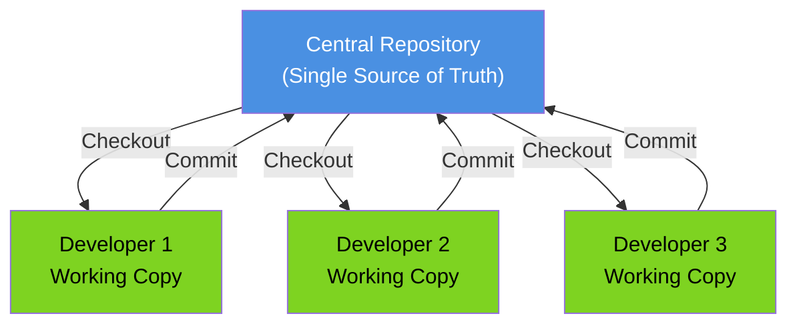
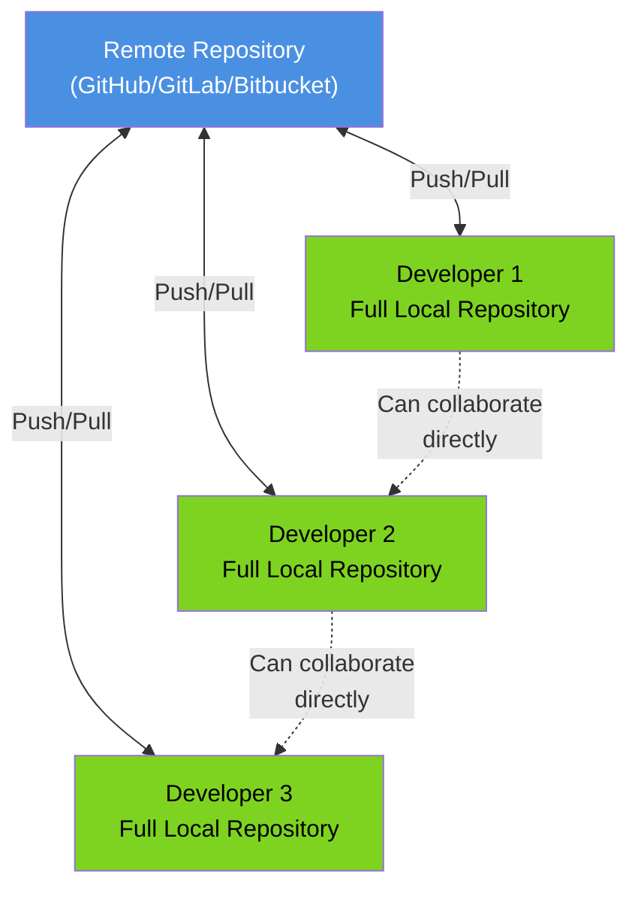
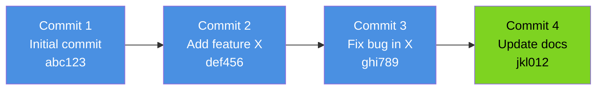
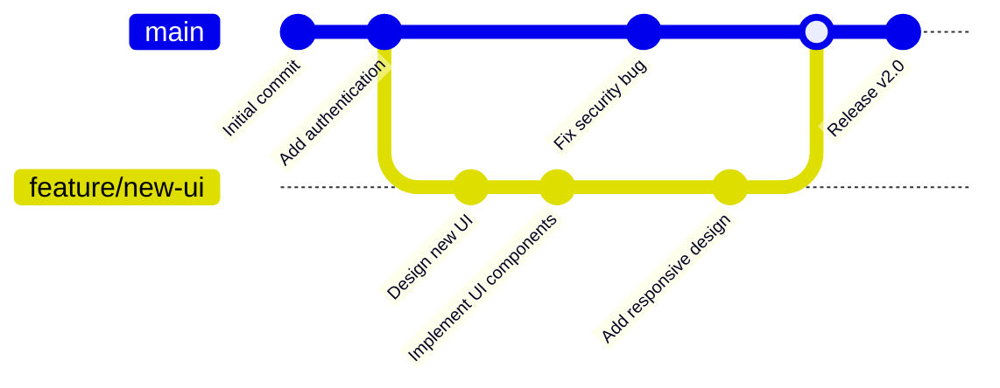
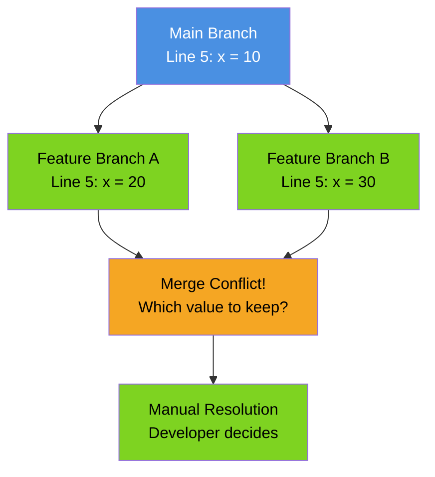
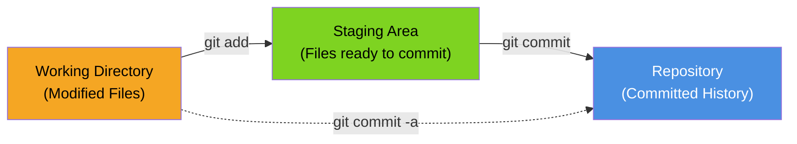

import VersionControlImage from '/img/undraw_version_control.svg';

<div className="text--center margin-bottom--lg">
  <VersionControlImage width="80%" height="300px" />
</div>

Version Control Systems (VCS), also known as Source Control Management (SCM) systems, are essential tools in modern
software development. They track and manage changes to source code over time, enabling teams to collaborate effectively,
maintain a complete history of modifications, and recover from mistakes. This chapter explores the fundamentals of
version control systems, their types, core concepts, and best practices for their effective use.

## Why Use Version Control?

Version control systems provide numerous benefits that are fundamental to professional software development:

### Collaboration

Multiple developers can work on the same codebase simultaneously without overwriting each other's changes. VCS manages
concurrent modifications and helps resolve conflicts when they occur.

### History and Audit Trail

Every change is recorded with metadata including who made the change, when it was made, and why (through commit
messages). This complete history serves as an audit trail and documentation of how the codebase evolved.

### Backup and Recovery

Since the entire history is stored, you can recover any previous version of the code. If a bug is introduced, you can
roll back to a known good state or identify exactly when the bug was introduced.

### Branching and Experimentation

VCS allows you to create branches to experiment with new features or try risky changes without affecting the stable
codebase. If the experiment succeeds, you can merge it back; if not, you can simply discard the branch.

### Code Review and Quality

Modern version control workflows integrate with pull request or merge request systems, enabling peer review before code
is merged into the main codebase.

## Types of Version Control Systems

Version control systems can be categorized into two main types:

### Centralized Version Control Systems (CVCS)

In centralized systems, there is a single central repository that stores all versioned files. Developers check out files
from this central location, make changes, and commit them back.



**Examples**: Subversion (SVN), CVS, Perforce

**Advantages**:

- Simple to understand and set up
- Fine-grained access control
- Easier to maintain a single source of truth

**Disadvantages**:

- Single point of failure (if the server goes down, no one can commit)
- Requires network access for most operations
- Slower operations due to network communication
- Limited offline capabilities

### Distributed Version Control Systems (DVCS)

In distributed systems, every developer has a complete copy of the repository, including its full history. Developers
can commit changes locally and sync with remote repositories when needed.



**Examples**: Git, Mercurial, Bazaar

**Advantages**:

- Full repository history available locally
- Fast operations (most operations are local)
- Can work offline
- No single point of failure
- Flexible workflows

**Disadvantages**:

- Steeper learning curve
- More complex for beginners
- Can be harder to maintain consistent access control
- Large repositories with binary files can become unwieldy

## Core Concepts

Understanding these fundamental concepts is essential for effectively using any version control system:

### Repository

A repository (or "repo") is a data structure that stores metadata for a set of files and directories, along with their
complete change history. It contains all versions of all files that have ever been committed.

### Working Directory

The working directory is where you actually work on files. It's a checked-out copy of a specific version (usually the
latest) from the repository.

### Commit

A commit is a snapshot of changes made to the repository at a specific point in time. Each commit has:

- A unique identifier (hash in Git)
- Author information
- Timestamp
- Commit message describing the changes
- Reference to parent commit(s)



### Branch

A branch is a parallel line of development. It allows you to diverge from the main line of development and work
independently without affecting the main codebase.



### Merge

Merging is the process of combining changes from one branch into another. When you merge, the VCS attempts to
automatically combine the changes, but conflicts may occur if the same lines were modified in both branches.

### Conflict

A conflict occurs when the VCS cannot automatically merge changes because the same part of a file was modified in
different ways in different branches. Conflicts must be resolved manually.



### Tag

A tag is a named reference to a specific commit, typically used to mark release points (v1.0, v2.0, etc.). Unlike
branches, tags are immutable.

### Clone

Cloning creates a complete copy of a repository, including all history and branches. This is how developers typically
start working with an existing project in a DVCS.

### Push and Pull

- **Push**: Upload local commits to a remote repository
- **Pull**: Download commits from a remote repository and merge them into your local branch

### Staging Area (Index)

In systems like Git, the staging area is an intermediate area where commits can be formatted and reviewed before
completing the commit. This allows you to craft precise commits containing only related changes.



## Popular Version Control Systems

### Git

Git is by far the most popular version control system today, created by Linus Torvalds in 2005 for Linux kernel
development. It's a distributed system designed for speed, efficiency, and support for non-linear development.

**Key Features**:

- Fast and efficient
- Strong support for branching and merging
- Distributed architecture
- Data integrity (cryptographic hashing)
- Large ecosystem (GitHub, GitLab, Bitbucket)

**Basic Git Workflow**:

```shell
# Clone a repository
git clone https://github.com/user/repository.git

# Create a new branch
git checkout -b feature/new-feature

# Make changes and stage them
git add .

# Commit changes
git commit -m "Add new feature"

# Push to remote repository
git push origin feature/new-feature

# Create pull request (on GitHub/GitLab)
# After review and approval, merge to main branch
```

### Subversion (SVN)

Subversion is a centralized version control system that was designed to be a better CVS. It's still widely used in
enterprise environments.

**Key Features**:

- Centralized model
- Directory versioning
- Atomic commits
- Versioned metadata
- Better handling of binary files than Git

**Basic SVN Workflow**:

```shell
# Check out a repository
svn checkout https://repository.example.com/svn/project

# Update working copy
svn update

# Make changes and check status
svn status

# Add new files
svn add newfile.txt

# Commit changes
svn commit -m "Add new file"
```

### Mercurial

Mercurial is a distributed version control system similar to Git, known for its ease of use and performance.

**Key Features**:

- Distributed architecture
- Easier learning curve than Git
- Good performance with large repositories
- Built-in web interface

## Comparison: Git vs SVN

| Feature            | Git (DVCS)                   | SVN (CVCS)                           |
| ------------------ | ---------------------------- | ------------------------------------ |
| **Architecture**   | Distributed                  | Centralized                          |
| **Speed**          | Very fast (local operations) | Slower (network operations)          |
| **Offline Work**   | Full capabilities            | Limited                              |
| **Branching**      | Lightweight, fast            | Heavier, slower                      |
| **Learning Curve** | Steeper                      | Gentler                              |
| **Storage**        | Every clone has full history | Only central server has full history |
| **Binary Files**   | Can be problematic           | Better support                       |
| **Access Control** | Branch/repo level            | File/directory level                 |
| **Popularity**     | Dominant in open source      | Common in enterprise                 |

## Version Control Workflows

Different teams adopt different workflows based on their needs. Here are some common patterns:

### Centralized Workflow

All developers work on a single branch (main/master) and commit directly to it. Simple but risky for large teams.

### Feature Branch Workflow

Each feature is developed in a dedicated branch. Features are merged back to main when complete. See the
[Branching Strategies](./branching-strategies) chapter for more details.

### Gitflow Workflow

A more complex workflow with multiple branch types: main, develop, feature, release, and hotfix branches. Suitable for
projects with scheduled releases.

### Forking Workflow

Each developer has their own server-side repository. Changes are integrated through pull requests from forks to the main
repository. Common in open source projects.

### Trunk-Based Development

Developers work in short-lived branches (or directly on trunk) and merge frequently. Requires strong testing automation.
See the [Branching Strategies](./branching-strategies) chapter for more details.

## Best Practices

Following these best practices will help you use version control systems effectively:

### Write Meaningful Commit Messages

A good commit message explains what changed and why. Follow this format:

```
Short summary (50 characters or less)

More detailed explanation if needed (wrap at 72 characters).
Explain the problem this commit solves and why you chose this
solution over alternatives.

- Bullet points are okay
- Use imperative mood: "Fix bug" not "Fixed bug"
- Reference issue numbers: Fixes #123
```

**Good Examples**:

```
Add user authentication using JWT tokens

This implements JWT-based authentication to replace the old
session-based approach. JWT tokens provide better scalability
and allow for stateless authentication across multiple servers.

Fixes #456
```

**Bad Examples**:

```
Update stuff
Fixed things
WIP
More changes
```

### Commit Often, Push Frequently

Make small, logical commits that represent a single change or fix. This makes it easier to:

- Review changes
- Identify when bugs were introduced
- Revert specific changes if needed

Push your changes regularly to back them up and share your work with the team.

### Use Branches Effectively

- Create branches for features, experiments, and bug fixes
- Keep branches short-lived when possible
- Delete branches after merging
- Use descriptive branch names: `feature/user-authentication`, `bugfix/login-timeout`, `hotfix/security-patch`

### Don't Commit Generated Files

Avoid committing files that can be generated from source code (compiled binaries, build artifacts, dependencies, etc.).
Use `.gitignore` or similar mechanisms to exclude them.

**What to exclude**:

- Compiled code (`*.o`, `*.pyc`, `*.class`)
- Dependencies (`node_modules/`, `vendor/`)
- Build outputs (`dist/`, `build/`, `target/`)
- IDE-specific files (`.vscode/`, `.idea/`)
- Log files (`*.log`)
- Environment-specific configuration with secrets

### Review Before Committing

Before committing:

- Review your changes with `git diff` or equivalent
- Ensure you're only committing related changes
- Test your code
- Check for debug code, console logs, or temporary changes

### Use Tags for Releases

Tag release points with version numbers:

```shell
git tag -a v1.0.0 -m "Release version 1.0.0"
git push origin v1.0.0
```

### Keep the Main Branch Stable

The main/master branch should always be in a deployable state. Use branch protection rules and require reviews before
merging.

### Resolve Conflicts Promptly

When conflicts occur:

1. Communicate with your team
2. Understand both changes
3. Resolve carefully and test thoroughly
4. Don't just blindly accept one version over another

### Back Up Your Repository

Even with distributed systems, maintain backups:

- Use remote repositories (GitHub, GitLab, Bitbucket)
- Set up multiple remotes if needed
- Regular repository backups for critical projects

### Learn and Use Advanced Features

Invest time in learning:

- Interactive staging (`git add -p`)
- Interactive rebasing (`git rebase -i`)
- Cherry-picking commits (`git cherry-pick`)
- Bisecting to find bugs (`git bisect`)
- Stashing changes (`git stash`)

## Common Pitfalls to Avoid

### Committing Secrets or Sensitive Data

Never commit passwords, API keys, private keys, or other secrets to version control. Use environment variables or secret
management tools instead.

If you accidentally commit secrets:

1. Immediately rotate/invalidate the exposed credentials
2. Use tools like `git-filter-branch` or `BFG Repo-Cleaner` to remove them from history
3. Force push the cleaned history (coordinate with team)

### Large Binary Files

Version control systems, especially Git, aren't designed for large binary files. They can bloat your repository and slow
down operations.

**Solutions**:

- Use Git LFS (Large File Storage) for large files
- Store binary artifacts in dedicated artifact repositories
- Consider alternative storage for media files

### Working Directly on Main

Avoid making changes directly on the main/master branch, especially in team environments. Always use feature branches.

### Ignoring Merge Conflicts

Don't rush through conflict resolution. Take time to understand what each change does and test thoroughly after
resolving conflicts.

### Rewriting Public History

Never rebase or force-push commits that others have already pulled. This rewrites history and can cause serious problems
for your team.

```shell
# Dangerous! Only do this on your own unpushed branches
git push --force
```

### Not Pulling Before Pushing

Always pull the latest changes before pushing your work to avoid conflicts and rejected pushes.

```shell
# Good practice
git pull
git push
```

## Integration with Development Tools

Modern version control systems integrate with numerous development tools:

### Code Review Tools

- GitHub Pull Requests
- GitLab Merge Requests
- Bitbucket Pull Requests
- Gerrit Code Review
- Crucible

### CI/CD Integration

Version control triggers are the foundation of CI/CD pipelines:

- Automated testing on every commit
- Automated deployment on merge to main
- Build artifacts for every release tag

See the [Branch-Based Testing](./branch-based-testing) chapter for more details on testing strategies.

### Issue Tracking

Link commits to issues:

- Reference issues in commit messages (`Fixes #123`)
- Automatic issue closing on merge
- Traceability from code to requirements

### IDEs and Editors

Most modern IDEs have built-in VCS integration:

- Visual Studio Code (Git integration)
- IntelliJ IDEA (Git, SVN, Mercurial)
- Eclipse (Git, SVN via plugins)
- Vim/Emacs (fugitive, magit)

## Version Control for Large Scale Projects

Managing version control at scale requires additional considerations:

### Monorepo vs Polyrepo

**Monorepo**: All code in a single repository

- Easier code sharing and refactoring across projects
- Simplified dependency management
- Atomic changes across multiple projects
- Can become very large and slow

**Polyrepo**: Separate repositories for each project/service

- Better isolation and access control
- Easier to scale repository size
- More complex dependency management
- Harder to make atomic cross-project changes

### Git Submodules and Subtrees

For managing dependencies between repositories:

- **Submodules**: Reference other repositories at specific commits
- **Subtrees**: Embed other repositories as subdirectories

### Performance Optimization

For large repositories:

- Use shallow clones (`git clone --depth 1`)
- Use sparse checkouts to only fetch needed files
- Use Git LFS for large files
- Consider repository splitting if it becomes unmanageable

## Version Control in Agile Development

Version control is integral to agile methodologies. See the [Agile Methodologies](./agile-methodologies) chapter for
more context.

### Continuous Integration

Every commit triggers automated builds and tests, ensuring the codebase remains in a working state.

### Frequent Merging

Agile teams merge frequently to avoid large, painful merges and to share work quickly.

### Feature Flags

Combined with version control, feature flags allow incomplete features to be merged without affecting production. See
the [Feature Flags](./feature-flags) chapter for details.

### Sprint Branches

Some teams create branches for each sprint, merging completed work at the end of the sprint.

## Documentation and Version Control

Version control isn't just for code. Many teams version control:

- Documentation
- Configuration files
- Infrastructure as Code (IaC)
- Design files
- Test data

This provides the same benefits: history, collaboration, and recovery. See the [Documentation](./documentation) chapter
for best practices.

## Security Considerations

### Access Control

Implement appropriate access controls:

- Read access: Who can view the code?
- Write access: Who can push commits?
- Admin access: Who can modify repository settings?

### Branch Protection

Protect important branches:

- Require pull requests for main branch
- Require reviews before merging
- Require status checks to pass
- Prevent force pushes
- Prevent deletion

### Audit Logs

Maintain audit logs for:

- Who accessed the repository
- What changes were made
- When changes occurred
- Repository configuration changes

### Code Scanning

Integrate security scanning:

- Secret scanning (detect committed secrets)
- Dependency scanning (vulnerable dependencies)
- Static analysis security testing (SAST)
- License compliance checking

## The Future of Version Control

Version control systems continue to evolve:

### Performance Improvements

- Faster operations for large repositories
- Better support for large files
- More efficient storage

### Better Collaboration Features

- Real-time collaboration tools
- Better conflict resolution interfaces
- Enhanced code review capabilities

### AI Integration

- AI-assisted commit messages
- Intelligent conflict resolution suggestions
- Automated code review assistance

### Blockchain-Based VCS

Experimental systems using blockchain for immutable audit trails and decentralized collaboration.

## Conclusion

Version control systems are indispensable tools in modern software development. They enable collaboration, maintain
history, facilitate code review, and provide safety nets for experimentation. While Git has become the de facto
standard, understanding the principles behind version control helps you use any VCS effectively.

Key takeaways:

- Use version control for all code and configuration
- Commit frequently with meaningful messages
- Use branches for features and experiments
- Review changes before committing
- Keep the main branch stable and deployable
- Integrate version control with your development workflow
- Never commit secrets or large binary files without proper handling
- Learn advanced features to improve your productivity

Whether you're working solo or in a large team, on a small script or a massive enterprise application, version control
should be an integral part of your development process. The time invested in learning and properly using version control
systems pays dividends in code quality, team productivity, and peace of mind.

## References

- [Pro Git Book](https://git-scm.com/book/en/v2) by Scott Chacon and Ben Straub
- [Version Control with Git](https://amzn.to/3ZSYxno) by Jon Loeliger and Matthew McCullough
- [Git documentation](https://git-scm.com/doc)
- [Subversion documentation](https://subversion.apache.org/docs/)
- [Mercurial documentation](https://www.mercurial-scm.org/doc)
- [Atlassian Git tutorials](https://www.atlassian.com/git/tutorials)
- [GitHub Guides](https://guides.github.com/)
- [GitLab documentation](https://docs.gitlab.com/)
- [Git LFS documentation](https://git-lfs.github.com/)
- [Comparing Git Workflows](https://www.atlassian.com/git/tutorials/comparing-workflows)
- [A successful Git branching model](https://nvie.com/posts/a-successful-git-branching-model/) by Vincent Driessen
- [Trunk Based Development](https://trunkbaseddevelopment.com/)
